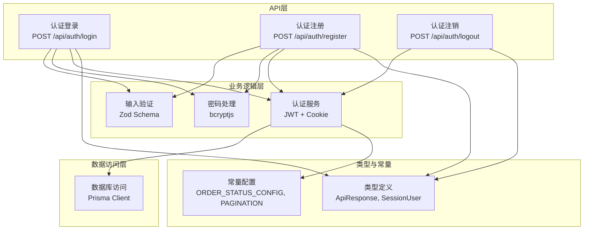
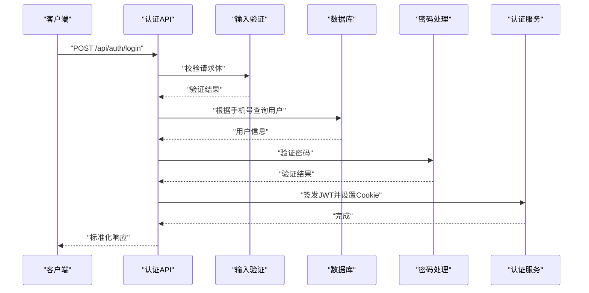
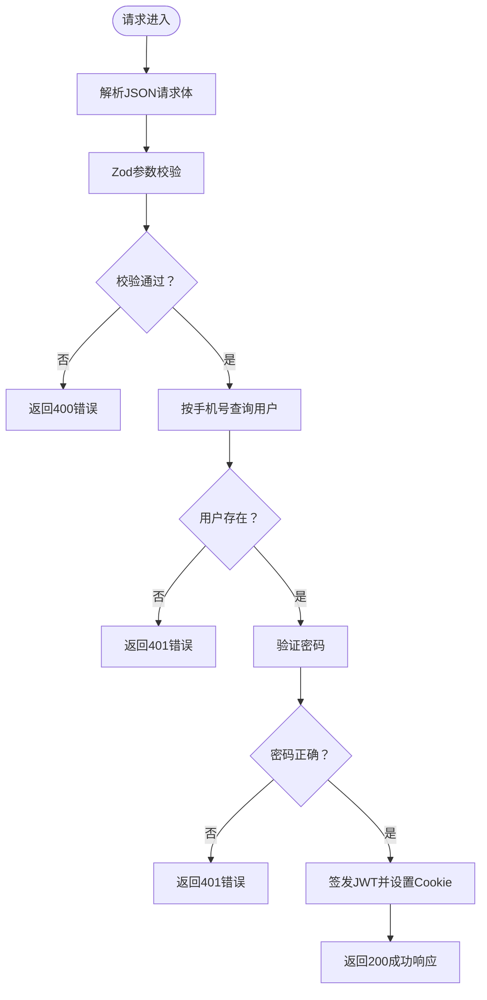
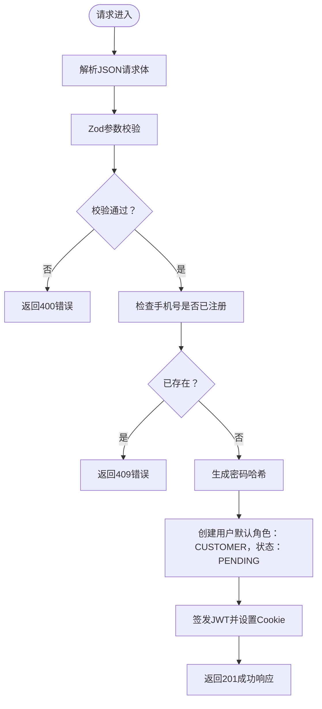
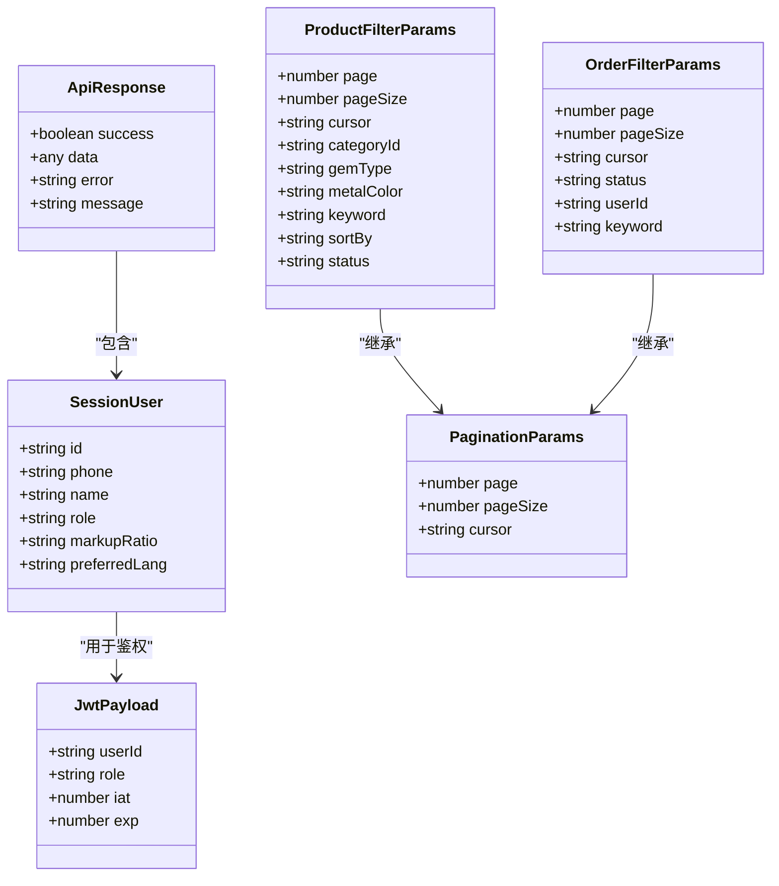
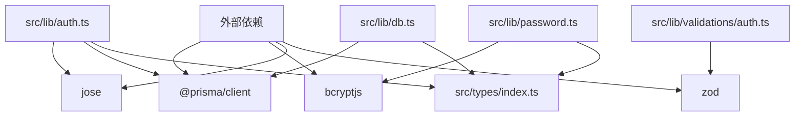

# API接口文档

<cite>
**本文档引用的文件**
- [README.md](file://README.md)
- [package.json](file://package.json)
- [src/app/api/auth/login/route.ts](file://src/app/api/auth/login/route.ts)
- [src/app/api/auth/register/route.ts](file://src/app/api/auth/register/route.ts)
- [src/app/api/auth/logout/route.ts](file://src/app/api/auth/logout/route.ts)
- [src/lib/db.ts](file://src/lib/db.ts)
- [src/lib/auth.ts](file://src/lib/auth.ts)
- [src/lib/password.ts](file://src/lib/password.ts)
- [src/lib/validations/auth.ts](file://src/lib/validations/auth.ts)
- [src/types/index.ts](file://src/types/index.ts)
- [src/lib/constants.ts](file://src/lib/constants.ts)
</cite>

## 目录
1. [简介](#简介)
2. [项目结构](#项目结构)
3. [核心组件](#核心组件)
4. [架构概览](#架构概览)
5. [详细组件分析](#详细组件分析)
6. [依赖关系分析](#依赖关系分析)
7. [性能考虑](#性能考虑)
8. [故障排除指南](#故障排除指南)
9. [结论](#结论)
10. [附录](#附录)

## 简介
本文件为 Celestia 项目的 API 接口文档，基于仓库中的实际代码实现进行编写。文档覆盖认证与授权机制、错误处理策略、状态码规范，并对用户认证 API（登录、注册、注销）进行详细说明。由于当前仓库未包含商品管理、订单管理及文件上传等 API 的具体实现，本文档将重点聚焦于已实现的认证相关接口，并提供扩展指导以便后续添加其他功能模块。

## 项目结构
项目采用 Next.js App Router 结构，API 路由位于 `src/app/api/` 目录下，业务逻辑集中在 `src/lib/` 目录中，类型定义位于 `src/types/`，数据库访问通过 Prisma 实现。

**图表来源**
- [src/app/api/auth/login/route.ts:1-76](file://src/app/api/auth/login/route.ts#L1-L76)
- [src/app/api/auth/register/route.ts:1-84](file://src/app/api/auth/register/route.ts#L1-L84)
- [src/app/api/auth/logout/route.ts:1-22](file://src/app/api/auth/logout/route.ts#L1-L22)
- [src/lib/validations/auth.ts:1-17](file://src/lib/validations/auth.ts#L1-L17)
- [src/lib/password.ts:1-18](file://src/lib/password.ts#L1-L18)
- [src/lib/auth.ts:1-99](file://src/lib/auth.ts#L1-L99)
- [src/lib/db.ts:1-12](file://src/lib/db.ts#L1-L12)
- [src/types/index.ts:1-58](file://src/types/index.ts#L1-L58)
- [src/lib/constants.ts:1-46](file://src/lib/constants.ts#L1-L46)

**章节来源**
- [README.md:1-37](file://README.md#L1-L37)
- [package.json:1-50](file://package.json#L1-L50)

## 核心组件
- API 响应格式：统一的响应结构包含 success、data、error 和 message 字段，便于前端一致化处理。
- 输入验证：使用 Zod 对请求参数进行严格校验，确保数据完整性与安全性。
- 密码处理：使用 bcryptjs 进行密码哈希与验证，保障用户凭据安全。
- 认证机制：基于 JWT 的无状态认证，配合 HttpOnly Cookie 存储令牌，支持 7 天有效期。
- 数据访问：通过 Prisma Client 进行数据库操作，开发环境启用查询日志以辅助调试。

**章节来源**
- [src/types/index.ts:1-7](file://src/types/index.ts#L1-L7)
- [src/lib/validations/auth.ts:1-17](file://src/lib/validations/auth.ts#L1-L17)
- [src/lib/password.ts:1-18](file://src/lib/password.ts#L1-L18)
- [src/lib/auth.ts:1-99](file://src/lib/auth.ts#L1-L99)
- [src/lib/db.ts:1-12](file://src/lib/db.ts#L1-L12)

## 架构概览
认证流程涉及请求验证、用户查询、密码校验、令牌签发与 Cookie 设置，最终返回标准化响应。

**图表来源**
- [src/app/api/auth/login/route.ts:13-75](file://src/app/api/auth/login/route.ts#L13-L75)
- [src/lib/validations/auth.ts:1-17](file://src/lib/validations/auth.ts#L1-L17)
- [src/lib/password.ts:1-18](file://src/lib/password.ts#L1-L18)
- [src/lib/auth.ts:1-99](file://src/lib/auth.ts#L1-L99)
- [src/lib/db.ts:1-12](file://src/lib/db.ts#L1-L12)

## 详细组件分析

### 认证API总览
- 统一响应格式：success、data、error、message
- 错误处理策略：参数校验失败返回 400；认证失败返回 401；资源冲突返回 409；服务器异常返回 500
- 安全考虑：密码使用 bcrypt 哈希；JWT 使用 HS256 算法；Cookie 设置 httpOnly、secure、sameSite 属性

**章节来源**
- [src/types/index.ts:1-7](file://src/types/index.ts#L1-L7)
- [src/app/api/auth/login/route.ts:18-24](file://src/app/api/auth/login/route.ts#L18-L24)
- [src/app/api/auth/login/route.ts:33-38](file://src/app/api/auth/login/route.ts#L33-L38)
- [src/app/api/auth/register/route.ts:13-19](file://src/app/api/auth/register/route.ts#L13-L19)
- [src/app/api/auth/register/route.ts:28-33](file://src/app/api/auth/register/route.ts#L28-L33)
- [src/lib/auth.ts:38-47](file://src/lib/auth.ts#L38-L47)

### 登录API
- 方法与路径：POST /api/auth/login
- 请求体参数：
  - phone: 字符串，长度 5-20
  - password: 字符串，至少 6 位
- 成功响应：返回用户会话信息（id、phone、name、role、markupRatio、preferredLang）以及用户状态字段
- 状态码：
  - 200：登录成功
  - 400：请求参数无效
  - 401：手机号或密码错误
  - 500：服务器内部错误

**图表来源**
- [src/app/api/auth/login/route.ts:13-75](file://src/app/api/auth/login/route.ts#L13-L75)
- [src/lib/validations/auth.ts:1-6](file://src/lib/validations/auth.ts#L1-L6)
- [src/lib/password.ts:1-18](file://src/lib/password.ts#L1-L18)
- [src/lib/auth.ts:13-47](file://src/lib/auth.ts#L13-L47)

**章节来源**
- [src/app/api/auth/login/route.ts:1-76](file://src/app/api/auth/login/route.ts#L1-L76)
- [src/lib/validations/auth.ts:1-6](file://src/lib/validations/auth.ts#L1-L6)
- [src/lib/password.ts:1-18](file://src/lib/password.ts#L1-L18)
- [src/lib/auth.ts:1-99](file://src/lib/auth.ts#L1-L99)

### 注册API
- 方法与路径：POST /api/auth/register
- 请求体参数：
  - phone: 字符串，长度 5-20
  - password: 字符串，至少 6 位
  - name: 字符串，长度 1-100
  - company: 字符串（可选），最大长度 200
- 成功响应：返回新创建用户的会话信息（id、phone、name、role、markupRatio、preferredLang）
- 状态码：
  - 201：注册成功
  - 400：请求参数无效
  - 409：手机号已被注册
  - 500：服务器内部错误

**图表来源**
- [src/app/api/auth/register/route.ts:8-83](file://src/app/api/auth/register/route.ts#L8-L83)
- [src/lib/validations/auth.ts:8-13](file://src/lib/validations/auth.ts#L8-L13)
- [src/lib/password.ts:8-10](file://src/lib/password.ts#L8-L10)
- [src/lib/auth.ts:13-47](file://src/lib/auth.ts#L13-L47)

**章节来源**
- [src/app/api/auth/register/route.ts:1-84](file://src/app/api/auth/register/route.ts#L1-L84)
- [src/lib/validations/auth.ts:8-13](file://src/lib/validations/auth.ts#L8-L13)
- [src/lib/password.ts:1-18](file://src/lib/password.ts#L1-L18)
- [src/lib/auth.ts:1-99](file://src/lib/auth.ts#L1-L99)

### 注销API
- 方法与路径：POST /api/auth/logout
- 功能：清除认证 Cookie，使用户会话失效
- 状态码：
  - 200：注销成功
  - 500：服务器内部错误

**章节来源**
- [src/app/api/auth/logout/route.ts:1-22](file://src/app/api/auth/logout/route.ts#L1-L22)
- [src/lib/auth.ts:52-55](file://src/lib/auth.ts#L52-L55)

### 数据模型与类型
- ApiResponse：统一响应结构
- SessionUser：会话用户信息
- JwtPayload：JWT 载荷
- 分页与筛选参数：用于后续商品与订单模块

**图表来源**
- [src/types/index.ts:1-58](file://src/types/index.ts#L1-L58)

**章节来源**
- [src/types/index.ts:1-58](file://src/types/index.ts#L1-L58)

## 依赖关系分析
- 外部依赖：Prisma（数据库 ORM）、bcryptjs（密码哈希）、jose（JWT）、zod（输入验证）
- 内部模块：认证服务（JWT 与 Cookie）、密码处理、数据库连接、输入验证、类型定义

**图表来源**
- [package.json:11-36](file://package.json#L11-L36)
- [src/lib/auth.ts:1-99](file://src/lib/auth.ts#L1-L99)
- [src/lib/password.ts:1-18](file://src/lib/password.ts#L1-L18)
- [src/lib/db.ts:1-12](file://src/lib/db.ts#L1-L12)
- [src/lib/validations/auth.ts:1-17](file://src/lib/validations/auth.ts#L1-L17)
- [src/types/index.ts:1-58](file://src/types/index.ts#L1-L58)

**章节来源**
- [package.json:1-50](file://package.json#L1-L50)

## 性能考虑
- 数据库查询：在用户登录时按手机号查询用户，建议在数据库层面为 phone 字段建立唯一索引以提升查询效率。
- 密码哈希：使用固定盐轮数（12 轮）平衡安全性与性能，避免过高轮数导致登录延迟。
- JWT 令牌：7 天有效期适中，建议结合刷新令牌策略（如需）以进一步降低频繁签发成本。
- 日志与监控：开发环境开启 Prisma 查询日志有助于定位性能瓶颈，生产环境应谨慎控制日志级别。

## 故障排除指南
- 参数校验失败（400）：检查请求体字段是否符合 Zod 规则，确保必填字段与长度限制满足要求。
- 认证失败（401）：确认手机号是否存在且密码正确；检查密码哈希是否匹配。
- 资源冲突（409）：注册时若手机号已存在，需提示用户更换手机号或引导其登录。
- 服务器错误（500）：查看后端日志定位异常；检查数据库连接、JWT 秘钥与 Cookie 设置是否正确。

**章节来源**
- [src/app/api/auth/login/route.ts:18-24](file://src/app/api/auth/login/route.ts#L18-L24)
- [src/app/api/auth/login/route.ts:33-38](file://src/app/api/auth/login/route.ts#L33-L38)
- [src/app/api/auth/register/route.ts:13-19](file://src/app/api/auth/register/route.ts#L13-L19)
- [src/app/api/auth/register/route.ts:28-33](file://src/app/api/auth/register/route.ts#L28-L33)
- [src/lib/auth.ts:38-47](file://src/lib/auth.ts#L38-L47)

## 结论
本文件基于现有代码实现了认证相关 API 的完整文档，明确了请求/响应格式、状态码规范与安全机制。对于商品管理、订单管理与文件上传等模块，当前仓库尚未提供具体实现，建议遵循现有认证与响应规范进行扩展开发。

## 附录

### API版本控制
- 当前仓库未实现显式的 API 版本控制策略。建议在路由层级引入版本前缀（如 /api/v1/...）以便未来演进。

### 速率限制
- 当前仓库未实现速率限制。建议在网关或中间件层引入限流策略（如基于 IP 或用户 ID 的令牌桶算法）以防止滥用。

### 安全考虑
- 认证：使用 HttpOnly、Secure、SameSite Cookie 存储 JWT；生产环境务必设置 secure 属性。
- 传输：建议在生产环境中强制 HTTPS。
- 输入：严格使用 Zod 校验所有入站数据，避免 SQL 注入与参数篡改。
- 密码：使用 bcrypt 哈希存储，避免明文或弱加密。

### 测试指南
- 单元测试：针对输入验证、密码处理与认证服务编写单元测试，覆盖边界条件与异常分支。
- 集成测试：模拟登录/注册/注销流程，验证 Cookie 设置与 JWT 有效性。
- 性能测试：对数据库查询与密码哈希进行基准测试，评估在高并发下的表现。

### 调试技巧
- 开发环境：利用 Prisma 的查询日志定位慢查询；使用浏览器开发者工具检查 Cookie 设置。
- 生产环境：通过日志聚合与指标监控（如请求耗时、错误率）快速定位问题。