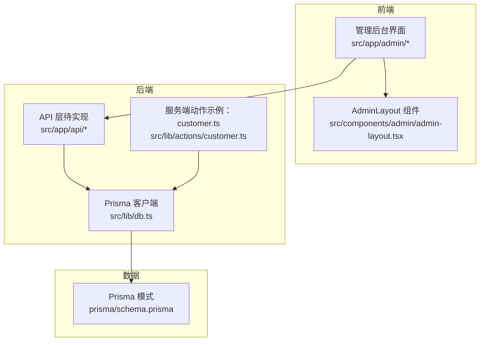
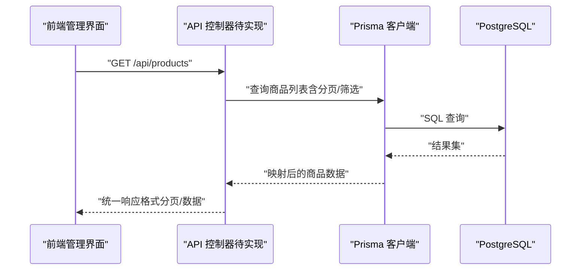
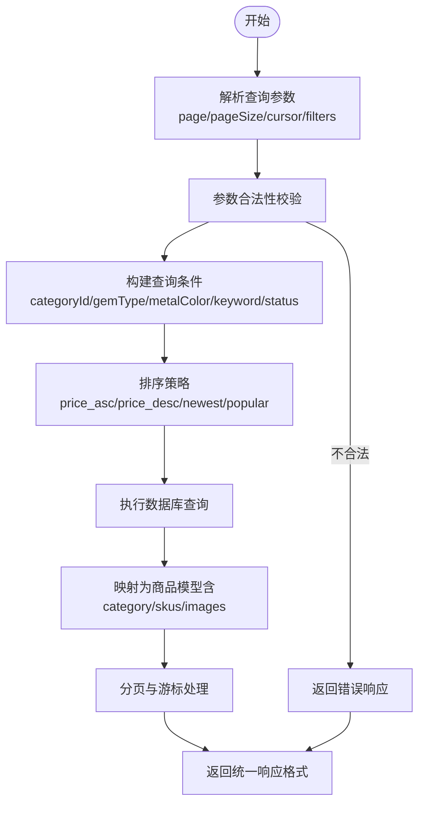
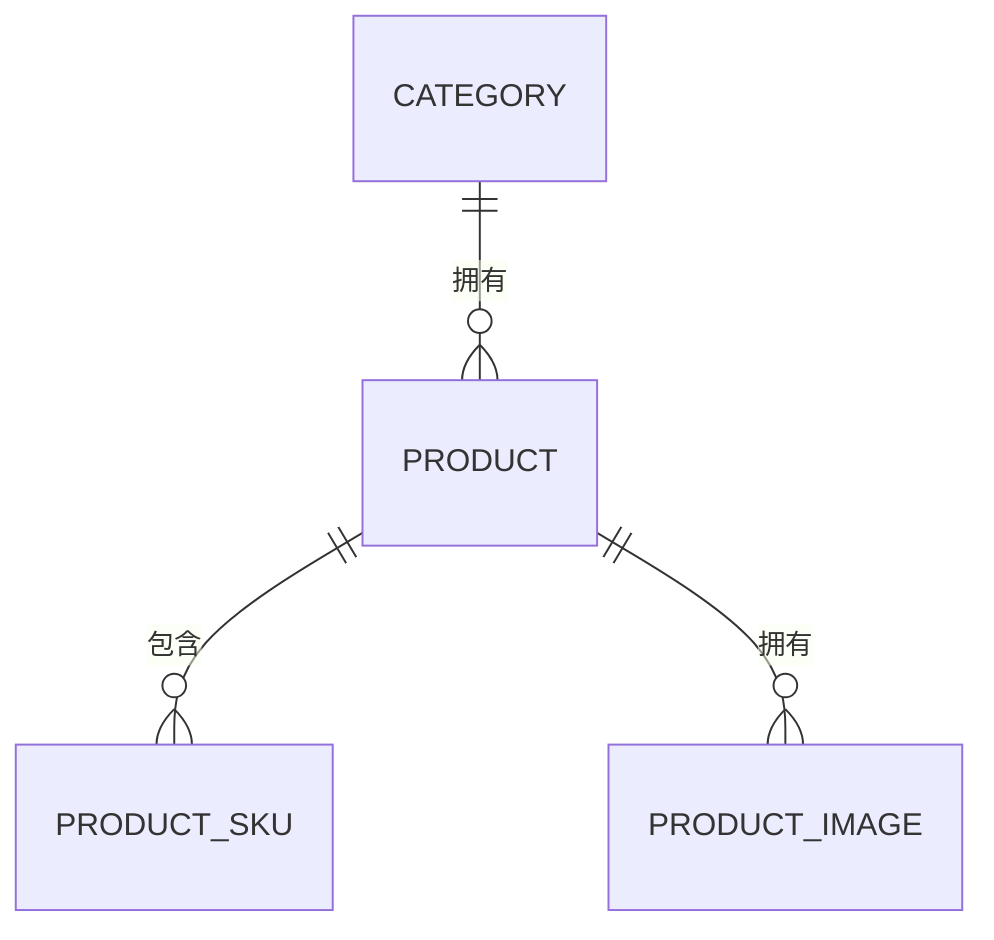

# 商品API

<cite>
**本文引用的文件**
- [README.md](file://README.md)
- [package.json](file://package.json)
- [prisma/schema.prisma](file://prisma/schema.prisma)
- [src/types/index.ts](file://src/types/index.ts)
- [src/lib/db.ts](file://src/lib/db.ts)
- [src/lib/constants.ts](file://src/lib/constants.ts)
- [src/components/admin/admin-layout.tsx](file://src/components/admin/admin-layout.tsx)
- [src/app/admin/layout.tsx](file://src/app/admin/layout.tsx)
- [src/app/admin/page.tsx](file://src/app/admin/page.tsx)
- [src/app/admin/login/page.tsx](file://src/app/admin/login/page.tsx)
</cite>

## 目录
1. [简介](#简介)
2. [项目结构](#项目结构)
3. [核心组件](#核心组件)
4. [架构总览](#架构总览)
5. [详细组件分析](#详细组件分析)
6. [依赖关系分析](#依赖关系分析)
7. [性能考虑](#性能考虑)
8. [故障排查指南](#故障排查指南)
9. [结论](#结论)
10. [附录](#附录)

## 简介
本文件为 Celestia 项目的商品管理 API 接口文档，面向前端与后端开发者，提供商品的完整 CRUD 接口规范、筛选与搜索能力、状态管理与批量操作建议、权限控制与数据安全策略，以及性能优化建议。文档基于仓库中的数据库模型、类型定义与前端路由进行梳理与扩展，确保接口设计与现有数据结构保持一致。

## 项目结构
- 项目采用 Next.js App Router 结构，管理后台位于 `/admin` 路由下，包含仪表盘、商品管理、订单管理、客户管理与系统设置等页面。
- 数据层使用 Prisma ORM，PostgreSQL 作为数据库，枚举类型与实体模型在 `prisma/schema.prisma` 中定义。
- 类型与常量定义位于 `src/types/index.ts` 与 `src/lib/constants.ts`，统一了 API 响应格式、分页参数、排序与筛选参数等。
- 数据库连接通过 `src/lib/db.ts` 初始化，支持开发环境日志输出。

图表来源
- [src/app/admin/layout.tsx:1-9](file://src/app/admin/layout.tsx#L1-L9)
- [src/components/admin/admin-layout.tsx:1-206](file://src/components/admin/admin-layout.tsx#L1-L206)
- [src/lib/db.ts:1-18](file://src/lib/db.ts#L1-L18)
- [prisma/schema.prisma:122-186](file://prisma/schema.prisma#L122-L186)

章节来源
- [README.md:1-37](file://README.md#L1-L37)
- [package.json:1-52](file://package.json#L1-L52)
- [src/app/admin/layout.tsx:1-9](file://src/app/admin/layout.tsx#L1-L9)
- [src/components/admin/admin-layout.tsx:24-30](file://src/components/admin/admin-layout.tsx#L24-L30)
- [src/lib/db.ts:1-18](file://src/lib/db.ts#L1-L18)
- [prisma/schema.prisma:122-186](file://prisma/schema.prisma#L122-L186)

## 核心组件
- 商品（SPU）模型：包含 SPU 编码、多语言名称与描述、分类关联、宝石类型与金属颜色集合、状态、价格区间、排序与时间戳等字段。
- SKU 模型：包含 SKU 编码、与商品的多对一关系、规格属性（宝石类型、金属颜色、尺寸、链长）、库存状态、参考价与时间戳。
- 图片模型：包含图片 URL、缩略图 URL、主图标记、排序与时间戳，并与商品建立一对多关系。
- 分类模型：包含多语言名称、排序与时间戳，并与商品建立一对多关系。
- 枚举类型：产品状态、库存状态、宝石类型、金属颜色等，用于约束业务取值。

章节来源
- [prisma/schema.prisma:26-47](file://prisma/schema.prisma#L26-L47)
- [prisma/schema.prisma:122-149](file://prisma/schema.prisma#L122-L149)
- [prisma/schema.prisma:151-170](file://prisma/schema.prisma#L151-L170)
- [prisma/schema.prisma:172-186](file://prisma/schema.prisma#L172-L186)
- [prisma/schema.prisma:108-120](file://prisma/schema.prisma#L108-L120)

## 架构总览
商品管理 API 的典型调用链路如下：
- 前端通过管理后台页面发起请求。
- API 层接收请求，进行权限校验与参数解析。
- 使用 Prisma 客户端访问数据库，执行查询或写入。
- 返回统一的 API 响应格式。

图表来源
- [src/lib/db.ts:1-18](file://src/lib/db.ts#L1-L18)
- [prisma/schema.prisma:122-149](file://prisma/schema.prisma#L122-L149)

## 详细组件分析

### 通用响应与分页
- 统一响应格式：success、data、error、message 字段，便于前端统一处理。
- 分页参数：page、pageSize、cursor（游标分页），最大页大小限制。
- 管理端筛选参数：categoryId、gemType、metalColor、keyword、sortBy、status。
- 前端筛选参数：categoryId、gemType、metalColor、keyword、sortBy。

章节来源
- [src/types/index.ts:1-7](file://src/types/index.ts#L1-L7)
- [src/types/index.ts:9-22](file://src/types/index.ts#L9-L22)
- [src/types/index.ts:24-32](file://src/types/index.ts#L24-L32)

### 商品列表获取
- 接口路径：GET /api/products
- 功能：支持分页、关键词搜索、按分类/宝石类型/金属颜色筛选、排序（价格升序/降序/最新/热门）。
- 权限：管理端登录态校验（ADMIN 角色）。
- 参数：
  - page、pageSize、cursor（可选）
  - categoryId（可选）
  - gemType、metalColor（可选）
  - keyword（可选）
  - sortBy：price_asc、price_desc、newest、popular
  - status（管理端用，可选）
- 响应：items（商品列表）、total、hasMore、nextCursor（可选）。
- 性能：建议对 categoryId、status 建立索引；对 keyword 使用全文检索或 LIKE 模糊匹配；对 sortBy 选择合适的索引组合。

章节来源
- [src/types/index.ts:24-32](file://src/types/index.ts#L24-L32)
- [prisma/schema.prisma:146-147](file://prisma/schema.prisma#L146-L147)

### 商品详情查询
- 接口路径：GET /api/products/[id]
- 功能：返回指定商品的完整信息，包含分类、SKU 列表、图片列表。
- 权限：管理端登录态校验（ADMIN 角色）。
- 响应：商品对象（包含 category、skus、images）。
- 备注：若商品不存在，返回错误响应。

章节来源
- [prisma/schema.prisma:142-144](file://prisma/schema.prisma#L142-L144)

### 商品创建
- 接口路径：POST /api/products
- 功能：创建新商品（SPU），同时可提交 SKU 与图片信息。
- 权限：管理端登录态校验（ADMIN 角色）。
- 请求体字段（示意）：
  - spuCode（唯一）
  - name_zh/name_en/name_ar（可选）
  - description_zh/description_en/description_ar（可选）
  - categoryId
  - gem_types（数组）
  - metal_colors（数组）
  - status（默认 ACTIVE）
  - min_price_sar/max_price_sar（可选）
  - sort_order（可选）
  - skus（SKU 数组，包含 sku_code、gem_type、metal_color、size、chain_length、reference_price_sar、stock_status）
  - images（图片数组，包含 url、thumbnail_url、is_primary、sort_order）
- 响应：创建后的商品对象。
- 数据验证规则：
  - spuCode 唯一性校验。
  - categoryId 存在性校验。
  - gem_types/metal_colors 为合法枚举值。
  - price 为 Decimal，精度与范围符合数据库定义。
  - images/skus 数组长度与字段完整性校验。

章节来源
- [prisma/schema.prisma:122-149](file://prisma/schema.prisma#L122-L149)
- [prisma/schema.prisma:151-170](file://prisma/schema.prisma#L151-L170)
- [prisma/schema.prisma:172-186](file://prisma/schema.prisma#L172-L186)

### 商品更新
- 接口路径：PUT /api/products/[id]
- 功能：更新商品信息（SPU）、SKU 与图片。
- 权限：管理端登录态校验（ADMIN 角色）。
- 请求体字段：同创建接口（可选择性更新）。
- 响应：更新后的商品对象。
- 注意：SKU 与图片的更新需处理新增、修改与删除逻辑，避免脏数据。

章节来源
- [prisma/schema.prisma:122-149](file://prisma/schema.prisma#L122-L149)
- [prisma/schema.prisma:151-170](file://prisma/schema.prisma#L151-L170)
- [prisma/schema.prisma:172-186](file://prisma/schema.prisma#L172-L186)

### 商品删除
- 接口路径：DELETE /api/products/[id]
- 功能：删除商品（级联删除 SKU 与图片）。
- 权限：管理端登录态校验（ADMIN 角色）。
- 响应：删除成功或失败信息。
- 注意：删除前建议检查是否存在订单关联，避免业务异常。

章节来源
- [prisma/schema.prisma:142-144](file://prisma/schema.prisma#L142-L144)
- [prisma/schema.prisma:165-166](file://prisma/schema.prisma#L165-L166)
- [prisma/schema.prisma:182-183](file://prisma/schema.prisma#L182-L183)

### 商品分类相关接口
- 获取分类列表：GET /api/categories
  - 功能：返回所有分类（支持分页与排序）。
  - 响应：items（分类列表）、total、hasMore。
- 创建/更新/删除分类：对应 RESTful 接口，权限为 ADMIN。
- 响应：统一格式。

章节来源
- [prisma/schema.prisma:108-120](file://prisma/schema.prisma#L108-L120)

### 库存管理接口
- 更新 SKU 库存状态：PUT /api/products/[id]/skus/[skuId]/stock
  - 请求体：stock_status（IN_STOCK/OUT_OF_STOCK/PRE_ORDER）
  - 响应：更新后的 SKU。
- 批量更新库存状态：PUT /api/products/[id]/skus/batch-stock
  - 请求体：[{ skuId, stock_status }, ...]
  - 响应：批量结果。

章节来源
- [prisma/schema.prisma:31-35](file://prisma/schema.prisma#L31-L35)
- [prisma/schema.prisma:151-170](file://prisma/schema.prisma#L151-L170)

### 价格设置接口
- 设置 SKU 参考价：PUT /api/products/[id]/skus/[skuId]/price
  - 请求体：reference_price_sar（Decimal）
  - 响应：更新后的 SKU。
- 批量设置价格：PUT /api/products/[id]/skus/batch-price
  - 请求体：[{ skuId, reference_price_sar }, ...]
  - 响应：批量结果。

章节来源
- [prisma/schema.prisma:161-161](file://prisma/schema.prisma#L161-L161)
- [prisma/schema.prisma:151-170](file://prisma/schema.prisma#L151-L170)

### 图片上传与管理
- 上传图片：POST /api/upload/image
  - 表单字段：file（二进制文件）
  - 响应：{ url, thumbnail_url }
- 关联图片到商品：POST /api/products/[id]/images
  - 请求体：{ url, thumbnail_url, is_primary, sort_order }
  - 响应：新增图片对象。
- 更新/删除图片：PUT /api/products/[id]/images/[imageId]、DELETE /api/products/[id]/images/[imageId]
- 主图设置：PUT /api/products/[id]/images/[imageId]/primary

章节来源
- [prisma/schema.prisma:172-186](file://prisma/schema.prisma#L172-L186)
- [package.json:12-12](file://package.json#L12-L12)

### 商品搜索与筛选流程

图表来源
- [src/types/index.ts:24-32](file://src/types/index.ts#L24-L32)
- [prisma/schema.prisma:142-144](file://prisma/schema.prisma#L142-L144)

### 商品状态管理与批量操作
- 状态切换：PUT /api/products/[id]/status（ACTIVE/INACTIVE）
- 批量操作：
  - PUT /api/products/batch-status
  - PUT /api/products/batch-delete
- 权限：ADMIN
- 响应：操作结果与受影响数量。

章节来源
- [prisma/schema.prisma:26-29](file://prisma/schema.prisma#L26-L29)
- [prisma/schema.prisma:122-149](file://prisma/schema.prisma#L122-L149)

## 依赖关系分析
- 数据模型依赖：Product → Category（一对多）、Product → ProductSku（一对多）、Product → ProductImage（一对多）。
- 枚举依赖：ProductStatus、StockStatus、GemType、MetalColor。
- 前端路由依赖：管理后台布局与导航指向 /admin/products 页面。

图表来源
- [prisma/schema.prisma:108-120](file://prisma/schema.prisma#L108-L120)
- [prisma/schema.prisma:122-149](file://prisma/schema.prisma#L122-L149)
- [prisma/schema.prisma:151-170](file://prisma/schema.prisma#L151-L170)
- [prisma/schema.prisma:172-186](file://prisma/schema.prisma#L172-L186)

章节来源
- [prisma/schema.prisma:108-120](file://prisma/schema.prisma#L108-L120)
- [prisma/schema.prisma:122-149](file://prisma/schema.prisma#L122-L149)
- [prisma/schema.prisma:151-170](file://prisma/schema.prisma#L151-L170)
- [prisma/schema.prisma:172-186](file://prisma/schema.prisma#L172-L186)
- [src/components/admin/admin-layout.tsx:24-30](file://src/components/admin/admin-layout.tsx#L24-L30)

## 性能考虑
- 数据库索引：为 categoryId、status 建立复合索引以提升筛选与排序性能。
- 查询优化：对 keyword 搜索使用 LIKE 或全文检索；对排序字段建立相应索引。
- 分页策略：优先使用游标分页（cursor）减少偏移量带来的性能问题。
- 缓存策略：对商品列表与详情进行缓存，结合 revalidatePath 实现增量更新。
- 并发控制：批量操作时使用事务，保证一致性与原子性。
- 图片处理：上传图片时使用缩略图与 CDN，降低带宽与延迟。

## 故障排查指南
- 权限不足：返回错误信息，提示需要 ADMIN 角色。
- 参数非法：返回错误信息，指出具体字段与规则。
- 数据不存在：返回错误信息，如商品/SKU/图片 ID 无效。
- 数据库异常：查看 Prisma 日志（开发环境开启 query/error/warn），定位 SQL 语句与参数。
- 图片上传失败：检查 AWS S3 凭证与桶权限，确认文件大小与类型限制。

章节来源
- [src/lib/db.ts:12-15](file://src/lib/db.ts#L12-L15)
- [src/app/admin/login/page.tsx:13-16](file://src/app/admin/login/page.tsx#L13-L16)

## 结论
本文档基于现有数据库模型与类型定义，为商品管理 API 提供了完整的接口规范与实现建议。建议在后续开发中补充 API 控制器与服务端动作，完善权限校验、数据验证与错误处理，并结合性能优化策略提升用户体验与系统稳定性。

## 附录
- 管理后台入口：/admin/products
- 登录页面：/admin/login
- 仪表盘：/admin

章节来源
- [src/components/admin/admin-layout.tsx:24-30](file://src/components/admin/admin-layout.tsx#L24-L30)
- [src/app/admin/page.tsx:1-34](file://src/app/admin/page.tsx#L1-L34)
- [src/app/admin/login/page.tsx:33-53](file://src/app/admin/login/page.tsx#L33-L53)