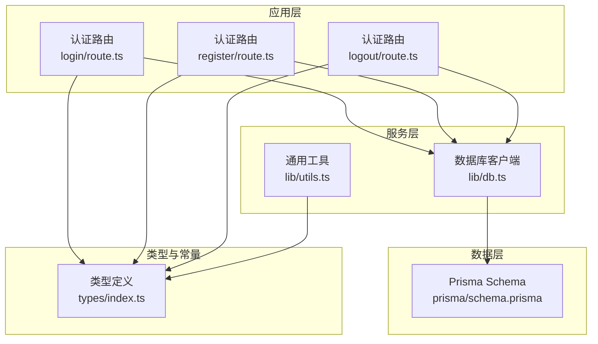
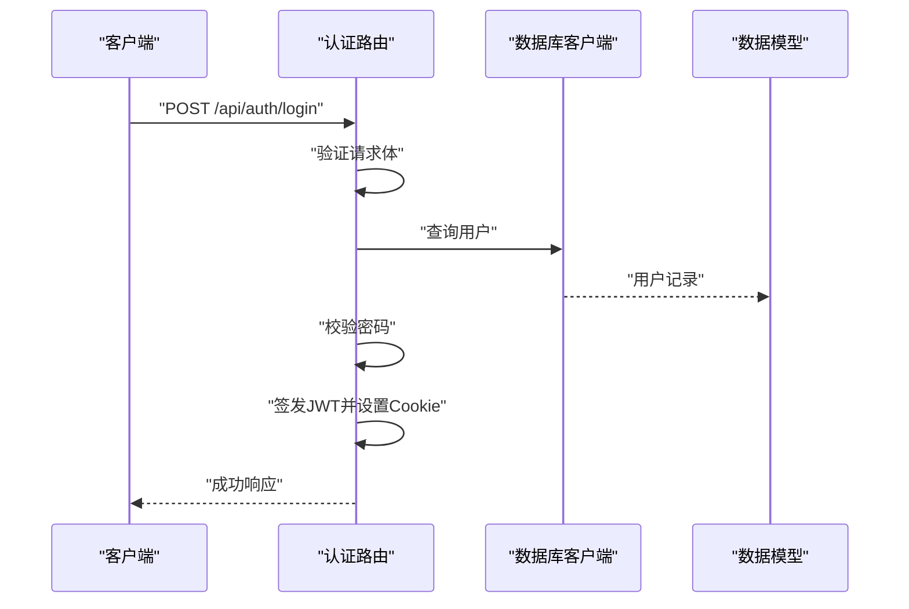
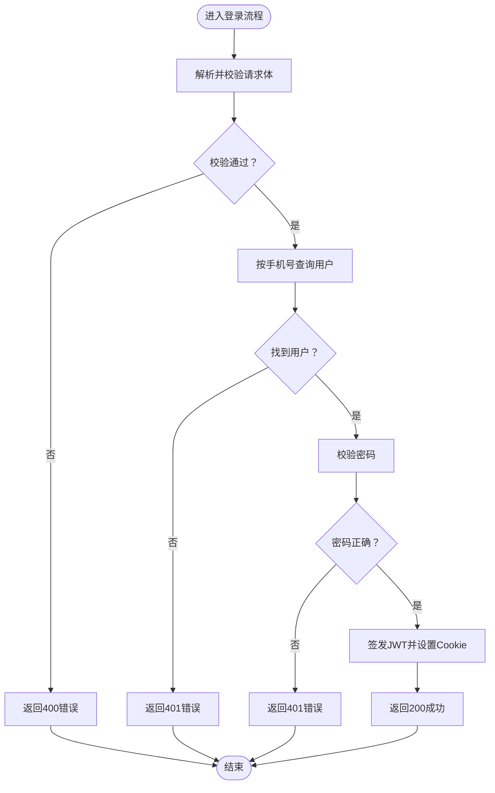
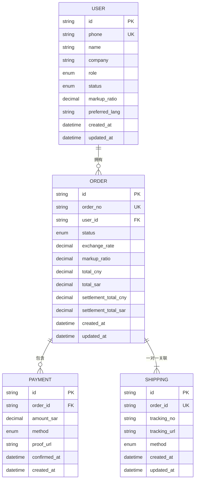
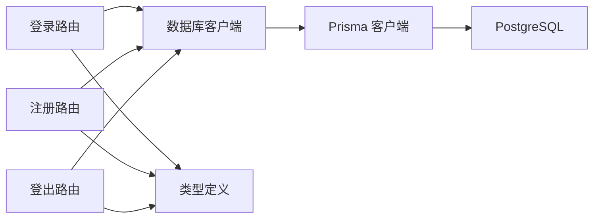

# 系统API

<cite>
**本文引用的文件**
- [README.md](file://README.md)
- [package.json](file://package.json)
- [docker-compose.yml](file://docker-compose.yml)
- [src/app/api/auth/login/route.ts](file://src/app/api/auth/login/route.ts)
- [src/app/api/auth/logout/route.ts](file://src/app/api/auth/logout/route.ts)
- [src/app/api/auth/register/route.ts](file://src/app/api/auth/register/route.ts)
- [src/lib/db.ts](file://src/lib/db.ts)
- [src/lib/utils.ts](file://src/lib/utils.ts)
- [src/types/index.ts](file://src/types/index.ts)
- [prisma/schema.prisma](file://prisma/schema.prisma)
</cite>

## 目录
1. [简介](#简介)
2. [项目结构](#项目结构)
3. [核心组件](#核心组件)
4. [架构总览](#架构总览)
5. [详细组件分析](#详细组件分析)
6. [依赖分析](#依赖分析)
7. [性能考量](#性能考量)
8. [故障排查指南](#故障排查指南)
9. [结论](#结论)
10. [附录](#附录)

## 简介
本文件为 Celestia 项目的系统级 API 综合接口文档，聚焦于系统配置管理、用户权限控制、日志与监控、中间件使用与自定义 API 开发规范、系统状态与健康检查、性能监控、系统参数与环境变量管理、部署相关 API、API 版本控制、错误日志与调试接口，以及安全性、访问控制与审计日志等主题。文档面向系统管理员与开发者，提供可操作的参考与最佳实践。

## 项目结构
该项目基于 Next.js App Router，采用约定式路由组织 API。认证相关接口位于 src/app/api/auth 下，数据库连接通过 Prisma 初始化，类型定义集中在 src/types 中，数据模型由 Prisma Schema 描述。

图表来源
- [src/app/api/auth/login/route.ts:1-76](file://src/app/api/auth/login/route.ts#L1-L76)
- [src/app/api/auth/register/route.ts:1-86](file://src/app/api/auth/register/route.ts#L1-L86)
- [src/app/api/auth/logout/route.ts:1-22](file://src/app/api/auth/logout/route.ts#L1-L22)
- [src/lib/db.ts:1-18](file://src/lib/db.ts#L1-L18)
- [src/lib/utils.ts:1-32](file://src/lib/utils.ts#L1-L32)
- [src/types/index.ts:1-60](file://src/types/index.ts#L1-L60)
- [prisma/schema.prisma:1-281](file://prisma/schema.prisma#L1-L281)

章节来源
- [README.md:1-37](file://README.md#L1-L37)
- [package.json:1-58](file://package.json#L1-L58)
- [docker-compose.yml:1-22](file://docker-compose.yml#L1-L22)

## 核心组件
- 认证 API：登录、注册、登出，统一返回结构，集成 JWT 与 Cookie 会话。
- 数据库连接：基于 Prisma 与 PostgreSQL，支持开发环境日志与生产环境精简日志。
- 类型系统：统一的 API 响应结构、分页参数、会话用户信息与 JWT 载荷定义。
- 数据模型：用户、品类、商品、订单、支付、物流等核心实体及枚举状态。

章节来源
- [src/app/api/auth/login/route.ts:1-76](file://src/app/api/auth/login/route.ts#L1-L76)
- [src/app/api/auth/register/route.ts:1-86](file://src/app/api/auth/register/route.ts#L1-L86)
- [src/app/api/auth/logout/route.ts:1-22](file://src/app/api/auth/logout/route.ts#L1-L22)
- [src/lib/db.ts:1-18](file://src/lib/db.ts#L1-L18)
- [src/types/index.ts:1-60](file://src/types/index.ts#L1-L60)
- [prisma/schema.prisma:89-106](file://prisma/schema.prisma#L89-L106)

## 架构总览
系统采用“路由函数 + Prisma 客户端”的轻量后端架构。认证流程通过路由函数处理请求、校验输入、查询数据库、签发令牌并设置 Cookie；数据库连接通过适配器与连接池初始化；类型系统确保前后端一致的数据契约。

图表来源
- [src/app/api/auth/login/route.ts:13-67](file://src/app/api/auth/login/route.ts#L13-L67)
- [src/lib/db.ts:12-15](file://src/lib/db.ts#L12-L15)
- [prisma/schema.prisma:89-106](file://prisma/schema.prisma#L89-L106)

## 详细组件分析

### 认证 API
- 登录接口
  - 方法与路径：POST /api/auth/login
  - 请求体：手机号与密码（受 Zod 校验）
  - 处理流程：校验请求体 -> 查询用户 -> 校验密码 -> 签发 JWT -> 设置 Cookie -> 返回会话用户与状态
  - 响应结构：遵循统一 ApiResponse，包含 success、data、message 或 error
  - 状态码：200 成功、400 参数错误、401 未授权、500 内部错误
- 注册接口
  - 方法与路径：POST /api/auth/register
  - 请求体：手机号、密码、姓名、公司（可选）
  - 处理流程：校验请求体 -> 检查手机号唯一 -> 加密密码 -> 创建用户 -> 签发 JWT -> 设置 Cookie
  - 响应结构：统一 ApiResponse，返回 SessionUser
  - 状态码：201 成功、400 参数错误、409 已存在、500 内部错误
- 登出接口
  - 方法与路径：POST /api/auth/logout
  - 处理流程：清除认证 Cookie -> 返回成功消息
  - 响应结构：统一 ApiResponse
  - 状态码：200 成功、500 内部错误

图表来源
- [src/app/api/auth/login/route.ts:13-67](file://src/app/api/auth/login/route.ts#L13-L67)

章节来源
- [src/app/api/auth/login/route.ts:1-76](file://src/app/api/auth/login/route.ts#L1-L76)
- [src/app/api/auth/register/route.ts:1-86](file://src/app/api/auth/register/route.ts#L1-L86)
- [src/app/api/auth/logout/route.ts:1-22](file://src/app/api/auth/logout/route.ts#L1-L22)
- [src/types/index.ts:1-60](file://src/types/index.ts#L1-L60)

### 数据库与类型系统
- 数据库连接
  - 使用连接池与适配器初始化 Prisma 客户端
  - 开发环境启用查询、错误、警告日志；生产环境仅记录错误
- 类型系统
  - ApiResponse：统一响应结构
  - 分页参数与分页响应：支持游标分页
  - 会话用户 SessionUser：包含用户标识、角色、状态、语言偏好等
  - JWT 载荷 JwtPayload：包含用户ID、角色、状态及标准声明
- 数据模型
  - 用户：角色与状态枚举、默认加价率、语言偏好
  - 商品与 SKU：多语言名称、宝石类型、金属颜色、库存状态
  - 订单：定价与结算字段、物流与支付关联
  - 支付与物流：支付方式、物流方式与跟踪信息

图表来源
- [prisma/schema.prisma:89-106](file://prisma/schema.prisma#L89-L106)
- [prisma/schema.prisma:189-220](file://prisma/schema.prisma#L189-L220)
- [prisma/schema.prisma:250-264](file://prisma/schema.prisma#L250-L264)
- [prisma/schema.prisma:267-279](file://prisma/schema.prisma#L267-L279)

章节来源
- [src/lib/db.ts:1-18](file://src/lib/db.ts#L1-L18)
- [src/types/index.ts:1-60](file://src/types/index.ts#L1-L60)
- [prisma/schema.prisma:1-281](file://prisma/schema.prisma#L1-L281)

### 中间件系统与自定义 API 开发规范
- 中间件位置：Next.js App Router 的中间件通常位于 src/middleware.ts（若存在）。当前仓库未包含该文件，建议在新增自定义 API 时遵循以下规范：
  - 路由组织：以 src/app/api/{group}/{resource}/route.ts 命名，保持清晰的分组与资源语义
  - 输入校验：使用 Zod 对请求体进行严格校验，返回 400 错误并携带具体问题
  - 权限控制：在路由函数内或通过 Next.js 中间件实现基于角色（ADMIN/CUSTOMER）与状态（PENDING/ACTIVE）的访问控制
  - 统一响应：始终返回统一 ApiResponse 结构，便于前端与监控系统消费
  - 错误处理：捕获异常并记录日志，返回 500 内部错误
  - 性能优化：对热点查询添加索引、使用事务保证一致性、避免 N+1 查询
- 自定义 API 最佳实践
  - 明确版本策略：通过路径版本（如 /api/v1/resource）或请求头版本控制
  - 审计日志：记录关键操作（创建、更新、删除）与变更详情
  - 安全性：启用 HTTPS、CSRF 防护、CORS 策略、速率限制与输入净化

[本节为概念性指导，不直接分析具体文件，故无章节来源]

### 系统状态检查、健康检查与性能监控
- 健康检查
  - 数据库健康：Compose 中已配置 Postgres 健康检查命令，可用于容器编排的就绪/存活探针
  - 应用健康：建议在路由层增加 GET /health 接口，返回数据库连通性、缓存可用性与服务状态
- 性能监控
  - 数据库查询：开发模式下开启 Prisma 日志，生产模式关闭或降级
  - 响应时间：在中间件或边缘网关层统计请求耗时并上报指标
  - 资源使用：结合容器监控采集 CPU、内存、连接数等指标

章节来源
- [docker-compose.yml:14-18](file://docker-compose.yml#L14-L18)
- [src/lib/db.ts:14-15](file://src/lib/db.ts#L14-L15)

### 系统参数配置、环境变量管理与部署
- 环境变量
  - DATABASE_URL：PostgreSQL 连接字符串
  - NODE_ENV：决定 Prisma 日志级别
  - JWT 相关：建议通过环境变量配置密钥与过期时间
- 部署
  - Docker Compose：提供 Postgres 实例与健康检查
  - Next.js：支持多包管理器运行与构建脚本
- 配置管理
  - 建议将敏感配置放入机密管理，非敏感配置放入 ConfigMap/环境变量
  - 通过 CI/CD 注入环境变量，避免硬编码

章节来源
- [src/lib/db.ts:9-15](file://src/lib/db.ts#L9-L15)
- [docker-compose.yml:1-22](file://docker-compose.yml#L1-L22)
- [package.json:1-58](file://package.json#L1-L58)

### API 版本控制、错误日志与调试接口
- 版本控制
  - 路径版本：/api/v1/...，便于灰度与回滚
  - 头部版本：X-API-Version，适合与客户端约定
- 错误日志
  - 统一捕获异常并记录到控制台，生产环境接入结构化日志
  - 错误响应包含 error 字段，便于前端提示与埋点
- 调试接口
  - 提供 /debug/info 返回系统版本、环境、数据库状态等信息
  - 提供 /debug/reset-cache 清理缓存（谨慎使用）

章节来源
- [src/app/api/auth/login/route.ts:68-74](file://src/app/api/auth/login/route.ts#L68-L74)
- [src/app/api/auth/logout/route.ts:14-20](file://src/app/api/auth/logout/route.ts#L14-L20)
- [src/app/api/auth/register/route.ts:78-84](file://src/app/api/auth/register/route.ts#L78-L84)

### 安全性、访问控制与审计日志
- 认证与授权
  - 登录成功后签发 JWT 并设置 Cookie，建议使用 HttpOnly 与 SameSite 策略
  - 在路由层或中间件校验 JWT，拒绝无效或过期令牌
  - 基于角色（ADMIN/CUSTOMER）与状态（PENDING/ACTIVE）控制访问
- 审计日志
  - 记录用户登录/登出、关键数据变更、批量操作等事件
  - 包含时间戳、用户ID、IP、UA、操作类型与影响范围
- 安全加固
  - 启用 HTTPS、CORS 白名单、速率限制、输入净化与 SQL 注入防护
  - 定期轮换密钥、最小权限原则、定期安全扫描

章节来源
- [src/app/api/auth/login/route.ts:49-51](file://src/app/api/auth/login/route.ts#L49-L51)
- [src/types/index.ts:41-48](file://src/types/index.ts#L41-L48)
- [prisma/schema.prisma:16-24](file://prisma/schema.prisma#L16-L24)

## 依赖分析
- 外部依赖
  - 数据库：PostgreSQL（容器化部署）、Prisma 客户端与适配器
  - 认证：JWKS/JWT（用于令牌签发与校验）
  - 校验：Zod（请求体校验）
  - 工具：bcryptjs（密码哈希）、Tailwind Merge（样式合并）
- 内部耦合
  - 路由函数依赖数据库客户端与类型定义
  - 数据模型通过 Prisma Schema 定义，被路由与工具模块间接使用

图表来源
- [src/app/api/auth/login/route.ts:1-76](file://src/app/api/auth/login/route.ts#L1-L76)
- [src/app/api/auth/register/route.ts:1-86](file://src/app/api/auth/register/route.ts#L1-L86)
- [src/app/api/auth/logout/route.ts:1-22](file://src/app/api/auth/logout/route.ts#L1-L22)
- [src/lib/db.ts:1-18](file://src/lib/db.ts#L1-L18)
- [src/types/index.ts:1-60](file://src/types/index.ts#L1-L60)

章节来源
- [package.json:11-44](file://package.json#L11-L44)
- [src/lib/db.ts:1-18](file://src/lib/db.ts#L1-L18)

## 性能考量
- 数据库层面
  - 为常用查询字段建立索引（如用户手机号、订单状态、SKU 外键）
  - 使用事务包裹高一致性写操作，避免长时间锁持有
  - 控制查询返回字段大小，必要时使用游标分页
- 应用层面
  - 在开发环境启用 Prisma 日志辅助定位慢查询，生产环境关闭或降级
  - 对热点数据引入缓存（如用户会话、商品分类），注意缓存失效策略
  - 合理拆分请求体与响应体，避免大对象传输
- 监控与告警
  - 指标采集：QPS、P95/P99 延迟、错误率、数据库连接数
  - 告警阈值：延迟突增、错误率上升、数据库连接池耗尽

[本节提供通用指导，不直接分析具体文件，故无章节来源]

## 故障排查指南
- 常见问题
  - 登录失败：检查手机号是否存在、密码是否正确、账户状态是否为 ACTIVE
  - 注册冲突：手机号重复导致 409，需提示用户更换
  - 服务器错误：查看控制台日志，定位异常堆栈并修复
- 排查步骤
  - 确认数据库连通性与健康状态
  - 检查 Prisma 日志与环境变量配置
  - 核对路由函数中的输入校验与业务逻辑分支
- 临时措施
  - 重启应用与数据库容器
  - 清理浏览器 Cookie 与 LocalStorage
  - 临时放宽日志级别以便复现问题

章节来源
- [src/app/api/auth/login/route.ts:33-47](file://src/app/api/auth/login/route.ts#L33-L47)
- [src/app/api/auth/register/route.ts:23-33](file://src/app/api/auth/register/route.ts#L23-L33)
- [src/app/api/auth/logout/route.ts:7-8](file://src/app/api/auth/logout/route.ts#L7-L8)
- [docker-compose.yml:14-18](file://docker-compose.yml#L14-L18)

## 结论
本文件梳理了 Celestia 项目的系统级 API 设计与实现要点，明确了认证流程、数据模型、类型系统与部署配置，并给出了中间件与自定义 API 的开发规范、健康检查与性能监控建议、安全性与审计日志要求。建议在现有基础上逐步完善版本控制、调试接口与统一审计日志体系，持续提升系统的可观测性与可维护性。

## 附录
- API 响应通用结构
  - success：布尔，表示请求是否成功
  - data：任意数据，成功时返回
  - error：字符串，失败时返回错误描述
  - message：字符串，附加说明
- 分页参数
  - page/pageSize：传统分页
  - cursor：游标分页
- 会话用户字段
  - id、phone、name、role、status、markupRatio、preferredLang

章节来源
- [src/types/index.ts:1-60](file://src/types/index.ts#L1-L60)