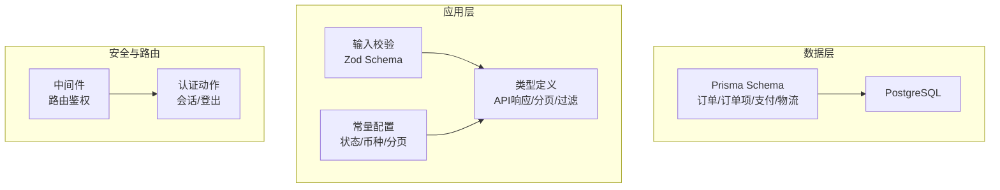
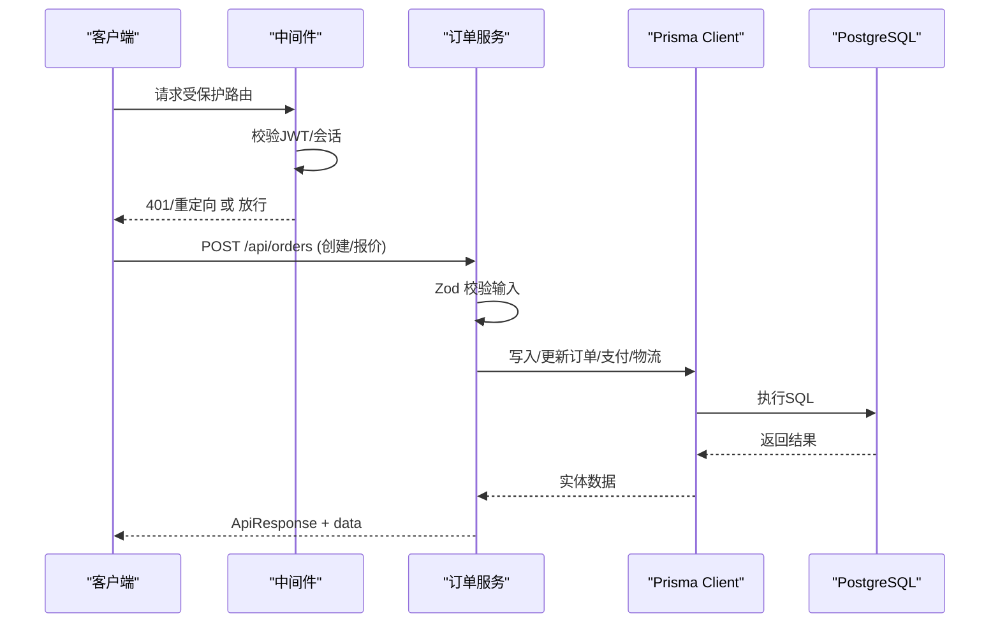
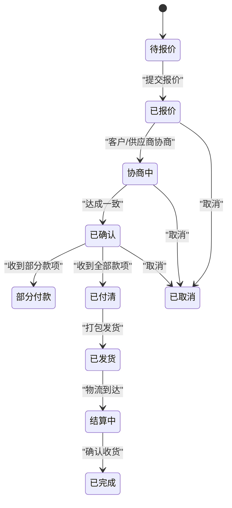
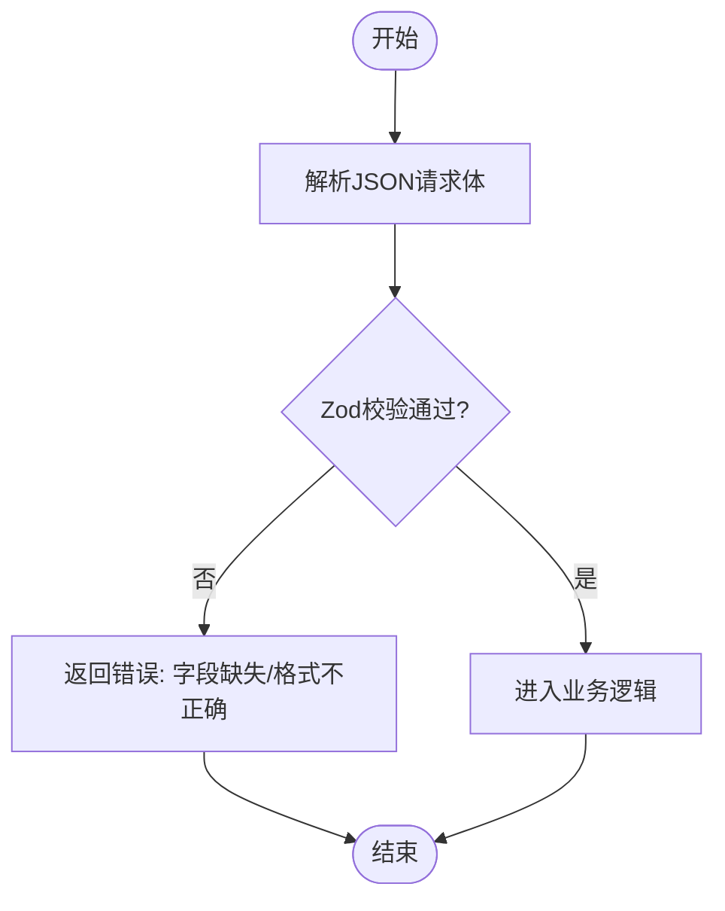
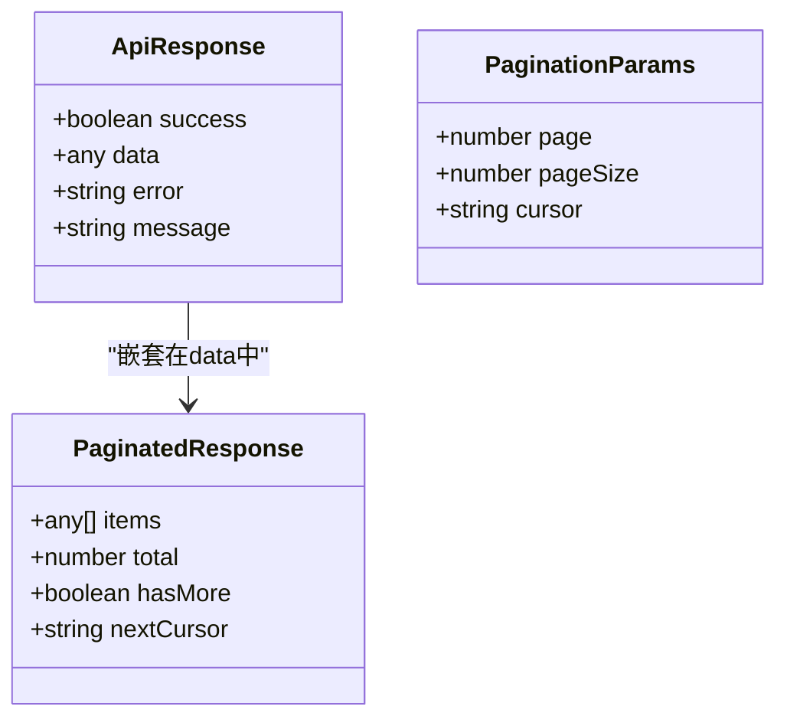
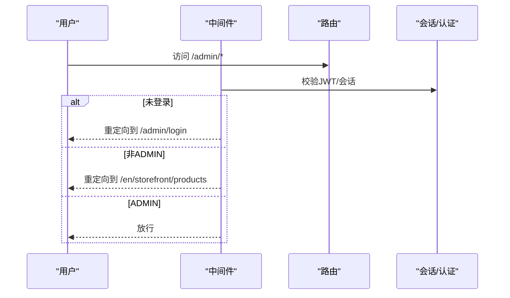
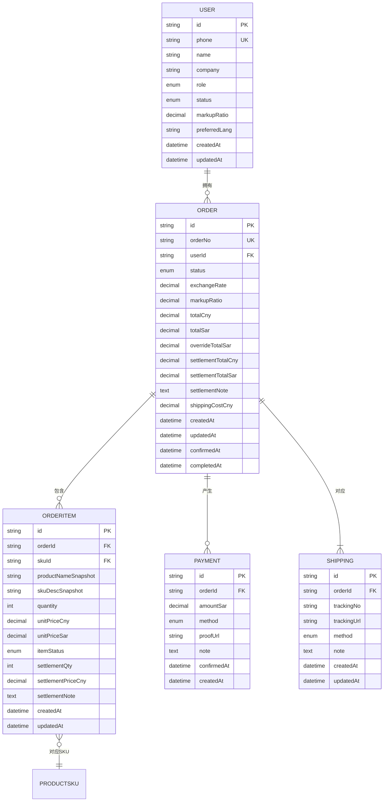

# 订单API

<cite>
**本文引用的文件**
- [schema.prisma](file://prisma/schema.prisma)
- [order.ts](file://src/lib/validations/order.ts)
- [index.ts](file://src/types/index.ts)
- [constants.ts](file://src/lib/constants.ts)
- [db.ts](file://src/lib/db.ts)
- [middleware.ts](file://src/middleware.ts)
- [auth.ts](file://src/lib/actions/auth.ts)
</cite>

## 目录
1. [简介](#简介)
2. [项目结构](#项目结构)
3. [核心组件](#核心组件)
4. [架构总览](#架构总览)
5. [详细组件分析](#详细组件分析)
6. [依赖关系分析](#依赖关系分析)
7. [性能考量](#性能考量)
8. [故障排查指南](#故障排查指南)
9. [结论](#结论)
10. [附录](#附录)

## 简介
本文件为 Celestia 项目的订单管理API提供完整的接口文档与集成指南。内容覆盖订单的创建、查询、报价提交、状态流转、支付处理、物流跟踪、订单历史、搜索筛选与分页查询等核心能力，并对安全性、并发控制与事务处理给出实践建议。由于当前仓库未提供独立的订单API端点文件，本文基于现有 Prisma Schema、验证器、类型定义与中间件进行规范性梳理与扩展说明，帮助开发者在现有架构上快速集成与扩展订单相关功能。

## 项目结构
订单相关能力主要由以下模块构成：
- 数据模型与枚举：位于 Prisma Schema 中，定义订单、订单项、支付、物流等实体及状态枚举
- 输入校验：使用 Zod 定义订单创建与报价提交的输入约束
- 类型系统：统一的 API 响应与分页参数类型
- 认证与中间件：保护管理端路由与鉴权流程
- 数据访问：通过 Prisma Client 进行数据库读写

**图表来源**
- [schema.prisma:1-280](file://prisma/schema.prisma#L1-L280)
- [order.ts:1-23](file://src/lib/validations/order.ts#L1-L23)
- [index.ts:1-59](file://src/types/index.ts#L1-L59)
- [constants.ts:1-46](file://src/lib/constants.ts#L1-L46)
- [middleware.ts:42-118](file://src/middleware.ts#L42-L118)
- [auth.ts:1-20](file://src/lib/actions/auth.ts#L1-L20)

**章节来源**
- [schema.prisma:1-280](file://prisma/schema.prisma#L1-L280)
- [order.ts:1-23](file://src/lib/validations/order.ts#L1-L23)
- [index.ts:1-59](file://src/types/index.ts#L1-L59)
- [constants.ts:1-46](file://src/lib/constants.ts#L1-L46)
- [middleware.ts:42-118](file://src/middleware.ts#L42-L118)
- [auth.ts:1-20](file://src/lib/actions/auth.ts#L1-L20)

## 核心组件
- 订单模型与状态
  - 订单状态：待报价、已报价、协商中、已确认、部分付款、已付清、已发货、结算中、已完成、已取消
  - 订单项状态：待报价、已报价、缺货、客户移除、已确认、退货、数量调整
- 支付方式与物流方式
  - 支付方式：银行转账、Western Union、现金、其他
  - 物流方式：海运、空运、快递
- 输入校验
  - 创建订单：至少一个SKU条目，数量为正整数，可选备注
  - 提交报价：订单ID、汇率与加价比例为正数，订单项价格非负
- 统一响应与分页
  - API 响应体包含 success、data、error、message 字段
  - 分页参数支持 page、pageSize、cursor；分页响应包含 items、total、hasMore、nextCursor
- 常量与国际化
  - 订单状态中英文标签与颜色配置
  - 币种、分页默认值、支持语言等

**章节来源**
- [schema.prisma:49-83](file://prisma/schema.prisma#L49-L83)
- [order.ts:1-23](file://src/lib/validations/order.ts#L1-L23)
- [index.ts:1-59](file://src/types/index.ts#L1-L59)
- [constants.ts:1-46](file://src/lib/constants.ts#L1-L46)

## 架构总览
订单API遵循“类型驱动 + 校验先行 + 中间件保护”的设计原则：
- 类型与校验：所有入参先经 Zod 校验，再进入业务逻辑
- 安全控制：中间件对管理端路由进行角色与状态检查
- 数据一致性：通过 Prisma 的关系与索引保证订单、订单项、支付、物流的数据完整性
- 响应规范：统一的 ApiResponse 与分页响应结构，便于前端消费

**图表来源**
- [middleware.ts:42-118](file://src/middleware.ts#L42-L118)
- [order.ts:1-23](file://src/lib/validations/order.ts#L1-L23)
- [db.ts:1-18](file://src/lib/db.ts#L1-L18)

## 详细组件分析

### 数据模型与状态流转
订单状态与订单项状态构成完整的业务闭环，支持从创建到完成的全流程追踪。状态变更通常由管理员或系统自动触发，配合支付与物流信息同步更新。

**图表来源**
- [schema.prisma:49-70](file://prisma/schema.prisma#L49-L70)
- [constants.ts:1-23](file://src/lib/constants.ts#L1-L23)

**章节来源**
- [schema.prisma:188-280](file://prisma/schema.prisma#L188-L280)
- [constants.ts:1-23](file://src/lib/constants.ts#L1-L23)

### 输入校验与类型约束
- 创建订单
  - items 为数组，每个元素包含 skuId、quantity（正整数）、note（最多500字符，可选）
- 提交报价
  - orderId、exchangeRate、markupRatio 为正数字符串
  - items 包含 orderItemId 与 unitPriceCny（非负数）

**图表来源**
- [order.ts:1-23](file://src/lib/validations/order.ts#L1-L23)

**章节来源**
- [order.ts:1-23](file://src/lib/validations/order.ts#L1-L23)

### 统一响应与分页
- API 响应体
  - success: 布尔，表示请求是否成功
  - data: 可选，实际返回的数据对象
  - error: 可选，错误信息
  - message: 可选，提示消息
- 分页参数与响应
  - PaginationParams: page、pageSize、cursor
  - PaginatedResponse: items、total、hasMore、nextCursor

**图表来源**
- [index.ts:1-59](file://src/types/index.ts#L1-L59)

**章节来源**
- [index.ts:1-59](file://src/types/index.ts#L1-L59)

### 安全性与路由控制
- 管理端路由保护
  - /admin 路由要求 ADMIN 角色，否则重定向至相应页面
  - /admin/login 允许未登录访问，但已登录且为 ADMIN 的用户会被重定向至 /admin
- 商城端路由保护
  - 登录/注册页面：已登录用户根据角色与状态重定向
  - 其他 storefront 页面需登录，PENDING 状态用户仅能访问 /pending 页面
- 认证动作
  - getSession：获取当前会话用户
  - logout：清理认证 Cookie 并重定向

**图表来源**
- [middleware.ts:49-75](file://src/middleware.ts#L49-L75)
- [auth.ts:1-20](file://src/lib/actions/auth.ts#L1-L20)

**章节来源**
- [middleware.ts:42-118](file://src/middleware.ts#L42-L118)
- [auth.ts:1-20](file://src/lib/actions/auth.ts#L1-L20)

## 依赖关系分析
- 订单模型依赖
  - Order -> User（一对多）
  - Order -> OrderItem（一对多）
  - Order -> Payment（一对多）
  - Order -> Shipping（一对一）
  - OrderItem -> ProductSku（多对一）
- 索引与约束
  - 对 userId、status 建立索引，提升查询效率
  - 外键级联删除保证数据一致性
- 类型与校验依赖
  - Zod Schema 依赖于 Prisma 枚举与 Decimal 字段精度
  - ApiResponse/PaginationParams 作为通用契约被各端点复用

**图表来源**
- [schema.prisma:89-280](file://prisma/schema.prisma#L89-L280)

**章节来源**
- [schema.prisma:188-280](file://prisma/schema.prisma#L188-L280)

## 性能考量
- 查询优化
  - 使用索引字段（userId、status）进行过滤与排序
  - 分页采用游标分页（cursor）以降低偏移量带来的性能损耗
- 写入优化
  - 将订单、订单项、支付、物流的写入封装在单个事务中，确保一致性
  - 对高频字段（如 totalCny、totalSar）进行批量计算与原子更新
- 缓存策略
  - 对热点订单详情与列表使用缓存，结合 revalidatePath 在数据变更后刷新
- 并发控制
  - 使用数据库锁或乐观锁避免超卖与重复支付
  - 对状态机转换增加幂等校验，防止重复提交导致的状态错乱

## 故障排查指南
- 常见错误与定位
  - 参数校验失败：检查 Zod Schema 的字段类型与范围约束
  - 权限不足：确认中间件是否正确拦截非 ADMIN 访问 /admin 路由
  - 会话异常：使用 getSession 校验当前用户状态，必要时调用 logout 清理
  - 数据不一致：检查事务边界，确保订单主表与明细表同时提交
- 日志与监控
  - 开发环境开启 Prisma 查询日志，生产环境聚焦错误与警告
  - 对关键状态转换埋点，便于回溯问题

**章节来源**
- [order.ts:1-23](file://src/lib/validations/order.ts#L1-L23)
- [middleware.ts:42-118](file://src/middleware.ts#L42-L118)
- [auth.ts:1-20](file://src/lib/actions/auth.ts#L1-L20)
- [db.ts:1-18](file://src/lib/db.ts#L1-L18)

## 结论
本文基于现有 Prisma Schema、输入校验、类型定义与中间件，构建了订单管理API的规范蓝图。尽管当前仓库未提供独立的订单API端点文件，但通过统一的类型契约、严格的输入校验与完善的路由安全机制，开发者可在现有基础上高效扩展订单的创建、查询、报价、支付、物流与状态流转等能力，并确保系统的安全性与一致性。

## 附录

### 接口规范（概念性说明）
- 创建订单
  - 方法与路径：POST /api/orders
  - 请求体：items（数组），每项包含 skuId、quantity、note
  - 响应：ApiResponse，data 为新订单标识与初始状态
- 提交报价
  - 方法与路径：POST /api/orders/:orderId/quote
  - 请求体：orderId、exchangeRate、markupRatio、items（orderItemId、unitPriceCny）
  - 响应：ApiResponse，data 为更新后的订单状态
- 查询订单详情
  - 方法与路径：GET /api/orders/:orderId
  - 响应：ApiResponse，data 为订单详情（含订单项、支付、物流）
- 查询订单列表
  - 方法与路径：GET /api/orders
  - 查询参数：status、userId、keyword、page、pageSize、cursor
  - 响应：PaginatedResponse，items 为订单摘要列表
- 订单状态流转
  - 方法与路径：PATCH /api/orders/:orderId/status
  - 请求体：新的状态值（如 CONFIRMED、PARTIALLY_PAID、SHIPPED、COMPLETED、CANCELLED）
  - 响应：ApiResponse，data 为更新后的订单状态
- 支付处理
  - 方法与路径：POST /api/orders/:orderId/payments
  - 请求体：amountSar、method、proofUrl、note
  - 响应：ApiResponse，data 为新增支付记录
- 物流跟踪
  - 方法与路径：POST /api/orders/:orderId/shipping
  - 请求体：trackingNo、trackingUrl、method、note
  - 响应：ApiResponse，data 为新增物流记录
- 订单历史与统计
  - 方法与路径：GET /api/orders/history
  - 查询参数：userId、status、startDate、endDate、sortBy
  - 响应：PaginatedResponse，items 为历史订单与统计指标
- 搜索、筛选与分页
  - 方法与路径：GET /api/orders/search
  - 查询参数：keyword、status、userId、categoryId、sortBy、page、pageSize、cursor
  - 响应：PaginatedResponse，items 为匹配结果

### 安全性与并发控制建议
- 身份验证
  - 所有受保护接口均需携带有效会话或令牌
- 授权
  - 管理端接口仅 ADMIN 可访问；客户仅能访问自身订单
- 事务
  - 订单状态变更、支付入账、库存扣减等需在单事务内完成
- 幂等
  - 对重复提交进行去重处理，避免状态错乱
- 速率限制
  - 对高风险接口（如支付、状态变更）实施速率限制