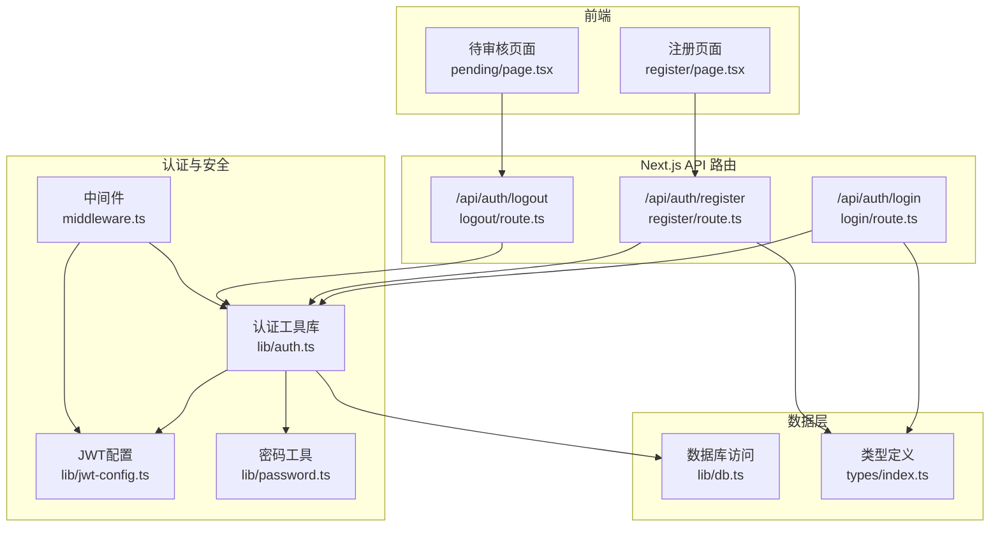
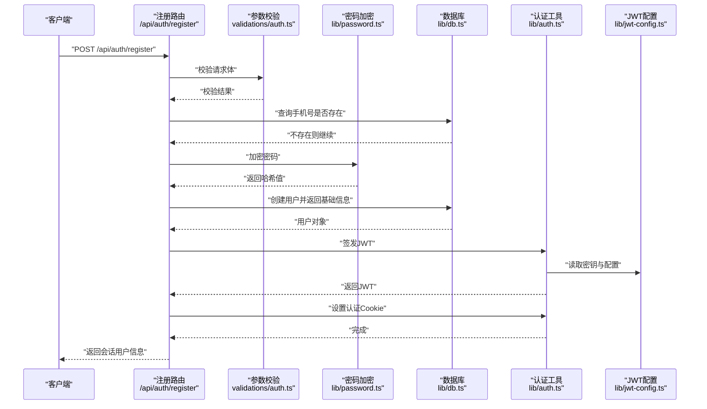
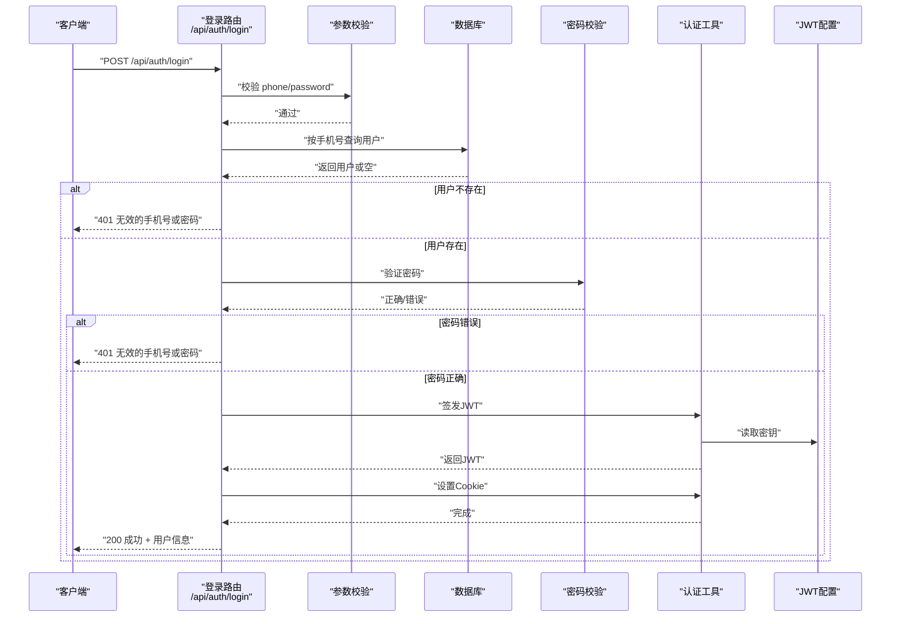
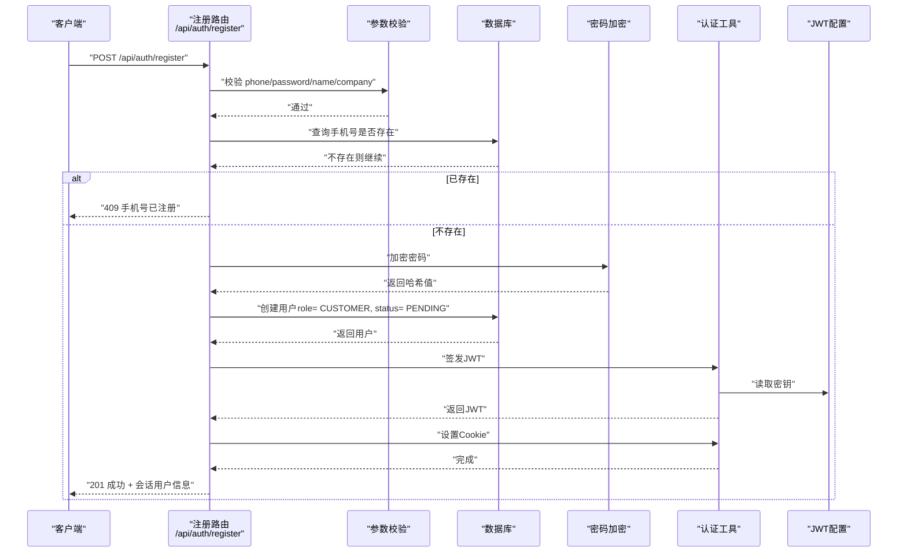
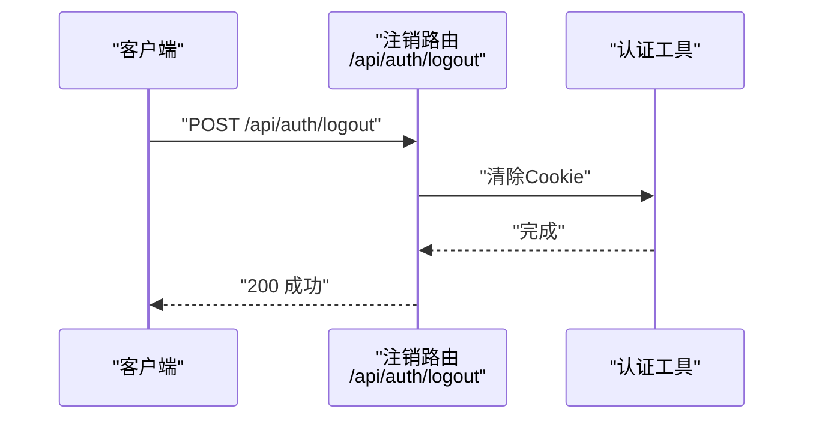
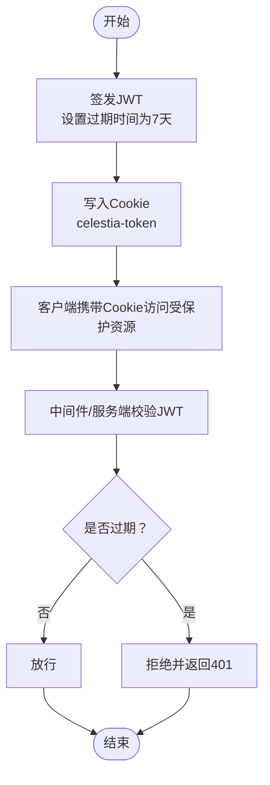
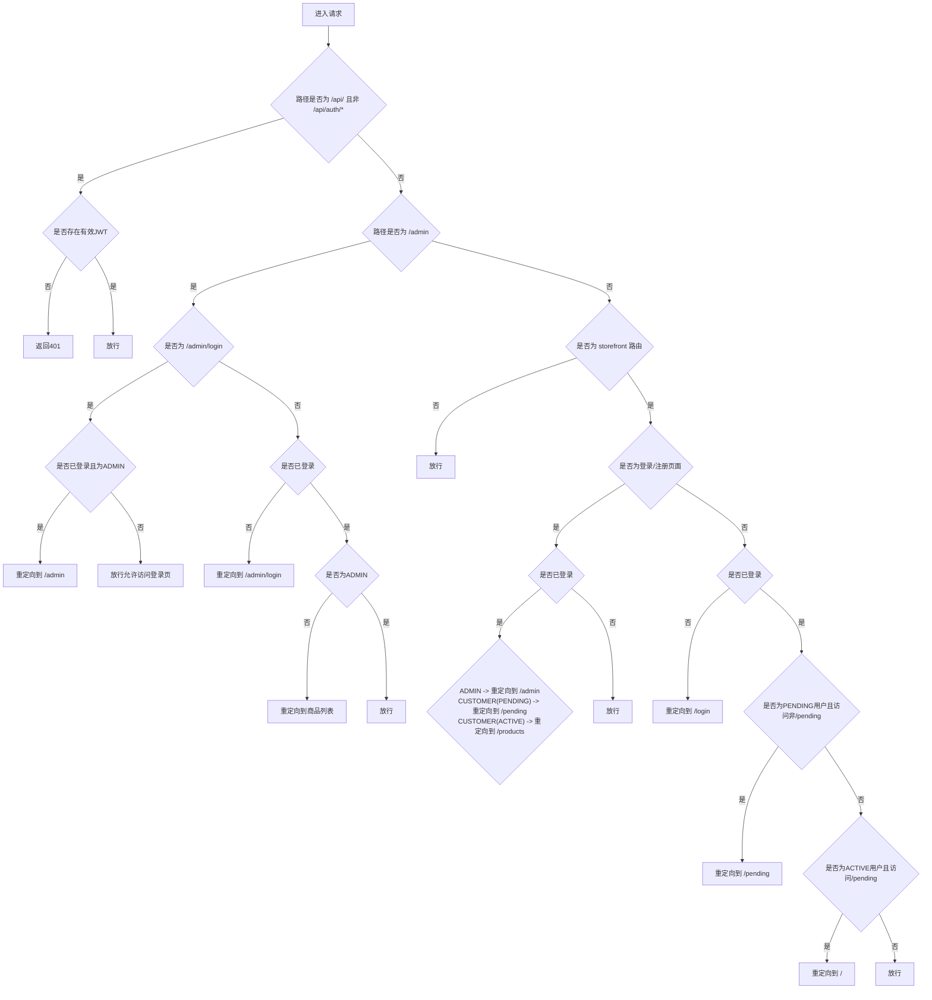
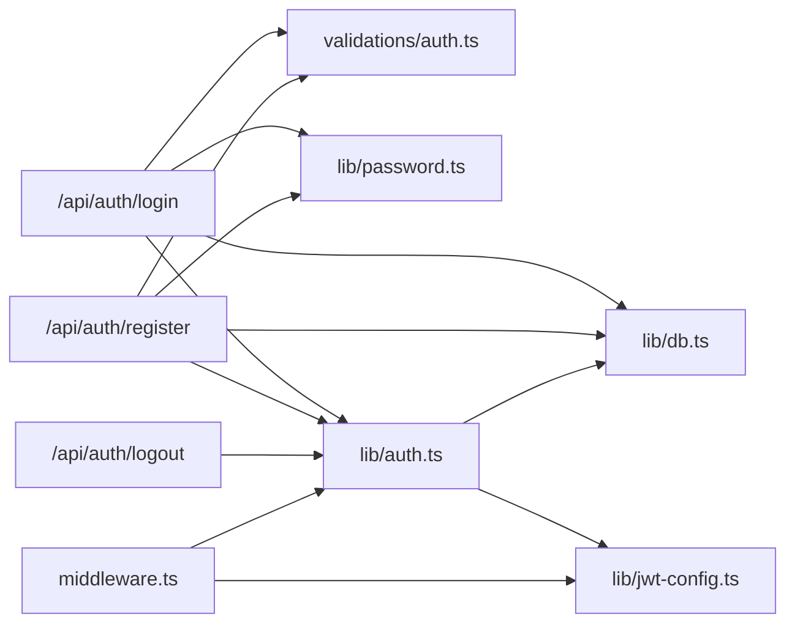

# 认证API

<cite>
**本文引用的文件**
- [src/app/api/auth/login/route.ts](file://src/app/api/auth/login/route.ts)
- [src/app/api/auth/register/route.ts](file://src/app/api/auth/register/route.ts)
- [src/app/api/auth/logout/route.ts](file://src/app/api/auth/logout/route.ts)
- [src/lib/auth.ts](file://src/lib/auth.ts)
- [src/lib/jwt-config.ts](file://src/lib/jwt-config.ts)
- [src/lib/password.ts](file://src/lib/password.ts)
- [src/lib/validations/auth.ts](file://src/lib/validations/auth.ts)
- [src/middleware.ts](file://src/middleware.ts)
- [src/lib/actions/auth.ts](file://src/lib/actions/auth.ts)
- [src/app/[locale]/storefront/(auth)/register/page.tsx](file://src/app/[locale]/storefront/(auth)/register/page.tsx)
- [src/app/[locale]/storefront/(auth)/pending/page.tsx](file://src/app/[locale]/storefront/(auth)/pending/page.tsx)
- [src/types/index.ts](file://src/types/index.ts)
</cite>

## 目录
1. [简介](#简介)
2. [项目结构](#项目结构)
3. [核心组件](#核心组件)
4. [架构总览](#架构总览)
5. [详细组件分析](#详细组件分析)
6. [依赖关系分析](#依赖关系分析)
7. [性能考量](#性能考量)
8. [故障排查指南](#故障排查指南)
9. [结论](#结论)
10. [附录](#附录)

## 简介
本文件为 Celestia 项目的认证API提供完整接口文档与实现解析，覆盖用户登录、注册、注销等关键流程；详细说明JWT令牌的签发、校验与持久化机制（Cookie），以及中间件的权限控制策略；同时给出请求/响应示例、错误处理与安全最佳实践，帮助开发者快速集成与排障。

## 项目结构
认证相关代码主要分布在以下位置：
- Next.js App Router API 路由：/src/app/api/auth/{login, register, logout}/route.ts
- 认证工具库：/src/lib/auth.ts、/src/lib/jwt-config.ts、/src/lib/password.ts
- 请求参数校验：/src/lib/validations/auth.ts
- 中间件：/src/middleware.ts
- 服务端动作（Server Actions）：/src/lib/actions/auth.ts
- 前端注册页面与待审核页面：/src/app/[locale]/storefront/(auth)/register/page.tsx、/src/app/[locale]/storefront/(auth)/pending/page.tsx
- 类型定义：/src/types/index.ts

图表来源
- [src/app/api/auth/login/route.ts:1-76](file://src/app/api/auth/login/route.ts#L1-L76)
- [src/app/api/auth/register/route.ts:1-85](file://src/app/api/auth/register/route.ts#L1-L85)
- [src/app/api/auth/logout/route.ts:1-21](file://src/app/api/auth/logout/route.ts#L1-L21)
- [src/lib/auth.ts:1-98](file://src/lib/auth.ts#L1-L98)
- [src/lib/jwt-config.ts:1-9](file://src/lib/jwt-config.ts#L1-L9)
- [src/lib/password.ts:1-18](file://src/lib/password.ts#L1-L18)
- [src/middleware.ts:1-147](file://src/middleware.ts#L1-L147)
- [src/types/index.ts:1-60](file://src/types/index.ts#L1-L60)

章节来源
- [src/app/api/auth/login/route.ts:1-76](file://src/app/api/auth/login/route.ts#L1-L76)
- [src/app/api/auth/register/route.ts:1-85](file://src/app/api/auth/register/route.ts#L1-L85)
- [src/app/api/auth/logout/route.ts:1-21](file://src/app/api/auth/logout/route.ts#L1-L21)
- [src/lib/auth.ts:1-98](file://src/lib/auth.ts#L1-L98)
- [src/lib/jwt-config.ts:1-9](file://src/lib/jwt-config.ts#L1-L9)
- [src/lib/password.ts:1-18](file://src/lib/password.ts#L1-L18)
- [src/middleware.ts:1-147](file://src/middleware.ts#L1-L147)
- [src/types/index.ts:1-60](file://src/types/index.ts#L1-L60)

## 核心组件
- 认证API路由
  - 登录：POST /api/auth/login
  - 注册：POST /api/auth/register
  - 注销：POST /api/auth/logout
- 认证工具库
  - JWT签发与校验、Cookie设置与清除、当前用户查询
- JWT配置
  - 密钥、Cookie名称、过期时间与最大年龄
- 密码工具
  - bcrypt加密与比对
- 参数校验
  - Zod Schema：登录/注册字段与长度约束
- 中间件
  - API鉴权、管理端路由保护、前台路由重定向与状态限制
- 服务端动作
  - Server Actions：getSession、logout
- 前端页面
  - 注册表单提交至 /api/auth/register
  - 待审核页面触发 /api/auth/logout

章节来源
- [src/app/api/auth/login/route.ts:1-76](file://src/app/api/auth/login/route.ts#L1-L76)
- [src/app/api/auth/register/route.ts:1-85](file://src/app/api/auth/register/route.ts#L1-L85)
- [src/app/api/auth/logout/route.ts:1-21](file://src/app/api/auth/logout/route.ts#L1-L21)
- [src/lib/auth.ts:1-98](file://src/lib/auth.ts#L1-L98)
- [src/lib/jwt-config.ts:1-9](file://src/lib/jwt-config.ts#L1-L9)
- [src/lib/password.ts:1-18](file://src/lib/password.ts#L1-L18)
- [src/lib/validations/auth.ts:1-17](file://src/lib/validations/auth.ts#L1-L17)
- [src/middleware.ts:1-147](file://src/middleware.ts#L1-L147)
- [src/lib/actions/auth.ts:1-20](file://src/lib/actions/auth.ts#L1-L20)
- [src/app/[locale]/storefront/(auth)/register/page.tsx](file://src/app/[locale]/storefront/(auth)/register/page.tsx#L1-L213)
- [src/app/[locale]/storefront/(auth)/pending/page.tsx](file://src/app/[locale]/storefront/(auth)/pending/page.tsx#L1-L49)

## 架构总览
认证系统采用“API路由 + 工具库 + 中间件”的分层设计：
- API路由负责接收请求、参数校验、数据库交互与响应封装
- 工具库封装JWT与Cookie操作、密码处理与当前用户查询
- 中间件在请求进入阶段进行统一鉴权与路由重定向
- 前端通过fetch调用API，完成用户注册与登录后的状态流转

图表来源
- [src/app/api/auth/register/route.ts:1-85](file://src/app/api/auth/register/route.ts#L1-L85)
- [src/lib/validations/auth.ts:1-17](file://src/lib/validations/auth.ts#L1-L17)
- [src/lib/password.ts:1-18](file://src/lib/password.ts#L1-L18)
- [src/lib/db.ts:1-18](file://src/lib/db.ts#L1-L18)
- [src/lib/auth.ts:1-98](file://src/lib/auth.ts#L1-L98)
- [src/lib/jwt-config.ts:1-9](file://src/lib/jwt-config.ts#L1-L9)

## 详细组件分析

### 登录接口
- 方法与URL
  - POST /api/auth/login
- 请求体参数
  - phone: 字符串，长度5~20
  - password: 字符串，至少6位
- 成功响应
  - data: 包含id、phone、name、role、markupRatio、preferredLang、status
  - message: 登录成功提示
  - 设置认证Cookie：celestia-token（httpOnly、secure、sameSite lax、maxAge 7天）
- 失败响应
  - 400：参数校验失败
  - 401：用户名或密码无效
  - 500：服务器内部错误
- 关键流程
  - 校验请求体 -> 查询用户 -> 验证密码 -> 签发JWT -> 写入Cookie -> 返回用户信息

图表来源
- [src/app/api/auth/login/route.ts:1-76](file://src/app/api/auth/login/route.ts#L1-L76)
- [src/lib/validations/auth.ts:1-17](file://src/lib/validations/auth.ts#L1-L17)
- [src/lib/password.ts:1-18](file://src/lib/password.ts#L1-L18)
- [src/lib/auth.ts:1-98](file://src/lib/auth.ts#L1-L98)
- [src/lib/jwt-config.ts:1-9](file://src/lib/jwt-config.ts#L1-L9)

章节来源
- [src/app/api/auth/login/route.ts:1-76](file://src/app/api/auth/login/route.ts#L1-L76)
- [src/lib/validations/auth.ts:1-17](file://src/lib/validations/auth.ts#L1-L17)
- [src/lib/password.ts:1-18](file://src/lib/password.ts#L1-L18)
- [src/lib/auth.ts:1-98](file://src/lib/auth.ts#L1-L98)
- [src/lib/jwt-config.ts:1-9](file://src/lib/jwt-config.ts#L1-L9)
- [src/types/index.ts:1-60](file://src/types/index.ts#L1-L60)

### 注册接口
- 方法与URL
  - POST /api/auth/register
- 请求体参数
  - phone: 字符串，长度5~20
  - password: 字符串，至少6位
  - name: 字符串，长度1~100
  - company: 可选字符串，最大200
- 成功响应
  - data: 会话用户信息（id、phone、name、role、status、markupRatio、preferredLang）
  - message: 注册成功提示
  - 设置认证Cookie：celestia-token（httpOnly、secure、sameSite lax、maxAge 7天）
- 失败响应
  - 400：参数校验失败
  - 409：手机号已注册
  - 500：服务器内部错误
- 关键流程
  - 校验请求体 -> 检查手机号重复 -> 加密密码 -> 创建用户 -> 签发JWT -> 写入Cookie -> 返回用户信息

图表来源
- [src/app/api/auth/register/route.ts:1-85](file://src/app/api/auth/register/route.ts#L1-L85)
- [src/lib/validations/auth.ts:1-17](file://src/lib/validations/auth.ts#L1-L17)
- [src/lib/password.ts:1-18](file://src/lib/password.ts#L1-L18)
- [src/lib/db.ts:1-18](file://src/lib/db.ts#L1-L18)
- [src/lib/auth.ts:1-98](file://src/lib/auth.ts#L1-L98)
- [src/lib/jwt-config.ts:1-9](file://src/lib/jwt-config.ts#L1-L9)

章节来源
- [src/app/api/auth/register/route.ts:1-85](file://src/app/api/auth/register/route.ts#L1-L85)
- [src/lib/validations/auth.ts:1-17](file://src/lib/validations/auth.ts#L1-L17)
- [src/lib/password.ts:1-18](file://src/lib/password.ts#L1-L18)
- [src/lib/db.ts:1-18](file://src/lib/db.ts#L1-L18)
- [src/lib/auth.ts:1-98](file://src/lib/auth.ts#L1-L98)
- [src/lib/jwt-config.ts:1-9](file://src/lib/jwt-config.ts#L1-L9)
- [src/types/index.ts:1-60](file://src/types/index.ts#L1-L60)

### 注销接口
- 方法与URL
  - POST /api/auth/logout
- 行为
  - 清除认证Cookie celestia-token
  - 返回成功消息
- 响应
  - 200：注销成功
  - 500：服务器内部错误

图表来源
- [src/app/api/auth/logout/route.ts:1-21](file://src/app/api/auth/logout/route.ts#L1-L21)
- [src/lib/auth.ts:1-98](file://src/lib/auth.ts#L1-L98)

章节来源
- [src/app/api/auth/logout/route.ts:1-21](file://src/app/api/auth/logout/route.ts#L1-L21)
- [src/lib/auth.ts:1-98](file://src/lib/auth.ts#L1-L98)

### JWT 令牌机制
- 签发
  - 载荷包含：userId、role、status
  - 算法：HS256
  - 过期时间：7天
- 校验
  - 使用环境变量中的密钥进行验证
  - 返回载荷或空
- 存储
  - Cookie 名称：celestia-token
  - 属性：httpOnly、secure（生产环境）、sameSite lax、maxAge 7天
- 刷新
  - 代码中未实现专用刷新接口；建议在客户端轮询或重新登录以获取新令牌

图表来源
- [src/lib/auth.ts:1-98](file://src/lib/auth.ts#L1-L98)
- [src/lib/jwt-config.ts:1-9](file://src/lib/jwt-config.ts#L1-L9)
- [src/middleware.ts:1-147](file://src/middleware.ts#L1-L147)

章节来源
- [src/lib/auth.ts:1-98](file://src/lib/auth.ts#L1-L98)
- [src/lib/jwt-config.ts:1-9](file://src/lib/jwt-config.ts#L1-L9)
- [src/middleware.ts:1-147](file://src/middleware.ts#L1-L147)

### 中间件与权限控制
- 公开路由
  - /api/auth/*
- API鉴权
  - 对于 /api/（除 /api/auth/*）的请求，若无有效JWT则返回401
- 管理端路由（/admin）
  - 未登录：重定向到 /admin/login
  - 已登录但非ADMIN：重定向到商品列表
  - 已登录且为ADMIN：放行
- 前台路由（storefront）
  - 登录/注册页面：已登录用户按角色重定向
  - 其他页面：未登录重定向到登录页
  - PENDING 用户：仅允许访问 /pending 页面，否则重定向
  - ACTIVE 用户：访问 /pending 将重定向到首页

图表来源
- [src/middleware.ts:1-147](file://src/middleware.ts#L1-L147)

章节来源
- [src/middleware.ts:1-147](file://src/middleware.ts#L1-L147)

### 服务端动作（Server Actions）
- getSession
  - 作用：获取当前会话用户
  - 实现：委托给 lib/auth 的 getCurrentUser
- logout
  - 作用：清除认证Cookie并重定向到登录页

章节来源
- [src/lib/actions/auth.ts:1-20](file://src/lib/actions/auth.ts#L1-L20)
- [src/lib/auth.ts:1-98](file://src/lib/auth.ts#L1-L98)

### 前端交互要点
- 注册页面
  - 使用 react-hook-form + zodResolver 进行前端校验
  - 提交至 /api/auth/register，成功后跳转到 /{locale}/storefront/pending
- 待审核页面
  - 点击注销按钮，调用 /api/auth/logout，成功后跳转到 /{locale}/storefront/login

章节来源
- [src/app/[locale]/storefront/(auth)/register/page.tsx](file://src/app/[locale]/storefront/(auth)/register/page.tsx#L1-L213)
- [src/app/[locale]/storefront/(auth)/pending/page.tsx](file://src/app/[locale]/storefront/(auth)/pending/page.tsx#L1-L49)

## 依赖关系分析
- 组件耦合
  - API路由依赖参数校验、密码工具、认证工具与数据库
  - 认证工具依赖JWT配置与数据库
  - 中间件依赖JWT配置与认证工具
- 外部依赖
  - jose（JWT）
  - bcryptjs（密码）
  - zod（参数校验）
  - Prisma + PostgreSQL（数据库）

图表来源
- [src/app/api/auth/login/route.ts:1-76](file://src/app/api/auth/login/route.ts#L1-L76)
- [src/app/api/auth/register/route.ts:1-85](file://src/app/api/auth/register/route.ts#L1-L85)
- [src/app/api/auth/logout/route.ts:1-21](file://src/app/api/auth/logout/route.ts#L1-L21)
- [src/lib/validations/auth.ts:1-17](file://src/lib/validations/auth.ts#L1-L17)
- [src/lib/password.ts:1-18](file://src/lib/password.ts#L1-L18)
- [src/lib/auth.ts:1-98](file://src/lib/auth.ts#L1-L98)
- [src/lib/jwt-config.ts:1-9](file://src/lib/jwt-config.ts#L1-L9)
- [src/middleware.ts:1-147](file://src/middleware.ts#L1-L147)

章节来源
- [src/app/api/auth/login/route.ts:1-76](file://src/app/api/auth/login/route.ts#L1-L76)
- [src/app/api/auth/register/route.ts:1-85](file://src/app/api/auth/register/route.ts#L1-L85)
- [src/app/api/auth/logout/route.ts:1-21](file://src/app/api/auth/logout/route.ts#L1-L21)
- [src/lib/validations/auth.ts:1-17](file://src/lib/validations/auth.ts#L1-L17)
- [src/lib/password.ts:1-18](file://src/lib/password.ts#L1-L18)
- [src/lib/auth.ts:1-98](file://src/lib/auth.ts#L1-L98)
- [src/lib/jwt-config.ts:1-9](file://src/lib/jwt-config.ts#L1-L9)
- [src/middleware.ts:1-147](file://src/middleware.ts#L1-L147)

## 性能考量
- JWT过期时间较长（7天），可降低频繁刷新成本，但需配合安全策略（如IP绑定、设备指纹）与最小权限原则
- 密码加密使用固定盐轮数，确保安全性与一致性
- 中间件在每次请求进行JWT校验，建议在网关层或边缘缓存减少重复计算
- 数据库查询集中在登录/注册/注销，注意索引优化（phone唯一索引）

## 故障排查指南
- 常见错误与处理
  - 400 参数校验失败：检查请求体字段与长度
  - 401 未授权/无效凭据：确认Cookie是否正确携带、JWT是否过期
  - 409 手机号已注册：提示用户更换手机号
  - 500 服务器错误：查看后端日志定位具体异常
- 安全建议
  - 生产环境务必启用HTTPS与secure Cookie
  - 建议增加登录失败次数限制与验证码
  - 建议实现JWT黑名单或短期令牌+刷新令牌方案
- 会话管理
  - 客户端应避免在本地存储明文令牌
  - 前端注销后应清理本地状态并重定向

章节来源
- [src/app/api/auth/login/route.ts:1-76](file://src/app/api/auth/login/route.ts#L1-L76)
- [src/app/api/auth/register/route.ts:1-85](file://src/app/api/auth/register/route.ts#L1-L85)
- [src/app/api/auth/logout/route.ts:1-21](file://src/app/api/auth/logout/route.ts#L1-L21)
- [src/lib/auth.ts:1-98](file://src/lib/auth.ts#L1-L98)
- [src/middleware.ts:1-147](file://src/middleware.ts#L1-L147)

## 结论
本认证体系以API路由为核心，结合参数校验、密码加密、JWT与Cookie管理及中间件权限控制，形成完整的前后端协作流程。建议在现有基础上完善令牌刷新、风控与审计能力，以满足更严格的生产安全要求。

## 附录
- 请求与响应示例（文本描述）
  - 登录
    - 请求：POST /api/auth/login
      - Body: {"phone":"...","password":"..."}
      - 成功：200，Body: {"success":true,"data":{"id":"...","phone":"...","name":"...","role":"CUSTOMER|ADMIN","status":"PENDING|ACTIVE",...},"message":"登录成功"}
      - 失败：400/401/500，Body: {"success":false,"error":"..."}
    - 注销
      - 请求：POST /api/auth/logout
      - 成功：200，Body: {"success":true,"message":"注销成功"}
      - 失败：500，Body: {"success":false,"error":"内部错误"}
    - 注册
      - 请求：POST /api/auth/register
      - 成功：201，Body: {"success":true,"data":{"id":"...","phone":"...","name":"...","role":"CUSTOMER","status":"PENDING",...},"message":"注册成功"}
      - 失败：400/409/500，Body: {"success":false,"error":"..."}
- 类型定义参考
  - ApiResponse、JwtPayload、SessionUser

章节来源
- [src/types/index.ts:1-60](file://src/types/index.ts#L1-L60)