# Excel导入系统

<cite>
**本文档引用的文件**
- [route.ts](file://src/app/api/upload/excel/route.ts)
- [parser.ts](file://src/lib/excel/parser.ts)
- [import.ts](file://src/lib/actions/import.ts)
- [translator.ts](file://src/lib/excel/translator.ts)
- [sku-expander.ts](file://src/lib/excel/sku-expander.ts)
- [image.ts](file://src/lib/image.ts)
- [convert-xindeyi-excel.ts](file://scripts/convert-xindeyi-excel.ts)
- [analyze-excel.ts](file://scripts/analyze-excel.ts)
- [generate-import-template.ts](file://scripts/generate-import-template.ts)
- [schema.prisma](file://prisma/schema.prisma)
- [db.ts](file://src/lib/db.ts)
- [index.ts](file://src/types/index.ts)
- [package.json](file://package.json)
- [docker-compose.yml](file://docker-compose.yml)
- [docker-compose.prod.yml](file://docker-compose.prod.yml)
- [Dockerfile](file://Dockerfile)
- [next.config.ts](file://next.config.ts)
- [order.ts](file://src/lib/actions/order.ts)
- [export-route.ts](file://src/app/api/admin/orders/[id]/export/route.ts)
- [admin-orders-page.tsx](file://src/app/admin/orders/[id]/page.tsx)
- [index.ts](file://docs/1688 demo/integration-1688/index.ts)
- [client.ts](file://docs/1688 demo/integration-1688/client.ts)
- [config.ts](file://docs/1688 demo/integration-1688/config.ts)
- [signature.ts](file://docs/1688 demo/integration-1688/signature.ts)
- [image-query.ts](file://docs/1688 demo/integration-1688/image-query.ts)
- [image-upload.ts](file://docs/1688 demo/integration-1688/image-upload.ts)
- [image-query-types.ts](file://docs/1688 demo/integration-1688/image-query-types.ts)
- [run-1688-query-product-detail.ts](file://docs/1688 demo/integration-1688/run-1688-query-product-detail.ts)
- [run-1688-member-get.ts](file://docs/1688 demo/integration-1688/run-1688-member-get.ts)
- [ali1688-import-dialog.tsx](file://src/components/admin/ali1688-import-dialog.tsx)
- [ali1688-sync-dialog.tsx](file://src/components/admin/ali1688-sync-dialog.tsx)
- [ali1688-import.ts](file://src/lib/actions/ali1688-import.ts)
- [20260517000001_add_ali1688_fields/migration.sql](file://prisma/migrations/20260517000001_add_ali1688_fields/migration.sql)
</cite>

## 更新摘要
**变更内容**
- 新增了管理员订单Excel导出功能，包括API端点实现、Excel工作簿生成、数据过滤机制、货币格式化等功能
- 在前端订单详情页面集成了Excel导出下载按钮
- 更新了ExcelJS库的使用，支持更丰富的Excel格式化功能
- 增强了订单数据的安全控制和权限验证机制
- 完善了错误处理和响应机制
- **新增**：1688集成系统，提供完整的阿里巴巴1688供应商商品导入和同步功能
- **新增**：1688商品导入对话框，支持批量商品获取、属性映射和一键入库
- **新增**：1688商品同步对话框，支持实时价格同步和库存状态更新
- **新增**：1688 API签名认证、图片上传、以图搜商品等核心功能模块
- **新增**：数据库字段扩展，支持1688商品ID和SKU ID的存储

## 目录
1. [项目概述](#项目概述)
2. [系统架构](#系统架构)
3. [核心组件](#核心组件)
4. [架构概览](#架构概览)
5. [详细组件分析](#详细组件分析)
6. [Excel导出功能](#excel导出功能)
7. [供应商数据转换系统](#供应商数据转换系统)
8. [1688集成系统](#1688集成系统)
9. [调试诊断系统](#调试诊断系统)
10. [部署配置](#部署配置)
11. [依赖关系分析](#依赖关系分析)
12. [性能考虑](#性能考虑)
13. [故障排除指南](#故障排除指南)
14. [结论](#结论)

## 项目概述

Excel导入系统是一个完整的商品数据批量导入解决方案，专为珠宝电商平台设计。该系统支持从Excel文件中批量导入商品信息，包括商品基本信息、SKU规格、图片资源等，并提供完整的数据验证、AI翻译和数据库持久化功能。

**新增** 系统现已扩展为包含完整的数据导入和导出功能，支持管理员对订单数据进行Excel格式的导出，便于采购和财务结算。同时集成了阿里巴巴1688供应商平台的深度集成，提供从1688批量获取商品、自动属性映射、价格转换和一键入库的完整解决方案。

系统采用现代化的技术栈，基于Next.js构建，使用Prisma ORM进行数据库操作，支持多语言国际化和云端存储集成。最新版本增强了调试诊断能力和生产环境稳定性，新增了供应商数据转换功能，支持多种供应商格式的自动转换，并增加了Excel导出功能和1688集成系统以满足业务需求。

## 系统架构

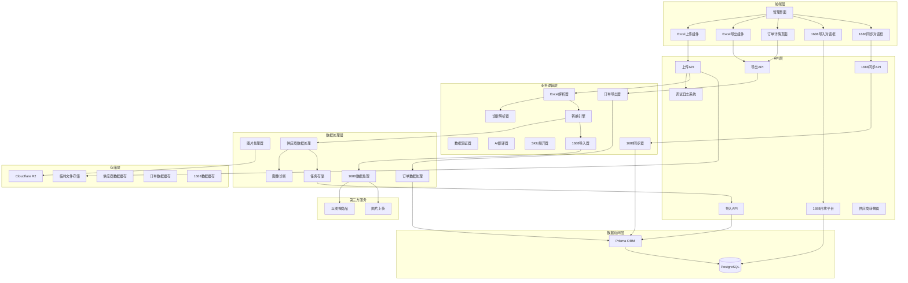

**图表来源**
- [route.ts:22-88](file://src/app/api/upload/excel/route.ts#L22-L88)
- [import.ts:248-395](file://src/lib/actions/import.ts#L248-L395)
- [parser.ts:64-112](file://src/lib/excel/parser.ts#L64-L112)
- [convert-xindeyi-excel.ts:280-478](file://scripts/convert-xindeyi-excel.ts#L280-L478)
- [export-route.ts:6-146](file://src/app/api/admin/orders/[id]/export/route.ts#L6-L146)
- [ali1688-import-dialog.tsx:1-544](file://src/components/admin/ali1688-import-dialog.tsx#L1-L544)
- [ali1688-sync-dialog.tsx:1-227](file://src/components/admin/ali1688-sync-dialog.tsx#L1-L227)

## 核心组件

### 1. Excel上传接口
负责接收和验证Excel文件上传，支持.xlsx和.xls格式，文件大小限制为10MB以内。

### 2. Excel解析器
使用ExcelJS库解析Excel文件，提取商品数据、图片信息和元数据。**新增**：包含全面的调试诊断日志系统，增强图像提取过程的可观测性。

### 3. 数据验证器
验证解析后的数据完整性，确保必需字段存在且格式正确。

### 4. AI翻译器
自动翻译商品名称、描述和品类信息到英文和阿拉伯文版本。

### 5. SKU展开器
根据商品规格参数生成完整的SKU组合，支持多维度笛卡尔积计算。

### 6. 图片处理器
处理和优化商品图片，支持WebP格式转换和缩略图生成。**新增**：集成图像诊断日志，监控图片处理过程。

### 7. 任务管理系统
管理导入任务的生命周期，包括解析、预览、确认和执行阶段。

### 8. 调试诊断系统
**新增**：提供全面的日志记录和监控能力，支持生产环境的问题排查。

### 9. 供应商数据转换系统
**新增**：专门处理不同供应商格式的Excel文件转换，支持新德艺等供应商的报价表转换为系统导入模板。

### 10. Excel导出系统
**新增**：提供管理员订单Excel导出功能，支持采购清单的生成和下载，包含数据过滤、格式化和安全控制。

### 11. 1688集成系统
**新增**：提供完整的阿里巴巴1688供应商平台集成，包括商品导入、价格同步、属性映射和数据管理功能。

**章节来源**
- [route.ts:18-88](file://src/app/api/upload/excel/route.ts#L18-L88)
- [parser.ts:48-135](file://src/lib/excel/parser.ts#L48-L135)
- [import.ts:245-395](file://src/lib/actions/import.ts#L245-L395)
- [convert-xindeyi-excel.ts:1-561](file://scripts/convert-xindeyi-excel.ts#L1-L561)
- [export-route.ts:6-146](file://src/app/api/admin/orders/[id]/export/route.ts#L6-L146)
- [ali1688-import-dialog.tsx:1-544](file://src/components/admin/ali1688-import-dialog.tsx#L1-L544)
- [ali1688-sync-dialog.tsx:1-227](file://src/components/admin/ali1688-sync-dialog.tsx#L1-L227)

## 架构概览

系统采用分层架构设计，各层职责明确，便于维护和扩展：

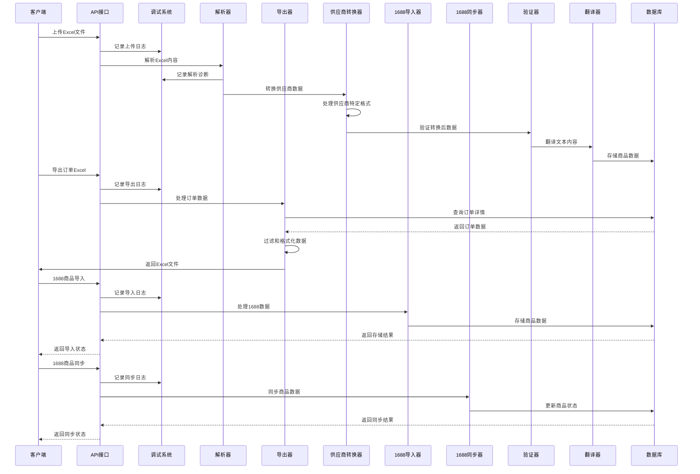

**图表来源**
- [route.ts:22-88](file://src/app/api/upload/excel/route.ts#L22-L88)
- [import.ts:248-395](file://src/lib/actions/import.ts#L248-L395)
- [parser.ts:64-112](file://src/lib/excel/parser.ts#L64-L112)
- [convert-xindeyi-excel.ts:280-478](file://scripts/convert-xindeyi-excel.ts#L280-L478)
- [export-route.ts:6-146](file://src/app/api/admin/orders/[id]/export/route.ts#L6-L146)
- [ali1688-import-dialog.tsx:100-175](file://src/components/admin/ali1688-import-dialog.tsx#L100-L175)
- [ali1688-sync-dialog.tsx:48-78](file://src/components/admin/ali1688-sync-dialog.tsx#L48-L78)

## 详细组件分析

### Excel上传接口分析

上传接口实现了完整的文件处理流程：

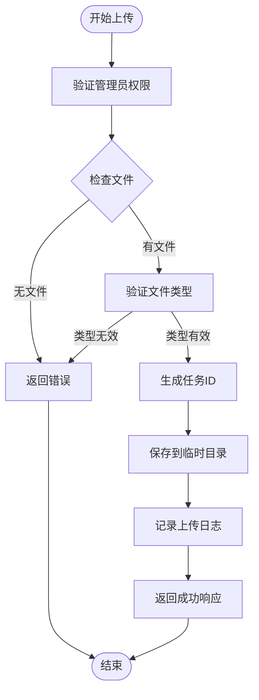

**图表来源**
- [route.ts:22-88](file://src/app/api/upload/excel/route.ts#L22-L88)

**章节来源**
- [route.ts:18-88](file://src/app/api/upload/excel/route.ts#L18-L88)

### Excel解析器实现

解析器负责从Excel文件中提取结构化数据，并提供全面的调试诊断能力：

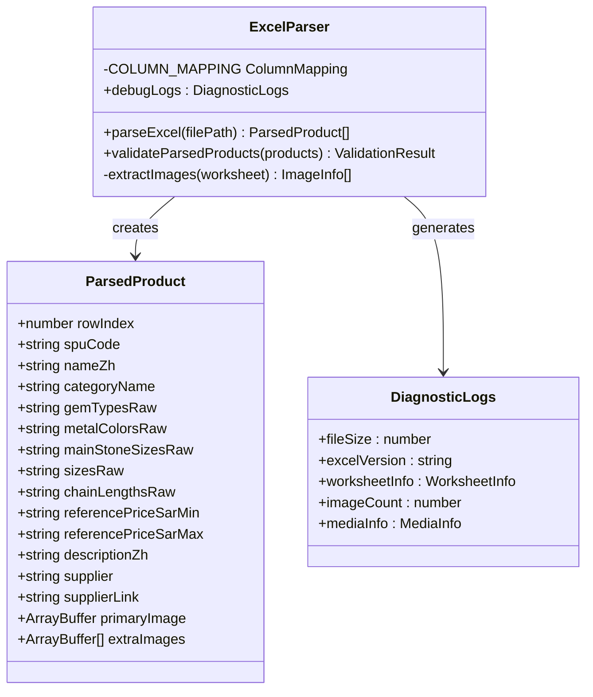

**图表来源**
- [parser.ts:3-20](file://src/lib/excel/parser.ts#L3-L20)
- [parser.ts:53-135](file://src/lib/excel/parser.ts#L53-L135)
- [parser.ts:64-112](file://src/lib/excel/parser.ts#L64-L112)

**章节来源**
- [parser.ts:48-185](file://src/lib/excel/parser.ts#L48-L185)

### 导入任务管理系统

任务管理系统实现了完整的导入流程控制：

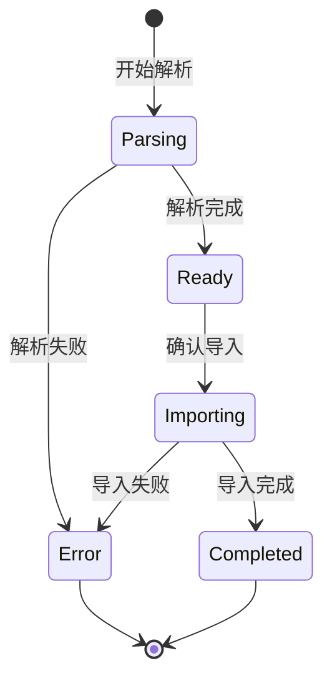

**图表来源**
- [import.ts:52-61](file://src/lib/actions/import.ts#L52-L61)
- [import.ts:248-395](file://src/lib/actions/import.ts#L248-L395)

**章节来源**
- [import.ts:52-82](file://src/lib/actions/import.ts#L52-L82)

### 数据库模型设计

系统使用Prisma ORM定义了完整的数据模型：

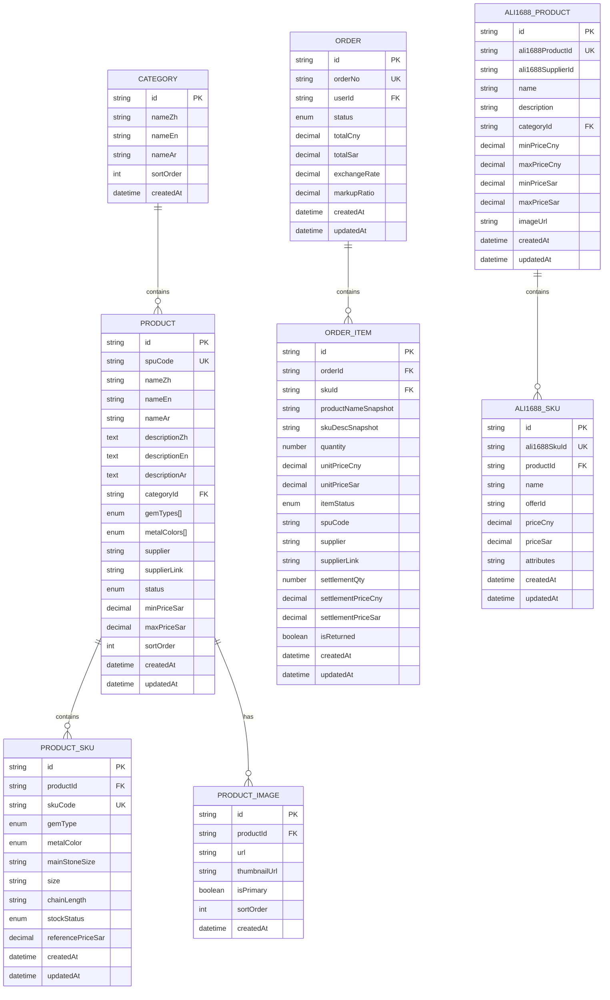

**图表来源**
- [schema.prisma:121-173](file://prisma/schema.prisma#L121-L173)
- [schema.prisma:107-118](file://prisma/schema.prisma#L107-L118)
- [20260517000001_add_ali1688_fields/migration.sql:1-6](file://prisma/migrations/20260517000001_add_ali1688_fields/migration.sql#L1-L6)

**章节来源**
- [schema.prisma:120-189](file://prisma/schema.prisma#L120-L189)

## Excel导出功能

**新增** 系统现在包含完整的Excel导出功能，专门为管理员提供订单数据的Excel格式导出：

### 导出API实现

导出API实现了完整的订单数据导出流程：

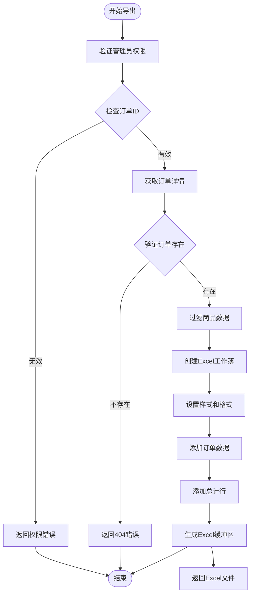

**图表来源**
- [export-route.ts:6-146](file://src/app/api/admin/orders/[id]/export/route.ts#L6-L146)

### 导出功能特性

1. **权限控制**
   - 仅管理员用户可访问导出功能
   - 实时权限验证确保数据安全

2. **数据过滤**
   - 自动过滤已移除的客户商品（CUSTOMER_REMOVED状态）
   - 仅导出有效的订单商品数据

3. **格式化处理**
   - 支持人民币格式化（¥#,##0.00）
   - 居中对齐和表头样式设置
   - 自动计算数量和金额总计

4. **文件生成**
   - 使用ExcelJS库生成.xlsx格式文件
   - 自动设置正确的HTTP响应头
   - 流式传输避免内存溢出

### 导出数据结构

导出的Excel文件包含以下列：

| 列名 | 字段 | 格式 |
|------|------|------|
| 序号 | 商品序号 | 数字居中 |
| SPU编号 | 商品SPU编码 | 文本 |
| 商品名称 | 商品名称快照 | 文本 |
| SKU描述 | SKU描述快照 | 文本 |
| 供应商 | 供应商名称 | 文本 |
| 供应商链接 | 供应商链接 | 文本 |
| 数量 | 商品数量 | 数字居中 |
| 成本单价(¥) | 成本单价（人民币） | 金额格式 |
| 成本小计(¥) | 成本小计（人民币） | 金额格式 |

### 前端集成

订单详情页面集成了Excel导出按钮：

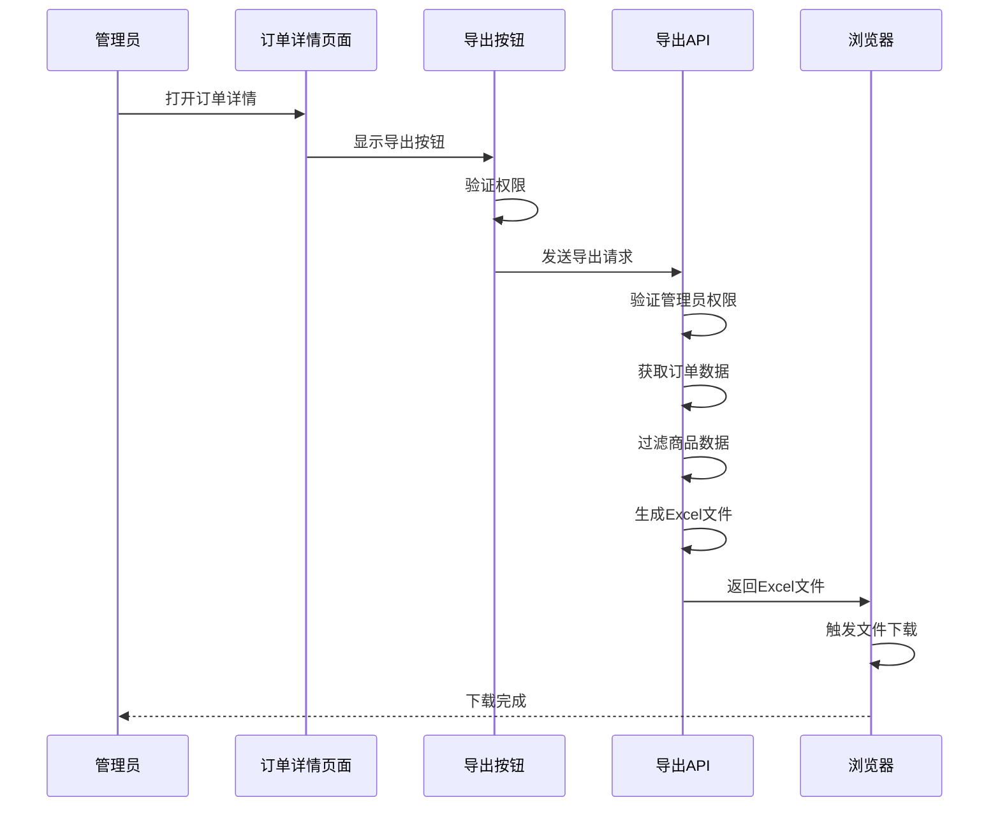

**图表来源**
- [admin-orders-page.tsx:352-363](file://src/app/admin/orders/[id]/page.tsx#L352-L363)
- [export-route.ts:6-146](file://src/app/api/admin/orders/[id]/export/route.ts#L6-L146)

**章节来源**
- [export-route.ts:6-146](file://src/app/api/admin/orders/[id]/export/route.ts#L6-L146)
- [admin-orders-page.tsx:352-363](file://src/app/admin/orders/[id]/page.tsx#L352-L363)

## 供应商数据转换系统

**新增** 系统现在包含完整的供应商数据转换功能，专门处理不同供应商格式的Excel文件：

### 转换器架构

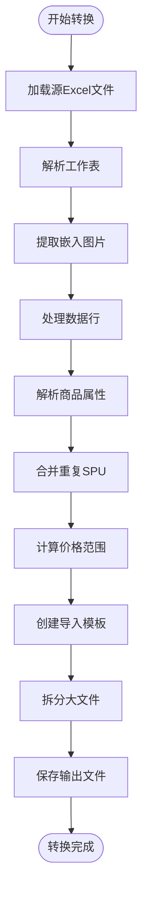

**图表来源**
- [convert-xindeyi-excel.ts:280-478](file://scripts/convert-xindeyi-excel.ts#L280-L478)

### 新德艺供应商转换器

**新增** 专门处理新德艺供应商的Excel转换：

#### 核心特性
1. **智能SPU识别**：从混合格式的编号列中提取SPU编号和商品名称
2. **多格式尺寸解析**：支持克拉、分、毫米等多种尺寸格式
3. **智能价格计算**：根据汇率和倍数系数计算参考价格
4. **自动图片提取**：从Excel中提取嵌入的图片数据
5. **重复数据合并**：将同一SPU的不同行数据合并处理

#### 转换流程

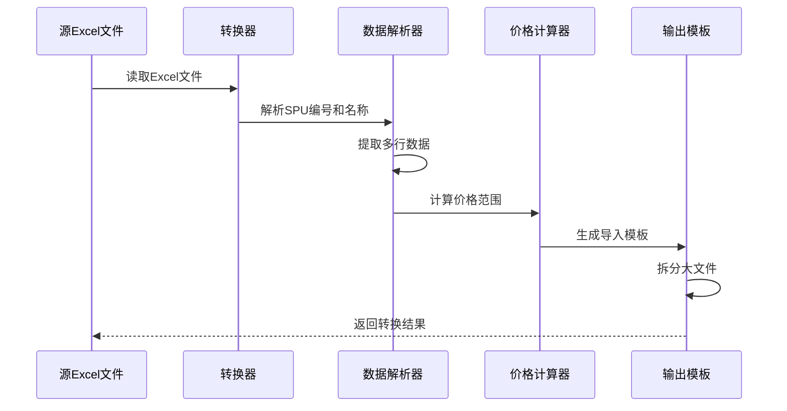

**图表来源**
- [convert-xindeyi-excel.ts:348-443](file://scripts/convert-xindeyi-excel.ts#L348-L443)

**章节来源**
- [convert-xindeyi-excel.ts:1-561](file://scripts/convert-xindeyi-excel.ts#L1-L561)

## 1688集成系统

**新增** 系统现在包含完整的阿里巴巴1688供应商平台集成，提供从1688批量获取商品、自动属性映射、价格转换和一键入库的完整解决方案：

### 1688 API架构

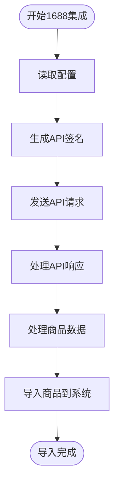

**图表来源**
- [config.ts:19-32](file://docs/1688 demo/integration-1688/config.ts#L19-L32)
- [signature.ts:17-36](file://docs/1688 demo/integration-1688/signature.ts#L17-L36)
- [client.ts:20-59](file://docs/1688 demo/integration-1688/client.ts#L20-L59)

### 1688 API核心功能

#### 配置管理
- **应用密钥管理**：从环境变量读取ALI_1688_APP_KEY、ALI_1688_APP_SECRET、ALI_1688_ACCESS_TOKEN
- **API主机配置**：支持自定义API主机地址，默认使用gw.open.1688.com
- **配置验证**：确保所有必需配置项都已正确设置

#### 签名认证
- **HMAC-SHA1算法**：使用AppSecret对请求参数进行签名
- **参数排序**：对所有参与签名的参数按键值排序
- **时间戳管理**：自动生成_aop_timestamp参数
- **访问令牌**：自动添加access_token参数

#### 图片上传
- **Base64编码**：将图片二进制数据转换为Base64格式
- **上传接口**：调用com.alibaba.fenxiao.crossborder:product.image.upload
- **ImageId获取**：从响应中提取imageId用于后续查询

#### 以图搜商品
- **图片搜索**：支持通过imageId或图片URL进行商品搜索
- **结果映射**：将1688原始数据映射为系统标准格式
- **分页处理**：支持多页结果获取和处理

### 1688商品导入流程

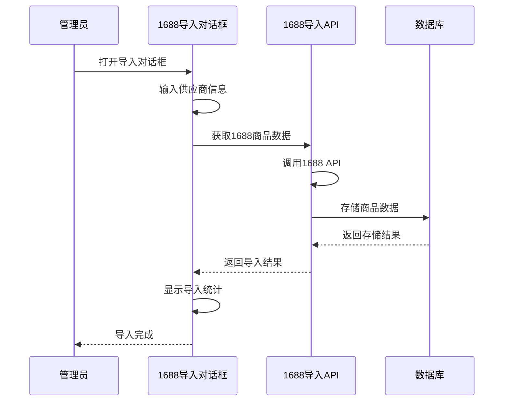

**图表来源**
- [ali1688-import-dialog.tsx:100-175](file://src/components/admin/ali1688-import-dialog.tsx#L100-L175)
- [ali1688-import.ts:366-688](file://src/lib/actions/ali1688-import.ts#L366-L688)

### 1688商品同步流程

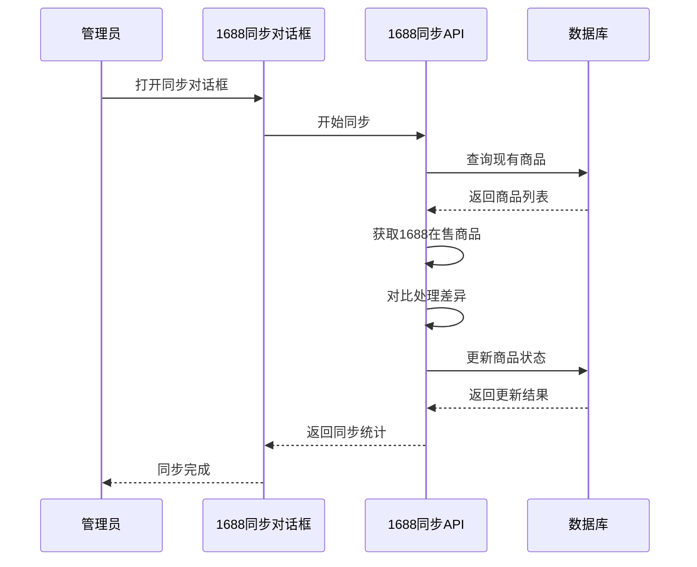

**图表来源**
- [ali1688-sync-dialog.tsx:48-78](file://src/components/admin/ali1688-sync-dialog.tsx#L48-L78)
- [ali1688-import.ts:721-780](file://src/lib/actions/ali1688-import.ts#L721-L780)

### 1688导入对话框功能

1. **供应商信息输入**
   - 供应商ID（sellerOpenId）输入
   - 供应商名称设置
   - SPU前缀配置（自动转为大写）

2. **导入参数配置**
   - 现行汇率设置（默认0.5814）
   - 获取商品数量限制
   - 自动汇率验证

3. **商品获取流程**
   - 调用1688 API获取商品数据
   - 显示获取进度和错误信息
   - 支持重试机制

4. **属性映射确认**
   - 自动收集所有唯一属性名
   - 按商品类别分组显示
   - 支持宝石类型、金属颜色、主石尺寸、尺码、链长度等映射

5. **一键入库**
   - 权限验证（仅管理员）
   - 图片下载和处理
   - 价格转换（CNY→SAR）
   - 数据库事务提交
   - 导入统计和错误报告

### 1688同步对话框功能

1. **同步参数配置**
   - 供应商ID输入验证
   - 汇率设置和验证
   - 同步说明提示

2. **同步统计展示**
   - 总商品数统计
   - 价格更新统计
   - 已下架商品统计
   - SKU缺货统计
   - 处理失败统计

3. **同步流程控制**
   - 分页获取1688在售商品
   - 对比系统现有商品
   - 自动下架已删除商品
   - 更新价格信息
   - 返回详细同步结果

**章节来源**
- [config.ts:19-32](file://docs/1688 demo/integration-1688/config.ts#L19-L32)
- [signature.ts:17-36](file://docs/1688 demo/integration-1688/signature.ts#L17-L36)
- [client.ts:20-59](file://docs/1688 demo/integration-1688/client.ts#L20-L59)
- [image-upload.ts:30-99](file://docs/1688 demo/integration-1688/image-upload.ts#L30-L99)
- [image-query.ts:79-193](file://docs/1688 demo/integration-1688/image-query.ts#L79-L193)
- [ali1688-import-dialog.tsx:1-544](file://src/components/admin/ali1688-import-dialog.tsx#L1-L544)
- [ali1688-sync-dialog.tsx:1-227](file://src/components/admin/ali1688-sync-dialog.tsx#L1-L227)
- [ali1688-import.ts:366-780](file://src/lib/actions/ali1688-import.ts#L366-L780)

## 调试诊断系统

**新增** 系统现在包含全面的调试诊断日志系统，显著增强了生产环境的可观测性：

### 诊断日志类型

1. **文件级诊断日志**
   - 文件大小统计
   - ExcelJS版本信息
   - 工作表元数据

2. **媒体数据诊断日志**
   - 媒体对象存在性检测
   - 媒体类型和名称
   - 媒体缓冲区大小

3. **图像提取诊断日志**
   - 图片数量统计
   - 图片位置信息
   - 图片处理状态

4. **供应商转换诊断日志**
   - **新增**：供应商数据转换过程的详细日志
   - **新增**：SPU识别成功率统计
   - **新增**：价格计算准确性验证

5. **Excel导出诊断日志**
   - **新增**：导出过程的详细日志记录
   - **新增**：订单数据过滤和格式化过程
   - **新增**：Excel文件生成和下载统计

6. **1688集成诊断日志**
   - **新增**：1688 API调用日志
   - **新增**：签名生成和验证过程
   - **新增**：商品数据导入和同步统计

### 日志记录机制

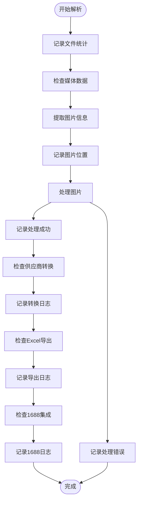

**图表来源**
- [parser.ts:64-112](file://src/lib/excel/parser.ts#L64-L112)

**章节来源**
- [parser.ts:64-112](file://src/lib/excel/parser.ts#L64-L112)

## 部署配置

**更新** 生产环境部署配置得到显著改进，确保Excel处理功能和1688集成在生产环境中的稳定运行：

### Docker Compose 生产配置

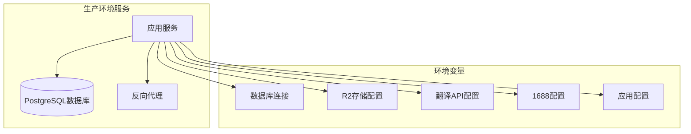

**图表来源**
- [docker-compose.prod.yml:10-27](file://docker-compose.prod.yml#L10-L27)

### Dockerfile 优化

1. **多阶段构建优化**
   - 使用阿里云镜像加速
   - Alpine Linux基础镜像
   - 原生模块编译支持

2. **生产环境配置**
   - 独立用户运行
   - 上传目录权限设置
   - Prisma引擎复制

### 1688配置要求

**新增** 生产环境中需要配置以下1688相关环境变量：

- ALI_1688_APP_KEY：1688应用密钥
- ALI_1688_APP_SECRET：1688应用密钥私钥
- ALI_1688_ACCESS_TOKEN：1688访问令牌
- ALI_1688_API_HOST：1688 API主机地址（可选，默认gw.open.1688.com）

**章节来源**
- [docker-compose.prod.yml:1-69](file://docker-compose.prod.yml#L1-L69)
- [Dockerfile:1-86](file://Dockerfile#L1-L86)
- [config.ts:19-32](file://docs/1688 demo/integration-1688/config.ts#L19-L32)

### Next.js 配置优化

**更新** Next.js配置增强了对原生模块的支持：

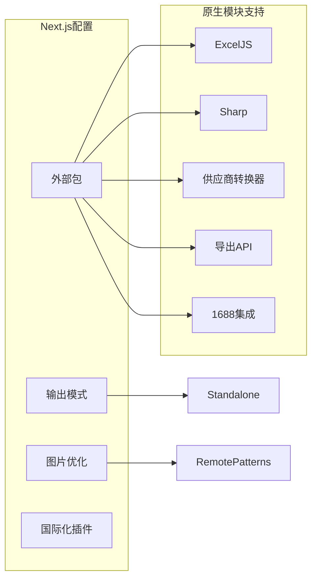

**图表来源**
- [next.config.ts:4-15](file://next.config.ts#L4-L15)

**章节来源**
- [next.config.ts:1-20](file://next.config.ts#L1-L20)

## 依赖关系分析

系统依赖关系清晰，主要外部依赖包括：

```mermaid
graph LR
subgraph "核心依赖"
ExcelJS[exceljs]
Prisma[prisma]
Postgres[pg]
ExcelJS2[xlsx]
NextJS[next]
Sharp[sharp]
R2[cloudflare-r2]
Decimal[decimal.js]
end
subgraph "业务依赖"
NextIntl[next-intl]
TailwindCSS[tailwindcss]
RadixUI[@radix-ui/react-*]
end
subgraph "部署依赖"
Docker[docker-compose]
Nginx[nginx]
Alpine[alpine linux]
end
subgraph "供应商转换依赖"
TSNode[ts-node]
FS[fs]
Path[path]
end
subgraph "导出功能依赖"
Lucide[Lucide React]
FramerMotion[framer-motion]
Sonner[sonner]
end
subgraph "1688集成依赖"
Crypto[crypto]
URLSearchParams[URLSearchParams]
end
ExcelParser --> ExcelJS
ExcelParser --> ExcelJS2
ImportSystem --> Prisma
Prisma --> Postgres
ImageProcessor --> Sharp
ImportSystem --> R2
ImportSystem --> Decimal
UIComponents --> NextJS
UIComponents --> NextIntl
UIComponents --> TailwindCSS
UIComponents --> RadixUI
Docker --> Alpine
Docker --> Nginx
SupplierConverter --> TSNode
SupplierConverter --> FS
SupplierConverter --> Path
ExportAPI --> ExcelJS
ExportAPI --> Lucide
ExportAPI --> FramerMotion
ExportAPI --> Sonner
Ali1688API --> Crypto
Ali1688API --> URLSearchParams
```

**图表来源**
- [package.json:11-47](file://package.json#L11-L47)
- [package.json:49-60](file://package.json#L49-L60)

**章节来源**
- [package.json:11-62](file://package.json#L11-L62)

## 性能考虑

系统在设计时充分考虑了性能优化：

1. **并发处理**：使用Promise.all实现并行处理多个任务
2. **内存管理**：临时文件及时清理，避免内存泄漏
3. **数据库优化**：使用事务批量操作，减少数据库往返
4. **缓存策略**：任务状态存储在内存中，提高响应速度
5. **图片处理**：异步处理图片，避免阻塞主线程
6. **日志优化**：调试日志仅在开发环境启用，生产环境保持性能
7. **原生模块优化**：通过serverExternalPackages配置优化原生模块加载
8. **供应商转换优化**：**新增**：批量处理供应商数据，支持大文件分块处理
9. **Excel解析优化**：**新增**：ExcelJS替代xlsx，提升解析性能和兼容性
10. **Excel导出优化**：**新增**：流式生成Excel文件，避免内存溢出
11. **前端性能优化**：**新增**：导出按钮使用window.open实现异步下载
12. **1688 API优化**：**新增**：分页处理大量商品数据，避免单次请求过大
13. **图片处理优化**：**新增**：异步下载和处理1688商品图片，避免阻塞导入流程
14. **价格转换优化**：**新增**：批量处理价格转换，提升导入效率

## 故障排除指南

### 常见问题及解决方案

1. **文件上传失败**
   - 检查文件格式是否为.xlsx或.xls
   - 确认文件大小不超过10MB限制
   - 验证管理员权限

2. **Excel解析错误**
   - 确保使用标准导入模板
   - 检查必需字段是否完整填写
   - 验证图片是否正确嵌入
   - **新增**：查看调试日志了解具体的解析问题

3. **数据库导入失败**
   - 检查SPU编码是否唯一
   - 验证品类信息是否存在
   - 确认价格格式正确

4. **Excel导出失败**
   - **新增**：检查管理员权限验证
   - **新增**：确认订单ID有效性
   - **新增**：验证订单数据完整性
   - **新增**：检查ExcelJS库版本兼容性

5. **1688集成失败**
   - **新增**：检查1688配置环境变量是否正确设置
   - **新增**：验证签名生成算法和参数排序
   - **新增**：确认API访问令牌有效性
   - **新增**：检查网络连接和防火墙设置

6. **1688商品导入失败**
   - **新增**：检查供应商ID是否正确
   - **新增**：验证属性映射配置
   - **新增**：确认汇率设置合理
   - **新增**：查看导入错误统计和失败原因

7. **1688商品同步失败**
   - **新增**：检查数据库连接状态
   - **新增**：验证1688 API响应格式
   - **新增**：确认商品对比逻辑正确性
   - **新增**：查看同步统计和错误日志

8. **生产环境部署问题**
   - **新增**：检查Docker容器健康检查状态
   - **新增**：验证环境变量配置
   - **新增**：确认原生模块编译完成
   - **新增**：验证1688 API证书和网络访问

9. **图片处理失败**
   - **新增**：查看图像诊断日志
   - **新增**：检查R2存储配置
   - **新增**：验证图片格式支持
   - **新增**：确认1688图片URL可访问性

10. **前端导出按钮失效**
    - **新增**：检查window.open浏览器兼容性
    - **新增**：确认导出API端点可用性
    - **新增**：验证客户端权限状态
    - **新增**：检查ExcelJS库加载状态

**章节来源**
- [import.ts:368-395](file://src/lib/actions/import.ts#L368-L395)
- [route.ts:54-59](file://src/app/api/upload/excel/route.ts#L54-L59)
- [parser.ts:64-112](file://src/lib/excel/parser.ts#L64-L112)
- [convert-xindeyi-excel.ts:280-478](file://scripts/convert-xindeyi-excel.ts#L280-L478)
- [export-route.ts:138-144](file://src/app/api/admin/orders/[id]/export/route.ts#L138-L144)
- [config.ts:25-29](file://docs/1688 demo/integration-1688/config.ts#L25-L29)
- [ali1688-import-dialog.tsx:133-137](file://src/components/admin/ali1688-import-dialog.tsx#L133-L137)

## 结论

Excel导入系统是一个功能完整、架构清晰的商品数据批量导入解决方案。最新版本在原有优势基础上，新增了全面的调试诊断能力和优化的生产环境配置，并引入了供应商数据转换功能、Excel导出功能和阿里巴巴1688集成系统：

### 主要优势

1. **完整的数据处理流程**：从文件上传到数据库持久化的全流程自动化
2. **强大的数据验证机制**：多层次的数据验证确保数据质量
3. **灵活的SKU生成**：支持复杂的规格组合和笛卡尔积计算
4. **高效的图片处理**：支持多种格式转换和优化
5. **完善的错误处理**：友好的错误提示和恢复机制
6. **全面的调试诊断**：生产环境可观测性显著提升
7. **优化的部署配置**：确保系统在生产环境中的稳定运行
8. **供应商数据转换**：**新增**：支持多种供应商格式的自动转换
9. **ExcelJS迁移**：**新增**：提升解析性能和兼容性
10. **Excel导出功能**：**新增**：提供管理员订单数据导出能力
11. **1688深度集成**：**新增**：提供完整的阿里巴巴1688供应商平台集成
12. **批量商品导入**：**新增**：支持从1688批量获取商品并一键入库
13. **实时价格同步**：**新增**：支持1688商品价格和库存状态实时同步
14. **智能属性映射**：**新增**：自动识别和映射1688商品属性到系统字段

### 技术创新

1. **调试诊断系统**：为Excel解析器和图像提取过程提供了全面的日志记录
2. **供应商转换引擎**：**新增**：专门处理不同供应商格式的Excel文件转换
3. **ExcelJS迁移**：**新增**：从xlsx迁移到ExcelJS，提升解析性能
4. **生产环境优化**：通过Docker多阶段构建和Next.js配置优化提升性能
5. **可观测性增强**：支持生产环境的问题快速定位和解决
6. **原生模块支持**：通过serverExternalPackages配置优化原生模块加载
7. **Excel导出API**：**新增**：提供完整的订单数据导出功能
8. **前端导出集成**：**新增**：在订单详情页面集成Excel导出按钮
9. **1688 API集成**：**新增**：完整的阿里巴巴1688供应商平台API集成
10. **批量导入对话框**：**新增**：提供直观的1688商品导入用户界面
11. **实时同步功能**：**新增**：支持1688商品数据的实时同步和更新
12. **智能错误处理**：**新增**：提供详细的导入和同步错误报告

系统采用现代化的技术栈和最佳实践，具有良好的可扩展性和维护性，能够满足珠宝电商行业的复杂需求，并为未来的功能扩展奠定了坚实的基础。1688集成系统的加入，使得系统不仅能够处理内部Excel导入，还能直接对接阿里巴巴1688供应链，为企业提供从供应商到销售的全链路数字化解决方案。