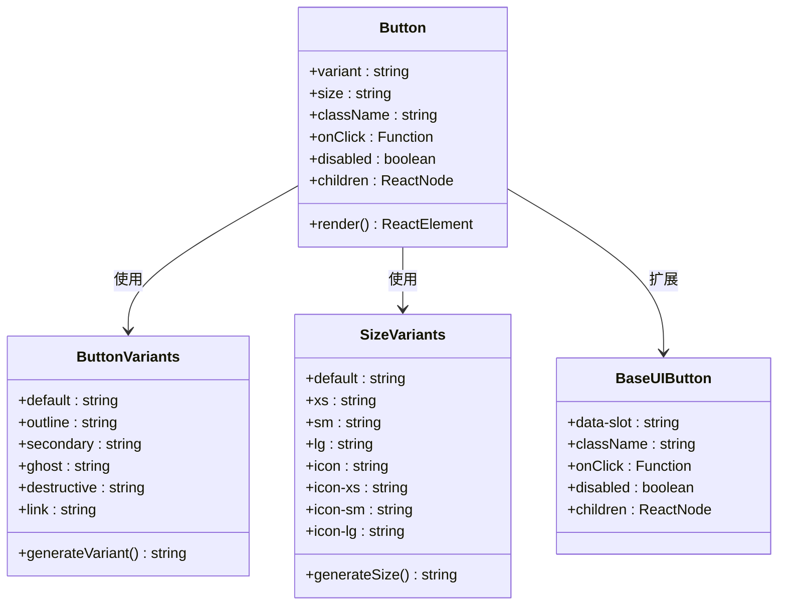
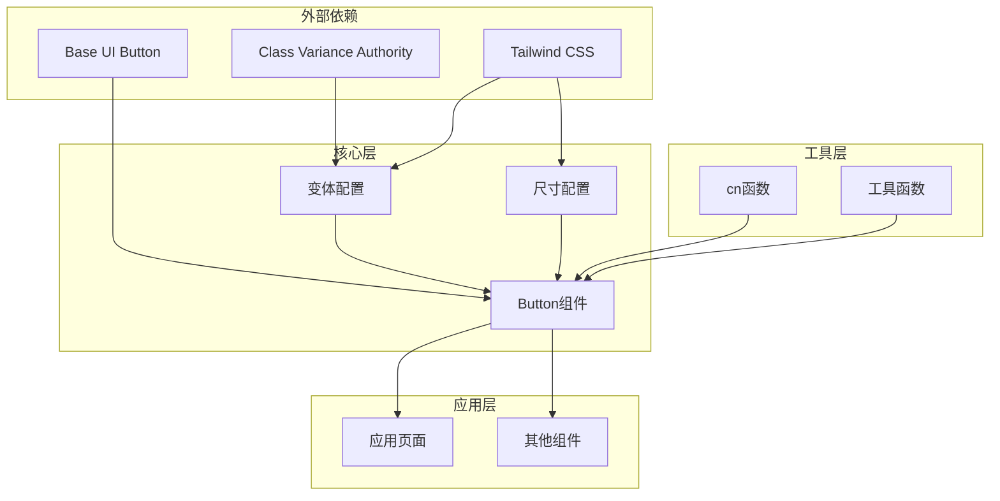
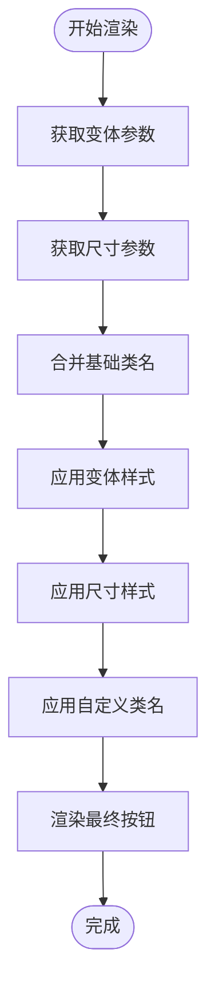
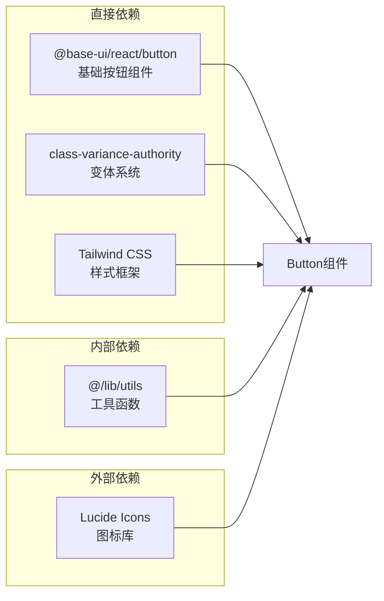

# Button按钮组件

<cite>
**本文档引用的文件**
- [button.tsx](file://src/components/ui/button.tsx)
- [utils.ts](file://src/lib/utils.ts)
- [components.json](file://components.json)
- [page.tsx](file://src/app/[locale]/storefront/(auth)/pending/page.tsx)
</cite>

## 目录
1. [简介](#简介)
2. [项目结构](#项目结构)
3. [核心组件](#核心组件)
4. [架构概览](#架构概览)
5. [详细组件分析](#详细组件分析)
6. [依赖关系分析](#依赖关系分析)
7. [性能考虑](#性能考虑)
8. [故障排除指南](#故障排除指南)
9. [结论](#结论)

## 简介

Button按钮组件是基于class-variance-authority的现代化UI组件，提供了完整的变体系统和尺寸规格。该组件采用现代React设计模式，集成了无障碍访问支持和响应式设计特性，适用于各种用户界面场景。

## 项目结构

Button组件位于项目的UI组件库中，采用模块化设计，便于在不同页面和功能模块中复用。

```mermaid
graph TB
subgraph "UI组件库"
Button[Button组件<br/>src/components/ui/button.tsx]
Badge[Badge组件<br/>src/components/ui/badge.tsx]
Spinner[LoadingSpinner组件<br/>src/components/ui/loading-spinner.tsx]
end
subgraph "工具函数"
Utils[cn函数<br/>src/lib/utils.ts]
end
subgraph "配置文件"
Config[components.json<br/>组件配置]
end
subgraph "应用页面"
LoginPage[登录页面<br/>src/app/[locale]/storefront/(auth)/pending/page.tsx]
end
Button --> Utils
Button --> Config
LoginPage --> Button
```

**图表来源**
- [button.tsx:1-61](file://src/components/ui/button.tsx#L1-L61)
- [utils.ts:1-32](file://src/lib/utils.ts#L1-L32)
- [components.json:1-26](file://components.json#L1-L26)

**章节来源**
- [button.tsx:1-61](file://src/components/ui/button.tsx#L1-L61)
- [components.json:1-26](file://components.json#L1-L26)

## 核心组件

### 组件架构

Button组件采用函数式组件设计，基于Base UI的Button Primitive构建，通过class-variance-authority实现变体系统。



**图表来源**
- [button.tsx:8-43](file://src/components/ui/button.tsx#L8-L43)

### 变体系统详解

Button组件提供了六种预定义的变体样式，每种变体都有其特定的设计语义和使用场景：

#### 默认变体 (default)
- **用途**: 主要操作按钮，用于主要的业务流程
- **视觉特征**: 使用主色调背景，文本颜色为前景色
- **交互效果**: 悬停时背景色变为原色的80%

#### 描边变体 (outline)
- **用途**: 次要操作或需要突出显示的按钮
- **视觉特征**: 边框可见，背景透明，悬停时填充背景色
- **暗色主题**: 支持深色模式下的输入色边框

#### 次要变体 (secondary)
- **用途**: 非关键操作或辅助功能
- **视觉特征**: 使用次级色彩方案
- **交互效果**: 悬停时背景色变为原色的80%

#### 幽灵变体 (ghost)
- **用途**: 轻量级操作或需要融入背景的按钮
- **视觉特征**: 透明背景，仅在悬停时显示背景色
- **暗色主题**: 支持半透明背景色

#### 破坏性变体 (destructive)
- **用途**: 危险操作，如删除、取消等
- **视觉特征**: 使用破坏性色彩方案
- **焦点状态**: 支持破坏性焦点环效果

#### 链接变体 (link)
- **用途**: 行为类似链接的操作按钮
- **视觉特征**: 文本样式，悬停时显示下划线
- **交互效果**: 下划线偏移量为4像素

**章节来源**
- [button.tsx:12-22](file://src/components/ui/button.tsx#L12-L22)

### 尺寸规格

Button组件支持多种尺寸规格，满足不同布局需求：

#### 基础尺寸
- **默认尺寸 (default)**: 高度8，适合大多数文本按钮
- **超小尺寸 (xs)**: 高度6，适合紧凑布局
- **小尺寸 (sm)**: 高度7，适合小型界面元素
- **大尺寸 (lg)**: 高度9，适合主要操作区域

#### 图标专用尺寸
- **图标尺寸 (icon)**: 正方形8，适合纯图标按钮
- **图标超小 (icon-xs)**: 正方形6，适合极紧凑的图标按钮
- **图标小 (icon-sm)**: 正方形7，平衡图标大小和空间
- **图标大 (icon-lg)**: 正方形9，适合显著的图标操作

#### 尺寸计算规则
所有尺寸都遵循统一的计算规则：
- 高度值对应具体的像素值
- 内边距根据尺寸调整
- 间距值随尺寸成比例变化
- 圆角半径使用最小值计算

**章节来源**
- [button.tsx:24-36](file://src/components/ui/button.tsx#L24-L36)

## 架构概览

Button组件采用分层架构设计，确保了良好的可维护性和扩展性。



**图表来源**
- [button.tsx:3-6](file://src/components/ui/button.tsx#L3-L6)
- [utils.ts:4-6](file://src/lib/utils.ts#L4-L6)

## 详细组件分析

### 组件实现细节

Button组件的核心实现基于class-variance-authority的变体系统，提供了灵活的样式组合能力。

#### 样式基类
组件的基础样式包含了以下关键特性：
- Flexbox布局，居中对齐内容
- 圆角边框，支持自适应圆角
- 过渡动画，平滑的交互效果
- 焦点管理，支持键盘导航
- 禁用状态，完整的禁用样式

#### 变体样式生成
每个变体都通过CSS类名组合生成，支持复杂的条件样式：



**图表来源**
- [button.tsx:50-58](file://src/components/ui/button.tsx#L50-L58)

### 属性系统

Button组件继承了Base UI Button的所有原生属性，并添加了变体和尺寸控制：

#### 基础属性
- **className**: 自定义CSS类名
- **children**: 按钮内容（文本或图标）
- **onClick**: 点击事件处理器
- **disabled**: 禁用状态控制
- **type**: 按钮类型（submit/reset/button）

#### 变体控制
- **variant**: 控制按钮外观样式
- **size**: 控制按钮尺寸规格

#### 数据槽支持
- **data-slot**: 设置组件数据槽标识
- **data-icon**: 支持内联图标的定位

**章节来源**
- [button.tsx:45-50](file://src/components/ui/button.tsx#L45-L50)

### 无障碍访问支持

Button组件内置了完整的无障碍访问支持：

#### 键盘导航
- 支持Tab键导航
- Enter和Space键触发点击
- 焦点可见性管理

#### 屏幕阅读器支持
- 语义化的HTML结构
- 适当的ARIA属性
- 语音反馈支持

#### 触觉反馈
- 焦点环效果
- 悬停状态指示
- 激活状态反馈

### SVG图标集成

Button组件与SVG图标的集成采用了专门的优化策略：

#### 图标尺寸适配
- 自动检测SVG尺寸
- 缺省尺寸设置为4像素
- 不同尺寸的图标缩放

#### 图标定位
- 内联开始图标支持
- 内联结束图标支持
- 图标间距自动调整

#### 图标交互
- 图标禁用交互
- 图标样式继承
- 图标颜色适配

**章节来源**
- [button.tsx:9-9](file://src/components/ui/button.tsx#L9-L9)

## 依赖关系分析

Button组件的依赖关系清晰明确，遵循最小依赖原则。



**图表来源**
- [button.tsx:3-6](file://src/components/ui/button.tsx#L3-L6)

### 外部依赖分析

#### Base UI依赖
- **版本**: 最新稳定版本
- **功能**: 提供语义化和无障碍的HTML结构
- **优势**: 符合Web标准，支持键盘导航

#### class-variance-authority依赖
- **版本**: 最新版本
- **功能**: 动态CSS类名生成
- **优势**: 类型安全，易于维护

#### Tailwind CSS依赖
- **版本**: 任意版本
- **功能**: 实用性CSS框架
- **优势**: 原子化设计，高度可定制

**章节来源**
- [button.tsx:3-6](file://src/components/ui/button.tsx#L3-L6)

## 性能考虑

Button组件在设计时充分考虑了性能优化：

### 渲染性能
- **纯函数组件**: 无状态组件，避免不必要的重渲染
- **CSS类名缓存**: 变体样式预先计算，减少运行时开销
- **最小DOM结构**: 简洁的HTML结构，降低DOM解析成本

### 样式性能
- **原子化CSS**: Tailwind原子类，减少CSS规则数量
- **条件样式**: 仅应用必要的样式类
- **媒体查询**: 响应式设计，避免额外的JavaScript计算

### 交互性能
- **事件委托**: 基于原生事件处理
- **防抖优化**: 避免重复的样式计算
- **内存管理**: 合理的生命周期管理

## 故障排除指南

### 常见问题及解决方案

#### 样式不生效
**问题**: 变体样式未正确应用
**解决方案**:
1. 检查Tailwind CSS配置
2. 确认CSS类名优先级
3. 验证变体参数传递

#### 图标显示异常
**问题**: SVG图标尺寸或位置不正确
**解决方案**:
1. 检查SVG组件导入
2. 验证图标尺寸属性
3. 确认图标类名设置

#### 无障碍访问问题
**问题**: 屏幕阅读器无法正确识别
**解决方案**:
1. 检查ARIA属性设置
2. 验证语义化标记
3. 测试键盘导航

### 调试技巧

#### 开发者工具
- 使用浏览器开发者工具检查最终CSS类名
- 验证变体样式的应用顺序
- 检查响应式断点的样式变化

#### 日志调试
- 在onClick事件中添加日志输出
- 检查disabled状态的变化
- 验证事件处理器的绑定

**章节来源**
- [button.tsx:50-58](file://src/components/ui/button.tsx#L50-L58)

## 结论

Button按钮组件是一个设计精良、功能完整的UI组件，具有以下特点：

### 设计优势
- **模块化架构**: 清晰的组件分离和职责划分
- **类型安全**: 完整的TypeScript支持
- **可扩展性**: 易于添加新的变体和尺寸

### 技术特色
- **现代技术栈**: 基于React 18和最新Web标准
- **无障碍支持**: 完整的无障碍访问特性
- **性能优化**: 高效的渲染和样式系统

### 应用价值
- **开发效率**: 减少重复代码，提高开发速度
- **用户体验**: 一致的交互体验和视觉设计
- **维护性**: 清晰的代码结构和文档

该组件为Celestia项目提供了坚实的基础UI组件，支持各种复杂的应用场景，是构建高质量用户界面的理想选择。