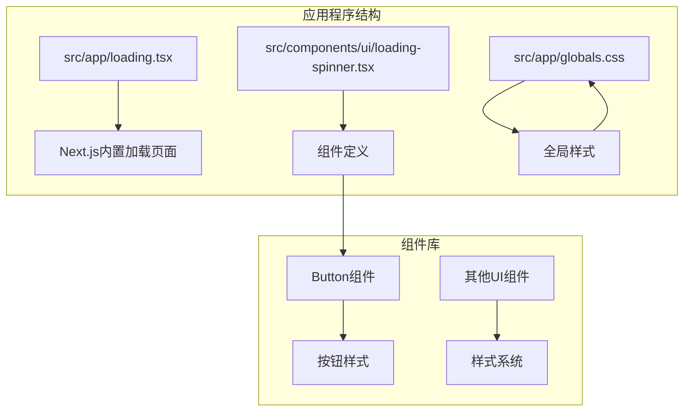
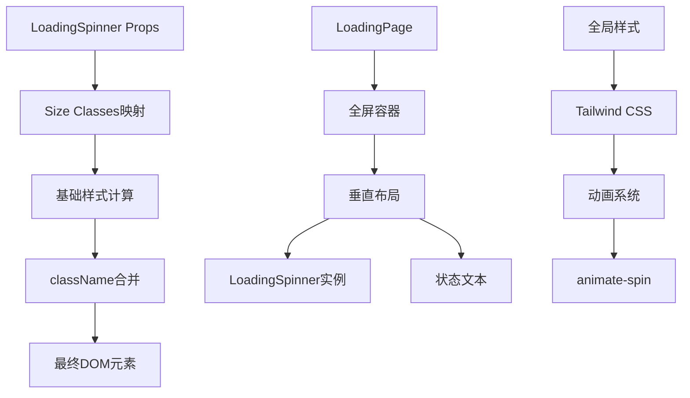
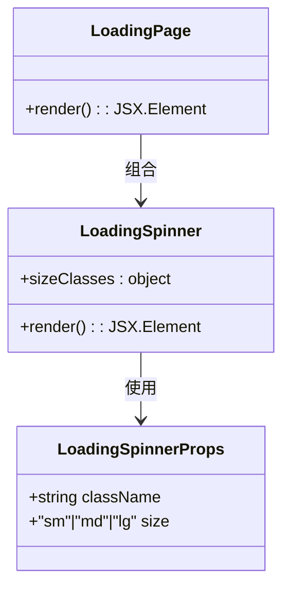
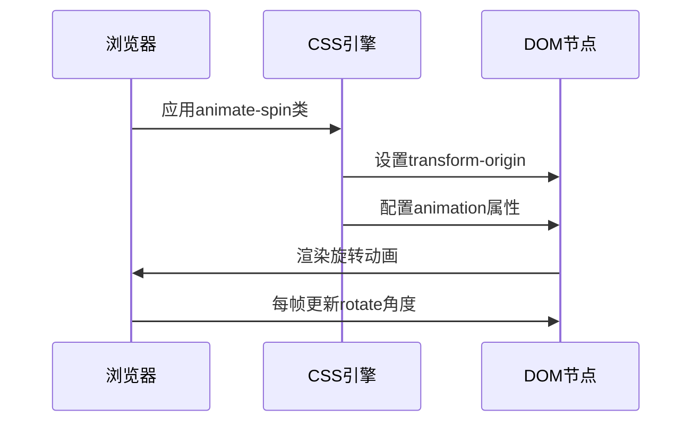
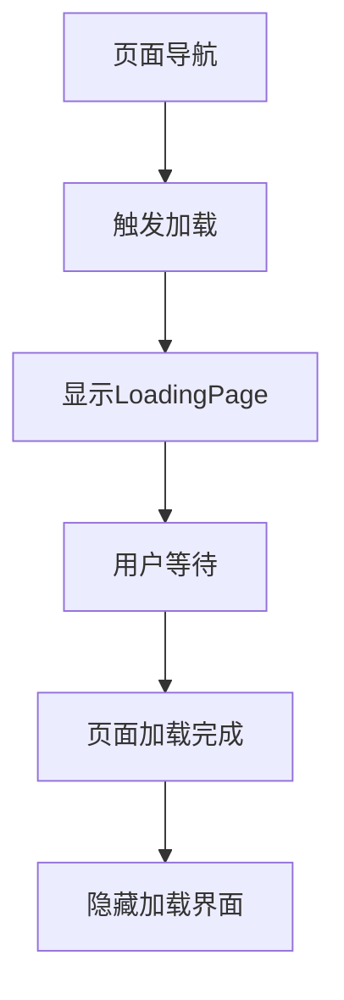
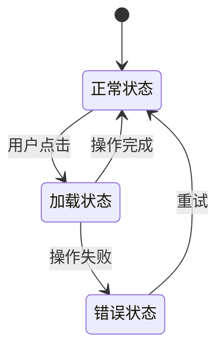
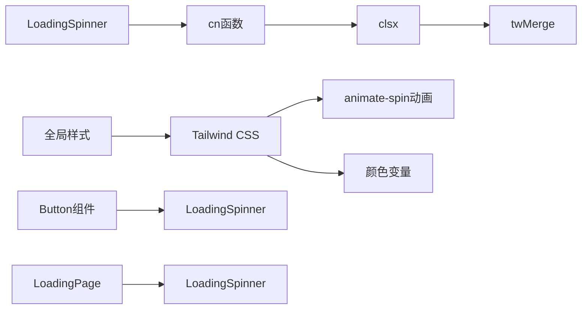

# LoadingSpinner加载组件

<cite>
**本文档引用的文件**
- [loading-spinner.tsx](file://src/components/ui/loading-spinner.tsx)
- [loading.tsx](file://src/app/loading.tsx)
- [page.tsx](file://src/app/[locale]/storefront/(auth)/pending/page.tsx)
- [globals.css](file://src/app/globals.css)
- [utils.ts](file://src/lib/utils.ts)
- [button.tsx](file://src/components/ui/button.tsx)
</cite>

## 目录
1. [简介](#简介)
2. [项目结构](#项目结构)
3. [核心组件](#核心组件)
4. [架构概览](#架构概览)
5. [详细组件分析](#详细组件分析)
6. [依赖关系分析](#依赖关系分析)
7. [性能考虑](#性能考虑)
8. [故障排除指南](#故障排除指南)
9. [结论](#结论)

## 简介

LoadingSpinner是一个专为Celestia品牌设计的加载指示器组件，采用深色主题和金色配色方案，完美契合项目的奢华黑色与金色设计语言。该组件提供了多种尺寸规格，支持在不同场景下提供适当的视觉反馈，包括页面加载、表单提交、数据获取等状态。

组件的核心设计理念是通过简洁而优雅的旋转动画传达"正在处理中"的状态，同时保持与整体设计系统的协调统一。其独特的渐变边框设计（深灰色外圈配合金色顶部）确保了在各种背景色下都有良好的可读性和对比度。

## 项目结构

LoadingSpinner组件位于UI组件库中，遵循Next.js的应用程序路由结构：

**图表来源**
- [loading.tsx:1-6](file://src/app/loading.tsx#L1-L6)
- [loading-spinner.tsx:1-36](file://src/components/ui/loading-spinner.tsx#L1-L36)

**章节来源**
- [loading-spinner.tsx:1-36](file://src/components/ui/loading-spinner.tsx#L1-L36)
- [loading.tsx:1-6](file://src/app/loading.tsx#L1-L6)

## 核心组件

LoadingSpinner组件由两个主要部分组成：

### 主要组件：LoadingSpinner
- **功能**：提供基础的圆形旋转加载指示器
- **尺寸选项**：sm（小）、md（中）、lg（大）
- **颜色方案**：深灰色边框配合金色顶部边框
- **动画效果**：CSS transform rotate动画

### 页面组件：LoadingPage
- **功能**：提供完整的页面级加载界面
- **布局**：全屏居中显示，包含标题文本
- **设计**：深色背景配合金色加载指示器

**章节来源**
- [loading-spinner.tsx:3-24](file://src/components/ui/loading-spinner.tsx#L3-L24)
- [loading-spinner.tsx:26-35](file://src/components/ui/loading-spinner.tsx#L26-L35)

## 架构概览

组件采用函数式组件设计，结合Tailwind CSS类名系统实现高度可定制的样式控制：

**图表来源**
- [loading-spinner.tsx:8-24](file://src/components/ui/loading-spinner.tsx#L8-L24)
- [globals.css:1-137](file://src/app/globals.css#L1-L137)

## 详细组件分析

### 组件接口设计

**图表来源**
- [loading-spinner.tsx:3-24](file://src/components/ui/loading-spinner.tsx#L3-L24)

#### 尺寸系统设计

组件实现了灵活的尺寸控制系统：

| 尺寸 | 宽度 | 高度 | 边框宽度 |
|------|------|------|----------|
| sm | 16px | 16px | 2px |
| md | 32px | 32px | 2px |
| lg | 48px | 48px | 3px |

#### 颜色配置系统

组件采用双色边框设计，创造视觉深度感：

- **外圈边框**：#2A2A2A（深灰色）
- **顶部边框**：#C9A96E（金色）
- **背景透明**：确保与任何背景色都能良好融合

**章节来源**
- [loading-spinner.tsx:8-24](file://src/components/ui/loading-spinner.tsx#L8-L24)
- [globals.css:51-91](file://src/app/globals.css#L51-L91)

### 动画效果实现

组件使用CSS transform rotate属性实现平滑的旋转动画：

**图表来源**
- [loading-spinner.tsx:14-23](file://src/components/ui/loading-spinner.tsx#L14-L23)
- [globals.css:2](file://src/app/globals.css#L2)

### 使用场景和集成

#### 页面级加载
组件作为Next.js的内置加载页面使用：

**图表来源**
- [loading.tsx:1-6](file://src/app/loading.tsx#L1-L6)

#### 按钮内嵌加载
在交互式按钮中显示加载状态：

**图表来源**
- [page.tsx:85-101](file://src/app/[locale]/storefront/(auth)/pending/page.tsx#L85-L101)

**章节来源**
- [loading.tsx:1-6](file://src/app/loading.tsx#L1-L6)
- [page.tsx:85-101](file://src/app/[locale]/storefront/(auth)/pending/page.tsx#L85-L101)

## 依赖关系分析

组件的依赖关系相对简单但设计精良：

**图表来源**
- [loading-spinner.tsx:1](file://src/components/ui/loading-spinner.tsx#L1)
- [utils.ts:4-6](file://src/lib/utils.ts#L4-L6)
- [globals.css:1-3](file://src/app/globals.css#L1-L3)

### 外部依赖

- **clsx**：条件类名组合工具
- **tailwind-merge**：Tailwind CSS类名合并
- **tw-animate-css**：CSS动画支持
- **Tailwind CSS**：原子化样式系统

**章节来源**
- [utils.ts:1-6](file://src/lib/utils.ts#L1-L6)
- [globals.css:1-3](file://src/app/globals.css#L1-L3)

## 性能考虑

### 动画性能优化

1. **硬件加速**：使用transform属性而非改变布局属性
2. **最小化重绘**：仅需渲染单一DOM元素
3. **CSS动画**：避免JavaScript动画带来的性能开销

### 内存管理

- 组件无状态设计，避免不必要的状态存储
- 使用React.memo模式减少重新渲染
- 合理的className合并策略

### 用户体验优化

- **响应速度**：加载指示器应在100ms内显示
- **视觉反馈**：提供明确的加载进度指示
- **可中断性**：允许用户在加载过程中取消操作

## 故障排除指南

### 常见问题及解决方案

#### 动画不显示
**症状**：加载指示器显示为静态圆圈
**原因**：CSS动画未正确加载
**解决方法**：
1. 确认tw-animate-css已正确安装
2. 检查全局样式导入
3. 验证浏览器对CSS动画的支持

#### 颜色显示异常
**症状**：加载指示器颜色不符合预期
**原因**：CSS变量未正确解析
**解决方法**：
1. 检查globals.css中的颜色变量
2. 确认Tailwind CSS配置正确
3. 验证CSS优先级设置

#### 尺寸不匹配
**症状**：加载指示器尺寸与预期不符
**原因**：className覆盖或样式冲突
**解决方法**：
1. 检查自定义className的优先级
2. 确认size属性值的有效性
3. 验证父容器的尺寸限制

**章节来源**
- [loading-spinner.tsx:14-24](file://src/components/ui/loading-spinner.tsx#L14-L24)
- [globals.css:51-91](file://src/app/globals.css#L51-L91)

## 结论

LoadingSpinner组件成功地将Celestia的品牌设计语言融入到用户体验中，通过精心设计的动画效果和颜色方案提供了优秀的视觉反馈。组件的设计体现了以下关键优势：

1. **品牌一致性**：深色主题与金色配色完美契合项目美学
2. **灵活性**：多尺寸支持适应不同场景需求
3. **性能优化**：高效的CSS动画实现确保流畅体验
4. **易用性**：简单的API设计降低使用复杂度

该组件为Next.js应用提供了标准的加载状态指示解决方案，既满足了功能性需求，又保持了设计的一致性和用户体验的连贯性。通过合理的架构设计和性能优化，LoadingSpinner成为了Celestia项目UI组件库中的重要组成部分。