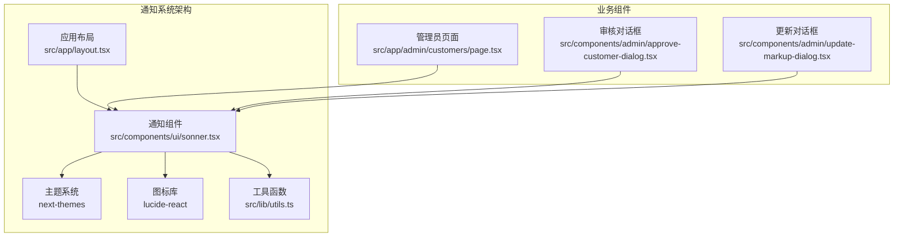
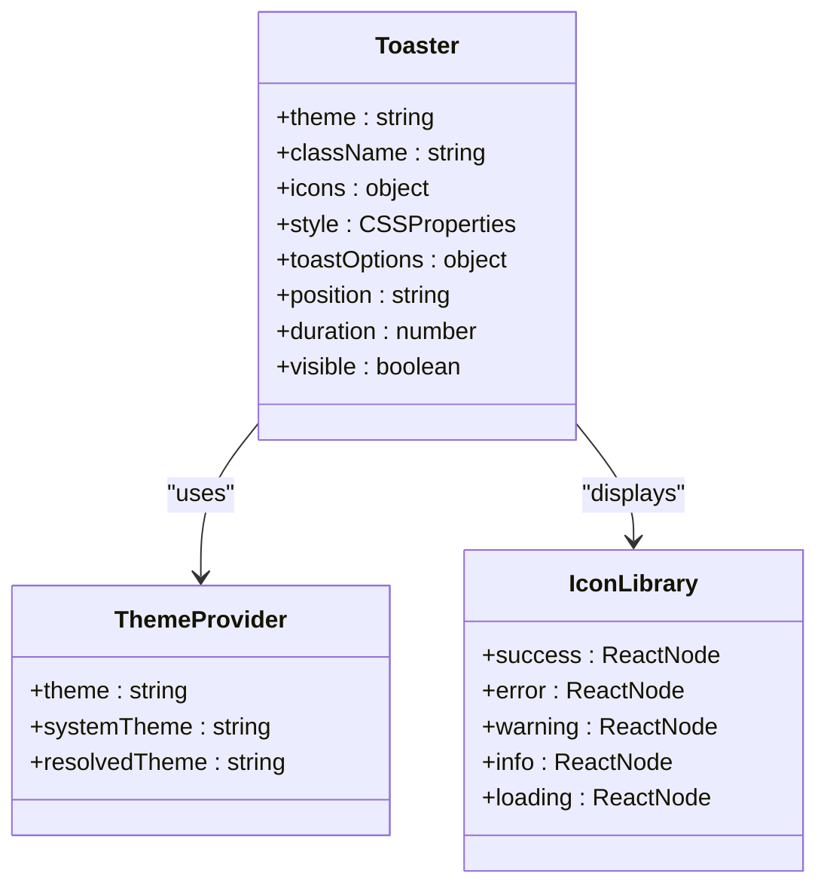
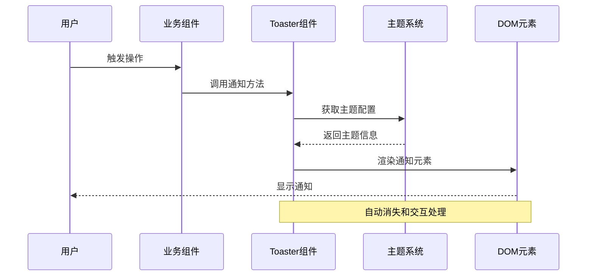
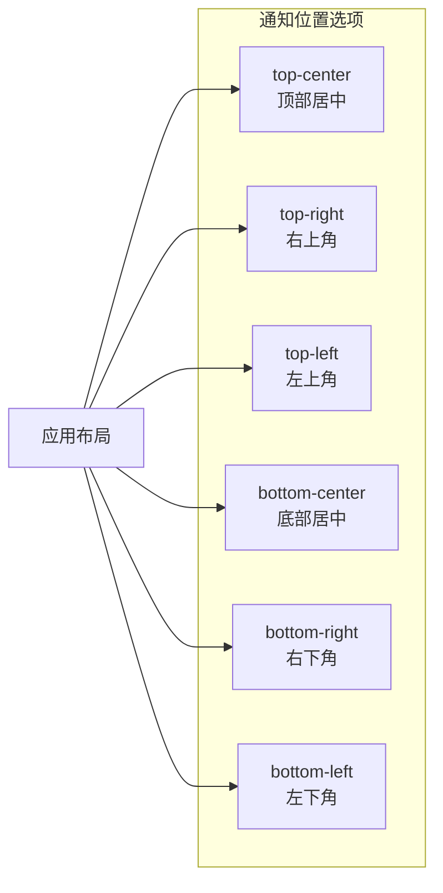
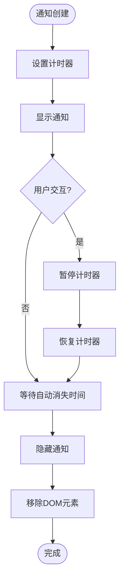
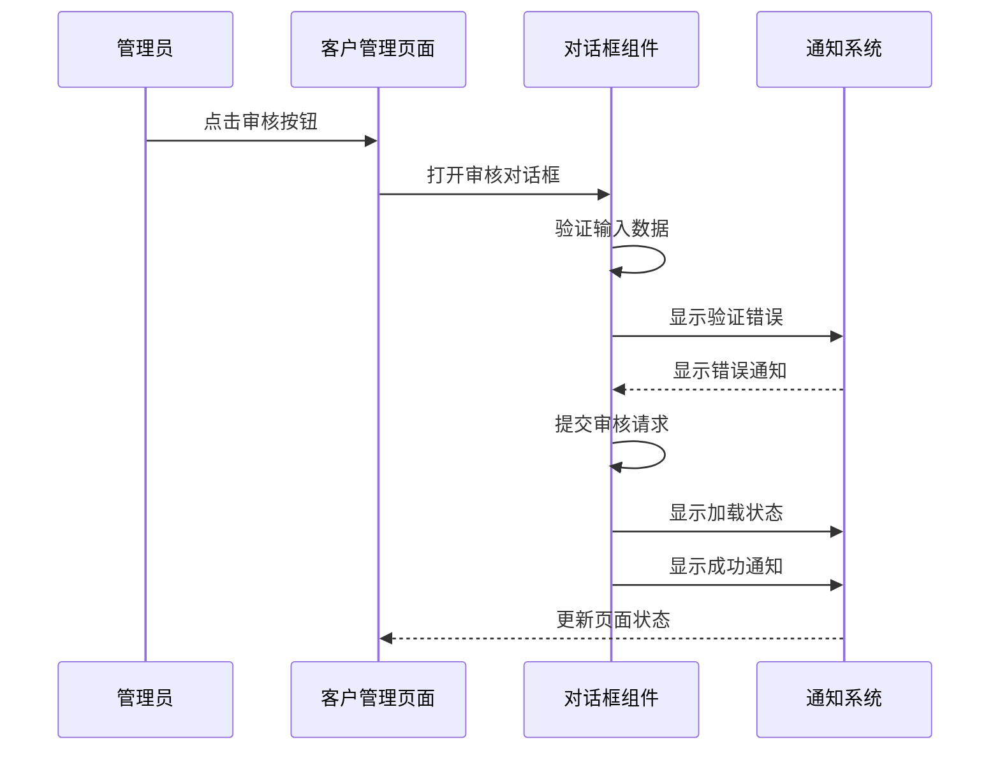

# Sonner通知组件

<cite>
**本文档引用的文件**
- [src/components/ui/sonner.tsx](file://src/components/ui/sonner.tsx)
- [src/app/layout.tsx](file://src/app/layout.tsx)
- [src/app/admin/customers/page.tsx](file://src/app/admin/customers/page.tsx)
- [src/components/admin/approve-customer-dialog.tsx](file://src/components/admin/approve-customer-dialog.tsx)
- [src/components/admin/update-markup-dialog.tsx](file://src/components/admin/update-markup-dialog.tsx)
- [package.json](file://package.json)
- [src/lib/utils.ts](file://src/lib/utils.ts)
</cite>

## 目录
1. [简介](#简介)
2. [项目结构](#项目结构)
3. [核心组件](#核心组件)
4. [架构概览](#架构概览)
5. [详细组件分析](#详细组件分析)
6. [依赖关系分析](#依赖关系分析)
7. [性能考虑](#性能考虑)
8. [故障排除指南](#故障排除指南)
9. [结论](#结论)

## 简介

Sonner通知系统是本项目中用于向用户展示各种状态反馈的核心组件。它提供了丰富的通知类型，包括成功、错误、警告、信息和加载状态，并支持自定义位置、自动消失时间、手动关闭和批量通知管理等功能。

该系统基于React客户端组件构建，集成了主题适配功能，能够根据用户的系统偏好自动切换明暗主题。通知组件采用现代化的设计理念，提供了流畅的动画效果和良好的用户体验。

## 项目结构

项目中的通知系统主要由以下关键文件组成：



**图表来源**
- [src/app/layout.tsx:29-38](file://src/app/layout.tsx#L29-L38)
- [src/components/ui/sonner.tsx:1-49](file://src/components/ui/sonner.tsx#L1-L49)

**章节来源**
- [src/components/ui/sonner.tsx:1-49](file://src/components/ui/sonner.tsx#L1-L49)
- [src/app/layout.tsx:1-43](file://src/app/layout.tsx#L1-L43)

## 核心组件

### Toaster组件

Toaster是通知系统的核心组件，负责渲染和管理所有通知消息。它基于Sonner库构建，提供了完整的通知功能实现。

#### 主要特性

1. **主题适配**: 自动检测系统主题偏好，支持明暗主题切换
2. **图标定制**: 使用Lucide React图标库提供丰富的视觉反馈
3. **样式定制**: 支持CSS变量和类名定制
4. **响应式设计**: 适配不同屏幕尺寸和设备

#### 组件配置



**图表来源**
- [src/components/ui/sonner.tsx:7-47](file://src/components/ui/sonner.tsx#L7-L47)

**章节来源**
- [src/components/ui/sonner.tsx:1-49](file://src/components/ui/sonner.tsx#L1-L49)

## 架构概览

通知系统的整体架构采用了分层设计模式，确保了组件间的松耦合和高内聚性。



**图表来源**
- [src/app/layout.tsx:29-38](file://src/app/layout.tsx#L29-L38)
- [src/components/ui/sonner.tsx:7-47](file://src/components/ui/sonner.tsx#L7-L47)

## 详细组件分析

### 通知类型系统

系统支持五种不同的通知类型，每种类型都有其特定的用途和视觉表现：

#### 成功通知 (Success)
用于表示操作成功完成的状态反馈。

#### 错误通知 (Error)
用于显示操作失败或出现错误的情况。

#### 警告通知 (Warning)
用于提醒用户注意潜在问题或风险的操作。

#### 信息通知 (Info)
用于提供一般性的信息提示和说明。

#### 加载通知 (Loading)
用于显示长时间运行操作的状态指示。

### 通知位置配置

通知系统支持多种显示位置，用户可以根据需要进行配置：



**图表来源**
- [src/app/layout.tsx:30](file://src/app/layout.tsx#L30)

### 自动消失机制

通知具有智能的自动消失功能，支持可配置的显示时长：



**图表来源**
- [src/app/layout.tsx:31-37](file://src/app/layout.tsx#L31-L37)

### 样式定制系统

通知组件支持深度的样式定制，包括颜色、边框、圆角等属性：

#### CSS变量映射

| CSS变量 | 对应属性 | 默认值 |
|---------|----------|--------|
| --normal-bg | 背景颜色 | var(--popover) |
| --normal-text | 文本颜色 | var(--popover-foreground) |
| --normal-border | 边框颜色 | var(--border) |
| --border-radius | 圆角半径 | var(--radius) |

#### 类名系统

通知组件使用统一的类名前缀 `cn-toast`，便于全局样式覆盖和定制。

**章节来源**
- [src/components/ui/sonner.tsx:31-43](file://src/components/ui/sonner.tsx#L31-L43)

### 实际应用场景

#### 管理员操作通知

在管理员界面中，通知系统被广泛应用于各种业务场景：



**图表来源**
- [src/app/admin/customers/page.tsx:47-63](file://src/app/admin/customers/page.tsx#L47-L63)
- [src/components/admin/approve-customer-dialog.tsx:44-72](file://src/components/admin/approve-customer-dialog.tsx#L44-L72)

**章节来源**
- [src/app/admin/customers/page.tsx:19-63](file://src/app/admin/customers/page.tsx#L19-L63)
- [src/components/admin/approve-customer-dialog.tsx:17-72](file://src/components/admin/approve-customer-dialog.tsx#L17-L72)
- [src/components/admin/update-markup-dialog.tsx:16-70](file://src/components/admin/update-markup-dialog.tsx#L16-L70)

## 依赖关系分析

通知系统与项目其他组件存在紧密的依赖关系：

```mermaid
graph TB
subgraph "外部依赖"
Sonner[sonner@2.0.7]
NextThemes[next-themes@0.4.6]
Lucide[lucide-react@1.7.0]
end
subgraph "内部依赖"
Utils[utils.ts]
Layout[layout.tsx]
Components[UI组件]
end
subgraph "通知系统"
Toaster[sonner.tsx]
Toast[通知实例]
end
Sonner --> Toaster
NextThemes --> Toaster
Lucide --> Toaster
Utils --> Toaster
Layout --> Toaster
Components --> Toast
Toaster --> Toast
```

**图表来源**
- [package.json:40](file://package.json#L40)
- [package.json:30](file://package.json#L30)
- [package.json:28](file://package.json#L28)

**章节来源**
- [package.json:11-44](file://package.json#L11-L44)

## 性能考虑

通知系统在设计时充分考虑了性能优化：

### 渲染优化
- 使用React.memo避免不必要的重新渲染
- 采用虚拟DOM减少DOM操作
- 批量更新通知状态

### 内存管理
- 自动清理已完成的通知元素
- 合理的垃圾回收策略
- 避免内存泄漏

### 动画性能
- 使用CSS3硬件加速
- 优化动画帧率
- 减少重绘和回流

## 故障排除指南

### 常见问题及解决方案

#### 通知不显示
1. 检查Toaster组件是否正确导入
2. 确认应用根布局中包含Toaster
3. 验证主题配置是否正确

#### 图标显示异常
1. 确认lucide-react版本兼容性
2. 检查图标大小和颜色设置
3. 验证CSS样式是否正确应用

#### 主题切换问题
1. 确认next-themes配置正确
2. 检查CSS变量是否正确定义
3. 验证媒体查询是否生效

**章节来源**
- [src/components/ui/sonner.tsx:8](file://src/components/ui/sonner.tsx#L8)
- [src/app/layout.tsx:29](file://src/app/layout.tsx#L29)

## 结论

Sonner通知系统为Celestia珠宝项目提供了完整、灵活且高性能的通知解决方案。通过精心设计的架构和丰富的功能特性，该系统能够满足各种业务场景下的用户反馈需求。

系统的主要优势包括：
- **易用性**: 简洁的API设计和直观的配置选项
- **可定制性**: 支持深度样式定制和主题适配
- **性能**: 优化的渲染机制和内存管理
- **可访问性**: 符合无障碍标准的设计理念

未来可以考虑的功能增强包括：
- 更丰富的通知模板系统
- 批量操作的进度跟踪
- 更精细的动画控制选项
- 国际化支持的扩展