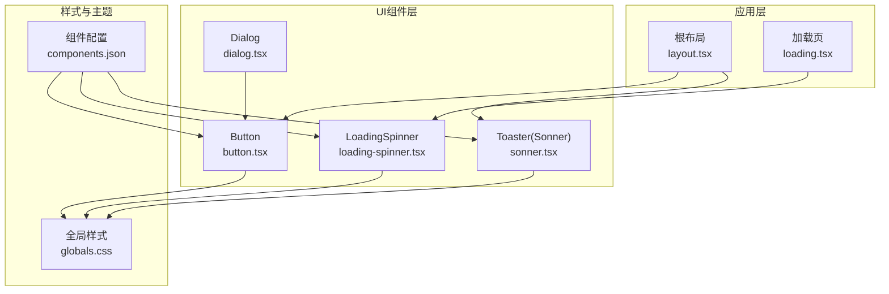
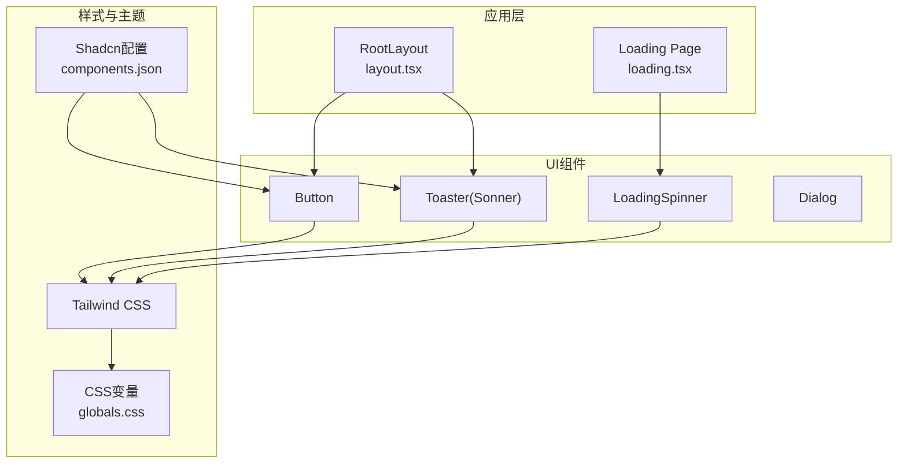
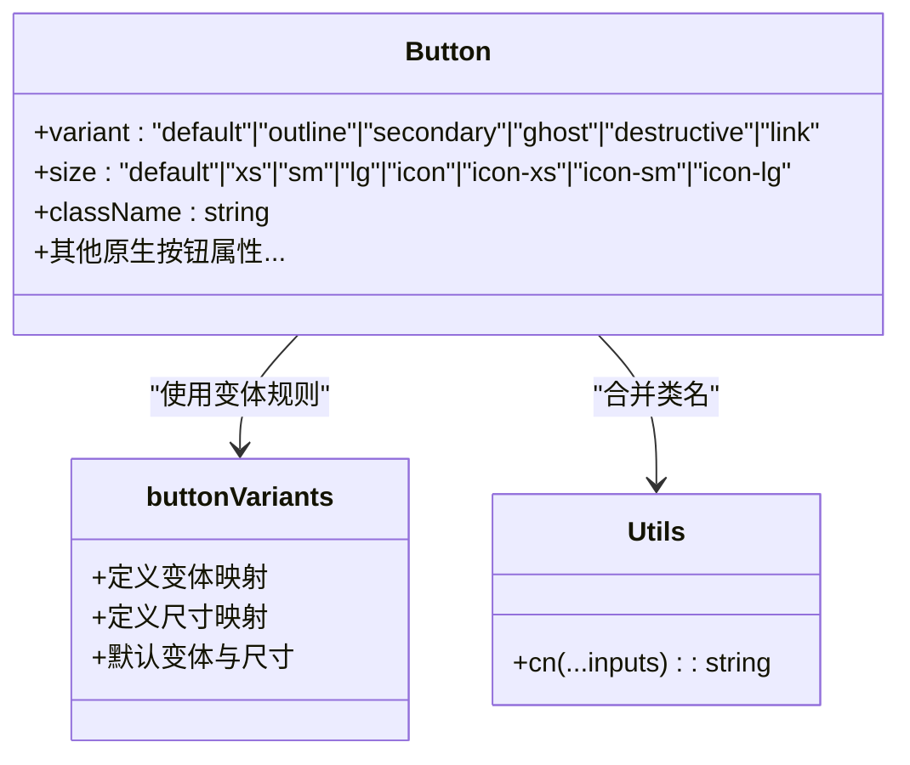
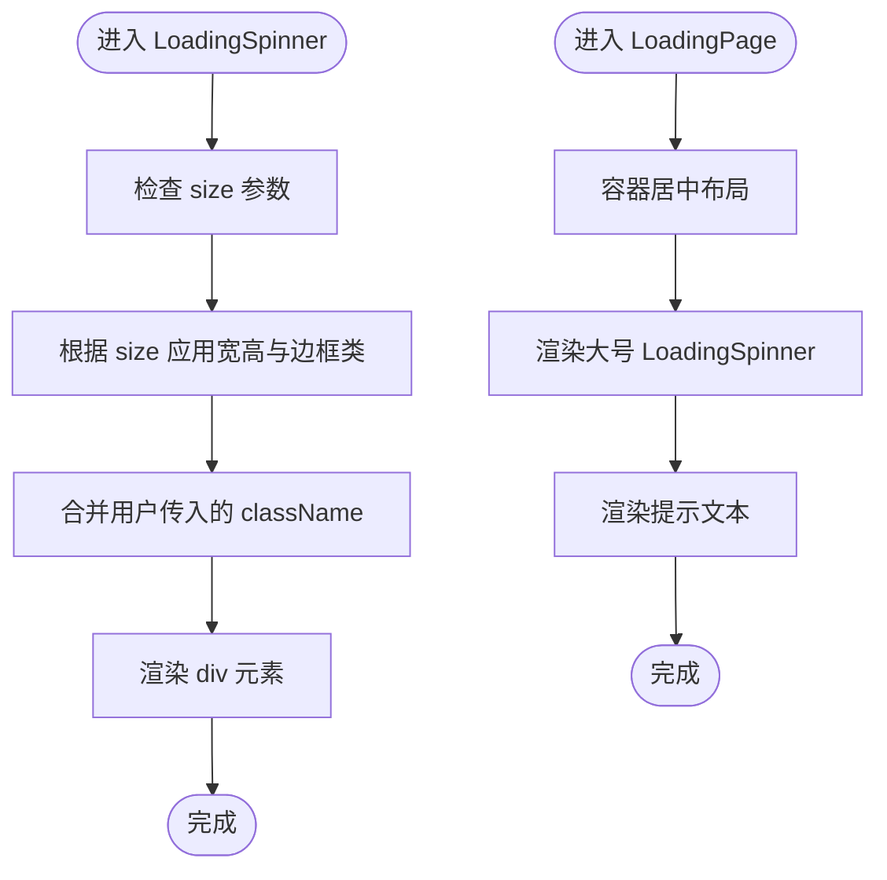
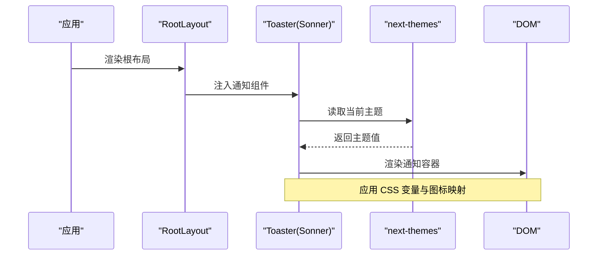
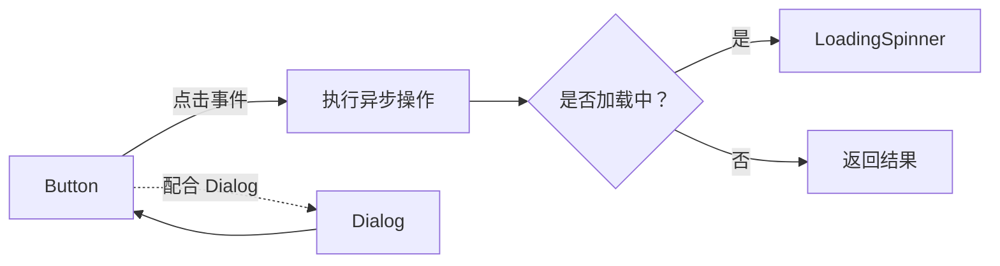
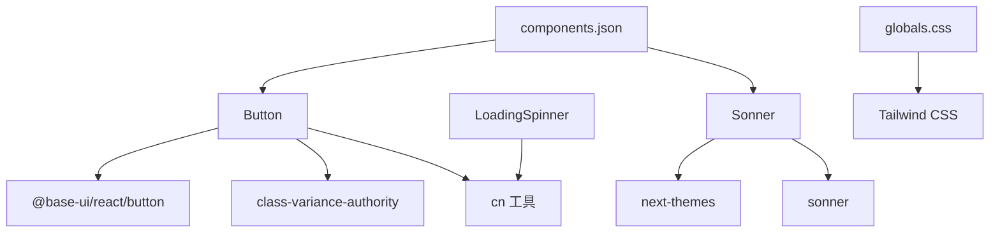

# UI组件库

<cite>
**本文档引用的文件**
- [button.tsx](file://src/components/ui/button.tsx)
- [loading-spinner.tsx](file://src/components/ui/loading-spinner.tsx)
- [sonner.tsx](file://src/components/ui/sonner.tsx)
- [components.json](file://components.json)
- [globals.css](file://src/app/globals.css)
- [layout.tsx](file://src/app/layout.tsx)
- [loading.tsx](file://src/app/loading.tsx)
- [utils.ts](file://src/lib/utils.ts)
- [package.json](file://package.json)
- [dialog.tsx](file://src/components/ui/dialog.tsx)
</cite>

## 目录
1. [简介](#简介)
2. [项目结构](#项目结构)
3. [核心组件](#核心组件)
4. [架构总览](#架构总览)
5. [详细组件分析](#详细组件分析)
6. [依赖关系分析](#依赖关系分析)
7. [性能考虑](#性能考虑)
8. [故障排除指南](#故障排除指南)
9. [结论](#结论)
10. [附录](#附录)

## 简介
本文件为基于 shadcn/ui 和 Tailwind CSS 的 Celestia UI 组件库的权威指南。重点覆盖以下核心组件的设计与使用：
- Button：统一的按钮组件，支持多种变体与尺寸，并与主题系统深度集成
- LoadingSpinner：轻量级加载指示器，提供多尺寸与页面级加载页
- Sonner：全局通知系统，自动适配明暗主题与品牌色彩

文档同时提供主题定制、样式覆盖、无障碍访问（a11y）、跨浏览器兼容性与性能优化建议，并给出组件组合与集成模式的最佳实践。

## 项目结构
UI 组件集中于 src/components/ui 目录，采用按功能模块化的组织方式：
- button.tsx：按钮组件及其变体/尺寸配置
- loading-spinner.tsx：加载指示器与页面级加载页
- sonner.tsx：通知系统封装
- dialog.tsx：对话框组件（用于展示组件间协作）

样式与主题通过 Tailwind CSS 与 CSS 变量在 src/app/globals.css 中统一管理；组件别名与 shadcn 配置由 components.json 提供。

**图表来源**
- [layout.tsx:17-42](file://src/app/layout.tsx#L17-L42)
- [loading.tsx:1-5](file://src/app/loading.tsx#L1-L5)
- [button.tsx:1-61](file://src/components/ui/button.tsx#L1-L61)
- [loading-spinner.tsx:1-36](file://src/components/ui/loading-spinner.tsx#L1-L36)
- [sonner.tsx:1-50](file://src/components/ui/sonner.tsx#L1-L50)
- [dialog.tsx:1-40](file://src/components/ui/dialog.tsx#L1-L40)
- [globals.css:1-137](file://src/app/globals.css#L1-L137)
- [components.json:1-26](file://components.json#L1-L26)

**章节来源**
- [button.tsx:1-61](file://src/components/ui/button.tsx#L1-L61)
- [loading-spinner.tsx:1-36](file://src/components/ui/loading-spinner.tsx#L1-L36)
- [sonner.tsx:1-50](file://src/components/ui/sonner.tsx#L1-L50)
- [dialog.tsx:1-40](file://src/components/ui/dialog.tsx#L1-L40)
- [globals.css:1-137](file://src/app/globals.css#L1-L137)
- [components.json:1-26](file://components.json#L1-L26)

## 核心组件
本节对三个核心组件进行深入解析，包括属性、行为、可定制项与使用场景。

- Button（按钮）
  - 支持的变体：default、outline、secondary、ghost、destructive、link
  - 支持的尺寸：default、xs、sm、lg、icon、icon-xs、icon-sm、icon-lg
  - 关键特性：与 CSS 变量与主题联动；聚焦态与禁用态视觉反馈；图标内联支持
  - 无障碍：继承原生按钮语义，支持键盘交互与焦点可见性
  - 自定义：通过 className 扩展或覆盖默认样式；通过 variant/size 切换外观

- LoadingSpinner（加载指示器）
  - 尺寸：sm、md、lg
  - 页面级加载页：LoadingPage 提供全屏居中加载与提示文案
  - 使用场景：异步操作、页面切换、表单提交等

- Sonner（通知系统）
  - 主题适配：自动读取 next-themes 的当前主题
  - 图标映射：success/info/warning/error/loading 对应不同图标
  - 样式绑定：通过 CSS 变量映射到品牌色板与圆角
  - 全局注入：在根布局中引入，统一管理通知位置与样式

**章节来源**
- [button.tsx:8-43](file://src/components/ui/button.tsx#L8-L43)
- [button.tsx:45-58](file://src/components/ui/button.tsx#L45-L58)
- [loading-spinner.tsx:3-24](file://src/components/ui/loading-spinner.tsx#L3-L24)
- [loading-spinner.tsx:26-35](file://src/components/ui/loading-spinner.tsx#L26-L35)
- [sonner.tsx:7-47](file://src/components/ui/sonner.tsx#L7-L47)
- [layout.tsx:29-38](file://src/app/layout.tsx#L29-L38)

## 架构总览
下图展示了 UI 组件与主题系统、样式层以及应用层的交互关系：

**图表来源**
- [layout.tsx:17-42](file://src/app/layout.tsx#L17-L42)
- [loading.tsx:1-5](file://src/app/loading.tsx#L1-L5)
- [button.tsx:1-61](file://src/components/ui/button.tsx#L1-L61)
- [loading-spinner.tsx:1-36](file://src/components/ui/loading-spinner.tsx#L1-L36)
- [sonner.tsx:1-50](file://src/components/ui/sonner.tsx#L1-L50)
- [globals.css:1-137](file://src/app/globals.css#L1-L137)
- [components.json:1-26](file://components.json#L1-L26)

## 详细组件分析

### Button 组件分析
- 设计模式：基于 class-variance-authority 的变体系统，结合 Tailwind 类合并工具实现可组合样式
- 数据结构：buttonVariants 定义了变体与尺寸的映射规则，最终通过 cn 合并类名
- 依赖链：依赖 @base-ui/react/button 提供语义化原生按钮能力；依赖 cn 工具进行类名合并
- 错误处理：未显式抛错，但通过禁用态与无效态样式提供视觉反馈
- 性能影响：样式计算在运行时完成，但由于是静态变体，开销极低

**图表来源**
- [button.tsx:8-43](file://src/components/ui/button.tsx#L8-L43)
- [button.tsx:45-58](file://src/components/ui/button.tsx#L45-L58)
- [utils.ts:4-6](file://src/lib/utils.ts#L4-L6)

**章节来源**
- [button.tsx:1-61](file://src/components/ui/button.tsx#L1-L61)
- [utils.ts:1-32](file://src/lib/utils.ts#L1-L32)

### LoadingSpinner 组件分析
- 功能：提供旋转动画的圆形加载指示器，支持三种尺寸
- 页面级加载：LoadingPage 在全屏范围内居中显示加载指示器与提示文本
- 样式策略：通过 CSS 变量与品牌色实现一致的视觉风格

**图表来源**
- [loading-spinner.tsx:14-24](file://src/components/ui/loading-spinner.tsx#L14-L24)
- [loading-spinner.tsx:26-35](file://src/components/ui/loading-spinner.tsx#L26-L35)

**章节来源**
- [loading-spinner.tsx:1-36](file://src/components/ui/loading-spinner.tsx#L1-L36)

### Sonner 通知系统分析
- 主题适配：通过 next-themes 获取当前主题，自动切换明暗样式
- 图标映射：为不同类型的通知提供对应图标，提升识别度
- 样式绑定：使用 CSS 变量将通知背景、文字、边框与圆角与主题保持一致
- 全局注入：在根布局中引入，确保整站统一的通知体验

**图表来源**
- [layout.tsx:29-38](file://src/app/layout.tsx#L29-L38)
- [sonner.tsx:7-47](file://src/components/ui/sonner.tsx#L7-L47)

**章节来源**
- [sonner.tsx:1-50](file://src/components/ui/sonner.tsx#L1-L50)
- [layout.tsx:1-43](file://src/app/layout.tsx#L1-L43)

### 组件组合与集成模式
- Button 与 LoadingSpinner：在异步操作中以 Button 作为触发器，内部根据状态切换为 LoadingSpinner，实现“加载中”反馈
- Button 与 Dialog：在 Dialog 中使用 Button 触发关闭或确认动作，借助 Dialog 的 overlay 与 portal 实现模态交互
- 全局通知：在应用根部引入 Toaster，统一管理各类业务通知

**图表来源**
- [button.tsx:45-58](file://src/components/ui/button.tsx#L45-L58)
- [loading-spinner.tsx:14-24](file://src/components/ui/loading-spinner.tsx#L14-L24)
- [dialog.tsx:10-40](file://src/components/ui/dialog.tsx#L10-L40)

**章节来源**
- [button.tsx:1-61](file://src/components/ui/button.tsx#L1-L61)
- [loading-spinner.tsx:1-36](file://src/components/ui/loading-spinner.tsx#L1-L36)
- [dialog.tsx:1-40](file://src/components/ui/dialog.tsx#L1-L40)

## 依赖关系分析
- 组件依赖
  - Button 依赖 @base-ui/react/button 与 class-variance-authority
  - Sonner 依赖 next-themes 与 sonner
  - LoadingSpinner 依赖自定义工具函数 cn
- 样式依赖
  - 组件样式依赖 Tailwind CSS 与 CSS 变量
  - 组件别名与注册由 components.json 管理
- 运行时依赖
  - next-themes 提供主题切换能力
  - lucide-react 提供图标资源

**图表来源**
- [button.tsx:3-6](file://src/components/ui/button.tsx#L3-L6)
- [sonner.tsx:3-5](file://src/components/ui/sonner.tsx#L3-L5)
- [loading-spinner.tsx:1](file://src/components/ui/loading-spinner.tsx#L1)
- [globals.css:1-3](file://src/app/globals.css#L1-L3)
- [components.json:15-21](file://components.json#L15-L21)
- [package.json:11-36](file://package.json#L11-L36)

**章节来源**
- [package.json:11-36](file://package.json#L11-L36)
- [components.json:1-26](file://components.json#L1-26)
- [globals.css:1-137](file://src/app/globals.css#L1-L137)

## 性能考虑
- 样式计算：Button 的变体与尺寸在运行时通过 cva 计算，属于静态映射，性能开销极小
- 类名合并：使用 twMerge 与 clsx 合并类名，避免重复与冲突，减少样式层抖动
- 动画与过渡：LoadingSpinner 使用 CSS 动画，Sonner 的通知动画通过 CSS 变量控制，整体开销可控
- 主题切换：next-themes 仅在主题变更时更新根节点类名，不会阻塞主线程
- 建议
  - 避免在渲染路径中频繁创建新对象（如变体配置），保持稳定引用
  - 合理使用 className 覆盖，尽量通过变体/尺寸满足需求
  - 控制通知数量与显示时长，避免过度弹窗影响用户体验

[本节为通用性能指导，无需特定文件来源]

## 故障排除指南
- 按钮样式异常
  - 症状：按钮颜色或尺寸不符合预期
  - 排查：确认 variant/size 是否正确传递；检查 className 是否覆盖了关键类
  - 参考：[button.tsx:45-58](file://src/components/ui/button.tsx#L45-L58)
- 加载指示器不显示
  - 症状：页面无加载动画
  - 排查：确认 LoadingPage 是否在路由中使用；检查全局样式是否正确导入
  - 参考：[loading.tsx:1-5](file://src/app/loading.tsx#L1-L5)、[globals.css:1-3](file://src/app/globals.css#L1-L3)
- 通知不出现或样式错误
  - 症状：通知无法弹出或颜色不正确
  - 排查：确认根布局已引入 Toaster；检查主题配置与 CSS 变量映射
  - 参考：[layout.tsx:29-38](file://src/app/layout.tsx#L29-L38)、[sonner.tsx:31-38](file://src/components/ui/sonner.tsx#L31-L38)
- 组合组件交互问题
  - 症状：Dialog 与 Button 协作异常
  - 排查：确认 Dialog 的 Trigger/Close/Overlay 正确包裹；检查事件绑定与状态管理
  - 参考：[dialog.tsx:10-40](file://src/components/ui/dialog.tsx#L10-L40)

**章节来源**
- [button.tsx:45-58](file://src/components/ui/button.tsx#L45-L58)
- [loading.tsx:1-5](file://src/app/loading.tsx#L1-L5)
- [layout.tsx:29-38](file://src/app/layout.tsx#L29-L38)
- [sonner.tsx:31-38](file://src/components/ui/sonner.tsx#L31-L38)
- [dialog.tsx:10-40](file://src/components/ui/dialog.tsx#L10-L40)

## 结论
Celestia UI 组件库以 shadcn/ui 与 Tailwind CSS 为基础，结合品牌主题色与 CSS 变量，提供了统一、可扩展且易于定制的组件体系。Button、LoadingSpinner、Sonner 三大组件分别覆盖交互、状态反馈与全局通知的核心场景。通过合理的主题适配、样式覆盖与无障碍设计，组件可在多端稳定运行。建议在实际项目中遵循变体/尺寸优先、className 覆盖最小化的原则，并结合通知与加载策略提升用户体验。

[本节为总结性内容，无需特定文件来源]

## 附录

### 主题定制指南
- CSS 变量映射
  - 在全局样式中定义品牌色与圆角变量，组件通过 CSS 变量与主题联动
  - 参考：[globals.css:51-91](file://src/app/globals.css#L51-L91)、[globals.css:31-49](file://src/app/globals.css#L31-L49)
- 组件别名与注册
  - 通过 components.json 配置组件别名与注册路径，确保 IDE 与构建工具正确解析
  - 参考：[components.json:15-21](file://components.json#L15-L21)
- 主题切换
  - 使用 next-themes 在应用层提供主题切换能力，Sonner 自动适配
  - 参考：[sonner.tsx:7-8](file://src/components/ui/sonner.tsx#L7-L8)、[layout.tsx:23-25](file://src/app/layout.tsx#L23-L25)

**章节来源**
- [globals.css:1-137](file://src/app/globals.css#L1-L137)
- [components.json:1-26](file://components.json#L1-L26)
- [sonner.tsx:7-8](file://src/components/ui/sonner.tsx#L7-L8)
- [layout.tsx:23-25](file://src/app/layout.tsx#L23-L25)

### 样式覆盖方法
- 优先使用变体/尺寸参数
  - 通过 variant/size 控制外观，减少额外类名
  - 参考：[button.tsx:47-48](file://src/components/ui/button.tsx#L47-L48)
- 使用 cn 工具合并类名
  - 保证覆盖类名与默认类名正确合并，避免冲突
  - 参考：[utils.ts:4-6](file://src/lib/utils.ts#L4-L6)
- CSS 变量覆盖
  - 在需要时通过局部样式覆盖 CSS 变量，保持一致性
  - 参考：[globals.css:31-49](file://src/app/globals.css#L31-L49)

**章节来源**
- [button.tsx:47-48](file://src/components/ui/button.tsx#L47-L48)
- [utils.ts:4-6](file://src/lib/utils.ts#L4-L6)
- [globals.css:31-49](file://src/app/globals.css#L31-L49)

### 无障碍访问（a11y）支持
- 按钮语义化
  - Button 基于原生按钮，支持键盘交互与焦点可见性
  - 参考：[button.tsx:3](file://src/components/ui/button.tsx#L3)
- 禁用态与无效态
  - 通过禁用态与 aria-invalid 样式提供清晰的视觉反馈
  - 参考：[button.tsx:9](file://src/components/ui/button.tsx#L9)
- 对话框与模态
  - Dialog 提供触发器、门户与遮罩，确保正确的焦点管理
  - 参考：[dialog.tsx:10-40](file://src/components/ui/dialog.tsx#L10-L40)

**章节来源**
- [button.tsx:3](file://src/components/ui/button.tsx#L3)
- [button.tsx:9](file://src/components/ui/button.tsx#L9)
- [dialog.tsx:10-40](file://src/components/ui/dialog.tsx#L10-L40)

### 响应式设计支持
- 尺寸变体
  - Button 提供 xs/sm/default/lg 与 icon 系列尺寸，适配移动端与桌面端
  - 参考：[button.tsx:24-36](file://src/components/ui/button.tsx#L24-L36)
- 加载指示器
  - LoadingSpinner 提供 sm/md/lg 三档尺寸，满足不同布局需求
  - 参考：[loading-spinner.tsx:8-12](file://src/components/ui/loading-spinner.tsx#L8-L12)

**章节来源**
- [button.tsx:24-36](file://src/components/ui/button.tsx#L24-L36)
- [loading-spinner.tsx:8-12](file://src/components/ui/loading-spinner.tsx#L8-L12)

### 跨浏览器兼容性
- 依赖 polyfill 与现代浏览器特性
  - 项目使用 Next.js 16，默认面向现代浏览器；如需兼容旧版浏览器，建议在构建配置中添加相应 polyfill
  - 参考：[package.json:23](file://package.json#L23)

**章节来源**
- [package.json:23](file://package.json#L23)

### 最佳实践
- 组件使用
  - 优先使用 Button 的变体/尺寸参数；仅在必要时使用 className 覆盖
  - 在异步操作中结合 LoadingSpinner 提升反馈质量
  - 使用 Toaster 统一管理通知，避免分散的状态管理
- 主题与样式
  - 通过 CSS 变量与组件别名保持品牌一致性
  - 避免在运行时动态拼接复杂样式，优先使用变体系统
- 无障碍与性能
  - 确保按钮与对话框具备良好的键盘可达性与焦点管理
  - 控制通知数量与时长，避免干扰用户操作

[本节为通用最佳实践，无需特定文件来源]