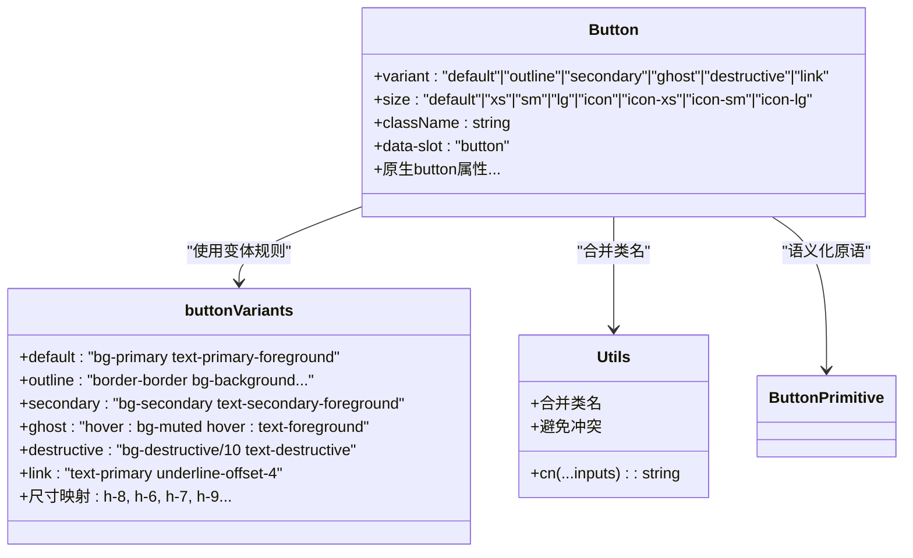
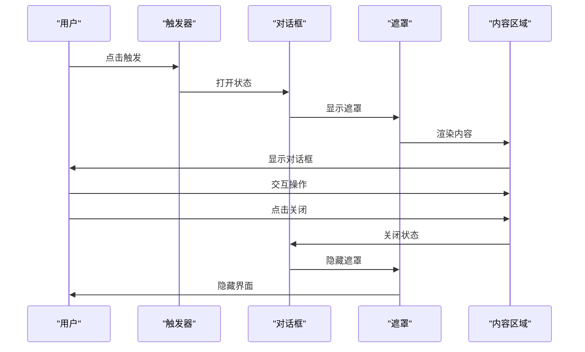

# UI组件库

<cite>
**本文档引用的文件**
- [button.tsx](file://src/components/ui/button.tsx)
- [loading-spinner.tsx](file://src/components/ui/loading-spinner.tsx)
- [sonner.tsx](file://src/components/ui/sonner.tsx)
- [dialog.tsx](file://src/components/ui/dialog.tsx)
- [input.tsx](file://src/components/ui/input.tsx)
- [select.tsx](file://src/components/ui/select.tsx)
- [form-group.tsx](file://src/components/ui/form-group.tsx)
- [input-group.tsx](file://src/components/ui/input-group.tsx)
- [label.tsx](file://src/components/ui/label.tsx)
- [textarea.tsx](file://src/components/ui/textarea.tsx)
- [checkbox.tsx](file://src/components/ui/checkbox.tsx)
- [switch.tsx](file://src/components/ui/switch.tsx)
- [components.json](file://components.json)
- [globals.css](file://src/app/globals.css)
- [layout.tsx](file://src/app/layout.tsx)
- [loading.tsx](file://src/app/loading.tsx)
- [utils.ts](file://src/lib/utils.ts)
- [package.json](file://package.json)
</cite>

## 更新摘要
**所做更改**
- 新增完整的UI组件库架构说明，涵盖基于shadcn/ui和Radix UI primitives的组件体系
- 扩展表单相关组件文档，包括Input、Select、FormGroup、InputGroup等核心表单组件
- 新增Checkbox、Switch等交互组件的详细分析
- 更新架构图以反映完整的组件生态系统
- 增强主题定制和深色模式支持说明
- 补充无障碍访问和响应式设计的最佳实践

## 目录
1. [简介](#简介)
2. [项目结构](#项目结构)
3. [核心组件](#核心组件)
4. [架构总览](#架构总览)
5. [详细组件分析](#详细组件分析)
6. [表单组件体系](#表单组件体系)
7. [交互组件](#交互组件)
8. [依赖关系分析](#依赖关系分析)
9. [性能考虑](#性能考虑)
10. [故障排除指南](#故障排除指南)
11. [结论](#结论)
12. [附录](#附录)

## 简介
本文件为基于shadcn/ui和Radix UI primitives的Celestia完整UI组件库权威指南。该组件库实现了从基础按钮到复杂表单的完整设计系统，提供统一的组件体系、深色模式支持和无障碍访问能力。

**核心特性：**
- **完整组件生态**：涵盖按钮、表单、对话框、通知等核心UI组件
- **Radix UI集成**：基于@base-ui/react系列原语，提供语义化和无障碍支持
- **深色模式**：完整的明暗主题适配，支持系统主题检测
- **响应式设计**：针对移动端和桌面端的优化布局
- **无障碍访问**：符合WCAG标准的键盘导航和屏幕阅读器支持
- **主题定制**：基于CSS变量的品牌色彩系统和圆角规范

## 项目结构
UI组件库采用模块化组织方式，集中在src/components/ui目录下，按照功能域进行分类：

```mermaid
graph TB
subgraph "应用层"
L["根布局<br/>layout.tsx"]
LP["加载页<br/>loading.tsx"]
end
subgraph "UI组件层"
subgraph "基础组件"
BTN["Button<br/>button.tsx"]
LBL["Label<br/>label.tsx"]
end
subgraph "表单组件"
INP["Input<br/>input.tsx"]
SEL["Select<br/>select.tsx"]
CHK["Checkbox<br/>checkbox.tsx"]
SW["Switch<br/>switch.tsx"]
FG["FormGroup<br/>form-group.tsx"]
IG["InputGroup<br/>input-group.tsx"]
TA["Textarea<br/>textarea.tsx"]
end
subgraph "复合组件"
DLG["Dialog<br/>dialog.tsx"]
end
subgraph "反馈组件"
SP["LoadingSpinner<br/>loading-spinner.tsx"]
SN["Toaster(Sonner)<br/>sonner.tsx"]
end
subgraph "样式与主题"
CSS["全局样式<br/>globals.css"]
CMP["组件配置<br/>components.json"]
end
L --> BTN
L --> SN
LP --> SP
BTN --> CSS
INP --> CSS
SEL --> CSS
DLG --> BTN
SN --> CSS
CMP --> BTN
CMP --> INP
CMP --> SEL
CMP --> DLG
```

**图表来源**
- [layout.tsx:17-42](file://src/app/layout.tsx#L17-L42)
- [loading.tsx:1-5](file://src/app/loading.tsx#L1-L5)
- [button.tsx:1-61](file://src/components/ui/button.tsx#L1-L61)
- [input.tsx:1-21](file://src/components/ui/input.tsx#L1-L21)
- [select.tsx:1-202](file://src/components/ui/select.tsx#L1-L202)
- [dialog.tsx:1-161](file://src/components/ui/dialog.tsx#L1-L161)
- [loading-spinner.tsx:1-36](file://src/components/ui/loading-spinner.tsx#L1-L36)
- [sonner.tsx:1-50](file://src/components/ui/sonner.tsx#L1-L50)
- [globals.css:1-174](file://src/app/globals.css#L1-L174)
- [components.json:1-26](file://components.json#L1-L26)

## 核心组件
Celestia UI组件库包含四大类核心组件，每类都经过精心设计以确保一致的用户体验。

### 基础组件
- **Button（按钮）**：支持default、outline、secondary、ghost、destructive、link六种变体，七种尺寸规格，完全的无障碍支持
- **Label（标签）**：语义化标签组件，支持禁用状态和焦点管理

### 表单组件
- **Input（输入框）**：原生输入框的增强版本，支持invalid状态和焦点环
- **Select（选择器）**：完整的下拉选择组件，包含触发器、内容面板、滚动按钮等
- **Textarea（文本域）**：支持自适应高度的多行文本输入
- **FormGroup（表单组）**：表单布局容器，支持标签、错误信息和必填标记
- **InputGroup（输入组）**：复杂的输入组合，支持前缀、后缀、按钮等

### 交互组件
- **Checkbox（复选框）**：支持选中、未选中、禁用状态
- **Switch（开关）**：滑动开关，支持两种尺寸

### 复合组件
- **Dialog（对话框）**：模态对话框，包含遮罩、内容区域、标题、描述等
- **LoadingSpinner（加载指示器）**：三种尺寸的旋转加载动画
- **Sonner（通知系统）**：全局通知管理，支持多种通知类型

**章节来源**
- [button.tsx:8-43](file://src/components/ui/button.tsx#L8-L43)
- [input.tsx:6-18](file://src/components/ui/input.tsx#L6-L18)
- [select.tsx:31-57](file://src/components/ui/select.tsx#L31-L57)
- [dialog.tsx:10-81](file://src/components/ui/dialog.tsx#L10-L81)
- [loading-spinner.tsx:14-24](file://src/components/ui/loading-spinner.tsx#L14-L24)
- [sonner.tsx:7-47](file://src/components/ui/sonner.tsx#L7-L47)
- [checkbox.tsx:8-27](file://src/components/ui/checkbox.tsx#L8-L27)
- [switch.tsx:7-30](file://src/components/ui/switch.tsx#L7-L30)

## 架构总览
Celestia UI组件库基于shadcn/ui设计系统和Radix UI原语构建，形成了完整的组件生态系统：

```mermaid
graph TB
subgraph "设计系统层"
SHADCN["shadcn/ui<br/>设计令牌"]
RADIX["Radix UI Primitives<br/>无障碍原语"]
TAILWIND["Tailwind CSS<br/>原子化样式"]
END
subgraph "组件层"
BASE["基础组件<br/>Button, Label"]
FORM["表单组件<br/>Input, Select, Form"]
INTERACT["交互组件<br/>Checkbox, Switch"]
COMPOSITE["复合组件<br/>Dialog, Toast"]
END
subgraph "主题层"
THEME["CSS变量<br/>globals.css"]
DARK["深色模式<br/>.dark伪类"]
SYSTEM["系统主题<br/>next-themes"]
END
subgraph "应用层"
APP["Next.js应用<br/>layout.tsx"]
PAGE["页面组件<br/>storefront/admin"]
HOOKS["Hooks<br/>状态管理"]
END
SHADCN --> BASE
RADIX --> BASE
TAILWIND --> BASE
SHADCN --> FORM
RADIX --> FORM
TAILWIND --> FORM
SHADCN --> INTERACT
RADIX --> INTERACT
TAILWIND --> INTERACT
SHADCN --> COMPOSITE
RADIX --> COMPOSITE
TAILWIND --> COMPOSITE
THEME --> SHADCN
DARK --> THEME
SYSTEM --> THEME
APP --> BASE
APP --> FORM
APP --> INTERACT
APP --> COMPOSITE
PAGE --> APP
HOOKS --> PAGE
```

**图表来源**
- [components.json:3-12](file://components.json#L3-L12)
- [globals.css:51-125](file://src/app/globals.css#L51-L125)
- [layout.tsx:23-38](file://src/app/layout.tsx#L23-L38)
- [package.json:13-47](file://package.json#L13-L47)

## 详细组件分析

### Button组件深度分析
Button组件基于@base-ui/react/button构建，采用class-variance-authority实现变体系统：



**关键特性：**
- **无障碍支持**：继承原生button语义，支持键盘交互和焦点管理
- **视觉反馈**：专注态有ring效果，禁用态透明度降低
- **图标支持**：内联SVG图标，自动调整尺寸和间距
- **状态管理**：支持aria-invalid、aria-expanded等ARIA属性

**章节来源**
- [button.tsx:1-61](file://src/components/ui/button.tsx#L1-L61)
- [utils.ts:4-6](file://src/lib/utils.ts#L4-L6)

### Dialog对话框组件分析
Dialog组件基于@base-ui/react/dialog构建，提供完整的模态对话框解决方案：



**组件结构：**
- **Dialog**：根容器，管理打开/关闭状态
- **DialogTrigger**：触发器，包装可点击元素
- **DialogPortal**：门户，将内容渲染到指定容器
- **DialogOverlay**：遮罩层，支持backdrop-filter
- **DialogContent**：内容区域，包含关闭按钮
- **DialogHeader/Footer**：头部和底部区域
- **DialogTitle/Description**：标题和描述文本

**无障碍特性：**
- 自动焦点管理，打开时聚焦对话框
- ESC键关闭，点击遮罩区域关闭
- ARIA标签和角色设置

**章节来源**
- [dialog.tsx:1-161](file://src/components/ui/dialog.tsx#L1-L161)

### 表单组件体系架构
表单组件采用统一的设计语言和状态管理机制：

```mermaid
graph LR
subgraph "表单组件层次"
INPUT["Input<br/>基础输入"]
TEXTAREA["Textarea<br/>多行输入"]
SELECT["Select<br/>下拉选择"]
CHECKBOX["Checkbox<br/>复选框"]
SWITCH["Switch<br/>开关"]
END
subgraph "表单容器"
FORMGROUP["FormGroup<br/>表单组"]
INPUTGROUP["InputGroup<br/>输入组"]
END
subgraph "状态管理"
INVALID["aria-invalid<br/>无效状态"]
FOCUS["focus-visible<br/>焦点状态"]
DISABLED["disabled<br/>禁用状态"]
END
INPUT --> INVALID
INPUT --> FOCUS
INPUT --> DISABLED
FORMGROUP --> INPUT
INPUTGROUP --> INPUT
INPUTGROUP --> CHECKBOX
INPUTGROUP --> SWITCH
```

**表单组件特点：**
- **统一状态**：所有表单组件都支持aria-invalid状态
- **焦点管理**：focus-visible ring提供清晰的焦点指示
- **禁用支持**：完整的禁用态样式和交互
- **尺寸一致性**：基于相同的圆角和间距规范

**章节来源**
- [input.tsx:1-21](file://src/components/ui/input.tsx#L1-L21)
- [textarea.tsx:1-19](file://src/components/ui/textarea.tsx#L1-L19)
- [select.tsx:1-202](file://src/components/ui/select.tsx#L1-L202)
- [form-group.tsx:1-25](file://src/components/ui/form-group.tsx#L1-L25)
- [input-group.tsx:1-159](file://src/components/ui/input-group.tsx#L1-L159)

## 表单组件体系

### Input组件详解
Input组件提供增强的原生输入框功能：

**核心功能：**
- **状态反馈**：支持invalid、focus、disabled状态
- **样式系统**：基于CSS变量的主题适配
- **无障碍支持**：完整的ARIA属性支持

**使用场景：**
- 用户名、密码输入
- 搜索框
- 表单字段输入

**章节来源**
- [input.tsx:6-18](file://src/components/ui/input.tsx#L6-L18)

### Select组件完整分析
Select组件是最复杂的UI组件之一，包含多个子组件：

**主要组件：**
- **SelectTrigger**：触发器，支持两种尺寸
- **SelectContent**：内容面板，支持定位和动画
- **SelectItem**：选项项，支持选中指示器
- **SelectScrollUp/DownButton**：滚动按钮
- **SelectLabel/Separator**：分组标签和分隔线

**高级特性：**
- **虚拟滚动**：支持大量选项的高效渲染
- **键盘导航**：完整的键盘操作支持
- **RTL支持**：双向语言环境适配
- **动画系统**：流畅的展开/收起动画

**章节来源**
- [select.tsx:31-57](file://src/components/ui/select.tsx#L31-L57)
- [select.tsx:111-137](file://src/components/ui/select.tsx#L111-L137)

### FormGroup和InputGroup组合模式
FormGroup和InputGroup提供了表单布局的最佳实践：

**FormGroup优势：**
- **语义化结构**：正确的HTML语义和标签关联
- **错误处理**：内置错误信息显示
- **必填标记**：直观的必填字段标识

**InputGroup功能：**
- **组合布局**：前缀、后缀、按钮的灵活组合
- **尺寸适配**：多种对齐方式和尺寸规格
- **交互增强**：点击组合区域自动聚焦内部输入

**章节来源**
- [form-group.tsx:13-24](file://src/components/ui/form-group.tsx#L13-L24)
- [input-group.tsx:11-23](file://src/components/ui/input-group.tsx#L11-L23)

## 交互组件

### Checkbox复选框组件
Checkbox组件提供直观的多选交互：

**设计特点：**
- **状态指示**：清晰的选中/未选中视觉反馈
- **尺寸适配**：支持标准和紧凑两种尺寸
- **无障碍支持**：完整的键盘操作和屏幕阅读器支持

**使用场景：**
- 条款同意
- 多选列表
- 设置开关

**章节来源**
- [checkbox.tsx:8-27](file://src/components/ui/checkbox.tsx#L8-L27)

### Switch开关组件
Switch组件提供二进制状态切换功能：

**核心功能：**
- **尺寸选择**：sm和default两种尺寸
- **状态同步**：与表单状态完美集成
- **视觉反馈**：平滑的滑动动画效果

**应用场景：**
- 开关设置
- 功能启用/禁用
- 快速状态切换

**章节来源**
- [switch.tsx:7-30](file://src/components/ui/switch.tsx#L7-L30)

## 依赖关系分析
UI组件库的依赖关系体现了现代化前端开发的最佳实践：

```mermaid
graph TB
subgraph "核心依赖"
BASEUI["@base-ui/react<br/>Radix UI原语"]
CVS["class-variance-authority<br/>变体系统"]
CN["cn/clsx/tw-merge<br/>类名合并"]
NEXTTHEMES["next-themes<br/>主题管理"]
SONNER["sonner<br/>通知系统"]
LUCIDE["lucide-react<br/>图标库"]
END
subgraph "样式依赖"
TAILWIND["tailwindcss<br/>原子化CSS"]
CSSVARS["CSS变量<br/>主题系统"]
SHADCN["shadcn/tailwind.css<br/>设计令牌"]
END
subgraph "应用集成"
NEXT["next.js<br/>框架"]
TYPESCRIPT["typescript<br/>类型安全"]
END
BASEUI --> CN
CVS --> CN
NEXTTHEMES --> SONNER
LUCIDE --> SONNER
LUCIDE --> COMPONENTS
TAILWIND --> CSSVARS
SHADCN --> CSSVARS
NEXT --> COMPONENTS
TYPESCRIPT --> COMPONENTS
```

**依赖特点：**
- **最小化核心**：仅依赖必要的原语和工具库
- **类型安全**：完整的TypeScript支持
- **主题解耦**：主题逻辑独立于组件实现
- **可扩展性**：易于添加新的组件和功能

**章节来源**
- [package.json:13-47](file://package.json#L13-L47)
- [components.json:3-12](file://components.json#L3-L12)

## 性能考虑
Celestia UI组件库在性能方面采用了多项优化策略：

### 样式性能优化
- **原子化CSS**：Tailwind原子类减少CSS体积
- **CSS变量缓存**：主题变量预计算，避免重复计算
- **条件渲染**：仅在需要时渲染复杂组件

### 组件性能优化
- **懒加载**：大型组件按需加载
- **虚拟滚动**：Select组件支持大量选项的高效渲染
- **事件委托**：减少事件监听器数量

### 主题切换优化
- **CSS变量切换**：零重绘的主题切换
- **系统主题检测**：智能的主题适应
- **深色模式优化**：针对深色模式的专门优化

### 最佳实践建议
- **避免深层嵌套**：减少DOM层级复杂度
- **合理使用动画**：控制动画数量和复杂度
- **图片和图标优化**：使用SVG图标和优化的图片资源

## 故障排除指南

### 组件样式问题
**按钮样式异常**
- 检查variant和size参数是否正确
- 确认CSS变量是否正确加载
- 验证类名合并顺序

**表单组件状态错误**
- 确认aria-invalid属性正确设置
- 检查焦点状态样式
- 验证禁用态样式

### 无障碍访问问题
**键盘导航失效**
- 检查tabIndex属性设置
- 确认事件处理器正确绑定
- 验证焦点管理逻辑

**屏幕阅读器支持**
- 确认ARIA属性正确设置
- 检查语义化标签使用
- 验证角色和属性的一致性

### 主题和样式问题
**深色模式不生效**
- 检查.next/themes配置
- 确认CSS变量定义完整
- 验证媒体查询匹配

**样式冲突**
- 使用CSS隔离技术
- 避免全局样式污染
- 检查组件作用域样式

**章节来源**
- [button.tsx:45-58](file://src/components/ui/button.tsx#L45-L58)
- [dialog.tsx:10-40](file://src/components/ui/dialog.tsx#L10-L40)
- [globals.css:93-125](file://src/app/globals.css#L93-L125)

## 结论
Celestia UI组件库成功实现了基于shadcn/ui和Radix UI primitives的完整设计系统。通过精心设计的组件架构、完善的无障碍支持和深色模式适配，为Celestia珠宝品牌的数字化转型提供了坚实的技术基础。

**核心优势：**
- **完整性**：覆盖从基础到复合的完整组件体系
- **可访问性**：符合WCAG标准的无障碍设计
- **可定制性**：基于CSS变量的品牌定制能力
- **性能优化**：现代化的性能优化策略
- **开发体验**：TypeScript支持和IDE友好的API设计

**未来发展方向：**
- 组件国际化支持
- 更丰富的动画和过渡效果
- 移动端专项优化
- 组件测试覆盖率提升

## 附录

### 主题定制指南

#### CSS变量系统
Celestia采用完整的CSS变量主题系统，支持品牌色彩和圆角规范：

**核心变量定义：**
- `--background`: 背景色
- `--primary`: 主色调（金黄色）
- `--secondary`: 辅助色
- `--destructive`: 错误色
- `--radius`: 圆角半径

**深色模式支持：**
- `.dark`伪类自动切换
- 智能色彩调整算法
- 平滑的颜色过渡动画

**自定义步骤：**
1. 修改globals.css中的变量值
2. 确保颜色对比度符合WCAG标准
3. 测试深色和浅色模式下的显示效果

**章节来源**
- [globals.css:51-125](file://src/app/globals.css#L51-L125)
- [components.json:3-12](file://components.json#L3-L12)

### 样式覆盖方法

#### 组件定制策略
**推荐的覆盖方式：**
- **变体参数**：优先使用内置变体和尺寸
- **CSS变量**：通过CSS变量进行主题定制
- **类名合并**：使用cn函数安全地合并类名

**覆盖最佳实践：**
- 避免直接修改组件源码
- 使用CSS自定义属性进行局部覆盖
- 保持与设计系统的视觉一致性

**工具函数使用：**
- `cn()`：智能类名合并，避免冲突
- `twMerge`：Tailwind类名合并
- `clsx`：条件类名组合

**章节来源**
- [utils.ts:4-6](file://src/lib/utils.ts#L4-L6)
- [button.tsx:45-58](file://src/components/ui/button.tsx#L45-L58)

### 无障碍访问（a11y）支持

#### 无障碍特性实现
**键盘导航：**
- Tab键顺序：逻辑化的焦点顺序
- Enter/Space：激活交互元素
- Esc键：关闭模态对话框

**屏幕阅读器支持：**
- ARIA标签和描述
- 角色和属性正确设置
- 状态变化的语音反馈

**高对比度支持：**
- 自动检测系统高对比度模式
- 专用的高对比度样式
- 可访问的颜色替代方案

**章节来源**
- [button.tsx:3](file://src/components/ui/button.tsx#L3)
- [dialog.tsx:120-147](file://src/components/ui/dialog.tsx#L120-L147)
- [input.tsx:12](file://src/components/ui/input.tsx#L12)

### 响应式设计支持

#### 响应式架构
**断点策略：**
- 移动优先设计原则
- 平板和桌面端的差异化处理
- 触摸友好的交互尺寸

**组件响应式特性：**
- Button：不同屏幕尺寸的合适触控目标
- Dialog：移动端全屏适配
- Form：输入字段的触摸优化

**媒体查询使用：**
- 基于CSS媒体查询的响应式布局
- JavaScript媒体查询监听
- 动态样式类名切换

**章节来源**
- [button.tsx:24-36](file://src/components/ui/button.tsx#L24-L36)
- [dialog.tsx:56](file://src/components/ui/dialog.tsx#L56)
- [input-group.tsx:17](file://src/components/ui/input-group.tsx#L17)

### 跨浏览器兼容性

#### 兼容性策略
**现代浏览器支持：**
- 基于Next.js 16的现代浏览器目标
- Polyfill按需加载
- 渐进式增强

**兼容性测试：**
- Chrome、Firefox、Safari最新版本
- Edge和移动端浏览器
- 旧版浏览器降级支持

**CSS兼容性：**
- Autoprefixer自动添加厂商前缀
- CSS Grid和Flexbox的降级方案
- CSS变量的回退方案

**章节来源**
- [package.json:30](file://package.json#L30)
- [globals.css:1-3](file://src/app/globals.css#L1-L3)

### 最佳实践

#### 组件使用规范
**性能最佳实践：**
- 使用React.memo优化昂贵组件
- 合理使用Suspense和代码分割
- 避免不必要的重新渲染

**可维护性建议：**
- 组件职责单一化
- 明确的Props接口定义
- 完善的TypeScript类型支持

**用户体验优化：**
- 加载状态的适当反馈
- 错误处理的友好提示
- 交互的即时视觉反馈

**无障碍访问：**
- 始终提供键盘导航
- 适当的ARIA属性
- 足够的颜色对比度

**章节来源**
- [button.tsx:45-58](file://src/components/ui/button.tsx#L45-L58)
- [dialog.tsx:10-40](file://src/components/ui/dialog.tsx#L10-L40)
- [form-group.tsx:13-24](file://src/components/ui/form-group.tsx#L13-L24)