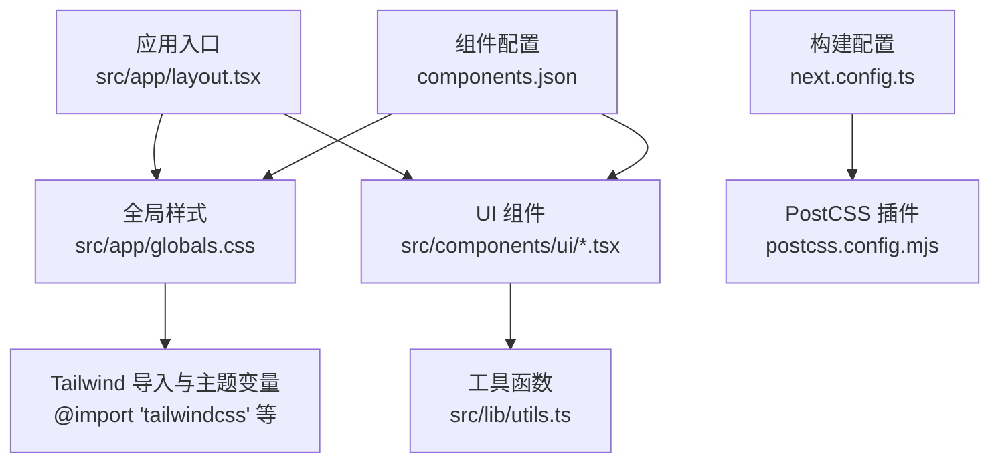
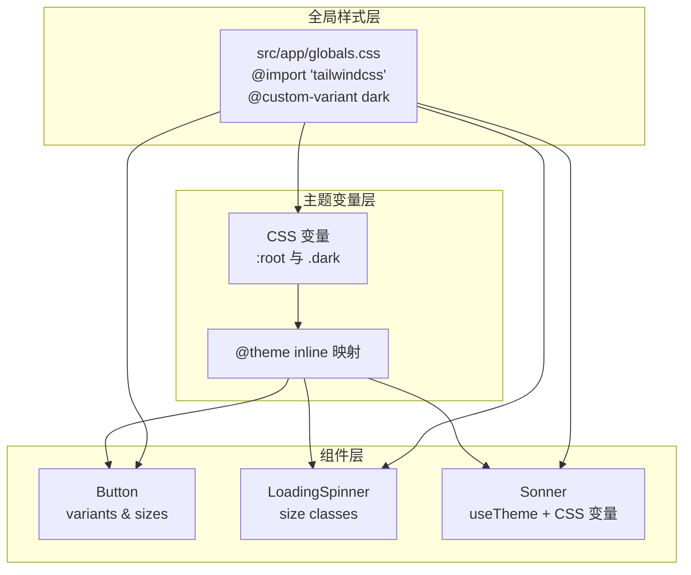
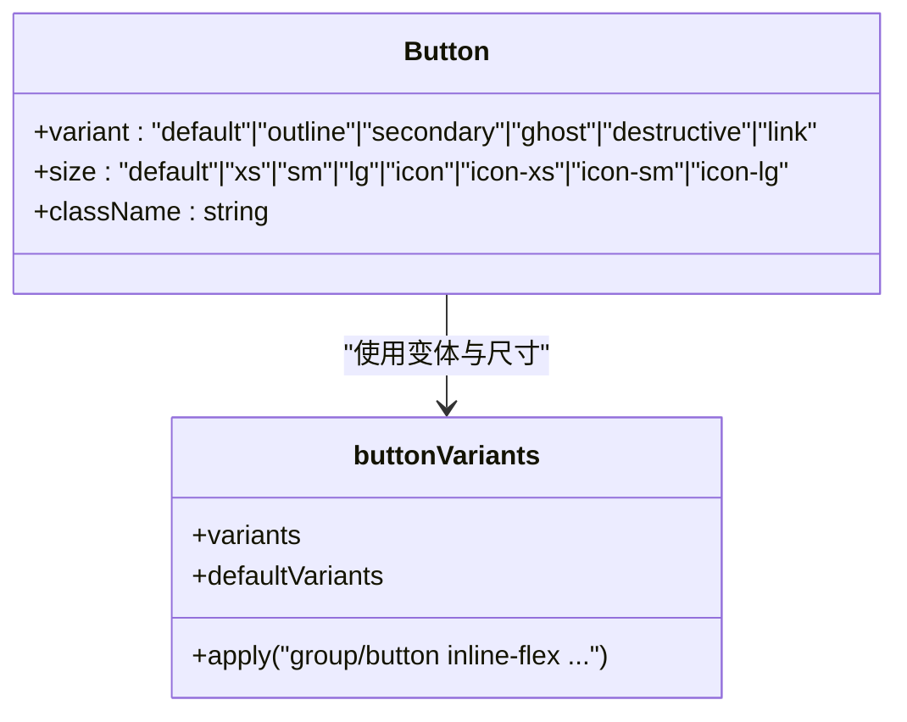
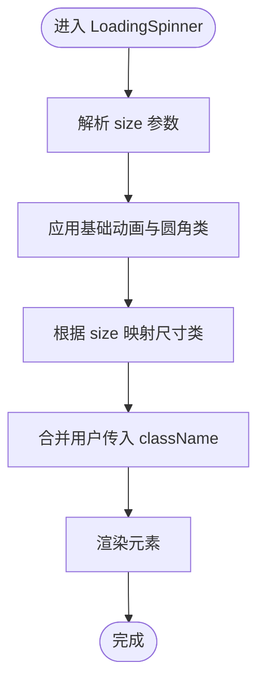
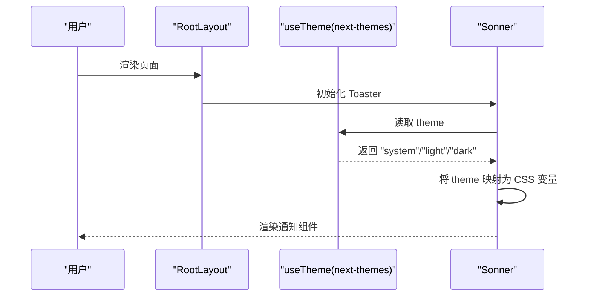
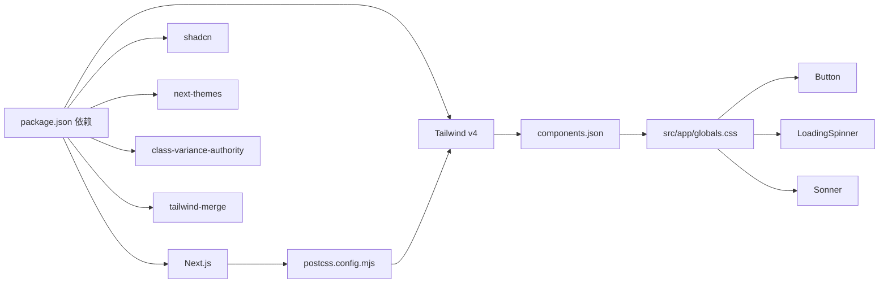

# 组件定制与主题

<cite>
**本文引用的文件**
- [package.json](file://package.json)
- [next.config.ts](file://next.config.ts)
- [postcss.config.mjs](file://postcss.config.mjs)
- [components.json](file://components.json)
- [src/app/globals.css](file://src/app/globals.css)
- [src/components/ui/button.tsx](file://src/components/ui/button.tsx)
- [src/components/ui/loading-spinner.tsx](file://src/components/ui/loading-spinner.tsx)
- [src/components/ui/sonner.tsx](file://src/components/ui/sonner.tsx)
- [src/lib/utils.ts](file://src/lib/utils.ts)
- [src/app/layout.tsx](file://src/app/layout.tsx)
</cite>

## 目录
1. [简介](#简介)
2. [项目结构](#项目结构)
3. [核心组件](#核心组件)
4. [架构总览](#架构总览)
5. [详细组件分析](#详细组件分析)
6. [依赖关系分析](#依赖关系分析)
7. [性能考量](#性能考量)
8. [故障排查指南](#故障排查指南)
9. [结论](#结论)
10. [附录](#附录)

## 简介
本文件面向需要在 shadcn/ui 生态中进行组件定制与主题配置的开发者，结合当前代码库的实际实现，系统讲解以下内容：
- 主题变量与颜色体系的建立与使用
- 字体与间距规则的统一管理
- 通过 tailwind.config.js 与 components.json 的配置要点
- 样式覆盖最佳实践：CSS 变量、组件样式优先级、响应式断点
- 自定义组件变体与尺寸规格
- 深色模式、RTL 布局适配与无障碍访问的定制策略
- 主题切换完整实现示例与性能优化建议

## 项目结构
该项目采用 Next.js 应用结构，UI 组件位于 src/components/ui 下，全局样式集中于 src/app/globals.css，并通过 shadcn 配置文件 components.json 进行主题与组件注册管理。

图表来源
- [src/app/layout.tsx:17-41](file://src/app/layout.tsx#L17-L41)
- [src/app/globals.css:1-137](file://src/app/globals.css#L1-L137)
- [postcss.config.mjs:1-8](file://postcss.config.mjs#L1-L8)
- [components.json:1-26](file://components.json#L1-L26)

章节来源
- [src/app/layout.tsx:17-41](file://src/app/layout.tsx#L17-L41)
- [src/app/globals.css:1-137](file://src/app/globals.css#L1-L137)
- [postcss.config.mjs:1-8](file://postcss.config.mjs#L1-L8)
- [components.json:1-26](file://components.json#L1-L26)

## 核心组件
- Button：基于 class-variance-authority 的变体与尺寸系统，使用 CSS 变量控制颜色与圆角，支持多种交互状态与图标集成。
- LoadingSpinner：轻量加载指示器，支持多尺寸，使用 CSS 变量与固定颜色组合实现视觉一致性。
- Sonner：通知组件，通过 next-themes 获取主题并映射到 CSS 变量，确保浅色/深色一致的外观。

章节来源
- [src/components/ui/button.tsx:1-61](file://src/components/ui/button.tsx#L1-L61)
- [src/components/ui/loading-spinner.tsx:1-36](file://src/components/ui/loading-spinner.tsx#L1-L36)
- [src/components/ui/sonner.tsx:1-50](file://src/components/ui/sonner.tsx#L1-L50)

## 架构总览
下图展示了主题变量、组件样式与全局样式的交互关系，以及深色模式与通知组件的主题联动。

图表来源
- [src/app/globals.css:51-125](file://src/app/globals.css#L51-L125)
- [src/app/globals.css:7-49](file://src/app/globals.css#L7-L49)
- [src/components/ui/button.tsx:8-43](file://src/components/ui/button.tsx#L8-L43)
- [src/components/ui/loading-spinner.tsx:8-12](file://src/components/ui/loading-spinner.tsx#L8-L12)
- [src/components/ui/sonner.tsx:7-38](file://src/components/ui/sonner.tsx#L7-L38)

## 详细组件分析

### Button 组件定制
- 变体系统：通过 class-variance-authority 定义 variant 与 size 的组合，使用 CSS 变量绑定颜色与圆角，保证与主题一致。
- 交互状态：聚焦、禁用、无效等状态通过 Tailwind 类与 CSS 变量组合实现。
- 图标集成：支持内联 SVG 的尺寸与间距自动适配。

图表来源
- [src/components/ui/button.tsx:8-43](file://src/components/ui/button.tsx#L8-L43)
- [src/components/ui/button.tsx:45-58](file://src/components/ui/button.tsx#L45-L58)

章节来源
- [src/components/ui/button.tsx:1-61](file://src/components/ui/button.tsx#L1-L61)

### LoadingSpinner 组件定制
- 尺寸规格：通过 sizeClasses 映射不同尺寸的宽高与描边厚度。
- 颜色策略：使用 CSS 变量与固定色值组合，确保在不同背景下的可读性。

图表来源
- [src/components/ui/loading-spinner.tsx:14-24](file://src/components/ui/loading-spinner.tsx#L14-L24)

章节来源
- [src/components/ui/loading-spinner.tsx:1-36](file://src/components/ui/loading-spinner.tsx#L1-L36)

### Sonner 通知组件主题联动
- 主题来源：通过 next-themes 获取 theme，动态设置通知组件的样式。
- 样式映射：将 CSS 变量映射为通知组件的背景、文本、边框与圆角。

图表来源
- [src/app/layout.tsx:29-38](file://src/app/layout.tsx#L29-L38)
- [src/components/ui/sonner.tsx:7-38](file://src/components/ui/sonner.tsx#L7-L38)

章节来源
- [src/components/ui/sonner.tsx:1-50](file://src/components/ui/sonner.tsx#L1-L50)

## 依赖关系分析
- 构建链路：Next.js 通过 PostCSS 插件加载 Tailwind，再由 components.json 控制 shadcn 组件注入与主题变量开关。
- 工具函数：cn 聚合 clsx 与 tailwind-merge，确保类名冲突最小化与最终样式稳定。
- 主题依赖：Button、LoadingSpinner 使用 CSS 变量；Sonner 依赖 next-themes 与 CSS 变量。

图表来源
- [package.json:11-44](file://package.json#L11-L44)
- [postcss.config.mjs:1-8](file://postcss.config.mjs#L1-L8)
- [components.json:1-26](file://components.json#L1-L26)
- [src/app/globals.css:1-137](file://src/app/globals.css#L1-L137)
- [src/lib/utils.ts:4-6](file://src/lib/utils.ts#L4-L6)

章节来源
- [package.json:11-44](file://package.json#L11-L44)
- [src/lib/utils.ts:1-32](file://src/lib/utils.ts#L1-L32)

## 性能考量
- 类名合并：使用 twMerge 与 clsx 合并类名，减少重复与冲突，降低运行时样式抖动。
- 变量驱动：通过 CSS 变量集中管理颜色与圆角，避免重复定义与构建体积膨胀。
- 组件粒度：Button 的变体与尺寸通过 cva 精细化拆分，按需引入，避免无谓的样式打包。
- 主题切换：next-themes 在客户端动态切换，建议配合缓存与服务端默认主题，减少闪烁与重绘。

## 故障排查指南
- 深色模式不生效
  - 检查是否正确引入深色变体声明与根元素类名。
  - 确认 CSS 变量在 :root 与 .dark 中均存在。
  - 参考路径：[src/app/globals.css:51-125](file://src/app/globals.css#L51-L125)
- 主题变量未生效
  - 确认 @theme inline 是否正确映射 CSS 变量。
  - 参考路径：[src/app/globals.css:7-49](file://src/app/globals.css#L7-L49)
- Button 样式异常
  - 检查变体与尺寸参数是否匹配 cva 定义。
  - 参考路径：[src/components/ui/button.tsx:8-43](file://src/components/ui/button.tsx#L8-L43)
- 通知组件主题错乱
  - 确认 next-themes 提供的 theme 与 CSS 变量映射一致。
  - 参考路径：[src/components/ui/sonner.tsx:7-38](file://src/components/ui/sonner.tsx#L7-L38)
- RTL 布局问题
  - 当前 components.json 未启用 RTL，如需支持可在配置中开启并补充方向相关样式。
  - 参考路径：[components.json:14](file://components.json#L14)

章节来源
- [src/app/globals.css:51-125](file://src/app/globals.css#L51-L125)
- [src/app/globals.css:7-49](file://src/app/globals.css#L7-L49)
- [src/components/ui/button.tsx:8-43](file://src/components/ui/button.tsx#L8-L43)
- [src/components/ui/sonner.tsx:7-38](file://src/components/ui/sonner.tsx#L7-L38)
- [components.json:14](file://components.json#L14)

## 结论
本项目以 CSS 变量为核心，结合 Tailwind v4 与 shadcn 配置，实现了统一的颜色、字体与圆角体系，并通过 cva 与 next-themes 实现了组件变体与主题切换的解耦。遵循本文档的定制与最佳实践，可在保持一致性的前提下扩展更多组件与主题。

## 附录

### 通过 tailwind.config.js 与 components.json 进行组件定制
- tailwind.config.js
  - 用于扩展 Tailwind 的设计令牌、插件与功能开关。建议在此处集中管理断点、字体族与颜色空间。
  - 参考路径：[next.config.ts:1-7](file://next.config.ts#L1-L7)
- components.json
  - 控制组件风格、是否启用 CSS 变量、基础色板、别名与 RTL 支持等。
  - 当前已启用 CSS 变量与基础色板，可在此基础上新增组件或调整别名。
  - 参考路径：[components.json:1-26](file://components.json#L1-L26)

章节来源
- [next.config.ts:1-7](file://next.config.ts#L1-L7)
- [components.json:1-26](file://components.json#L1-L26)

### 样式覆盖最佳实践
- 使用 CSS 变量统一颜色与圆角，组件内部通过变量消费，避免硬编码。
- 通过 cva 管理变体与尺寸，确保类名组合清晰且可维护。
- 利用 cn 合并类名，减少冲突并提升构建效率。
- 深色模式通过 :root 与 .dark 双通道定义，确保 SSR 与 CSR 一致。

章节来源
- [src/app/globals.css:51-125](file://src/app/globals.css#L51-L125)
- [src/lib/utils.ts:4-6](file://src/lib/utils.ts#L4-L6)
- [src/components/ui/button.tsx:8-43](file://src/components/ui/button.tsx#L8-L43)

### 创建自定义组件变体与尺寸规格
- 在组件内部使用 cva 定义 variants 与 sizes，确保与 CSS 变量对齐。
- 通过 data-* 属性传递尺寸信息，便于在子元素中进行微调。
- 示例参考：[src/components/ui/button.tsx:8-43](file://src/components/ui/button.tsx#L8-L43)

章节来源
- [src/components/ui/button.tsx:8-43](file://src/components/ui/button.tsx#L8-L43)

### 深色模式支持、RTL 布局适配与无障碍访问
- 深色模式：通过 @custom-variant dark 与 .dark 类名，确保选择器与变量在深色下正确生效。
  - 参考路径：[src/app/globals.css:5](file://src/app/globals.css#L5), [src/app/globals.css:93-125](file://src/app/globals.css#L93-L125)
- RTL 布局：当前 components.json 未启用 RTL，如需支持可在配置中开启并补充方向相关样式。
  - 参考路径：[components.json:14](file://components.json#L14)
- 无障碍访问：组件中使用 outline、focus-visible、aria-* 状态类，确保键盘可达与语义明确。
  - 参考路径：[src/components/ui/button.tsx:9](file://src/components/ui/button.tsx#L9), [src/components/ui/button.tsx:18](file://src/components/ui/button.tsx#L18)

章节来源
- [src/app/globals.css:5](file://src/app/globals.css#L5)
- [src/app/globals.css:93-125](file://src/app/globals.css#L93-L125)
- [components.json:14](file://components.json#L14)
- [src/components/ui/button.tsx:9](file://src/components/ui/button.tsx#L9)
- [src/components/ui/button.tsx:18](file://src/components/ui/button.tsx#L18)

### 主题切换实现示例与性能优化建议
- 主题切换实现示例
  - 使用 next-themes 提供的主题钩子，将 theme 传递给通知组件与组件样式。
  - 参考路径：[src/components/ui/sonner.tsx:7-38](file://src/components/ui/sonner.tsx#L7-L38), [src/app/layout.tsx:29-38](file://src/app/layout.tsx#L29-L38)
- 性能优化建议
  - 使用 twMerge 减少类名冲突与重排。
  - 通过 CSS 变量集中管理颜色与圆角，避免重复定义。
  - 按需引入组件变体与尺寸，避免打包冗余样式。

章节来源
- [src/components/ui/sonner.tsx:7-38](file://src/components/ui/sonner.tsx#L7-L38)
- [src/app/layout.tsx:29-38](file://src/app/layout.tsx#L29-L38)
- [src/lib/utils.ts:4-6](file://src/lib/utils.ts#L4-L6)