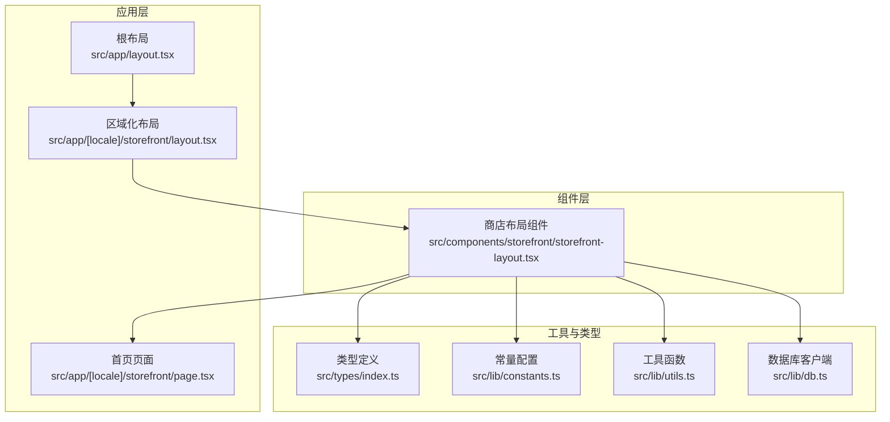
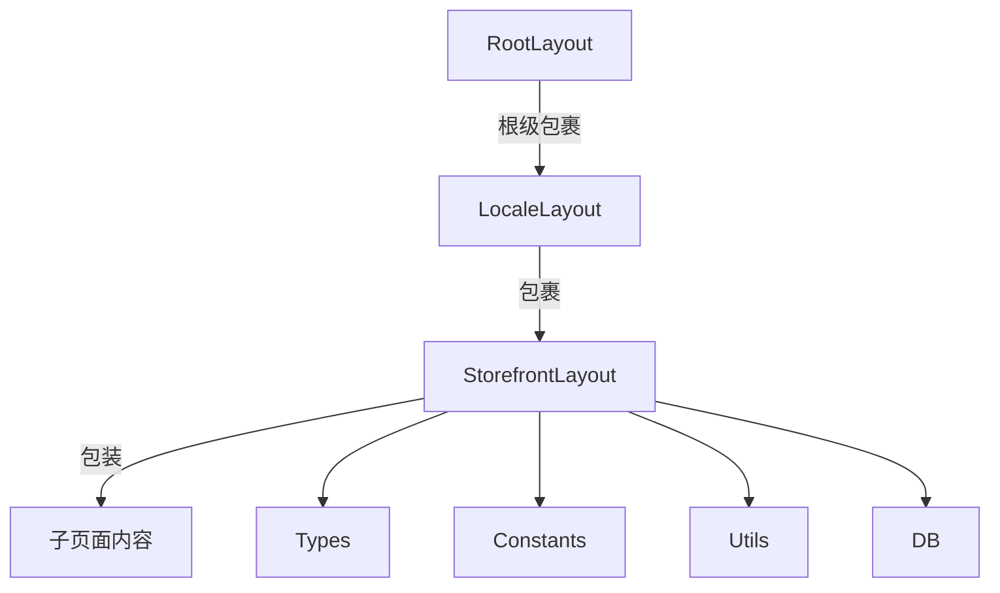
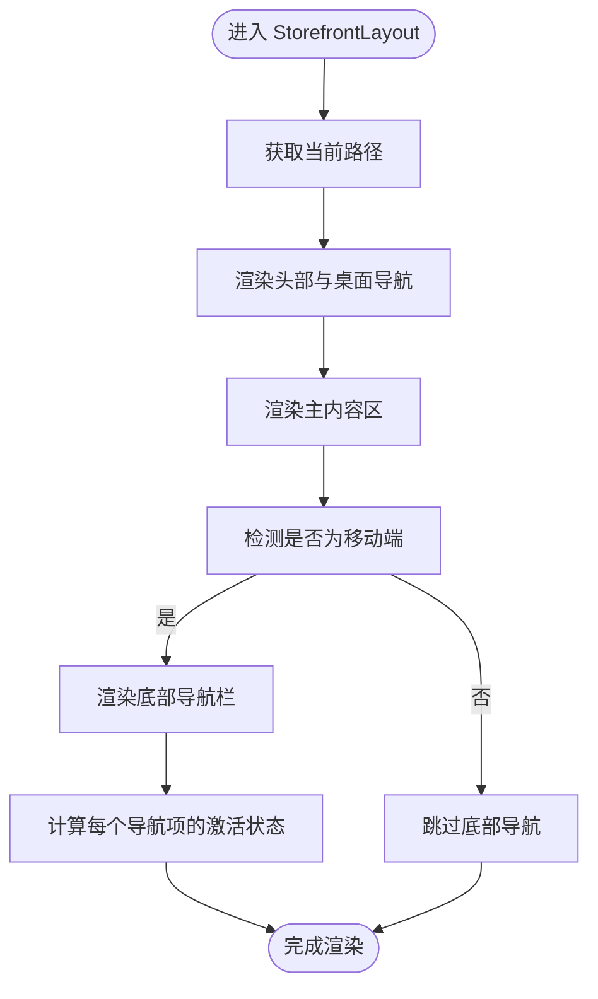
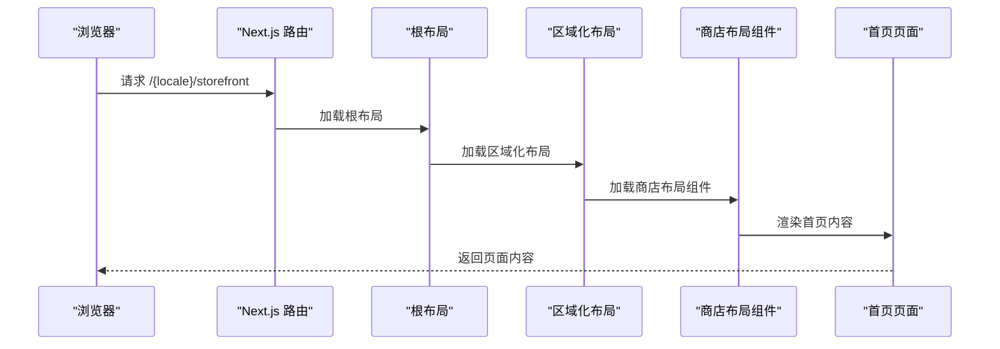
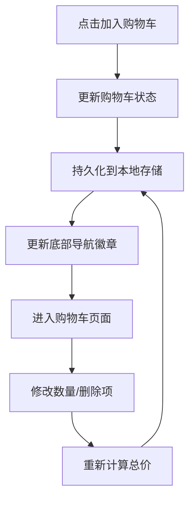
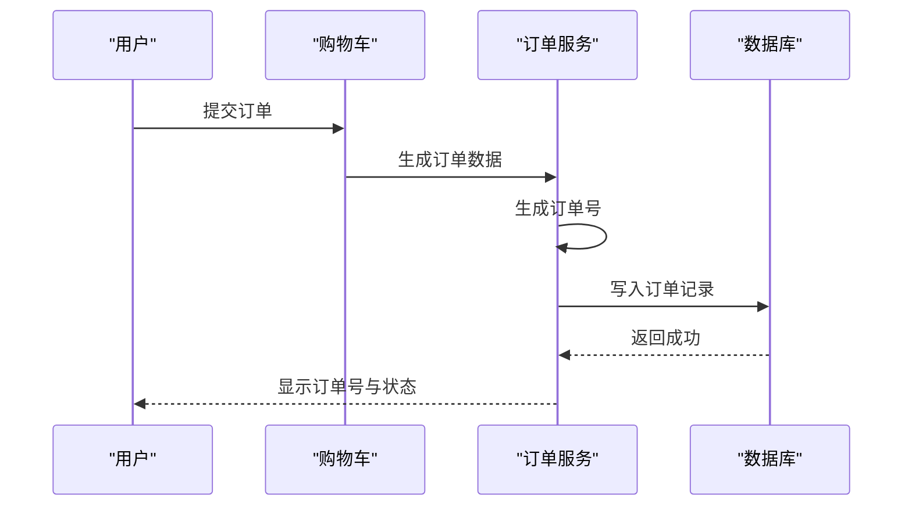
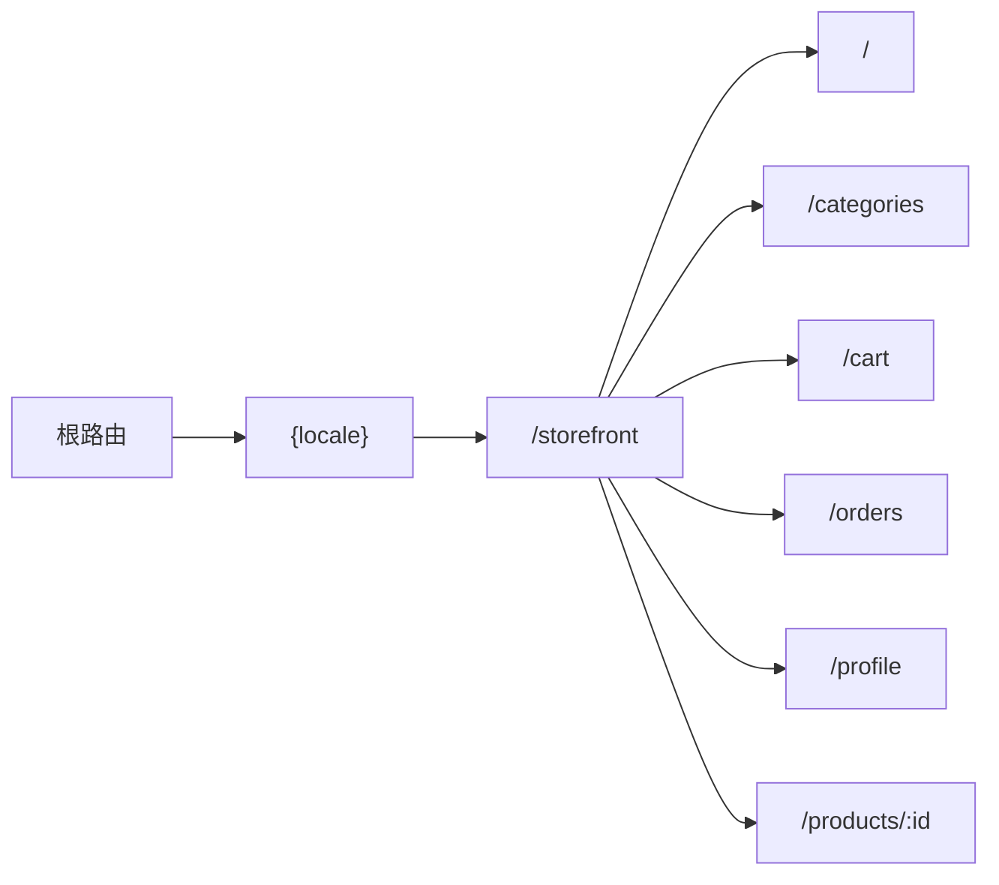
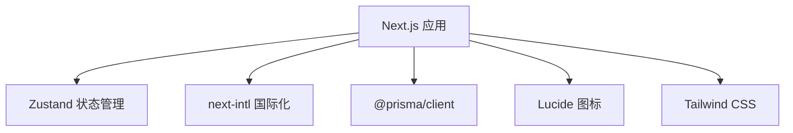

# 前台商店系统

<cite>
**本文档引用的文件**
- [src/components/storefront/storefront-layout.tsx](file://src/components/storefront/storefront-layout.tsx)
- [src/app/[locale]/storefront/layout.tsx](file://src/app/[locale]/storefront/layout.tsx)
- [src/app/[locale]/storefront/page.tsx](file://src/app/[locale]/storefront/page.tsx)
- [src/app/layout.tsx](file://src/app/layout.tsx)
- [src/lib/constants.ts](file://src/lib/constants.ts)
- [src/lib/utils.ts](file://src/lib/utils.ts)
- [src/lib/db.ts](file://src/lib/db.ts)
- [src/types/index.ts](file://src/types/index.ts)
- [package.json](file://package.json)
- [next.config.ts](file://next.config.ts)
</cite>

## 目录
1. [简介](#简介)
2. [项目结构](#项目结构)
3. [核心组件](#核心组件)
4. [架构总览](#架构总览)
5. [详细组件分析](#详细组件分析)
6. [依赖分析](#依赖分析)
7. [性能考虑](#性能考虑)
8. [故障排除指南](#故障排除指南)
9. [结论](#结论)
10. [附录](#附录)

## 简介
本文件面向前端开发者，系统性梳理 Celestia 前台商店系统的架构与实现，重点覆盖以下方面：
- StorefrontLayout 组件架构、移动端适配与导航系统设计
- 商品展示系统（列表、详情、搜索、筛选）与路由组织
- 购物车系统（状态管理、持久化）与订单管理（创建流程、状态管理）
- 用户个人中心功能与国际化支持
- 响应式布局与用户体验设计原则
- 性能优化策略与 SEO 优化建议
- 完整实现指南与最佳实践

## 项目结构
前台商店系统采用 Next.js App Router 的多语言路由结构，Storefront 根布局通过动态路由参数 [locale] 实现国际化路径前缀。核心文件分布如下：
- 布局与页面：src/app/[locale]/storefront/*
- 商店布局组件：src/components/storefront/storefront-layout.tsx
- 全局根布局与元数据：src/app/layout.tsx
- 类型定义与常量：src/types/index.ts、src/lib/constants.ts
- 工具函数：src/lib/utils.ts
- 数据库客户端：src/lib/db.ts
- 依赖与构建配置：package.json、next.config.ts

**图表来源**
- [src/app/layout.tsx:17-42](file://src/app/layout.tsx#L17-L42)
- [src/app/[locale]/storefront/layout.tsx:3-9](file://src/app/[locale]/storefront/layout.tsx#L3-L9)
- [src/components/storefront/storefront-layout.tsx:21-98](file://src/components/storefront/storefront-layout.tsx#L21-L98)

**章节来源**
- [src/app/[locale]/storefront/layout.tsx:3-9](file://src/app/[locale]/storefront/layout.tsx#L3-L9)
- [src/app/[locale]/storefront/page.tsx:3-25](file://src/app/[locale]/storefront/page.tsx#L3-L25)
- [src/app/layout.tsx:17-42](file://src/app/layout.tsx#L17-L42)

## 核心组件
- StorefrontLayout：提供统一头部导航、桌面端菜单、移动端底部导航与主内容区容器，作为所有商店页面的根布局包装器。
- 区域化布局：基于 [locale] 动态路由，确保不同语言环境下的路径隔离与内容渲染。
- 首页页面：展示品牌信息与欢迎语，作为商店入口页。

关键特性：
- 移动端底部导航：使用固定定位与图标+文字的导航项，根据当前路径高亮激活状态。
- 桌面端导航：在中等及以上屏幕尺寸显示，提供更丰富的菜单项。
- 响应式内容区：移动端自动增加底部安全高度，避免与底部导航重叠。

**章节来源**
- [src/components/storefront/storefront-layout.tsx:21-98](file://src/components/storefront/storefront-layout.tsx#L21-L98)
- [src/app/[locale]/storefront/layout.tsx:3-9](file://src/app/[locale]/storefront/layout.tsx#L3-L9)
- [src/app/[locale]/storefront/page.tsx:3-25](file://src/app/[locale]/storefront/page.tsx#L3-L25)

## 架构总览
商店系统采用“布局组件 + 页面”的分层架构：
- 布局组件负责通用 UI 结构与导航逻辑
- 页面组件负责具体业务内容
- 类型与常量提供统一的数据契约与配置
- 工具函数封装格式化与通用逻辑
- 数据库客户端提供后端数据访问能力

**图表来源**
- [src/components/storefront/storefront-layout.tsx:21-98](file://src/components/storefront/storefront-layout.tsx#L21-L98)
- [src/app/[locale]/storefront/layout.tsx:3-9](file://src/app/[locale]/storefront/layout.tsx#L3-L9)
- [src/app/layout.tsx:17-42](file://src/app/layout.tsx#L17-L42)

## 详细组件分析

### StorefrontLayout 组件分析
StorefrontLayout 是商店系统的核心布局组件，承担以下职责：
- 头部区域：品牌 Logo、品牌名称与桌面端导航菜单
- 主内容区：扩展填充剩余空间，移动端启用滚动以适配底部导航
- 移动端底部导航：固定在屏幕底部，根据当前路径高亮对应导航项
- 导航项：首页、分类、购物车、订单、我的，均使用 Lucide 图标库

导航激活逻辑：
- 使用 Next.js 的 usePathname 获取当前路径
- 激活条件包括完全匹配或以导航 href 开头的子路径（如详情页）

**图表来源**
- [src/components/storefront/storefront-layout.tsx:21-98](file://src/components/storefront/storefront-layout.tsx#L21-L98)

**章节来源**
- [src/components/storefront/storefront-layout.tsx:9-19](file://src/components/storefront/storefront-layout.tsx#L9-L19)
- [src/components/storefront/storefront-layout.tsx:21-98](file://src/components/storefront/storefront-layout.tsx#L21-L98)

### 区域化布局与页面
- 区域化布局：通过 [locale] 动态路由参数实现多语言路径隔离，例如 /zh/storefront、/ar/storefront 等。
- 首页页面：作为商店入口，提供品牌介绍与欢迎信息，使用 Tailwind CSS 实现响应式排版。

**图表来源**
- [src/app/[locale]/storefront/layout.tsx:3-9](file://src/app/[locale]/storefront/layout.tsx#L3-L9)
- [src/app/[locale]/storefront/page.tsx:3-25](file://src/app/[locale]/storefront/page.tsx#L3-L25)
- [src/app/layout.tsx:17-42](file://src/app/layout.tsx#L17-L42)

**章节来源**
- [src/app/[locale]/storefront/layout.tsx:3-9](file://src/app/[locale]/storefront/layout.tsx#L3-L9)
- [src/app/[locale]/storefront/page.tsx:3-25](file://src/app/[locale]/storefront/page.tsx#L3-L25)

### 商品展示系统
- 列表：通过路由 /storefront/categories 展示商品分类与商品列表（当前仓库未包含具体实现文件，需后续补充）
- 详情：通过路由 /storefront/products/:id 展示商品详情（当前仓库未包含具体实现文件，需后续补充）
- 搜索与筛选：通过查询参数或路由参数传递关键词、分类、排序等筛选条件（当前仓库未包含具体实现文件，需后续补充）

实现建议：
- 使用 Next.js 的动态路由与查询参数组合实现搜索与筛选
- 采用分页参数（游标分页）提升大数据量场景下的性能
- 在列表页与详情页分别设置合适的 SEO 元数据

**章节来源**
- [src/types/index.ts:24-32](file://src/types/index.ts#L24-L32)
- [src/lib/constants.ts:31-35](file://src/lib/constants.ts#L31-L35)

### 购物车系统
- 状态管理：推荐使用 Zustand 进行轻量级全局状态管理，存储购物车项、数量、总价等
- 持久化：结合浏览器本地存储（localStorage/sessionStorage）实现跨刷新保留
- UI 交互：在商品详情页与列表页提供“加入购物车”按钮，底部导航中的购物车图标可显示徽章提示

**图表来源**
- [package.json:36](file://package.json#L36)

**章节来源**
- [package.json:36](file://package.json#L36)

### 订单管理系统
- 创建流程：从购物车提交订单，生成唯一订单号（格式：CLS-YYYYMMDD-XXXX），写入数据库
- 状态管理：使用 ORDER_STATUS_CONFIG 中的状态映射，支持中文与英文标签
- 订单列表与详情：通过路由 /storefront/orders/:id 展示订单状态与历史

**图表来源**
- [src/lib/utils.ts:25-31](file://src/lib/utils.ts#L25-L31)
- [src/lib/constants.ts:1-13](file://src/lib/constants.ts#L1-L13)

**章节来源**
- [src/lib/utils.ts:25-31](file://src/lib/utils.ts#L25-L31)
- [src/lib/constants.ts:1-13](file://src/lib/constants.ts#L1-L13)

### 用户个人中心
- 路由：/storefront/profile
- 功能：展示用户信息、地址管理、订单历史、偏好设置等
- 国际化：根据用户首选语言切换界面语言

**章节来源**
- [src/types/index.ts:50-57](file://src/types/index.ts#L50-L57)
- [src/lib/constants.ts:40-46](file://src/lib/constants.ts#L40-L46)

### 路由设计
- 多语言路由：/{locale}/storefront/*，其中 locale 来自 SUPPORTED_LOCALES
- 页面路由：
  - 首页：/storefront
  - 分类：/storefront/categories
  - 购物车：/storefront/cart
  - 订单：/storefront/orders
  - 个人中心：/storefront/profile
  - 商品详情：/storefront/products/:id（建议）

**图表来源**
- [src/components/storefront/storefront-layout.tsx:13-19](file://src/components/storefront/storefront-layout.tsx#L13-L19)
- [src/lib/constants.ts:40-46](file://src/lib/constants.ts#L40-L46)

**章节来源**
- [src/components/storefront/storefront-layout.tsx:13-19](file://src/components/storefront/storefront-layout.tsx#L13-L19)
- [src/lib/constants.ts:40-46](file://src/lib/constants.ts#L40-L46)

### 国际化支持
- 支持语言：en、ar、zh
- RTL 语言：ar（阿拉伯语）
- 会话用户：SessionUser 包含 preferredLang 字段，用于界面语言选择
- 路由前缀：/{locale}/storefront

实现要点：
- 使用 next-intl 或类似方案进行路由级国际化
- 文案与日期格式根据语言切换（参考工具函数中的格式化逻辑）

**章节来源**
- [src/lib/constants.ts:40-46](file://src/lib/constants.ts#L40-L46)
- [src/types/index.ts:50-57](file://src/types/index.ts#L50-L57)

### 响应式布局实现
- 移动端：底部固定导航，主内容区预留底部安全高度
- 桌面端：隐藏底部导航，显示桌面端导航菜单
- 字体与颜色：使用 Tailwind CSS 类名控制字号、颜色与间距

**章节来源**
- [src/components/storefront/storefront-layout.tsx:41-66](file://src/components/storefront/storefront-layout.tsx#L41-L66)
- [src/components/storefront/storefront-layout.tsx:75-95](file://src/components/storefront/storefront-layout.tsx#L75-L95)

## 依赖分析
- 前端框架与工具
  - Next.js 16.2.1：App Router、动态路由、SSR/SSG
  - lucide-react：图标库
  - tailwind-merge、clsx：样式类合并
  - zustand：状态管理
  - next-intl：国际化
  - @prisma/client：数据库访问
- 开发与构建
  - TypeScript、ESLint、Tailwind CSS

**图表来源**
- [package.json:11-37](file://package.json#L11-L37)

**章节来源**
- [package.json:11-37](file://package.json#L11-L37)

## 性能考虑
- 路由与渲染
  - 使用 App Router 的并行加载与流式传输优化首屏性能
  - 将非关键内容延迟加载（如桌面端导航菜单）
- 状态管理
  - 购物车状态使用轻量级状态管理，避免不必要的重渲染
  - 本地持久化减少服务器请求
- 数据访问
  - 使用 Prisma 客户端缓存连接，开发环境下开启日志便于调试
- 样式与资源
  - 合理拆分 Tailwind 类，避免生成冗余样式
  - 图片使用 Next/image 并指定尺寸，提升 LCP 指标

**章节来源**
- [src/lib/db.ts:7-11](file://src/lib/db.ts#L7-L11)

## 故障排除指南
- 路由不生效或 404
  - 检查动态路由参数 [locale] 是否正确配置
  - 确认页面文件路径与命名符合 Next.js 约定
- 导航高亮异常
  - 确认 usePathname 返回值与导航 href 匹配规则
  - 注意子路径前缀匹配逻辑
- 国际化文案不显示
  - 检查 preferredLang 与 SUPPORTED_LOCALES 的一致性
  - 确认路由前缀与语言标识一致
- 价格与日期格式错误
  - 使用 formatPrice 与 formatDate 工具函数，确保传入正确的货币与语言参数

**章节来源**
- [src/components/storefront/storefront-layout.tsx:79-87](file://src/components/storefront/storefront-layout.tsx#L79-L87)
- [src/lib/utils.ts:8-23](file://src/lib/utils.ts#L8-L23)
- [src/lib/constants.ts:40-46](file://src/lib/constants.ts#L40-L46)

## 结论
本文件从架构、组件、路由、国际化、性能与故障排除六个维度对 Celestia 前台商店系统进行了系统化梳理。StorefrontLayout 作为核心布局组件，提供了统一的导航体验与响应式适配；配合区域化路由与类型常量，为商品展示、购物车与订单管理等功能奠定了基础。建议后续补充商品详情、搜索筛选与用户中心的具体实现，并结合状态管理与本地持久化完善用户体验。

## 附录
- SEO 优化建议
  - 为首页与商品详情页设置合适的 Meta 标题与描述
  - 使用结构化数据（Schema.org）增强搜索引擎理解
  - 生成站点地图与 robots.txt
- 用户体验设计原则
  - 移动优先：底部导航与触摸友好的点击区域
  - 一致性：导航与交互模式在各页面保持统一
  - 可访问性：为图标提供替代文本，确保键盘可操作性
- 最佳实践
  - 使用类型安全的查询参数与路由参数
  - 对敏感操作（如下单）添加确认与错误处理
  - 对图片与第三方资源设置懒加载与错误降级