# 前台商店系统

<cite>
**本文档引用的文件**
- [src/components/storefront/storefront-layout.tsx](file://src/components/storefront/storefront-layout.tsx)
- [src/app/[locale]/storefront/layout.tsx](file://src/app/[locale]/storefront/layout.tsx)
- [src/app/[locale]/storefront/page.tsx](file://src/app/[locale]/storefront/page.tsx)
- [src/app/layout.tsx](file://src/app/layout.tsx)
- [src/lib/constants.ts](file://src/lib/constants.ts)
- [src/lib/utils.ts](file://src/lib/utils.ts)
- [src/lib/db.ts](file://src/lib/db.ts)
- [src/types/index.ts](file://src/types/index.ts)
- [package.json](file://package.json)
- [next.config.ts](file://next.config.ts)
- [src/app/[locale]/storefront/cart/page.tsx](file://src/app/[locale]/storefront/cart/page.tsx)
- [src/app/[locale]/storefront/favorites/page.tsx](file://src/app/[locale]/storefront/favorites/page.tsx)
- [src/app/[locale]/storefront/hidden/page.tsx](file://src/app/[locale]/storefront/hidden/page.tsx)
- [src/app/[locale]/storefront/orders/page.tsx](file://src/app/[locale]/storefront/orders/page.tsx)
- [src/app/[locale]/storefront/profile/page.tsx](file://src/app/[locale]/storefront/profile/page.tsx)
- [src/app/[locale]/storefront/products/[id]/page.tsx](file://src/app/[locale]/storefront/products/[id]/page.tsx)
- [src/components/storefront/product-grid.tsx](file://src/components/storefront/product-grid.tsx)
- [src/components/storefront/favorite-button.tsx](file://src/components/storefront/favorite-button.tsx)
- [src/components/storefront/hidden-button.tsx](file://src/components/storefront/hidden-button.tsx)
- [src/stores/cart.ts](file://src/stores/cart.ts)
- [src/lib/actions/product.ts](file://src/lib/actions/product.ts)
- [src/lib/actions/category.ts](file://src/lib/actions/category.ts)
- [src/lib/actions/favorite.ts](file://src/lib/actions/favorite.ts)
- [src/lib/actions/hidden.ts](file://src/lib/actions/hidden.ts)
- [src/components/storefront/sku-selector.tsx](file://src/components/storefront/sku-selector.tsx)
</cite>

## 更新摘要
**所做更改**
- 新增SKU选择器组件的主石尺寸选择功能，支持精确的主石尺寸规格选择
- 更新商品详情页面的SKU选择逻辑，增强主石尺寸验证和描述构建
- 扩展国际化支持，新增主石尺寸相关的翻译键值
- 增强SKU验证机制，确保主石尺寸选择的完整性
- 更新Excel导入导出功能，支持主石尺寸维度的笛卡尔积展开

## 目录
1. [简介](#简介)
2. [项目结构](#项目结构)
3. [核心组件](#核心组件)
4. [架构总览](#架构总览)
5. [详细组件分析](#详细组件分析)
6. [商品展示系统](#商品展示系统)
7. [购物车系统](#购物车系统)
8. [收藏夹和隐藏功能](#收藏夹和隐藏功能)
9. [订单管理系统](#订单管理系统)
10. [用户个人中心](#用户个人中心)
11. [SKU选择器系统](#sku选择器系统)
12. [路由设计](#路由设计)
13. [国际化支持](#国际化支持)
14. [响应式布局实现](#响应式布局实现)
15. [性能考虑](#性能考虑)
16. [故障排除指南](#故障排除指南)
17. [结论](#结论)
18. [附录](#附录)

## 简介
本文件面向前端开发者，系统性梳理 Celestia 前台商店系统的完整架构与实现，重点覆盖以下方面：
- StorefrontLayout 组件架构、移动端适配与导航系统设计
- 商品展示系统（列表、详情、搜索、筛选、排序）
- 购物车系统（状态管理、持久化、UI集成）
- 收藏夹和隐藏产品功能
- 订单管理系统（创建流程、状态管理、订单详情）
- 用户个人中心功能与账户管理
- 完整的SKU选择器系统（含主石尺寸选择功能）
- 完整的路由体系和国际化支持
- 响应式布局与用户体验设计原则
- 性能优化策略与SEO优化建议
- 完整实现指南与最佳实践

## 项目结构
前台商店系统采用Next.js App Router的多语言路由结构，支持完整的电商功能。核心文件分布如下：
- 布局与页面：src/app/[locale]/storefront/*
- 商店布局组件：src/components/storefront/storefront-layout.tsx
- 商品展示组件：src/components/storefront/product-grid.tsx、product-card.tsx
- 购物车组件：src/components/storefront/cart-badge.tsx
- 收藏夹组件：src/components/storefront/favorite-button.tsx
- 隐藏功能组件：src/components/storefront/hidden-button.tsx
- SKU选择器组件：src/components/storefront/sku-selector.tsx
- 状态管理：src/stores/cart.ts
- 业务逻辑：src/lib/actions/*
- 类型定义与常量：src/types/index.ts、src/lib/constants.ts
- 工具函数：src/lib/utils.ts
- 数据库客户端：src/lib/db.ts
- 依赖与构建配置：package.json、next.config.ts

```mermaid
graph TB
subgraph "应用层"
RootLayout["根布局<br/>src/app/layout.tsx"]
LocaleLayout["区域化布局<br/>src/app/[locale]/storefront/layout.tsx"]
HomePage["首页页面<br/>src/app/[locale]/storefront/page.tsx"]
CartPage["购物车页面<br/>src/app/[locale]/storefront/cart/page.tsx"]
FavoritesPage["收藏夹页面<br/>src/app/[locale]/storefront/favorites/page.tsx"]
HiddenPage["隐藏页面<br/>src/app/[locale]/storefront/hidden/page.tsx"]
OrdersPage["订单页面<br/>src/app/[locale]/storefront/orders/page.tsx"]
ProfilePage["个人中心页面<br/>src/app/[locale]/storefront/profile/page.tsx"]
ProductDetailPage["商品详情页面<br/>src/app/[locale]/storefront/products/[id]/page.tsx"]
end
subgraph "组件层"
StorefrontLayout["商店布局组件<br/>src/components/storefront/storefront-layout.tsx"]
ProductGrid["商品网格组件<br/>src/components/storefront/product-grid.tsx"]
CartBadge["购物车徽章组件<br/>src/components/storefront/cart-badge.tsx"]
FavoriteButton["收藏按钮组件<br/>src/components/storefront/favorite-button.tsx"]
HiddenButton["隐藏按钮组件<br/>src/components/storefront/hidden-button.tsx"]
SkuSelector["SKU选择器组件<br/>src/components/storefront/sku-selector.tsx"]
end
subgraph "状态管理"
CartStore["购物车状态管理<br/>src/stores/cart.ts"]
end
subgraph "业务逻辑层"
ProductActions["商品操作<br/>src/lib/actions/product.ts"]
CategoryActions["分类操作<br/>src/lib/actions/category.ts"]
FavoriteActions["收藏操作<br/>src/lib/actions/favorite.ts"]
HiddenActions["隐藏操作<br/>src/lib/actions/hidden.ts"]
end
RootLayout --> LocaleLayout
LocaleLayout --> StorefrontLayout
StorefrontLayout --> HomePage
StorefrontLayout --> CartPage
StorefrontLayout --> FavoritesPage
StorefrontLayout --> HiddenPage
StorefrontLayout --> OrdersPage
StorefrontLayout --> ProfilePage
StorefrontLayout --> ProductDetailPage
StorefrontLayout --> ProductGrid
StorefrontLayout --> CartBadge
StorefrontLayout --> FavoriteButton
StorefrontLayout --> HiddenButton
StorefrontLayout --> SkuSelector
CartStore --> CartPage
ProductGrid --> ProductActions
FavoriteButton --> FavoriteActions
HiddenButton --> HiddenActions
SkuSelector --> ProductDetailPage
```

**图表来源**
- [src/app/[locale]/storefront/layout.tsx:11-33](file://src/app/[locale]/storefront/layout.tsx#L11-L33)
- [src/components/storefront/storefront-layout.tsx:32-43](file://src/components/storefront/storefront-layout.tsx#L32-L43)
- [src/stores/cart.ts](file://src/stores/cart.ts)
- [src/lib/actions/product.ts](file://src/lib/actions/product.ts)
- [src/lib/actions/favorite.ts](file://src/lib/actions/favorite.ts)
- [src/lib/actions/hidden.ts](file://src/lib/actions/hidden.ts)

**章节来源**
- [src/app/[locale]/storefront/layout.tsx:11-33](file://src/app/[locale]/storefront/layout.tsx#L11-L33)
- [src/app/[locale]/storefront/page.tsx:58-460](file://src/app/[locale]/storefront/page.tsx#L58-L460)
- [src/components/storefront/storefront-layout.tsx:32-43](file://src/components/storefront/storefront-layout.tsx#L32-L43)

## 核心组件
- **StorefrontLayout**：提供统一头部导航、桌面端菜单、移动端底部导航与主内容区容器，作为所有商店页面的根布局包装器
- **区域化布局**：基于[locale]动态路由，确保不同语言环境下的路径隔离与内容渲染
- **商品网格组件**：支持无限滚动、加载状态、空状态处理
- **购物车徽章**：实时显示购物车商品数量，支持点击跳转
- **收藏按钮**：支持用户收藏商品，状态同步到服务器
- **隐藏按钮**：允许用户隐藏不需要的商品，提升个性化体验
- **SKU选择器**：提供完整的商品规格选择功能，包括主石尺寸、尺寸、链长度等

关键特性：
- 移动端底部导航：使用固定定位与图标+文字的导航项，根据当前路径高亮激活状态
- 桌面端导航：在中等及以上屏幕尺寸显示，提供更丰富的菜单项
- 响应式内容区：移动端自动增加底部安全高度，避免与底部导航重叠
- 实时状态同步：收藏和隐藏状态即时更新UI并持久化到服务器
- 智能规格选择：根据已选规格动态过滤可用选项，避免无效组合

**章节来源**
- [src/components/storefront/storefront-layout.tsx:32-157](file://src/components/storefront/storefront-layout.tsx#L32-L157)
- [src/app/[locale]/storefront/layout.tsx:11-33](file://src/app/[locale]/storefront/layout.tsx#L11-L33)
- [src/app/[locale]/storefront/page.tsx:58-460](file://src/app/[locale]/storefront/page.tsx#L58-L460)

## 架构总览
商店系统采用"布局组件 + 页面组件 + 业务逻辑层"的分层架构：
- 布局组件负责通用UI结构与导航逻辑
- 页面组件负责具体业务内容与用户交互
- 业务逻辑层封装API调用和数据处理
- 状态管理提供全局状态共享
- 类型与常量提供统一的数据契约与配置
- 工具函数封装格式化与通用逻辑
- 数据库客户端提供后端数据访问能力

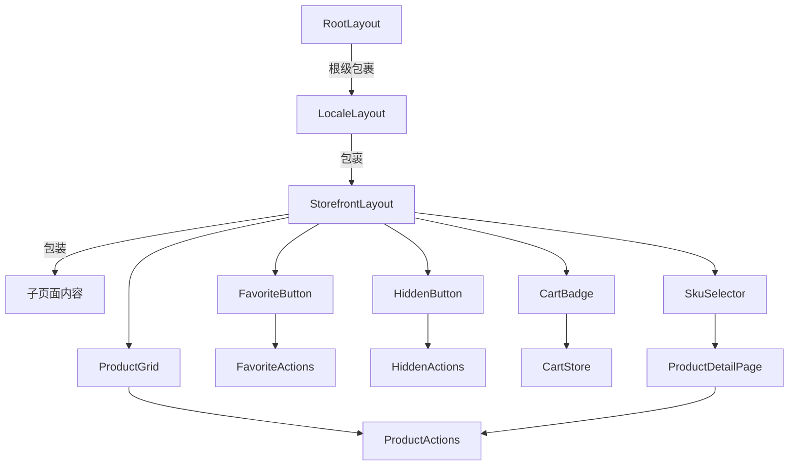

**图表来源**
- [src/components/storefront/storefront-layout.tsx:32-157](file://src/components/storefront/storefront-layout.tsx#L32-L157)
- [src/app/[locale]/storefront/layout.tsx:11-33](file://src/app/[locale]/storefront/layout.tsx#L11-L33)
- [src/app/[locale]/storefront/page.tsx:27-31](file://src/app/[locale]/storefront/page.tsx#L27-L31)

## 详细组件分析

### StorefrontLayout 组件分析
StorefrontLayout是商店系统的核心布局组件，承担以下职责：
- 头部区域：品牌Logo、品牌名称与桌面端导航菜单
- 主内容区：扩展填充剩余空间，移动端启用滚动以适配底部导航
- 移动端底部导航：固定在屏幕底部，根据当前路径高亮对应导航项
- 导航项：首页、购物车、收藏夹、订单、我的，均使用Lucide图标库

导航激活逻辑：
- 使用Next.js的usePathname获取当前路径
- 激活条件包括完全匹配或以导航href开头的子路径（如详情页）
- 购物车使用CartBadge组件显示徽章提示

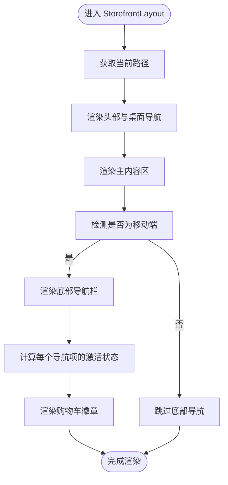

**图表来源**
- [src/components/storefront/storefront-layout.tsx:32-157](file://src/components/storefront/storefront-layout.tsx#L32-L157)

**章节来源**
- [src/components/storefront/storefront-layout.tsx:32-43](file://src/components/storefront/storefront-layout.tsx#L32-L43)
- [src/components/storefront/storefront-layout.tsx:92-100](file://src/components/storefront/storefront-layout.tsx#L92-L100)
- [src/components/storefront/storefront-layout.tsx:102-154](file://src/components/storefront/storefront-layout.tsx#L102-L154)

### 区域化布局与页面
- 区域化布局：通过[locale]动态路由参数实现多语言路径隔离，例如/zh/storefront、/ar/storefront等
- 首页页面：作为商店入口，提供品牌介绍与欢迎信息，使用Tailwind CSS实现响应式排版
- 国际化提供者：使用NextIntlClientProvider和NuqsAdapter确保URL状态与国际化同时工作

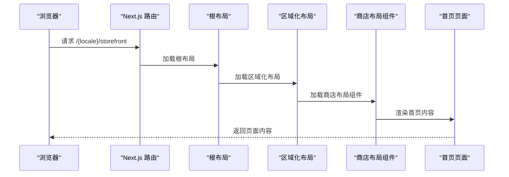

**图表来源**
- [src/app/[locale]/storefront/layout.tsx:11-33](file://src/app/[locale]/storefront/layout.tsx#L11-L33)
- [src/app/[locale]/storefront/page.tsx:58-460](file://src/app/[locale]/storefront/page.tsx#L58-L460)
- [src/app/layout.tsx:17-42](file://src/app/layout.tsx#L17-L42)

**章节来源**
- [src/app/[locale]/storefront/layout.tsx:11-33](file://src/app/[locale]/storefront/layout.tsx#L11-L33)
- [src/app/[locale]/storefront/page.tsx:58-460](file://src/app/[locale]/storefront/page.tsx#L58-L460)

## 商品展示系统

### 商品列表页面实现
商品展示系统提供了完整的商品浏览体验，包括搜索、筛选、排序和无限滚动功能：

#### 核心功能特性
- **实时搜索**：使用防抖技术实现300ms延迟搜索，提升用户体验
- **多维筛选**：支持宝石类型、金属颜色、商品分类等多条件筛选
- **智能排序**：支持最新、价格升序、价格降序、热门度排序
- **无限滚动**：基于Intersection Observer实现流畅的加载体验
- **国际化支持**：多语言商品名称显示（中、英、阿拉伯语）

#### 状态管理
- **URL状态**：使用nuqs库管理查询参数状态，支持浏览器前进后退
- **本地状态**：管理商品列表、分类、加载状态等本地数据
- **收藏状态**：维护用户收藏商品ID集合
- **隐藏状态**：维护用户隐藏商品ID集合

#### 性能优化
- **并发加载**：使用Promise.all同时加载分类和收藏状态
- **虚拟滚动**：支持大量商品的高效渲染
- **缓存策略**：避免重复API调用

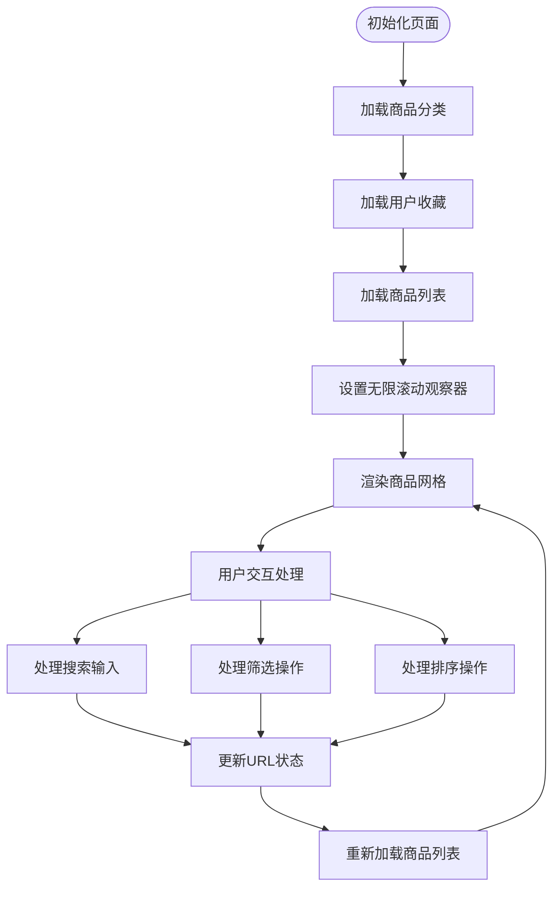

**图表来源**
- [src/app/[locale]/storefront/page.tsx:121-146](file://src/app/[locale]/storefront/page.tsx#L121-L146)
- [src/app/[locale]/storefront/page.tsx:148-178](file://src/app/[locale]/storefront/page.tsx#L148-L178)
- [src/app/[locale]/storefront/page.tsx:189-213](file://src/app/[locale]/storefront/page.tsx#L189-L213)

**章节来源**
- [src/app/[locale]/storefront/page.tsx:58-460](file://src/app/[locale]/storefront/page.tsx#L58-L460)
- [src/components/storefront/product-grid.tsx](file://src/components/storefront/product-grid.tsx)

### 商品网格组件
商品网格组件负责渲染商品卡片，支持加载状态、空状态和交互功能：

#### 组件特性
- **响应式布局**：支持不同屏幕尺寸的网格排列
- **加载状态**：提供骨架屏加载效果
- **空状态处理**：无结果时显示友好提示
- **交互支持**：支持收藏、隐藏等用户操作

#### 性能优化
- **条件渲染**：仅渲染可见商品
- **事件防抖**：避免频繁状态更新
- **内存管理**：合理清理观察器和定时器

**章节来源**
- [src/components/storefront/product-grid.tsx](file://src/components/storefront/product-grid.tsx)

## 购物车系统

### 状态管理架构
购物车系统采用Zustand进行轻量级全局状态管理，提供以下功能：
- **商品管理**：添加、删除、修改数量
- **价格计算**：实时计算小计、税费、总价
- **持久化存储**：使用localStorage实现跨会话数据保存
- **同步机制**：与服务器状态保持同步

### 购物车徽章组件
购物车徽章组件提供实时的购物车状态显示：
- **数量徽章**：显示购物车中商品总数
- **点击跳转**：点击徽章跳转到购物车页面
- **动画效果**：使用Framer Motion提供流畅的过渡动画

### 状态持久化策略
- **本地存储**：使用localStorage保存购物车数据
- **会话恢复**：页面刷新后恢复购物车状态
- **服务器同步**：登录状态下与服务器购物车数据同步

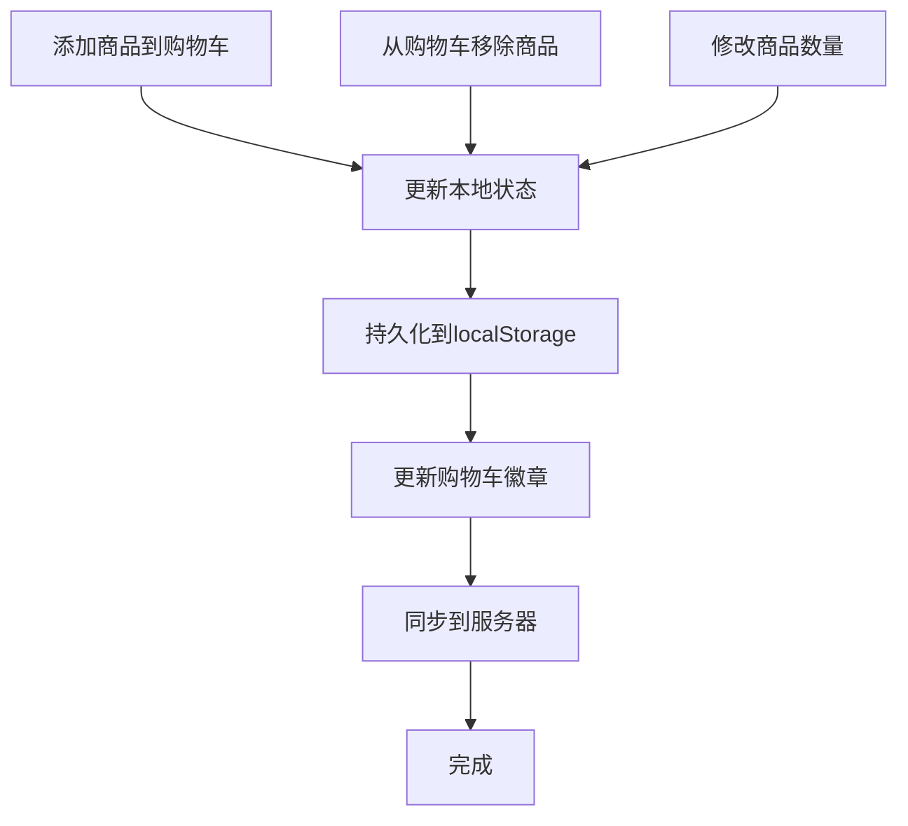

**图表来源**
- [src/stores/cart.ts](file://src/stores/cart.ts)
- [src/components/storefront/cart-badge.tsx](file://src/components/storefront/cart-badge.tsx)

**章节来源**
- [src/stores/cart.ts](file://src/stores/cart.ts)
- [src/components/storefront/cart-badge.tsx](file://src/components/storefront/cart-badge.tsx)

## 收藏夹和隐藏功能

### 收藏夹系统
收藏夹功能允许用户保存喜欢的商品，提供以下特性：
- **即时收藏**：点击收藏按钮即可添加到收藏夹
- **状态同步**：收藏状态实时更新UI并发送到服务器
- **独立页面**：提供专门的收藏夹页面浏览所有收藏商品
- **批量操作**：支持批量移除收藏

### 隐藏功能
隐藏功能允许用户过滤掉不需要看到的商品：
- **一键隐藏**：在商品列表中直接隐藏某个商品
- **隐私保护**：隐藏的商品不会影响其他用户的体验
- **独立页面**：提供专门的隐藏商品页面
- **恢复功能**：支持从隐藏列表中恢复商品

### 状态管理
- **本地状态**：维护收藏和隐藏的ID集合
- **服务器同步**：所有操作都会同步到服务器
- **实时更新**：状态变更立即反映在UI上

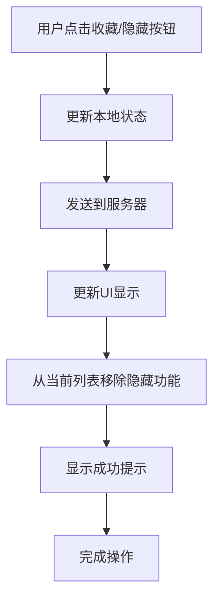

**图表来源**
- [src/app/[locale]/storefront/page.tsx:241-258](file://src/app/[locale]/storefront/page.tsx#L241-L258)
- [src/components/storefront/favorite-button.tsx](file://src/components/storefront/favorite-button.tsx)
- [src/components/storefront/hidden-button.tsx](file://src/components/storefront/hidden-button.tsx)

**章节来源**
- [src/app/[locale]/storefront/page.tsx:241-258](file://src/app/[locale]/storefront/page.tsx#L241-L258)
- [src/components/storefront/favorite-button.tsx](file://src/components/storefront/favorite-button.tsx)
- [src/components/storefront/hidden-button.tsx](file://src/components/storefront/hidden-button.tsx)

## 订单管理系统

### 订单创建流程
订单管理系统提供完整的订单生命周期管理：
- **订单提交**：从购物车页面提交订单
- **订单生成**：生成唯一的订单号（格式：CLS-YYYYMMDD-XXXX）
- **状态跟踪**：支持多种订单状态（待支付、已支付、已发货、已完成等）
- **历史记录**：用户可以查看所有历史订单

### 订单详情页面
订单详情页面提供详细的订单信息：
- **订单概览**：显示订单号、创建时间、总金额
- **商品明细**：列出购买的所有商品及其规格
- **配送信息**：显示收货地址和配送方式
- **支付信息**：显示支付状态和支付方式
- **状态历史**：显示订单状态变更历史

### 订单状态管理
- **状态映射**：使用ORDER_STATUS_CONFIG管理状态转换
- **权限控制**：不同用户角色可以看到不同的状态信息
- **通知机制**：订单状态变更时发送通知

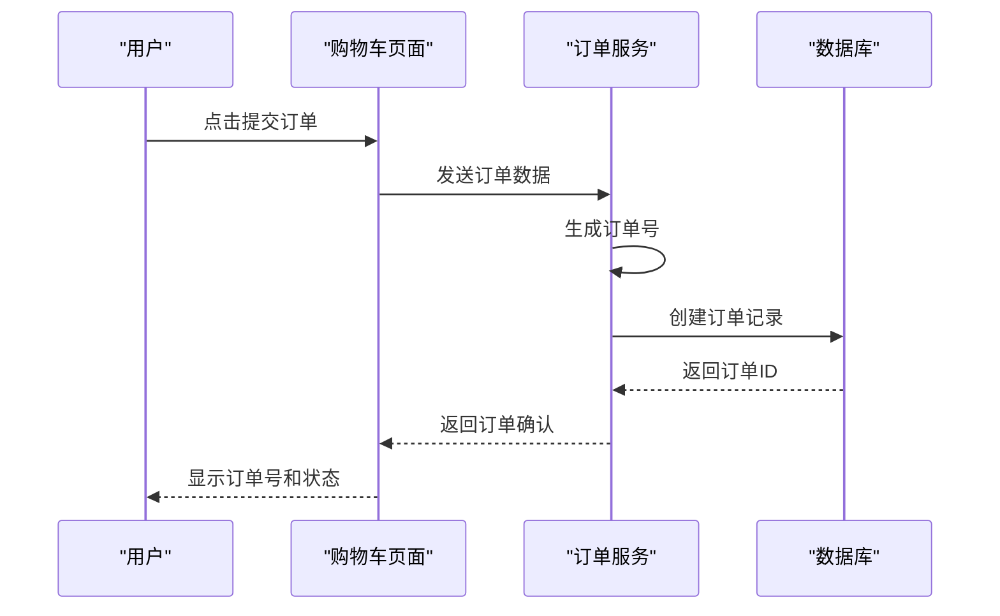

**图表来源**
- [src/lib/utils.ts:25-31](file://src/lib/utils.ts#L25-L31)
- [src/lib/constants.ts:1-13](file://src/lib/constants.ts#L1-L13)

**章节来源**
- [src/lib/utils.ts:25-31](file://src/lib/utils.ts#L25-L31)
- [src/lib/constants.ts:1-13](file://src/lib/constants.ts#L1-L13)

## 用户个人中心

### 个人信息管理
个人中心提供用户信息的集中管理：
- **基本信息**：姓名、邮箱、电话号码等
- **地址管理**：默认收货地址设置、地址簿管理
- **账户设置**：密码修改、登录方式设置
- **偏好设置**：语言偏好、通知设置

### 订单历史
用户可以查看和管理自己的订单历史：
- **订单列表**：按时间倒序显示所有订单
- **订单详情**：查看特定订单的详细信息
- **订单状态**：实时显示订单当前状态
- **操作选项**：根据订单状态提供相应操作（如取消、确认收货）

### 收藏夹管理
个人中心集成收藏夹功能：
- **收藏商品**：查看和管理收藏的商品
- **批量操作**：支持批量移除收藏
- **快速购买**：从收藏夹直接购买商品

**章节来源**
- [src/app/[locale]/storefront/profile/page.tsx](file://src/app/[locale]/storefront/profile/page.tsx)

## SKU选择器系统

### SKU选择器组件架构
SKU选择器是商品详情页面的核心交互组件，提供完整的规格选择功能：

#### 核心功能特性
- **多维度规格选择**：支持宝石类型、金属颜色、主石尺寸、尺寸、链长度
- **智能可用性检查**：根据已选规格动态过滤可用选项
- **库存状态显示**：实时显示规格的库存状态和缺货提示
- **价格计算集成**：与价格显示组件无缝集成
- **国际化支持**：完整的多语言规格标签显示

#### 规格维度详解
- **宝石类型**：支持摩根石（MOISSANITE）和锆石（ZIRCON）
- **金属颜色**：支持银色（SILVER）、金色（GOLD）、玫瑰金（ROSE_GOLD）、其他（OTHER）
- **主石尺寸**：支持精确的毫米单位尺寸规格
- **尺寸**：支持标准服装尺码规格
- **链长度**：支持标准项链长度规格

#### 状态管理
- **本地状态**：维护所有规格选择的状态
- **可用性状态**：动态计算每个规格选项的可用性
- **库存状态**：实时获取规格的库存状态
- **价格状态**：根据选择的规格计算参考价格

#### 性能优化
- **规格去重**：自动去除重复的规格选项
- **可用性缓存**：缓存规格可用性检查结果
- **条件渲染**：仅渲染存在的规格维度
- **事件优化**：使用防抖和节流优化用户交互

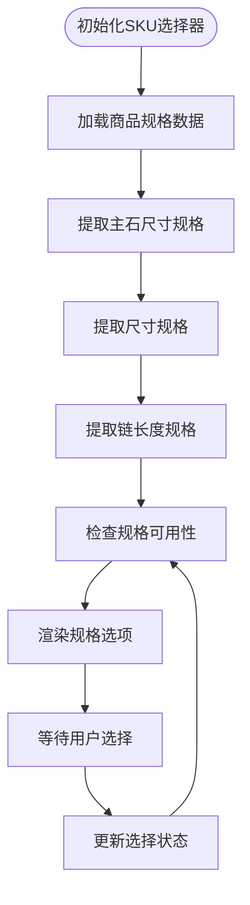

**图表来源**
- [src/components/storefront/sku-selector.tsx:138-151](file://src/components/storefront/sku-selector.tsx#L138-L151)
- [src/components/storefront/sku-selector.tsx:153-216](file://src/components/storefront/sku-selector.tsx#L153-L216)

**章节来源**
- [src/components/storefront/sku-selector.tsx](file://src/components/storefront/sku-selector.tsx)
- [src/app/[locale]/storefront/products/[id]/page.tsx:373-388](file://src/app/[locale]/storefront/products/[id]/page.tsx#L373-L388)

### 商品详情页面的SKU集成
商品详情页面深度集成了SKU选择器，提供完整的购买流程：

#### 集成特性
- **实时价格更新**：根据选择的规格实时更新参考价格
- **库存状态检查**：显示规格的库存状态和缺货提示
- **购买验证**：确保用户选择了所有必需的规格
- **SKU描述构建**：自动生成详细的SKU描述文本
- **购物车集成**：将选择的规格直接添加到购物车

#### 购买验证逻辑
- **必需规格检查**：检查商品是否要求选择主石尺寸、尺寸、链长度
- **规格匹配**：查找完全匹配的SKU记录
- **错误处理**：提供清晰的错误提示和引导
- **成功反馈**：添加到购物车后的成功提示

#### SKU描述生成
- **规格组合**：将所有选择的规格组合成描述文本
- **单位显示**：正确显示主石尺寸的毫米单位和链长度的厘米单位
- **多语言支持**：使用国际化标签显示规格名称
- **格式化输出**：生成清晰易读的SKU描述

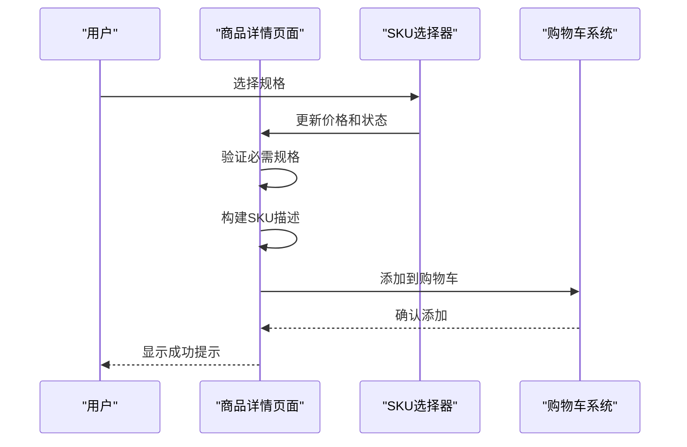

**图表来源**
- [src/app/[locale]/storefront/products/[id]/page.tsx:175-241](file://src/app/[locale]/storefront/products/[id]/page.tsx#L175-L241)
- [src/app/[locale]/storefront/products/[id]/page.tsx:220-238](file://src/app/[locale]/storefront/products/[id]/page.tsx#L220-L238)

**章节来源**
- [src/app/[locale]/storefront/products/[id]/page.tsx:175-241](file://src/app/[locale]/storefront/products/[id]/page.tsx#L175-L241)
- [src/app/[locale]/storefront/products/[id]/page.tsx:220-238](file://src/app/[locale]/storefront/products/[id]/page.tsx#L220-L238)

## 路由设计

### 多语言路由结构
商店系统采用Next.js App Router的多语言路由设计：
- **根路由**：/{locale}/storefront/*
- **支持语言**：en（英语）、zh（中文）、ar（阿拉伯语）
- **路由前缀**：/{locale}/storefront

### 页面路由映射
完整的页面路由结构如下：
- **首页**：/storefront
- **商品详情**：/storefront/products/[id]
- **购物车**：/storefront/cart
- **收藏夹**：/storefront/favorites
- **隐藏商品**：/storefront/hidden
- **订单列表**：/storefront/orders
- **订单详情**：/storefront/orders/[id]
- **个人中心**：/storefront/profile

### 路由守卫
- **认证保护**：需要登录才能访问购物车、订单、个人中心
- **权限验证**：不同用户角色访问不同功能
- **语言检测**：根据用户首选语言自动跳转

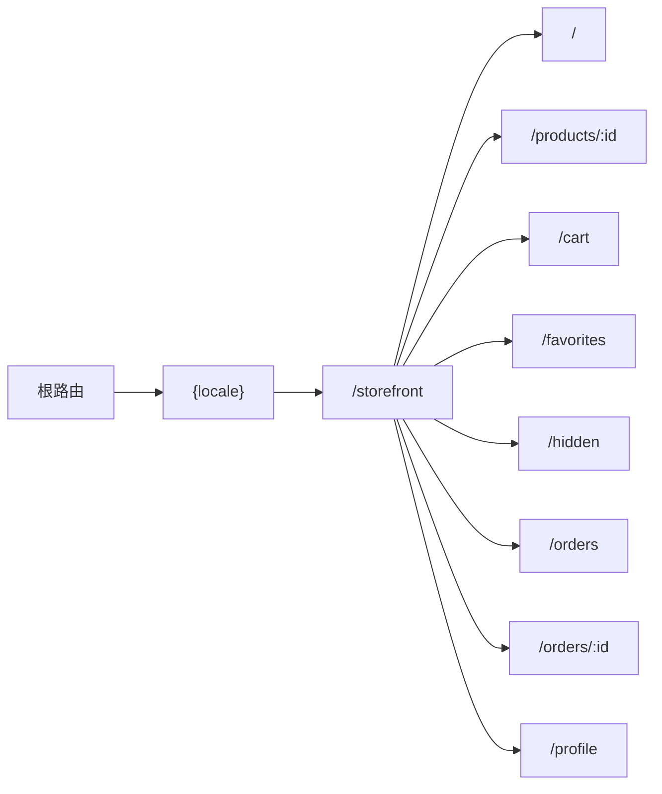

**图表来源**
- [src/components/storefront/storefront-layout.tsx:37-43](file://src/components/storefront/storefront-layout.tsx#L37-L43)
- [src/lib/constants.ts:40-46](file://src/lib/constants.ts#L40-L46)

**章节来源**
- [src/components/storefront/storefront-layout.tsx:37-43](file://src/components/storefront/storefront-layout.tsx#L37-L43)
- [src/lib/constants.ts:40-46](file://src/lib/constants.ts#L40-L46)

## 国际化支持

### 语言配置
系统支持三种语言，每种语言都有完整的界面和内容：
- **英语（en）**：默认语言，使用英文界面
- **中文（zh）**：简体中文界面，适合中国大陆用户
- **阿拉伯语（ar）**：RTL语言，支持从右到左的文字显示

### RTL支持
阿拉伯语支持完整的RTL布局：
- **文本方向**：自动从右到左显示
- **图标位置**：图标位置自动调整
- **边距设置**：左右边距自动翻转

### 动态语言切换
- **语言切换器**：提供语言切换功能
- **会话保持**：切换语言后保持用户会话
- **URL更新**：语言切换时更新URL路径

### 国际化数据源
- **消息文件**：每个语言都有对应的JSON消息文件
- **动态加载**：根据用户选择动态加载相应语言包
- **组件内翻译**：支持在组件内部使用useTranslations Hook
- **SKU选择器翻译**：主石尺寸等规格标签的多语言支持

**章节来源**
- [src/app/[locale]/storefront/layout.tsx:21-22](file://src/app/[locale]/storefront/layout.tsx#L21-L22)
- [src/i18n/config.ts](file://src/i18n/config.ts)

## 响应式布局实现

### 移动端适配
系统针对移动设备进行了全面优化：
- **底部导航**：固定在屏幕底部，提供主要功能入口
- **触摸友好**：按钮大小和间距适合触摸操作
- **安全区域**：自动避开系统UI（如状态栏、导航栏）
- **手势支持**：支持滑动、点击等常见手势

### 桌面端优化
桌面端提供更丰富的功能：
- **侧边栏**：显示更详细的导航菜单
- **大屏幕利用**：充分利用屏幕空间显示更多信息
- **键盘快捷键**：支持键盘操作提高效率
- **鼠标悬停**：提供丰富的悬停反馈

### 布局断点
- **移动端**：< 768px（md）
- **平板端**：768px - 1024px（lg）
- **桌面端**：> 1024px（xl）

### 样式系统
- **Tailwind CSS**：使用原子化CSS类名
- **主题系统**：支持深色/浅色主题切换
- **字体系统**：响应式字体大小和行高
- **间距系统**：一致的间距和对齐

**章节来源**
- [src/components/storefront/storefront-layout.tsx:102-154](file://src/components/storefront/storefront-layout.tsx#L102-L154)
- [src/components/storefront/storefront-layout.tsx:62-88](file://src/components/storefront/storefront-layout.tsx#L62-L88)

## 性能考虑

### 路由与渲染优化
- **并行加载**：使用Next.js的并行加载优化首屏性能
- **流式传输**：支持渐进式渲染提升感知性能
- **代码分割**：按需加载页面组件减少初始包大小
- **静态生成**：对不经常变化的内容使用静态生成

### 状态管理优化
- **局部状态**：只在需要的地方使用全局状态
- **状态压缩**：避免存储不必要的状态数据
- **更新策略**：使用useCallback和useMemo避免不必要的重渲染
- **持久化策略**：合理选择持久化存储方案

### 数据加载优化
- **缓存策略**：实现多层缓存减少API调用
- **预加载**：对可能访问的页面进行预加载
- **懒加载**：使用Intersection Observer实现懒加载
- **分页加载**：实现无限滚动和分页加载

### 图像和资源优化
- **响应式图像**：使用next/image组件自动优化图像
- **格式优化**：使用现代图像格式（WebP等）
- **CDN加速**：静态资源通过CDN分发
- **压缩传输**：启用Gzip/Brotli压缩

### SEO优化
- **元数据管理**：为每个页面设置合适的标题和描述
- **结构化数据**：添加Schema.org标记提升搜索结果
- **sitemap生成**：自动生成网站地图
- **robots.txt**：配置搜索引擎爬虫规则

**章节来源**
- [src/lib/db.ts:7-11](file://src/lib/db.ts#L7-L11)

## 故障排除指南

### 路由问题
- **路由不生效**：检查Next.js App Router配置和文件命名
- **语言切换失败**：确认locale参数正确传递和消息文件存在
- **404错误**：验证路由文件路径和动态参数配置

### 状态管理问题
- **状态不更新**：检查Zustand store的更新逻辑和订阅机制
- **数据丢失**：验证localStorage持久化和服务器同步
- **内存泄漏**：确保清理定时器、观察器和事件监听器

### 性能问题
- **页面加载慢**：使用Next.js Profiler分析性能瓶颈
- **内存占用高**：检查组件卸载和状态清理
- **滚动卡顿**：优化虚拟滚动和图片懒加载

### 国际化问题
- **文案不显示**：检查消息文件格式和翻译键值
- **RTL布局异常**：验证CSS方向属性和组件适配
- **语言切换闪烁**：优化消息文件加载和组件渲染

### API调用问题
- **请求失败**：检查网络连接和API端点可用性
- **数据格式错误**：验证API响应格式和类型定义
- **认证失败**：确认JWT令牌和会话状态

### SKU选择器问题
- **规格不可用**：检查规格可用性计算逻辑
- **价格不更新**：验证价格计算函数和状态更新
- **库存显示错误**：确认库存状态获取和显示逻辑
- **主石尺寸缺失**：验证Excel导入和规格提取逻辑

**章节来源**
- [src/components/storefront/storefront-layout.tsx:79-87](file://src/components/storefront/storefront-layout.tsx#L79-L87)
- [src/lib/utils.ts:8-23](file://src/lib/utils.ts#L8-L23)
- [src/lib/constants.ts:40-46](file://src/lib/constants.ts#L40-L46)

## 结论
Celestia前台商店系统是一个功能完整、架构清晰的电商解决方案。系统采用现代化的技术栈和最佳实践，提供了优秀的用户体验和良好的可维护性。

### 主要成就
- **完整的功能覆盖**：实现了从商品浏览到订单管理的全流程电商功能
- **优秀的用户体验**：响应式设计、流畅的交互和完善的错误处理
- **强大的技术架构**：基于Next.js App Router、TypeScript和现代前端技术
- **国际化支持**：完整的多语言和RTL支持
- **SKU选择器创新**：新增主石尺寸精确选择功能，提升购买体验
- **性能优化**：多层优化策略确保良好的性能表现

### 技术亮点
- **状态管理**：合理的状态分离和持久化策略
- **路由设计**：清晰的路由结构和权限控制
- **组件架构**：可复用、可测试的组件设计
- **国际化**：深度集成的多语言支持
- **SKU系统**：完整的规格选择和验证机制
- **性能优化**：从路由到渲染的全方位优化

### 未来发展方向
- **功能扩展**：可以继续添加更多电商功能如优惠券、评价系统等
- **性能提升**：进一步优化加载速度和交互性能
- **可访问性**：加强无障碍访问支持
- **监控改进**：添加更完善的性能和错误监控
- **SKU系统增强**：可以考虑添加更多规格维度和更复杂的规格组合

## 附录

### SEO优化建议
- **页面优化**：为每个商品页面设置独特的标题和描述
- **结构化数据**：添加Schema.org标记提升搜索结果丰富性
- **性能指标**：关注LCP、FID、CLS等Core Web Vitals指标
- **移动友好**：确保移动端体验符合Google标准

### 用户体验设计原则
- **一致性**：保持导航和交互模式在整个应用中的一致性
- **可访问性**：确保所有用户都能正常使用应用
- **反馈机制**：提供及时的操作反馈和错误提示
- **性能优先**：优先保证应用的响应速度和稳定性

### 最佳实践
- **类型安全**：充分利用TypeScript的类型系统
- **错误边界**：实现适当的错误处理和降级策略
- **代码组织**：保持清晰的文件结构和模块划分
- **文档维护**：及时更新技术文档和API文档
- **测试覆盖**：建立完善的测试策略包括单元测试和集成测试
- **SKU系统维护**：定期检查和维护SKU规格数据的准确性

### 开发工具推荐
- **开发环境**：VS Code + TypeScript插件
- **调试工具**：React DevTools + Redux DevTools
- **性能分析**：Next.js Profiler + Chrome DevTools
- **代码质量**：ESLint + Prettier + Husky
- **版本控制**：Git + GitHub Flow

### 部署和运维
- **CI/CD**：自动化测试和部署流程
- **监控告警**：应用性能监控和错误追踪
- **备份策略**：数据备份和灾难恢复计划
- **安全防护**：HTTPS、CSRF防护、XSS防护等

### SKU系统维护指南
- **规格数据管理**：定期检查SKU规格数据的完整性和准确性
- **Excel导入验证**：确保Excel导入功能正常工作，规格数据正确解析
- **用户反馈处理**：及时处理用户关于SKU选择的问题和建议
- **性能监控**：监控SKU选择器的性能表现，优化用户体验
- **国际化维护**：确保所有规格标签的多语言支持完整准确