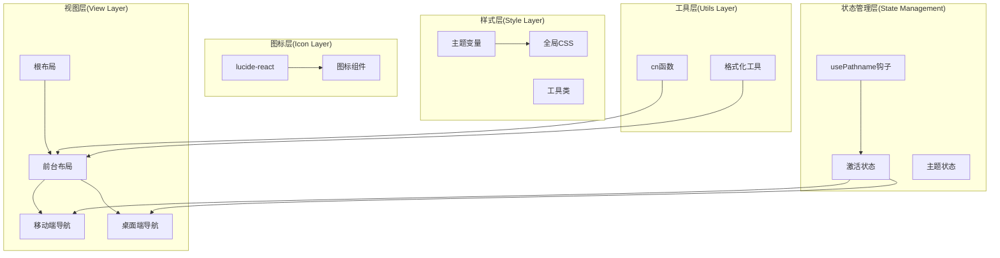
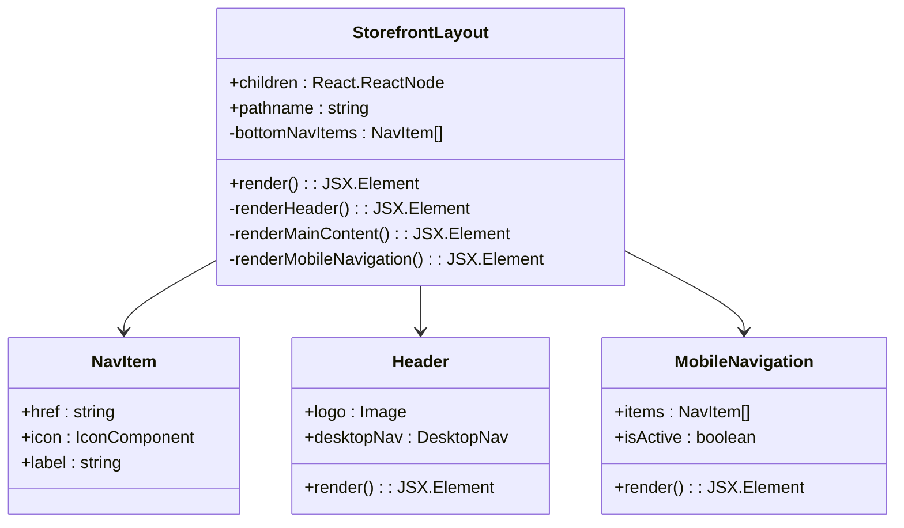
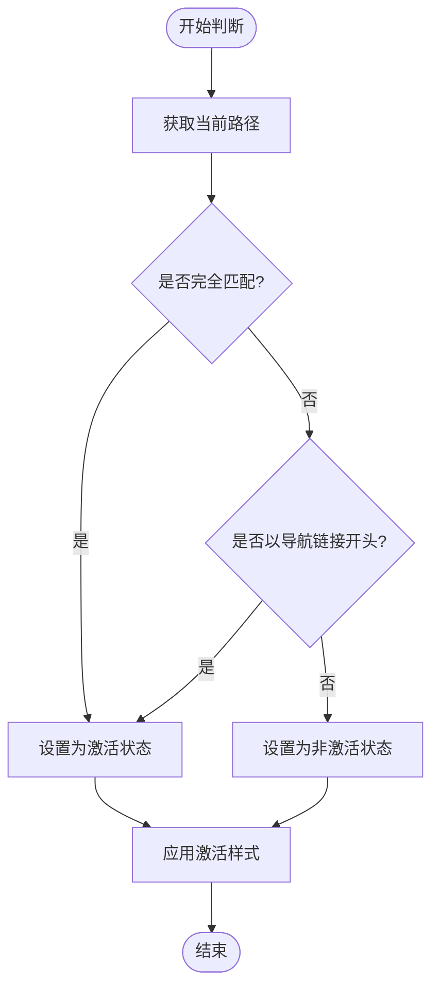
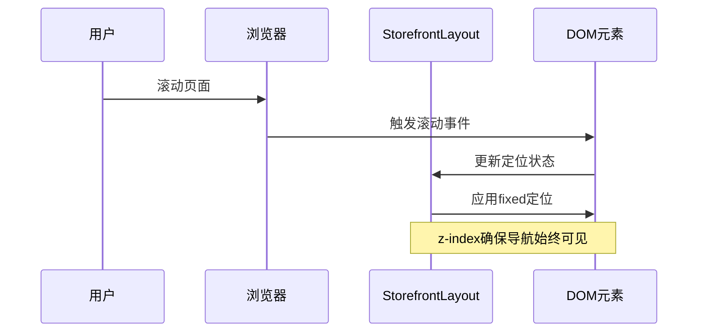
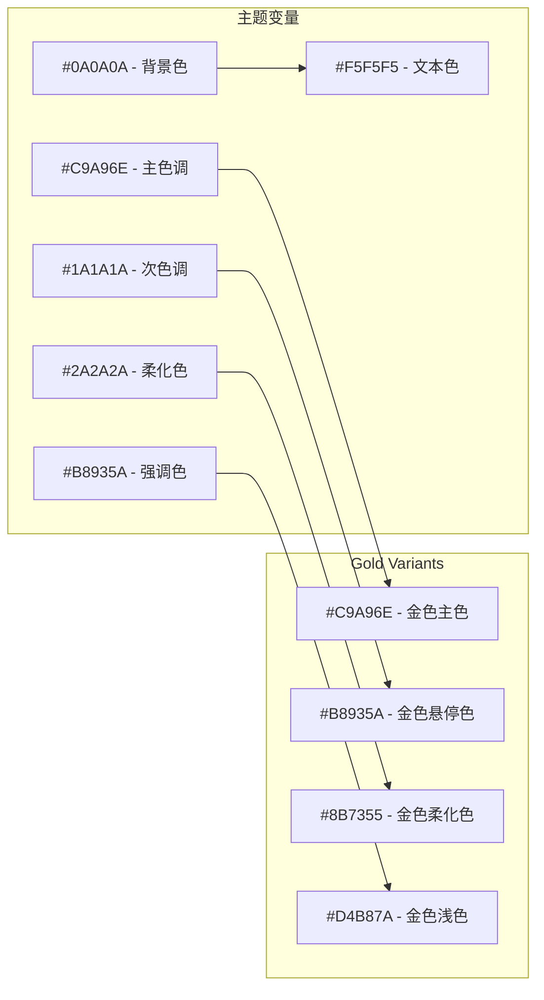
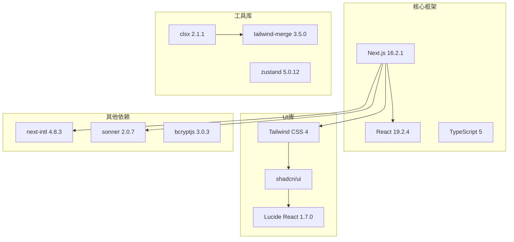
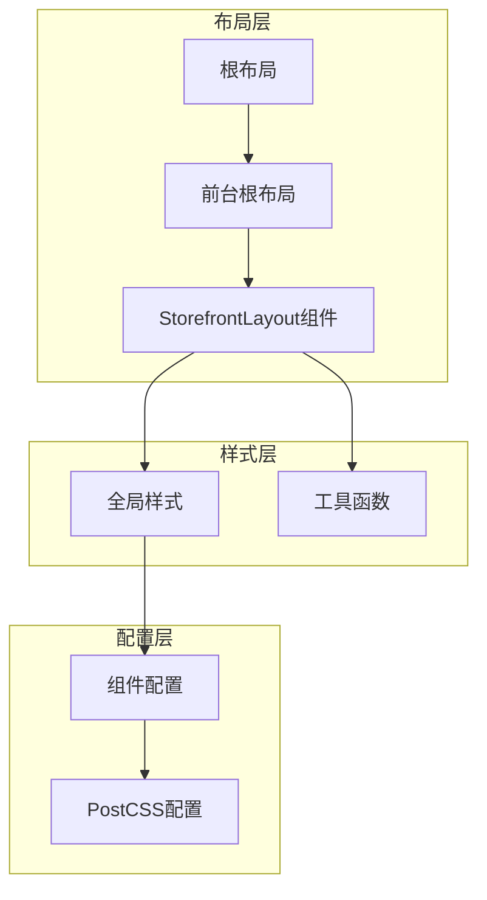

# 前台布局架构

<cite>
**本文档引用的文件**
- [storefront-layout.tsx](file://src/components/storefront/storefront-layout.tsx)
- [layout.tsx](file://src/app/[locale]/storefront/layout.tsx)
- [layout.tsx](file://src/app/layout.tsx)
- [globals.css](file://src/app/globals.css)
- [utils.ts](file://src/lib/utils.ts)
- [constants.ts](file://src/lib/constants.ts)
- [page.tsx](file://src/app/[locale]/storefront/page.tsx)
- [admin-layout.tsx](file://src/components/admin/admin-layout.tsx)
- [components.json](file://components.json)
- [package.json](file://package.json)
- [postcss.config.mjs](file://postcss.config.mjs)
</cite>

## 目录
1. [简介](#简介)
2. [项目结构](#项目结构)
3. [核心组件](#核心组件)
4. [架构概览](#架构概览)
5. [详细组件分析](#详细组件分析)
6. [依赖关系分析](#依赖关系分析)
7. [性能考虑](#性能考虑)
8. [故障排除指南](#故障排除指南)
9. [结论](#结论)

## 简介

Celestia前台布局架构采用现代化的Next.js应用结构，专注于珠宝奢侈品品牌的高端视觉体验。该架构通过StorefrontLayout组件实现了响应式布局系统，结合lucide-react图标库和自定义CSS主题系统，为用户提供优雅的移动端和桌面端导航体验。

本架构的核心设计理念是：
- **品牌一致性**：统一的黑金主题色彩系统(#0A0A0A、#2A2A2A、#C9A96E)
- **响应式设计**：针对不同设备尺寸的优化布局
- **用户体验优先**：直观的导航和状态反馈
- **可扩展性**：模块化的组件设计便于功能扩展

## 项目结构

项目采用基于功能的组织方式，前台布局相关的核心文件分布如下：

```mermaid
graph TB
subgraph "应用层"
RootLayout[根布局<br/>src/app/layout.tsx]
StorefrontLayout[前台布局<br/>src/app/[locale]/storefront/layout.tsx]
HomePage[首页页面<br/>src/app/[locale]/storefront/page.tsx]
end
subgraph "组件层"
StorefrontComp[StorefrontLayout组件<br/>src/components/storefront/storefront-layout.tsx]
AdminLayout[管理后台布局<br/>src/components/admin/admin-layout.tsx]
end
subgraph "样式层"
GlobalCSS[全局样式<br/>src/app/globals.css]
Utils[工具函数<br/>src/lib/utils.ts]
end
subgraph "配置层"
ComponentsJSON[组件配置<br/>components.json]
PackageJSON[依赖配置<br/>package.json]
PostCSS[PostCSS配置<br/>postcss.config.mjs]
end
RootLayout --> StorefrontLayout
StorefrontLayout --> StorefrontComp
StorefrontLayout --> HomePage
StorefrontComp --> GlobalCSS
StorefrontComp --> Utils
GlobalCSS --> ComponentsJSON
ComponentsJSON --> PackageJSON
```

**图表来源**
- [layout.tsx:17-42](file://src/app/layout.tsx#L17-L42)
- [layout.tsx:1-9](file://src/app/[locale]/storefront/layout.tsx#L1-L9)
- [storefront-layout.tsx:1-99](file://src/components/storefront/storefront-layout.tsx#L1-L99)

**章节来源**
- [layout.tsx:1-43](file://src/app/layout.tsx#L1-L43)
- [layout.tsx:1-10](file://src/app/[locale]/storefront/layout.tsx#L1-L10)
- [storefront-layout.tsx:1-99](file://src/components/storefront/storefront-layout.tsx#L1-L99)

## 核心组件

### StorefrontLayout组件

StorefrontLayout是前台布局的核心组件，负责管理整个前台应用的导航结构和视觉呈现。该组件实现了以下关键功能：

#### 导航系统设计

组件包含两种导航模式：
1. **桌面端顶部导航**：使用`hidden md:flex`类实现响应式显示
2. **移动端底部导航**：使用`md:hidden`类在小屏幕上显示

#### 状态管理机制

组件使用Next.js的`usePathname`钩子进行路由状态管理：
- 动态计算当前路径
- 实现导航项激活状态判断
- 支持精确匹配和前缀匹配

#### 图标库集成

通过lucide-react实现图标系统：
- 使用Home、Grid3X3、ShoppingCart、ClipboardList、User等图标
- 统一的图标尺寸和样式规范
- 与主题色彩系统的无缝集成

**章节来源**
- [storefront-layout.tsx:9-19](file://src/components/storefront/storefront-layout.tsx#L9-L19)
- [storefront-layout.tsx:21-98](file://src/components/storefront/storefront-layout.tsx#L21-L98)

## 架构概览

整体架构采用分层设计，确保各组件职责清晰且相互独立：



**图表来源**
- [storefront-layout.tsx:21-98](file://src/components/storefront/storefront-layout.tsx#L21-L98)
- [globals.css:51-91](file://src/app/globals.css#L51-L91)
- [utils.ts:4-6](file://src/lib/utils.ts#L4-L6)

## 详细组件分析

### StorefrontLayout组件深度解析

#### 结构设计

组件采用Flexbox布局，实现垂直方向的内容流：



**图表来源**
- [storefront-layout.tsx:9-19](file://src/components/storefront/storefront-layout.tsx#L9-L19)
- [storefront-layout.tsx:21-98](file://src/components/storefront/storefront-layout.tsx#L21-L98)

#### 响应式布局实现

组件通过Tailwind CSS的断点系统实现响应式设计：

| 断点 | 屏幕宽度 | 显示内容 |
|------|----------|----------|
| 默认 | 所有屏幕 | 移动端底部导航 |
| md及以上 | ≥768px | 桌面端顶部导航 + 移动端导航隐藏 |
| lg及以上 | ≥1024px | 桌面端导航增强 |

#### 导航激活状态判断逻辑

激活状态通过以下规则确定：



**图表来源**
- [storefront-layout.tsx:79-87](file://src/components/storefront/storefront-layout.tsx#L79-L87)

#### 固定定位导航实现

移动端底部导航使用固定定位实现：



**图表来源**
- [storefront-layout.tsx:76-95](file://src/components/storefront/storefront-layout.tsx#L76-L95)

**章节来源**
- [storefront-layout.tsx:21-98](file://src/components/storefront/storefront-layout.tsx#L21-L98)

### 主题系统与颜色管理

#### CSS自定义属性体系

项目采用CSS自定义属性实现主题系统，支持深色模式切换：



**图表来源**
- [globals.css:51-91](file://src/app/globals.css#L51-L91)

#### Tailwind CSS集成

通过`@theme inline`指令将CSS变量转换为Tailwind变量：

| CSS变量 | Tailwind变量 | 用途 |
|---------|--------------|------|
| `--background` | `bg-background` | 页面背景色 |
| `--primary` | `text-primary` | 主要文本和强调色 |
| `--muted` | `text-muted` | 次要文本色 |
| `--border` | `border-border` | 边框颜色 |
| `--input` | `bg-input` | 输入框背景色 |

**章节来源**
- [globals.css:7-49](file://src/app/globals.css#L7-L49)
- [globals.css:51-125](file://src/app/globals.css#L51-L125)

### 图标库集成(lucide-react)

#### 图标选择策略

根据功能需求选择合适的图标：

| 功能区域 | 图标 | 语义含义 |
|----------|------|----------|
| 首页 | Home | 主要入口 |
| 分类 | Grid3X3 | 内容分类 |
| 购物车 | ShoppingCart | 购买功能 |
| 订单 | ClipboardList | 订单管理 |
| 我的 | User | 用户中心 |

#### 图标样式规范

所有图标遵循统一的样式规范：
- 尺寸：`w-5 h-5`
- 颜色：激活状态使用`#C9A96E`，非激活状态使用`#A0A0A0`
- 布局：垂直居中，图标在上，文字在下

**章节来源**
- [storefront-layout.tsx:6-6](file://src/components/storefront/storefront-layout.tsx#L6-L6)
- [storefront-layout.tsx:89-90](file://src/components/storefront/storefront-layout.tsx#L89-L90)

## 依赖关系分析

### 外部依赖关系

项目依赖的关键外部库及其作用：



**图表来源**
- [package.json:11-38](file://package.json#L11-L38)
- [components.json:1-26](file://components.json#L1-L26)

### 内部依赖关系

组件间的依赖关系体现了清晰的分层架构：



**图表来源**
- [layout.tsx:17-42](file://src/app/layout.tsx#L17-L42)
- [layout.tsx:3-8](file://src/app/[locale]/storefront/layout.tsx#L3-L8)
- [storefront-layout.tsx:1-7](file://src/components/storefront/storefront-layout.tsx#L1-L7)

**章节来源**
- [package.json:1-52](file://package.json#L1-L52)
- [components.json:1-26](file://components.json#L1-L26)

## 性能考虑

### 渲染优化策略

1. **条件渲染**：使用`md:hidden`和`hidden md:flex`实现按需渲染
2. **状态最小化**：仅在需要时更新激活状态
3. **样式缓存**：利用CSS变量减少重复计算

### 加载性能

- **懒加载**：图标组件按需加载
- **CSS优化**：通过PostCSS处理减少CSS体积
- **字体优化**：使用`display: swap`避免阻塞渲染

### 移动端性能

- **固定定位**：使用`position: fixed`减少重排
- **z-index管理**：避免层级冲突导致的重绘
- **触摸友好**：导航项高度≥44px满足触摸目标要求

## 故障排除指南

### 常见问题及解决方案

#### 导航激活状态不正确

**问题现象**：导航项无法正确显示激活状态

**可能原因**：
1. 路径匹配规则错误
2. 子路径处理不当
3. 路由变化监听失效

**解决方案**：
```typescript
// 确保正确的路径匹配逻辑
const isActive = pathname === item.href || pathname.startsWith(`${item.href}/`);
```

#### 图标显示异常

**问题现象**：图标不显示或样式错误

**可能原因**：
1. lucide-react版本不兼容
2. 图标导入路径错误
3. 样式覆盖冲突

**解决方案**：
```typescript
// 确保正确的图标导入和使用
import { Home, Grid3X3, ShoppingCart, ClipboardList, User } from "lucide-react";
```

#### 主题颜色不一致

**问题现象**：页面颜色与主题不匹配

**可能原因**：
1. CSS变量未正确应用
2. Tailwind配置错误
3. 深色模式切换问题

**解决方案**：
```css
/* 确保CSS变量正确映射到Tailwind变量 */
:root {
  --background: #0A0A0A;
  --primary: #C9A96E;
  --muted: #2A2A2A;
}

@theme inline {
  --color-background: var(--background);
  --color-primary: var(--primary);
  --color-muted: var(--muted);
}
```

**章节来源**
- [storefront-layout.tsx:79-87](file://src/components/storefront/storefront-layout.tsx#L79-L87)
- [globals.css:51-91](file://src/app/globals.css#L51-L91)

## 结论

Celestia前台布局架构展现了现代前端开发的最佳实践，通过精心设计的组件结构、响应式布局系统和统一的主题色彩体系，为用户提供了优质的浏览体验。

### 架构优势

1. **模块化设计**：清晰的组件分离便于维护和扩展
2. **响应式优先**：移动端优先的设计理念适应多设备访问
3. **品牌一致性**：统一的视觉语言强化品牌形象
4. **性能优化**：合理的渲染策略确保流畅的用户体验

### 可扩展性建议

1. **路由系统扩展**：可以添加动态路由支持更多页面类型
2. **主题系统增强**：支持用户自定义主题切换
3. **国际化支持**：完善多语言环境下的布局适配
4. **无障碍访问**：增加ARIA标签和键盘导航支持

该架构为后续的功能扩展奠定了坚实的基础，能够有效支撑业务的发展需求。