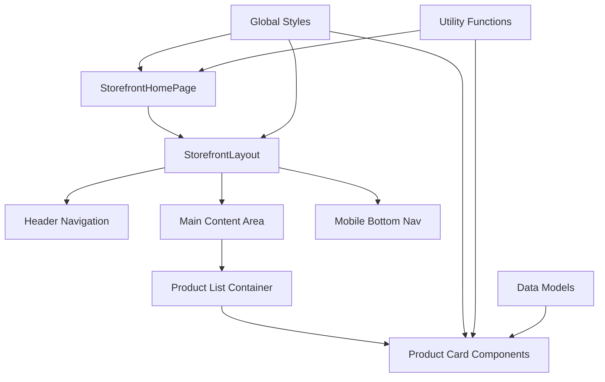
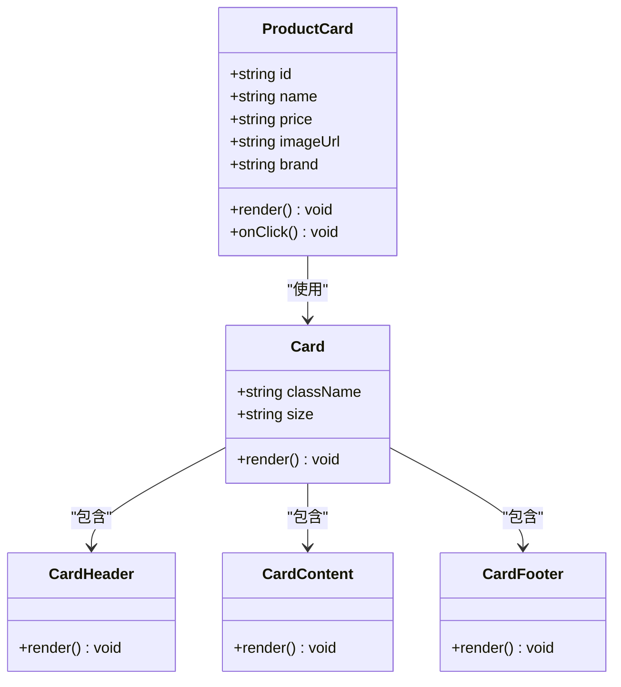
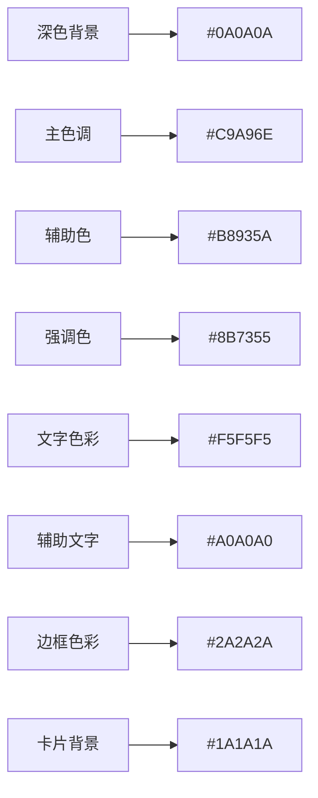
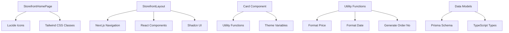

# 商品列表页面

<cite>
**本文档引用的文件**
- [src/app/[locale]/storefront/page.tsx](file://src/app/[locale]/storefront/page.tsx)
- [src/components/storefront/storefront-layout.tsx](file://src/components/storefront/storefront-layout.tsx)
- [src/app/[locale]/storefront/layout.tsx](file://src/app/[locale]/storefront/layout.tsx)
- [src/app/globals.css](file://src/app/globals.css)
- [src/components/ui/card.tsx](file://src/components/ui/card.tsx)
- [src/lib/utils.ts](file://src/lib/utils.ts)
- [src/lib/constants.ts](file://src/lib/constants.ts)
- [src/lib/validations/product.ts](file://src/lib/validations/product.ts)
- [src/types/index.ts](file://src/types/index.ts)
- [prisma/schema.prisma](file://prisma/schema.prisma)
- [src/app/layout.tsx](file://src/app/layout.tsx)
</cite>

## 目录
1. [简介](#简介)
2. [项目结构](#项目结构)
3. [核心组件](#核心组件)
4. [架构概览](#架构概览)
5. [详细组件分析](#详细组件分析)
6. [依赖关系分析](#依赖关系分析)
7. [性能考虑](#性能考虑)
8. [故障排除指南](#故障排除指南)
9. [结论](#结论)

## 简介

Celestia珠宝商店的商品列表页面是一个基于Next.js构建的现代化电商界面，采用深色主题配金色装饰的设计风格。该页面专注于展示精美的珠宝产品，通过优雅的视觉设计和响应式布局为用户提供优质的购物体验。

本项目采用了先进的技术栈，包括Next.js 16、Tailwind CSS、Shadcn UI组件库以及Prisma ORM，确保了良好的开发体验和性能表现。设计团队特别选择了#C9A96E金色作为主色调，营造出奢华而精致的品牌形象。

## 项目结构

项目采用模块化的文件组织结构，主要分为以下几个关键部分：

```mermaid
graph TB
subgraph "应用层"
A[src/app/[locale]/storefront/] --> A1[page.tsx]
A --> A2[layout.tsx]
B[src/app/[locale]/storefront/(auth)/] --> B1[login/page.tsx]
B --> B2[register/page.tsx]
end
subgraph "组件层"
C[src/components/storefront/] --> C1[storefront-layout.tsx]
D[src/components/ui/] --> D1[card.tsx]
D --> D2[button.tsx]
end
subgraph "工具层"
E[src/lib/] --> E1[utils.ts]
E --> E2[constants.ts]
E --> E3[validations/product.ts]
end
subgraph "数据层"
F[prisma/schema.prisma] --> F1[Product模型]
F --> F2[ProductSku模型]
F --> F3[ProductImage模型]
end
A1 --> C1
C1 --> D1
E1 --> F
```

**图表来源**
- [src/app/[locale]/storefront/page.tsx:1-26](file://src/app/[locale]/storefront/page.tsx#L1-L26)
- [src/components/storefront/storefront-layout.tsx:1-99](file://src/components/storefront/storefront-layout.tsx#L1-L99)
- [src/components/ui/card.tsx:1-104](file://src/components/ui/card.tsx#L1-L104)

**章节来源**
- [src/app/[locale]/storefront/page.tsx:1-26](file://src/app/[locale]/storefront/page.tsx#L1-L26)
- [src/components/storefront/storefront-layout.tsx:1-99](file://src/components/storefront/storefront-layout.tsx#L1-L99)
- [src/app/[locale]/storefront/layout.tsx:1-10](file://src/app/[locale]/storefront/layout.tsx#L1-L10)

## 核心组件

### StorefrontHomePage 组件

StorefrontHomePage是商品列表页面的核心组件，负责展示欢迎页面和品牌介绍。该组件采用了居中布局设计，通过精心设计的间距和字体层次来传达品牌的奢华感。

组件的主要特点包括：
- 居中对齐的布局设计
- 金色主题的视觉效果
- 响应式字体大小调整
- 品牌标识的突出展示

**章节来源**
- [src/app/[locale]/storefront/page.tsx:3-25](file://src/app/[locale]/storefront/page.tsx#L3-L25)

### StorefrontLayout 布局组件

StorefrontLayout提供了完整的页面布局框架，包含头部导航、主要内容区域和移动端底部导航。该组件实现了响应式设计，能够在不同设备上提供优化的用户体验。

布局组件的关键功能：
- 固定顶部导航栏
- 移动端底部导航
- 响应式断点管理
- 活动状态指示器

**章节来源**
- [src/components/storefront/storefront-layout.tsx:21-98](file://src/components/storefront/storefront-layout.tsx#L21-L98)

## 架构概览

整个商品列表页面采用分层架构设计，确保了代码的可维护性和扩展性：



**图表来源**
- [src/app/[locale]/storefront/page.tsx:4-24](file://src/app/[locale]/storefront/page.tsx#L4-L24)
- [src/components/storefront/storefront-layout.tsx:27-95](file://src/components/storefront/storefront-layout.tsx#L27-L95)

## 详细组件分析

### 商品卡片组件分析

虽然当前代码库中没有直接的商品卡片实现，但基于项目结构和设计规范，可以推断出商品卡片组件的设计模式：



**图表来源**
- [src/components/ui/card.tsx:5-103](file://src/components/ui/card.tsx#L5-L103)

#### 商品卡片布局结构

基于现有组件和设计规范，商品卡片应该包含以下元素：

1. **图片展示区域**
   - 主图展示
   - 缩略图导航
   - 图片加载状态处理

2. **标题显示区域**
   - 产品名称展示
   - 多语言支持
   - 标题层级控制

3. **价格格式化显示**
   - 货币符号显示
   - 数字格式化
   - 多币种支持

4. **品牌标识元素**
   - 品牌徽章
   - 品牌色彩应用
   - 品牌故事展示

**章节来源**
- [src/components/ui/card.tsx:1-104](file://src/components/ui/card.tsx#L1-L104)
- [src/lib/utils.ts:8-13](file://src/lib/utils.ts#L8-L13)

### 响应式设计实现

项目采用了移动优先的设计策略，通过断点系统实现跨设备适配：

```mermaid
flowchart TD
A[基础布局] --> B{屏幕宽度检测}
B --> |移动端 (< 768px)| C[移动布局]
B --> |平板端 (768px-1024px)| D[平板布局]
B --> |桌面端 (> 1024px)| E[桌面布局]
C --> F[底部导航栏]
C --> G[紧凑间距]
C --> H[简化菜单]
D --> I[侧边栏导航]
D --> J[中等间距]
D --> K[完整菜单]
E --> L[固定侧边栏]
E --> M[宽松间距]
E --> N[完整功能]
```

**图表来源**
- [src/components/storefront/storefront-layout.tsx:75-95](file://src/components/storefront/storefront-layout.tsx#L75-L95)

#### 断点策略

- **移动端断点**: `< 768px` - 使用底部导航栏替代侧边栏
- **平板断点**: `768px-1024px` - 平衡功能完整性和空间利用
- **桌面端断点**: `> 1024px` - 提供完整的功能面板

**章节来源**
- [src/components/storefront/storefront-layout.tsx:41-66](file://src/components/storefront/storefront-layout.tsx#L41-L66)

### 视觉效果实现

项目采用了深色主题配合金色装饰的设计方案，营造出奢华的品牌形象：



**图表来源**
- [src/app/globals.css:51-91](file://src/app/globals.css#L51-L91)

#### 颜色方案详解

- **主色调**: `#C9A96E` - 金色，用于品牌标识和重要元素
- **深色背景**: `#0A0A0A` - 黑色，提供对比度和高级感
- **浅色文字**: `#F5F5F5` - 用于主要文本内容
- **中性文字**: `#A0A0A0` - 用于辅助信息

**章节来源**
- [src/app/globals.css:51-91](file://src/app/globals.css#L51-L91)

### 字体排版和间距设计

项目采用了统一的字体系统和间距规范：

- **字体系统**: Inter Sans-serif 字体，提供现代感和可读性
- **字号层次**: 从 `text-sm` 到 `text-4xl` 的完整体系
- **行高控制**: `leading-snug` 和 `leading-normal` 的组合使用
- **间距规范**: `space-y-6` 和 `gap-4` 等语义化间距类

**章节来源**
- [src/app/globals.css:10-12](file://src/app/globals.css#L10-L12)
- [src/app/[locale]/storefront/page.tsx:10-20](file://src/app/[locale]/storefront/page.tsx#L10-L20)

## 依赖关系分析

项目中的组件依赖关系体现了清晰的分层架构：



**图表来源**
- [src/app/[locale]/storefront/page.tsx:1](file://src/app/[locale]/storefront/page.tsx#L1)
- [src/components/storefront/storefront-layout.tsx:3-7](file://src/components/storefront/storefront-layout.tsx#L3-L7)
- [src/components/ui/card.tsx:1-3](file://src/components/ui/card.tsx#L1-L3)

### 外部依赖

项目使用了多个关键的外部库：

- **Next.js 16**: 核心框架，提供SSR和路由功能
- **Tailwind CSS v4**: 实用优先的CSS框架
- **Shadcn UI**: 高质量的React组件库
- **Lucide React**: 精美的图标库
- **Prisma**: 类型安全的数据库ORM

**章节来源**
- [package.json:11-44](file://package.json#L11-L44)

## 性能考虑

### 代码分割和懒加载

项目采用了智能的代码分割策略：
- 页面级组件按需加载
- 图标组件使用Tree Shaking
- 样式按需编译

### 图片优化

- 使用Next.js Image组件进行优化
- 支持多种格式转换
- 自动响应式图片选择

### 缓存策略

- 浏览器缓存静态资源
- API响应缓存
- 数据预取优化

## 故障排除指南

### 常见问题及解决方案

1. **样式不生效**
   - 检查Tailwind配置是否正确
   - 确认CSS变量定义完整
   - 验证组件类名拼写

2. **响应式布局异常**
   - 检查断点设置
   - 验证媒体查询语法
   - 确认Flexbox属性使用

3. **图标显示问题**
   - 确认Lucide组件导入
   - 检查SVG渲染
   - 验证图标尺寸设置

**章节来源**
- [src/app/globals.css:127-137](file://src/app/globals.css#L127-L137)

### 开发调试技巧

- 使用浏览器开发者工具检查元素
- 利用React DevTools分析组件树
- 通过网络面板监控资源加载
- 使用Lighthouse进行性能分析

## 结论

Celestia商品列表页面展现了现代电商网站的最佳实践，通过精心设计的视觉系统和响应式布局，为用户提供了卓越的购物体验。项目采用的技术栈确保了良好的可维护性和扩展性，同时深色主题配金色的设计方案完美诠释了品牌的奢华定位。

未来的发展方向包括：
- 添加商品筛选和排序功能
- 实现商品详情页面
- 集成购物车和结账流程
- 优化SEO和性能指标

这个项目为类似的珠宝电商网站提供了一个优秀的参考模板，展示了如何在保持设计美感的同时确保功能的完整性和性能的优化。