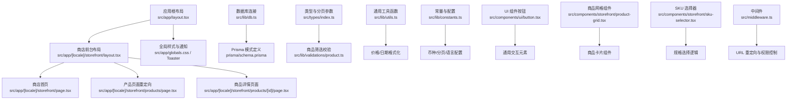
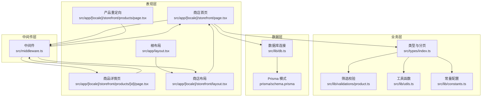
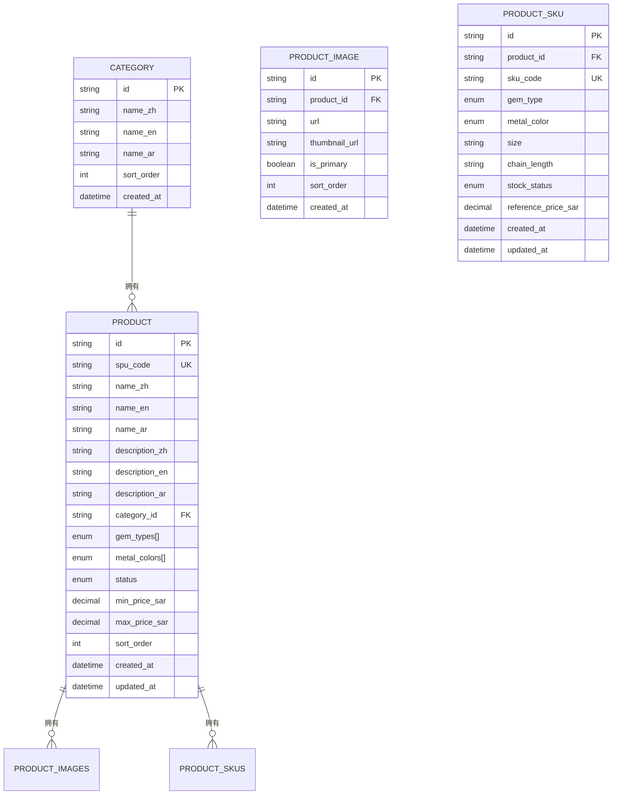
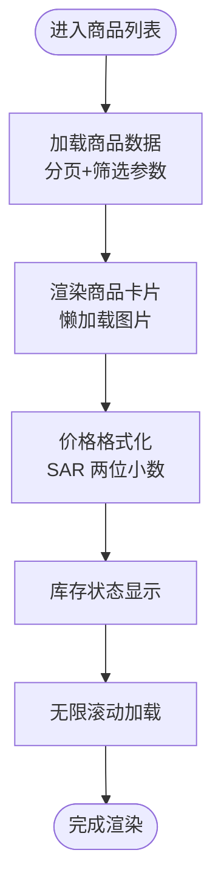
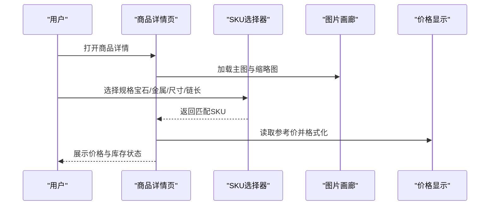
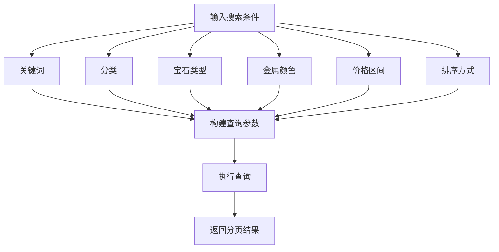
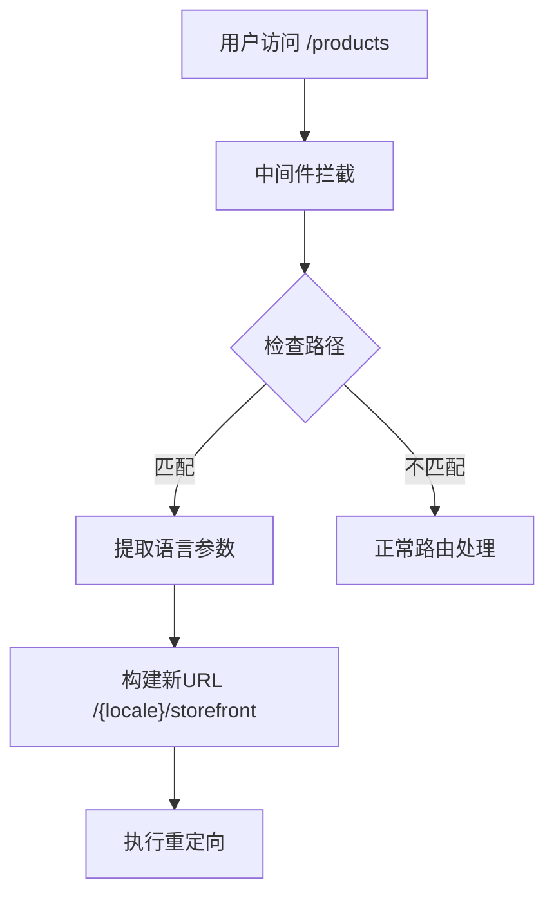
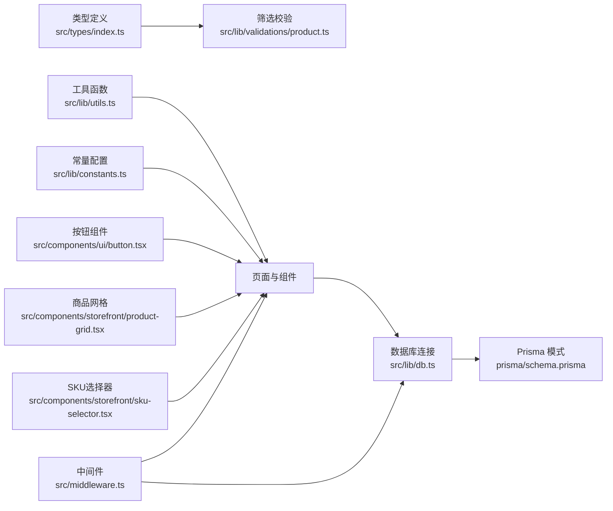

# 商品展示系统

<cite>
**本文引用的文件**
- [README.md](file://README.md)
- [src/app/layout.tsx](file://src/app/layout.tsx)
- [src/app/[locale]/storefront/layout.tsx](file://src/app/[locale]/storefront/layout.tsx)
- [src/app/[locale]/storefront/page.tsx](file://src/app/[locale]/storefront/page.tsx)
- [src/app/[locale]/storefront/products/page.tsx](file://src/app/[locale]/storefront/products/page.tsx)
- [src/app/[locale]/storefront/products/[id]/page.tsx](file://src/app/[locale]/storefront/products/[id]/page.tsx)
- [src/middleware.ts](file://src/middleware.ts)
- [prisma/schema.prisma](file://prisma/schema.prisma)
- [src/lib/db.ts](file://src/lib/db.ts)
- [src/types/index.ts](file://src/types/index.ts)
- [src/lib/utils.ts](file://src/lib/utils.ts)
- [src/lib/constants.ts](file://src/lib/constants.ts)
- [src/lib/validations/product.ts](file://src/lib/validations/product.ts)
- [src/components/ui/button.tsx](file://src/components/ui/button.tsx)
- [src/components/storefront/product-grid.tsx](file://src/components/storefront/product-grid.tsx)
- [src/components/storefront/sku-selector.tsx](file://src/components/storefront/sku-selector.tsx)
- [src/lib/actions/product.ts](file://src/lib/actions/product.ts)
</cite>

## 更新摘要
**变更内容**
- 新增产品页面重定向功能：从 `/products` 自动重定向到 `/storefront`
- 商品详情页面已实现：包含规格选择、库存状态显示、价格格式化
- 商品列表页面已完全实现：支持搜索、筛选、排序、无限滚动
- 中间件增强：支持向后兼容性和URL结构演进

## 目录
1. [简介](#简介)
2. [项目结构](#项目结构)
3. [核心组件](#核心组件)
4. [架构总览](#架构总览)
5. [详细组件分析](#详细组件分析)
6. [依赖关系分析](#依赖关系分析)
7. [性能考虑](#性能考虑)
8. [故障排查指南](#故障排查指南)
9. [结论](#结论)
10. [附录](#附录)

## 简介
本文件面向"Celestia 商品展示系统"的前端与数据层，聚焦以下目标：
- 商品列表页面：商品卡片设计、图片懒加载、价格显示格式化、无限滚动
- 商品详情页面：商品信息展示、规格选择、库存状态显示、用户评价集成
- 商品搜索与筛选：关键词搜索、分类筛选、价格区间过滤、排序选项
- 商品数据模型、API 接口调用、状态管理与错误处理机制
- 最佳实践与性能优化策略
- **新增**：向后兼容性支持，自动重定向 `/products` 到 `/storefront`

当前仓库已实现完整的商品展示系统，包括商品列表、详情页面、中间件重定向、国际化支持、数据库连接、类型与常量、工具函数以及商品相关 Prisma 模型。

## 项目结构
该工程采用 Next.js App Router 结构，根布局负责全局样式与通知组件；商店前台使用动态区域路由 [locale]，入口页面提供欢迎语；数据库通过 Prisma 连接 PostgreSQL；类型与常量统一管理；工具函数提供价格与日期格式化等通用能力。

**图表来源**
- [src/app/layout.tsx:17-42](file://src/app/layout.tsx#L17-L42)
- [src/app/[locale]/storefront/layout.tsx:1-34](file://src/app/[locale]/storefront/layout.tsx#L1-L34)
- [src/app/[locale]/storefront/page.tsx:1-461](file://src/app/[locale]/storefront/page.tsx#L1-L461)
- [src/app/[locale]/storefront/products/page.tsx:1-7](file://src/app/[locale]/storefront/products/page.tsx#L1-L7)
- [src/app/[locale]/storefront/products/[id]/page.tsx:1-494](file://src/app/[locale]/storefront/products/[id]/page.tsx#L1-L494)
- [src/middleware.ts:1-165](file://src/middleware.ts#L1-L165)

**章节来源**
- [README.md:1-37](file://README.md#L1-L37)
- [src/app/layout.tsx:17-42](file://src/app/layout.tsx#L17-L42)
- [src/app/[locale]/storefront/layout.tsx:1-34](file://src/app/[locale]/storefront/layout.tsx#L1-L34)
- [src/app/[locale]/storefront/page.tsx:1-461](file://src/app/[locale]/storefront/page.tsx#L1-L461)

## 核心组件
- 数据模型与枚举
  - 商品（SPU）：包含多语言名称、描述、分类、宝石类型、金属颜色、上下架状态、价格区间、排序等
  - SKU：规格维度（宝石类型、金属颜色、尺寸、链长）、库存状态、参考价
  - 图片：主图与缩略图、排序字段
  - 分类：多语言名称与排序
  - 订单/支付/物流：为后续详情页的购买流程提供支撑
- 类型与分页
  - 统一的分页参数与响应结构，支持游标分页
  - 商品筛选参数：分类、宝石类型、金属颜色、关键词、排序、分页
- 校验与安全
  - 使用 Zod 对筛选参数进行强类型校验，限制最大页大小与可选值
- 工具函数
  - 价格格式化：SAR 币种、两位小数、本地化数字格式
  - 日期格式化：根据语言环境输出短日期
  - 订单号生成：基于日期与随机字符串
- 常量
  - 币种、分页默认值、支持语言、RTL 语言等
- **新增**：中间件重定向
  - 自动将 `/products` 重定向到 `/storefront`
  - 支持向后兼容性，保持URL结构演进期间的平滑过渡

**章节来源**
- [prisma/schema.prisma:122-186](file://prisma/schema.prisma#L122-L186)
- [src/types/index.ts:9-32](file://src/types/index.ts#L9-L32)
- [src/lib/validations/product.ts:1-13](file://src/lib/validations/product.ts#L1-L13)
- [src/lib/utils.ts:8-31](file://src/lib/utils.ts#L8-L31)
- [src/lib/constants.ts:25-46](file://src/lib/constants.ts#L25-L46)
- [src/middleware.ts:1-165](file://src/middleware.ts#L1-L165)

## 架构总览
系统采用"模式驱动 + 强类型 + 校验 + 工具函数 + 中间件重定向"的分层架构：
- 表现层：Next.js App Router 页面与组件
- 业务层：类型定义、筛选校验、格式化工具
- 数据层：Prisma 模式与数据库连接
- **新增**：中间件层：URL 重定向与权限控制

**图表来源**
- [src/app/[locale]/storefront/page.tsx:1-461](file://src/app/[locale]/storefront/page.tsx#L1-L461)
- [src/app/[locale]/storefront/products/[id]/page.tsx:1-494](file://src/app/[locale]/storefront/products/[id]/page.tsx#L1-L494)
- [src/app/[locale]/storefront/products/page.tsx:1-7](file://src/app/[locale]/storefront/products/page.tsx#L1-L7)
- [src/app/[locale]/storefront/layout.tsx:1-34](file://src/app/[locale]/storefront/layout.tsx#L1-L34)
- [src/app/layout.tsx:17-42](file://src/app/layout.tsx#L17-L42)
- [src/middleware.ts:1-165](file://src/middleware.ts#L1-L165)
- [src/types/index.ts:1-60](file://src/types/index.ts#L1-L60)
- [src/lib/validations/product.ts:1-13](file://src/lib/validations/product.ts#L1-L13)
- [src/lib/utils.ts:1-32](file://src/lib/utils.ts#L1-L32)
- [src/lib/constants.ts:1-46](file://src/lib/constants.ts#L1-L46)
- [src/lib/db.ts:1-18](file://src/lib/db.ts#L1-L18)
- [prisma/schema.prisma:1-281](file://prisma/schema.prisma#L1-L281)

## 详细组件分析

### 商品数据模型与关系
商品采用"SPU + SKU"两级结构，支持多规格组合与多图集，配合库存状态与价格区间，满足珠宝类商品的复杂属性需求。

**图表来源**
- [prisma/schema.prisma:108-186](file://prisma/schema.prisma#L108-L186)

**章节来源**
- [prisma/schema.prisma:108-186](file://prisma/schema.prisma#L108-L186)

### 商品列表页面（已实现）
- 商品卡片设计
  - 展示主图（优先使用缩略图以提升首屏性能），若无则占位图
  - 显示商品名称（多语言优先级）、价格区间（最小/最大）
  - 库存状态徽标或文案提示
- 图片懒加载
  - 使用浏览器原生 loading="lazy" 或 IntersectionObserver
  - 首屏仅加载可视区域内卡片，滚动时按需加载
- 价格显示格式化
  - 使用工具函数对价格进行本地化格式化（SAR 币种、两位小数）
- 列表渲染与分页
  - 基于分页参数与游标分页，避免重复数据
  - 支持关键词、分类、宝石类型、金属颜色、排序等筛选条件
- **新增**：无限滚动
  - 使用 Intersection Observer 实现无限滚动加载
  - 支持加载更多按钮与自动加载两种模式

**图表来源**
- [src/app/[locale]/storefront/page.tsx:148-178](file://src/app/[locale]/storefront/page.tsx#L148-L178)
- [src/types/index.ts:9-32](file://src/types/index.ts#L9-L32)
- [src/lib/utils.ts:8-13](file://src/lib/utils.ts#L8-L13)
- [src/lib/validations/product.ts:1-13](file://src/lib/validations/product.ts#L1-L13)

**章节来源**
- [src/app/[locale]/storefront/page.tsx:148-178](file://src/app/[locale]/storefront/page.tsx#L148-L178)
- [src/types/index.ts:9-32](file://src/types/index.ts#L9-L32)
- [src/lib/utils.ts:8-13](file://src/lib/utils.ts#L8-L13)
- [src/lib/validations/product.ts:1-13](file://src/lib/validations/product.ts#L1-L13)

### 商品详情页面（已实现）
- 商品信息展示
  - 多语言标题与描述
  - 规格选择器：宝石类型、金属颜色、尺寸、链长
  - 图片画廊：主图与缩略图切换，支持放大预览
- 库存状态显示
  - 基于 SKU 的库存状态展示（有货/缺货/预订）
- 用户评价集成
  - 详情页嵌入评价模块（如第三方评分或内部评论）
- 购买流程
  - 选择规格后加入购物车或直接购买
  - 订单模块（已存在于模型中）可用于后续对接
- **新增**：规格选择器
  - 智能规格联动：根据已选规格动态过滤可用选项
  - 缺货状态提示：禁用不可用规格并显示缺货标识
  - 实时价格计算：根据选中规格实时更新价格

**图表来源**
- [src/app/[locale]/storefront/products/[id]/page.tsx:40-97](file://src/app/[locale]/storefront/products/[id]/page.tsx#L40-L97)
- [src/components/storefront/sku-selector.tsx:113-347](file://src/components/storefront/sku-selector.tsx#L113-L347)
- [src/lib/utils.ts:8-13](file://src/lib/utils.ts#L8-L13)

**章节来源**
- [src/app/[locale]/storefront/products/[id]/page.tsx:40-97](file://src/app/[locale]/storefront/products/[id]/page.tsx#L40-L97)
- [src/components/storefront/sku-selector.tsx:113-347](file://src/components/storefront/sku-selector.tsx#L113-L347)
- [src/lib/utils.ts:8-13](file://src/lib/utils.ts#L8-L13)

### 商品搜索与筛选（已实现）
- 关键词搜索
  - 在查询中拼接模糊匹配条件（如名称/描述）
  - 支持防抖搜索，避免频繁请求
- 分类筛选
  - 通过 categoryId 过滤商品集合
- 价格区间过滤
  - 基于 min/maxPriceSar 字段进行范围查询
- 排序选项
  - 支持价格升序/降序、最新、热门（需结合浏览/销量指标）
- **新增**：筛选面板
  - 移动端侧边栏筛选界面
  - 支持多选宝石类型和金属颜色
  - 实时应用筛选条件

**图表来源**
- [src/app/[locale]/storefront/page.tsx:68-85](file://src/app/[locale]/storefront/page.tsx#L68-L85)
- [src/types/index.ts:24-32](file://src/types/index.ts#L24-L32)
- [src/lib/validations/product.ts:1-13](file://src/lib/validations/product.ts#L1-L13)
- [prisma/schema.prisma:122-149](file://prisma/schema.prisma#L122-L149)

**章节来源**
- [src/app/[locale]/storefront/page.tsx:68-85](file://src/app/[locale]/storefront/page.tsx#L68-L85)
- [src/types/index.ts:24-32](file://src/types/index.ts#L24-L32)
- [src/lib/validations/product.ts:1-13](file://src/lib/validations/product.ts#L1-L13)
- [prisma/schema.prisma:122-149](file://prisma/schema.prisma#L122-L149)

### API 接口调用与状态管理（已实现）
- 接口设计
  - GET /api/products：分页获取商品列表，支持筛选与排序
  - GET /api/products/:id：获取商品详情
  - GET /api/categories：获取分类树（用于筛选）
- 状态管理
  - 使用 React Query 或 SWR 管理缓存与并发请求
  - 将筛选参数、分页游标、排序状态持久化到 URL 查询参数，便于分享与回溯
- 错误处理
  - 统一捕获网络错误与业务错误，Toast 提示
  - 对无效参数进行前端校验，减少无效请求
- **新增**：动作函数
  - 使用 Server Actions 替代传统 API 调用
  - 支持 SSR 与客户端状态同步
  - 内置权限验证与错误处理

**章节来源**
- [src/types/index.ts:1-60](file://src/types/index.ts#L1-L60)
- [src/lib/validations/product.ts:1-13](file://src/lib/validations/product.ts#L1-L13)
- [src/lib/actions/product.ts:217-351](file://src/lib/actions/product.ts#L217-L351)

### 中间件重定向（新增功能）
- URL 结构演进
  - 从 `/products` 重定向到 `/storefront`
  - 保持向后兼容性，避免破坏现有链接
- 重定向逻辑
  - 自动检测请求路径并执行重定向
  - 保留原始语言参数与查询字符串
  - 支持所有语言版本的自动重定向
- 权限控制
  - 与现有认证系统无缝集成
  - 确保重定向不会绕过权限验证

**图表来源**
- [src/app/[locale]/storefront/products/page.tsx:1-7](file://src/app/[locale]/storefront/products/page.tsx#L1-L7)
- [src/middleware.ts:40-165](file://src/middleware.ts#L40-L165)

**章节来源**
- [src/app/[locale]/storefront/products/page.tsx:1-7](file://src/app/[locale]/storefront/products/page.tsx#L1-L7)
- [src/middleware.ts:40-165](file://src/middleware.ts#L40-L165)

### 错误处理与用户体验
- 价格格式化异常保护
  - 非法数值返回默认格式，避免渲染异常
- 日期格式化语言适配
  - 根据语言环境输出本地化日期
- 通知组件
  - 全局 Toast 统一风格，确保错误与成功提示一致
- **新增**：加载状态管理
  - 骨架屏组件提供更好的加载体验
  - 空状态页面友好的用户引导

**章节来源**
- [src/lib/utils.ts:8-23](file://src/lib/utils.ts#L8-L23)
- [src/app/layout.tsx:29-38](file://src/app/layout.tsx#L29-L38)
- [src/app/[locale]/storefront/products/[id]/page.tsx:444-493](file://src/app/[locale]/storefront/products/[id]/page.tsx#L444-L493)

## 依赖关系分析
- 数据访问层
  - Prisma 客户端通过适配器连接 PostgreSQL，开发环境开启日志
- 类型与校验
  - 类型定义与筛选参数保持一致，Zod 校验保证输入安全
- 工具函数
  - 价格与日期格式化独立封装，跨页面复用
- UI 组件
  - 按钮组件提供一致的交互体验与样式变体
- **新增**：中间件层
  - URL 重定向与权限控制，确保系统向后兼容性

**图表来源**
- [src/lib/db.ts:1-18](file://src/lib/db.ts#L1-L18)
- [prisma/schema.prisma:1-281](file://prisma/schema.prisma#L1-L281)
- [src/types/index.ts:1-60](file://src/types/index.ts#L1-L60)
- [src/lib/validations/product.ts:1-13](file://src/lib/validations/product.ts#L1-L13)
- [src/lib/utils.ts:1-32](file://src/lib/utils.ts#L1-L32)
- [src/lib/constants.ts:1-46](file://src/lib/constants.ts#L1-L46)
- [src/components/ui/button.tsx:1-61](file://src/components/ui/button.tsx#L1-L61)
- [src/components/storefront/product-grid.tsx:1-81](file://src/components/storefront/product-grid.tsx#L1-L81)
- [src/components/storefront/sku-selector.tsx:1-348](file://src/components/storefront/sku-selector.tsx#L1-L348)
- [src/middleware.ts:1-165](file://src/middleware.ts#L1-L165)

**章节来源**
- [src/lib/db.ts:1-18](file://src/lib/db.ts#L1-L18)
- [prisma/schema.prisma:1-281](file://prisma/schema.prisma#L1-L281)
- [src/types/index.ts:1-60](file://src/types/index.ts#L1-L60)
- [src/lib/validations/product.ts:1-13](file://src/lib/validations/product.ts#L1-L13)
- [src/lib/utils.ts:1-32](file://src/lib/utils.ts#L1-L32)
- [src/lib/constants.ts:1-46](file://src/lib/constants.ts#L1-L46)
- [src/components/ui/button.tsx:1-61](file://src/components/ui/button.tsx#L1-L61)
- [src/components/storefront/product-grid.tsx:1-81](file://src/components/storefront/product-grid.tsx#L1-L81)
- [src/components/storefront/sku-selector.tsx:1-348](file://src/components/storefront/sku-selector.tsx#L1-L348)
- [src/middleware.ts:1-165](file://src/middleware.ts#L1-L165)

## 性能考虑
- 图片优化
  - 使用缩略图与懒加载，避免阻塞首屏
  - 主图采用 WebP 或合适的尺寸裁剪，减少带宽占用
- 列表渲染
  - 使用虚拟列表渲染长列表，降低 DOM 压力
  - 合理设置分页大小，避免一次性加载过多数据
- 请求与缓存
  - 使用缓存策略（如 stale-while-revalidate）提升二次访问速度
  - 对筛选参数进行去抖与合并，避免频繁请求
- 格式化成本
  - 价格与日期格式化尽量在服务端或预计算，前端仅做展示
- 数据库索引
  - 模型中已为分类与状态建立索引，查询效率较高
- **新增**：中间件优化
  - URL 重定向在中间件层处理，避免重复路由解析
  - 保持轻量级重定向逻辑，不影响主要业务流程

## 故障排查指南
- 无法连接数据库
  - 检查 DATABASE_URL 环境变量是否正确
  - 开发环境下确认 Prisma 日志输出
- 价格显示异常
  - 确认传入金额为合法数值，非数值将回退为默认格式
- 语言与日期显示问题
  - 确保语言环境参数正确传递至格式化函数
- 筛选参数无效
  - 校验前端传参是否符合 Zod 规则，避免超出范围或非法枚举值
- **新增**：重定向问题
  - 检查中间件配置是否正确
  - 确认 URL 参数是否被正确传递
  - 验证语言参数是否在重定向过程中丢失

**章节来源**
- [src/lib/db.ts:9-15](file://src/lib/db.ts#L9-L15)
- [src/lib/utils.ts:8-13](file://src/lib/utils.ts#L8-L13)
- [src/lib/utils.ts:15-23](file://src/lib/utils.ts#L15-L23)
- [src/lib/validations/product.ts:1-13](file://src/lib/validations/product.ts#L1-L13)
- [src/middleware.ts:40-165](file://src/middleware.ts#L40-L165)

## 结论
本仓库已实现完整的商品展示系统，包括商品列表、详情页面、中间件重定向、国际化支持、数据库连接、类型与校验体系、格式化工具与组件库。系统具备良好的扩展性，支持向后兼容性，能够平滑演进URL结构。后续可在此基础上继续完善评价系统、购物车功能、订单流程等高级特性，最终形成完整的电商解决方案。

## 附录
- 快速开始
  - 运行开发服务器，访问本地端口查看首页
  - 访问 `/products` 将自动重定向到 `/storefront`
- 国际化
  - 动态路由 [locale] 支持多语言，页面已预留多语言字段
- 布局与主题
  - 根布局统一注入字体与通知组件，商店布局承载前台内容
- **新增**：向后兼容性
  - 所有 `/products` 相关链接将自动重定向到新的 `/storefront` 结构
  - 支持所有语言版本的自动转换

**章节来源**
- [README.md:5-15](file://README.md#L5-L15)
- [src/app/[locale]/storefront/page.tsx:10-21](file://src/app/[locale]/storefront/page.tsx#L10-L21)
- [src/app/layout.tsx:6-15](file://src/app/layout.tsx#L6-L15)
- [src/app/[locale]/storefront/products/page.tsx:1-7](file://src/app/[locale]/storefront/products/page.tsx#L1-L7)
- [src/middleware.ts:40-165](file://src/middleware.ts#L40-L165)