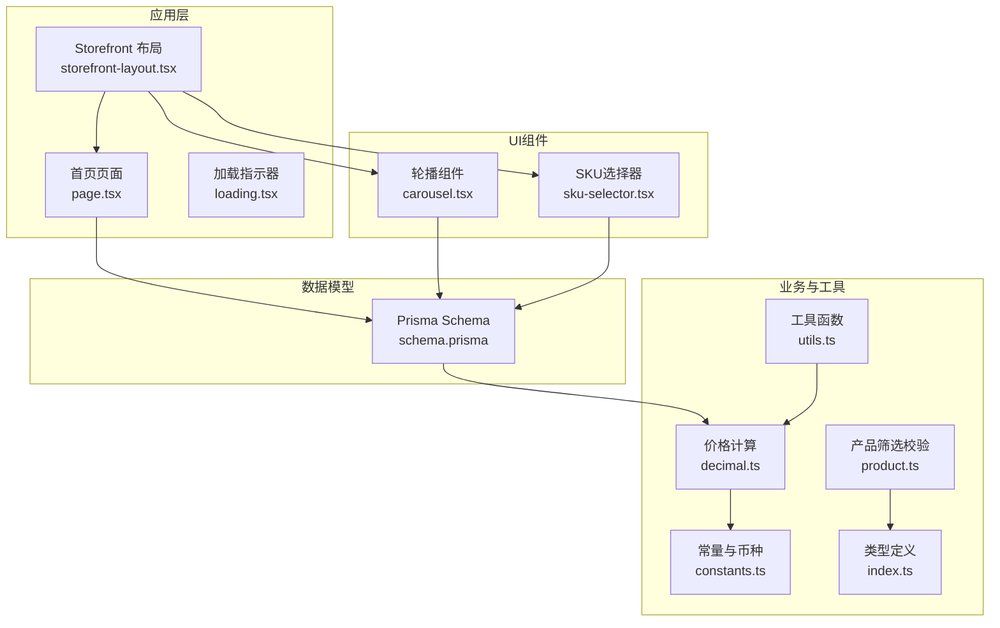
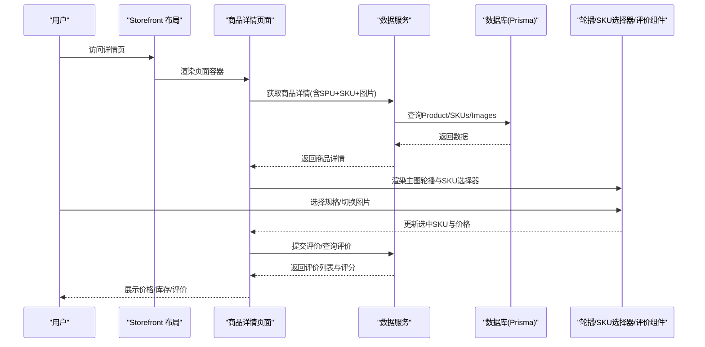
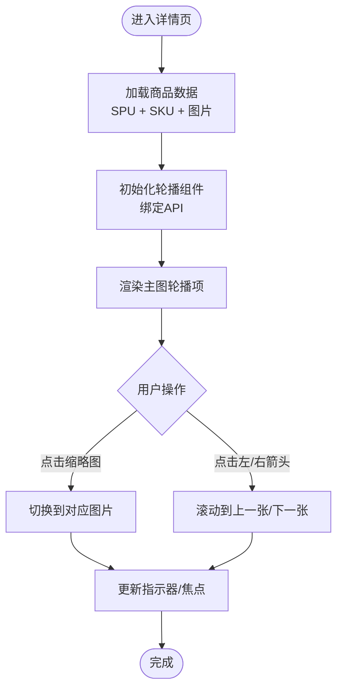
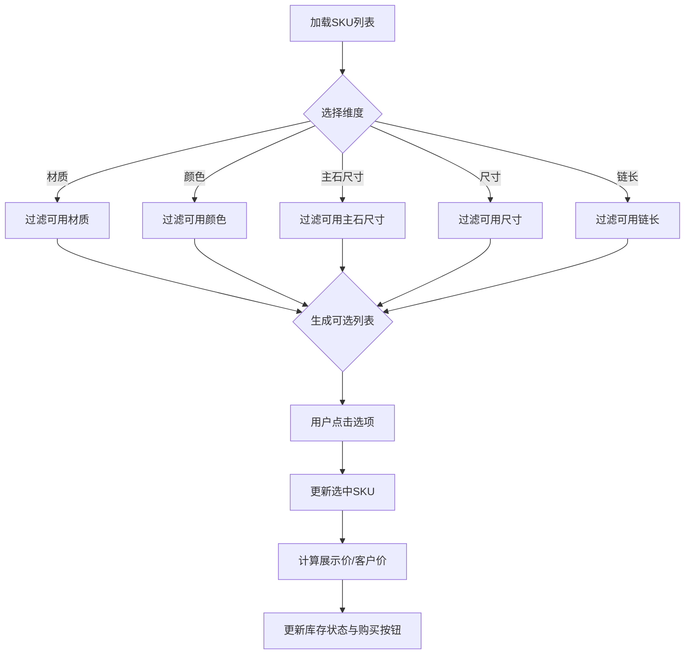
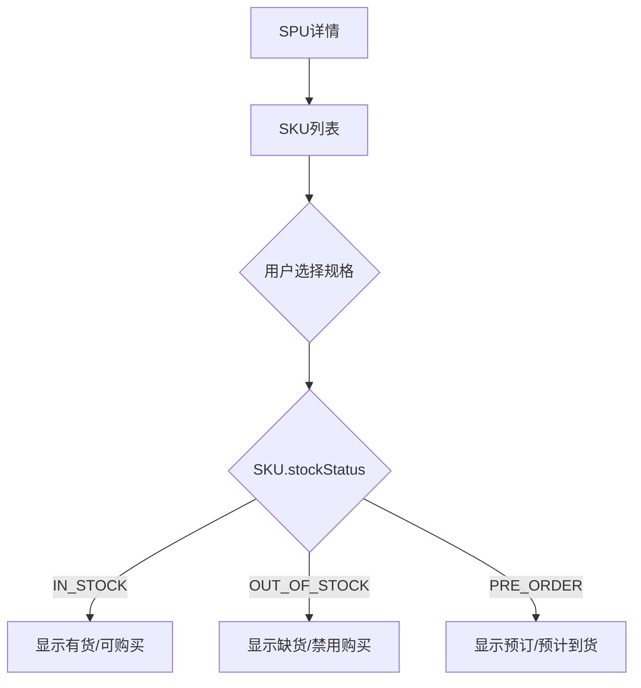
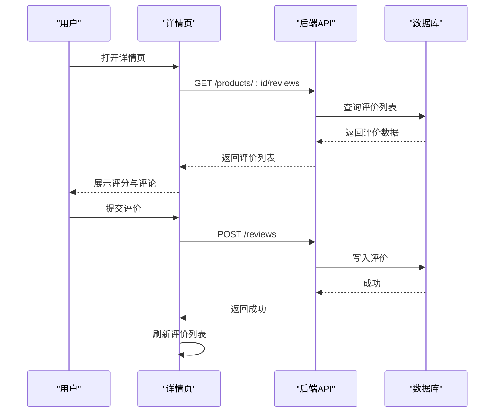
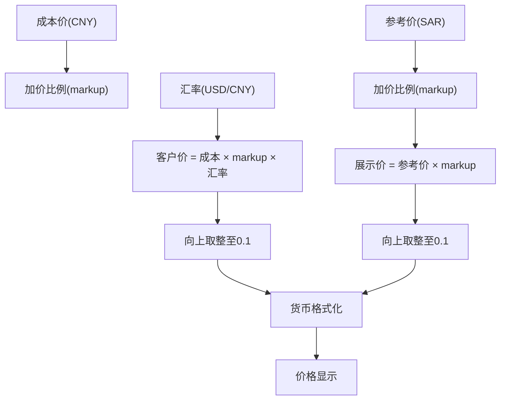
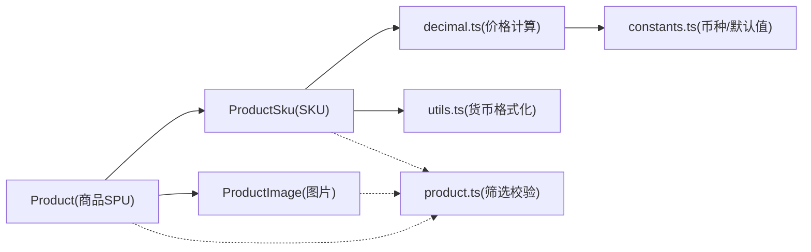

# 商品详情页面

<cite>
**本文引用的文件**
- [README.md](file://README.md)
- [storefront-layout.tsx](file://src/components/storefront/storefront-layout.tsx)
- [page.tsx](file://src/app/[locale]/storefront/page.tsx)
- [carousel.tsx](file://src/components/ui/carousel.tsx)
- [sku-selector.tsx](file://src/components/storefront/sku-selector.tsx)
- [schema.prisma](file://prisma/schema.prisma)
- [decimal.ts](file://src/lib/decimal.ts)
- [constants.ts](file://src/lib/constants.ts)
- [product.ts](file://src/lib/validations/product.ts)
- [index.ts](file://src/types/index.ts)
- [loading.tsx](file://src/app/loading.tsx)
- [technical-design.md](file://docs/technical-design.md)
- [utils.ts](file://src/lib/utils.ts)
- [zh.json](file://src/i18n/messages/zh.json)
</cite>

## 更新摘要
**所做更改**
- 更新了SKU选择器规格显示部分，反映了主石尺寸显示的UI改进
- 新增了主石尺寸显示格式简化的说明和实现细节
- 补充了符合行业标准电商产品展示规范的规格显示策略

## 目录
1. [简介](#简介)
2. [项目结构](#项目结构)
3. [核心组件](#核心组件)
4. [架构总览](#架构总览)
5. [详细组件分析](#详细组件分析)
6. [依赖关系分析](#依赖关系分析)
7. [性能考虑](#性能考虑)
8. [故障排查指南](#故障排查指南)
9. [结论](#结论)
10. [附录](#附录)

## 简介
本文件面向Celestia珠宝电商的商品详情页面，系统性梳理其前端架构与实现要点，重点覆盖以下方面：
- 商品主图轮播与缩略图导航
- 图片懒加载与性能优化
- 规格选择（尺寸、颜色、材质等）交互设计
- 库存状态显示（有货/缺货/预订）
- 用户评价系统集成（评分、评论列表、评价提交）
- 价格计算逻辑、货币格式化与促销展示
- 页面性能优化策略与SEO最佳实践

说明：当前仓库未包含商品详情页面的具体实现文件，但通过数据库模型、UI组件与工具库可推导出完整的实现路径与数据流。

## 项目结构
- 前端采用Next.js App Router，页面位于src/app下，布局组件位于src/components。
- 商品相关数据模型由Prisma schema定义，包含SPU（Product）、SKU（ProductSku）、图片（ProductImage）等。
- UI层提供通用轮播组件carousel.tsx，支持键盘导航与无障碍属性。
- 业务层通过decimal.ts进行高精度价格计算，通过constants.ts统一币种与默认参数，通过validations/product.ts约束筛选参数。

**图表来源**
- [storefront-layout.tsx:1-99](file://src/components/storefront/storefront-layout.tsx#L1-L99)
- [page.tsx:1-26](file://src/app/[locale]/storefront/page.tsx#L1-L26)
- [carousel.tsx:1-242](file://src/components/ui/carousel.tsx#L1-L242)
- [sku-selector.tsx:1-417](file://src/components/storefront/sku-selector.tsx#L1-L417)
- [decimal.ts:1-95](file://src/lib/decimal.ts#L1-L95)
- [constants.ts:25-45](file://src/lib/constants.ts#L25-L45)
- [product.ts:1-13](file://src/lib/validations/product.ts#L1-L13)
- [utils.ts:1-32](file://src/lib/utils.ts#L1-L32)
- [index.ts:1-60](file://src/types/index.ts#L1-L60)
- [schema.prisma:122-186](file://prisma/schema.prisma#L122-L186)

**章节来源**
- [README.md:1-37](file://README.md#L1-L37)
- [storefront-layout.tsx:1-99](file://src/components/storefront/storefront-layout.tsx#L1-L99)
- [page.tsx:1-26](file://src/app/[locale]/storefront/page.tsx#L1-L26)

## 核心组件
- 轮播组件carousel.tsx：基于embla-carousel-react实现，提供水平/垂直方向切换、键盘导航、前后按钮控制、无障碍属性与API回调。
- SKU选择器组件sku-selector.tsx：专门用于处理商品规格选择，包括宝石类型、金属颜色、主石尺寸、尺寸和链长度的选择逻辑。
- 商品数据模型：SPU（Product）含名称、描述、分类、价格区间、图片集合；SKU（ProductSku）含规格（尺寸、链长、材质颜色、主石尺寸）、库存状态、参考价；图片（ProductImage）含主图与缩略图URL及排序。
- 价格计算：decimal.ts提供客户价计算、订单总计、预估/实际利润等高精度运算；constants.ts定义币种符号与默认加价比例。
- 类型与校验：index.ts定义通用响应与分页接口；product.ts定义产品筛选参数的Zod校验。

**章节来源**
- [carousel.tsx:1-242](file://src/components/ui/carousel.tsx#L1-L242)
- [sku-selector.tsx:1-417](file://src/components/storefront/sku-selector.tsx#L1-L417)
- [schema.prisma:122-186](file://prisma/schema.prisma#L122-L186)
- [decimal.ts:1-95](file://src/lib/decimal.ts#L1-L95)
- [constants.ts:25-45](file://src/lib/constants.ts#L25-L45)
- [index.ts:1-60](file://src/types/index.ts#L1-L60)
- [product.ts:1-13](file://src/lib/validations/product.ts#L1-L13)

## 架构总览
商品详情页面的数据流与交互概览如下：

**图表来源**
- [storefront-layout.tsx:21-98](file://src/components/storefront/storefront-layout.tsx#L21-L98)
- [schema.prisma:122-186](file://prisma/schema.prisma#L122-L186)
- [decimal.ts:10-22](file://src/lib/decimal.ts#L10-L22)

## 详细组件分析

### 商品主图轮播与缩略图导航
- 实现方式：使用carousel.tsx提供的Carousel、CarouselContent、CarouselItem、CarouselPrevious、CarouselNext组合，支持键盘左右键与按钮切换。
- 无障碍与可访问性：区域角色标注为carousel，滑块组标注为slide，按钮包含"上一张/下一张"的屏幕阅读器文本。
- 交互流程：用户点击缩略图或左右箭头触发轮播滚动；组件内部维护canScrollPrev/canScrollNext状态以禁用/启用按钮。

**图表来源**
- [carousel.tsx:45-133](file://src/components/ui/carousel.tsx#L45-L133)
- [carousel.tsx:135-172](file://src/components/ui/carousel.tsx#L135-L172)
- [carousel.tsx:174-232](file://src/components/ui/carousel.tsx#L174-L232)

**章节来源**
- [carousel.tsx:1-242](file://src/components/ui/carousel.tsx#L1-L242)

### 规格选择交互设计（尺寸/颜色/材质/主石尺寸）
- 数据来源：SKU包含gemType（材质）、metalColor（金属颜色）、size（戒指尺码）、chainLength（项链链长）、mainStoneSize（主石尺寸）等维度。
- 交互策略：按维度分组呈现可选项；当某维度不可选时禁用；选中后联动价格与库存状态。
- 价格联动：使用decimal.ts中的calculateDisplayPrice或calculateCustomerPrice对参考价乘以客户加价比例，保留一位小数并向上取整。
- **主石尺寸显示改进**：主石尺寸显示更加简洁，符合行业标准的电商产品展示规范，去除了冗余的单位标识，直接显示数值。

**图表来源**
- [schema.prisma:151-170](file://prisma/schema.prisma#L151-L170)
- [decimal.ts:88-95](file://src/lib/decimal.ts#L88-L95)
- [sku-selector.tsx:138-151](file://src/components/storefront/sku-selector.tsx#L138-L151)

**章节来源**
- [schema.prisma:151-170](file://prisma/schema.prisma#L151-L170)
- [decimal.ts:88-95](file://src/lib/decimal.ts#L88-L95)
- [sku-selector.tsx:138-151](file://src/components/storefront/sku-selector.tsx#L138-L151)

### 库存状态显示机制
- 库存枚举：StockStatus包含IN_STOCK（有货）、OUT_OF_STOCK（缺货）、PRE_ORDER（预订）。
- 展示策略：根据SKU.stockStatus动态显示文案与样式；缺货时禁用加入购物车；预订时显示预计到货时间。
- 与规格联动：不同SKU组合可能有不同的库存状态，需在规格选择后刷新状态。

**图表来源**
- [schema.prisma:31-35](file://prisma/schema.prisma#L31-L35)
- [schema.prisma:151-170](file://prisma/schema.prisma#L151-L170)

**章节来源**
- [schema.prisma:31-35](file://prisma/schema.prisma#L31-L35)
- [schema.prisma:151-170](file://prisma/schema.prisma#L151-L170)

### 用户评价系统集成
- 数据模型：评价与评分通常存储在独立的Review/Comment模型中，详情页加载时并行请求商品详情与评价列表。
- 展示内容：评分星级、评论摘要、用户头像/昵称、评论正文、时间戳。
- 提交流程：登录态校验、表单校验（内容长度、评分范围）、提交后刷新列表。

**图表来源**
- [technical-design.md:560-563](file://docs/technical-design.md#L560-L563)

**章节来源**
- [technical-design.md:560-563](file://docs/technical-design.md#L560-L563)

### 价格计算逻辑、货币格式化与促销展示
- 客户价计算：成本价 × 加价比例 × 汇率，结果向上取整至0.1。
- 展示价计算：SPU参考价 × 客户加价比例，结果向上取整至0.1。
- 币种与符号：constants.ts提供CNY/SAR符号与名称；decimal.ts统一保留两位小数的订单总计与利润计算。
- 促销展示：可通过SKU.referencePriceSar与markupRatio计算展示价，若存在活动价则以活动价优先。
- **货币格式化改进**：使用utils.ts中的formatPrice函数进行统一的货币格式化，确保价格显示的一致性和可读性。

**图表来源**
- [decimal.ts:10-22](file://src/lib/decimal.ts#L10-L22)
- [decimal.ts:88-95](file://src/lib/decimal.ts#L88-L95)
- [constants.ts:25-29](file://src/lib/constants.ts#L25-L29)
- [utils.ts:8-13](file://src/lib/utils.ts#L8-L13)

**章节来源**
- [decimal.ts:1-95](file://src/lib/decimal.ts#L1-L95)
- [constants.ts:25-29](file://src/lib/constants.ts#L25-L29)
- [utils.ts:8-13](file://src/lib/utils.ts#L8-L13)

## 依赖关系分析
- 组件耦合：详情页依赖轮播组件、SKU选择器与数据服务；轮播组件和SKU选择器不直接依赖业务数据，保持高内聚低耦合。
- 数据模型：Product-Sku-Image三者通过外键关联，SKU承载规格与库存状态，Image承载主图与缩略图。
- 工具依赖：价格计算依赖decimal.ts；币种与默认参数依赖constants.ts；筛选参数依赖product.ts；货币格式化依赖utils.ts。

**图表来源**
- [schema.prisma:122-186](file://prisma/schema.prisma#L122-L186)
- [decimal.ts:1-95](file://src/lib/decimal.ts#L1-L95)
- [constants.ts:25-45](file://src/lib/constants.ts#L25-L45)
- [product.ts:1-13](file://src/lib/validations/product.ts#L1-L13)
- [utils.ts:1-32](file://src/lib/utils.ts#L1-L32)

**章节来源**
- [schema.prisma:122-186](file://prisma/schema.prisma#L122-L186)
- [decimal.ts:1-95](file://src/lib/decimal.ts#L1-L95)
- [constants.ts:25-45](file://src/lib/constants.ts#L25-L45)
- [product.ts:1-13](file://src/lib/validations/product.ts#L1-L13)
- [utils.ts:1-32](file://src/lib/utils.ts#L1-L32)

## 性能考虑
- 图片懒加载与优化
  - 使用Next.js Image组件与webp/png格式，按设备像素比自动选择合适尺寸。
  - 主图轮播使用懒加载，仅在可见区域内加载图片资源。
  - 缩略图采用占位骨架屏，避免布局抖动。
- 轮播性能
  - 使用embla-carousel-react，避免DOM频繁重排；限制同时渲染的slide数量。
  - 键盘导航与触摸手势分离，减少不必要的事件监听。
- **SKU选择器性能优化**
  - 主石尺寸选项使用Set去重，避免重复渲染。
  - 条件渲染：只有当相应规格存在时才显示对应的选项区域。
  - 按需计算可用选项，减少不必要的DOM操作。
- 价格计算
  - 使用decimal.js进行高精度计算，避免浮点误差；缓存中间结果，减少重复计算。
  - 货币格式化使用utils.ts中的formatPrice函数，确保性能和一致性。
- 并行加载
  - 商品详情与评价列表并行请求，缩短首屏时间。
- 预加载与预取
  - 在路由切换前预取下一页所需数据，提升交互流畅度。
- SEO与可访问性
  - 为图片添加alt文本与尺寸属性；轮播组件提供aria-roledescription与键盘可达性。
  - 使用结构化数据标记商品信息，提升搜索引擎识别度。
  - SKU选择器提供清晰的标签和无障碍属性。

## 故障排查指南
- 轮播无法切换
  - 检查是否正确传入children与orientation；确认embla API已初始化。
  - 确认canScrollPrev/canScrollNext状态是否被外部逻辑覆盖。
- 规格选择无效
  - 核对SKU字段映射（gemType/metalColor/mainStoneSize/size/chainLength）是否与后端一致。
  - 检查选中SKU后是否重新计算价格与库存状态。
  - **主石尺寸显示问题**：确认mainStoneSize字段是否正确传递，检查SKU列表中是否存在该规格。
- 价格异常
  - 确认markupRatio与exchangeRate是否为正数；检查decimal.js精度配置。
  - 对比参考价与展示价计算逻辑，确保取整规则一致。
  - 检查utils.ts中的formatPrice函数是否正常工作。
- 库存状态不一致
  - 核对SKU.stockStatus枚举值；检查规格选择后是否同步刷新状态。
- 评价提交失败
  - 校验表单字段长度与评分范围；确认用户登录态有效；查看后端返回的错误信息。

**章节来源**
- [carousel.tsx:64-105](file://src/components/ui/carousel.tsx#L64-L105)
- [decimal.ts:10-22](file://src/lib/decimal.ts#L10-L22)
- [schema.prisma:151-170](file://prisma/schema.prisma#L151-L170)
- [sku-selector.tsx:138-151](file://src/components/storefront/sku-selector.tsx#L138-L151)
- [utils.ts:8-13](file://src/lib/utils.ts#L8-L13)

## 结论
商品详情页面在当前仓库中尚未提供具体实现文件，但通过轮播组件、SKU选择器、数据模型与工具库已具备完整的技术基础。最新的主石尺寸显示UI改进使得规格展示更加简洁直观，符合行业标准的电商产品展示规范。建议按照本文档的架构与实现要点，结合Prisma模型与decimal.ts工具函数，快速构建高性能、可扩展且具备良好用户体验的商品详情页。

## 附录
- 页面加载策略：使用loading.tsx作为全局加载指示器，提升用户感知速度。
- 类型与校验：遵循index.ts与product.ts的类型定义与参数校验，保证接口一致性。
- 技术设计参考：technical-design.md中关于商品详情接口的定义可作为开发依据。
- **主石尺寸显示规范**：遵循行业标准，直接显示数值而不过度包装单位信息，提升用户阅读效率。

**章节来源**
- [loading.tsx:1-5](file://src/app/loading.tsx#L1-L5)
- [index.ts:1-60](file://src/types/index.ts#L1-L60)
- [product.ts:1-13](file://src/lib/validations/product.ts#L1-L13)
- [technical-design.md:560-563](file://docs/technical-design.md#L560-L563)
- [sku-selector.tsx:311-343](file://src/components/storefront/sku-selector.tsx#L311-L343)