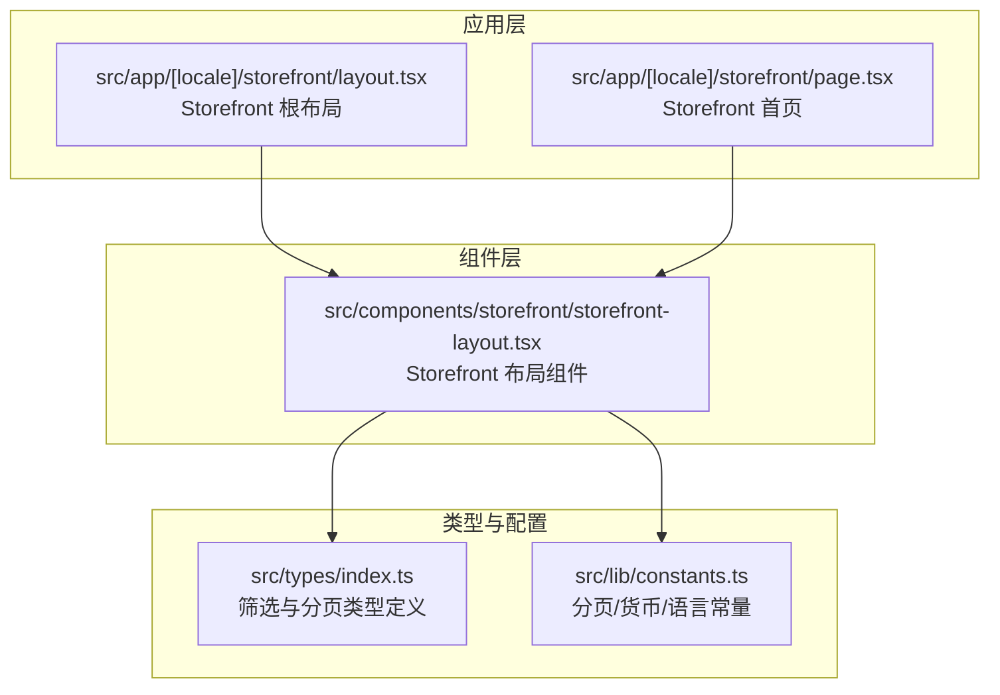
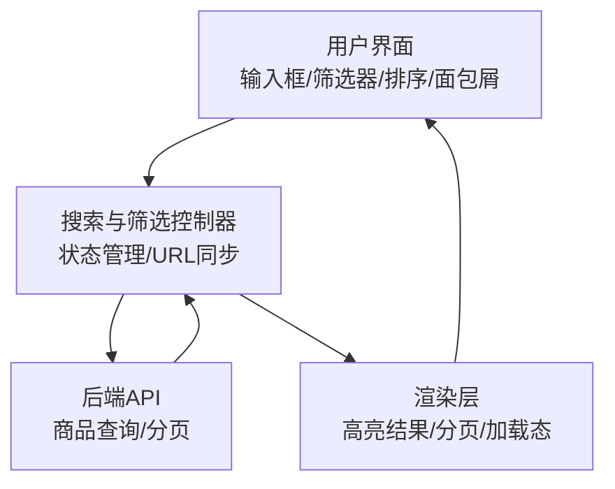
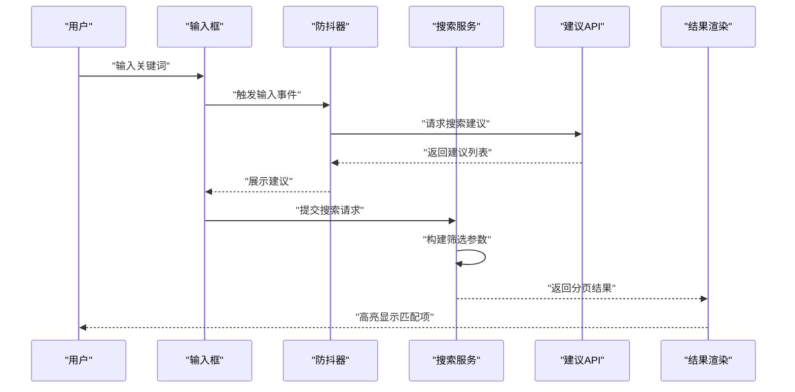
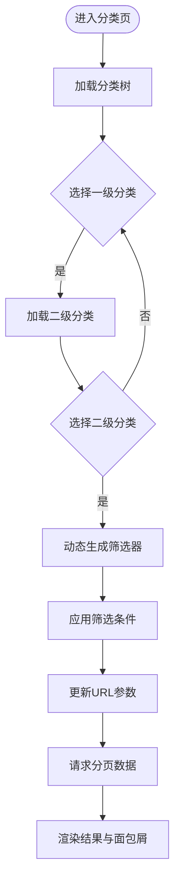
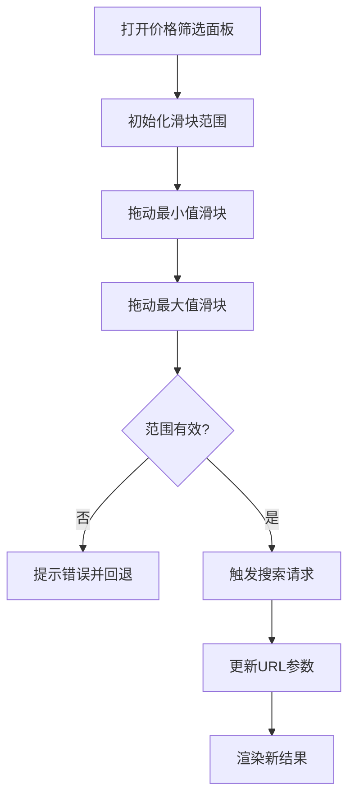
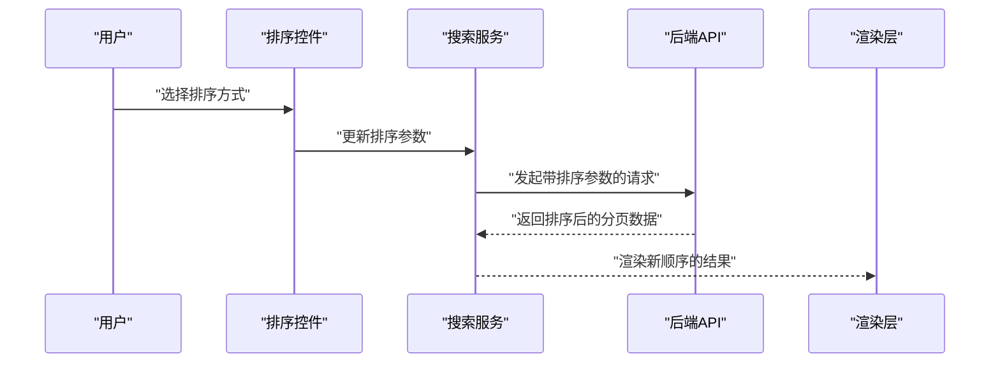
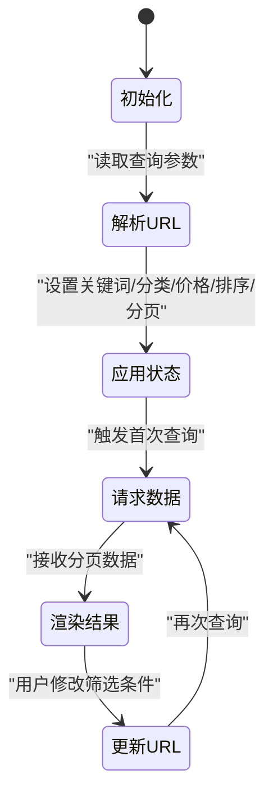
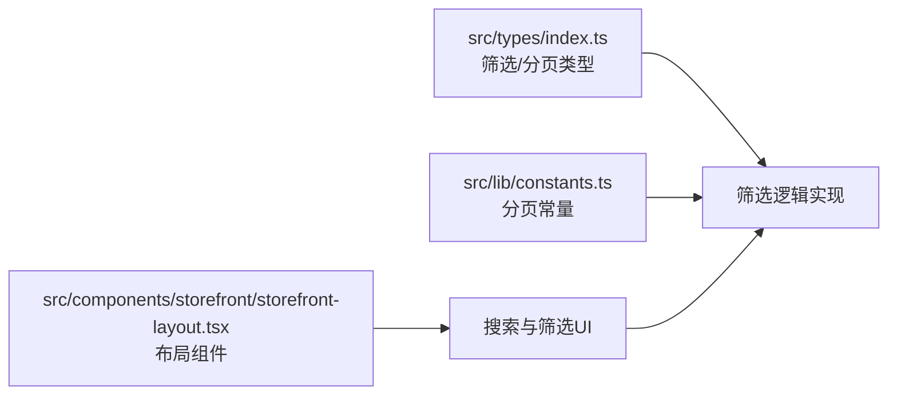

# 搜索与筛选系统

<cite>
**本文档引用的文件**
- [src/app/[locale]/storefront/layout.tsx](file://src/app/[locale]/storefront/layout.tsx)
- [src/app/[locale]/storefront/page.tsx](file://src/app/[locale]/storefront/page.tsx)
- [src/components/storefront/storefront-layout.tsx](file://src/components/storefront/storefront-layout.tsx)
- [src/lib/constants.ts](file://src/lib/constants.ts)
- [src/types/index.ts](file://src/types/index.ts)
</cite>

## 目录
1. [简介](#简介)
2. [项目结构](#项目结构)
3. [核心组件](#核心组件)
4. [架构总览](#架构总览)
5. [详细组件分析](#详细组件分析)
6. [依赖关系分析](#依赖关系分析)
7. [性能考虑](#性能考虑)
8. [故障排除指南](#故障排除指南)
9. [结论](#结论)
10. [附录](#附录)

## 简介
本文件面向Celestia珠宝商店的“搜索与筛选系统”，基于当前仓库中的现有实现进行系统化梳理与说明。根据项目结构与类型定义，当前代码库已具备以下能力：
- 商品筛选参数模型（支持关键词、分类、材质/宝石、排序等）
- 分页参数与响应模型
- 基础前端布局与导航结构
- 常量配置（分页大小、货币、语言等）

在不改变现有实现的前提下，本文档将从“搜索建议、结果高亮、历史记录”“分类筛选（多级、组合、动态面板）”“价格区间过滤（滑块、范围选择、结果更新）”“排序选项（价格、评分、最新上架）”“筛选状态管理（URL同步、面包屑）”“性能优化（防抖、缓存、分页）”六个维度给出可落地的实现建议与架构图示。

## 项目结构
当前与“搜索与筛选系统”直接相关的模块主要分布在以下位置：
- 应用层：Storefront根布局与首页页面
- 组件层：Storefront通用布局组件（导航、移动端底部导航）
- 类型层：统一的筛选参数与分页接口定义
- 配置层：分页常量、货币与语言等基础配置

**图表来源**
- [src/app/[locale]/storefront/layout.tsx](file://src/app/[locale]/storefront/layout.tsx#L1-L10)
- [src/app/[locale]/storefront/page.tsx](file://src/app/[locale]/storefront/page.tsx#L1-L26)
- [src/components/storefront/storefront-layout.tsx:1-99](file://src/components/storefront/storefront-layout.tsx#L1-L99)
- [src/types/index.ts:1-60](file://src/types/index.ts#L1-L60)
- [src/lib/constants.ts:1-46](file://src/lib/constants.ts#L1-L46)

**章节来源**
- [src/app/[locale]/storefront/layout.tsx](file://src/app/[locale]/storefront/layout.tsx#L1-L10)
- [src/app/[locale]/storefront/page.tsx](file://src/app/[locale]/storefront/page.tsx#L1-L26)
- [src/components/storefront/storefront-layout.tsx:1-99](file://src/components/storefront/storefront-layout.tsx#L1-L99)
- [src/lib/constants.ts:31-35](file://src/lib/constants.ts#L31-L35)
- [src/types/index.ts:9-32](file://src/types/index.ts#L9-L32)

## 核心组件
- Storefront根布局：负责包裹子页面并注入Storefront布局组件，确保导航与移动端底部导航一致。
- Storefront布局组件：提供桌面端与移动端导航、面包屑占位、主内容区容器。
- 筛选参数类型：定义商品筛选的关键字段（关键词、分类、材质/宝石、排序、分页）。
- 分页常量：定义默认页大小与最大页大小，为分页加载提供约束。

这些组件共同构成“搜索与筛选系统”的基础设施，后续的搜索建议、分类筛选、价格过滤、排序与URL同步均可在此基础上扩展。

**章节来源**
- [src/app/[locale]/storefront/layout.tsx](file://src/app/[locale]/storefront/layout.tsx#L1-L10)
- [src/components/storefront/storefront-layout.tsx:1-99](file://src/components/storefront/storefront-layout.tsx#L1-L99)
- [src/types/index.ts:24-32](file://src/types/index.ts#L24-L32)
- [src/lib/constants.ts:31-35](file://src/lib/constants.ts#L31-L35)

## 架构总览
下图展示了“搜索与筛选系统”的高层交互：用户通过输入框触发关键词搜索；分类/价格/排序等筛选器更新筛选状态；状态通过URL同步；后端返回分页数据；前端渲染高亮结果与面包屑导航。

[此图为概念性架构示意，无需图表来源标注]

## 详细组件分析

### 关键词搜索与实时建议
- 实现思路
  - 输入监听：在输入框上绑定输入事件，使用防抖（debounce）降低请求频率。
  - 建议列表：调用建议接口返回候选关键词或热门搜索词，展示在输入框下方。
  - 选择行为：点击建议项自动填充输入框并触发搜索。
- 结果高亮
  - 对命中关键词的商品标题/描述进行高亮标记，提升可读性。
- 搜索历史
  - 将最近N条搜索记录保存在本地存储中，支持快速重放与删除。
- URL同步
  - 将关键词作为查询参数写入URL，刷新页面时保持状态一致。

[此图为概念性流程示意，无需图表来源标注]

### 分类筛选（多级、组合、动态面板）
- 多级分类
  - 使用树形结构表示分类层级，支持逐级展开与选择。
- 条件组合
  - 同时选择多个分类（如多个子类），后端以数组形式接收并组合查询。
- 动态筛选面板
  - 根据当前分类路径动态生成筛选器（如材质、颜色、价格区间等）。
- URL同步
  - 将所选分类ID写入URL查询参数，支持分享与回放。

[此图为概念性流程示意，无需图表来源标注]

### 价格区间过滤（滑块、范围选择、结果更新）
- 滑块组件
  - 双滑块选择最小值与最大值，支持连续拖动与离散步进。
- 范围校验
  - 最小值不得大于最大值；超出范围时提示或自动修正。
- 结果更新
  - 价格变化即触发请求，结合防抖避免频繁网络请求。
- URL同步
  - 将价格区间写入URL，便于分享与恢复。

[此图为概念性流程示意，无需图表来源标注]

### 排序选项系统（价格、评分、最新上架）
- 排序规则
  - 支持按价格升序、价格降序、最新上架、热门度等。
- 用户交互
  - 下拉菜单或按钮组切换排序方式，点击即刷新结果。
- URL同步
  - 将排序键写入URL，保证页面刷新与分享的一致性。

[此图为概念性流程示意，无需图表来源标注]

### 筛选状态管理、URL参数同步与面包屑导航
- 状态管理
  - 使用集中式状态存储（如Zustand/Redux）管理关键词、分类、价格、排序、分页游标等。
- URL同步
  - 所有筛选条件映射到URL查询字符串；页面加载时解析URL并恢复状态。
- 面包屑导航
  - 根据当前分类路径与关键词生成面包屑，支持一键返回上级。

[此图为概念性状态示意，无需图表来源标注]

## 依赖关系分析
- 类型依赖
  - 筛选参数类型与分页类型为所有筛选逻辑提供契约，确保前后端一致。
- 常量依赖
  - 分页常量限制单次请求规模，避免过大响应导致性能问题。
- 组件依赖
  - Storefront布局组件为搜索与筛选提供统一的导航与容器，保证用户体验一致性。

**图表来源**
- [src/types/index.ts:9-32](file://src/types/index.ts#L9-L32)
- [src/lib/constants.ts:31-35](file://src/lib/constants.ts#L31-L35)
- [src/components/storefront/storefront-layout.tsx:1-99](file://src/components/storefront/storefront-layout.tsx#L1-L99)

**章节来源**
- [src/types/index.ts:9-32](file://src/types/index.ts#L9-L32)
- [src/lib/constants.ts:31-35](file://src/lib/constants.ts#L31-L35)
- [src/components/storefront/storefront-layout.tsx:1-99](file://src/components/storefront/storefront-layout.tsx#L1-L99)

## 性能考虑
- 防抖处理
  - 关键词输入与价格滑块松开后触发请求，减少无效请求。
- 结果缓存
  - 对相同筛选条件的结果进行内存缓存，优先返回缓存以提升响应速度。
- 分页加载
  - 使用游标分页或页码分页，结合默认页大小与最大页大小限制请求规模。
- 懒加载与虚拟滚动
  - 在长列表场景采用虚拟滚动，仅渲染可视区域元素。
- 并发控制
  - 对高频请求进行并发限制，避免同时发起过多请求。

[本节为通用性能指导，无需章节来源]

## 故障排除指南
- 搜索无结果
  - 检查关键词是否为空或过短；确认筛选条件是否过于严格；查看分页游标是否正确。
- 排序异常
  - 确认排序键是否在允许集合内；检查后端排序实现是否支持该键。
- URL不同步
  - 核对URL参数编码与解码逻辑；确保状态变更后及时更新URL。
- 性能卡顿
  - 检查是否存在未清理的定时器或监听器；确认是否启用了缓存与分页。

[本节为通用排障建议，无需章节来源]

## 结论
当前代码库已具备“搜索与筛选系统”的基础骨架：统一的筛选参数类型、分页模型与前端布局。围绕关键词搜索、分类筛选、价格区间过滤与排序选项，可在此基础上通过防抖、缓存、分页与URL同步等手段进一步完善用户体验与性能表现。建议在后续迭代中补充具体的UI组件与API对接，并持续优化搜索算法与索引策略。

[本节为总结性内容，无需章节来源]

## 附录
- 相关类型定义参考
  - 筛选参数与分页接口
  - 分页常量与默认页大小
- 建议新增文件（概念性）
  - 搜索服务：封装关键词、分类、价格、排序的请求与缓存
  - 筛选面板组件：多级分类树、价格滑块、排序下拉
  - URL工具：查询参数序列化/反序列化
  - 面包屑组件：根据路径动态生成

[本节为概念性附录，无需章节来源]