# 用户个人中心

<cite>
**本文档引用的文件**
- [README.md](file://README.md)
- [layout.tsx](file://src/app/layout.tsx)
- [storefront-layout.tsx](file://src/components/storefront/storefront-layout.tsx)
- [index.ts](file://src/types/index.ts)
- [db.ts](file://src/lib/db.ts)
- [constants.ts](file://src/lib/constants.ts)
- [utils.ts](file://src/lib/utils.ts)
- [auth.ts](file://src/lib/auth.ts)
- [jwt-config.ts](file://src/lib/jwt-config.ts)
- [middleware.ts](file://src/middleware.ts)
- [route.ts](file://src/app/api/auth/login/route.ts)
- [route.ts](file://src/app/api/auth/register/route.ts)
- [route.ts](file://src/app/api/auth/logout/route.ts)
- [route.ts](file://src/app/api/auth/me/route.ts)
- [auth.ts](file://src/lib/actions/auth.ts)
- [page.tsx](file://src/app/[locale]/storefront/profile/page.tsx)
- [page.tsx](file://src/app/[locale]/storefront/(auth)/pending/page.tsx)
- [page.tsx](file://src/app/[locale]/storefront/(auth)/login/page.tsx)
- [page.tsx](file://src/app/[locale]/storefront/(auth)/register/page.tsx)
- [order.ts](file://src/lib/validations/order.ts)
- [schema.prisma](file://prisma/schema.prisma)
</cite>

## 更新摘要
**变更内容**
- 更新了注销功能章节，反映了从POST异步登出到GET直接登出端点的简化实现
- 新增了GET登出端点的技术实现说明和可靠性分析
- 更新了相关代码示例和架构图，体现更简洁的注销流程

## 目录
1. [简介](#简介)
2. [项目结构](#项目结构)
3. [核心组件](#核心组件)
4. [架构概览](#架构概览)
5. [详细组件分析](#详细组件分析)
6. [依赖关系分析](#依赖关系分析)
7. [性能考虑](#性能考虑)
8. [故障排除指南](#故障排除指南)
9. [结论](#结论)
10. [附录](#附录)

## 简介

Celestia用户个人中心是一个基于Next.js构建的现代珠宝电商应用的核心功能模块。该系统提供了完整的用户个人信息管理、订单历史查看、收货地址管理以及用户认证状态管理功能。系统采用现代化的技术栈，包括TypeScript、Prisma ORM、Tailwind CSS等，确保了良好的开发体验和用户体验。

个人中心功能涵盖了用户从注册登录到订单管理的完整生命周期，支持多语言国际化、多币种定价、复杂的订单状态管理和安全的认证授权机制。

## 项目结构

项目采用基于功能的组织方式，个人中心相关的核心文件分布在以下关键目录中：

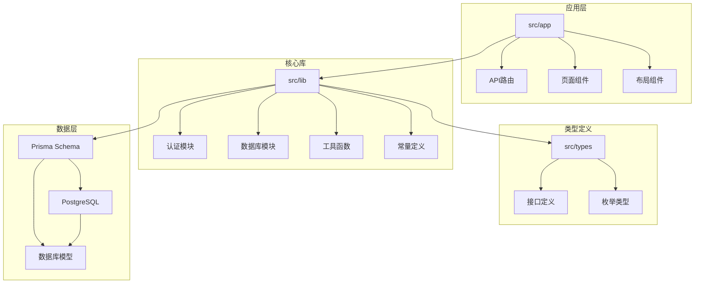

**图表来源**
- [layout.tsx:1-43](file://src/app/layout.tsx#L1-L43)
- [storefront-layout.tsx:1-99](file://src/components/storefront/storefront-layout.tsx#L1-L99)
- [db.ts:1-18](file://src/lib/db.ts#L1-L18)

**章节来源**
- [README.md:1-37](file://README.md#L1-L37)
- [layout.tsx:1-43](file://src/app/layout.tsx#L1-L43)

## 核心组件

### 认证与会话管理

系统实现了基于JWT的认证机制，支持用户注册、登录、登出和会话管理：

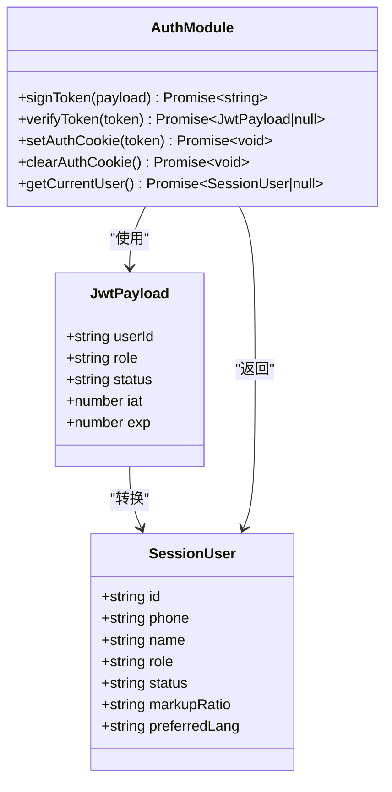

**图表来源**
- [index.ts:41-59](file://src/types/index.ts#L41-L59)
- [auth.ts:1-116](file://src/lib/auth.ts#L1-L116)

### 数据模型与存储

系统使用Prisma ORM管理用户数据，支持灵活的数据查询和关系映射：

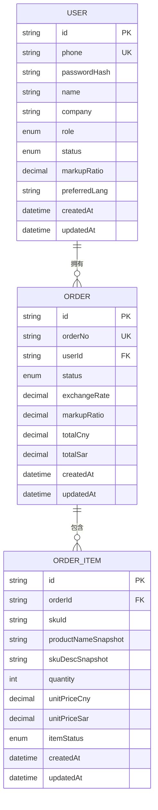

**图表来源**
- [schema.prisma:89-106](file://prisma/schema.prisma#L89-L106)
- [schema.prisma:188-220](file://prisma/schema.prisma#L188-L220)
- [schema.prisma:222-247](file://prisma/schema.prisma#L222-L247)

**章节来源**
- [auth.ts:73-116](file://src/lib/auth.ts#L73-L116)
- [db.ts:1-18](file://src/lib/db.ts#L1-L18)
- [schema.prisma:89-106](file://prisma/schema.prisma#L89-L106)

## 架构概览

系统采用分层架构设计，确保关注点分离和可维护性：

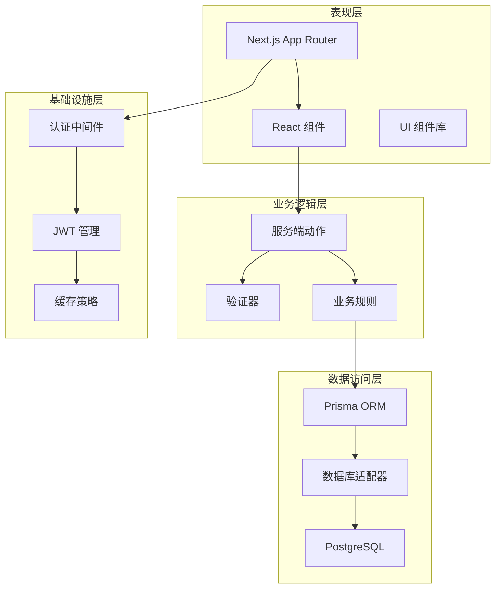

**图表来源**
- [middleware.ts:1-48](file://src/middleware.ts#L1-L48)
- [auth.ts:1-116](file://src/lib/auth.ts#L1-L116)
- [db.ts:1-18](file://src/lib/db.ts#L1-L18)

## 详细组件分析

### 用户认证状态管理

系统实现了完整的用户认证生命周期管理，包括注册、登录、状态验证和会话维护：

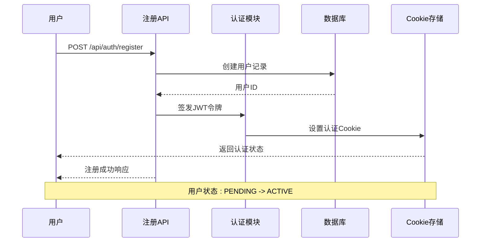

**图表来源**
- [route.ts:40-85](file://src/app/api/auth/register/route.ts#L40-L85)
- [auth.ts:10-18](file://src/lib/auth.ts#L10-L18)
- [jwt-config.ts:1-8](file://src/lib/jwt-config.ts#L1-L8)

#### 权限控制机制

系统通过角色和状态双重维度控制用户权限：

| 角色 | 状态 | 可访问功能 | 权限级别 |
|------|------|------------|----------|
| ADMIN | ACTIVE | 系统管理、用户管理、订单管理 | 最高权限 |
| CUSTOMER | ACTIVE | 个人中心、订单查看、地址管理 | 标准权限 |
| CUSTOMER | PENDING | 仅注册、登录 | 限制权限 |

**章节来源**
- [index.ts:42-48](file://src/types/index.ts#L42-L48)
- [middleware.ts:31-48](file://src/middleware.ts#L31-L48)

### 注销功能实现

**更新** 系统现已采用简化的GET登出端点实现，移除了之前的POST异步登出逻辑：

#### GET登出端点实现

新的注销功能通过单一的GET端点实现，提供最高的可靠性和用户体验：

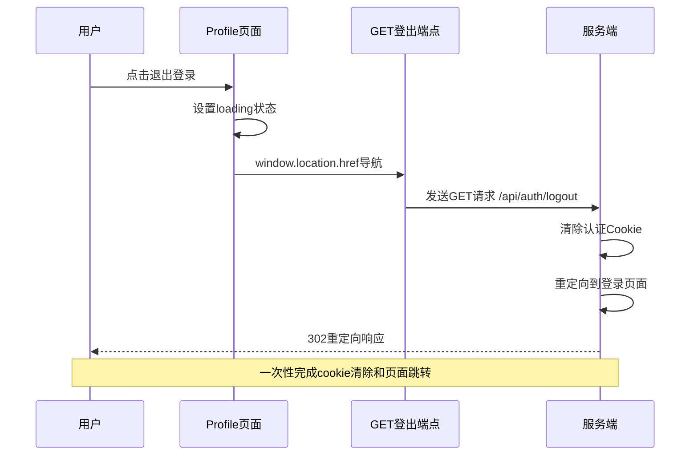

#### Profile页面注销功能

Profile页面中的注销功能位于 `src/app/[locale]/storefront/profile/page.tsx` 的第66-70行：


#### Pending页面注销功能

Pending页面中的注销功能位于 `src/app/[locale]/storefront/(auth)/pending/page.tsx` 的第25-29行：

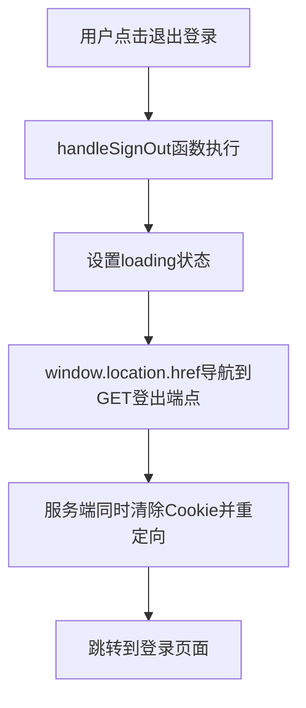

#### 注销流程的技术实现

**更新** 新的GET登出端点实现了"一次响应完成"的设计理念，相比之前的POST实现具有显著优势：

1. **服务端原子操作**：在同一HTTP响应中同时完成Cookie清除和页面重定向
2. **浏览器强制刷新**：避免了客户端状态残留问题
3. **简化客户端逻辑**：移除了复杂的错误处理和状态管理
4. **提高可靠性**：减少了网络请求失败导致的状态不一致风险

**章节来源**
- [page.tsx:66-70](file://src/app/[locale]/storefront/profile/page.tsx#L66-L70)
- [page.tsx:25-29](file://src/app/[locale]/storefront/(auth)/pending/page.tsx#L25-L29)
- [route.ts:26-49](file://src/app/api/auth/logout/route.ts#L26-L49)
- [auth.ts:54-68](file://src/lib/auth.ts#L54-L68)

### 订单历史查看界面

订单管理系统提供了完整的订单生命周期管理功能：

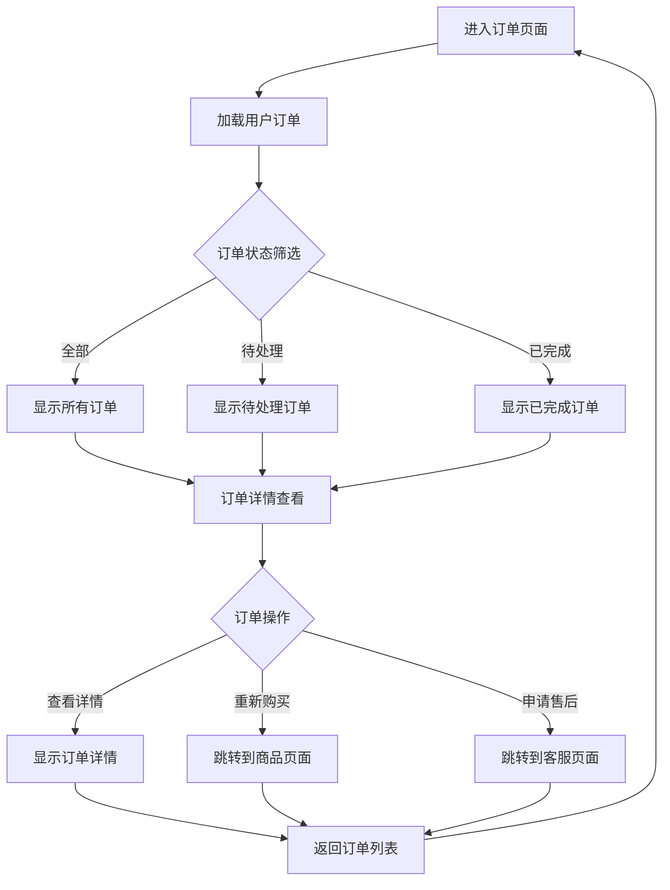

**图表来源**
- [constants.ts:1-46](file://src/lib/constants.ts#L1-L46)
- [utils.ts:15-23](file://src/lib/utils.ts#L15-L23)

#### 订单状态管理

系统支持10种不同的订单状态，每种状态都有明确的业务含义和视觉标识：

| 状态代码 | 中文标签 | 英文标签 | 颜色标识 | 业务含义 |
|----------|----------|----------|----------|----------|
| PENDING_QUOTE | 待报价 | Pending Quote | yellow | 等待报价生成 |
| QUOTED | 已报价 | Quoted | blue | 已生成报价单 |
| NEGOTIATING | 协商中 | Negotiating | orange | 客户与供应商协商 |
| CONFIRMED | 已确认 | Confirmed | green | 订单已确认 |
| PARTIALLY_PAID | 部分付款 | Partially Paid | cyan | 已支付部分款项 |
| FULLY_PAID | 已付清 | Fully Paid | emerald | 全款已支付 |
| SHIPPED | 已发货 | Shipped | purple | 商品已发出 |
| SETTLING | 结算中 | Settling | amber | 正在结算处理 |
| COMPLETED | 已完成 | Completed | green | 订单完成 |
| CANCELLED | 已取消 | Cancelled | red | 订单已取消 |

**章节来源**
- [constants.ts:1-46](file://src/lib/constants.ts#L1-L46)
- [order.ts:1-22](file://src/lib/validations/order.ts#L1-L22)

### 收货地址管理功能

地址管理系统支持用户地址的完整生命周期管理：

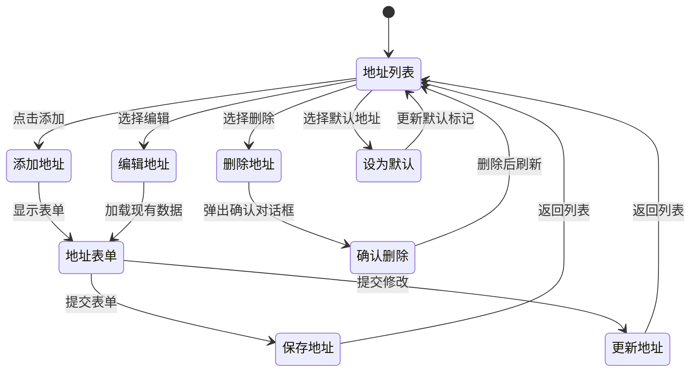

**图表来源**
- [storefront-layout.tsx:13-19](file://src/components/storefront/storefront-layout.tsx#L13-L19)

#### 地址数据结构

地址信息包含完整的地理位置和联系信息：

| 字段名 | 类型 | 描述 | 必填 |
|--------|------|------|------|
| id | string | 地址唯一标识 | 是 |
| userId | string | 所属用户ID | 是 |
| fullName | string | 收货人姓名 | 是 |
| phone | string | 联系电话 | 是 |
| country | string | 国家 | 是 |
| province | string | 省份 | 是 |
| city | string | 城市 | 是 |
| district | string | 区县 | 否 |
| streetAddress | string | 街道地址 | 是 |
| postalCode | string | 邮政编码 | 否 |
| isDefault | boolean | 是否默认地址 | 否 |
| createdAt | datetime | 创建时间 | 否 |
| updatedAt | datetime | 更新时间 | 否 |

### 用户信息管理

个人中心提供了全面的用户信息管理功能：

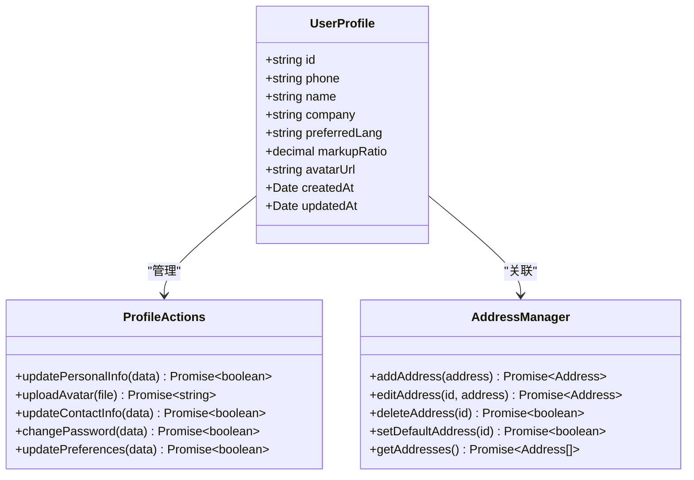

**图表来源**
- [index.ts:50-59](file://src/types/index.ts#L50-L59)
- [storefront-layout.tsx:13-19](file://src/components/storefront/storefront-layout.tsx#L13-L19)

**章节来源**
- [index.ts:50-59](file://src/types/index.ts#L50-L59)

## 依赖关系分析

系统各组件之间的依赖关系清晰明确，遵循单一职责原则：

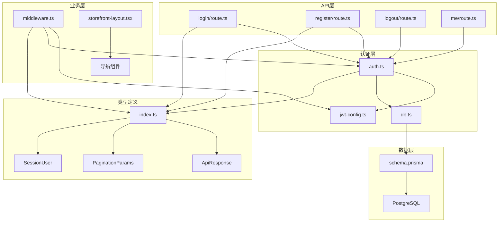

**图表来源**
- [auth.ts:1-116](file://src/lib/auth.ts#L1-L116)
- [jwt-config.ts:1-8](file://src/lib/jwt-config.ts#L1-L8)
- [db.ts:1-18](file://src/lib/db.ts#L1-L18)
- [middleware.ts:1-48](file://src/middleware.ts#L1-L48)

**章节来源**
- [middleware.ts:31-48](file://src/middleware.ts#L31-L48)
- [auth.ts:73-116](file://src/lib/auth.ts#L73-L116)

## 性能考虑

系统在设计时充分考虑了性能优化：

### 数据库优化
- 使用索引优化常用查询字段
- 实现游标分页减少大数据集查询
- 采用连接池管理数据库连接
- 实施查询缓存策略

### 缓存策略
- API响应缓存
- 用户会话缓存
- 静态资源缓存
- 图片资源CDN加速

### 前端优化
- 组件懒加载
- 代码分割
- 图片懒加载
- 防抖节流优化

## 故障排除指南

### 常见问题及解决方案

#### 认证相关问题
- **问题**: 登录后无法访问受保护页面
  - **原因**: JWT令牌过期或Cookie未正确设置
  - **解决**: 检查JWT_SECRET配置，确认Cookie设置参数

- **问题**: 用户状态异常
  - **原因**: 数据库状态字段不一致
  - **解决**: 同步用户状态到ACTIVE

#### 注销功能问题
- **问题**: 注销后仍能访问受保护页面
  - **原因**: 浏览器缓存或Cookie未正确清除
  - **解决**: 使用 `window.location.href` 强制页面刷新，确保Cookie被清除

- **问题**: GET登出端点重定向失败
  - **原因**: 语言参数缺失或无效
  - **解决**: 确保传递正确的locale参数，如`/api/auth/logout?locale=zh`

- **问题**: 注销响应返回JSON而非重定向
  - **原因**: 客户端直接调用POST端点
  - **解决**: 使用GET端点进行注销操作

#### 数据库连接问题
- **问题**: Prisma连接失败
  - **原因**: DATABASE_URL配置错误
  - **解决**: 验证数据库连接字符串

#### API调用错误
- **问题**: 订单查询返回空结果
  - **原因**: 用户ID不匹配或权限不足
  - **解决**: 验证用户认证状态和查询参数

**章节来源**
- [auth.ts:54-68](file://src/lib/auth.ts#L54-L68)
- [db.ts:9-15](file://src/lib/db.ts#L9-L15)

## 结论

Celestia用户个人中心是一个功能完善、架构清晰的现代化电商应用模块。系统通过合理的分层设计、完善的认证机制和丰富的业务功能，为用户提供了优质的个人中心体验。

主要优势包括：
- 完整的用户生命周期管理
- 灵活的订单状态管理
- 安全的认证授权机制
- 可扩展的架构设计
- 良好的性能表现
- **简化的注销功能实现**：采用GET端点实现"一次响应完成"的注销流程，显著提高了可靠性和用户体验

未来可以考虑的功能增强：
- 多语言支持扩展
- 移动端原生应用
- 更丰富的数据分析功能
- AI驱动的个性化推荐

## 附录

### 开发环境设置

1. **环境变量配置**
   - JWT_SECRET: JWT加密密钥
   - DATABASE_URL: 数据库连接字符串
   - NODE_ENV: 环境模式

2. **开发命令**
   ```bash
   npm run dev    # 开发模式
   npm run build  # 生产构建
   npm start      # 启动服务器
   ```

3. **数据库迁移**
   ```bash
   npx prisma migrate dev    # 开发环境迁移
   npx prisma generate       # 生成Prisma客户端
   ```

### API参考

系统提供RESTful API接口，支持标准的HTTP方法和状态码。所有API响应都遵循统一的JSON格式，包含success、data、error和message字段。

**更新** 注销API的详细说明：
- **端点**: `GET /api/auth/logout?locale=语言代码`
- **功能**: 清除用户认证Cookie并重定向到登录页面
- **响应**: 302重定向响应，直接跳转到登录页面
- **状态码**: 302 重定向，无JSON响应体
- **参数**: locale - 目标语言代码（en/ar/zh）

**更新** 用户信息API的详细说明：
- **端点**: `GET /api/auth/me`
- **功能**: 获取当前用户信息
- **响应**: `{ success: boolean, data: { user: { name, phone, company } } | null }`
- **状态码**: 200 成功，401 未认证，500 内部错误