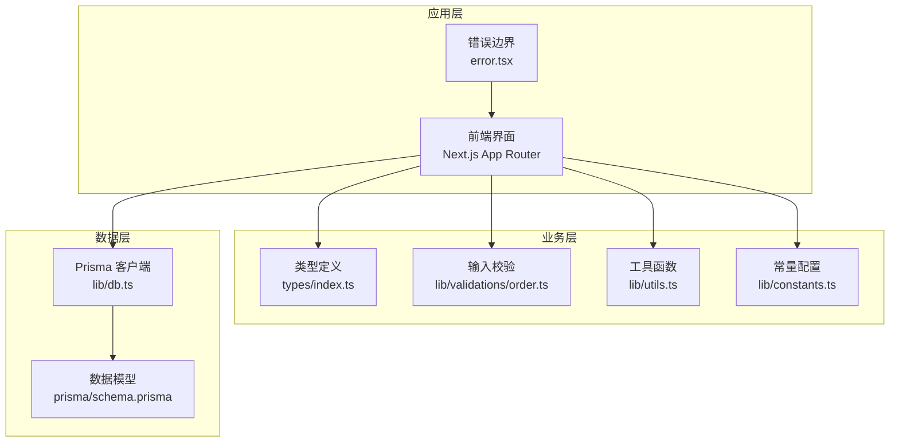
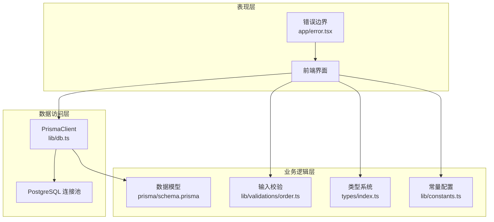
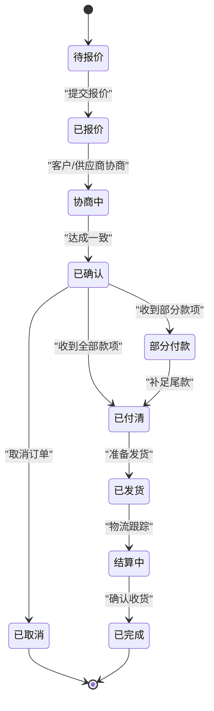
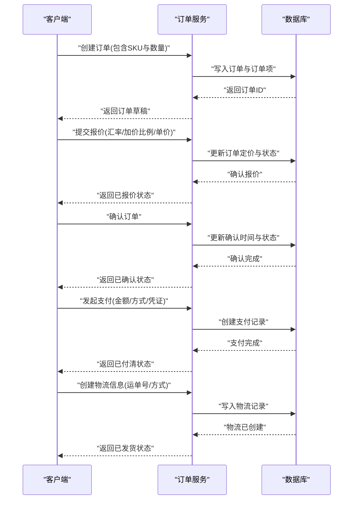
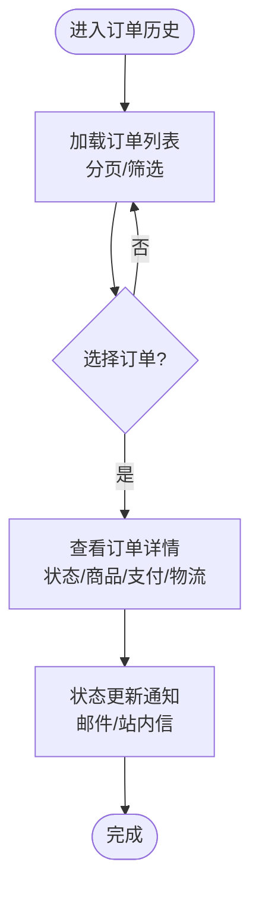
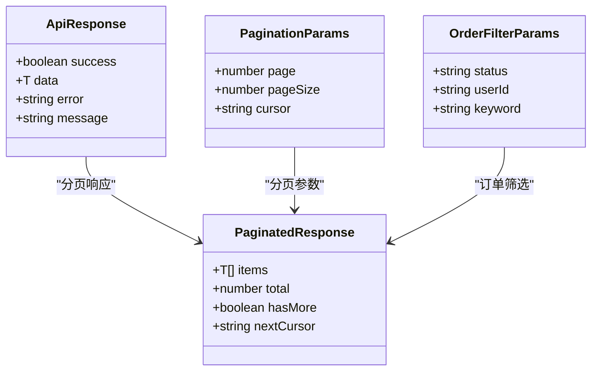
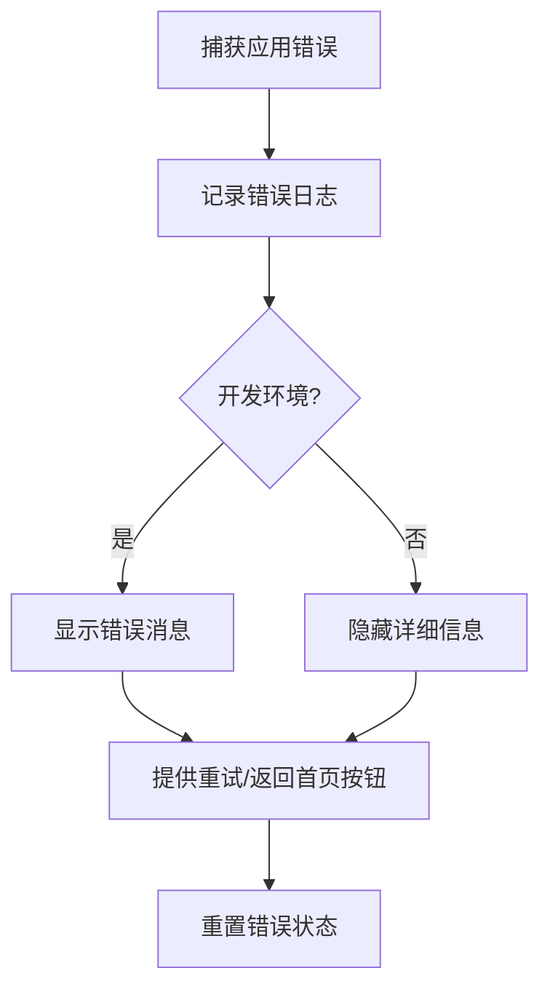
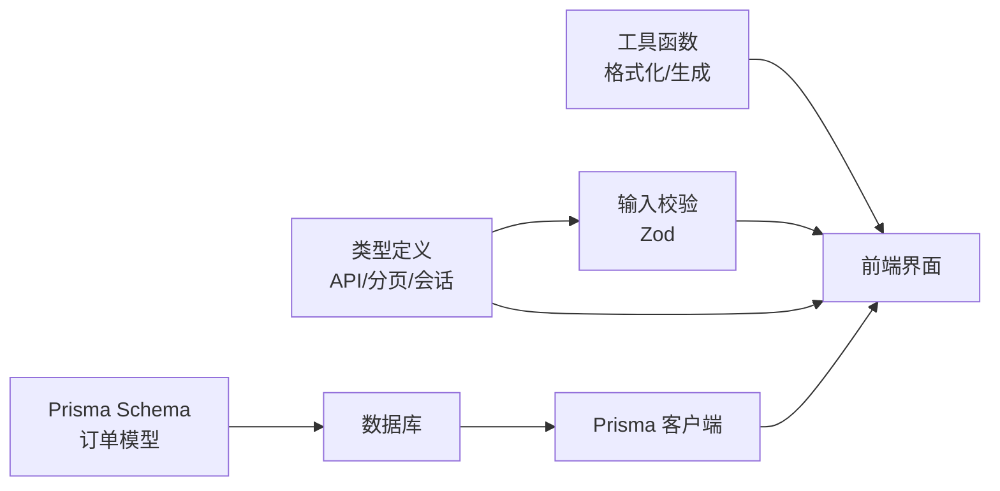

# 订单管理系统

<cite>
**本文档引用的文件**
- [README.md](file://README.md)
- [schema.prisma](file://prisma/schema.prisma)
- [db.ts](file://src/lib/db.ts)
- [constants.ts](file://src/lib/constants.ts)
- [utils.ts](file://src/lib/utils.ts)
- [order.ts](file://src/lib/validations/order.ts)
- [error.tsx](file://src/app/error.tsx)
- [index.ts](file://src/types/index.ts)
</cite>

## 目录
1. [简介](#简介)
2. [项目结构](#项目结构)
3. [核心组件](#核心组件)
4. [架构概览](#架构概览)
5. [详细组件分析](#详细组件分析)
6. [依赖关系分析](#依赖关系分析)
7. [性能考虑](#性能考虑)
8. [故障排除指南](#故障排除指南)
9. [结论](#结论)
10. [附录](#附录)

## 简介
本文件为 Celestia 订单管理系统的技术文档，基于仓库中的 Prisma 数据模型、类型定义与验证规则进行系统性梳理。文档重点覆盖以下方面：
- 订单创建流程：从购物车到报价、确认、支付与发货的完整链路
- 订单状态管理：各状态的流转条件与约束
- 订单历史查看：列表展示、详情查看与状态更新通知
- 数据模型设计：订单、订单项、支付与物流的实体关系
- API 接入与错误处理：输入校验、响应格式与异常恢复
- 最佳实践与用户体验优化建议

## 项目结构
该仓库采用 Next.js App Router 结构，订单相关的核心实现集中在 Prisma Schema、类型定义与验证模块中：
- 数据层：通过 Prisma 定义订单、订单项、支付、物流等模型及枚举
- 类型层：统一的 API 响应格式、分页参数与会话用户类型
- 校验层：使用 Zod 对订单创建与报价提交进行输入校验
- 工具层：价格格式化、日期格式化与订单号生成工具函数
- 错误处理：全局错误边界组件，提供开发环境下的错误展示与重试机制



**图表来源**
- [db.ts:1-18](file://src/lib/db.ts#L1-L18)
- [schema.prisma:1-281](file://prisma/schema.prisma#L1-L281)
- [index.ts:1-60](file://src/types/index.ts#L1-L60)
- [order.ts:1-22](file://src/lib/validations/order.ts#L1-L22)
- [utils.ts:1-32](file://src/lib/utils.ts#L1-L32)
- [constants.ts:1-46](file://src/lib/constants.ts#L1-L46)
- [error.tsx:1-62](file://src/app/error.tsx#L1-L62)

**章节来源**
- [README.md:1-37](file://README.md#L1-L37)
- [schema.prisma:1-281](file://prisma/schema.prisma#L1-L281)
- [db.ts:1-18](file://src/lib/db.ts#L1-L18)
- [index.ts:1-60](file://src/types/index.ts#L1-L60)
- [order.ts:1-22](file://src/lib/validations/order.ts#L1-L22)
- [utils.ts:1-32](file://src/lib/utils.ts#L1-L32)
- [constants.ts:1-46](file://src/lib/constants.ts#L1-L46)
- [error.tsx:1-62](file://src/app/error.tsx#L1-L62)

## 核心组件
- 数据模型与枚举：订单状态、订单项状态、支付方式、物流方式等均在 Prisma Schema 中定义，确保数据库层面的一致性与可维护性
- 输入校验：使用 Zod 对订单创建与报价提交进行严格校验，避免非法数据进入业务流程
- 类型系统：统一的 API 响应格式、分页参数与会话用户类型，便于前后端协作
- 工具函数：价格格式化、日期格式化与订单号生成，提升用户体验与数据一致性
- 错误处理：全局错误边界组件，提供开发环境下的错误展示与重试机制

**章节来源**
- [schema.prisma:49-83](file://prisma/schema.prisma#L49-L83)
- [order.ts:1-22](file://src/lib/validations/order.ts#L1-L22)
- [index.ts:1-60](file://src/types/index.ts#L1-L60)
- [utils.ts:8-31](file://src/lib/utils.ts#L8-L31)
- [error.tsx:12-62](file://src/app/error.tsx#L12-L62)

## 架构概览
订单管理系统的整体架构围绕“数据模型 → 类型与校验 → 工具函数 → 应用层”的层次化设计展开。Prisma 作为 ORM 层负责与 PostgreSQL 的交互；类型与校验模块确保数据质量；工具函数提供一致的格式化与生成逻辑；应用层通过全局错误边界提升稳定性。



**图表来源**
- [db.ts:1-18](file://src/lib/db.ts#L1-L18)
- [schema.prisma:1-281](file://prisma/schema.prisma#L1-L281)
- [order.ts:1-22](file://src/lib/validations/order.ts#L1-L22)
- [index.ts:1-60](file://src/types/index.ts#L1-L60)
- [constants.ts:1-46](file://src/lib/constants.ts#L1-L46)
- [error.tsx:1-62](file://src/app/error.tsx#L1-L62)

## 详细组件分析

### 数据模型设计
订单相关的数据模型包含 Order、OrderItem、Payment、Shipping 四个核心实体，以及多个枚举类型用于状态与分类控制。模型间通过外键关联，形成清晰的订单生命周期数据结构。

```mermaid
erDiagram
USER {
string id PK
string phone UK
string name
string company
enum role
enum status
decimal markup_ratio
string preferred_lang
datetime created_at
datetime updated_at
}
ORDER {
string id PK
string order_no UK
string user_id FK
enum status
decimal exchange_rate
decimal markup_ratio
decimal total_cny
decimal total_sar
decimal override_total_sar
decimal settlement_total_cny
decimal settlement_total_sar
string settlement_note
decimal shipping_cost_cny
datetime created_at
datetime updated_at
datetime confirmed_at
datetime completed_at
}
ORDER_ITEM {
string id PK
string order_id FK
string sku_id FK
string product_name_snapshot
string sku_desc_snapshot
int quantity
decimal unit_price_cny
decimal unit_price_sar
enum item_status
int settlement_qty
decimal settlement_price_cny
string settlement_note
datetime created_at
datetime updated_at
}
PAYMENT {
string id PK
string order_id FK
decimal amount_sar
enum method
string proof_url
string note
datetime confirmed_at
datetime created_at
}
SHIPPING {
string id PK
string order_id UK FK
string tracking_no
string tracking_url
enum method
string note
datetime created_at
datetime updated_at
}
USER ||--o{ ORDER : "has"
ORDER ||--o{ ORDER_ITEM : "contains"
ORDER ||--o{ PAYMENT : "has"
ORDER ||--|| SHIPPING : "ships"
```

**图表来源**
- [schema.prisma:89-280](file://prisma/schema.prisma#L89-L280)

**章节来源**
- [schema.prisma:89-280](file://prisma/schema.prisma#L89-L280)

### 订单状态管理机制
系统定义了完整的订单状态与订单项状态体系，支持报价、协商、确认、支付、发货、结算与完成等阶段。状态变更遵循严格的业务规则，确保订单生命周期的可控性与可追溯性。



**图表来源**
- [schema.prisma:49-77](file://prisma/schema.prisma#L49-L77)
- [constants.ts:1-23](file://src/lib/constants.ts#L1-L23)

**章节来源**
- [schema.prisma:49-77](file://prisma/schema.prisma#L49-L77)
- [constants.ts:1-23](file://src/lib/constants.ts#L1-L23)

### 订单创建流程
订单创建流程从购物车开始，经过报价、确认、支付与发货，最终完成结算。流程中的关键节点包括：
- 购物车结算：收集商品 SKU、数量与备注，生成订单草稿
- 收货地址填写：由前端表单收集并传递至后端（当前仓库未包含具体实现，需在后续扩展）
- 支付方式选择：支持银行转账、Western Union、现金与其他方式
- 订单确认步骤：提交报价、确认订单、生成支付记录与物流信息



**图表来源**
- [order.ts:3-19](file://src/lib/validations/order.ts#L3-L19)
- [schema.prisma:250-264](file://prisma/schema.prisma#L250-L264)
- [schema.prisma:266-280](file://prisma/schema.prisma#L266-L280)

**章节来源**
- [order.ts:3-19](file://src/lib/validations/order.ts#L3-L19)
- [schema.prisma:250-264](file://prisma/schema.prisma#L250-L264)
- [schema.prisma:266-280](file://prisma/schema.prisma#L266-L280)

### 订单历史查看功能
订单历史查看功能包括订单列表展示、订单详情查看与状态更新通知。当前仓库提供了分页参数与过滤条件的类型定义，便于在前端实现列表与详情页面。



**图表来源**
- [index.ts:34-39](file://src/types/index.ts#L34-L39)
- [index.ts:9-22](file://src/types/index.ts#L9-L22)

**章节来源**
- [index.ts:34-39](file://src/types/index.ts#L34-L39)
- [index.ts:9-22](file://src/types/index.ts#L9-L22)

### API 接口集成
系统采用统一的 API 响应格式，支持分页与游标查询。订单相关的筛选参数包括状态、用户 ID 与关键字搜索，便于在管理端与前端实现灵活的数据检索。



**图表来源**
- [index.ts:1-7](file://src/types/index.ts#L1-L7)
- [index.ts:9-22](file://src/types/index.ts#L9-L22)
- [index.ts:34-39](file://src/types/index.ts#L34-L39)

**章节来源**
- [index.ts:1-7](file://src/types/index.ts#L1-L7)
- [index.ts:9-22](file://src/types/index.ts#L9-L22)
- [index.ts:34-39](file://src/types/index.ts#L34-L39)

### 错误处理与异常情况
系统提供了全局错误边界组件，在开发环境下展示错误信息并允许用户重试或返回首页。同时，Prisma 在开发模式下输出查询、错误与警告日志，便于定位问题。



**图表来源**
- [error.tsx:12-62](file://src/app/error.tsx#L12-L62)
- [db.ts:12-15](file://src/lib/db.ts#L12-L15)

**章节来源**
- [error.tsx:12-62](file://src/app/error.tsx#L12-L62)
- [db.ts:12-15](file://src/lib/db.ts#L12-L15)

## 依赖关系分析
订单管理系统的依赖关系主要体现在数据模型与类型系统之间，Prisma Schema 为底层数据结构提供约束，类型定义与校验模块为上层业务提供契约保障。



**图表来源**
- [schema.prisma:1-281](file://prisma/schema.prisma#L1-L281)
- [index.ts:1-60](file://src/types/index.ts#L1-L60)
- [order.ts:1-22](file://src/lib/validations/order.ts#L1-L22)
- [utils.ts:1-32](file://src/lib/utils.ts#L1-L32)
- [db.ts:1-18](file://src/lib/db.ts#L1-L18)

**章节来源**
- [schema.prisma:1-281](file://prisma/schema.prisma#L1-L281)
- [index.ts:1-60](file://src/types/index.ts#L1-L60)
- [order.ts:1-22](file://src/lib/validations/order.ts#L1-L22)
- [utils.ts:1-32](file://src/lib/utils.ts#L1-L32)
- [db.ts:1-18](file://src/lib/db.ts#L1-L18)

## 性能考虑
- 数据库索引：订单模型对用户 ID 与状态建立索引，有助于提高查询效率
- 日志级别：开发环境开启详细日志，生产环境仅记录错误与警告，降低日志开销
- 分页与游标：提供分页与游标参数，支持大数据量场景下的高效检索
- 格式化与生成：工具函数对价格与日期进行本地化格式化，减少前端重复计算

**章节来源**
- [schema.prisma:217-218](file://prisma/schema.prisma#L217-L218)
- [db.ts:12-15](file://src/lib/db.ts#L12-L15)
- [index.ts:9-22](file://src/types/index.ts#L9-L22)
- [utils.ts:8-31](file://src/lib/utils.ts#L8-L31)

## 故障排除指南
- 开发环境错误展示：全局错误边界在开发模式下显示错误消息，便于快速定位问题
- 数据库连接：检查 DATABASE_URL 环境变量与连接池配置，确保 Prisma 客户端正常初始化
- 输入校验失败：根据 Zod 校验规则修正请求参数，确保 SKU、数量、汇率与加价比例符合要求
- 状态流转异常：核对订单状态与订单项状态的约束条件，避免违反业务规则的状态变更

**章节来源**
- [error.tsx:12-62](file://src/app/error.tsx#L12-L62)
- [db.ts:9-15](file://src/lib/db.ts#L9-L15)
- [order.ts:3-19](file://src/lib/validations/order.ts#L3-L19)
- [schema.prisma:49-77](file://prisma/schema.prisma#L49-L77)

## 结论
本订单管理系统以 Prisma Schema 为核心，结合类型定义、输入校验与工具函数，构建了清晰、可扩展的订单生命周期管理体系。通过明确的状态流转与统一的 API 响应格式，系统能够有效支撑从购物车到支付、发货与完成的全流程业务需求。建议在后续迭代中完善前端订单历史查看与收货地址填写功能，并持续优化性能与用户体验。

## 附录
- 订单号生成规则：基于日期与随机字符串组合，确保唯一性与可读性
- 支付方式与物流方式：支持多种支付渠道与物流方式，满足国际化业务需求
- 本地化支持：提供多语言与 RTL 语言配置，适配不同地区用户的使用习惯

**章节来源**
- [utils.ts:25-31](file://src/lib/utils.ts#L25-L31)
- [schema.prisma:72-83](file://prisma/schema.prisma#L72-L83)
- [constants.ts:40-46](file://src/lib/constants.ts#L40-L46)