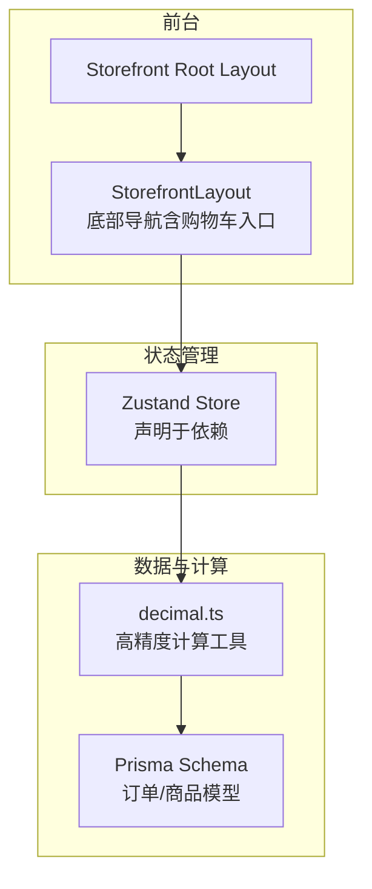
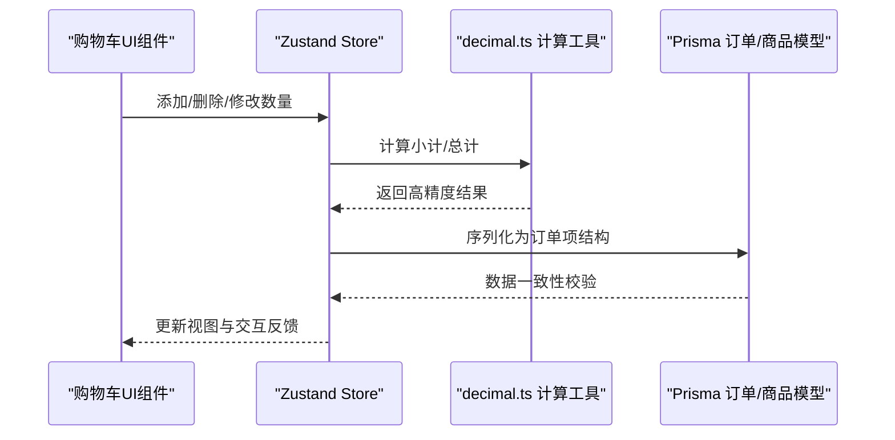
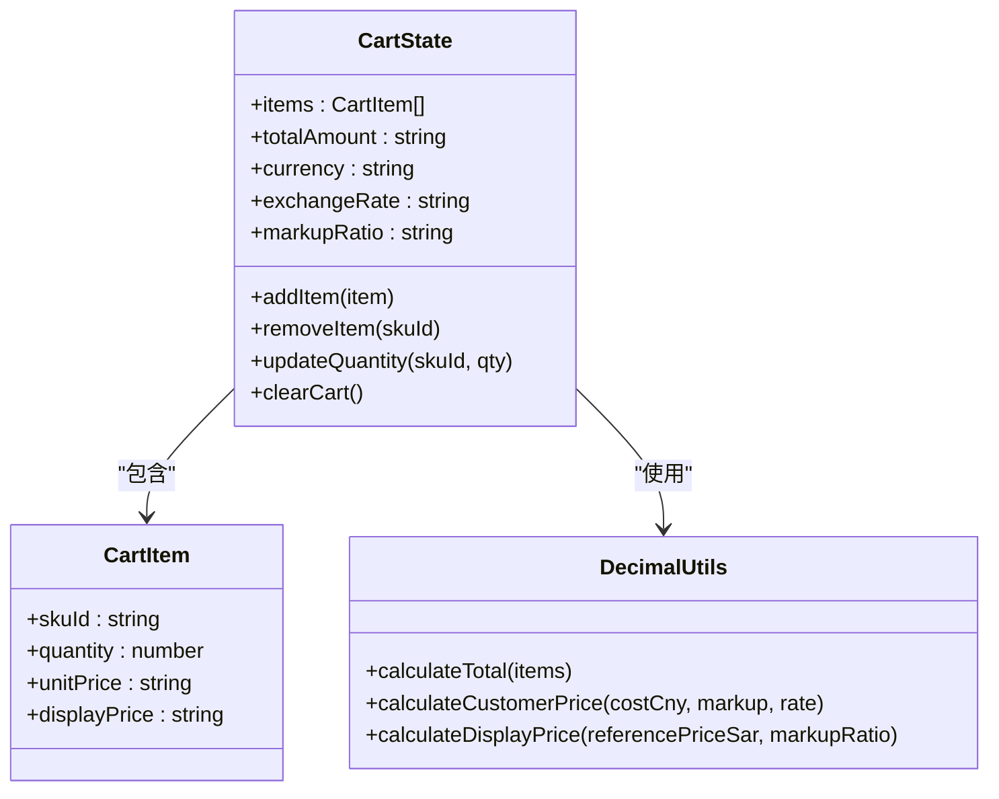
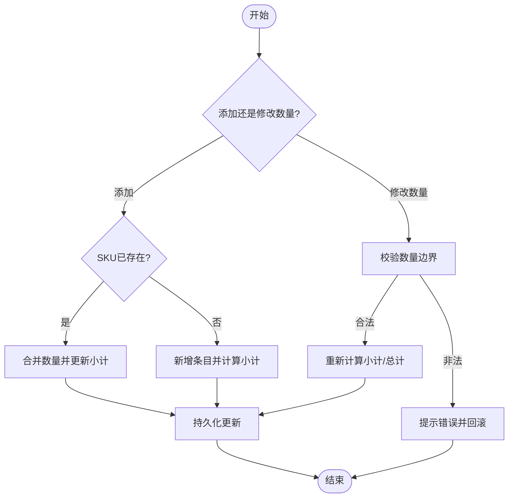
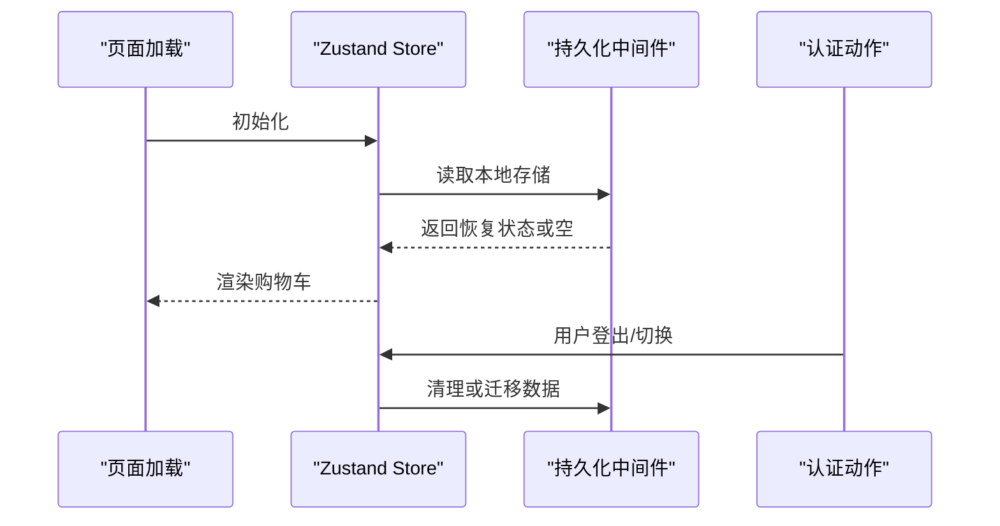
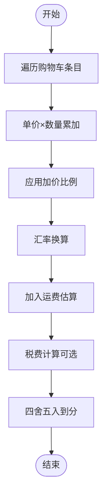
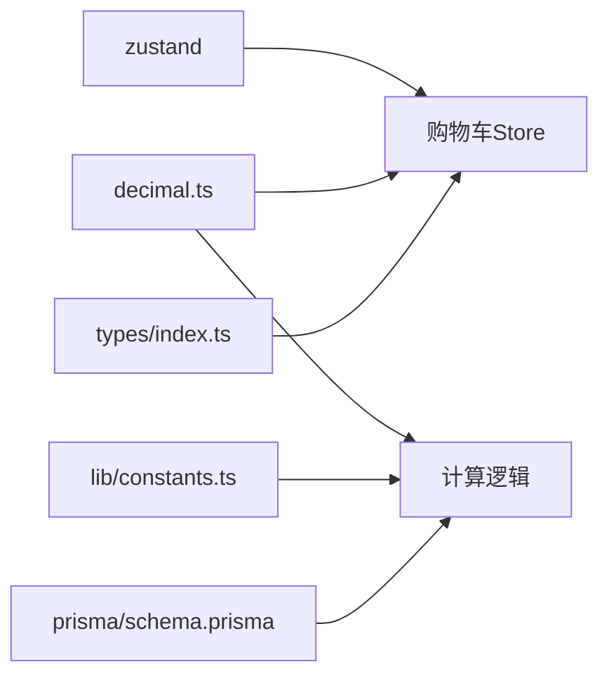

# 购物车系统

<cite>
**本文引用的文件**
- [package.json](file://package.json)
- [src/lib/decimal.ts](file://src/lib/decimal.ts)
- [src/types/index.ts](file://src/types/index.ts)
- [src/components/storefront/storefront-layout.tsx](file://src/components/storefront/storefront-layout.tsx)
- [src/app/[locale]/storefront/layout.tsx](file://src/app/[locale]/storefront/layout.tsx)
- [src/lib/constants.ts](file://src/lib/constants.ts)
- [prisma/schema.prisma](file://prisma/schema.prisma)
- [src/lib/actions/auth.ts](file://src/lib/actions/auth.ts)
</cite>

## 目录
1. [简介](#简介)
2. [项目结构](#项目结构)
3. [核心组件](#核心组件)
4. [架构总览](#架构总览)
5. [详细组件分析](#详细组件分析)
6. [依赖关系分析](#依赖关系分析)
7. [性能考虑](#性能考虑)
8. [故障排查指南](#故障排查指南)
9. [结论](#结论)
10. [附录](#附录)

## 简介
本文件面向Celestia购物车系统的开发者与维护者，系统性梳理Zustand状态管理在购物车中的应用、购物车状态设计、商品添加/删除/数量修改逻辑、持久化策略（本地存储同步与会话存储管理）、计算逻辑（小计、税费、运费、总价）、UI组件与交互反馈，以及扩展性与性能优化建议。由于仓库中未包含具体的Zustand购物车Store实现与UI组件源码，本文基于现有依赖与类型定义进行架构层面的推导与最佳实践说明。

## 项目结构
- 项目采用Next.js App Router结构，前端页面位于src/app，通用组件位于src/components，工具与类型定义位于src/lib与src/types。
- 购物车相关入口与导航位于前台布局组件中，路由指向/storefront/cart。
- 状态管理依赖zustand，已在package.json中声明。
- 订单与商品模型由Prisma schema定义，为购物车与订单结算提供数据基础。

**图表来源**
- [src/components/storefront/storefront-layout.tsx:13-19](file://src/components/storefront/storefront-layout.tsx#L13-L19)
- [src/app/[locale]/storefront/layout.tsx:1-9](file://src/app/[locale]/storefront/layout.tsx#L1-L9)
- [package.json:38](file://package.json#L38)
- [src/lib/decimal.ts:1-96](file://src/lib/decimal.ts#L1-L96)
- [prisma/schema.prisma:188-210](file://prisma/schema.prisma#L188-L210)

**章节来源**
- [src/components/storefront/storefront-layout.tsx:1-37](file://src/components/storefront/storefront-layout.tsx#L1-L37)
- [src/app/[locale]/storefront/layout.tsx:1-9](file://src/app/[locale]/storefront/layout.tsx#L1-L9)
- [package.json:1-52](file://package.json#L1-L52)

## 核心组件
- 状态管理：Zustand v5（声明于依赖），适合轻量到中量级的状态管理，支持中间件（如持久化）与immer。
- 计算工具：decimal.ts提供高精度数学运算，确保价格计算不出现浮点误差。
- 类型与常量：types/index.ts定义会话用户与分页等类型；lib/constants.ts提供订单状态配置。
- 前台布局：storefront-layout.tsx提供底部导航，其中包含“购物车”入口，作为购物车页面的导航锚点。

**章节来源**
- [package.json:38](file://package.json#L38)
- [src/lib/decimal.ts:1-96](file://src/lib/decimal.ts#L1-L96)
- [src/types/index.ts:1-60](file://src/types/index.ts#L1-L60)
- [src/lib/constants.ts:1-22](file://src/lib/constants.ts#L1-L22)
- [src/components/storefront/storefront-layout.tsx:13-19](file://src/components/storefront/storefront-layout.tsx#L13-L19)

## 架构总览
下图展示了从UI到状态管理再到数据计算的整体流程。购物车UI组件通过Zustand读写购物车状态，使用decimal.ts进行金额计算，并与Prisma模型保持一致的数据结构以支撑后续订单生成。

**图表来源**
- [src/lib/decimal.ts:24-36](file://src/lib/decimal.ts#L24-L36)
- [prisma/schema.prisma:188-210](file://prisma/schema.prisma#L188-L210)

## 详细组件分析

### 状态设计与Zustand集成
- 推荐的Zustand Store结构
  - 状态字段：items（数组，包含商品SKU、数量、单价等）、totalAmount、currency、exchangeRate、markupRatio等。
  - 动作函数：addItem、removeItem、updateQuantity、clearCart、persist（结合中间件）。
  - 中间件：使用persist中间件实现本地存储同步；可选combine模式拆分模块。
- 与会话用户信息的耦合
  - 从types/index.ts的SessionUser可知，用户可能携带markupRatio等定价相关字段，可在初始化或切换用户时注入到Store中，影响展示价与最终价计算。
- 与Prisma模型对齐
  - 订单项结构需与Prisma的OrderItem字段保持一致，避免序列化/反序列化错误。

**图表来源**
- [src/lib/decimal.ts:24-36](file://src/lib/decimal.ts#L24-L36)
- [src/lib/decimal.ts:10-22](file://src/lib/decimal.ts#L10-L22)
- [src/lib/decimal.ts:88-95](file://src/lib/decimal.ts#L88-L95)
- [src/types/index.ts:50-60](file://src/types/index.ts#L50-L60)

**章节来源**
- [src/lib/decimal.ts:1-96](file://src/lib/decimal.ts#L1-L96)
- [src/types/index.ts:50-60](file://src/types/index.ts#L50-L60)

### 商品添加/删除/数量修改逻辑
- 添加商品
  - 若SKU已存在：合并数量；否则新增条目。
  - 使用decimal.ts计算displayPrice与小计，保证精度。
- 删除商品
  - 通过skuId定位并移除对应条目。
- 修改数量
  - 校验边界（最小1，库存上限等）；更新后重新计算小计与总计。
- 与会话用户加价比例联动
  - 在addItem/updateQuantity时，根据用户markupRatio动态刷新displayPrice与最终价。

**图表来源**
- [src/lib/decimal.ts:24-36](file://src/lib/decimal.ts#L24-L36)
- [src/lib/decimal.ts:88-95](file://src/lib/decimal.ts#L88-L95)
- [src/types/index.ts:50-60](file://src/types/index.ts#L50-L60)

**章节来源**
- [src/lib/decimal.ts:24-36](file://src/lib/decimal.ts#L24-L36)
- [src/lib/decimal.ts:88-95](file://src/lib/decimal.ts#L88-L95)
- [src/types/index.ts:50-60](file://src/types/index.ts#L50-L60)

### 持久化策略
- 本地存储同步
  - 使用Zustand persist中间件，默认序列化cart状态至localStorage/sessionStorage。
  - 建议仅持久化必要字段（如items、currency），避免存储过大数据。
- 会话存储管理
  - 结合用户登录态（getSession/logout）在用户切换或登出时清理或迁移购物车。
- 数据恢复机制
  - 页面加载时从持久化存储恢复cart；若数据损坏则回退到空状态并记录日志。

**图表来源**
- [src/lib/actions/auth.ts:10-20](file://src/lib/actions/auth.ts#L10-L20)
- [package.json:38](file://package.json#L38)

**章节来源**
- [src/lib/actions/auth.ts:1-20](file://src/lib/actions/auth.ts#L1-L20)
- [package.json:38](file://package.json#L38)

### 计算逻辑
- 小计计算
  - 对每个条目：单价 × 数量，使用decimal.ts累加得到小计。
- 展示价与客户价
  - 展示价：SPU参考价 × 客户加价比例，向上取整到0.1。
  - 客户价：成本价 × 加价比例 × 汇率，向上取整到0.1。
- 预估/实际毛利
  - 预估：成本总价 × (加价比例 - 1) - 运费。
  - 实际：结算等价CNY - 成本总价 - 运费。
- 运费估算
  - 可基于订单总重量、地区、物流方式等计算，最终计入totalAmount。
- 总价汇总
  - 小计 + 运费 ± 其他费用，保留两位小数。

**图表来源**
- [src/lib/decimal.ts:24-36](file://src/lib/decimal.ts#L24-L36)
- [src/lib/decimal.ts:10-22](file://src/lib/decimal.ts#L10-L22)
- [src/lib/decimal.ts:42-52](file://src/lib/decimal.ts#L42-L52)
- [src/lib/decimal.ts:58-68](file://src/lib/decimal.ts#L58-L68)

**章节来源**
- [src/lib/decimal.ts:1-96](file://src/lib/decimal.ts#L1-L96)

### UI组件设计与交互反馈
- 导航与入口
  - 底部导航包含“购物车”，点击进入/cart页面。
- 动画与反馈
  - 建议在添加/删除/数量变更时使用过渡动画与Toast提示，提升交互体验。
- 数据展示
  - 列表项展示SKU、数量、单价、小计；合计区域清晰展示小计、运费、税费、总计。
- 错误处理
  - 数量非法、库存不足、网络异常等情况需给出明确提示。

**章节来源**
- [src/components/storefront/storefront-layout.tsx:13-19](file://src/components/storefront/storefront-layout.tsx#L13-L19)

## 依赖关系分析
- 外部依赖
  - zustand：状态管理核心。
  - decimal.js：高精度计算保障。
- 内部依赖
  - decimal.ts被Store与计算逻辑广泛使用。
  - types/index.ts为会话与分页等类型提供统一定义。
  - lib/constants.ts为订单状态提供配置。
  - prisma/schema.prisma为订单/商品模型提供约束。

**图表来源**
- [package.json:38](file://package.json#L38)
- [src/lib/decimal.ts:1-96](file://src/lib/decimal.ts#L1-L96)
- [src/types/index.ts:1-60](file://src/types/index.ts#L1-L60)
- [src/lib/constants.ts:1-22](file://src/lib/constants.ts#L1-L22)
- [prisma/schema.prisma:188-210](file://prisma/schema.prisma#L188-L210)

**章节来源**
- [package.json:1-52](file://package.json#L1-L52)
- [src/lib/decimal.ts:1-96](file://src/lib/decimal.ts#L1-L96)
- [src/types/index.ts:1-60](file://src/types/index.ts#L1-L60)
- [src/lib/constants.ts:1-22](file://src/lib/constants.ts#L1-L22)
- [prisma/schema.prisma:188-210](file://prisma/schema.prisma#L188-L210)

## 性能考虑
- 状态粒度
  - 将items与聚合值（如totalAmount）分离，减少不必要的重渲染。
- 计算缓存
  - 对单价、汇率、加价比例等稳定值进行缓存，避免重复计算。
- 持久化策略
  - 仅持久化必要字段；对大对象采用分片或延迟加载。
- 动画与渲染
  - 使用React.memo与浅比较优化列表渲染；动画时长控制在合理范围。
- 并发与防抖
  - 数量修改频繁触发时，使用节流/防抖降低计算压力。

## 故障排查指南
- 计算结果异常
  - 检查decimal.ts的精度配置与取整策略是否一致。
- 本地存储异常
  - 清理localStorage/sessionStorage后重试；检查持久化中间件配置。
- 用户切换导致数据错乱
  - 在getSession/logout时清理或迁移购物车数据。
- 订单模型不匹配
  - 对照prisma/schema.prisma核对字段类型与命名。

**章节来源**
- [src/lib/decimal.ts:1-96](file://src/lib/decimal.ts#L1-L96)
- [src/lib/actions/auth.ts:10-20](file://src/lib/actions/auth.ts#L10-L20)
- [prisma/schema.prisma:188-210](file://prisma/schema.prisma#L188-L210)

## 结论
本方案以Zustand为核心，结合decimal.js高精度计算与Prisma模型约束，构建了可扩展、可维护的购物车系统。通过合理的状态设计、持久化策略与UI交互反馈，能够满足从商品添加到结算的完整业务闭环。建议在后续迭代中完善具体Store实现与UI组件源码，确保与本文架构保持一致。

## 附录
- 相关类型与常量
  - 会话用户类型：见types/index.ts。
  - 订单状态配置：见lib/constants.ts。
- 数据模型参考
  - 订单与订单项模型：见prisma/schema.prisma。

**章节来源**
- [src/types/index.ts:50-60](file://src/types/index.ts#L50-L60)
- [src/lib/constants.ts:1-22](file://src/lib/constants.ts#L1-L22)
- [prisma/schema.prisma:188-210](file://prisma/schema.prisma#L188-L210)