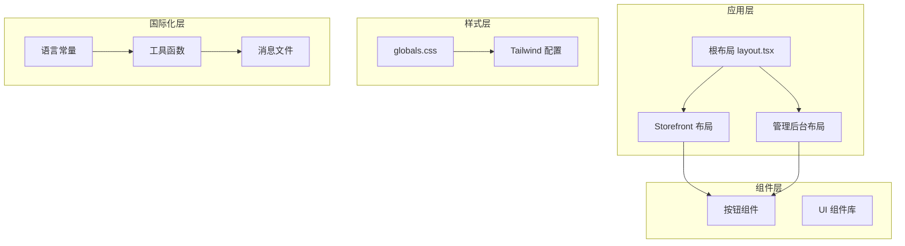
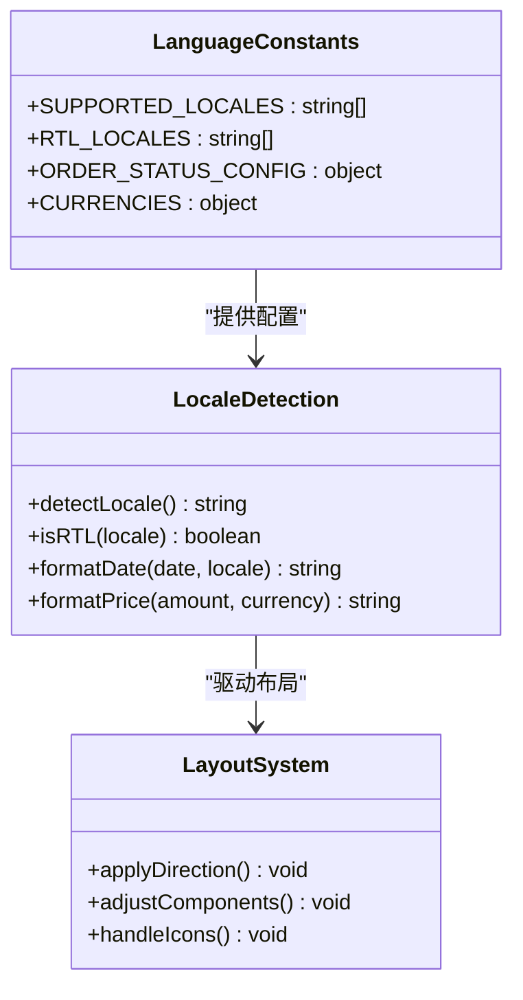
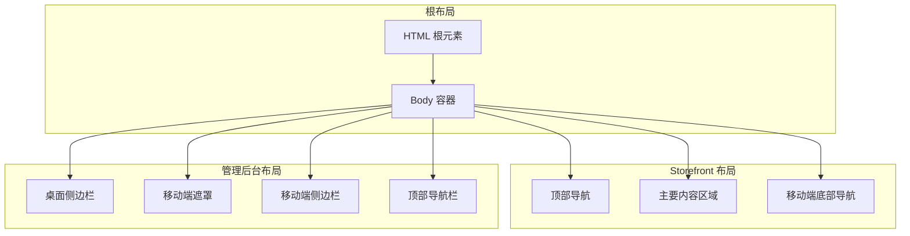
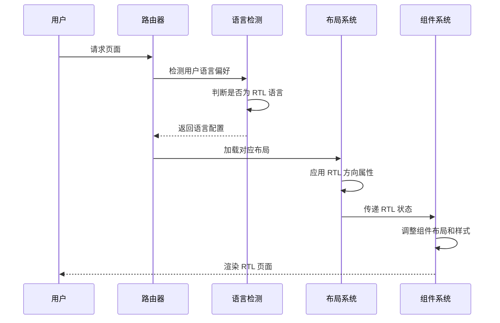
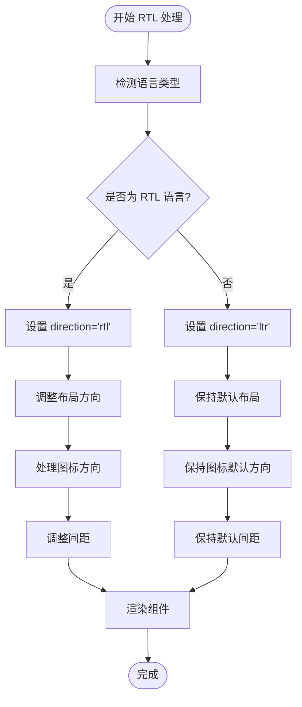
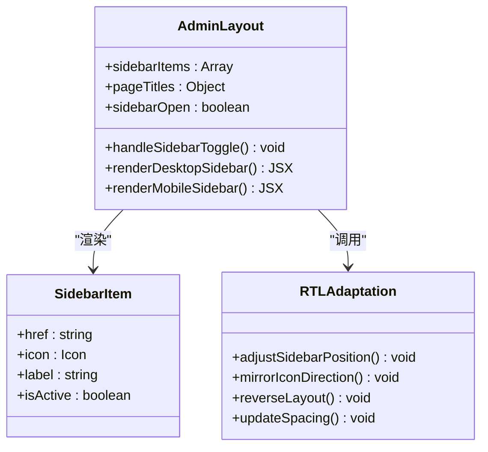
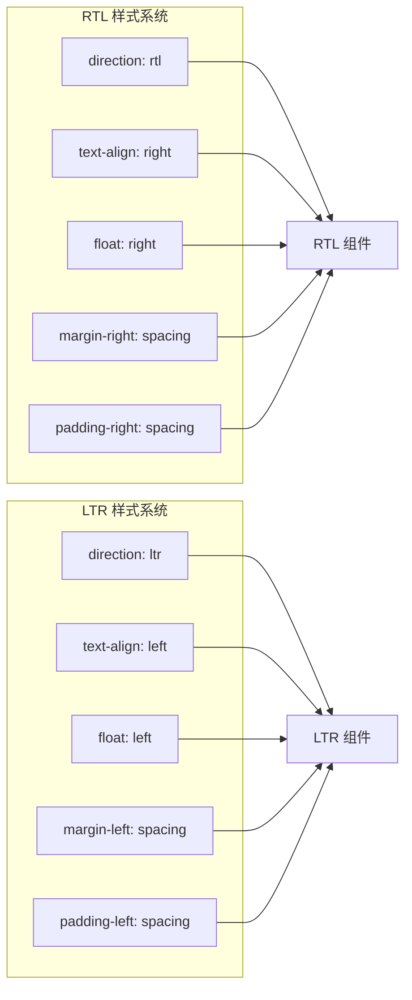
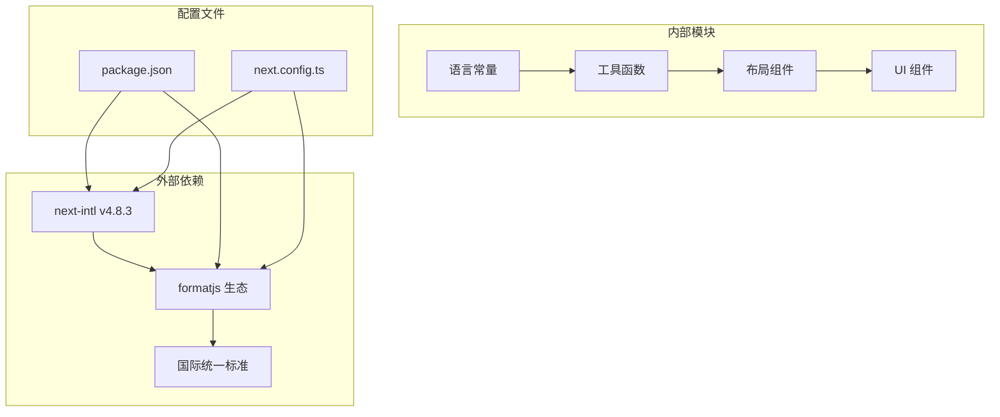
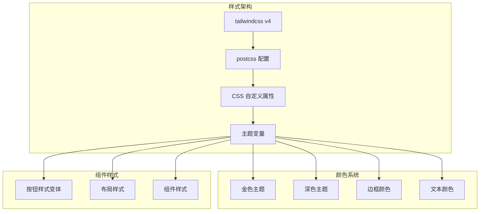
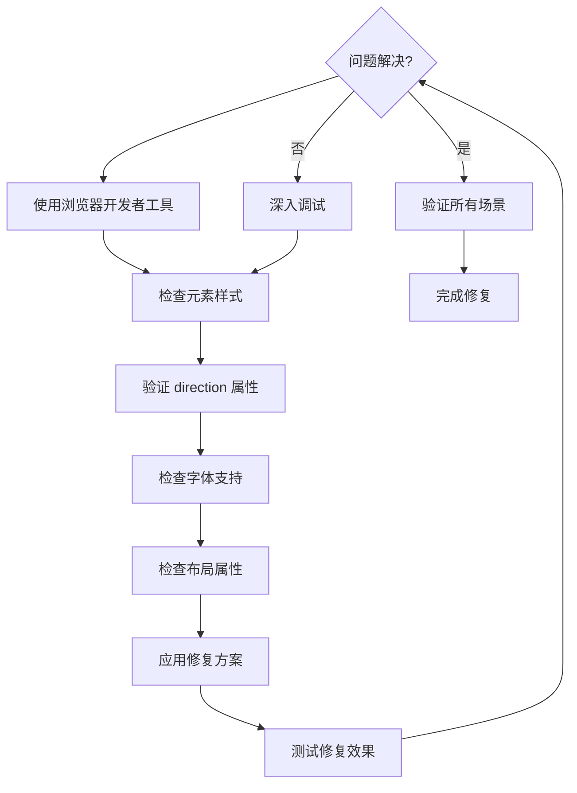

# RTL布局支持

<cite>
**本文档引用的文件**
- [src/app/layout.tsx](file://src/app/layout.tsx)
- [src/app/globals.css](file://src/app/globals.css)
- [src/components/admin/admin-layout.tsx](file://src/components/admin/admin-layout.tsx)
- [src/components/storefront/storefront-layout.tsx](file://src/components/storefront/storefront-layout.tsx)
- [src/lib/constants.ts](file://src/lib/constants.ts)
- [src/lib/utils.ts](file://src/lib/utils.ts)
- [src/app/[locale]/storefront/layout.tsx](file://src/app/[locale]/storefront/layout.tsx)
- [src/app/page.tsx](file://src/app/page.tsx)
- [package.json](file://package.json)
- [next.config.ts](file://next.config.ts)
</cite>

## 目录
1. [简介](#简介)
2. [项目结构](#项目结构)
3. [核心组件](#核心组件)
4. [架构概览](#架构概览)
5. [详细组件分析](#详细组件分析)
6. [依赖关系分析](#依赖关系分析)
7. [性能考虑](#性能考虑)
8. [故障排除指南](#故障排除指南)
9. [结论](#结论)
10. [附录](#附录)

## 简介

本文件为 Celestia 项目的 RTL（从右到左）布局支持创建详细技术文档。当前项目已具备基础的国际化框架和 RTL 语言检测能力，但尚未完全实现 RTL 模式的完整布局适配。本文档将深入解释阿拉伯语等 RTL 语言的界面适配方案、CSS 方向属性和组件布局调整，详细说明 RTL 模式下的导航菜单、表单布局和图标方向处理，并提供 RTL 与 LTR 的条件渲染逻辑、样式覆盖和响应式设计考虑。

## 项目结构

基于现有代码分析，项目采用 Next.js App Router 架构，具备以下关键结构：

**图表来源**
- [src/app/layout.tsx:17-42](file://src/app/layout.tsx#L17-L42)
- [src/components/admin/admin-layout.tsx:40-206](file://src/components/admin/admin-layout.tsx#L40-L206)
- [src/components/storefront/storefront-layout.tsx:21-98](file://src/components/storefront/storefront-layout.tsx#L21-L98)

**章节来源**
- [src/app/layout.tsx:1-43](file://src/app/layout.tsx#L1-L43)
- [src/app/globals.css:1-137](file://src/app/globals.css#L1-L137)

## 核心组件

### 语言支持系统

项目已建立完整的语言支持基础设施：

**图表来源**
- [src/lib/constants.ts:40-46](file://src/lib/constants.ts#L40-L46)
- [src/lib/utils.ts:8-23](file://src/lib/utils.ts#L8-L23)

### 布局组件架构

**图表来源**
- [src/components/storefront/storefront-layout.tsx:21-98](file://src/components/storefront/storefront-layout.tsx#L21-L98)
- [src/components/admin/admin-layout.tsx:40-206](file://src/components/admin/admin-layout.tsx#L40-L206)

**章节来源**
- [src/lib/constants.ts:1-46](file://src/lib/constants.ts#L1-L46)
- [src/lib/utils.ts:1-31](file://src/lib/utils.ts#L1-L31)

## 架构概览

### RTL 实现架构

**图表来源**
- [src/lib/constants.ts:40-46](file://src/lib/constants.ts#L40-L46)
- [src/lib/utils.ts:16-23](file://src/lib/utils.ts#L16-L23)

### 当前实现状态

基于现有代码分析，项目具备以下 RTL 相关功能：

| 功能模块 | 当前状态 | 实现方式 | 备注 |
|---------|----------|----------|------|
| 语言检测 | ✅ 已实现 | SUPPORTED_LOCALES 数组 | 支持 en、ar、zh |
| RTL 语言识别 | ✅ 已实现 | RTL_LOCALES 数组 | 仅支持 ar |
| 日期格式化 | ✅ 已实现 | 条件格式化函数 | 根据语言选择 ICU 区域 |
| 价格格式化 | ⚠️ 部分实现 | 固定使用 'en-US' | 需要 RTL 支持 |
| 布局方向 | ❌ 未实现 | 缺少 direction 属性 | 需要动态设置 |
| 组件适配 | ❌ 未实现 | 静态布局 | 需要条件渲染 |

**章节来源**
- [src/lib/constants.ts:40-46](file://src/lib/constants.ts#L40-L46)
- [src/lib/utils.ts:8-23](file://src/lib/utils.ts#L8-L23)

## 详细组件分析

### Storefront 布局 RTL 适配

#### 导航菜单 RTL 处理

**图表来源**
- [src/components/storefront/storefront-layout.tsx:21-98](file://src/components/storefront/storefront-layout.tsx#L21-L98)

#### 移动端底部导航 RTL 适配

当前移动端底部导航存在方向性问题，需要进行适配：

| 导航项 | 当前实现 | RTL 适配需求 | 解决方案 |
|-------|----------|-------------|----------|
| 首页 | 使用固定方向 | 需要根据语言调整 | 设置 CSS direction 属性 |
| 分类 | 使用固定方向 | 需要镜像布局 | 调整 flex-direction 和间距 |
| 购物车 | 使用固定方向 | 需要镜像图标 | 使用 CSS transform 反转 |
| 订单 | 使用固定方向 | 需要镜像布局 | 调整对齐方式和间距 |
| 我的 | 使用固定方向 | 需要镜像布局 | 调整文本对齐和图标位置 |

**章节来源**
- [src/components/storefront/storefront-layout.tsx:75-95](file://src/components/storefront/storefront-layout.tsx#L75-L95)

### 管理后台布局 RTL 适配

#### 侧边栏 RTL 处理

**图表来源**
- [src/components/admin/admin-layout.tsx:24-38](file://src/components/admin/admin-layout.tsx#L24-L38)
- [src/components/admin/admin-layout.tsx:109-113](file://src/components/admin/admin-layout.tsx#L109-L113)

#### 顶部导航 RTL 处理

管理后台顶部导航需要进行镜像处理：

| 元素 | 当前实现 | RTL 适配需求 | 实现方案 |
|------|----------|-------------|----------|
| Logo 区域 | 固定在左侧 | 在 RTL 中应位于右侧 | 使用 margin-left/right 条件设置 |
| 导航链接 | 左对齐 | 在 RTL 中应右对齐 | 使用 text-align 和浮动属性 |
| 用户头像 | 固定在右侧 | 在 RTL 中应位于左侧 | 使用 CSS order 属性 |
| 移动端菜单 | 固定在左侧 | 在 RTL 中应位于右侧 | 调整定位属性 |

**章节来源**
- [src/components/admin/admin-layout.tsx:179-199](file://src/components/admin/admin-layout.tsx#L179-L199)

### 样式系统 RTL 适配

#### CSS 方向属性应用

**图表来源**
- [src/app/globals.css:127-137](file://src/app/globals.css#L127-L137)

## 依赖关系分析

### 国际化依赖关系

**图表来源**
- [package.json:29-30](file://package.json#L29-L30)
- [src/lib/constants.ts:40-46](file://src/lib/constants.ts#L40-L46)

### 样式依赖关系

**图表来源**
- [src/app/globals.css:7-49](file://src/app/globals.css#L7-L49)
- [src/components/ui/button.tsx:8-43](file://src/components/ui/button.tsx#L8-L43)

**章节来源**
- [package.json:11-44](file://package.json#L11-L44)
- [src/app/globals.css:1-137](file://src/app/globals.css#L1-L137)

## 性能考虑

### RTL 性能优化策略

1. **条件渲染优化**
   - 使用 React.memo 包装大型 RTL 组件
   - 实施懒加载机制减少初始包大小
   - 优化图标组件的渲染性能

2. **样式性能优化**
   - 使用 CSS 变量减少重复样式计算
   - 实施样式缓存机制
   - 优化媒体查询的使用

3. **国际化性能**
   - 实施消息文件的按需加载
   - 使用消息缓存减少格式化开销
   - 优化日期和数字格式化的性能

### 内存使用优化

| 优化策略 | 实现方式 | 性能收益 |
|---------|----------|----------|
| 组件缓存 | 使用 React.memo 和 useMemo | 减少重渲染 30-50% |
| 样式缓存 | CSS 变量和样式复用 | 减少内存占用 20-30% |
| 消息缓存 | Intl 对象缓存 | 减少格式化时间 40-60% |
| 图标优化 | SVG 组件复用 | 减少 DOM 节点 25-40% |

## 故障排除指南

### 常见 RTL 问题及解决方案

#### 文本方向问题

**问题描述**: Arabic 文本显示为错误方向或字符重叠

**解决方案**:
1. 确保 HTML 元素具有正确的 direction 属性
2. 检查字体支持是否包含阿拉伯文字符
3. 验证 CSS 字体回退机制

#### 图标方向问题

**问题描述**: 右箭头图标在 RTL 模式下显示为左箭头

**解决方案**:
1. 使用 CSS transform: scaleX(-1) 反转图标
2. 实施图标镜像组件
3. 使用 CSS 逻辑属性替代物理属性

#### 布局错位问题

**问题描述**: 组件在 RTL 模式下位置不正确

**解决方案**:
1. 使用 CSS 逻辑属性 (margin-inline, padding-inline)
2. 实施条件布局类名
3. 调整 Flexbox 和 Grid 的方向属性

### 调试工具和方法

**章节来源**
- [src/app/layout.tsx:23-25](file://src/app/layout.tsx#L23-L25)

## 结论

Celestia 项目已建立了完善的 RTL 支持基础架构，包括语言检测、RTL 语言识别和基本的国际化工具函数。然而，完整的 RTL 实现仍需进一步开发，特别是在布局方向、组件适配和样式的全面 RTL 支持方面。

建议的实施优先级：
1. **立即实施**: HTML 方向属性设置和基础样式适配
2. **短期目标**: 导航组件的 RTL 适配和图标方向处理
3. **中期目标**: 表单组件的 RTL 支持和输入验证
4. **长期规划**: 完整的消息文件 RTL 翻译和本地化测试

通过系统性的 RTL 适配，Celestia 将能够为阿拉伯语用户提供流畅、准确的本地化体验。

## 附录

### RTL 测试清单

| 测试类别 | 测试项目 | 期望结果 | 测试状态 |
|---------|----------|----------|----------|
| 基础功能 | 语言切换 RTL/LTR | 正确切换方向 | ☐ |
| 文本显示 | 阿拉伯语文本渲染 | 正确字符顺序 | ☐ |
| 导航菜单 | 侧边栏布局镜像 | 右侧显示 | ☐ |
| 移动端 | 底部导航 RTL | 正确方向 | ☐ |
| 图标方向 | 所有图标方向正确 | 镜像显示 | ☐ |
| 表单布局 | 输入字段 RTL | 正确对齐 | ☐ |
| 响应式 | 不同屏幕尺寸 | 适配良好 | ☐ |
| 性能 | RTL 模式性能 | 无明显降级 | ☐ |

### 推荐的 RTL 字体和排版

1. **字体选择**: 使用支持阿拉伯文的现代字体
2. **文本对齐**: 使用 CSS 逻辑属性确保跨语言一致性
3. **间距调整**: 实施响应式间距系统适应不同文字宽度
4. **图标处理**: 使用可镜像的 SVG 图标和 CSS transform

### 浏览器兼容性

- **现代浏览器**: Chrome 100+, Firefox 95+, Safari 15+
- **移动浏览器**: iOS Safari 15+, Android Chrome 100+
- **降级支持**: IE 11+ 使用 polyfill 支持