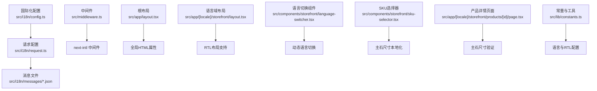
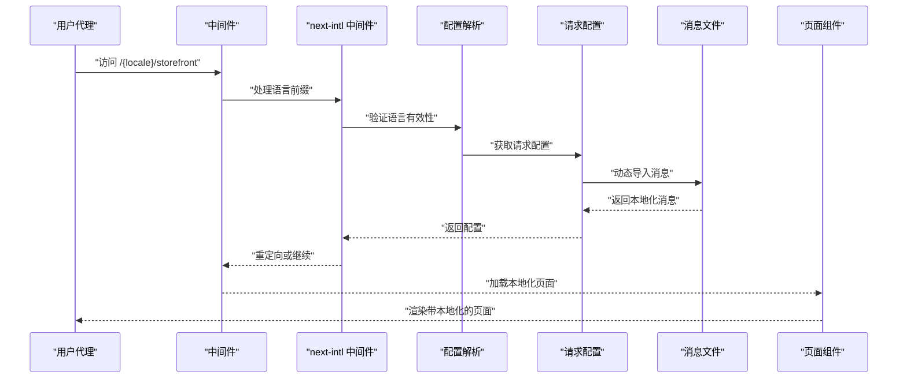
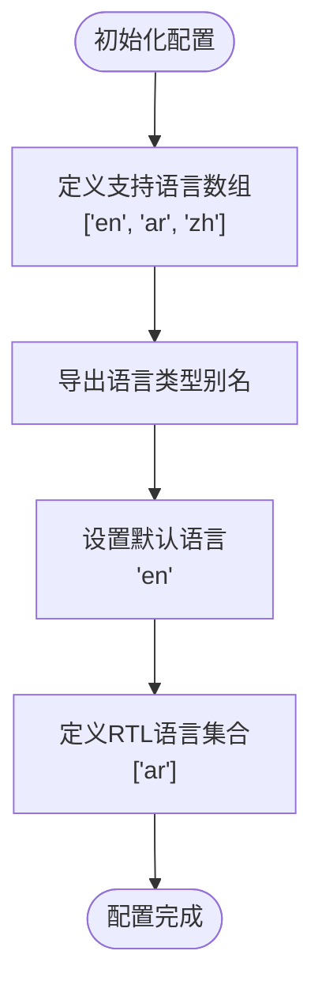
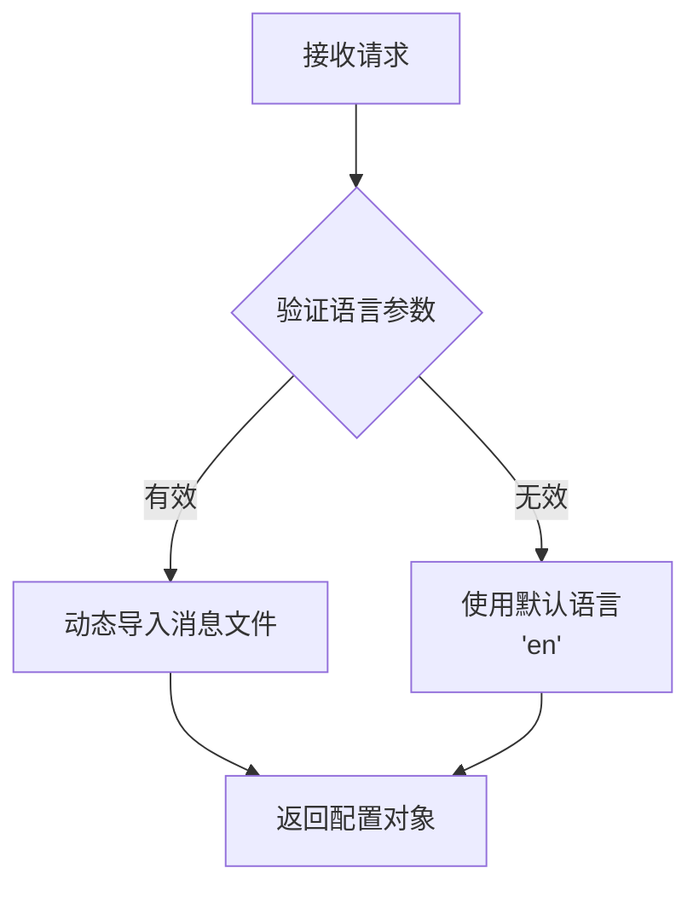
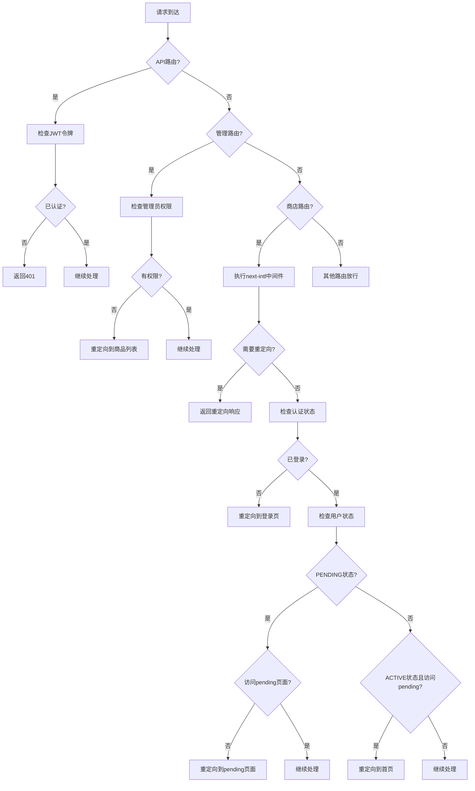
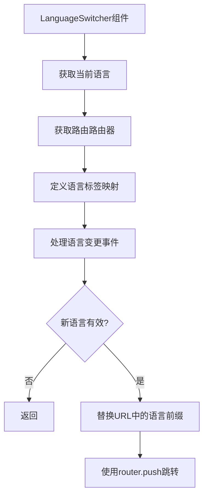
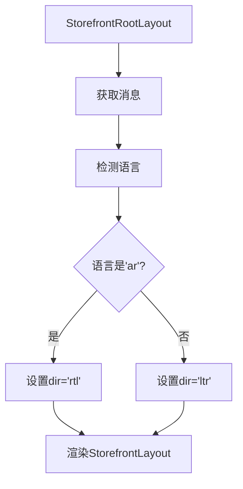

# 国际化系统

<cite>
**本文引用的文件**
- [package.json](file://package.json)
- [next.config.ts](file://next.config.ts)
- [src/app/layout.tsx](file://src/app/layout.tsx)
- [src/app/[locale]/storefront/layout.tsx](file://src/app/[locale]/storefront/layout.tsx)
- [src/components/storefront/storefront-layout.tsx](file://src/components/storefront/storefront-layout.tsx)
- [src/components/storefront/language-switcher.tsx](file://src/components/storefront/language-switcher.tsx)
- [src/components/storefront/sku-selector.tsx](file://src/components/storefront/sku-selector.tsx)
- [src/app/[locale]/storefront/products/[id]/page.tsx](file://src/app/[locale]/storefront/products/[id]/page.tsx)
- [src/lib/constants.ts](file://src/lib/constants.ts)
- [src/lib/utils.ts](file://src/lib/utils.ts)
- [src/i18n/config.ts](file://src/i18n/config.ts)
- [src/i18n/request.ts](file://src/i18n/request.ts)
- [src/middleware.ts](file://src/middleware.ts)
- [src/app/[locale]/storefront/page.tsx](file://src/app/[locale]/storefront/page.tsx)
- [src/app/[locale]/storefront/profile/page.tsx](file://src/app/[locale]/storefront/profile/page.tsx)
- [src/app/[locale]/storefront/cart/page.tsx](file://src/app/[locale]/storefront/cart/page.tsx)
- [src/i18n/messages/en.json](file://src/i18n/messages/en.json)
- [src/i18n/messages/ar.json](file://src/i18n/messages/ar.json)
- [src/i18n/messages/zh.json](file://src/i18n/messages/zh.json)
</cite>

## 更新摘要
**所做更改**
- 更新了国际化系统的完整实现，包括消息文件管理、RTL布局支持和本地化处理
- 新增了主石尺寸相关的翻译键（mainStoneSize、selectMainStoneSize）支持
- 新增了 next-intl 框架的完整集成文档
- 添加了三种语言（英语、阿拉伯语、中文）的消息文件组织和翻译管理
- 完善了路由级国际化和动态语言切换机制
- 增强了 RTL 布局支持和本地化组件设计

## 目录
1. [简介](#简介)
2. [项目结构](#项目结构)
3. [核心组件](#核心组件)
4. [架构总览](#架构总览)
5. [详细组件分析](#详细组件分析)
6. [依赖关系分析](#依赖关系分析)
7. [性能考量](#性能考量)
8. [故障排查指南](#故障排查指南)
9. [结论](#结论)
10. [附录](#附录)

## 简介
本文件为 Celestia 多语言国际化系统的技术文档，现已实现完整的国际化功能，支持英语(en)、阿拉伯语(ar)、中文(zh)三种语言。系统基于 next-intl 框架构建，实现了以下核心功能：

- **路由级国际化**：通过动态路由 [locale] 实现语言域隔离
- **RTL布局支持**：针对阿拉伯语提供从右到左的布局支持
- **消息本地化**：完整的本地化消息管理和动态语言切换
- **时区、货币与数字本地化**：支持多语言环境下的格式化处理
- **组件设计与翻译工作流**：提供完整的国际化组件和翻译管理流程
- **测试策略与质量保障**：建立多语言环境下的测试和质量保证体系

系统已具备完整的基础设施，支持多语言电商应用的国际化需求。

## 项目结构
国际化相关的关键位置与职责如下：



**图表来源**
- [src/i18n/config.ts:1-4](file://src/i18n/config.ts#L1-L4)
- [src/i18n/request.ts:1-21](file://src/i18n/request.ts#L1-L21)
- [src/middleware.ts:34-38](file://src/middleware.ts#L34-L38)
- [src/app/[locale]/storefront/layout.tsx:21-22](file://src/app/[locale]/storefront/layout.tsx#L21-L22)
- [src/components/storefront/language-switcher.tsx:20-31](file://src/components/storefront/language-switcher.tsx#L20-L31)
- [src/components/storefront/sku-selector.tsx:314](file://src/components/storefront/sku-selector.tsx#L314)
- [src/app/[locale]/storefront/products/[id]/page.tsx:187](file://src/app/[locale]/storefront/products/[id]/page.tsx#L187)
- [src/lib/constants.ts:43-49](file://src/lib/constants.ts#L43-L49)

**章节来源**
- [src/i18n/config.ts:1-4](file://src/i18n/config.ts#L1-L4)
- [src/i18n/request.ts:1-21](file://src/i18n/request.ts#L1-L21)
- [src/middleware.ts:34-38](file://src/middleware.ts#L34-L38)
- [src/app/[locale]/storefront/layout.tsx:21-22](file://src/app/[locale]/storefront/layout.tsx#L21-L22)
- [src/components/storefront/language-switcher.tsx:20-31](file://src/components/storefront/language-switcher.tsx#L20-L31)
- [src/lib/constants.ts:43-49](file://src/lib/constants.ts#L43-L49)

## 核心组件
### 语言支持与配置
- **支持语言**：英语(en)、阿拉伯语(ar)、中文(zh)
- **默认语言**：英语(en)
- **RTL语言**：阿拉伯语(ar)
- **类型安全**：通过 TypeScript 类型约束确保语言配置的一致性

### next-intl 框架集成
- **版本**：4.8.3
- **构建插件**：createNextIntlPlugin
- **运行时配置**：getRequestConfig
- **中间件支持**：createIntlMiddleware

### 路由级国际化
- **动态路由**：[locale] 作为语言域前缀
- **语言前缀**：始终包含语言前缀
- **静态参数生成**：为每种语言生成静态路由参数

### RTL布局支持
- **方向检测**：根据语言自动设置 dir 属性
- **布局适配**：阿拉伯语使用 rtl，其他语言使用 ltr
- **样式兼容**：确保组件在 RTL 模式下的正确显示

### 主石尺寸本地化支持
- **翻译键**：mainStoneSize、selectMainStoneSize
- **组件集成**：SKU选择器和产品详情页面
- **多语言支持**：三种语言的消息文件均包含相关翻译

**章节来源**
- [src/i18n/config.ts:1-4](file://src/i18n/config.ts#L1-L4)
- [src/middleware.ts:34-38](file://src/middleware.ts#L34-L38)
- [src/app/[locale]/storefront/layout.tsx:21-22](file://src/app/[locale]/storefront/layout.tsx#L21-L22)
- [src/lib/constants.ts:43-49](file://src/lib/constants.ts#L43-L49)

## 架构总览
下图展示从浏览器请求到页面渲染的完整国际化路径，包括语言检测、路由解析、消息加载与本地化渲染。



**图表来源**
- [src/middleware.ts:40-151](file://src/middleware.ts#L40-L151)
- [src/i18n/request.ts:4-20](file://src/i18n/request.ts#L4-L20)
- [src/app/[locale]/storefront/layout.tsx:11-19](file://src/app/[locale]/storefront/layout.tsx#L11-L19)

## 详细组件分析

### 国际化配置系统
国际化配置系统提供了类型安全的语言定义和默认配置：



**图表来源**
- [src/i18n/config.ts:1-4](file://src/i18n/config.ts#L1-L4)
- [src/lib/constants.ts:43-49](file://src/lib/constants.ts#L43-L49)

**章节来源**
- [src/i18n/config.ts:1-4](file://src/i18n/config.ts#L1-L4)
- [src/lib/constants.ts:43-49](file://src/lib/constants.ts#L43-L49)

### 请求配置与消息加载
请求配置系统负责动态加载对应语言的消息文件：



**图表来源**
- [src/i18n/request.ts:4-20](file://src/i18n/request.ts#L4-L20)

**章节来源**
- [src/i18n/request.ts:4-20](file://src/i18n/request.ts#L4-L20)

### 中间件与路由处理
中间件系统实现了复杂的路由逻辑，包括国际化处理、认证检查和权限控制：



**图表来源**
- [src/middleware.ts:40-151](file://src/middleware.ts#L40-L151)

**章节来源**
- [src/middleware.ts:40-151](file://src/middleware.ts#L40-L151)

### 语言切换组件
语言切换组件提供了用户友好的语言切换界面：



**图表来源**
- [src/components/storefront/language-switcher.tsx:20-31](file://src/components/storefront/language-switcher.tsx#L20-L31)

**章节来源**
- [src/components/storefront/language-switcher.tsx:20-31](file://src/components/storefront/language-switcher.tsx#L20-L31)

### RTL布局支持
RTL布局支持通过动态设置 dir 属性实现：



**图表来源**
- [src/app/[locale]/storefront/layout.tsx:21-22](file://src/app/[locale]/storefront/layout.tsx#L21-L22)

**章节来源**
- [src/app/[locale]/storefront/layout.tsx:21-22](file://src/app/[locale]/storefront/layout.tsx#L21-L22)

### 主石尺寸本地化实现
主石尺寸本地化系统为珠宝产品提供了完整的多语言支持：

#### SKU选择器中的主石尺寸标签
SKU选择器组件使用主石尺寸翻译键显示用户界面：

**章节来源**
- [src/components/storefront/sku-selector.tsx:314](file://src/components/storefront/sku-selector.tsx#L314)

#### 产品详情页面中的主石尺寸验证
产品详情页面在用户未选择主石尺寸时显示相应的错误提示：

**章节来源**
- [src/app/[locale]/storefront/products/[id]/page.tsx:187](file://src/app/[locale]/storefront/products/[id]/page.tsx#L187)

#### 消息文件中的主石尺寸翻译
主石尺寸相关的翻译键已在所有支持的语言中实现：

**章节来源**
- [src/i18n/messages/en.json:59-60](file://src/i18n/messages/en.json#L59-L60)
- [src/i18n/messages/ar.json:59-60](file://src/i18n/messages/ar.json#L59-L60)
- [src/i18n/messages/zh.json:59-60](file://src/i18n/messages/zh.json#L59-L60)

### 页面本地化实现
页面组件展示了如何使用 next-intl 进行本地化：

#### 首页本地化
首页使用多种翻译键实现完整的本地化：

**章节来源**
- [src/app/[locale]/storefront/page.tsx:34-61](file://src/app/[locale]/storefront/page.tsx#L34-L61)
- [src/app/[locale]/storefront/page.tsx:235-239](file://src/app/[locale]/storefront/page.tsx#L235-L239)

#### 购物车页面本地化
购物车页面展示了订单提交和错误处理的本地化：

**章节来源**
- [src/app/[locale]/storefront/cart/page.tsx:27-69](file://src/app/[locale]/storefront/cart/page.tsx#L27-L69)

#### 用户资料页面本地化
用户资料页面展示了多语言界面和语言切换功能：

**章节来源**
- [src/app/[locale]/storefront/profile/page.tsx:29-32](file://src/app/[locale]/storefront/profile/page.tsx#L29-L32)
- [src/app/[locale]/storefront/profile/page.tsx:57-64](file://src/app/[locale]/storefront/profile/page.tsx#L57-L64)

## 依赖关系分析
国际化系统的核心依赖关系如下：

```mermaid
graph TB
subgraph "外部依赖"
N["next-intl@4.8.3"]
PL["next-intl/plugin"]
MW["next-intl/middleware"]
REQ["@formatjs/intl-localematcher"]
PARSER["@formatjs/icu-messageformat-parser"]
NEG["negotiator"]
END["next"]
NUQS["nuqs"]
UI["@radix-ui/react-select"]
END
subgraph "内部模块"
CFG["src/i18n/config.ts"]
REQCFG["src/i18n/request.ts"]
MWCOMP["src/middleware.ts"]
LAYOUT["src/app/[locale]/storefront/layout.tsx"]
SWITCH["src/components/storefront/language-switcher.tsx"]
SKU["src/components/storefront/sku-selector.tsx"]
PRODUCT["src/app/[locale]/storefront/products/[id]/page.tsx"]
CONST["src/lib/constants.ts"]
UTIL["src/lib/utils.ts"]
END
N --> PL
N --> MW
N --> REQ
PL --> REQCFG
MW --> MWCOMP
REQ --> REQCFG
CFG --> REQCFG
REQCFG --> LAYOUT
MWCOMP --> SWITCH
LAYOUT --> SWITCH
SKU --> REQCFG
PRODUCT --> REQCFG
CONST --> LAYOUT
```

**图表来源**
- [package.json:24](file://package.json#L24)
- [src/i18n/config.ts:1-4](file://src/i18n/config.ts#L1-L4)
- [src/i18n/request.ts:1-21](file://src/i18n/request.ts#L1-L21)
- [src/middleware.ts:4-5](file://src/middleware.ts#L4-L5)
- [src/app/[locale]/storefront/layout.tsx:2-5](file://src/app/[locale]/storefront/layout.tsx#L2-L5)
- [src/components/storefront/language-switcher.tsx:1-12](file://src/components/storefront/language-switcher.tsx#L1-L12)
- [src/components/storefront/sku-selector.tsx:6](file://src/components/storefront/sku-selector.tsx#L6)
- [src/app/[locale]/storefront/products/[id]/page.tsx:6](file://src/app/[locale]/storefront/products/[id]/page.tsx#L6)

**章节来源**
- [package.json:24](file://package.json#L24)
- [src/i18n/config.ts:1-4](file://src/i18n/config.ts#L1-L4)
- [src/i18n/request.ts:1-21](file://src/i18n/request.ts#L1-L21)
- [src/middleware.ts:4-5](file://src/middleware.ts#L4-L5)
- [src/app/[locale]/storefront/layout.tsx:2-5](file://src/app/[locale]/storefront/layout.tsx#L2-L5)
- [src/components/storefront/language-switcher.tsx:1-12](file://src/components/storefront/language-switcher.tsx#L1-L12)
- [src/components/storefront/sku-selector.tsx:6](file://src/components/storefront/sku-selector.tsx#L6)
- [src/app/[locale]/storefront/products/[id]/page.tsx:6](file://src/app/[locale]/storefront/products/[id]/page.tsx#L6)

## 性能考量
国际化系统的性能优化策略：

### 消息文件加载优化
- **按需加载**：使用动态导入只加载当前语言的消息文件
- **缓存机制**：next-intl 自动缓存已加载的消息
- **静态生成**：为每种语言生成静态路由参数

### 路由与中间件优化
- **匹配器优化**：精确的路由匹配器减少不必要的中间件执行
- **条件执行**：只有商店路由才执行国际化中间件
- **早期返回**：无效语言或认证失败时立即返回

### 组件渲染优化
- **类型安全**：TypeScript 类型检查减少运行时错误
- **最小化重渲染**：合理的状态管理避免不必要的组件重渲染
- **懒加载**：语言切换组件按需加载

### 主石尺寸本地化优化
- **翻译键复用**：主石尺寸标签和验证消息使用统一的翻译键
- **组件内联翻译**：SKU选择器直接使用翻译键，减少额外的翻译调用
- **错误处理本地化**：用户输入验证错误使用对应的本地化消息

## 故障排查指南
### 常见问题与解决方案

#### 语言显示异常
- **检查路由参数**：确认 URL 中的语言前缀正确
- **验证消息文件**：确保对应语言的消息文件存在且格式正确
- **检查类型定义**：确认语言类型定义与实际使用一致

#### RTL布局问题
- **验证语言检测**：确认 Arabic 语言检测逻辑正确
- **检查CSS样式**：确保RTL相关的CSS规则正确应用
- **测试方向属性**：验证 dir 属性在DOM中正确设置

#### 语言切换失效
- **检查组件状态**：确认 LanguageSwitcher 组件状态正确更新
- **验证路由跳转**：确认 URL 替换逻辑正确执行
- **调试事件处理**：检查 onValueChange 事件处理器

#### 中间件逻辑错误
- **检查认证流程**：验证 JWT 令牌验证逻辑
- **确认权限检查**：确保管理员权限检查正确
- **验证用户状态**：确认 PENDING 和 ACTIVE 状态处理正确

#### 主石尺寸本地化问题
- **检查翻译键存在**：确认 mainStoneSize 和 selectMainStoneSize 翻译键存在于所有语言文件
- **验证组件使用**：确认 SKU选择器和产品详情页面正确使用翻译键
- **测试多语言显示**：在不同语言环境下验证主石尺寸标签和错误消息的正确显示

## 结论
Celestia 国际化系统已实现完整的多语言支持，包括：

- **完整的语言支持**：英语、阿拉伯语、中文三种语言
- **先进的框架集成**：基于 next-intl 的现代化国际化解决方案
- **完善的RTL支持**：针对阿拉伯语的完整布局适配
- **灵活的路由机制**：动态路由与中间件结合的国际化架构
- **类型安全保障**：TypeScript 类型系统确保配置的正确性
- **专业的珠宝产品支持**：主石尺寸相关的完整本地化实现

系统现已具备支撑多语言电商应用的完整能力，包括消息管理、语言切换、RTL布局、本地化处理和专业产品规格的多语言支持。建议继续完善消息文件的翻译质量和测试覆盖，以确保最佳的用户体验。

## 附录

### 消息文件组织结构
建议的消息文件组织方式：
```
src/
└── i18n/
    ├── config.ts          # 语言配置
    ├── request.ts         # 请求配置
    └── messages/
        ├── en.json        # 英文消息（包含mainStoneSize、selectMainStoneSize）
        ├── ar.json        # 阿拉伯语消息（包含mainStoneSize、selectMainStoneSize）
        └── zh.json        # 中文消息（包含mainStoneSize、selectMainStoneSize）
```

### 翻译工作流程
1. **消息提取**：使用 next-intl 提供的工具提取翻译键
2. **翻译管理**：维护每个语言的消息文件，包括主石尺寸相关翻译
3. **本地化测试**：在不同语言环境下测试界面显示，特别关注珠宝产品规格
4. **质量审核**：建立翻译质量审核流程，确保专业术语的准确性

### 测试策略
- **单元测试**：测试语言检测、消息加载、RTL布局和主石尺寸本地化
- **集成测试**：测试完整的国际化流程，包括SKU选择器和产品详情页面
- **端到端测试**：模拟真实用户的语言切换体验和产品选择流程
- **可访问性测试**：确保RTL模式下的可访问性和主石尺寸选择的易用性

### 性能监控
- **加载时间**：监控消息文件的加载性能
- **内存使用**：监控国际化相关的内存占用
- **渲染性能**：监控多语言环境下的渲染效率
- **组件性能**：监控SKU选择器等关键组件的渲染性能

### 主石尺寸本地化最佳实践
- **一致性原则**：确保主石尺寸标签和验证消息在所有语言中保持一致的含义
- **用户体验**：为主石尺寸选择提供清晰的视觉反馈和错误提示
- **可扩展性**：为未来可能增加的珠宝产品规格预留翻译键空间
- **测试覆盖**：确保主石尺寸相关的所有用户交互场景都有对应的本地化支持