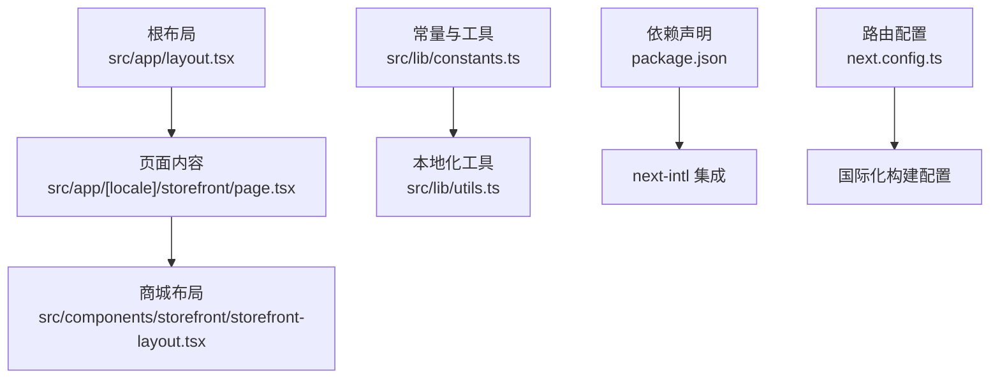
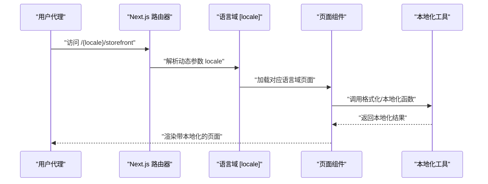
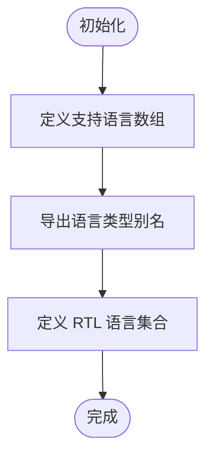
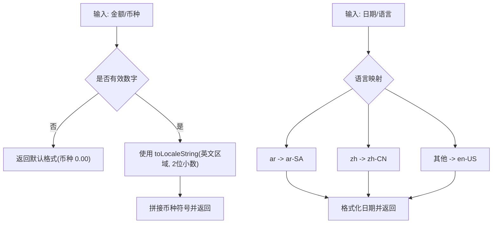
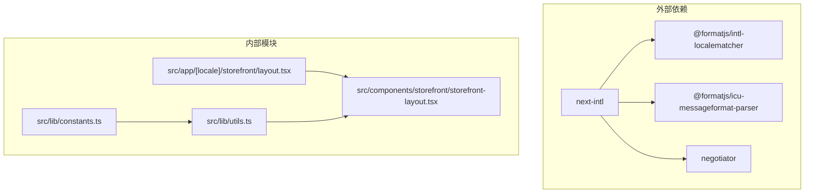

# 国际化系统

<cite>
**本文引用的文件**
- [package.json](file://package.json)
- [next.config.ts](file://next.config.ts)
- [src/app/layout.tsx](file://src/app/layout.tsx)
- [src/app/[locale]/storefront/layout.tsx](file://src/app/[locale]/storefront/layout.tsx)
- [src/components/storefront/storefront-layout.tsx](file://src/components/storefront/storefront-layout.tsx)
- [src/lib/constants.ts](file://src/lib/constants.ts)
- [src/lib/utils.ts](file://src/lib/utils.ts)
</cite>

## 目录
1. [简介](#简介)
2. [项目结构](#项目结构)
3. [核心组件](#核心组件)
4. [架构总览](#架构总览)
5. [详细组件分析](#详细组件分析)
6. [依赖关系分析](#依赖关系分析)
7. [性能考量](#性能考量)
8. [故障排查指南](#故障排查指南)
9. [结论](#结论)
10. [附录](#附录)

## 简介
本文件为 Celestia 多语言国际化系统的技术文档，聚焦以下目标：
- 路由级国际化与语言切换机制
- RTL（从右到左）布局支持
- 消息本地化与动态语言切换
- 时区、货币与数字本地化
- 组件设计与翻译工作流
- 测试策略与质量保障

当前代码库已集成 next-intl 框架，并在常量与工具函数中实现了基础的多语言与 RTL 支持。消息文件尚未在仓库中出现，但已具备完善的基础设施以支撑后续扩展。

## 项目结构
国际化相关的关键位置与职责如下：
- 根布局与全局 HTML 属性：设置默认语言与通用样式
- 路由层国际化：通过动态路由 [locale] 实现语言域隔离
- 商城前端布局：移动端底部导航与文案仍为中文硬编码，需替换为本地化
- 常量与工具：支持语言列表、RTL 语言、货币与日期本地化

图表来源
- [src/app/layout.tsx:17-42](file://src/app/layout.tsx#L17-L42)
- [src/app/[locale]/storefront/layout.tsx:1-9](file://src/app/[locale]/storefront/layout.tsx#L1-L9)
- [src/components/storefront/storefront-layout.tsx:13-19](file://src/components/storefront/storefront-layout.tsx#L13-L19)
- [src/lib/constants.ts:40-45](file://src/lib/constants.ts#L40-L45)
- [src/lib/utils.ts:8-23](file://src/lib/utils.ts#L8-L23)
- [package.json:24](file://package.json#L24)
- [next.config.ts:1-7](file://next.config.ts#L1-L7)

章节来源
- [src/app/layout.tsx:17-42](file://src/app/layout.tsx#L17-L42)
- [src/app/[locale]/storefront/layout.tsx:1-9](file://src/app/[locale]/storefront/layout.tsx#L1-L9)
- [src/lib/constants.ts:40-45](file://src/lib/constants.ts#L40-L45)
- [src/lib/utils.ts:8-23](file://src/lib/utils.ts#L8-L23)
- [package.json:24](file://package.json#L24)
- [next.config.ts:1-7](file://next.config.ts#L1-L7)

## 核心组件
- 语言支持与 RTL
  - 支持语言：英语 en、阿拉伯语 ar、中文 zh
  - RTL 语言：阿拉伯语 ar
  - 通过常量定义与类型约束确保一致性

- 本地化工具
  - 价格格式化：固定使用英文区域设置输出货币符号与小数位
  - 日期格式化：根据语言选择 ar-SA、zh-CN 或 en-US 区域
  - 订单号生成：保持统一格式，不涉及区域化

- 路由级国际化
  - 动态路由 [locale] 作为语言域前缀
  - 子路由如 /storefront 下的页面按语言域加载

- 全局根布局
  - 设置 html lang="en" 作为默认语言占位
  - 提供全局样式与通知组件

章节来源
- [src/lib/constants.ts:40-45](file://src/lib/constants.ts#L40-L45)
- [src/lib/utils.ts:8-23](file://src/lib/utils.ts#L8-L23)
- [src/app/[locale]/storefront/layout.tsx:1-9](file://src/app/[locale]/storefront/layout.tsx#L1-L9)
- [src/app/layout.tsx:23-25](file://src/app/layout.tsx#L23-L25)

## 架构总览
下图展示从浏览器请求到页面渲染的国际化路径，包括语言检测、路由解析与本地化资源加载。

图表来源
- [src/app/[locale]/storefront/layout.tsx:1-9](file://src/app/[locale]/storefront/layout.tsx#L1-L9)
- [src/lib/utils.ts:8-23](file://src/lib/utils.ts#L8-L23)

## 详细组件分析

### 语言与区域常量
- 支持语言与类型约束
  - 定义受支持语言数组并导出类型别名，便于全局一致使用
- RTL 语言集合
  - 明确阿拉伯语为 RTL 语言，便于主题或样式适配

图表来源
- [src/lib/constants.ts:40-45](file://src/lib/constants.ts#L40-L45)

章节来源
- [src/lib/constants.ts:40-45](file://src/lib/constants.ts#L40-L45)

### 本地化工具函数
- 价格格式化
  - 输入金额与币种，统一保留两位小数
  - 使用英文区域设置输出，便于后端与展示一致性
- 日期格式化
  - 根据语言映射到 ar-SA、zh-CN 或 en-US
  - 输出短格式年月日
- 订单号生成
  - 生成包含日期与随机码的固定格式字符串

图表来源
- [src/lib/utils.ts:8-23](file://src/lib/utils.ts#L8-L23)

章节来源
- [src/lib/utils.ts:8-23](file://src/lib/utils.ts#L8-L23)

### 路由级国际化与页面布局
- 动态路由 [locale]
  - 页面容器通过 [locale] 实现语言域隔离
- 根布局
  - 设置默认语言属性与全局样式
- 商城前端布局
  - 移动端底部导航项标签仍为中文硬编码，建议替换为本地化键值

图表来源
- [src/app/[locale]/storefront/layout.tsx:1-9](file://src/app/[locale]/storefront/layout.tsx#L1-L9)
- [src/components/storefront/storefront-layout.tsx:13-19](file://src/components/storefront/storefront-layout.tsx#L13-L19)

章节来源
- [src/app/[locale]/storefront/layout.tsx:1-9](file://src/app/[locale]/storefront/layout.tsx#L1-L9)
- [src/components/storefront/storefront-layout.tsx:13-19](file://src/components/storefront/storefront-layout.tsx#L13-L19)

### next-intl 集成现状与建议
- 已安装依赖
  - next-intl 版本 4.8.3，配套 SWC 插件与 ICU 解析器
- 当前实现
  - 未发现消息文件与本地化配置文件
  - 语言检测与路由解析逻辑尚未在代码中体现
- 建议步骤
  - 创建消息目录与各语言消息文件
  - 配置 next-intl 的运行时与构建期插件
  - 在页面与组件中使用本地化 API 替换硬编码文本
  - 实现语言切换与路由重写规则

章节来源
- [package.json:24](file://package.json#L24)

## 依赖关系分析
- 外部依赖
  - next-intl：提供路由级国际化与本地化能力
  - @formatjs/*：ICU 消息解析与区域匹配
  - negiator：HTTP 语言协商
- 内部耦合
  - 常量与工具被页面与组件间接依赖
  - 路由层与布局层共同构成语言域渲染链路

图表来源
- [package.json:24](file://package.json#L24)
- [src/lib/constants.ts:40-45](file://src/lib/constants.ts#L40-L45)
- [src/lib/utils.ts:8-23](file://src/lib/utils.ts#L8-L23)
- [src/app/[locale]/storefront/layout.tsx:1-9](file://src/app/[locale]/storefront/layout.tsx#L1-L9)
- [src/components/storefront/storefront-layout.tsx:13-19](file://src/components/storefront/storefront-layout.tsx#L13-L19)

章节来源
- [package.json:24](file://package.json#L24)
- [src/lib/constants.ts:40-45](file://src/lib/constants.ts#L40-L45)
- [src/lib/utils.ts:8-23](file://src/lib/utils.ts#L8-L23)
- [src/app/[locale]/storefront/layout.tsx:1-9](file://src/app/[locale]/storefront/layout.tsx#L1-L9)
- [src/components/storefront/storefront-layout.tsx:13-19](file://src/components/storefront/storefront-layout.tsx#L13-L19)

## 性能考量
- 语言检测与消息加载
  - 使用 next-intl 的按需加载与缓存策略，避免重复解析消息
- 区域化格式化
  - 本地化工具复用 toLocaleString，减少自定义格式化开销
- 路由与构建优化
  - 动态路由 [locale] 与静态生成结合，合理利用 ISR/SSR

## 故障排查指南
- 语言显示异常
  - 检查路由 [locale] 是否正确传递至页面
  - 确认 html lang 属性与页面语言设置一致
- 文本未本地化
  - 确认消息文件存在且命名规范符合约定
  - 检查本地化 API 是否在组件中正确使用
- RTL 布局问题
  - 核对 RTL 语言集合与主题样式
  - 确保容器元素具备正确的 dir="rtl" 属性
- 日期/货币格式错误
  - 核对语言到区域映射与格式化参数
  - 避免在格式化函数外层再次覆盖区域设置

## 结论
当前代码库已具备国际化基础设施：语言与 RTL 常量、本地化工具函数、路由级语言域与 next-intl 依赖。下一步应完善消息文件与本地化配置，替换硬编码文本为本地化键值，并建立翻译工作流与测试策略，以支撑多语言电商应用的完整国际化实现。

## 附录
- 翻译工作流程建议
  - 消息文件组织：按语言分目录存放，键名采用层级结构
  - 提取与注入：使用 next-intl 提供的提取器与运行时 API
  - 质量控制：建立评审与回归测试流程
- 测试策略
  - 单元测试：验证格式化函数与语言映射
  - 端到端测试：覆盖语言切换、RTL 布局与本地化渲染
  - 可访问性测试：确保 RTL 与本地化不影响可访问性