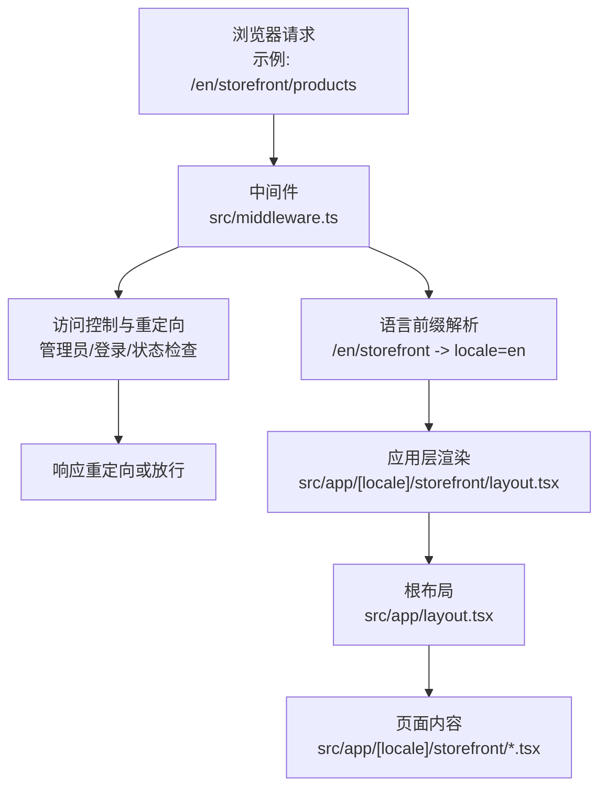
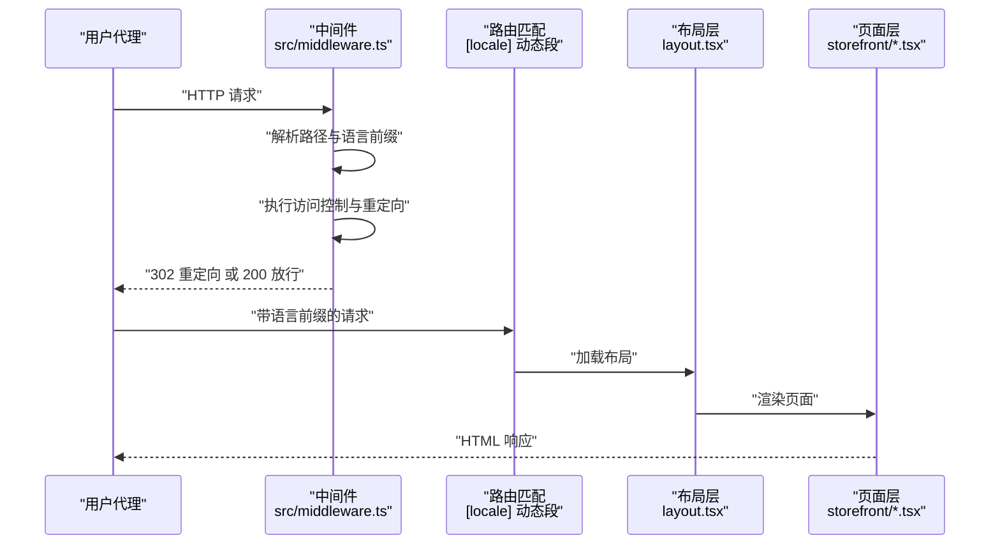
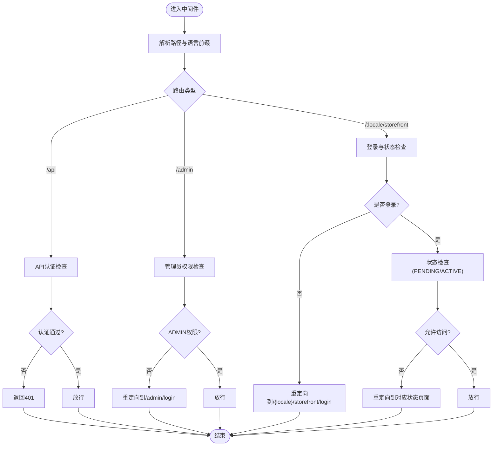
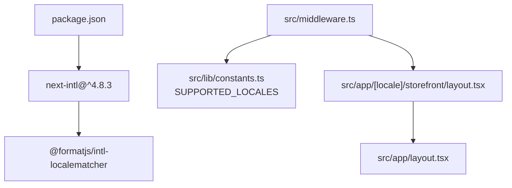

# 国际化配置

<cite>
**本文引用的文件**
- [package.json](file://package.json)
- [next.config.ts](file://next.config.ts)
- [src/middleware.ts](file://src/middleware.ts)
- [src/lib/constants.ts](file://src/lib/constants.ts)
- [src/app/layout.tsx](file://src/app/layout.tsx)
- [src/app/[locale]/storefront/layout.tsx](file://src/app/[locale]/storefront/layout.tsx)
- [src/app/page.tsx](file://src/app/page.tsx)
</cite>

## 目录
1. [简介](#简介)
2. [项目结构](#项目结构)
3. [核心组件](#核心组件)
4. [架构总览](#架构总览)
5. [详细组件分析](#详细组件分析)
6. [依赖关系分析](#依赖关系分析)
7. [性能考虑](#性能考虑)
8. [故障排除指南](#故障排除指南)
9. [结论](#结论)
10. [附录](#附录)

## 简介
本文件面向Celestia项目的国际化配置，聚焦于next-intl框架在本项目中的落地方式与扩展实现。当前仓库已引入next-intl依赖，并通过多语言路由结构与自定义中间件实现语言检测、URL语言前缀管理、Cookie认证与重定向控制等能力。本文将系统梳理以下主题：
- next-intl在本项目中的配置现状与可扩展点
- 语言检测机制与路由国际化设置
- 语言列表配置、默认语言与回退策略
- 国际化中间件配置、语言Cookie处理与URL语言前缀管理
- 配置选项详解、性能优化建议与常见问题解决方案
- 生产环境配置最佳实践与多语言SEO优化策略

## 项目结构
从国际化视角看，项目的关键结构包括：
- 多语言路由约定：使用动态段[locale]作为语言前缀，例如/en/storefront
- 中间件：统一处理API、管理后台与前台的访问控制与重定向
- 常量：集中定义支持的语言列表与RTL语言集合
- 根布局与前台布局：根HTML元素lang属性与前台布局容器

图表来源
- [src/middleware.ts:31-138](file://src/middleware.ts#L31-L138)
- [src/app/[locale]/storefront/layout.tsx:1-10](file://src/app/[locale]/storefront/layout.tsx#L1-L10)
- [src/app/layout.tsx:17-42](file://src/app/layout.tsx#L17-L42)

章节来源
- [src/middleware.ts:31-138](file://src/middleware.ts#L31-L138)
- [src/lib/constants.ts:40-46](file://src/lib/constants.ts#L40-L46)
- [src/app/[locale]/storefront/layout.tsx:1-10](file://src/app/[locale]/storefront/layout.tsx#L1-L10)
- [src/app/layout.tsx:17-42](file://src/app/layout.tsx#L17-L42)

## 核心组件
- 语言常量与类型
  - 支持的语言列表与类型别名
  - RTL语言集合
- 中间件
  - 统一的访问控制与重定向逻辑
  - 匹配器限定对/api、/admin与/:locale/storefront的拦截
- 根布局与前台布局
  - 根HTML元素lang属性
  - 前台布局容器

章节来源
- [src/lib/constants.ts:40-46](file://src/lib/constants.ts#L40-L46)
- [src/middleware.ts:141-147](file://src/middleware.ts#L141-L147)
- [src/app/layout.tsx:23-26](file://src/app/layout.tsx#L23-L26)
- [src/app/[locale]/storefront/layout.tsx:1-10](file://src/app/[locale]/storefront/layout.tsx#L1-L10)

## 架构总览
下图展示了从请求进入、语言识别、访问控制到渲染输出的整体流程。

图表来源
- [src/middleware.ts:31-138](file://src/middleware.ts#L31-L138)
- [src/app/[locale]/storefront/layout.tsx:1-10](file://src/app/[locale]/storefront/layout.tsx#L1-L10)
- [src/app/layout.tsx:17-42](file://src/app/layout.tsx#L17-L42)

## 详细组件分析

### 语言检测与路由国际化
- 路由约定
  - 使用动态段[locale]作为语言前缀，如/en/storefront
  - 根页面默认重定向至/en/storefront，确保首次访问有明确语言上下文
- 语言列表与类型
  - 支持语言：en、ar、zh
  - 类型别名：SupportedLocale
  - RTL语言：ar
- 语言检测
  - 当前实现通过URL语言前缀推断locale
  - 可结合浏览器Accept-Language进行更精细的检测（见“配置选项详解”）

章节来源
- [src/app/page.tsx:1-5](file://src/app/page.tsx#L1-L5)
- [src/lib/constants.ts:40-46](file://src/lib/constants.ts#L40-L46)
- [src/app/[locale]/storefront/layout.tsx:1-10](file://src/app/[locale]/storefront/layout.tsx#L1-L10)

### 国际化中间件配置
- 匹配器
  - 对/api、/admin与/:locale/storefront进行拦截
- 认证与重定向
  - API路由：除/api/auth外需携带有效JWT
  - 管理后台：仅ADMIN角色可访问；已登录ADMIN自动重定向至/admin
  - 前台：根据用户状态(PENDING/ACTIVE)与角色进行重定向
- Cookie处理
  - 从Cookie读取JWT并校验有效性
  - 结合AUTH_PAGES与storefront路径判断是否需要登录或状态限制

图表来源
- [src/middleware.ts:31-138](file://src/middleware.ts#L31-L138)

章节来源
- [src/middleware.ts:31-138](file://src/middleware.ts#L31-L138)
- [src/middleware.ts:141-147](file://src/middleware.ts#L141-L147)

### 语言Cookie处理与URL语言前缀管理
- Cookie处理
  - 从Cookie读取JWT并校验，用于区分用户角色与状态
- URL语言前缀
  - 所有storefront路由均以/:locale开头
  - 重定向逻辑确保用户始终处于带语言前缀的路径
- 与next-intl的关系
  - 本项目已引入next-intl依赖，但当前未发现显式的配置文件与消息资源目录
  - 可基于现有[locale]路由约定与中间件逻辑，按next-intl标准流程补充配置

章节来源
- [src/middleware.ts:35-36](file://src/middleware.ts#L35-L36)
- [src/middleware.ts:79-134](file://src/middleware.ts#L79-L134)

### 配置选项详解
- 支持语言列表
  - 在常量中定义：en、ar、zh
  - 类型约束：SupportedLocale
- 默认语言
  - 根页面重定向至/en/storefront，体现默认语言为en
- 语言回退策略
  - 当前未实现浏览器语言偏好检测与自动回退
  - 可通过next-intl的配置实现基于Accept-Language的回退
- 语言Cookie
  - 本项目未直接使用next-intl的Cookie存储语言
  - 可结合中间件与next-intl的Cookie机制实现语言持久化

章节来源
- [src/lib/constants.ts:40-46](file://src/lib/constants.ts#L40-L46)
- [src/app/page.tsx:1-5](file://src/app/page.tsx#L1-L5)

### 性能优化建议
- 路由匹配优化
  - 中间件匹配器已限定/api、/admin与/:locale/storefront，避免对静态资源与无关路径的处理
- 缓存与预渲染
  - 对静态页面启用缓存头，减少重复计算
- 代码分割
  - 将语言资源按需加载，避免一次性加载所有语言包
- CDN与边缘缓存
  - 利用CDN缓存静态资源与构建产物，降低源站压力

章节来源
- [src/middleware.ts:141-147](file://src/middleware.ts#L141-L147)

### 常见配置问题与解决方案
- 问题：访问/admin未登录被重定向到/admin/login
  - 解决：登录后若已是ADMIN角色，中间件会自动重定向到/admin
- 问题：登录后PENDING用户被重定向到/pending
  - 解决：PENDING用户仅允许访问/pending，其他页面将被重定向
- 问题：ACTIVE用户访问/pending被重定向到根
  - 解决：ACTIVE用户访问/pending会被重定向到/en/storefront
- 问题：API路由除/api/auth外需要认证
  - 解决：携带有效JWT，否则返回401

章节来源
- [src/middleware.ts:49-75](file://src/middleware.ts#L49-L75)
- [src/middleware.ts:89-134](file://src/middleware.ts#L89-L134)

## 依赖关系分析
- next-intl依赖
  - 项目已安装next-intl，版本为^4.8.3
  - 提供语言检测、消息格式化与SWC提取器等能力
- 语言检测库
  - @formatjs/intl-localematcher用于浏览器语言偏好匹配
- 中间件与路由
  - 中间件负责语言前缀解析与访问控制
  - 路由约定与中间件共同实现多语言URL管理

图表来源
- [package.json:24-25](file://package.json#L24-L25)
- [src/middleware.ts:31-138](file://src/middleware.ts#L31-L138)
- [src/lib/constants.ts:40-46](file://src/lib/constants.ts#L40-L46)
- [src/app/[locale]/storefront/layout.tsx:1-10](file://src/app/[locale]/storefront/layout.tsx#L1-L10)
- [src/app/layout.tsx:17-42](file://src/app/layout.tsx#L17-L42)

章节来源
- [package.json:24-25](file://package.json#L24-L25)
- [src/middleware.ts:31-138](file://src/middleware.ts#L31-L138)
- [src/lib/constants.ts:40-46](file://src/lib/constants.ts#L40-L46)

## 性能考虑
- 减少不必要的中间件处理
  - 通过匹配器精确限定拦截范围
- 语言资源加载
  - 按需加载语言包，避免全量加载
- 缓存策略
  - 对静态资源与构建产物启用长缓存
- SSR/ISR
  - 对多语言页面采用合适的预渲染与增量静态再生策略

## 故障排除指南
- 认证失败
  - 检查Cookie中JWT的有效性与签名
  - 确认JWT_SECRET配置正确
- 重定向循环
  - 检查中间件中的重定向逻辑与路径匹配
- 语言不生效
  - 确认URL包含正确的语言前缀
  - 检查根HTML元素lang属性与布局层设置

章节来源
- [src/middleware.ts:22-29](file://src/middleware.ts#L22-L29)
- [src/middleware.ts:141-147](file://src/middleware.ts#L141-L147)
- [src/app/layout.tsx:23-26](file://src/app/layout.tsx#L23-L26)

## 结论
本项目已具备多语言路由与基础中间件控制能力，结合next-intl可进一步完善语言检测、消息资源管理与Cookie语言持久化。建议在现有基础上补充next-intl配置与消息资源，同时保持中间件的高效匹配与合理的重定向策略，以实现高性能、可维护的国际化方案。

## 附录
- 生产环境配置最佳实践
  - 使用CDN缓存静态资源与构建产物
  - 启用边缘缓存与压缩
  - 对API路由实施严格的鉴权与限流
- 多语言SEO优化策略
  - 为每种语言生成独立的URL与元信息
  - 使用hreflang标记与canonical链接
  - 确保语言切换导航清晰可见