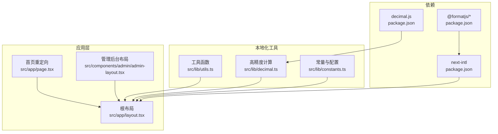
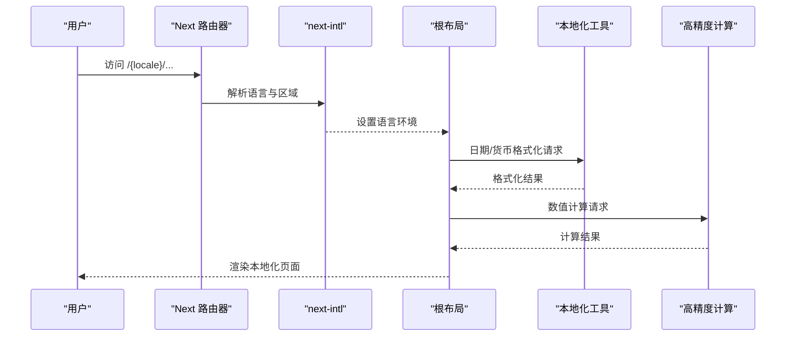
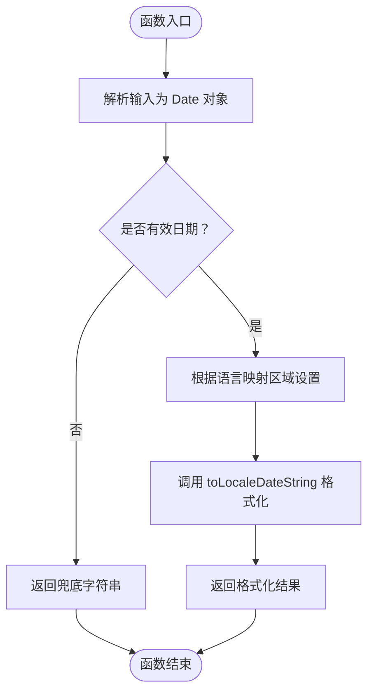
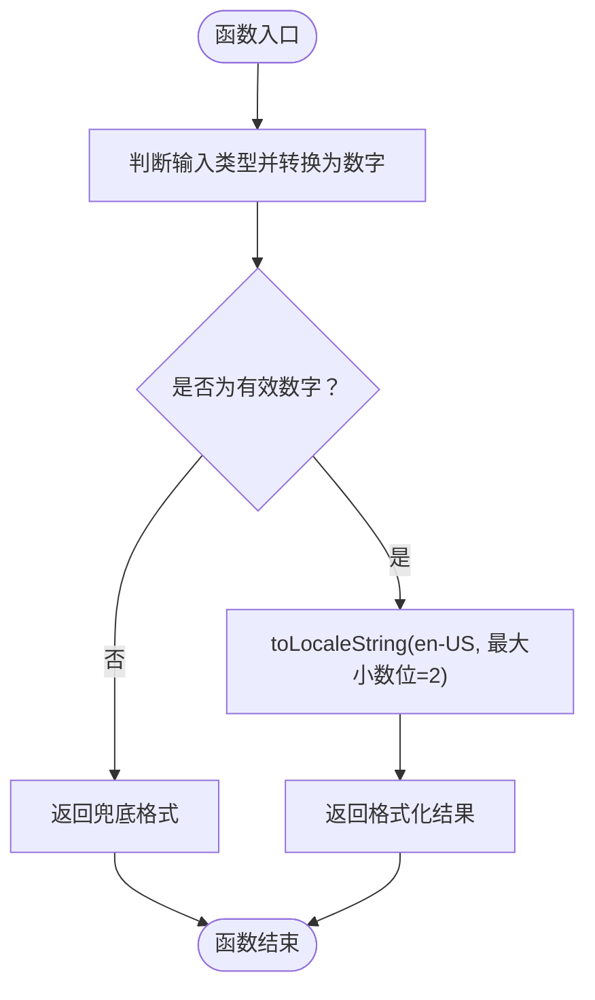
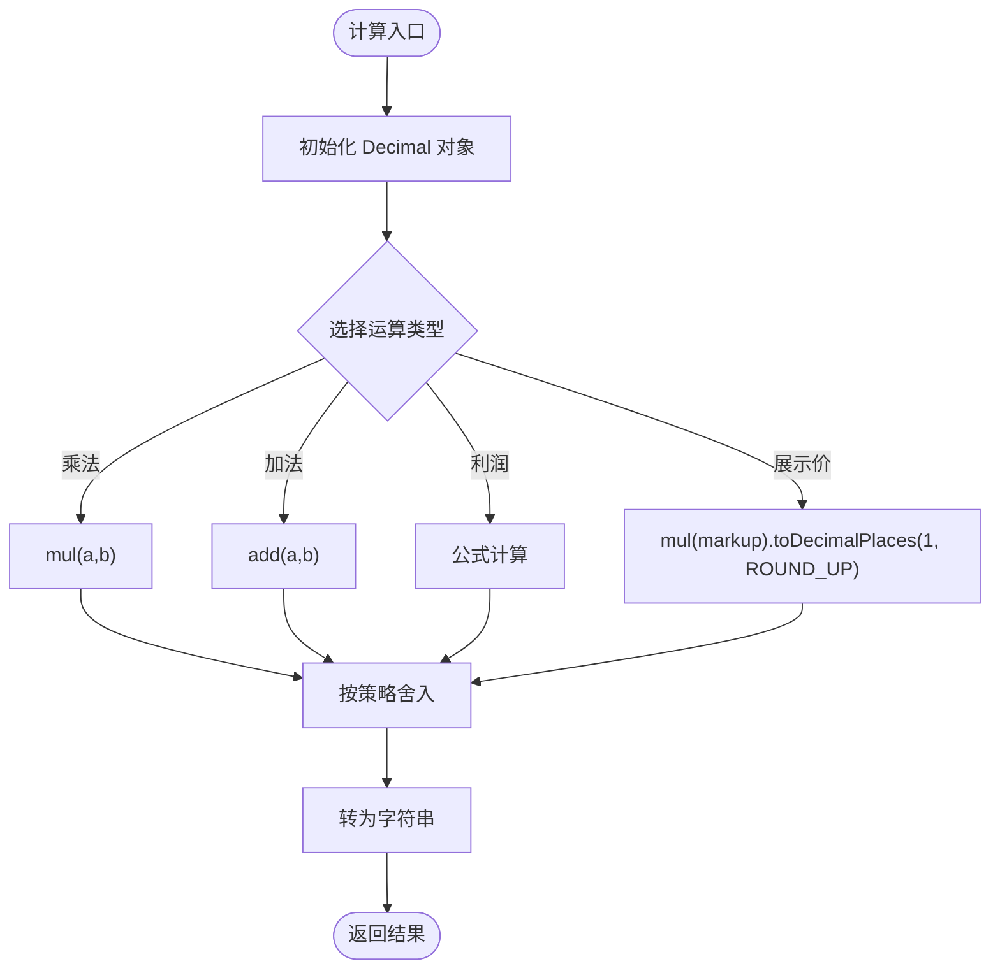
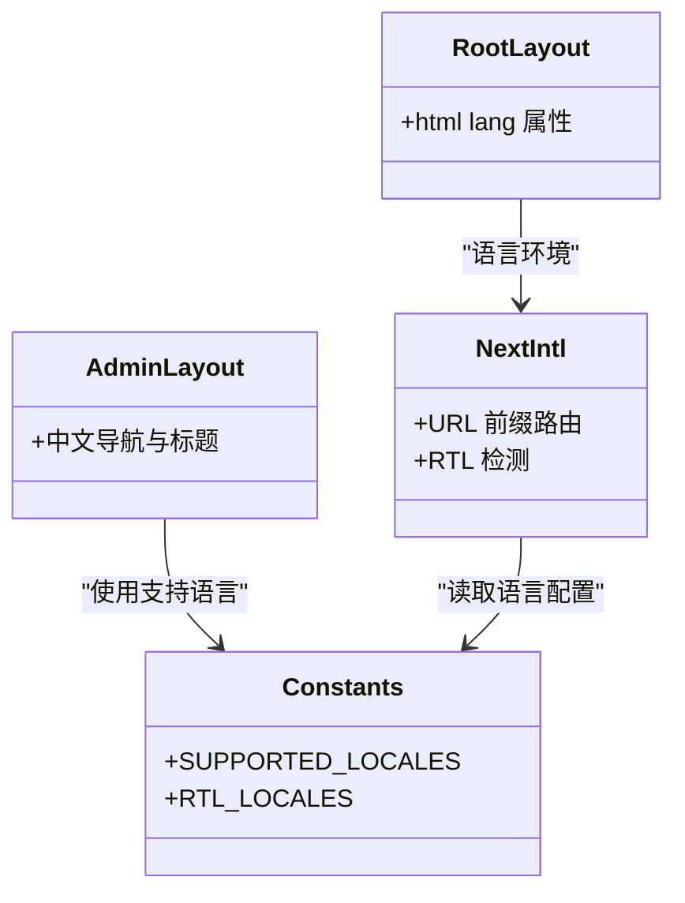
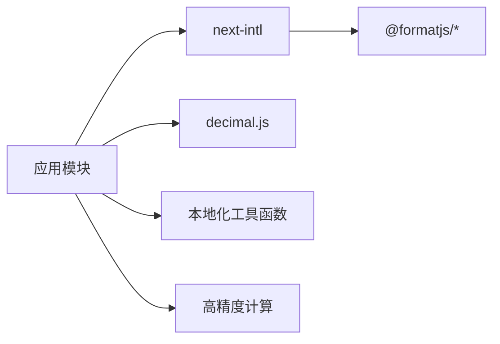

# 本地化处理

<cite>
**本文引用的文件**
- [src/lib/utils.ts](file://src/lib/utils.ts)
- [src/lib/decimal.ts](file://src/lib/decimal.ts)
- [src/lib/constants.ts](file://src/lib/constants.ts)
- [src/app/layout.tsx](file://src/app/layout.tsx)
- [src/app/page.tsx](file://src/app/page.tsx)
- [src/components/admin/admin-layout.tsx](file://src/components/admin/admin-layout.tsx)
- [package.json](file://package.json)
- [next.config.ts](file://next.config.ts)
</cite>

## 目录
1. [简介](#简介)
2. [项目结构](#项目结构)
3. [核心组件](#核心组件)
4. [架构概览](#架构概览)
5. [详细组件分析](#详细组件分析)
6. [依赖分析](#依赖分析)
7. [性能考虑](#性能考虑)
8. [故障排除指南](#故障排除指南)
9. [结论](#结论)
10. [附录](#附录)

## 简介
本文件为 Celestia 本地化处理系统的技术文档，聚焦以下方面：
- 日期格式化、时间处理与时区管理
- 货币格式化、数字本地化与小数点处理
- 本地化工具函数设计、国际化组件封装与动态语言切换机制
- 本地化测试策略、多语言验证与错误处理方案
- 第三方本地化库集成、自定义格式化规则与性能优化技巧

当前代码库采用 next-intl 实现基于 URL 前缀的国际化路由（en / ar / zh），并结合浏览器本地化 API 与自定义工具函数完成日期、货币与数值的本地化处理。

## 项目结构
本地化相关的关键文件分布如下：
- 工具函数：日期/时间、货币格式化与订单号生成
- 数值计算：基于 decimal.js 的高精度计算与取整策略
- 国际化配置：支持语言、RTL 语言与默认语言
- 路由与布局：根布局与首页重定向；管理后台中文界面
- 依赖：next-intl、decimal.js、ICU 相关包

**图表来源**
- [src/app/layout.tsx:17-42](file://src/app/layout.tsx#L17-L42)
- [src/app/page.tsx:1-5](file://src/app/page.tsx#L1-L5)
- [src/components/admin/admin-layout.tsx:40-206](file://src/components/admin/admin-layout.tsx#L40-L206)
- [src/lib/utils.ts:8-31](file://src/lib/utils.ts#L8-L31)
- [src/lib/decimal.ts:1-96](file://src/lib/decimal.ts#L1-L96)
- [src/lib/constants.ts:25-46](file://src/lib/constants.ts#L25-L46)
- [package.json:11-44](file://package.json#L11-L44)

**章节来源**
- [src/app/layout.tsx:17-42](file://src/app/layout.tsx#L17-L42)
- [src/app/page.tsx:1-5](file://src/app/page.tsx#L1-L5)
- [src/components/admin/admin-layout.tsx:40-206](file://src/components/admin/admin-layout.tsx#L40-L206)
- [src/lib/utils.ts:8-31](file://src/lib/utils.ts#L8-L31)
- [src/lib/decimal.ts:1-96](file://src/lib/decimal.ts#L1-L96)
- [src/lib/constants.ts:25-46](file://src/lib/constants.ts#L25-L46)
- [package.json:11-44](file://package.json#L11-L44)

## 核心组件
- 日期与时间本地化：基于浏览器 Intl.DateTimeFormat 的本地化日期格式化，针对阿拉伯语与中文使用特定区域设置。
- 货币与数值本地化：统一使用 en-US 区域设置进行货币与数值格式化，确保小数点与千分位的一致性。
- 高精度数值计算：基于 decimal.js 的精确乘除加减与多种取整策略，避免浮点误差。
- 国际化路由与语言配置：通过 next-intl 提供 en / ar / zh 三语支持与 RTL 检测，结合常量定义支持语言集合与 RTL 列表。

**章节来源**
- [src/lib/utils.ts:15-23](file://src/lib/utils.ts#L15-L23)
- [src/lib/utils.ts:8-13](file://src/lib/utils.ts#L8-L13)
- [src/lib/decimal.ts:1-96](file://src/lib/decimal.ts#L1-L96)
- [src/lib/constants.ts:40-46](file://src/lib/constants.ts#L40-L46)
- [package.json:29](file://package.json#L29)

## 架构概览
本地化处理在应用中的交互流程如下：

**图表来源**
- [src/app/layout.tsx:24](file://src/app/layout.tsx#L24)
- [src/lib/utils.ts:15-23](file://src/lib/utils.ts#L15-L23)
- [src/lib/utils.ts:8-13](file://src/lib/utils.ts#L8-L13)
- [src/lib/decimal.ts:10-22](file://src/lib/decimal.ts#L10-L22)
- [package.json:29](file://package.json#L29)

## 详细组件分析

### 日期与时间本地化
- 设计要点
  - 使用浏览器 Intl.DateTimeFormat 进行本地化日期格式化。
  - 针对阿拉伯语与中文分别映射到 ar-SA 与 zh-CN 区域设置，以获得符合当地习惯的短月份名称与年份格式。
  - 输入支持 Date 对象或 ISO 字符串，内部统一转换为 Date 对象后再格式化。
- 错误处理
  - 非法日期输入会触发 NaN，函数返回兜底字符串，保证渲染稳定性。
- 复杂度
  - 时间复杂度 O(1)，空间复杂度 O(1)。

**图表来源**
- [src/lib/utils.ts:15-23](file://src/lib/utils.ts#L15-L23)

**章节来源**
- [src/lib/utils.ts:15-23](file://src/lib/utils.ts#L15-L23)

### 货币与数值本地化
- 设计要点
  - 统一使用 en-US 区域设置进行数值与货币格式化，确保小数点与千分位符号一致。
  - 货币格式化固定保留两位小数，便于财务显示一致性。
  - 输入支持 number 与 string 类型，内部自动转换为数字，非法输入返回兜底格式。
- 错误处理
  - 非法数值输入返回固定兜底格式，避免前端异常中断。
- 复杂度
  - 时间复杂度 O(1)，空间复杂度 O(1)。

**图表来源**
- [src/lib/utils.ts:8-13](file://src/lib/utils.ts#L8-L13)

**章节来源**
- [src/lib/utils.ts:8-13](file://src/lib/utils.ts#L8-L13)

### 高精度数值计算（decimal.js）
- 设计要点
  - 全局配置 decimal.js 的精度与舍入策略，确保金融计算的准确性。
  - 提供多种计算函数：客户价计算、订单总金额、预估/实际利润、安全加法与乘法、展示价计算等。
  - 不同场景采用不同舍入策略（如向上取整至 0.1 或保留两位小数）。
- 错误处理
  - 所有计算均基于 Decimal 对象，避免浮点误差；非法输入会在构造阶段被拒绝，建议在上游进行校验。
- 复杂度
  - 单次运算 O(1)，聚合计算 O(n)。

**图表来源**
- [src/lib/decimal.ts:10-22](file://src/lib/decimal.ts#L10-L22)
- [src/lib/decimal.ts:27-36](file://src/lib/decimal.ts#L27-L36)
- [src/lib/decimal.ts:42-52](file://src/lib/decimal.ts#L42-L52)
- [src/lib/decimal.ts:58-68](file://src/lib/decimal.ts#L58-L68)
- [src/lib/decimal.ts:88-95](file://src/lib/decimal.ts#L88-L95)

**章节来源**
- [src/lib/decimal.ts:10-22](file://src/lib/decimal.ts#L10-L22)
- [src/lib/decimal.ts:27-36](file://src/lib/decimal.ts#L27-L36)
- [src/lib/decimal.ts:42-52](file://src/lib/decimal.ts#L42-L52)
- [src/lib/decimal.ts:58-68](file://src/lib/decimal.ts#L58-L68)
- [src/lib/decimal.ts:88-95](file://src/lib/decimal.ts#L88-L95)

### 国际化组件与动态语言切换
- 动态语言切换
  - next-intl 提供基于 URL 前缀的路由与语言检测能力，支持 en / ar / zh 三语与 RTL 检测。
  - 通过常量定义支持语言集合与 RTL 语言列表，便于在组件中进行条件渲染与样式适配。
- 管理后台语言
  - 管理后台组件采用中文文案，体现“管理端中文、客户端英文”的差异化策略。
- 根布局语言设置
  - 根布局 html 标签设置 lang 属性，确保无障碍与 SEO 的语言标识正确。

**图表来源**
- [src/lib/constants.ts:40-46](file://src/lib/constants.ts#L40-L46)
- [src/components/admin/admin-layout.tsx:24-38](file://src/components/admin/admin-layout.tsx#L24-L38)
- [src/app/layout.tsx:24](file://src/app/layout.tsx#L24)
- [package.json:29](file://package.json#L29)

**章节来源**
- [src/lib/constants.ts:40-46](file://src/lib/constants.ts#L40-L46)
- [src/components/admin/admin-layout.tsx:24-38](file://src/components/admin/admin-layout.tsx#L24-L38)
- [src/app/layout.tsx:24](file://src/app/layout.tsx#L24)
- [package.json:29](file://package.json#L29)

### 订单号生成
- 设计要点
  - 生成格式：CLS-YYYYMMDD-XXXX，其中 YYYYMMDD 来源于当前日期，XXXX 为随机大写字母数字组合。
  - 用于业务追踪与审计，确保唯一性与可读性。
- 复杂度
  - 时间复杂度 O(1)，空间复杂度 O(1)。

**章节来源**
- [src/lib/utils.ts:25-31](file://src/lib/utils.ts#L25-L31)

## 依赖分析
- 第三方库
  - next-intl：提供 URL 前缀国际化、RSC 支持与 RTL 检测。
  - decimal.js：提供高精度十进制计算，避免浮点误差。
  - @formatjs/*：ECMAScript 规范的 ECMA-402 抽象层与 ICU 相关工具。
- 依赖关系
  - 应用通过 next-intl 管理语言环境，工具函数与组件在该环境下执行本地化逻辑。
  - decimal.js 作为独立计算库，被业务模块直接调用。

**图表来源**
- [package.json:29](file://package.json#L29)
- [package.json:22](file://package.json#L22)
- [package.json:11-44](file://package.json#L11-L44)

**章节来源**
- [package.json:29](file://package.json#L29)
- [package.json:22](file://package.json#L22)
- [package.json:11-44](file://package.json#L11-L44)

## 性能考虑
- 本地化格式化
  - 日期与货币格式化依赖浏览器 Intl API，通常具备良好性能；建议在服务端渲染（SSR）或静态生成（SSG）场景缓存常用格式化结果。
- 数值计算
  - decimal.js 在高频计算场景下可能成为瓶颈，建议：
    - 合理拆分计算步骤，减少不必要的中间对象创建。
    - 对批量计算使用累积器模式，避免重复实例化 Decimal。
    - 在 UI 层延迟计算，仅在必要时触发格式化。
- 国际化路由
  - next-intl 的中间件与构建期提取对性能影响较小，但需注意消息文件体积与编译时间；建议按页面拆分翻译文件并启用压缩。

## 故障排除指南
- 日期格式化异常
  - 现象：非标准日期字符串导致格式化失败。
  - 排查：检查输入类型与格式，确保传入合法日期或可解析的 ISO 字符串。
  - 处理：利用工具函数的兜底逻辑，避免前端崩溃。
- 货币格式化异常
  - 现象：非法数值导致格式化输出不符合预期。
  - 排查：确认数值类型与范围，避免 NaN 或 Infinity。
  - 处理：在调用前进行数值校验，必要时回退到兜底格式。
- 数值计算偏差
  - 现象：浮点误差导致结果不准确。
  - 排查：确认是否使用 decimal.js 的计算函数，避免原生运算。
  - 处理：统一使用 decimal.js 的加减乘除与取整函数。
- 语言切换无效
  - 现象：切换语言后页面未更新。
  - 排查：确认 URL 前缀与 next-intl 配置一致，检查路由与中间件设置。
  - 处理：确保链接使用正确的语言前缀，刷新页面或重新加载语言上下文。

**章节来源**
- [src/lib/utils.ts:15-23](file://src/lib/utils.ts#L15-L23)
- [src/lib/utils.ts:8-13](file://src/lib/utils.ts#L8-L13)
- [src/lib/decimal.ts:10-22](file://src/lib/decimal.ts#L10-L22)
- [package.json:29](file://package.json#L29)

## 结论
Celestia 的本地化系统通过 next-intl 实现了基于 URL 的多语言路由与 RTL 检测，结合浏览器 Intl API 与自定义工具函数完成了日期、货币与数值的本地化处理。decimal.js 的引入确保了金融计算的高精度与稳定性。整体架构清晰、职责分离明确，具备良好的扩展性与维护性。建议在后续迭代中进一步完善测试覆盖与性能监控，以提升用户体验与系统可靠性。

## 附录
- 测试策略建议
  - 日期格式化：覆盖 en / ar / zh 三种语言与边界日期（年初/年末、闰年等）。
  - 货币格式化：覆盖正数、负数、零、极大值与极小值，以及非法输入。
  - 数值计算：覆盖加减乘除、取整策略与溢出场景，对比 decimal.js 与原生运算差异。
  - 国际化：验证 URL 前缀路由、语言切换、RTL 样式与无障碍属性。
- 错误处理清单
  - 日期：非法字符串 → 兜底格式；空值 → 明确提示。
  - 货币：NaN/Infinity → 兜底格式；超范围 → 截断或报错。
  - 数值：除零 → 拦截并提示；精度溢出 → 降级处理。
  - 语言：未知语言 → 回退到默认语言；路由缺失 → 404 或重定向。