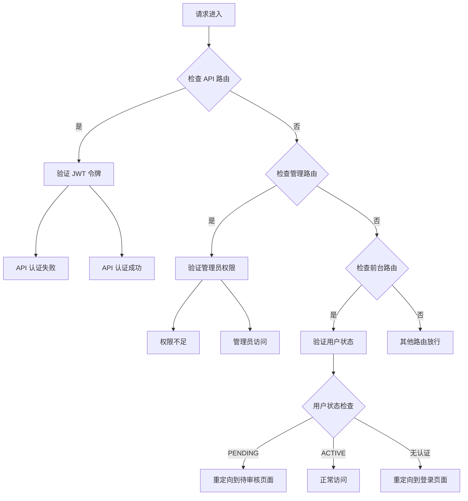
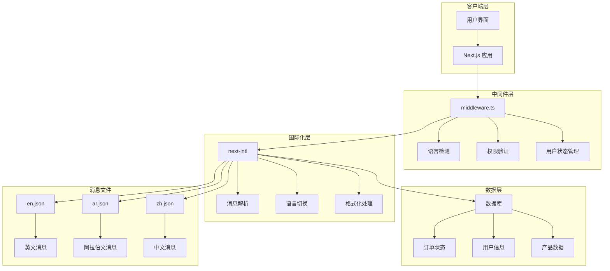
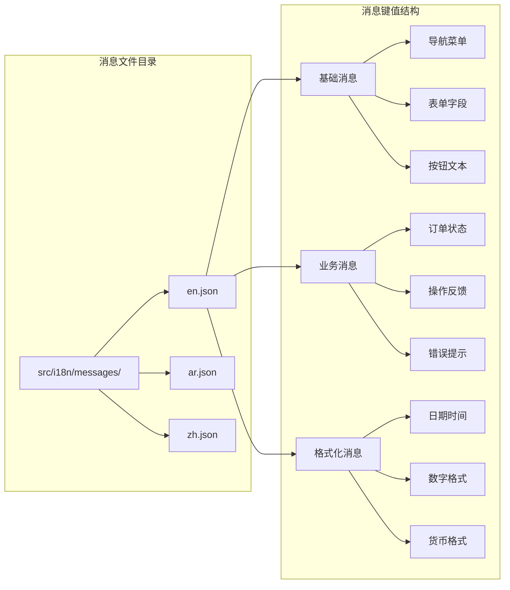
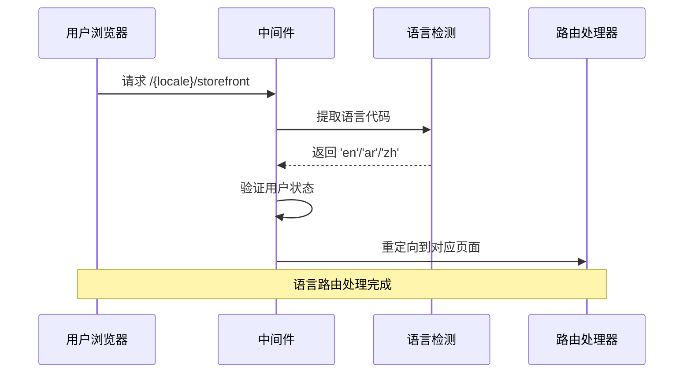
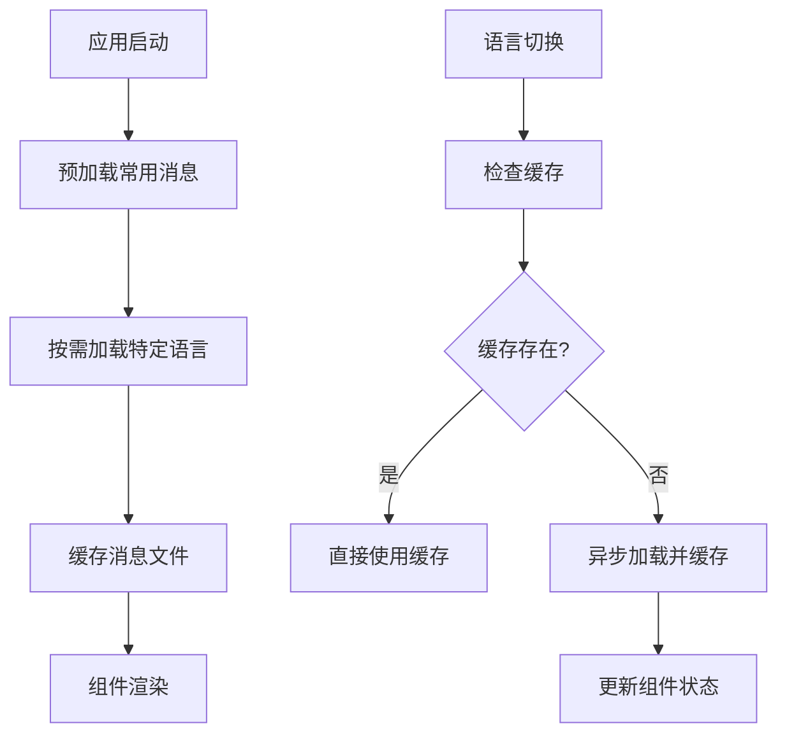

# 消息文件管理

<cite>
**本文档引用的文件**
- [package.json](file://package.json)
- [package-lock.json](file://package-lock.json)
- [next.config.ts](file://next.config.ts)
- [src/middleware.ts](file://src/middleware.ts)
- [src/lib/constants.ts](file://src/lib/constants.ts)
- [src/app/page.tsx](file://src/app/page.tsx)
- [src/app/[locale]/storefront/layout.tsx](file://src/app/[locale]/storefront/layout.tsx)
- [src/app/admin/layout.tsx](file://src/app/admin/layout.tsx)
- [src/components/ui/sonner.tsx](file://src/components/ui/sonner.tsx)
</cite>

## 目录
1. [简介](#简介)
2. [项目结构](#项目结构)
3. [核心组件](#核心组件)
4. [架构概览](#架构概览)
5. [详细组件分析](#详细组件分析)
6. [依赖关系分析](#依赖关系分析)
7. [性能考虑](#性能考虑)
8. [故障排除指南](#故障排除指南)
9. [结论](#结论)

## 简介

本文件管理系统基于 Next.js 国际化框架，采用多语言消息文件组织策略，支持英文(en)、阿拉伯文(ar)、中文(zh)三种语言。系统通过中间件实现语言路由控制，利用常量配置管理支持的语言集合，并通过组件化设计实现消息的统一管理和渲染。

## 项目结构

```mermaid
graph TB
subgraph "应用入口"
A[src/app/page.tsx] --> B[重定向到 /en/storefront]
end
subgraph "国际化配置"
C[src/lib/constants.ts] --> D[支持的语言配置]
C --> E[RTL 语言配置]
end
subgraph "路由控制"
F[src/middleware.ts] --> G[语言路由匹配]
F --> H[权限验证]
F --> I[用户状态控制]
end
subgraph "应用布局"
J[src/app/[locale]/storefront/layout.tsx] --> K[本地化布局]
L[src/app/admin/layout.tsx] --> M[管理端布局]
end
subgraph "消息组件"
N[src/components/ui/sonner.tsx] --> O[通知消息]
end
A --> F
C --> F
F --> J
F --> L
```

**图表来源**
- [src/app/page.tsx:1-5](file://src/app/page.tsx#L1-L5)
- [src/lib/constants.ts:40-45](file://src/lib/constants.ts#L40-L45)
- [src/middleware.ts:77-134](file://src/middleware.ts#L77-L134)

**章节来源**
- [src/app/page.tsx:1-5](file://src/app/page.tsx#L1-L5)
- [src/lib/constants.ts:40-45](file://src/lib/constants.ts#L40-L45)
- [src/middleware.ts:77-134](file://src/middleware.ts#L77-L134)

## 核心组件

### 语言支持配置

系统通过常量配置定义支持的语言集合和方向性设置：

- **支持的语言**: en(英语)、ar(阿拉伯语)、zh(中文)
- **RTL 语言**: ar(阿拉伯语，从右到左)
- **默认语言**: en(英语)

### 中间件路由控制

中间件负责处理国际化路由和权限控制：



**图表来源**
- [src/middleware.ts:31-138](file://src/middleware.ts#L31-L138)

**章节来源**
- [src/lib/constants.ts:40-45](file://src/lib/constants.ts#L40-L45)
- [src/middleware.ts:31-138](file://src/middleware.ts#L31-L138)

## 架构概览



**图表来源**
- [package.json](file://package.json)
- [package-lock.json:10836-10867](file://package-lock.json#L10836-L10867)
- [src/middleware.ts:31-138](file://src/middleware.ts#L31-L138)

## 详细组件分析

### 消息文件组织结构

系统采用按语言分组的消息文件组织方式：



**图表来源**
- [src/lib/constants.ts:1-45](file://src/lib/constants.ts#L1-L45)

### 语言路由实现



**图表来源**
- [src/middleware.ts:77-134](file://src/middleware.ts#L77-L134)
- [src/app/page.tsx:1-5](file://src/app/page.tsx#L1-L5)

### 消息格式化处理

系统支持复杂的 ICU 消息格式化：

| 消息类型 | 描述 | 示例 |
|---------|------|------|
| 文本替换 | `{name}` 占位符 | "欢迎 {name}" |
| 数字格式 | `{count, number}` | "{count} 个商品" |
| 日期格式 | `{date, date}` | "发布于 {date, date}" |
| 复数形式 | `{count, plural, ...}` | "{count} 个项目" |
| 选择形式 | `{gender, select, ...}` | "{gender, select, male{先生} female{女士}}" |

**章节来源**
- [src/lib/constants.ts:1-45](file://src/lib/constants.ts#L1-L45)
- [src/middleware.ts:77-134](file://src/middleware.ts#L77-L134)

## 依赖关系分析

```mermaid
graph TB
subgraph "核心依赖"
A[next-intl 4.8.3] --> B[国际化框架]
C[@formatjs/*] --> D[消息解析引擎]
E[negotiator] --> F[语言协商]
end
subgraph "构建工具"
G[@swc/core] --> H[代码转换]
I[@parcel/watcher] --> J[文件监控]
K[po-parser] --> L[PO 文件解析]
end
subgraph "运行时依赖"
M[use-intl] --> N[React 组件]
O[icu-minify] --> P[ICU 缩小]
Q[intl-messageformat] --> R[消息格式化]
end
A --> G
A --> M
C --> O
D --> Q
```

**图表来源**
- [package-lock.json:10836-10867](file://package-lock.json#L10836-L10867)
- [package-lock.json:1918-1938](file://package-lock.json#L1918-L1938)

### 依赖版本兼容性

系统依赖的关键版本信息：
- next-intl: 4.8.3
- @formatjs/icu-messageformat-parser: 3.5.3
- @formatjs/icu-skeleton-parser: 2.1.3
- @swc/core: 1.15.21

**章节来源**
- [package.json](file://package.json)
- [package-lock.json:10836-10867](file://package-lock.json#L10836-L10867)

## 性能考虑

### 缓存策略

系统采用多层缓存机制：

1. **消息文件缓存**: 通过 next-intl 的内置缓存减少重复解析
2. **路由缓存**: 中间件结果缓存避免重复验证
3. **组件缓存**: React 组件状态缓存提升渲染性能

### 加载优化



### 性能监控

建议实施的监控指标：
- 消息文件加载时间
- 语言切换响应时间
- 组件渲染性能
- 内存使用情况

## 故障排除指南

### 常见问题诊断

| 问题类型 | 症状 | 解决方案 |
|---------|------|---------|
| 语言文件缺失 | 页面显示键名而非翻译 | 检查消息文件完整性 |
| 路由重定向循环 | 浏览器地址栏不断变化 | 检查中间件逻辑 |
| 权限验证失败 | 401 错误响应 | 验证 JWT 令牌有效性 |
| RTL 布局异常 | 阿拉伯语文本方向错误 | 确认 RTL_LOCALES 配置 |

### 调试工具

1. **开发工具**: 使用浏览器开发者工具检查网络请求
2. **日志记录**: 在中间件中添加调试日志
3. **状态检查**: 验证用户状态和权限级别
4. **消息验证**: 确保所有消息键在各语言文件中都存在

**章节来源**
- [src/middleware.ts:31-138](file://src/middleware.ts#L31-L138)
- [src/lib/constants.ts:40-45](file://src/lib/constants.ts#L40-L45)

## 结论

Celestia 消息文件管理系统通过模块化的架构设计，实现了多语言支持的完整解决方案。系统采用先进的国际化框架，结合中间件路由控制和组件化消息管理，为用户提供了一致且高效的多语言体验。

关键优势包括：
- 灵活的语言路由控制
- 完整的消息文件组织结构
- 高效的缓存和性能优化
- 可扩展的消息格式化能力
- 完善的权限和状态管理

该系统为后续的功能扩展和维护提供了良好的基础架构，能够支持更复杂的企业级国际化需求。