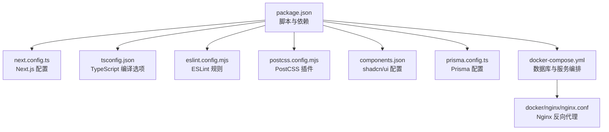
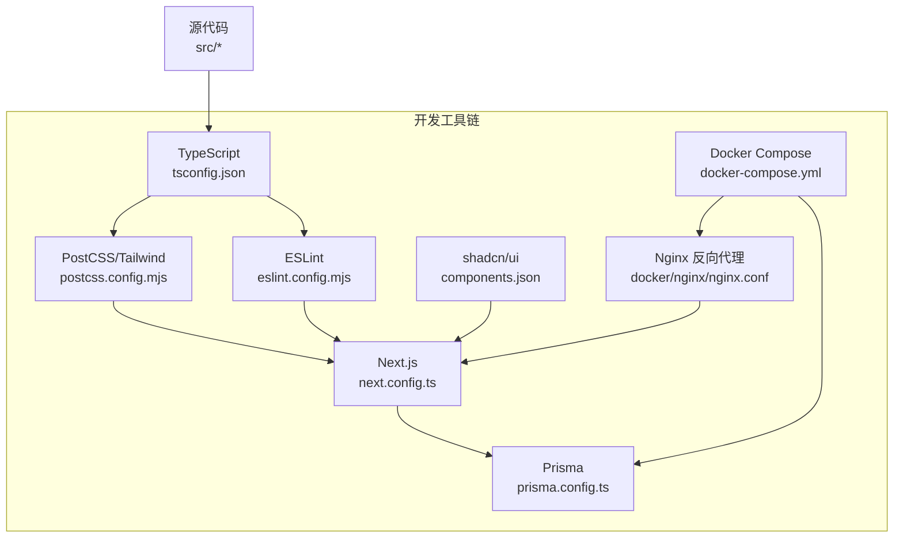
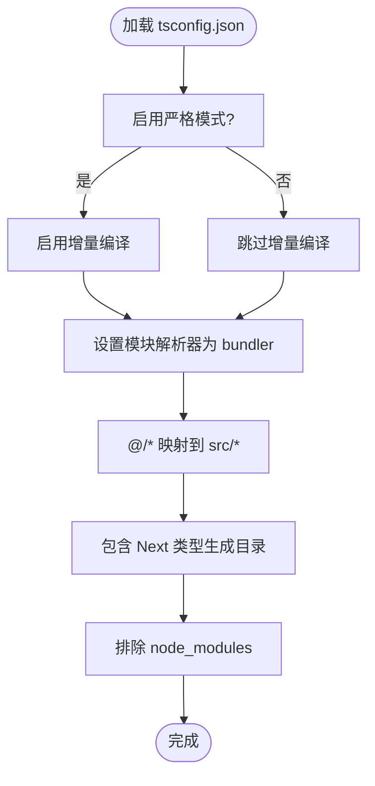
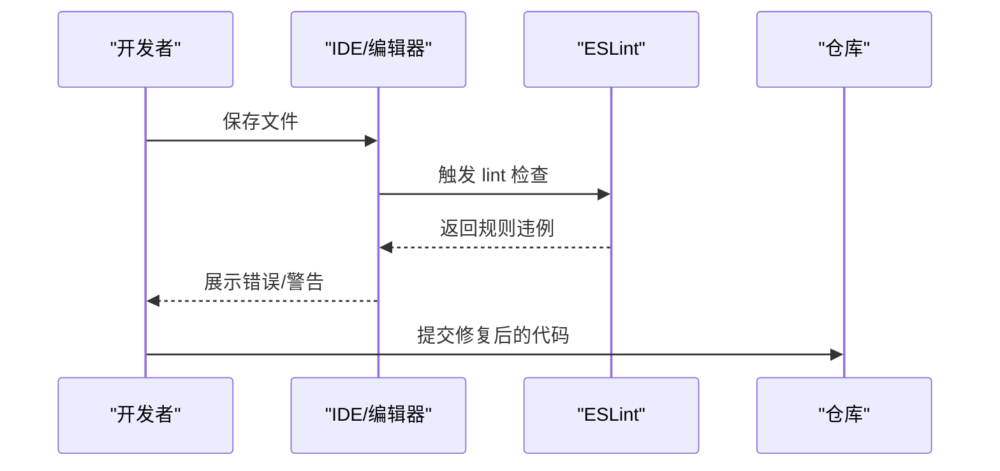
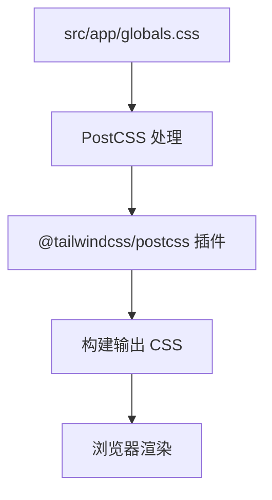
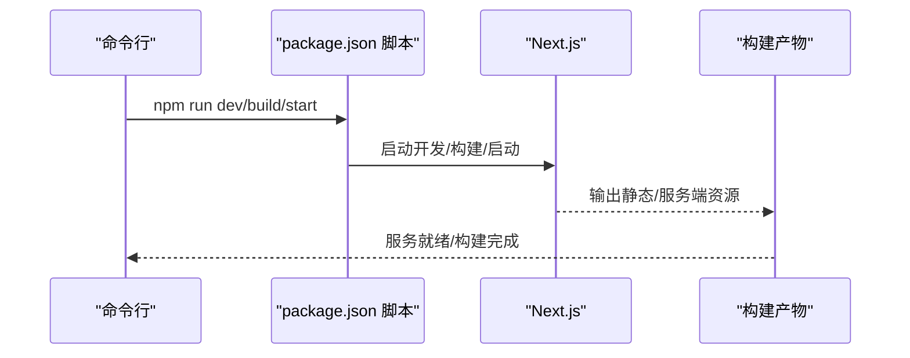
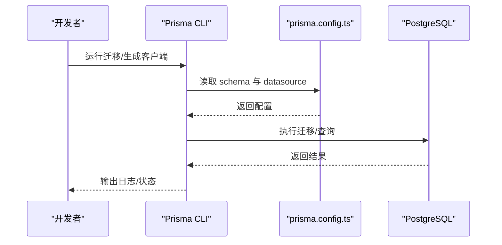
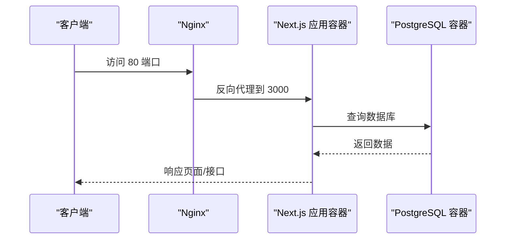
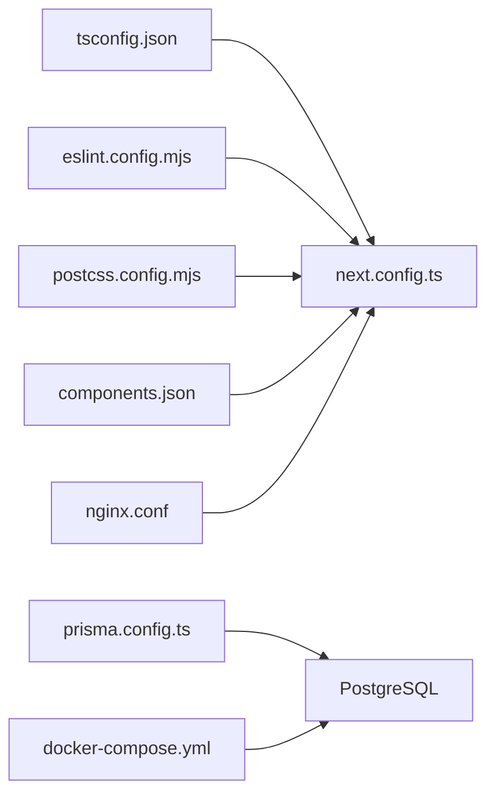

# 开发工具配置

<cite>
**本文引用的文件**
- [package.json](file://package.json)
- [tsconfig.json](file://tsconfig.json)
- [eslint.config.mjs](file://eslint.config.mjs)
- [postcss.config.mjs](file://postcss.config.mjs)
- [next.config.ts](file://next.config.ts)
- [components.json](file://components.json)
- [prisma.config.ts](file://prisma.config.ts)
- [docker-compose.yml](file://docker-compose.yml)
- [docker/nginx/nginx.conf](file://docker/nginx/nginx.conf)
- [README.md](file://README.md)
- [AGENTS.md](file://AGENTS.md)
</cite>

## 目录
1. [简介](#简介)
2. [项目结构](#项目结构)
3. [核心组件](#核心组件)
4. [架构总览](#架构总览)
5. [详细组件分析](#详细组件分析)
6. [依赖关系分析](#依赖关系分析)
7. [性能考虑](#性能考虑)
8. [故障排查指南](#故障排查指南)
9. [结论](#结论)
10. [附录](#附录)

## 简介
本文件为 Celestia 项目的开发工具配置指南，覆盖 TypeScript 配置、ESLint 代码规范、PostCSS 样式处理与 Next.js 构建集成，并结合项目实际配置说明开发环境搭建、调试工具使用、代码质量保障流程、IDE 推荐与快捷键、代码格式化与提交规范、分支管理策略、性能分析与内存泄漏检测、代码覆盖率测试、热重载与远程调试等主题。目标是为开发团队提供统一、可执行的工具链配置方案。

## 项目结构
该项目基于 Next.js 应用，采用 App Router 结构，配合 Prisma 进行数据库访问，Tailwind CSS 作为样式基础，PostCSS 处理样式管线，Docker Compose 提供本地数据库与反向代理服务。关键配置文件分布如下：
- TypeScript：tsconfig.json
- ESLint：eslint.config.mjs
- PostCSS：postcss.config.mjs
- Next.js：next.config.ts
- 组件库（shadcn/ui）：components.json
- 数据库（Prisma）：prisma.config.ts 与 prisma/schema.prisma
- 容器编排：docker-compose.yml 与 docker/nginx/nginx.conf
- 启动与脚本：package.json

图表来源
- [package.json:1-52](file://package.json#L1-L52)
- [next.config.ts:1-8](file://next.config.ts#L1-L8)
- [tsconfig.json:1-35](file://tsconfig.json#L1-L35)
- [eslint.config.mjs:1-19](file://eslint.config.mjs#L1-L19)
- [postcss.config.mjs:1-8](file://postcss.config.mjs#L1-L8)
- [components.json:1-26](file://components.json#L1-L26)
- [prisma.config.ts:1-15](file://prisma.config.ts#L1-L15)
- [docker-compose.yml:1-22](file://docker-compose.yml#L1-L22)
- [docker/nginx/nginx.conf:1-26](file://docker/nginx/nginx.conf#L1-L26)

章节来源
- [package.json:1-52](file://package.json#L1-L52)
- [README.md:1-37](file://README.md#L1-L37)

## 核心组件
本节对开发工具链的核心配置进行深入解析，帮助团队理解各工具的作用与协作方式。

- TypeScript 配置（tsconfig.json）
  - 目标与运行时库：面向 ES2017，启用 DOM、DOM Iterables 与 ESNext。
  - 严格模式与增量编译：开启严格模式与增量编译，提升类型检查效率。
  - 模块系统：使用 esnext 模块与 bundler 解析器，适配 Next.js 构建。
  - JSX：采用 react-jsx，确保 React 元素正确识别。
  - 路径映射：通过路径别名 @/* 映射到 src 目录，便于模块导入。
  - 包含范围：包含类型声明与 Next 类型生成目录，排除 node_modules。
  - 参考实现路径：[tsconfig.json:1-35](file://tsconfig.json#L1-L35)

- ESLint 配置（eslint.config.mjs）
  - 基于 eslint-config-next 的 Core Web Vitals 与 TypeScript 规则集。
  - 自定义忽略规则：覆盖默认忽略项，确保构建产物与临时目录不被扫描。
  - 参考实现路径：[eslint.config.mjs:1-19](file://eslint.config.mjs#L1-L19)

- PostCSS 配置（postcss.config.mjs）
  - 使用 @tailwindcss/postcss 插件，与 Tailwind v4 集成。
  - 参考实现路径：[postcss.config.mjs:1-8](file://postcss.config.mjs#L1-L8)

- Next.js 配置（next.config.ts）
  - 当前为空配置，保留扩展空间；如需自定义可在此添加选项。
  - 参考实现路径：[next.config.ts:1-8](file://next.config.ts#L1-L8)

- 组件库配置（components.json）
  - RSC 与 TSX 支持，Tailwind CSS 路径指向 src/app/globals.css。
  - 别名映射：components、utils、ui、lib、hooks 指向 @/ 对应目录。
  - 参考实现路径：[components.json:1-26](file://components.json#L1-L26)

- 数据库配置（prisma.config.ts）
  - 读取环境变量 DATABASE_URL，指定 schema 与 migrations 路径。
  - 参考实现路径：[prisma.config.ts:1-15](file://prisma.config.ts#L1-L15)

- Docker 编排（docker-compose.yml 与 docker/nginx/nginx.conf）
  - PostgreSQL 服务：端口映射、健康检查、卷挂载。
  - Nginx 反向代理：将 80 端口请求转发至应用容器。
  - 参考实现路径：
    - [docker-compose.yml:1-22](file://docker-compose.yml#L1-L22)
    - [docker/nginx/nginx.conf:1-26](file://docker/nginx/nginx.conf#L1-L26)

章节来源
- [tsconfig.json:1-35](file://tsconfig.json#L1-L35)
- [eslint.config.mjs:1-19](file://eslint.config.mjs#L1-L19)
- [postcss.config.mjs:1-8](file://postcss.config.mjs#L1-L8)
- [next.config.ts:1-8](file://next.config.ts#L1-L8)
- [components.json:1-26](file://components.json#L1-L26)
- [prisma.config.ts:1-15](file://prisma.config.ts#L1-L15)
- [docker-compose.yml:1-22](file://docker-compose.yml#L1-L22)
- [docker/nginx/nginx.conf:1-26](file://docker/nginx/nginx.conf#L1-L26)

## 架构总览
下图展示开发工具链在项目中的整体交互关系：TypeScript 负责编译与类型检查；ESLint 在编辑阶段与 CI 中进行静态检查；PostCSS 与 Tailwind 在构建阶段生成样式；Next.js 承载前端应用与路由；Prisma 管理数据库迁移与访问；Docker 提供本地数据库与反向代理。

图表来源
- [tsconfig.json:1-35](file://tsconfig.json#L1-L35)
- [eslint.config.mjs:1-19](file://eslint.config.mjs#L1-L19)
- [postcss.config.mjs:1-8](file://postcss.config.mjs#L1-L8)
- [next.config.ts:1-8](file://next.config.ts#L1-L8)
- [prisma.config.ts:1-15](file://prisma.config.ts#L1-L15)
- [components.json:1-26](file://components.json#L1-L26)
- [docker-compose.yml:1-22](file://docker-compose.yml#L1-L22)
- [docker/nginx/nginx.conf:1-26](file://docker/nginx/nginx.conf#L1-L26)

## 详细组件分析

### TypeScript 配置分析
- 设计要点
  - 严格模式与增量编译：提升类型安全与开发体验。
  - Bundler 解析器：与 Next.js App Router 生态兼容。
  - 路径别名：统一模块导入，降低相对路径复杂度。
- 性能与可维护性
  - 排除 node_modules，避免第三方包干扰类型检查。
  - 包含 Next 类型生成目录，确保 App Router 类型可用。
- 优化建议
  - 如需支持更多语言特性，可在保持兼容的前提下调整 target 与 lib。
  - 若引入测试或工具脚本，建议单独维护子配置文件以隔离类型检查范围。

图表来源
- [tsconfig.json:1-35](file://tsconfig.json#L1-L35)

章节来源
- [tsconfig.json:1-35](file://tsconfig.json#L1-L35)

### ESLint 配置分析
- 设计要点
  - 基于 eslint-config-next 的 Core Web Vitals 与 TypeScript 规则集，确保现代 Web 性能与类型安全。
  - 自定义忽略规则：覆盖默认忽略项，确保构建产物与临时目录不被扫描。
- 质量保障
  - 在编辑器中即时反馈问题；在 CI 中统一执行，防止低质量代码进入主干。
- 优化建议
  - 如需更严格的规则，可在现有基础上追加自定义规则集。
  - 与 IDE 的 ESLint 插件联动，实现保存即检查。

图表来源
- [eslint.config.mjs:1-19](file://eslint.config.mjs#L1-L19)

章节来源
- [eslint.config.mjs:1-19](file://eslint.config.mjs#L1-L19)

### PostCSS 与 Tailwind 集成
- 设计要点
  - 使用 @tailwindcss/postcss 插件，与 Tailwind v4 协同工作。
  - 组件库（shadcn/ui）配置指向 src/app/globals.css，确保全局样式生效。
- 工作流
  - 开发时由 Next.js 构建管线自动调用 PostCSS 处理样式。
  - 生成的 CSS 与组件库样式共同构成最终界面。
- 优化建议
  - 在生产构建中启用 Purge 与压缩，减少体积。
  - 通过组件库别名统一导入，避免重复样式与冲突。

图表来源
- [postcss.config.mjs:1-8](file://postcss.config.mjs#L1-L8)
- [components.json:1-26](file://components.json#L1-L26)

章节来源
- [postcss.config.mjs:1-8](file://postcss.config.mjs#L1-L8)
- [components.json:1-26](file://components.json#L1-L26)

### Next.js 构建与运行
- 设计要点
  - 默认使用 Next.js 的开发服务器与构建流程。
  - 通过 package.json 中的脚本统一入口，便于团队协作。
- 优化建议
  - 如需自定义构建行为，可在 next.config.ts 中扩展配置。
  - 结合环境变量与 Docker，确保本地与 CI 环境一致。

图表来源
- [package.json:5-10](file://package.json#L5-L10)
- [next.config.ts:1-8](file://next.config.ts#L1-L8)

章节来源
- [package.json:5-10](file://package.json#L5-L10)
- [next.config.ts:1-8](file://next.config.ts#L1-L8)

### 数据库与 Prisma
- 设计要点
  - 通过 prisma.config.ts 读取 DATABASE_URL，连接 PostgreSQL。
  - schema 与 migrations 路径清晰分离，便于版本控制与回滚。
- 工作流
  - 开发时使用本地 Docker PostgreSQL；迁移与数据模型变更通过 Prisma CLI 管理。
- 优化建议
  - 在 CI 中增加数据库健康检查与迁移验证步骤。
  - 使用 .env 文件管理敏感配置，避免硬编码。

图表来源
- [prisma.config.ts:1-15](file://prisma.config.ts#L1-L15)

章节来源
- [prisma.config.ts:1-15](file://prisma.config.ts#L1-L15)

### Docker 与 Nginx 反向代理
- 设计要点
  - docker-compose.yml 提供 PostgreSQL 服务与健康检查。
  - docker/nginx/nginx.conf 将 80 端口请求转发至应用容器。
- 工作流
  - 开发时可直接访问应用容器；生产部署时通过 Nginx 提供反向代理。
- 优化建议
  - 在生产环境中启用 HTTPS 与缓存策略。
  - 将数据库凭据与密钥放入环境变量，避免提交到仓库。

图表来源
- [docker-compose.yml:1-22](file://docker-compose.yml#L1-L22)
- [docker/nginx/nginx.conf:1-26](file://docker/nginx/nginx.conf#L1-L26)

章节来源
- [docker-compose.yml:1-22](file://docker-compose.yml#L1-L22)
- [docker/nginx/nginx.conf:1-26](file://docker/nginx/nginx.conf#L1-L26)

## 依赖关系分析
- 组件耦合
  - TypeScript 与 Next.js 构建紧密耦合，tsconfig.json 的模块解析与路径映射直接影响构建行为。
  - ESLint 与 TypeScript 规则集协同，确保类型安全与代码风格一致。
  - PostCSS 与 Tailwind 通过插件集成，样式生成依赖于组件库与全局样式配置。
  - Prisma 与 Docker 编排共同保障数据库可用性与一致性。
- 外部依赖
  - Next.js、React、Tailwind CSS、Prisma 等均为项目核心依赖，版本升级需谨慎评估。
- 循环依赖
  - 当前配置未发现循环依赖迹象；若新增自定义插件或工具链，请避免相互引用。

图表来源
- [tsconfig.json:1-35](file://tsconfig.json#L1-L35)
- [eslint.config.mjs:1-19](file://eslint.config.mjs#L1-L19)
- [postcss.config.mjs:1-8](file://postcss.config.mjs#L1-L8)
- [components.json:1-26](file://components.json#L1-L26)
- [prisma.config.ts:1-15](file://prisma.config.ts#L1-L15)
- [docker-compose.yml:1-22](file://docker-compose.yml#L1-L22)
- [docker/nginx/nginx.conf:1-26](file://docker/nginx/nginx.conf#L1-L26)

章节来源
- [tsconfig.json:1-35](file://tsconfig.json#L1-L35)
- [eslint.config.mjs:1-19](file://eslint.config.mjs#L1-L19)
- [postcss.config.mjs:1-8](file://postcss.config.mjs#L1-L8)
- [components.json:1-26](file://components.json#L1-L26)
- [prisma.config.ts:1-15](file://prisma.config.ts#L1-L15)
- [docker-compose.yml:1-22](file://docker-compose.yml#L1-L22)
- [docker/nginx/nginx.conf:1-26](file://docker/nginx/nginx.conf#L1-L26)

## 性能考虑
- 构建性能
  - 启用 TypeScript 增量编译与 ESLint 并行检查，缩短开发等待时间。
  - 在 PostCSS 中按需引入插件，避免不必要的处理开销。
- 运行性能
  - 使用 Next.js App Router 的路由与资源优化能力，结合 Tailwind 的原子类减少冗余样式。
  - 在生产构建中启用 CSS 压缩与 Tree Shaking，降低首屏渲染时间。
- 数据库性能
  - 通过 Docker 健康检查与连接池配置，确保数据库稳定可用。
  - 使用 Prisma 的查询优化与索引设计，避免慢查询影响用户体验。

## 故障排查指南
- TypeScript 类型错误
  - 检查 tsconfig.json 的模块解析与路径映射是否与项目结构匹配。
  - 确认包含 Next 类型生成目录，避免类型缺失导致的编译失败。
- ESLint 规则冲突
  - 若编辑器与 CI 行为不一致，检查 eslint.config.mjs 的忽略规则与插件版本。
  - 确保编辑器安装了与项目匹配的 ESLint 插件。
- PostCSS/Tailwind 样式异常
  - 确认 postcss.config.mjs 中的插件已正确安装与启用。
  - 检查 components.json 中的 Tailwind CSS 路径与别名映射。
- Next.js 构建失败
  - 查看 next.config.ts 是否存在自定义配置导致的兼容性问题。
  - 确认 package.json 中的脚本与依赖版本一致。
- 数据库连接问题
  - 检查 docker-compose.yml 的环境变量与卷挂载。
  - 确认 Prisma 配置中的 DATABASE_URL 与网络连通性。
- Nginx 反向代理
  - 检查 docker/nginx/nginx.conf 的 upstream 与 proxy 设置。
  - 确认容器间网络与端口映射正确。

章节来源
- [tsconfig.json:1-35](file://tsconfig.json#L1-L35)
- [eslint.config.mjs:1-19](file://eslint.config.mjs#L1-L19)
- [postcss.config.mjs:1-8](file://postcss.config.mjs#L1-L8)
- [components.json:1-26](file://components.json#L1-L26)
- [next.config.ts:1-8](file://next.config.ts#L1-L8)
- [package.json:5-10](file://package.json#L5-L10)
- [prisma.config.ts:1-15](file://prisma.config.ts#L1-L15)
- [docker-compose.yml:1-22](file://docker-compose.yml#L1-L22)
- [docker/nginx/nginx.conf:1-26](file://docker/nginx/nginx.conf#L1-L26)

## 结论
本指南基于项目现有配置，明确了 TypeScript、ESLint、PostCSS、Next.js、Prisma、Docker 与 Nginx 的职责与协作方式。建议团队在遵循现有配置的基础上，逐步完善 IDE 插件、提交规范与分支策略，并在 CI 中加入性能与安全检查，持续提升开发效率与代码质量。

## 附录

### IDE 配置建议与快捷键
- VS Code
  - 插件推荐：ESLint、TypeScript Importer、Tailwind CSS IntelliSense、Prisma、Docker。
  - 快捷键建议：保存时自动格式化（Ctrl+Shift+P -> “Preferences: Open Keyboard Shortcuts”），将 ESLint 设置为默认代码检查工具。
- WebStorm/IntelliJ
  - 插件推荐：ESLint、TypeScript、Tailwind CSS、Docker、Database Tools。
  - 快捷键建议：Alt+Enter 快速修复，Ctrl+Alt+L 格式化代码。

### 代码格式化标准
- 使用 ESLint 与 Prettier（如需）统一格式化规则，确保团队一致的代码风格。
- 在保存时自动触发格式化，减少手动干预。

### 提交规范与分支管理策略
- 提交规范
  - 使用 Conventional Commits：feat、fix、docs、style、refactor、perf、test、build、ci、chore、revert。
  - 提交信息包含简短描述与关联 Issue 编号（如适用）。
- 分支管理
  - 主分支：main（受保护，仅允许合并请求）。
  - 功能分支：feature/xxx。
  - 修复分支：fix/xxx。
  - 发布分支：release/vX.Y.Z。
  - 合并策略：使用 Squash Merge 或 Rebase Merge，保持提交历史整洁。

### 性能分析、内存泄漏检测与代码覆盖率
- 性能分析
  - 使用 Next.js Profiling 工具与浏览器性能面板定位瓶颈。
  - 在 CI 中集成 Lighthouse 或类似工具进行 Core Web Vitals 监控。
- 内存泄漏检测
  - 使用浏览器 DevTools Memory 面板与 Node.js 内存快照工具（如 heapdump）。
  - 关注长生命周期对象与事件监听器的清理。
- 代码覆盖率
  - 在测试框架中启用覆盖率统计（如 Jest），在 CI 中设置阈值并报告覆盖率。

### 开发调试技巧、热重载与远程调试
- 热重载
  - Next.js 默认启用热重载；修改页面或组件后自动刷新。
- 远程调试
  - 使用浏览器 DevTools 远程调试移动端或远程设备。
  - 在 Node.js 环境下使用 --inspect 参数进行远程调试（适用于服务端逻辑）。

### 团队协作与工具链统一
- 统一工具链
  - 团队成员使用相同版本的 Node.js、TypeScript、ESLint 与 Tailwind。
  - 在项目根目录提供 .editorconfig 与 .gitattributes，统一换行符与字符集。
- 文档与培训
  - 定期组织工具链使用培训，确保新成员快速上手。
  - 将常见问题与解决方案整理为知识库，便于查阅。