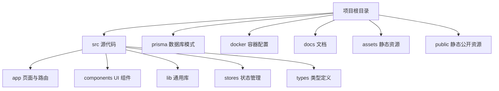
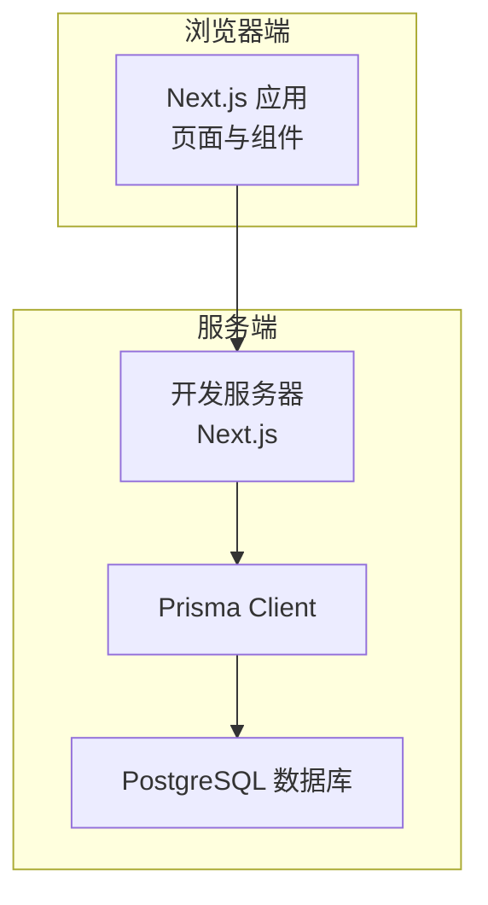
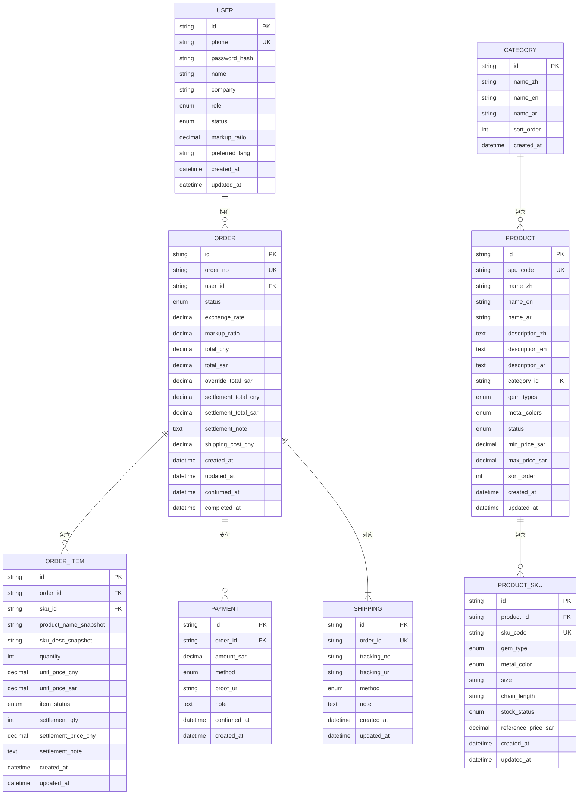
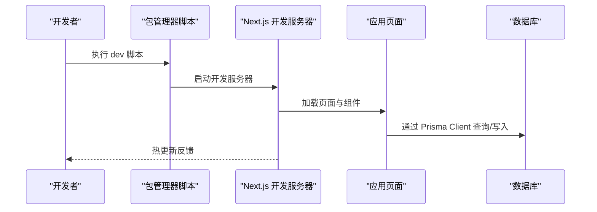
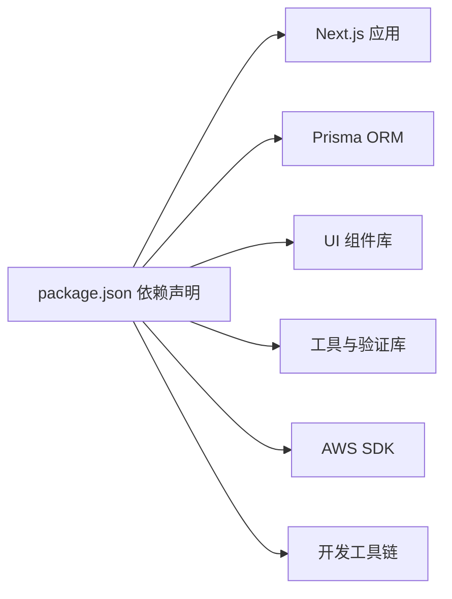

# 快速开始

<cite>
**本文引用的文件**
- [README.md](file://README.md)
- [package.json](file://package.json)
- [docker-compose.yml](file://docker-compose.yml)
- [prisma\schema.prisma](file://prisma/schema.prisma)
- [prisma.config.ts](file://prisma.config.ts)
- [src\lib\db.ts](file://src/lib/db.ts)
- [next.config.ts](file://next.config.ts)
- [tsconfig.json](file://tsconfig.json)
- [src\app\layout.tsx](file://src/app/layout.tsx)
- [src\app\globals.css](file://src/app/globals.css)
- [AGENTS.md](file://AGENTS.md)
</cite>

## 目录
1. [简介](#简介)
2. [项目结构](#项目结构)
3. [核心组件](#核心组件)
4. [架构总览](#架构总览)
5. [详细组件分析](#详细组件分析)
6. [依赖分析](#依赖分析)
7. [性能考虑](#性能考虑)
8. [故障排除指南](#故障排除指南)
9. [结论](#结论)
10. [附录](#附录)

## 简介
本指南面向首次接触 Celestia 项目的开发者，帮助你在最短时间内完成环境准备、项目克隆、依赖安装、数据库初始化与开发服务器启动，并掌握常用命令与项目结构。Celestia 是基于 Next.js 的全栈珠宝电商应用，采用 TypeScript、PostgreSQL（通过 Prisma）与 TailwindCSS 等技术栈。

## 项目结构
项目采用 Next.js App Router 的目录组织方式，核心目录与职责如下：
- src：源代码根目录
  - app：页面与路由模块（App Router）
  - components：可复用 UI 组件
  - lib：通用库与工具（如数据库客户端）
  - stores：状态管理（如 Zustand）
  - types：全局类型定义
- prisma：数据库模式与迁移
- docker：容器化配置（Nginx 示例）
- docs/assets/public：文档与静态资源
- 根目录配置：package.json、tsconfig.json、next.config.ts、docker-compose.yml 等

**图表来源**
- [package.json:1-50](file://package.json#L1-L50)
- [tsconfig.json:1-35](file://tsconfig.json#L1-L35)

**章节来源**
- [package.json:1-50](file://package.json#L1-L50)
- [tsconfig.json:1-35](file://tsconfig.json#L1-L35)

## 核心组件
- 开发服务器：通过 Next.js 提供的开发服务器实现热更新与自动编译
- 数据库层：使用 Prisma Client 连接 PostgreSQL；在开发环境下启用日志
- 构建与运行：通过 npm/yarn/pnpm/bun 的脚本统一管理
- 样式系统：TailwindCSS 与自定义主题变量，支持深色模式

**章节来源**
- [README.md:3-37](file://README.md#L3-L37)
- [src\lib\db.ts:1-12](file://src/lib/db.ts#L1-L12)
- [package.json:5-10](file://package.json#L5-L10)
- [src\app\globals.css:1-137](file://src/app/globals.css#L1-L137)

## 架构总览
下图展示了从浏览器到数据库的关键交互路径，以及开发服务器与数据库容器之间的关系。

**图表来源**
- [src\lib\db.ts:1-12](file://src/lib/db.ts#L1-L12)
- [prisma\schema.prisma:1-281](file://prisma/schema.prisma#L1-L281)
- [docker-compose.yml:1-22](file://docker-compose.yml#L1-L22)

## 详细组件分析

### 数据库与 Prisma 配置
- 数据库类型：PostgreSQL
- 连接方式：通过 Prisma Client，开发环境开启查询日志
- 模式定义：在 Prisma Schema 中定义了用户、品类、商品、订单、支付、物流等模型及枚举
- 迁移与数据源：通过 prisma.config.ts 指定 schema 路径与 DATABASE_URL 环境变量

**图表来源**
- [prisma\schema.prisma:89-281](file://prisma/schema.prisma#L89-L281)

**章节来源**
- [prisma\schema.prisma:1-281](file://prisma/schema.prisma#L1-L281)
- [prisma.config.ts:1-15](file://prisma.config.ts#L1-L15)
- [src\lib\db.ts:1-12](file://src/lib/db.ts#L1-L12)

### 开发服务器与样式系统
- 开发服务器：提供热更新与自动编译，支持多包管理器命令
- 样式系统：引入 TailwindCSS、动画库与 shadcn 组件样式，定义品牌黑金主题与深色模式变量

**图表来源**
- [README.md:5-15](file://README.md#L5-L15)
- [src\lib\db.ts:1-12](file://src/lib/db.ts#L1-L12)

**章节来源**
- [README.md:3-37](file://README.md#L3-L37)
- [src\app\layout.tsx:1-43](file://src/app/layout.tsx#L1-L43)
- [src\app\globals.css:1-137](file://src/app/globals.css#L1-L137)

## 依赖分析
- 运行时框架：Next.js 16.2.1、React 19.2.4
- 数据库与 ORM：Prisma 7.6.0、@prisma/client 7.6.0
- UI 与样式：TailwindCSS 4、shadcn、lucide-react、sonner
- 工具与验证：zod、react-hook-form、zustand、decimal.js、exceljs
- AWS S3 客户端：用于对象存储集成
- 开发依赖：TypeScript 5、ESLint 9、TailwindCSS 4

**图表来源**
- [package.json:11-48](file://package.json#L11-L48)

**章节来源**
- [package.json:1-50](file://package.json#L1-L50)

## 性能考虑
- 开发环境日志：在开发模式下启用 Prisma 查询日志，便于调试但可能影响性能
- 样式体积：TailwindCSS 与动画库组合使用，注意按需引入以控制打包体积
- 组件懒加载：利用 Next.js 的路由与组件懒加载机制优化首屏加载
- 数据库连接：避免在每次请求中重复创建 Prisma 客户端实例，当前实现已通过全局缓存优化

**章节来源**
- [src\lib\db.ts:7-11](file://src/lib/db.ts#L7-L11)
- [src\app\globals.css:1-137](file://src/app/globals.css#L1-L137)

## 故障排除指南
- 开发服务器无法启动
  - 确认 Node.js 版本满足 Next.js 16 要求（建议使用 LTS 版本）
  - 清理缓存后重装依赖：删除 node_modules 与锁定文件后重新安装
  - 检查端口占用：默认 3000 端口是否被其他进程占用
- 数据库连接失败
  - 使用 Docker Compose 启动 PostgreSQL 容器，确认容器健康检查通过
  - 设置 DATABASE_URL 环境变量为正确的连接字符串
  - 在 prisma.config.ts 中确认 schema 路径与 datasource.url 正确
- Prisma 相关错误
  - 确保已生成 Prisma 客户端：执行 prisma generate
  - 如需迁移，请先创建迁移并应用：prisma migrate dev
- Next.js 版本差异
  - 注意 AGENTS.md 中关于 Next.js 版本变更的提示，遵循新版 API 与约定

**章节来源**
- [docker-compose.yml:1-22](file://docker-compose.yml#L1-L22)
- [prisma.config.ts:1-15](file://prisma.config.ts#L1-L15)
- [AGENTS.md:1-6](file://AGENTS.md#L1-L6)

## 结论
通过本指南，你可以在本地快速搭建并运行 Celestia 项目。建议在完成基础环境与数据库初始化后，先运行开发服务器验证一切正常，再逐步探索页面与功能模块。遇到问题时，优先检查数据库连接、环境变量与 Next.js 版本兼容性。

## 附录

### 环境要求与前置条件
- Node.js：建议使用 LTS 版本，确保与 Next.js 16 兼容
- 包管理器：npm、yarn、pnpm 或 bun 任选其一
- 数据库：PostgreSQL 16（推荐使用 Docker Compose 快速部署）
- 可选：Docker 与 Docker Compose（用于数据库容器）

**章节来源**
- [README.md:3-37](file://README.md#L3-L37)
- [docker-compose.yml:1-22](file://docker-compose.yml#L1-L22)

### 逐步安装流程
- 克隆仓库
  - 使用 Git 克隆项目到本地
- 安装依赖
  - 在项目根目录执行安装命令（如 npm install）
- 配置数据库
  - 使用 Docker Compose 启动 PostgreSQL 容器
  - 设置 DATABASE_URL 环境变量（参考 prisma.config.ts）
- 初始化数据库
  - 生成 Prisma 客户端：prisma generate
  - 创建并应用迁移：prisma migrate dev
- 启动开发服务器
  - 执行开发脚本：npm run dev（或 yarn dev / pnpm dev / bun dev）
  - 在浏览器打开 http://localhost:3000 查看应用

**章节来源**
- [README.md:5-15](file://README.md#L5-L15)
- [docker-compose.yml:1-22](file://docker-compose.yml#L1-L22)
- [prisma.config.ts:11-14](file://prisma.config.ts#L11-L14)

### 常用命令
- 开发：npm run dev
- 构建：npm run build
- 启动：npm run start
- 代码检查：npm run lint

**章节来源**
- [package.json:5-10](file://package.json#L5-L10)

### 项目结构概览
- 源代码：src
  - app：页面与路由（App Router）
  - components：UI 组件
  - lib：通用库（含数据库客户端）
  - stores：状态管理
  - types：类型定义
- 配置：next.config.ts、tsconfig.json、prisma.config.ts
- 数据库：prisma/schema.prisma、迁移文件
- 容器：docker-compose.yml

**章节来源**
- [tsconfig.json:21-23](file://tsconfig.json#L21-L23)
- [next.config.ts:1-8](file://next.config.ts#L1-L8)
- [prisma.config.ts:1-15](file://prisma.config.ts#L1-L15)