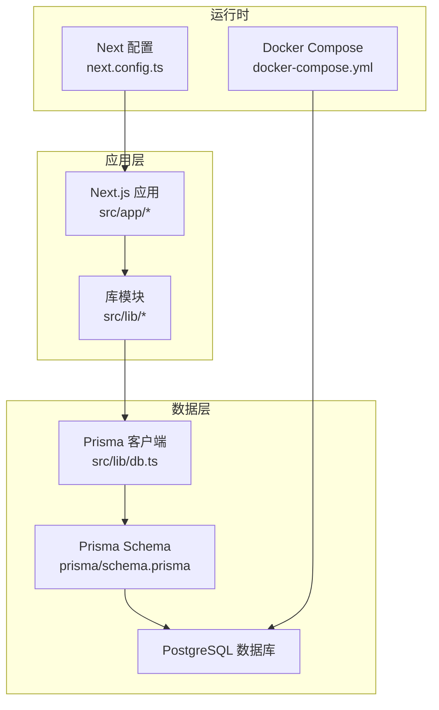
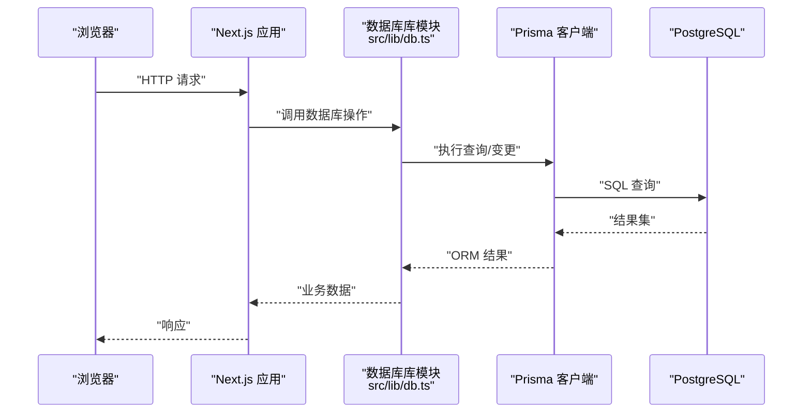
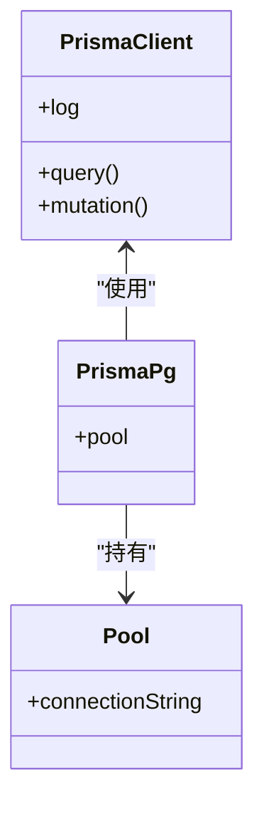
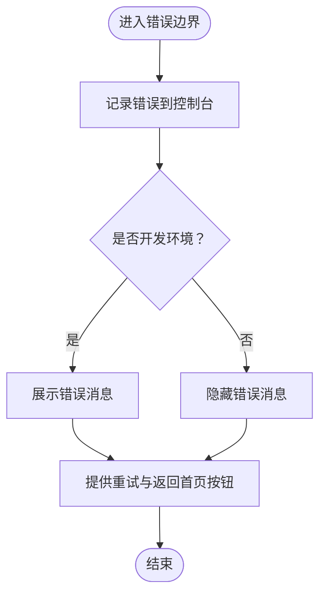
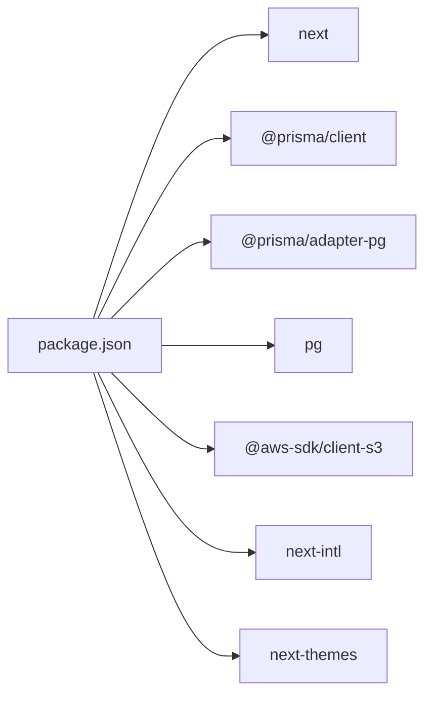

# 故障排除指南

<cite>
**本文引用的文件**
- [README.md](file://README.md)
- [package.json](file://package.json)
- [docker-compose.yml](file://docker-compose.yml)
- [next.config.ts](file://next.config.ts)
- [prisma/schema.prisma](file://prisma/schema.prisma)
- [src/lib/db.ts](file://src/lib/db.ts)
- [src/lib/constants.ts](file://src/lib/constants.ts)
- [src/app/error.tsx](file://src/app/error.tsx)
- [src/app/globals.css](file://src/app/globals.css)
</cite>

## 目录
1. [简介](#简介)
2. [项目结构](#项目结构)
3. [核心组件](#核心组件)
4. [架构总览](#架构总览)
5. [详细组件分析](#详细组件分析)
6. [依赖关系分析](#依赖关系分析)
7. [性能考虑](#性能考虑)
8. [故障排除指南](#故障排除指南)
9. [结论](#结论)
10. [附录](#附录)

## 简介
本指南面向开发者与运维人员，围绕 Celestia 项目在安装、运行、数据库连接与部署等环节的常见问题，提供系统化排查流程、日志分析方法与性能诊断技巧。文档结合项目实际代码与配置，给出可操作的定位与修复建议，并附带错误代码对照与常见错误消息解释。

## 项目结构
该项目基于 Next.js 应用，采用 TypeScript 开发，使用 Prisma 作为 ORM，PostgreSQL 作为数据存储，Docker Compose 提供本地数据库服务。前端样式通过 TailwindCSS 与自定义主题实现。

图表来源
- [src/lib/db.ts:1-18](file://src/lib/db.ts#L1-L18)
- [prisma/schema.prisma:1-281](file://prisma/schema.prisma#L1-L281)
- [docker-compose.yml:1-22](file://docker-compose.yml#L1-L22)
- [next.config.ts:1-8](file://next.config.ts#L1-L8)

章节来源
- [README.md:1-37](file://README.md#L1-L37)
- [package.json:1-52](file://package.json#L1-L52)
- [docker-compose.yml:1-22](file://docker-compose.yml#L1-L22)
- [next.config.ts:1-8](file://next.config.ts#L1-L8)

## 核心组件
- 数据库连接与日志：通过 Prisma 客户端与 PostgreSQL 连接池建立连接；开发环境下开启查询与错误日志，便于问题定位。
- 错误处理界面：统一捕获客户端错误，展示用户可理解的提示并支持重试与返回首页。
- 主题与样式：深色主题与品牌金色调，确保一致的视觉体验与无障碍对比度。
- 常量与国际化：集中管理订单状态、币种、分页、默认加价比例、支持语言与 RTL 语言列表。

章节来源
- [src/lib/db.ts:1-18](file://src/lib/db.ts#L1-L18)
- [src/app/error.tsx:1-63](file://src/app/error.tsx#L1-L63)
- [src/app/globals.css:1-137](file://src/app/globals.css#L1-L137)
- [src/lib/constants.ts:1-46](file://src/lib/constants.ts#L1-L46)

## 架构总览
下图展示了从浏览器到数据库的关键调用链路与组件交互：

图表来源
- [src/lib/db.ts:1-18](file://src/lib/db.ts#L1-L18)
- [prisma/schema.prisma:1-281](file://prisma/schema.prisma#L1-L281)

## 详细组件分析

### 数据库连接与日志组件
- 连接池与适配器：使用连接字符串初始化连接池，并通过 PrismaPg 适配器接入 Prisma 客户端。
- 日志级别：开发环境启用查询、错误、警告日志；生产环境仅记录错误，降低开销。
- 全局实例：开发环境缓存 Prisma 实例，避免重复初始化。

图表来源
- [src/lib/db.ts:1-18](file://src/lib/db.ts#L1-L18)

章节来源
- [src/lib/db.ts:1-18](file://src/lib/db.ts#L1-L18)

### 错误处理组件
- 客户端错误捕获：在错误边界中记录错误并提供重试与返回首页按钮。
- 开发环境显示：在开发模式下展示错误消息，便于快速定位问题。
- 统一 UI：深色背景与品牌金主色，提升可读性与一致性。

图表来源
- [src/app/error.tsx:1-63](file://src/app/error.tsx#L1-L63)

章节来源
- [src/app/error.tsx:1-63](file://src/app/error.tsx#L1-L63)

### 样式与主题组件
- 主题变量：定义背景、前景、卡片、输入、边框、环形高亮等颜色变量。
- 深色变体：为暗色模式提供独立的颜色映射，保证对比度与可读性。
- 动画与组件库：集成动画库与 UI 组件库，统一风格。

章节来源
- [src/app/globals.css:1-137](file://src/app/globals.css#L1-L137)

### 常量与国际化组件
- 订单状态与订单项状态：中英双语标签与颜色标识，便于多语言管理端展示。
- 币种与分页：标准化币种符号与名称，限制最大分页大小。
- 国际化：支持语言数组与 RTL 语言集合，便于布局与文本方向处理。

章节来源
- [src/lib/constants.ts:1-46](file://src/lib/constants.ts#L1-L46)

## 依赖关系分析
- 包管理与脚本：开发、构建、启动与 Lint 脚本由 package.json 统一管理。
- 运行时依赖：Next.js、React、Prisma、PostgreSQL 驱动、AWS S3 客户端、国际化与主题相关库。
- 开发依赖：ESLint、TailwindCSS v4、TypeScript。

图表来源
- [package.json:1-52](file://package.json#L1-L52)

章节来源
- [package.json:1-52](file://package.json#L1-L52)

## 性能考虑
- 日志级别：生产环境仅记录错误，减少 I/O 开销。
- 连接池：复用连接，避免频繁创建销毁连接带来的延迟。
- 分页限制：最大分页大小限制防止大查询导致的内存与网络压力。
- 样式优化：按需引入样式与动画，避免不必要的渲染。

## 故障排除指南

### 一、安装与环境问题
- 症状：安装依赖失败或 Node 版本不兼容
  - 排查步骤：
    - 确认 Node.js 版本满足项目要求（TypeScript 与 Next.js 的版本约束）。
    - 清理缓存后重新安装依赖：删除 node_modules 与锁定文件，使用包管理器重新安装。
    - 检查网络代理设置，必要时切换至稳定镜像源。
  - 参考文件：
    - [package.json:1-52](file://package.json#L1-L52)
    - [README.md:1-37](file://README.md#L1-L37)

- 症状：无法启动开发服务器
  - 排查步骤：
    - 确认已正确设置环境变量 DATABASE_URL（用于连接 PostgreSQL）。
    - 启动本地数据库容器：使用 Docker Compose 启动 PostgreSQL 服务并检查健康检查状态。
    - 查看控制台输出的日志，定位具体错误位置。
  - 参考文件：
    - [docker-compose.yml:1-22](file://docker-compose.yml#L1-L22)
    - [src/lib/db.ts:1-18](file://src/lib/db.ts#L1-L18)

### 二、运行时错误
- 症状：页面报错或功能异常
  - 排查步骤：
    - 在开发环境中查看错误消息，根据错误堆栈定位到具体组件或函数。
    - 使用错误边界提供的“重试”与“返回首页”按钮进行快速回退与验证。
    - 检查全局样式与主题变量是否被意外覆盖。
  - 参考文件：
    - [src/app/error.tsx:1-63](file://src/app/error.tsx#L1-L63)
    - [src/app/globals.css:1-137](file://src/app/globals.css#L1-L137)

- 症状：构建失败或启动时报错
  - 排查步骤：
    - 运行 Lint 检查，修正类型与风格问题。
    - 检查 Next 配置文件是否包含冲突选项。
  - 参考文件：
    - [package.json:1-52](file://package.json#L1-L52)
    - [next.config.ts:1-8](file://next.config.ts#L1-L8)

### 三、数据库连接问题
- 症状：连接超时、认证失败或查询异常
  - 排查步骤：
    - 确认 DATABASE_URL 格式与凭据正确，数据库服务已启动且可访问。
    - 检查 Docker 容器状态与健康检查结果。
    - 在开发环境观察 Prisma 查询日志，定位慢查询或异常 SQL。
    - 如需迁移或初始化，请使用 Prisma CLI 生成并应用迁移。
  - 参考文件：
    - [docker-compose.yml:1-22](file://docker-compose.yml#L1-L22)
    - [src/lib/db.ts:1-18](file://src/lib/db.ts#L1-L18)
    - [prisma/schema.prisma:1-281](file://prisma/schema.prisma#L1-L281)

- 症状：生产环境连接失败
  - 排查步骤：
    - 确认生产环境的 DATABASE_URL 与网络策略（防火墙、安全组）允许访问数据库端口。
    - 检查生产日志中的错误级别输出，定位具体错误原因。
  - 参考文件：
    - [src/lib/db.ts:1-18](file://src/lib/db.ts#L1-L18)

### 四、部署故障
- 症状：部署后页面空白或资源加载失败
  - 排查步骤：
    - 确认构建产物生成成功，静态资源路径正确。
    - 检查服务器对 Next.js 构建产物的托管配置。
    - 核对环境变量（如 DATABASE_URL）在目标环境中的注入。
  - 参考文件：
    - [README.md:32-37](file://README.md#L32-L37)
    - [package.json:1-52](file://package.json#L1-L52)

### 五、第三方服务集成问题
- 症状：S3 上传或鉴权失败
  - 排查步骤：
    - 检查 AWS 凭证与区域配置，确认 IAM 权限包含所需操作。
    - 核对桶名与对象键命名规则，避免特殊字符与路径问题。
  - 参考文件：
    - [package.json:1-52](file://package.json#L1-L52)

### 六、网络连接问题
- 症状：请求超时或 CORS 失败
  - 排查步骤：
    - 检查网络连通性与 DNS 解析，确认数据库与外部服务可达。
    - 在开发环境开启详细日志，观察请求链路与响应时间。
  - 参考文件：
    - [src/lib/db.ts:1-18](file://src/lib/db.ts#L1-L18)

### 七、权限配置错误
- 症状：数据库写入失败或权限不足
  - 排查步骤：
    - 确认数据库用户具备相应表的读写权限。
    - 检查角色与会话权限，避免在事务中使用受限账户。
  - 参考文件：
    - [docker-compose.yml:1-22](file://docker-compose.yml#L1-L22)
    - [prisma/schema.prisma:1-281](file://prisma/schema.prisma#L1-L281)

### 八、依赖冲突解决
- 症状：类型错误或运行时异常
  - 排查步骤：
    - 使用包管理器清理并重新安装依赖，确保版本兼容。
    - 对比依赖树，排除重复或冲突版本。
  - 参考文件：
    - [package.json:1-52](file://package.json#L1-L52)

### 九、日志分析方法
- 开发环境：关注 Prisma 查询日志与错误日志，定位 SQL 与参数问题。
- 生产环境：聚焦错误日志，结合监控平台进行聚合分析。
- 前端错误：利用错误边界记录与用户反馈，快速复现与修复。

章节来源
- [src/lib/db.ts:1-18](file://src/lib/db.ts#L1-L18)
- [src/app/error.tsx:1-63](file://src/app/error.tsx#L1-L63)

### 十、性能问题诊断技巧
- 查询优化：识别慢查询，添加索引或重构查询条件。
- 连接池：合理设置连接数上限，避免并发过高导致阻塞。
- 分页与缓存：限制单页数据量，结合客户端缓存减少重复请求。
- 样式与资源：按需加载与压缩，避免阻塞主线程。

章节来源
- [src/lib/constants.ts:31-38](file://src/lib/constants.ts#L31-L38)
- [src/lib/db.ts:1-18](file://src/lib/db.ts#L1-L18)

## 结论
本指南提供了从安装到部署、从数据库连接到第三方服务集成的系统化故障排除流程。通过结合项目实际配置与代码，开发者与运维人员可以快速定位问题并采取针对性修复措施。建议在日常维护中持续关注日志与性能指标，建立预防性监控与告警机制。

## 附录

### 常见错误消息与修复建议
- 数据库连接失败
  - 现象：连接超时、认证失败
  - 建议：核对 DATABASE_URL、数据库服务状态与网络策略
  - 参考文件：[docker-compose.yml:1-22](file://docker-compose.yml#L1-L22), [src/lib/db.ts:1-18](file://src/lib/db.ts#L1-L18)

- Prisma 查询异常
  - 现象：参数类型不匹配、索引缺失
  - 建议：检查 schema 定义与索引，使用开发日志定位问题
  - 参考文件：[prisma/schema.prisma:1-281](file://prisma/schema.prisma#L1-L281), [src/lib/db.ts:1-18](file://src/lib/db.ts#L1-L18)

- 页面白屏或资源加载失败
  - 现象：构建产物缺失或路径错误
  - 建议：重新构建并检查托管配置
  - 参考文件：[README.md:32-37](file://README.md#L32-L37), [package.json:1-52](file://package.json#L1-L52)

- S3 上传失败
  - 现象：鉴权失败或权限不足
  - 建议：检查凭证与 IAM 权限
  - 参考文件：[package.json:1-52](file://package.json#L1-L52)

### 错误代码对照表
- 数据库连接错误
  - 类型：连接字符串格式、主机不可达、认证失败
  - 修复：校验 DATABASE_URL，确认容器健康状态
  - 参考文件：[docker-compose.yml:1-22](file://docker-compose.yml#L1-L22), [src/lib/db.ts:1-18](file://src/lib/db.ts#L1-L18)

- Prisma 日志级别
  - 开发：查询、错误、警告
  - 生产：仅错误
  - 修复：根据环境调整日志级别
  - 参考文件：[src/lib/db.ts:1-18](file://src/lib/db.ts#L1-L18)

- 前端错误边界
  - 行为：记录错误、提供重试与返回首页
  - 修复：根据错误消息定位组件并修复
  - 参考文件：[src/app/error.tsx:1-63](file://src/app/error.tsx#L1-L63)