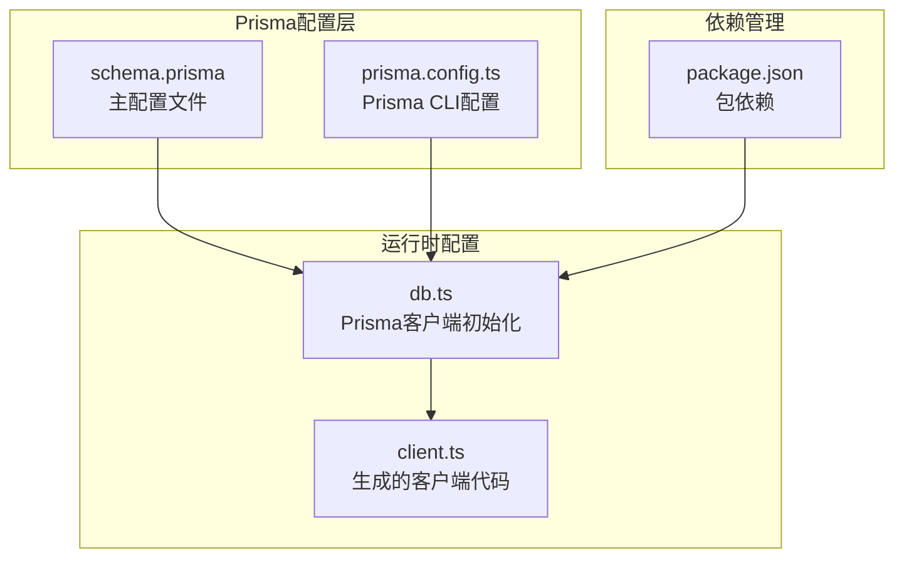
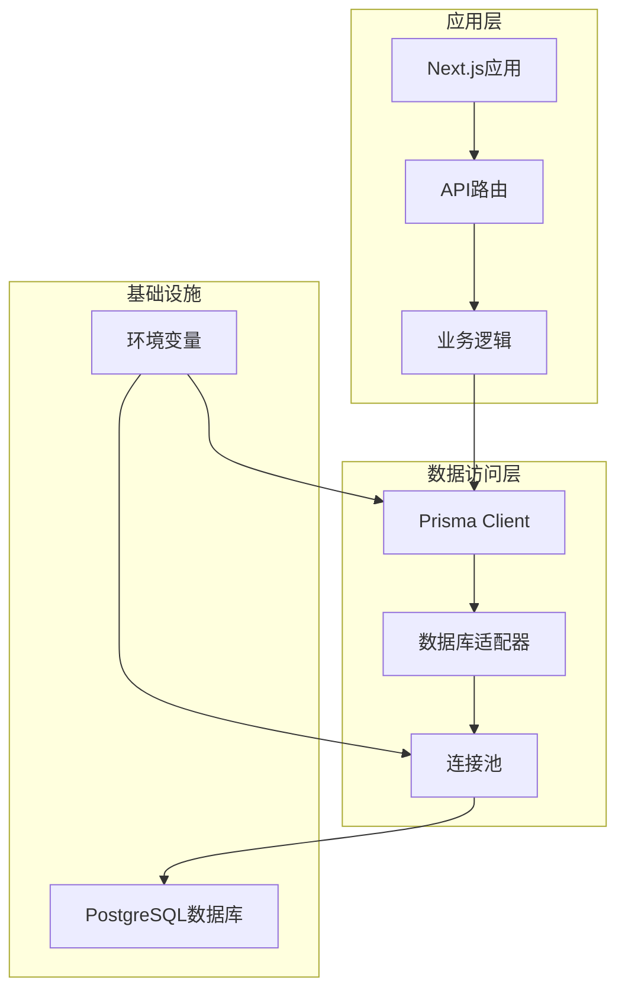
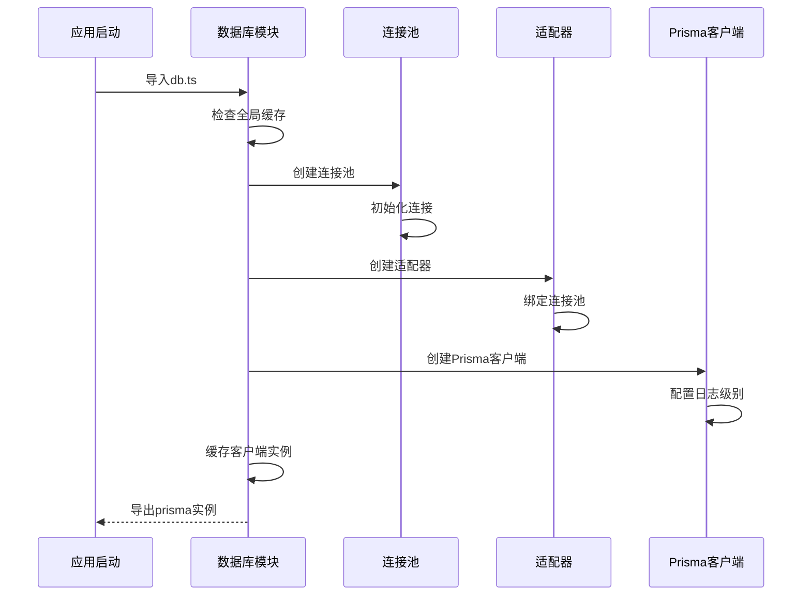
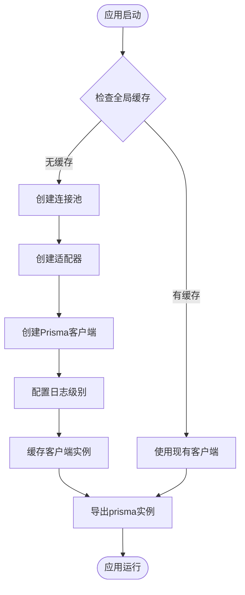
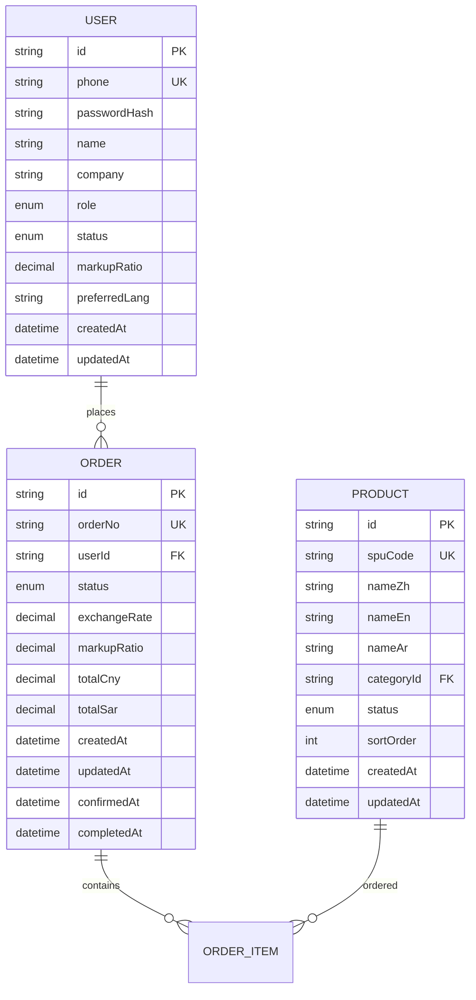

# Prisma客户端配置

<cite>
**本文档引用的文件**
- [schema.prisma](file://prisma/schema.prisma)
- [db.ts](file://src/lib/db.ts)
- [prisma.config.ts](file://prisma.config.ts)
- [package.json](file://package.json)
- [client.ts](file://src/generated/prisma/client.ts)
</cite>

## 目录
1. [简介](#简介)
2. [项目结构](#项目结构)
3. [核心组件](#核心组件)
4. [架构概览](#架构概览)
5. [详细组件分析](#详细组件分析)
6. [依赖关系分析](#依赖关系分析)
7. [性能考虑](#性能考虑)
8. [故障排除指南](#故障排除指南)
9. [结论](#结论)
10. [附录](#附录)

## 简介

本文档详细阐述了Celestia项目中Prisma客户端的配置与实现。Prisma作为Type-Safe的数据库ORM，在该项目中承担着数据访问层的核心职责。通过分析项目中的配置文件和实现代码，我们将深入解释Prisma客户端的初始化过程、数据库连接配置、连接池设置以及环境变量管理策略。

该项目采用PostgreSQL作为数据库后端，使用Prisma Client JavaScript生成器，并通过@prisma/adapter-pg适配器实现与pg库的集成。整个配置体系体现了现代TypeScript应用中数据库连接的最佳实践。

## 项目结构

Prisma相关配置在项目中的分布如下：



**图表来源**
- [schema.prisma:1-281](file://prisma/schema.prisma#L1-L281)
- [db.ts:1-18](file://src/lib/db.ts#L1-L18)
- [prisma.config.ts:1-15](file://prisma.config.ts#L1-L15)

**章节来源**
- [schema.prisma:1-281](file://prisma/schema.prisma#L1-L281)
- [db.ts:1-18](file://src/lib/db.ts#L1-L18)
- [prisma.config.ts:1-15](file://prisma.config.ts#L1-L15)
- [package.json:1-58](file://package.json#L1-L58)

## 核心组件

### Prisma Schema配置

项目的核心数据模型定义在schema.prisma文件中，该文件包含了完整的数据库模式定义：

**数据源配置**
- 使用PostgreSQL作为数据库提供程序
- 通过generator client生成Type-Safe的JavaScript客户端

**枚举类型系统**
项目定义了完整的业务枚举类型，包括用户角色(UserRole)、产品状态(ProductStatus)、订单状态(OrderStatus)等，这些枚举类型为强类型编程提供了基础。

**数据模型层次**
- 用户(User)：基础认证和权限管理
- 商品(Product)：产品SPU和SKU管理
- 订单(Order)：完整的订单生命周期管理
- 图片(ProductImage)：产品图片关联
- 支付(Payment)：多种支付方式支持
- 物流(Shipping)：物流跟踪信息

**章节来源**
- [schema.prisma:4-10](file://prisma/schema.prisma#L4-L10)
- [schema.prisma:16-70](file://prisma/schema.prisma#L16-L70)
- [schema.prisma:89-281](file://prisma/schema.prisma#L89-L281)

### 数据库连接配置

数据库连接通过src/lib/db.ts文件实现，采用了单例模式设计：

**连接池初始化**
- 使用pg库的Pool类创建连接池
- 从DATABASE_URL环境变量读取连接字符串
- 通过PrismaPg适配器实现与Prisma Client的集成

**日志配置策略**
- 开发环境启用详细查询日志(['query', 'error', 'warn'])
- 生产环境仅记录错误日志(['error'])

**单例模式实现**
- 使用全局对象存储PrismaClient实例
- 避免重复创建多个客户端实例
- 在非生产环境中缓存实例以提高性能

**章节来源**
- [db.ts:1-18](file://src/lib/db.ts#L1-L18)

### Prisma CLI配置

prisma.config.ts文件提供了Prisma CLI的配置选项：

**配置参数详解**
- schema：指定Prisma Schema文件路径
- migrations：迁移文件存储路径
- datasource.url：数据库连接字符串，从环境变量读取

**环境变量管理**
- 通过dotenv配置加载.env文件
- DATABASE_URL环境变量驱动所有数据库连接

**章节来源**
- [prisma.config.ts:1-15](file://prisma.config.ts#L1-L15)

## 架构概览

Prisma客户端在整个应用架构中的位置和交互关系如下：



**图表来源**
- [db.ts:9-15](file://src/lib/db.ts#L9-L15)
- [client.ts:31-33](file://src/generated/prisma/client.ts#L31-L33)

## 详细组件分析

### Prisma客户端初始化流程



**图表来源**
- [db.ts:5-17](file://src/lib/db.ts#L5-L17)

### 数据库连接生命周期



**图表来源**
- [db.ts:5-17](file://src/lib/db.ts#L5-L17)

### 环境变量管理策略

项目采用多环境配置策略：

**开发环境配置**
- NODE_ENV: development
- 启用详细查询日志
- 支持热重载和调试功能

**生产环境配置**
- NODE_ENV: production
- 仅记录错误日志
- 优化性能和安全性

**数据库连接管理**
- DATABASE_URL: PostgreSQL连接字符串
- 支持连接池参数配置
- 环境隔离和安全保护

**章节来源**
- [db.ts:12-15](file://src/lib/db.ts#L12-L15)
- [prisma.config.ts:11-13](file://prisma.config.ts#L11-L13)

### 数据模型关系图



**图表来源**
- [schema.prisma:90-106](file://prisma/schema.prisma#L90-L106)
- [schema.prisma:189-220](file://prisma/schema.prisma#L189-L220)
- [schema.prisma:123-149](file://prisma/schema.prisma#L123-L149)

**章节来源**
- [schema.prisma:89-281](file://prisma/schema.prisma#L89-L281)

## 依赖关系分析

### 核心依赖关系

```mermaid
graph LR
subgraph "运行时依赖"
A[@prisma/client]
B[@prisma/adapter-pg]
C[pg]
end
subgraph "开发时依赖"
D[prisma]
E[dotenv]
end
subgraph "应用代码"
F[db.ts]
G[schema.prisma]
H[prisma.config.ts]
end
F --> A
F --> B
F --> C
G --> A
H --> D
H --> E
```

**图表来源**
- [package.json:15-33](file://package.json#L15-L33)
- [db.ts:1-3](file://src/lib/db.ts#L1-L3)

### 版本兼容性

项目使用的Prisma相关版本具有良好的兼容性：
- Prisma Client: ^7.6.0
- Prisma Adapter PG: ^7.6.0
- pg库: ^8.20.0
- Prisma CLI: ^7.6.0

**章节来源**
- [package.json:15-33](file://package.json#L15-L33)

## 性能考虑

### 连接池优化

**连接池配置建议**
- 根据应用并发需求调整最大连接数
- 设置合理的连接超时时间
- 配置连接验证机制

**内存管理**
- 单例模式避免重复实例化
- 全局缓存减少内存占用
- 及时释放未使用的连接

**日志性能影响**
- 生产环境禁用详细查询日志
- 开发环境启用调试日志
- 避免在高负载场景下开启详细日志

### 查询优化策略

**索引使用**
- 为常用查询字段建立索引
- 利用Prisma的@@index指令
- 定期分析查询执行计划

**批量操作**
- 使用事务处理批量数据
- 避免N+1查询问题
- 合理使用预加载关联数据

## 故障排除指南

### 常见连接问题

**连接字符串格式错误**
- 检查DATABASE_URL格式是否正确
- 验证数据库主机、端口、数据库名
- 确认用户名和密码正确性

**连接池耗尽**
- 检查应用程序是否存在连接泄漏
- 调整最大连接数配置
- 实现适当的连接超时处理

**权限问题**
- 验证数据库用户权限
- 检查防火墙和网络连接
- 确认SSL配置正确性

### 日志诊断

**开发环境调试**
- 启用详细查询日志
- 监控慢查询性能
- 分析错误堆栈信息

**生产环境监控**
- 仅记录错误日志
- 设置告警阈值
- 定期审查日志内容

**章节来源**
- [db.ts:12-15](file://src/lib/db.ts#L12-L15)

## 结论

Celestia项目中的Prisma配置展现了现代TypeScript应用中数据库连接的最佳实践。通过精心设计的单例模式、灵活的环境变量管理以及完善的日志配置，项目实现了高性能、可维护的数据访问层。

关键优势包括：
- 单例模式确保资源的有效利用
- 环境隔离提供清晰的配置管理
- 强类型支持提升开发体验
- 完善的错误处理机制保证系统稳定性

这种配置方案为类似的企业级应用提供了可靠的参考模板。

## 附录

### 配置文件参数详解

**schema.prisma配置参数**
- generator.client.provider: "prisma-client-js"
- datasource.db.provider: "postgresql"

**prisma.config.ts配置参数**
- schema: 指定Prisma Schema文件路径
- migrations.path: 迁移文件存储目录
- datasource.url: 数据库连接字符串

### 环境变量清单

**必需环境变量**
- DATABASE_URL: PostgreSQL连接字符串
- NODE_ENV: 应用环境标识

**可选环境变量**
- PRISMA_CLIENT_ENGINE_TYPE: 引擎类型选择
- PRISMA_LOG_LEVEL: 日志级别配置

### 最佳实践建议

**开发环境**
- 启用详细日志记录
- 使用本地数据库实例
- 配置热重载支持

**生产环境**
- 禁用详细日志
- 使用连接池优化
- 实施监控和告警