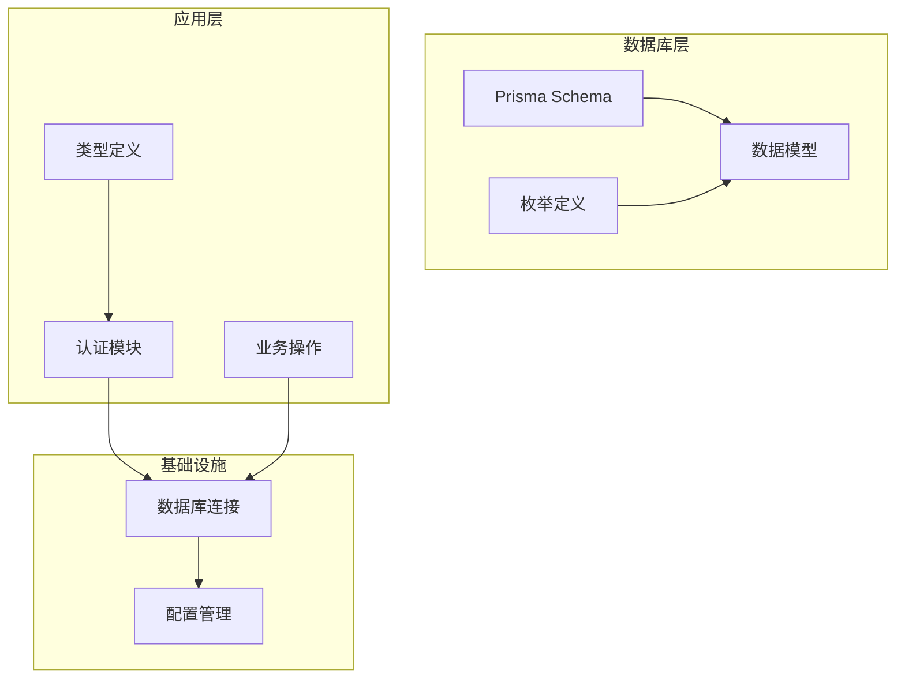
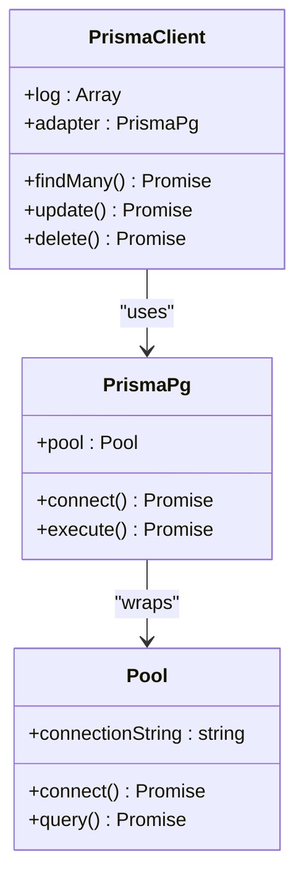
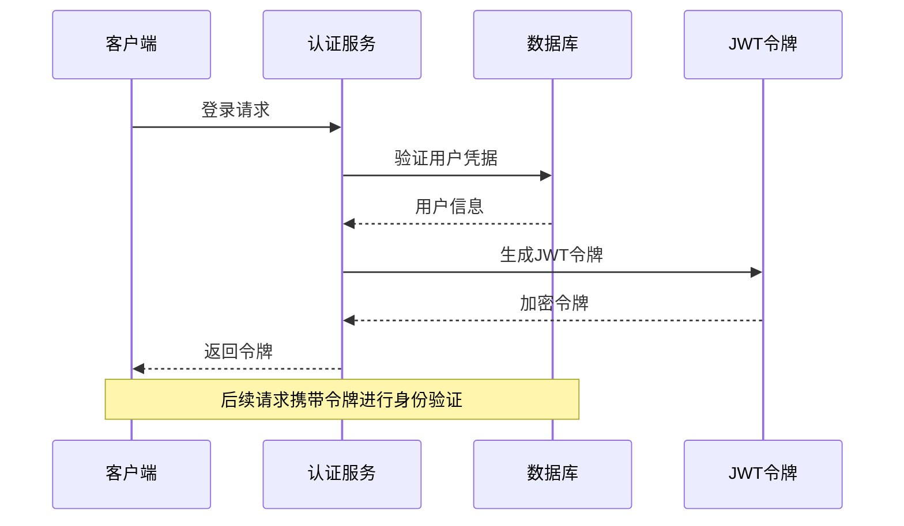
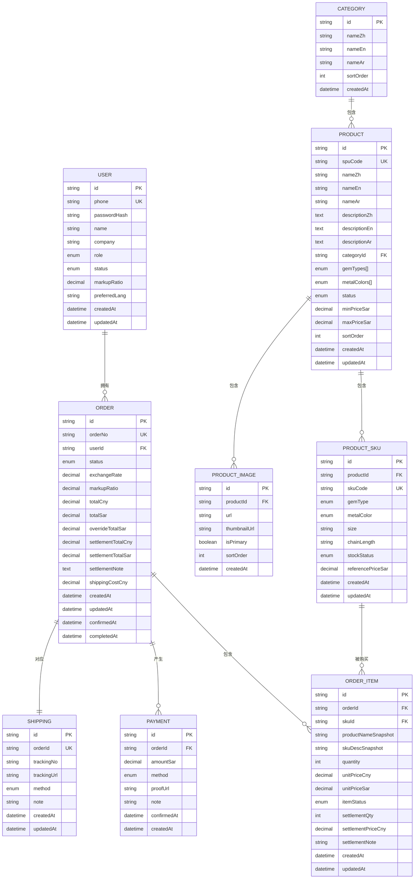
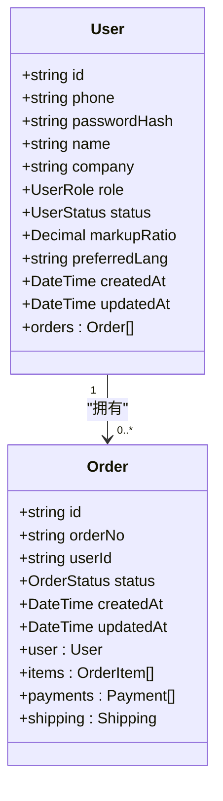
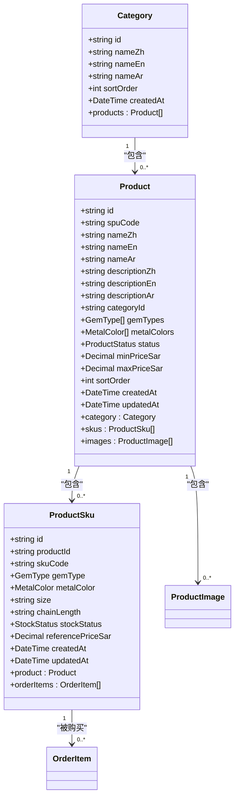
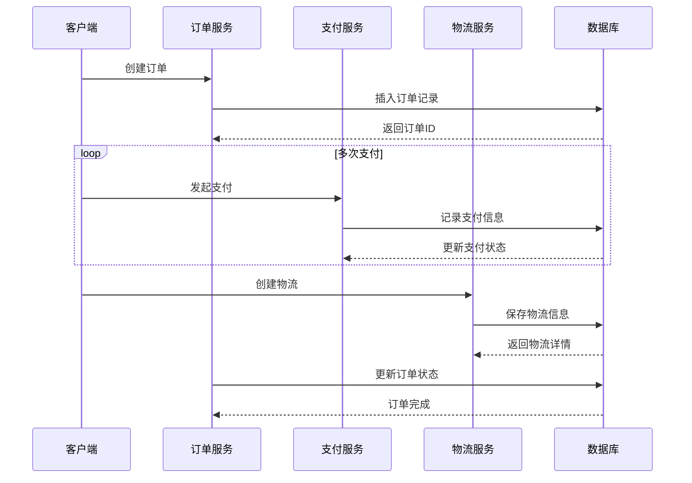
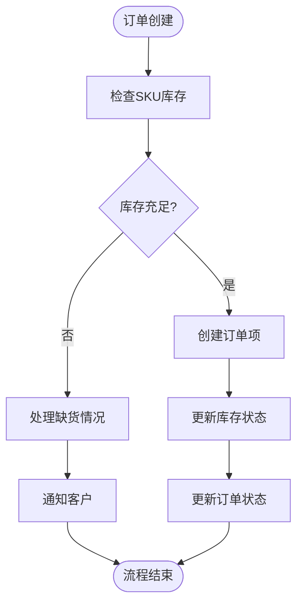
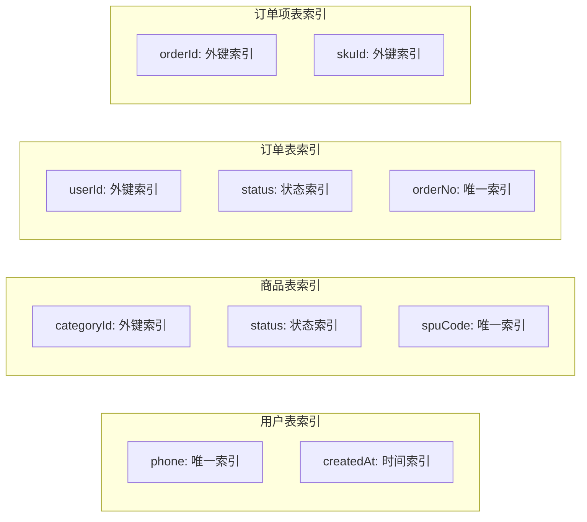
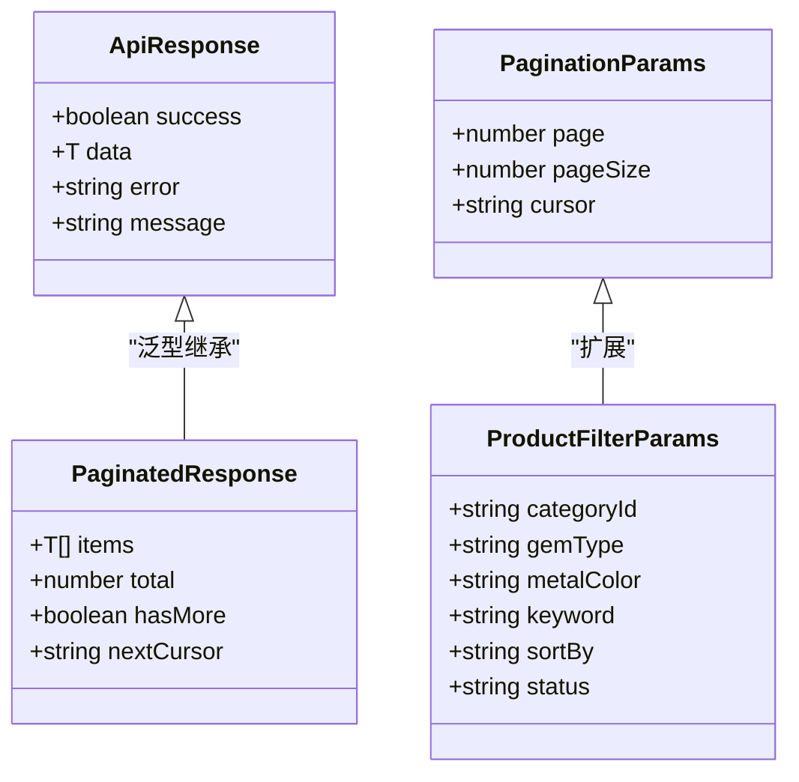

# 实体关系设计

<cite>
**本文档引用的文件**
- [schema.prisma](file://prisma/schema.prisma)
- [db.ts](file://src/lib/db.ts)
- [auth.ts](file://src/lib/auth.ts)
- [customer.ts](file://src/lib/actions/customer.ts)
- [index.ts](file://src/types/index.ts)
</cite>

## 目录
1. [简介](#简介)
2. [项目结构](#项目结构)
3. [核心组件](#核心组件)
4. [架构概览](#架构概览)
5. [详细组件分析](#详细组件分析)
6. [依赖分析](#依赖分析)
7. [性能考虑](#性能考虑)
8. [故障排除指南](#故障排除指南)
9. [结论](#结论)

## 简介

Celestia是一个珠宝电商平台，采用Prisma ORM进行数据库建模。该系统实现了完整的电商功能，包括用户管理、商品管理、订单处理和支付结算等核心业务流程。本文档详细分析了系统的实体关系设计，包括所有实体之间的关系类型、外键约束设计原则、引用完整性保证以及复杂关系的设计考量。

## 项目结构

系统采用模块化的项目结构，主要分为以下几个部分：

**图表来源**
- [schema.prisma:1-281](file://prisma/schema.prisma#L1-L281)
- [db.ts:1-18](file://src/lib/db.ts#L1-L18)

**章节来源**
- [schema.prisma:1-281](file://prisma/schema.prisma#L1-L281)
- [db.ts:1-18](file://src/lib/db.ts#L1-L18)

## 核心组件

### 数据库连接配置

系统使用Prisma Client配合PostgreSQL数据库，通过专用适配器实现连接池管理：

**图表来源**
- [db.ts:1-18](file://src/lib/db.ts#L1-L18)

### 认证与授权机制

系统实现了基于JWT的认证体系，支持管理员和普通用户的权限分离：

**图表来源**
- [auth.ts:57-97](file://src/lib/auth.ts#L57-L97)

**章节来源**
- [db.ts:1-18](file://src/lib/db.ts#L1-L18)
- [auth.ts:1-98](file://src/lib/auth.ts#L1-L98)

## 架构概览

### 实体关系图

Celestia系统的核心实体关系如下所示：

**图表来源**
- [schema.prisma:89-280](file://prisma/schema.prisma#L89-L280)

### 关系类型分析

系统中的实体关系可以分为以下几种类型：

#### 一对一关系 (1:1)
- **Order ↔ Shipping**: 每个订单对应唯一的物流信息
- **User ↔ 访问令牌**: 用户与JWT令牌的关联

#### 一对多关系 (1:n)
- **User → Order**: 一个用户可以拥有多个订单
- **Category → Product**: 一个品类包含多个商品
- **Product → ProductSku**: 一个商品包含多个SKU规格
- **Product → ProductImage**: 一个商品包含多张图片
- **Order → OrderItem**: 一个订单包含多个订单项
- **Order → Payment**: 一个订单可以有多笔付款记录

#### 多对多关系 (m:n)
- **Product ←→ GemType**: 商品与宝石类型的多对多关系
- **Product ←→ MetalColor**: 商品与金属颜色的多对多关系

**章节来源**
- [schema.prisma:89-280](file://prisma/schema.prisma#L89-L280)

## 详细组件分析

### 用户管理系统

用户系统是整个平台的基础，支持管理员和普通客户的双重角色：

**图表来源**
- [schema.prisma:90-106](file://prisma/schema.prisma#L90-L106)
- [schema.prisma:189-220](file://prisma/schema.prisma#L189-L220)

#### 外键约束设计

用户管理中的外键约束设计遵循以下原则：

1. **用户主键**: 使用UUID确保全局唯一性
2. **电话号码唯一性**: 通过`@unique`约束防止重复注册
3. **角色默认值**: 新用户默认为CUSTOMER角色
4. **状态管理**: 支持PENDING和ACTIVE两种状态

**章节来源**
- [schema.prisma:90-106](file://prisma/schema.prisma#L90-L106)

### 商品管理系统

商品系统采用SPU+SKU的两级结构，支持复杂的商品变体管理：

**图表来源**
- [schema.prisma:123-170](file://prisma/schema.prisma#L123-L170)
- [schema.prisma:109-120](file://prisma/schema.prisma#L109-L120)

#### 复杂关系设计考量

**Product与ProductSku的一对多关系**：
- 使用`onDelete: Cascade`确保当商品被删除时，其所有SKU规格自动清理
- SKU编码的唯一性保证了商品变体的唯一标识
- 多对多的宝石类型和金属颜色关系支持灵活的商品配置

**章节来源**
- [schema.prisma:123-170](file://prisma/schema.prisma#L123-L170)

### 订单处理系统

订单系统实现了完整的电商交易流程，包括订单创建、支付处理和物流配送：

**图表来源**
- [schema.prisma:189-280](file://prisma/schema.prisma#L189-L280)

#### 级联操作策略

系统在关系设计中采用了多种级联操作策略：

**级联删除 (Cascade)**:
- Product → ProductSku: 删除商品时自动删除其SKU
- Product → ProductImage: 删除商品时自动删除其图片
- Order → OrderItem: 删除订单时自动删除其订单项
- Order → Payment: 删除订单时自动删除其支付记录
- Order → Shipping: 删除订单时自动删除其物流信息

**级联更新 (No Action)**:
- 所有外键关系都采用默认的No Action策略，确保引用完整性

**章节来源**
- [schema.prisma:165](file://prisma/schema.prisma#L165)
- [schema.prisma:182](file://prisma/schema.prisma#L182)
- [schema.prisma:241](file://prisma/schema.prisma#L241)
- [schema.prisma:260](file://prisma/schema.prisma#L260)
- [schema.prisma:277](file://prisma/schema.prisma#L277)

### 订单项与库存管理

订单项系统实现了精确的商品追踪和库存管理：

**图表来源**
- [schema.prisma:223-247](file://prisma/schema.prisma#L223-L247)

**章节来源**
- [schema.prisma:223-247](file://prisma/schema.prisma#L223-L247)

## 依赖分析

### 数据库索引策略

系统在关键字段上建立了适当的索引以优化查询性能：

**图表来源**
- [schema.prisma:146](file://prisma/schema.prisma#L146)
- [schema.prisma:217](file://prisma/schema.prisma#L217)
- [schema.prisma:244](file://prisma/schema.prisma#L244)

### 类型系统设计

系统使用TypeScript接口定义统一的数据结构：

**图表来源**
- [index.ts:1-60](file://src/types/index.ts#L1-L60)

**章节来源**
- [index.ts:1-60](file://src/types/index.ts#L1-L60)

## 性能考虑

### 查询优化策略

1. **选择性字段查询**: 使用Prisma的select选项只获取需要的字段
2. **批量操作**: 对于大量数据操作，使用事务和批量插入
3. **索引优化**: 在高频查询字段上建立适当索引
4. **分页处理**: 实现游标分页避免深度分页的性能问题

### 缓存策略

系统采用Next.js的缓存机制：
- 页面级缓存：使用revalidatePath刷新特定页面
- 数据级缓存：Prisma客户端内置查询缓存
- 认证缓存：JWT令牌短期有效减少数据库查询

## 故障排除指南

### 常见问题及解决方案

**认证失败**:
- 检查JWT密钥配置
- 验证Cookie设置和域名配置
- 确认用户状态为ACTIVE

**数据库连接问题**:
- 验证DATABASE_URL环境变量
- 检查PostgreSQL服务器状态
- 确认网络连接和防火墙设置

**查询性能问题**:
- 分析慢查询日志
- 检查索引使用情况
- 优化查询条件和排序字段

**章节来源**
- [auth.ts:57-97](file://src/lib/auth.ts#L57-L97)
- [db.ts:9-15](file://src/lib/db.ts#L9-L15)

## 结论

Celestia项目的实体关系设计体现了现代电商系统的核心需求。通过合理的实体划分、清晰的关系映射和完善的外键约束，系统实现了良好的数据一致性和可维护性。

**关键设计优势**:
1. **层次化数据模型**: SPU+SKU的两级结构支持复杂的商品变体管理
2. **灵活的权限控制**: 基于角色的访问控制确保系统安全
3. **完整的业务流程**: 从商品管理到订单处理的全链路支持
4. **性能优化**: 合理的索引策略和查询优化保证系统性能

**未来改进建议**:
1. 实施更细粒度的权限控制
2. 添加数据备份和恢复机制
3. 优化大数据量场景下的查询性能
4. 增强监控和日志记录能力