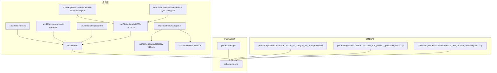
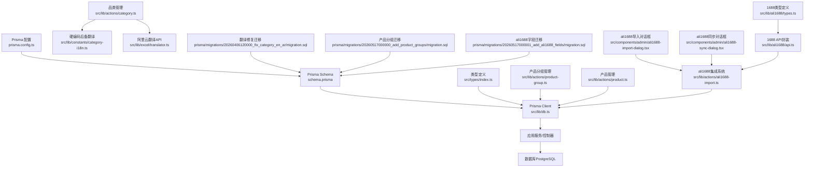
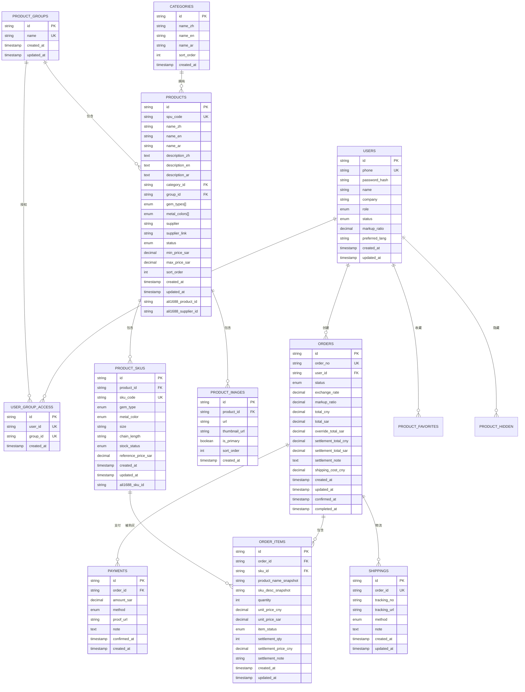
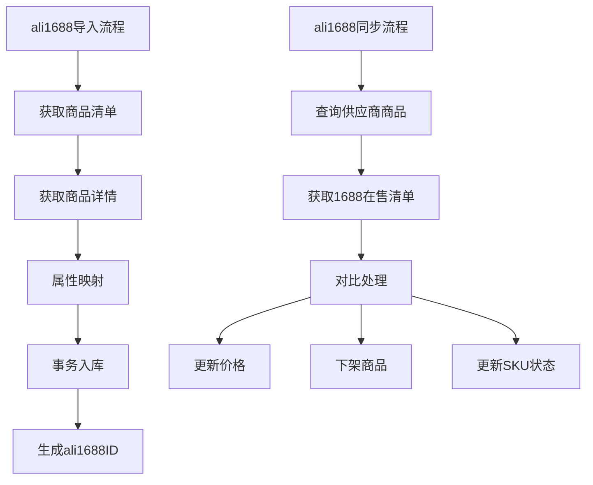
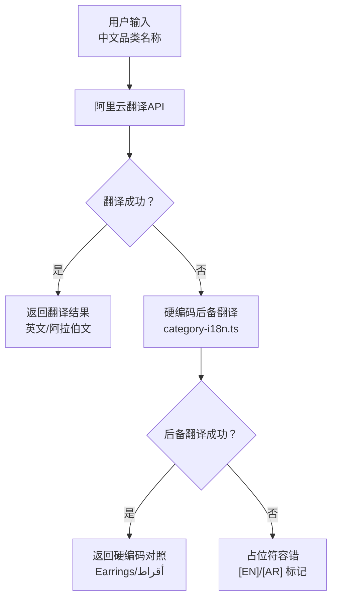
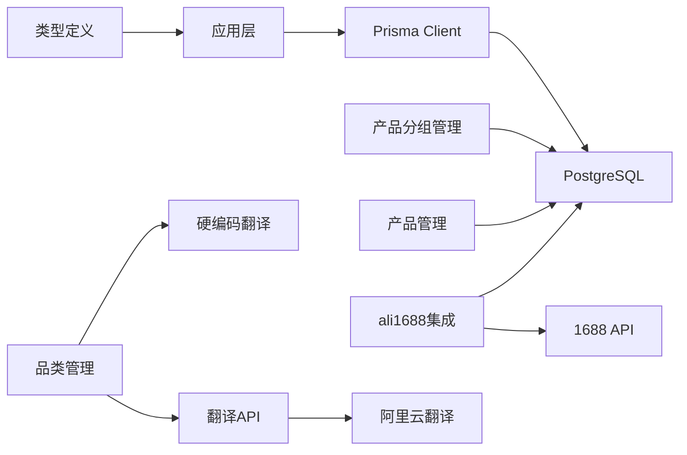

# 数据库设计

<cite>
**本文引用的文件**
- [schema.prisma](file://prisma/schema.prisma)
- [db.ts](file://src/lib/db.ts)
- [prisma.config.ts](file://prisma.config.ts)
- [index.ts](file://src/types/index.ts)
- [migration.sql](file://prisma/migrations/20260406120000_fix_category_en_ar/migration.sql)
- [migration.sql](file://prisma/migrations/20260517000000_add_product_groups/migration.sql)
- [migration.sql](file://prisma/migrations/20260517000001_add_ali1688_fields/migration.sql)
- [category.ts](file://src/lib/actions/category.ts)
- [category-i18n.ts](file://src/lib/constants/category-i18n.ts)
- [translator.ts](file://src/lib/excel/translator.ts)
- [category.ts](file://src/lib/validations/category.ts)
- [product-group.ts](file://src/lib/actions/product-group.ts)
- [product.ts](file://src/lib/actions/product.ts)
- [ali1688-import.ts](file://src/lib/actions/ali1688-import.ts)
- [ali1688-import-dialog.tsx](file://src/components/admin/ali1688-import-dialog.tsx)
- [ali1688-sync-dialog.tsx](file://src/components/admin/ali1688-sync-dialog.tsx)
- [api.ts](file://src/lib/ali1688/api.ts)
- [types.ts](file://src/lib/ali1688/types.ts)
</cite>

## 更新摘要
**所做更改**
- 新增ali1688集成相关字段：ali1688_product_id、ali1688_supplier_id、ali1688_sku_id
- 更新产品实体关系，增加1688集成数据跟踪能力
- 新增ali1688导入和同步功能的完整实现
- 更新实体关系图以反映新的1688集成架构
- 新增ali1688数据同步策略和幂等性保证机制

## 目录
1. [简介](#简介)
2. [项目结构](#项目结构)
3. [核心组件](#核心组件)
4. [架构总览](#架构总览)
5. [详细组件分析](#详细组件分析)
6. [依赖分析](#依赖分析)
7. [性能考虑](#性能考虑)
8. [故障排查指南](#故障排查指南)
9. [结论](#结论)
10. [附录](#附录)

## 简介
本文件为 Celestia 项目的数据库设计与实现文档，聚焦于基于 Prisma 的数据模型设计与运行时集成。内容涵盖核心实体（User、Product、Order、Category 等）的主键、外键、索引与约束；新增的产品分组架构；ali1688集成数据跟踪；枚举型业务状态与类型；数据访问模式与缓存策略建议；性能优化与迁移管理；以及数据生命周期、安全与隐私、访问控制等实践要点。文档同时提供实体关系图与数据流示意，帮助开发者与运维人员快速理解并维护数据库层。

**更新** 本版本反映了最新的数据库迁移和数据完整性改进，包括新增的产品分组架构、用户分组访问权限管理、品类翻译系统的三层容错机制，以及完整的ali1688集成数据跟踪能力。

## 项目结构
数据库层由以下关键部分组成：
- Prisma Schema：定义数据模型、枚举、索引与关系映射
- Prisma 配置：指定 schema 路径、迁移目录与数据源连接
- Prisma Client：在应用中以单例方式注入，支持开发环境日志
- 类型定义：统一 API 响应、分页、筛选与会话用户类型
- 翻译系统：包含阿里云翻译API、硬编码后备翻译和占位符容错机制
- 产品分组系统：支持商品分类管理和用户访问控制
- ali1688集成系统：支持1688商品导入、同步和数据跟踪

**图表来源**
- [prisma.config.ts:1-15](file://prisma.config.ts#L1-L15)
- [schema.prisma:1-350](file://prisma/schema.prisma#L1-L350)
- [db.ts:1-18](file://src/lib/db.ts#L1-L18)
- [index.ts:1-61](file://src/types/index.ts#L1-L61)
- [category.ts:1-112](file://src/lib/actions/category.ts#L1-L112)
- [product-group.ts:1-286](file://src/lib/actions/product-group.ts#L1-L286)
- [product.ts:1078-1130](file://src/lib/actions/product.ts#L1078-L1130)
- [ali1688-import.ts:1-972](file://src/lib/actions/ali1688-import.ts#L1-L972)
- [category-i18n.ts:1-17](file://src/lib/constants/category-i18n.ts#L1-L17)
- [translator.ts:1-190](file://src/lib/excel/translator.ts#L1-L190)
- [ali1688-import-dialog.tsx:1-544](file://src/components/admin/ali1688-import-dialog.tsx#L1-L544)
- [ali1688-sync-dialog.tsx:1-164](file://src/components/admin/ali1688-sync-dialog.tsx#L1-L164)
- [migration.sql:1-19](file://prisma/migrations/20260406120000_fix_category_en_ar/migration.sql#L1-L19)
- [migration.sql:1-32](file://prisma/migrations/20260517000000_add_product_groups/migration.sql#L1-L32)
- [migration.sql:1-6](file://prisma/migrations/20260517000001_add_ali1688_fields/migration.sql#L1-L6)

**章节来源**
- [prisma.config.ts:1-15](file://prisma.config.ts#L1-L15)
- [schema.prisma:1-350](file://prisma/schema.prisma#L1-L350)
- [db.ts:1-18](file://src/lib/db.ts#L1-L18)
- [index.ts:1-61](file://src/types/index.ts#L1-L61)

## 核心组件
本节概述数据库的核心实体与业务枚举，明确主键、唯一性、默认值与字段精度等约束。新增的产品分组架构包括商品分组管理和用户访问控制，以及ali1688集成数据跟踪能力。

- 用户（User）
  - 主键：String（cuid）
  - 唯一键：phone
  - 默认值：role=CUSTOMER、status=PENDING、markupRatio=1.15、preferredLang=en
  - 时间戳：createdAt、updatedAt
  - 关系：一对多 -> Order、ProductFavorite、ProductHidden、UserGroupAccess

- 品类（Category）
  - 主键：String（cuid）
  - 多语言字段：nameZh/nameEn/nameAr
  - 排序：sortOrder，默认 0
  - 时间戳：createdAt
  - 关系：一对多 -> Product

- 商品（Product）
  - 主键：String（cuid）
  - 唯一键：spuCode
  - 外键：categoryId -> Category.id，groupId -> ProductGroup.id（可为空）
  - 枚举：gemTypes、metalColors（数组）
  - 状态：status，默认 ACTIVE
  - 价格范围：minPriceSar/maxPriceSar（Decimal 10,2）
  - 排序：sortOrder，默认 0
  - 时间戳：createdAt、updatedAt
  - **新增ali1688集成字段**：ali1688ProductId（跟踪1688商品ID）、ali1688SupplierId（跟踪1688供应商ID）
  - 关系：一对多 -> ProductSku、ProductImage；多对一 -> Category、ProductGroup

- 商品分组（ProductGroup）
  - 主键：String（cuid）
  - 唯一键：name
  - 时间戳：createdAt、updatedAt
  - 关系：一对多 -> Product、UserGroupAccess

- 用户分组访问权限（UserGroupAccess）
  - 主键：String（cuid）
  - 唯一键：userId、groupId组合
  - 时间戳：createdAt
  - 关系：多对一 -> User、ProductGroup

- SKU（ProductSku）
  - 主键：String（cuid）
  - 唯一键：skuCode
  - 外键：productId -> Product.id（级联删除）
  - 枚举：gemType、metalColor
  - 库存状态：stockStatus，默认 IN_STOCK
  - 参考价：referencePriceSar（Decimal 10,2）
  - 时间戳：createdAt、updatedAt
  - **新增ali1688集成字段**：ali1688SkuId（跟踪1688 SKU ID）
  - 关系：一对多 -> OrderItem；多对一 -> Product

- 图片（ProductImage）
  - 主键：String（cuid）
  - 外键：productId -> Product.id（级联删除）
  - 字段：url、thumbnailUrl、isPrimary、sortOrder
  - 时间戳：createdAt
  - 关系：多对一 -> Product

- 订单（Order）
  - 主键：String（cuid）
  - 唯一键：orderNo
  - 外键：userId -> User.id
  - 状态：status，默认 PENDING_QUOTE
  - 定价字段：exchangeRate（Decimal 8,4）、markupRatio（Decimal 4,2）、totalCny/totalSar/overrideTotalSar（Decimal 12,2）
  - 结算字段：settlementTotalCny/settlementTotalSar（Decimal 12,2）、settlementNote
  - 物流费用：shippingCostCny（Decimal 10,2）
  - 时间戳：createdAt、updatedAt、confirmedAt、completedAt
  - 关系：多对一 -> User；一对多 -> OrderItem、Payment、Shipping

- 订单项（OrderItem）
  - 主键：String（cuid）
  - 外键：orderId -> Order.id（级联删除）、skuId -> ProductSku.id
  - 字段：productNameSnapshot/skuDescSnapshot、quantity、unitPriceCny/unitPriceSar（Decimal 10,2）
  - 状态：itemStatus，默认 PENDING_QUOTE
  - 结算字段：settlementQty、settlementPriceCny（Decimal 10,2）、settlementNote
  - 时间戳：createdAt、updatedAt
  - 关系：多对一 -> Order、ProductSku

- 付款（Payment）
  - 主键：String（cuid）
  - 外键：orderId -> Order.id（级联删除）
  - 字段：amountSar（Decimal 12,2）、method（枚举）、proofUrl、note
  - 时间戳：confirmedAt、createdAt
  - 关系：多对一 -> Order

- 物流（Shipping）
  - 主键：String（cuid）
  - 唯一键：orderId（一对一）
  - 外键：orderId -> Order.id（级联删除）
  - 字段：trackingNo、trackingUrl、method（枚举）、note
  - 时间戳：createdAt、updatedAt
  - 关系：一对一 -> Order

**章节来源**
- [schema.prisma:85-350](file://prisma/schema.prisma#L85-L350)

## 架构总览
下图展示数据库层的整体架构与数据流向，包括 Prisma Schema、配置、客户端注入与类型系统，以及新增的产品分组架构、ali1688集成系统和翻译系统三层容错机制。

**图表来源**
- [schema.prisma:1-350](file://prisma/schema.prisma#L1-L350)
- [db.ts:1-18](file://src/lib/db.ts#L1-L18)
- [prisma.config.ts:1-15](file://prisma.config.ts#L1-L15)
- [index.ts:1-61](file://src/types/index.ts#L1-L61)
- [category.ts:1-112](file://src/lib/actions/category.ts#L1-L112)
- [product-group.ts:1-286](file://src/lib/actions/product-group.ts#L1-L286)
- [product.ts:1078-1130](file://src/lib/actions/product.ts#L1078-L1130)
- [ali1688-import.ts:1-972](file://src/lib/actions/ali1688-import.ts#L1-L972)
- [ali1688-import-dialog.tsx:1-544](file://src/components/admin/ali1688-import-dialog.tsx#L1-L544)
- [ali1688-sync-dialog.tsx:1-164](file://src/components/admin/ali1688-sync-dialog.tsx#L1-L164)
- [api.ts:1-87](file://src/lib/ali1688/api.ts#L1-L87)
- [types.ts:1-74](file://src/lib/ali1688/types.ts#L1-L74)
- [category-i18n.ts:1-17](file://src/lib/constants/category-i18n.ts#L1-L17)
- [translator.ts:1-190](file://src/lib/excel/translator.ts#L1-L190)
- [migration.sql:1-19](file://prisma/migrations/20260406120000_fix_category_en_ar/migration.sql#L1-L19)
- [migration.sql:1-32](file://prisma/migrations/20260517000000_add_product_groups/migration.sql#L1-L32)
- [migration.sql:1-6](file://prisma/migrations/20260517000001_add_ali1688_fields/migration.sql#L1-L6)

## 详细组件分析

### 实体关系图（ERD）
该图为基于 Prisma Schema 的实体关系可视化，标注了主键、外键与基数约束，包括新增的产品分组架构和ali1688集成数据跟踪能力。

**图表来源**
- [schema.prisma:85-350](file://prisma/schema.prisma#L85-L350)

**章节来源**
- [schema.prisma:85-350](file://prisma/schema.prisma#L85-L350)

### ali1688集成架构设计

#### ali1688数据跟踪字段
新增的ali1688集成字段提供了完整的1688数据跟踪能力：

- **Product 实体扩展**
  - 新增 ali1688ProductId 字段：跟踪1688商品ID，用于幂等性检查和数据同步
  - 新增 ali1688SupplierId 字段：跟踪1688供应商ID，用于供应商维度的数据管理
  - 支持商品级别的1688数据关联和同步

- **ProductSku 实体扩展**
  - 新增 ali1688SkuId 字段：跟踪1688 SKU ID，用于精确的SKU级数据同步
  - 支持SKU级别的1688数据关联和价格同步

#### ali1688导入和同步功能
系统提供了完整的ali1688集成解决方案：

- **导入流程**
  - 供应商信息输入：sellerOpenId、供应商名称、SPU前缀、汇率、商品数量
  - 商品数据获取：分页获取1688商品清单，支持最多5并发的商品详情获取
  - 属性映射：将1688属性映射到系统属性字段（宝石类型、金属颜色、主石尺寸、尺码、链长度）
  - 数据入库：事务性入库，包含商品、SKU、图片的完整创建
  - 幂等性保证：通过ali1688ProductId检查避免重复导入

- **同步流程**
  - 供应商维度同步：按供应商ID同步所有商品的价格和状态
  - 价格更新：对比1688当前价格，批量更新系统中的参考价格
  - 商品下架：检测1688中已下架的商品，在系统中标记为下架
  - SKU状态管理：同步SKU的库存状态，对已下架SKU标记为缺货
  - 统计报告：提供详细的同步统计信息，包括更新商品数、更新SKU数、下架商品数等

**图表来源**
- [ali1688-import.ts:212-355](file://src/lib/actions/ali1688-import.ts#L212-L355)
- [ali1688-import.ts:721-971](file://src/lib/actions/ali1688-import.ts#L721-L971)

#### 用户界面集成
系统提供了完整的用户界面来管理ali1688集成：

- **导入对话框**
  - 多步骤向导：输入参数 → 获取数据 → 属性映射 → 入库结果
  - 实时进度显示：加载状态、错误提示、成功统计
  - 属性映射界面：可视化展示1688属性与系统属性的对应关系

- **同步对话框**
  - 参数配置：供应商ID、汇率设置
  - 同步进度：实时显示同步状态和进度
  - 结果展示：详细的统计信息和错误报告

**章节来源**
- [schema.prisma:143-144](file://prisma/schema.prisma#L143-L144)
- [schema.prisma:172](file://prisma/schema.prisma#L172)
- [migration.sql:1-6](file://prisma/migrations/20260517000001_add_ali1688_fields/migration.sql#L1-L6)
- [ali1688-import.ts:1-972](file://src/lib/actions/ali1688-import.ts#L1-L972)
- [ali1688-import-dialog.tsx:1-544](file://src/components/admin/ali1688-import-dialog.tsx#L1-L544)
- [ali1688-sync-dialog.tsx:1-164](file://src/components/admin/ali1688-sync-dialog.tsx#L1-L164)

### 产品分组架构设计

#### 商品分组管理
新增的产品分组架构支持灵活的商品分类和权限控制：

- **ProductGroup 实体**
  - 主键：String（cuid）
  - 唯一键：name（唯一标识分组名称）
  - 时间戳：createdAt、updatedAt
  - 关系：一对多 -> Product、UserGroupAccess

- **UserGroupAccess 实体**
  - 主键：String（cuid）
  - 唯一键：userId、groupId 组合（防止重复授权）
  - 时间戳：createdAt
  - 关系：多对一 -> User、ProductGroup

- **Product 实体扩展**
  - 新增 groupId 字段（可为空）
  - 外键：groupId -> ProductGroup.id（SET NULL 删除策略）
  - 支持商品归属多个分组或无分组状态

#### 权限控制机制
- **管理员权限**：ADMIN 角色可完全管理产品分组和访问权限
- **用户访问控制**：通过 UserGroupAccess 控制用户对特定分组商品的访问
- **数据隔离**：用户只能看到被授权访问的商品分组内容

**章节来源**
- [schema.prisma:324-349](file://prisma/schema.prisma#L324-L349)
- [migration.sql:1-32](file://prisma/migrations/20260517000000_add_product_groups/migration.sql#L1-L32)
- [product-group.ts:1-286](file://src/lib/actions/product-group.ts#L1-L286)

### 数据访问模式与缓存策略
- 单例客户端注入
  - 在应用启动时创建 Prisma Client，并通过全局对象在开发环境复用，避免重复初始化带来的开销。
  - 日志级别根据 NODE_ENV 动态设置，开发环境开启查询与警告日志，生产环境仅记录错误。
- 查询与更新
  - 使用 Prisma Client 的 CRUD 方法进行读写，结合索引列（如 userId、status、spuCode、skuCode、group_id、ali1688ProductId、ali1688SupplierId 等）提升查询效率。
  - 新增产品分组查询支持：按分组名称、用户权限过滤商品。
  - 新增ali1688集成查询支持：按1688商品ID、供应商ID、SKU ID进行精确查询。
- 缓存建议
  - 对高频读取且不频繁变更的数据（如品类列表、商品基础信息、分组列表、ali1688商品清单）可采用进程内缓存或外部缓存（Redis），设置 TTL 并在写操作后失效或更新。
  - 对于复杂聚合查询（如订单统计、商品销量排行、分组商品数量统计、ali1688同步统计），建议使用物化视图或定期任务生成缓存条目。
- 分页与游标
  - 类型系统提供游标分页参数，可在高基数表上使用基于游标的分页以降低偏移成本。
  - 新增分组商品分页支持，结合用户权限过滤。
  - 新增ali1688商品分页支持，支持按供应商ID和商品状态过滤。

**章节来源**
- [db.ts:1-18](file://src/lib/db.ts#L1-L18)
- [index.ts:9-22](file://src/types/index.ts#L9-L22)
- [product-group.ts:13-42](file://src/lib/actions/product-group.ts#L13-L42)
- [ali1688-import.ts:737-740](file://src/lib/actions/ali1688-import.ts#L737-L740)

### 性能优化考虑
- 索引策略
  - 在 Product、Order、OrderItem、ProductSku、ProductImage、ProductGroup、UserGroupAccess 等高频过滤字段上建立索引，例如：
    - Product.categoryId、Product.status、Product.groupId、Product.ali1688ProductId、Product.ali1688SupplierId
    - Order.userId、Order.status
    - OrderItem.orderId、OrderItem.skuId
    - ProductSku.productId、ProductSku.ali1688SkuId
    - ProductImage.productId
    - ProductGroup.name（唯一索引）
    - UserGroupAccess.userId、UserGroupAccess.groupId（联合唯一索引）
- 字段精度
  - 金额类字段采用 Decimal 类型并指定精度（如 10,2 或 12,2），避免浮点误差。
- 查询优化
  - 使用 select 投影只取必要字段，减少网络与序列化开销。
  - 对批量写入使用事务与批量 API，降低往返次数。
  - 新增分组查询优化：使用 include 预加载关联数据，避免 N+1 查询问题。
  - 新增ali1688查询优化：使用精确的ID匹配和供应商维度过滤，避免全表扫描。
- 连接池与并发
  - 在生产环境中合理配置数据库连接池大小与超时时间，避免峰值阻塞。
  - ali1688同步操作使用并发池控制（最多5并发），平衡性能和API限制。

**章节来源**
- [schema.prisma:153-156](file://prisma/schema.prisma#L153-L156)
- [schema.prisma:174](file://prisma/schema.prisma#L174)
- [schema.prisma:190](file://prisma/schema.prisma#L190)
- [schema.prisma:328-332](file://prisma/schema.prisma#L328-L332)
- [schema.prisma:344](file://prisma/schema.prisma#L344)
- [ali1688-import.ts:125-152](file://src/lib/actions/ali1688-import.ts#L125-L152)

### 数据生命周期管理、保留策略与归档规则
- 留存策略
  - 基于业务需求设定订单与用户数据的保留期限（如 3-7 年），到期后进行匿名化或删除。
  - 产品分组和访问权限数据长期保留，用于审计和权限追溯。
  - ali1688集成数据保留策略：商品和SKU的ali1688 ID作为元数据长期保留，用于数据同步和审计。
- 归档规则
  - 将历史订单与支付记录迁移到归档库或冷存储，保留关键索引以便审计查询。
  - 分组访问权限变更历史可单独归档，便于权限审计。
  - ali1688同步历史可归档，保留同步统计和错误日志。
- 清理流程
  - 定期任务扫描过期数据，先归档再删除，确保不可逆操作前有备份与审计日志。
  - 删除产品分组时，使用 SET NULL 策略保持商品数据完整性。
  - ali1688集成数据清理：对已删除的1688商品，系统自动将其标记为下架而非物理删除。
- 合规性
  - 遵循数据最小化原则，仅保留完成交易与合规所需的最少信息。
  - 用户访问权限数据需符合 GDPR 等隐私法规要求。
  - ali1688集成数据遵循相关数据保护法规。

### 数据安全、隐私要求与访问控制
- 最小权限
  - 数据库用户仅授予应用所需权限，避免超级权限暴露。
  - 新增产品分组权限控制，ADMIN 角色可管理所有分组，普通用户只能访问授权分组。
  - ali1688集成功能仅限ADMIN角色使用，防止未授权的数据导入和同步。
- 加密
  - 敏感字段（如密码哈希、支付凭证）在传输与存储层面加密；密码使用强哈希算法。
  - ali1688 API密钥和配置信息通过环境变量管理，避免硬编码。
- 访问控制
  - 应用层通过角色（ADMIN/CUSTOMER）限制对敏感资源的访问；API 层进行鉴权与授权校验。
  - 新增分组访问控制：用户必须具有相应的 UserGroupAccess 权限才能查看商品。
  - ali1688功能访问控制：只有ADMIN用户可以执行导入和同步操作。
- 审计
  - 记录关键数据变更（如订单状态、价格覆盖、库存调整、分组权限变更、ali1688导入同步）的审计日志，保留至少一年。
  - 产品分组创建、修改、删除操作均需记录审计日志。
  - ali1688操作审计：记录导入、同步的详细过程和结果。

### 数据迁移路径与版本管理策略
- 迁移目录
  - Prisma 迁移文件位于 prisma/migrations，每次 schema 变更生成新迁移。
  - 新增产品分组迁移：20260517000000_add_product_groups/migration.sql
  - 新增ali1688字段迁移：20260517000001_add_ali1688_fields/migration.sql
- 版本管理
  - 迁移文件名包含时间戳与描述，确保可追溯性；合并到主分支前需本地验证与测试。
  - 产品分组迁移包含完整的表结构定义和外键约束设置。
  - ali1688字段迁移添加了必要的TEXT字段用于存储1688集成数据。
- 回滚策略
  - 通过 Prisma CLI 执行迁移回滚；生产环境回滚需评估影响并制定应急预案。
  - 产品分组迁移回滚时需注意外键约束的删除顺序。
  - ali1688字段迁移回滚时需删除新增的TEXT字段。
- 环境一致性
  - 开发、预发布与生产环境使用相同迁移脚本，确保 schema 一致。

**章节来源**
- [prisma.config.ts:8-10](file://prisma.config.ts#L8-L10)
- [migration.sql:1-32](file://prisma/migrations/20260517000000_add_product_groups/migration.sql#L1-L32)
- [migration.sql:1-6](file://prisma/migrations/20260517000001_add_ali1688_fields/migration.sql#L1-L6)

### 翻译系统架构与数据完整性改进

#### 翻译系统三层容错机制
系统实现了从云端翻译到硬编码后备再到占位符容错的三层保护机制：

1. **云端翻译优先级**：使用阿里云翻译API进行实时翻译
2. **硬编码后备翻译**：针对固定品类词汇的硬编码对照表
3. **占位符容错保护**：当所有翻译方式失败时使用占位符标记

**图表来源**
- [category.ts:69-88](file://src/lib/actions/category.ts#L69-L88)
- [category-i18n.ts:1-17](file://src/lib/constants/category-i18n.ts#L1-L17)
- [translator.ts:22-86](file://src/lib/excel/translator.ts#L22-L86)

#### 数据完整性改进
执行了专门的category表翻译修复迁移，修正了以下四个核心品类的英阿翻译错误：

- 耳钉 → Earrings / أقراط
- 项链 → Necklace / عقد  
- 手链 → Bracelet / سوار
- 戒指 → Ring / خاتم

**章节来源**
- [migration.sql:1-19](file://prisma/migrations/20260406120000_fix_category_en_ar/migration.sql#L1-L19)
- [category-i18n.ts:8-12](file://src/lib/constants/category-i18n.ts#L8-L12)
- [category.ts:69-88](file://src/lib/actions/category.ts#L69-L88)

## 依赖分析
- 组件耦合
  - 应用通过 Prisma Client 访问数据库，耦合度低，便于替换底层存储。
  - 类型系统与 Prisma Schema 解耦，类型定义独立于 ORM。
  - 翻译系统通过模块化设计实现松耦合，支持多种翻译源。
  - 新增产品分组系统通过独立的 Action 层与数据库交互。
  - 新增ali1688集成系统通过独立的Action层与1688 API交互。
- 外部依赖
  - PostgreSQL 作为数据源；Prisma Client 提供类型安全的查询接口。
  - 阿里云翻译API作为外部翻译服务。
  - 1688开放平台API作为外部数据源。
- 潜在风险
  - 过度依赖全局单例可能影响测试隔离；建议在测试中注入可替换的客户端实例。
  - 翻译系统依赖外部API，需要完善的容错机制。
  - 产品分组权限控制需要严格的权限验证和审计机制。
  - ali1688集成依赖外部API，需要完善的错误处理和重试机制。
  - ali1688同步操作涉及大量并发请求，需要合理的超时和重试策略。

**图表来源**
- [db.ts:1-18](file://src/lib/db.ts#L1-L18)
- [schema.prisma:1-350](file://prisma/schema.prisma#L1-L350)
- [index.ts:1-61](file://src/types/index.ts#L1-L61)
- [category.ts:1-112](file://src/lib/actions/category.ts#L1-L112)
- [product-group.ts:1-286](file://src/lib/actions/product-group.ts#L1-L286)
- [product.ts:1078-1130](file://src/lib/actions/product.ts#L1078-L1130)
- [ali1688-import.ts:1-972](file://src/lib/actions/ali1688-import.ts#L1-L972)
- [category-i18n.ts:1-17](file://src/lib/constants/category-i18n.ts#L1-L17)
- [translator.ts:1-190](file://src/lib/excel/translator.ts#L1-L190)
- [api.ts:1-87](file://src/lib/ali1688/api.ts#L1-L87)

**章节来源**
- [db.ts:1-18](file://src/lib/db.ts#L1-L18)
- [index.ts:1-61](file://src/types/index.ts#L1-L61)

## 性能考虑
- 索引与查询
  - 为高频过滤字段建立复合索引与单列索引，避免全表扫描。
  - 新增产品分组相关索引：Product.groupId、ProductGroup.name、UserGroupAccess.userId、UserGroupAccess.groupId。
  - 新增ali1688相关索引：Product.ali1688ProductId、Product.ali1688SupplierId、ProductSku.ali1688SkuId。
- 写入优化
  - 使用事务批量插入与更新，减少锁竞争。
  - 分组权限批量授权时使用批量操作提高效率。
  - ali1688导入使用事务保证数据一致性，批量创建商品、SKU和图片。
- 缓存与异步
  - 对热点数据采用缓存；对耗时任务采用消息队列异步处理。
  - 分组商品数量统计可使用缓存减少数据库压力。
  - ali1688同步使用并发池控制（最多5并发），平衡性能和API限制。
- 监控与告警
  - 监控慢查询、连接数与锁等待，及时发现瓶颈。
  - 新增分组权限查询监控，防止权限验证成为性能瓶颈。
  - ali1688同步监控，跟踪API调用成功率和错误率。
- 翻译性能优化
  - 批量翻译减少API调用次数
  - 硬编码后备翻译避免云端API延迟
  - 占位符容错机制确保系统稳定性

## 故障排查指南
- 常见问题
  - 连接失败：检查 DATABASE_URL 与网络连通性。
  - 权限不足：核对数据库用户权限与 SSL 设置。
  - 迁移失败：查看迁移日志，修复冲突后再重试。
  - 翻译失败：检查阿里云API密钥配置与网络连通性。
  - 分组权限错误：检查 UserGroupAccess 表的唯一约束和外键关系。
  - ali1688集成失败：检查1688 API密钥配置、网络连通性和错误日志。
  - ali1688同步超时：检查并发设置、API配额限制和重试策略。
- 日志与诊断
  - 开发环境启用 Prisma 查询日志，定位慢查询与异常 SQL。
  - 应用层捕获 Prisma 异常并记录上下文信息，便于追踪。
  - 翻译系统记录API调用失败与后备翻译触发日志。
  - 分组权限系统记录权限验证失败和访问尝试日志。
  - ali1688系统记录API调用日志、导入错误和同步统计。
  - ali1688同步系统记录详细的同步过程和错误信息。

**章节来源**
- [db.ts:12-15](file://src/lib/db.ts#L12-L15)

## 结论
本设计以 Prisma Schema 明确实体关系与约束，配合类型系统与单例客户端实现高效、可维护的数据访问。通过合理的索引、缓存与迁移策略，兼顾性能与可演进性。新增的产品分组架构提供了灵活的商品分类和细粒度的访问控制机制，支持业务的多样化需求。最新的ali1688集成系统提供了完整的商品导入、同步和数据跟踪能力，支持与1688平台的深度集成。新增的ali1688字段确保了数据的幂等性和可追溯性。最新的翻译系统三层容错机制确保了数据完整性与系统稳定性，而专门的category表翻译修复迁移则解决了核心品类的翻译准确性问题。建议在生产环境中完善审计、归档与安全策略，确保数据生命周期合规与系统稳定。

## 附录
- 术语
  - SPU：标准产品单元
  - SKU：库存量单位
  - Decimal(m,n)：定点数，m 为精度，n 为小数位
  - I18N：国际化（Internationalization）
  - API：应用程序接口
  - 分组：ProductGroup，用于商品分类管理
  - 权限：UserGroupAccess，用于用户访问控制
  - 1688：阿里巴巴旗下跨境B2B电商平台
  - ali1688：系统中对1688平台的集成标识
- 参考
  - Prisma 文档：https://www.prisma.io/docs
  - 阿里云翻译API：https://help.aliyun.com/document_detail/171571.html
  - 1688开放平台API：https://open.1688.com/