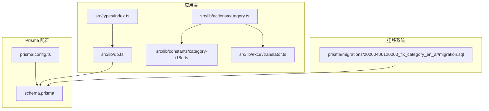
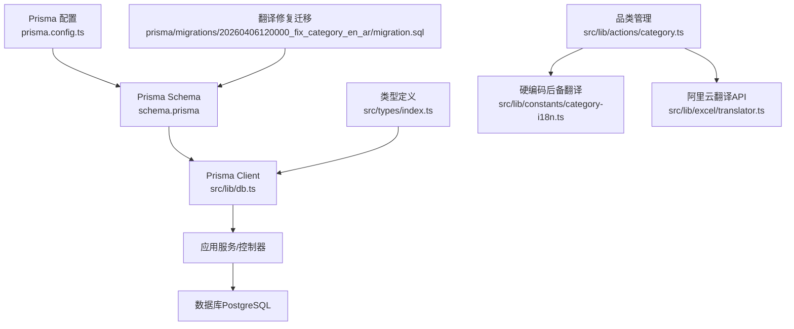
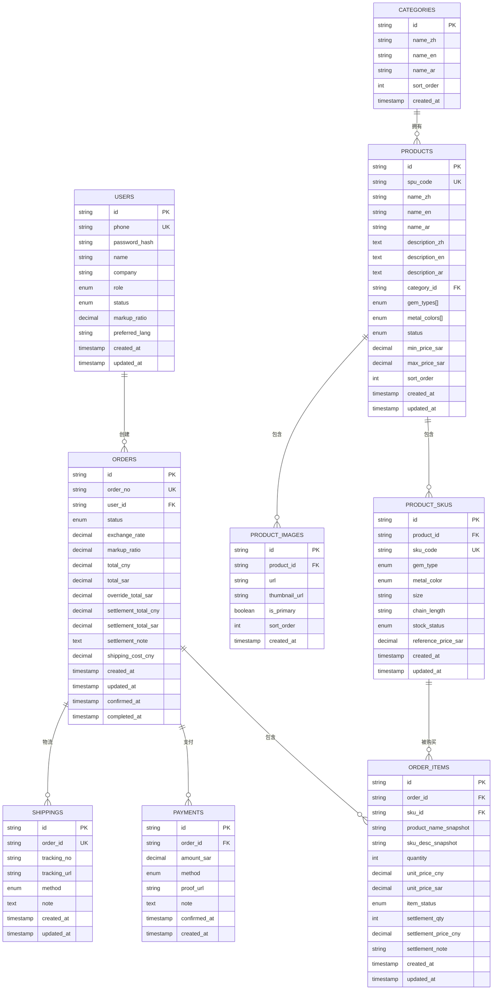
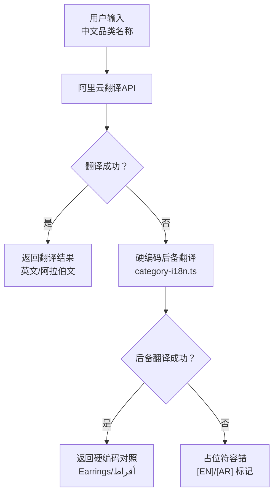
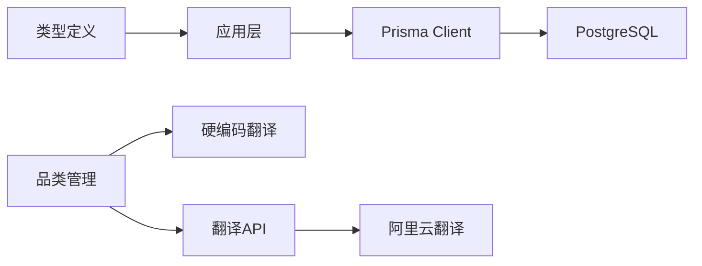

# 数据库设计

<cite>
**本文引用的文件**
- [schema.prisma](file://prisma/schema.prisma)
- [db.ts](file://src/lib/db.ts)
- [prisma.config.ts](file://prisma.config.ts)
- [index.ts](file://src/types/index.ts)
- [migration.sql](file://prisma/migrations/20260406120000_fix_category_en_ar/migration.sql)
- [category.ts](file://src/lib/actions/category.ts)
- [category-i18n.ts](file://src/lib/constants/category-i18n.ts)
- [translator.ts](file://src/lib/excel/translator.ts)
- [category.ts](file://src/lib/validations/category.ts)
</cite>

## 更新摘要
**所做更改**
- 更新了品类翻译系统章节，反映硬编码后备翻译机制的实施
- 新增了数据完整性改进章节，说明category表翻译修复迁移
- 更新了翻译系统架构图，展示三层容错机制
- 增强了数据验证和业务逻辑约束说明

## 目录
1. [简介](#简介)
2. [项目结构](#项目结构)
3. [核心组件](#核心组件)
4. [架构总览](#架构总览)
5. [详细组件分析](#详细组件分析)
6. [依赖分析](#依赖分析)
7. [性能考虑](#性能考虑)
8. [故障排查指南](#故障排查指南)
9. [结论](#结论)
10. [附录](#附录)

## 简介
本文件为 Celestia 项目的数据库设计与实现文档，聚焦于基于 Prisma 的数据模型设计与运行时集成。内容涵盖核心实体（User、Product、Order、Category 等）的主键、外键、索引与约束；枚举型业务状态与类型；数据访问模式与缓存策略建议；性能优化与迁移管理；以及数据生命周期、安全与隐私、访问控制等实践要点。文档同时提供实体关系图与数据流示意，帮助开发者与运维人员快速理解并维护数据库层。

**更新** 本版本反映了最新的数据库迁移和数据完整性改进，包括品类翻译系统的三层容错机制和category表的翻译修复。

## 项目结构
数据库层由以下关键部分组成：
- Prisma Schema：定义数据模型、枚举、索引与关系映射
- Prisma 配置：指定 schema 路径、迁移目录与数据源连接
- Prisma Client：在应用中以单例方式注入，支持开发环境日志
- 类型定义：统一 API 响应、分页、筛选与会话用户类型
- 翻译系统：包含阿里云翻译API、硬编码后备翻译和占位符容错机制

**图表来源**
- [prisma.config.ts:1-15](file://prisma.config.ts#L1-L15)
- [schema.prisma:1-317](file://prisma/schema.prisma#L1-L317)
- [db.ts:1-12](file://src/lib/db.ts#L1-L12)
- [index.ts:1-58](file://src/types/index.ts#L1-L58)
- [category.ts:1-112](file://src/lib/actions/category.ts#L1-L112)
- [category-i18n.ts:1-17](file://src/lib/constants/category-i18n.ts#L1-L17)
- [translator.ts:1-190](file://src/lib/excel/translator.ts#L1-L190)
- [migration.sql:1-19](file://prisma/migrations/20260406120000_fix_category_en_ar/migration.sql#L1-L19)

**章节来源**
- [prisma.config.ts:1-15](file://prisma.config.ts#L1-L15)
- [schema.prisma:1-317](file://prisma/schema.prisma#L1-L317)
- [db.ts:1-12](file://src/lib/db.ts#L1-L12)
- [index.ts:1-58](file://src/types/index.ts#L1-L58)

## 核心组件
本节概述数据库的核心实体与业务枚举，明确主键、唯一性、默认值与字段精度等约束。

- 用户（User）
  - 主键：String（cuid）
  - 唯一键：phone
  - 默认值：role=CUSTOMER、status=PENDING、markupRatio=1.15、preferredLang=en
  - 时间戳：createdAt、updatedAt
  - 关系：一对多 -> Order

- 品类（Category）
  - 主键：String（cuid）
  - 多语言字段：nameZh/nameEn/nameAr
  - 排序：sortOrder，默认 0
  - 时间戳：createdAt
  - 关系：一对多 -> Product

- 商品（Product）
  - 主键：String（cuid）
  - 唯一键：spuCode
  - 外键：categoryId -> Category.id
  - 枚举：gemTypes、metalColors（数组）
  - 状态：status，默认 ACTIVE
  - 价格范围：minPriceSar/maxPriceSar（Decimal 10,2）
  - 排序：sortOrder，默认 0
  - 时间戳：createdAt、updatedAt
  - 关系：一对多 -> ProductSku、ProductImage；多对一 -> Category

- SKU（ProductSku）
  - 主键：String（cuid）
  - 唯一键：skuCode
  - 外键：productId -> Product.id（级联删除）
  - 枚举：gemType、metalColor
  - 库存状态：stockStatus，默认 IN_STOCK
  - 参考价：referencePriceSar（Decimal 10,2）
  - 时间戳：createdAt、updatedAt
  - 关系：一对多 -> OrderItem；多对一 -> Product

- 图片（ProductImage）
  - 主键：String（cuid）
  - 外键：productId -> Product.id（级联删除）
  - 字段：url、thumbnailUrl、isPrimary、sortOrder
  - 时间戳：createdAt
  - 关系：多对一 -> Product

- 订单（Order）
  - 主键：String（cuid）
  - 唯一键：orderNo
  - 外键：userId -> User.id
  - 状态：status，默认 PENDING_QUOTE
  - 定价字段：exchangeRate（Decimal 8,4）、markupRatio（Decimal 4,2）、totalCny/totalSar/overrideTotalSar（Decimal 12,2）
  - 结算字段：settlementTotalCny/settlementTotalSar（Decimal 12,2）、settlementNote
  - 物流费用：shippingCostCny（Decimal 10,2）
  - 时间戳：createdAt、updatedAt、confirmedAt、completedAt
  - 关系：多对一 -> User；一对多 -> OrderItem、Payment、Shipping

- 订单项（OrderItem）
  - 主键：String（cuid）
  - 外键：orderId -> Order.id（级联删除）、skuId -> ProductSku.id
  - 字段：productNameSnapshot/skuDescSnapshot、quantity、unitPriceCny/unitPriceSar（Decimal 10,2）
  - 状态：itemStatus，默认 PENDING_QUOTE
  - 结算字段：settlementQty、settlementPriceCny（Decimal 10,2）、settlementNote
  - 时间戳：createdAt、updatedAt
  - 关系：多对一 -> Order、ProductSku

- 付款（Payment）
  - 主键：String（cuid）
  - 外键：orderId -> Order.id（级联删除）
  - 字段：amountSar（Decimal 12,2）、method（枚举）、proofUrl、note
  - 时间戳：confirmedAt、createdAt
  - 关系：多对一 -> Order

- 物流（Shipping）
  - 主键：String（cuid）
  - 唯一键：orderId（一对一）
  - 外键：orderId -> Order.id（级联删除）
  - 字段：trackingNo、trackingUrl、method（枚举）、note
  - 时间戳：createdAt、updatedAt
  - 关系：一对一 -> Order

**章节来源**
- [schema.prisma:106-317](file://prisma/schema.prisma#L106-L317)

## 架构总览
下图展示数据库层的整体架构与数据流向，包括 Prisma Schema、配置、客户端注入与类型系统，以及新增的翻译系统三层容错机制。

**图表来源**
- [schema.prisma:1-317](file://prisma/schema.prisma#L1-L317)
- [db.ts:1-12](file://src/lib/db.ts#L1-L12)
- [prisma.config.ts:1-15](file://prisma.config.ts#L1-L15)
- [index.ts:1-58](file://src/types/index.ts#L1-L58)
- [category.ts:1-112](file://src/lib/actions/category.ts#L1-L112)
- [category-i18n.ts:1-17](file://src/lib/constants/category-i18n.ts#L1-L17)
- [translator.ts:1-190](file://src/lib/excel/translator.ts#L1-L190)
- [migration.sql:1-19](file://prisma/migrations/20260406120000_fix_category_en_ar/migration.sql#L1-L19)

## 详细组件分析

### 实体关系图（ERD）
该图为基于 Prisma Schema 的实体关系可视化，标注了主键、外键与基数约束。

**图表来源**
- [schema.prisma:106-317](file://prisma/schema.prisma#L106-L317)

**章节来源**
- [schema.prisma:106-317](file://prisma/schema.prisma#L106-L317)

### 数据访问模式与缓存策略
- 单例客户端注入
  - 在应用启动时创建 Prisma Client，并通过全局对象在开发环境复用，避免重复初始化带来的开销。
  - 日志级别根据 NODE_ENV 动态设置，开发环境开启查询与警告日志，生产环境仅记录错误。
- 查询与更新
  - 使用 Prisma Client 的 CRUD 方法进行读写，结合索引列（如 userId、status、spuCode、skuCode 等）提升查询效率。
- 缓存建议
  - 对高频读取且不频繁变更的数据（如品类列表、商品基础信息）可采用进程内缓存或外部缓存（Redis），设置 TTL 并在写操作后失效或更新。
  - 对于复杂聚合查询（如订单统计、商品销量排行），建议使用物化视图或定期任务生成缓存条目。
- 分页与游标
  - 类型系统提供游标分页参数，可在高基数表上使用基于游标的分页以降低偏移成本。

**章节来源**
- [db.ts:1-12](file://src/lib/db.ts#L1-L12)
- [index.ts:9-22](file://src/types/index.ts#L9-L22)

### 性能优化考虑
- 索引策略
  - 在 Product、Order、OrderItem、ProductSku、ProductImage 等高频过滤字段上建立索引，例如：
    - Product.categoryId、Product.status
    - Order.userId、Order.status
    - OrderItem.orderId、OrderItem.skuId
    - ProductSku.productId
    - ProductImage.productId
- 字段精度
  - 金额类字段采用 Decimal 类型并指定精度（如 10,2 或 12,2），避免浮点误差。
- 查询优化
  - 使用 select 投影只取必要字段，减少网络与序列化开销。
  - 对批量写入使用事务与批量 API，降低往返次数。
- 连接池与并发
  - 在生产环境中合理配置数据库连接池大小与超时时间，避免峰值阻塞。

**章节来源**
- [schema.prisma:148](file://prisma/schema.prisma#L148)
- [schema.prisma:221](file://prisma/schema.prisma#L221)
- [schema.prisma:248](file://prisma/schema.prisma#L248)
- [schema.prisma:168](file://prisma/schema.prisma#L168)
- [schema.prisma:184](file://prisma/schema.prisma#L184)

### 数据生命周期管理、保留策略与归档规则
- 留存策略
  - 基于业务需求设定订单与用户数据的保留期限（如 3-7 年），到期后进行匿名化或删除。
- 归档规则
  - 将历史订单与支付记录迁移到归档库或冷存储，保留关键索引以便审计查询。
- 清理流程
  - 定期任务扫描过期数据，先归档再删除，确保不可逆操作前有备份与审计日志。
- 合规性
  - 遵循数据最小化原则，仅保留完成交易与合规所需的最少信息。

### 数据安全、隐私要求与访问控制
- 最小权限
  - 数据库用户仅授予应用所需权限，避免超级权限暴露。
- 加密
  - 敏感字段（如密码哈希、支付凭证）在传输与存储层面加密；密码使用强哈希算法。
- 访问控制
  - 应用层通过角色（ADMIN/CUSTOMER）限制对敏感资源的访问；API 层进行鉴权与授权校验。
- 审计
  - 记录关键数据变更（如订单状态、价格覆盖、库存调整）的审计日志，保留至少一年。

### 数据迁移路径与版本管理策略
- 迁移目录
  - Prisma 迁移文件位于 prisma/migrations，每次 schema 变更生成新迁移。
- 版本管理
  - 迁移文件名包含时间戳与描述，确保可追溯性；合并到主分支前需本地验证与测试。
- 回滚策略
  - 通过 Prisma CLI 执行迁移回滚；生产环境回滚需评估影响并制定应急预案。
- 环境一致性
  - 开发、预发布与生产环境使用相同迁移脚本，确保 schema 一致。

**章节来源**
- [prisma.config.ts:8-10](file://prisma.config.ts#L8-L10)

### 翻译系统架构与数据完整性改进

#### 翻译系统三层容错机制
系统实现了从云端翻译到硬编码后备再到占位符容错的三层保护机制：

1. **云端翻译优先级**：使用阿里云翻译API进行实时翻译
2. **硬编码后备翻译**：针对固定品类词汇的硬编码对照表
3. **占位符容错保护**：当所有翻译方式失败时使用占位符标记

**图表来源**
- [category.ts:69-88](file://src/lib/actions/category.ts#L69-L88)
- [category-i18n.ts:1-17](file://src/lib/constants/category-i18n.ts#L1-L17)
- [translator.ts:22-86](file://src/lib/excel/translator.ts#L22-L86)

#### 数据完整性改进
执行了专门的category表翻译修复迁移，修正了以下四个核心品类的英阿翻译错误：

- 耳钉 → Earrings / أقراط
- 项链 → Necklace / عقد  
- 手链 → Bracelet / سوار
- 戒指 → Ring / خاتم

**章节来源**
- [migration.sql:1-19](file://prisma/migrations/20260406120000_fix_category_en_ar/migration.sql#L1-L19)
- [category-i18n.ts:8-12](file://src/lib/constants/category-i18n.ts#L8-L12)
- [category.ts:69-88](file://src/lib/actions/category.ts#L69-L88)

## 依赖分析
- 组件耦合
  - 应用通过 Prisma Client 访问数据库，耦合度低，便于替换底层存储。
  - 类型系统与 Prisma Schema 解耦，类型定义独立于 ORM。
  - 翻译系统通过模块化设计实现松耦合，支持多种翻译源。
- 外部依赖
  - PostgreSQL 作为数据源；Prisma Client 提供类型安全的查询接口。
  - 阿里云翻译API作为外部翻译服务。
- 潜在风险
  - 过度依赖全局单例可能影响测试隔离；建议在测试中注入可替换的客户端实例。
  - 翻译系统依赖外部API，需要完善的容错机制。

**图表来源**
- [db.ts:1-12](file://src/lib/db.ts#L1-L12)
- [schema.prisma:1-317](file://prisma/schema.prisma#L1-L317)
- [index.ts:1-58](file://src/types/index.ts#L1-L58)
- [category.ts:1-112](file://src/lib/actions/category.ts#L1-L112)
- [category-i18n.ts:1-17](file://src/lib/constants/category-i18n.ts#L1-L17)
- [translator.ts:1-190](file://src/lib/excel/translator.ts#L1-L190)

**章节来源**
- [db.ts:1-12](file://src/lib/db.ts#L1-L12)
- [index.ts:1-58](file://src/types/index.ts#L1-L58)

## 性能考虑
- 索引与查询
  - 为高频过滤字段建立复合索引与单列索引，避免全表扫描。
- 写入优化
  - 使用事务批量插入与更新，减少锁竞争。
- 缓存与异步
  - 对热点数据采用缓存；对耗时任务采用消息队列异步处理。
- 监控与告警
  - 监控慢查询、连接数与锁等待，及时发现瓶颈。
- 翻译性能优化
  - 批量翻译减少API调用次数
  - 硬编码后备翻译避免云端API延迟
  - 占位符容错机制确保系统稳定性

## 故障排查指南
- 常见问题
  - 连接失败：检查 DATABASE_URL 与网络连通性。
  - 权限不足：核对数据库用户权限与 SSL 设置。
  - 迁移失败：查看迁移日志，修复冲突后再重试。
  - 翻译失败：检查阿里云API密钥配置与网络连通性。
- 日志与诊断
  - 开发环境启用 Prisma 查询日志，定位慢查询与异常 SQL。
  - 应用层捕获 Prisma 异常并记录上下文信息，便于追踪。
  - 翻译系统记录API调用失败与后备翻译触发日志。

**章节来源**
- [db.ts:7-9](file://src/lib/db.ts#L7-L9)

## 结论
本设计以 Prisma Schema 明确实体关系与约束，配合类型系统与单例客户端实现高效、可维护的数据访问。通过合理的索引、缓存与迁移策略，兼顾性能与可演进性。最新的翻译系统三层容错机制确保了数据完整性与系统稳定性，而专门的category表翻译修复迁移则解决了核心品类的翻译准确性问题。建议在生产环境中完善审计、归档与安全策略，确保数据生命周期合规与系统稳定。

## 附录
- 术语
  - SPU：标准产品单元
  - SKU：库存量单位
  - Decimal(m,n)：定点数，m 为精度，n 为小数位
  - I18N：国际化（Internationalization）
  - API：应用程序接口
- 参考
  - Prisma 文档：https://www.prisma.io/docs
  - 阿里云翻译API：https://help.aliyun.com/document_detail/171571.html