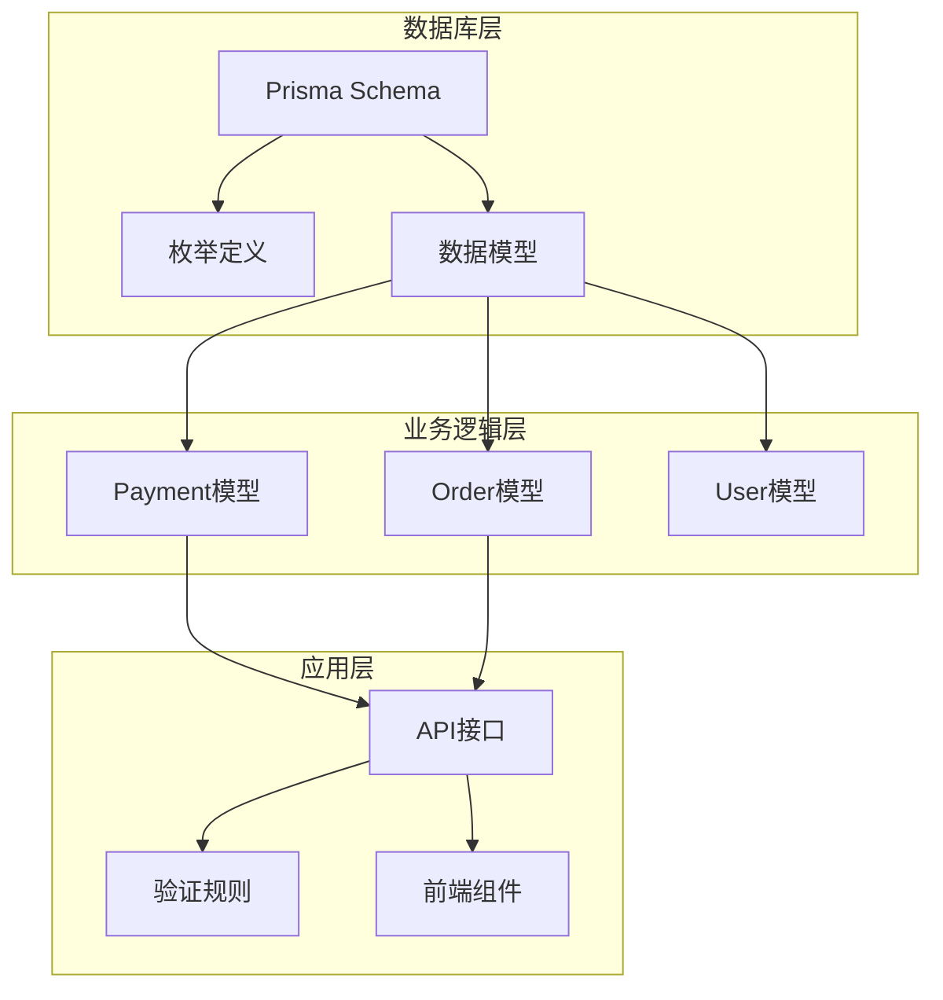
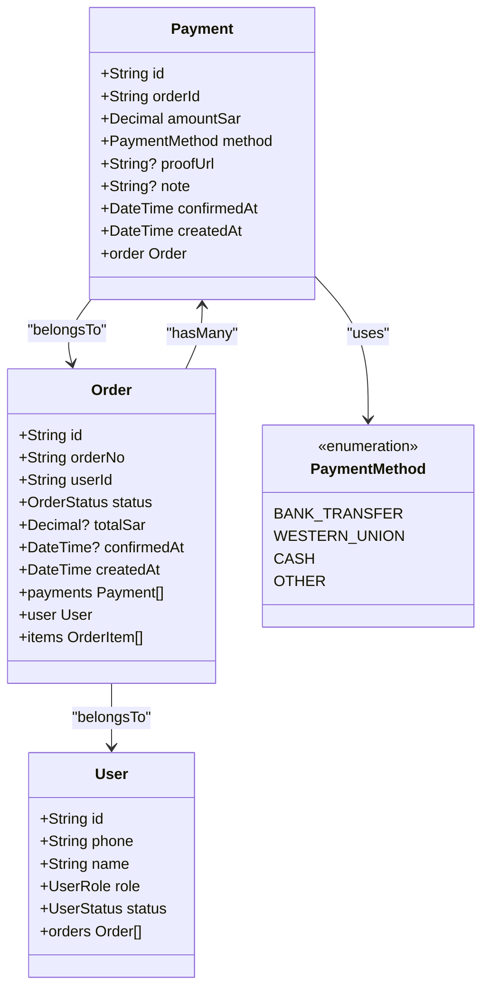
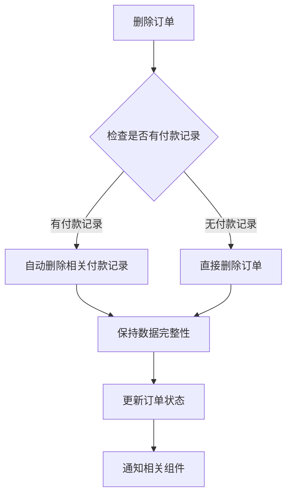
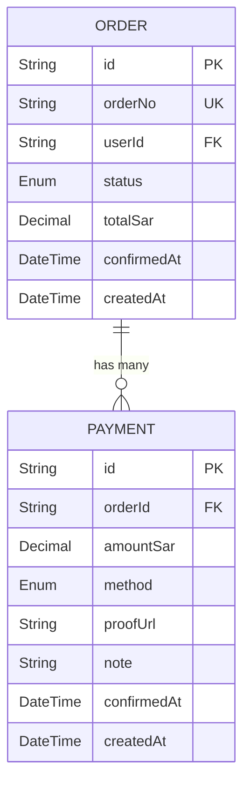
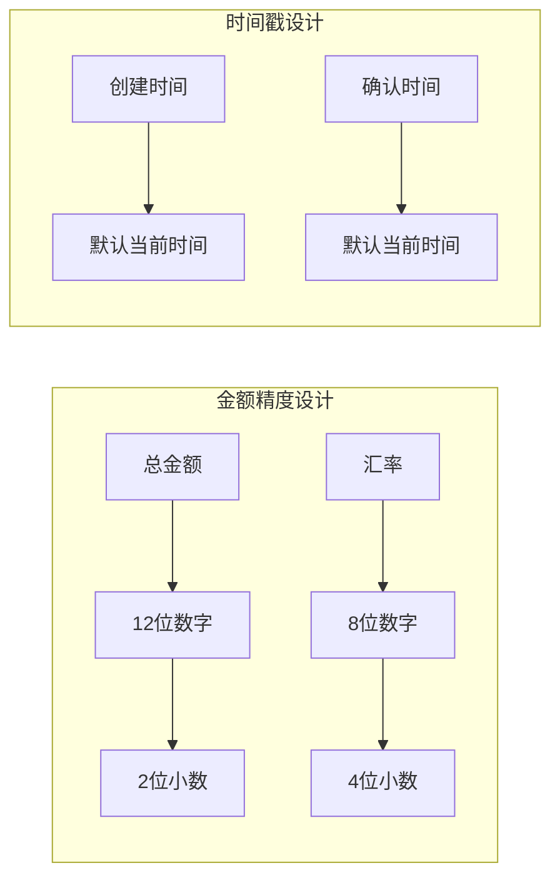
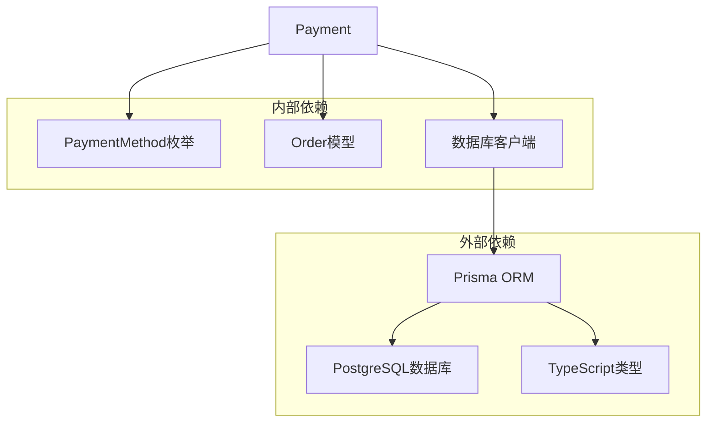
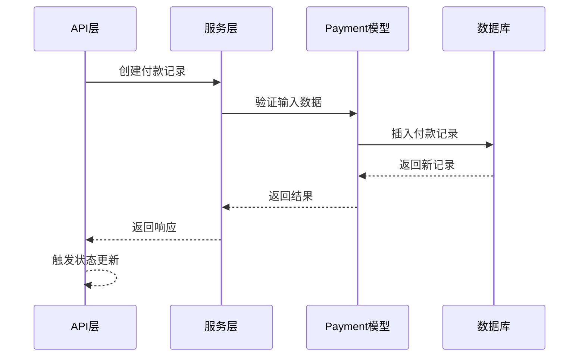

# 付款记录模型

<cite>
**本文档引用的文件**
- [schema.prisma](file://prisma/schema.prisma)
- [db.ts](file://src/lib/db.ts)
- [constants.ts](file://src/lib/constants.ts)
- [index.ts](file://src/types/index.ts)
</cite>

## 目录
1. [简介](#简介)
2. [项目结构](#项目结构)
3. [核心组件](#核心组件)
4. [架构概览](#架构概览)
5. [详细组件分析](#详细组件分析)
6. [依赖关系分析](#依赖关系分析)
7. [性能考虑](#性能考虑)
8. [故障排除指南](#故障排除指南)
9. [结论](#结论)

## 简介

本文档详细介绍了Celestia项目中的付款记录模型（Payment Model），这是一个关键的业务实体，用于跟踪和管理订单的付款信息。该模型实现了完整的付款生命周期管理，包括多种付款方式支持、付款凭证管理和状态跟踪等功能。

Payment模型是订单系统的重要组成部分，它与Order模型建立了强关联关系，并通过级联删除策略确保数据一致性。该模型的设计充分考虑了国际化需求和业务流程的复杂性。

## 项目结构

在Celestia项目中，付款记录模型位于Prisma数据库模式文件中，采用现代化的数据库设计模式：

**图表来源**
- [schema.prisma:1-281](file://prisma/schema.prisma#L1-L281)

**章节来源**
- [schema.prisma:1-281](file://prisma/schema.prisma#L1-L281)

## 核心组件

### Payment模型概述

Payment模型是订单付款的核心数据结构，负责存储所有与付款相关的信息。该模型采用了Prisma的现代语法，提供了完整的类型安全性和数据库约束。

### 字段设计详解

#### 基础标识字段
- **id**: 主键标识符，使用UUID格式确保全局唯一性
- **orderId**: 外键关联到Order模型，建立付款与订单的直接关系

#### 金额和货币字段
- **amountSar**: 付款金额字段，使用Decimal类型精确表示沙特里亚尔金额，支持最多12位数字，其中2位小数精度

#### 付款方式枚举
- **method**: 使用PaymentMethod枚举类型，支持四种付款方式：
  - BANK_TRANSFER：银行转账
  - WESTERN_UNION：西联汇款
  - CASH：现金
  - OTHER：其他方式

#### 附件和备注字段
- **proofUrl**: 付款凭证URL链接，可选字段，用于存储银行转账或汇款的截图或证明文件
- **note**: 付款备注说明，支持多行文本，最大长度为Text类型限制

#### 时间戳字段
- **confirmedAt**: 确认时间戳，默认值为当前时间，表示付款被确认的时间点
- **createdAt**: 创建时间戳，默认值为当前时间，记录付款记录的创建时间

**章节来源**
- [schema.prisma:249-264](file://prisma/schema.prisma#L249-L264)

## 架构概览

Payment模型在整个系统架构中扮演着关键角色，连接着多个层面的功能模块：

**图表来源**
- [schema.prisma:249-264](file://prisma/schema.prisma#L249-L264)
- [schema.prisma:189-220](file://prisma/schema.prisma#L189-L220)
- [schema.prisma:89-106](file://prisma/schema.prisma#L89-L106)

### 级联删除策略

Payment模型采用了onDelete: Cascade级联删除策略，这一设计具有重要意义：

**图表来源**
- [schema.prisma:260](file://prisma/schema.prisma#L260)

这种级联删除策略确保了以下优势：
- **数据一致性**: 防止孤儿记录的产生
- **业务逻辑简化**: 自动处理相关数据的清理
- **内存优化**: 及时释放不再需要的数据占用

**章节来源**
- [schema.prisma:260](file://prisma/schema.prisma#L260)

## 详细组件分析

### 订单关联关系

Payment模型与Order模型建立了多对一的关系，这种设计反映了实际业务场景：

**图表来源**
- [schema.prisma:189-220](file://prisma/schema.prisma#L189-L220)
- [schema.prisma:249-264](file://prisma/schema.prisma#L249-L264)

### 付款方式枚举设计

PaymentMethod枚举提供了标准化的付款方式管理：

| 枚举值 | 中文描述 | 英文描述 |
|--------|----------|----------|
| BANK_TRANSFER | 银行转账 | Bank Transfer |
| WESTERN_UNION | Western Union | Western Union |
| CASH | 现金 | Cash |
| OTHER | 其他 | Other |

这种设计的优势：
- **类型安全**: 编译时验证付款方式的有效性
- **国际化支持**: 支持多语言环境下的描述
- **扩展性**: 易于添加新的付款方式

**章节来源**
- [schema.prisma:72-77](file://prisma/schema.prisma#L72-L77)

### 数据类型和精度

Payment模型在数据类型选择上体现了对业务需求的深入理解：

**图表来源**
- [schema.prisma:253](file://prisma/schema.prisma#L253)
- [schema.prisma:257](file://prisma/schema.prisma#L257)

### 索引策略

为了优化查询性能，Payment模型采用了适当的索引策略：

- **orderId索引**: 加速基于订单的付款查询
- **createdAt索引**: 支持按时间排序的查询操作

**章节来源**
- [schema.prisma:262](file://prisma/schema.prisma#L262)

## 依赖关系分析

### 数据库依赖

Payment模型依赖于以下核心组件：

**图表来源**
- [schema.prisma:1-10](file://prisma/schema.prisma#L1-L10)
- [db.ts:1-18](file://src/lib/db.ts#L1-L18)

### 应用层集成

Payment模型与应用层的集成体现在多个方面：

**图表来源**
- [db.ts:12-15](file://src/lib/db.ts#L12-L15)

**章节来源**
- [db.ts:1-18](file://src/lib/db.ts#L1-L18)

## 性能考虑

### 查询优化

Payment模型的查询性能优化主要体现在以下几个方面：

1. **索引策略**: 在orderId字段上建立索引，优化基于订单的查询
2. **数据类型优化**: 使用Decimal类型确保金额计算的精确性
3. **默认值优化**: 使用数据库默认值减少应用层的处理开销

### 内存管理

级联删除策略在内存管理方面的优势：
- **及时清理**: 删除订单时自动清理相关付款记录
- **防止内存泄漏**: 避免孤儿记录占用内存空间
- **维护数据完整性**: 确保数据库的一致性状态

## 故障排除指南

### 常见问题诊断

#### 付款记录无法创建
可能的原因和解决方案：
- **订单不存在**: 确保orderId指向有效的订单记录
- **金额格式错误**: 验证amountSar的数值格式和精度
- **付款方式无效**: 检查method枚举值是否正确

#### 级联删除异常
如果遇到级联删除问题：
- **检查外键约束**: 确保数据库外键约束正确设置
- **验证删除顺序**: 确保先删除订单再删除付款记录
- **检查事务处理**: 确保删除操作在事务中正确执行

### 调试建议

1. **启用日志**: 在开发环境中启用Prisma查询日志
2. **验证数据**: 使用数据库工具检查数据完整性
3. **测试边界条件**: 验证极端数值和边界情况的处理

**章节来源**
- [constants.ts:1-22](file://src/lib/constants.ts#L1-L22)

## 结论

Payment模型作为Celestia项目的核心业务实体，展现了现代数据库设计的最佳实践。其设计充分考虑了业务需求、性能要求和可维护性，为整个订单支付系统提供了坚实的基础。

该模型的主要优势包括：
- **类型安全**: 完整的TypeScript类型支持
- **数据完整性**: 强制性的外键约束和级联删除
- **国际化支持**: 多语言环境下的友好设计
- **性能优化**: 合理的索引策略和数据类型选择
- **扩展性**: 易于添加新的付款方式和功能特性

通过深入理解Payment模型的设计理念和实现细节，开发者可以更好地利用这一组件来构建可靠的业务应用。