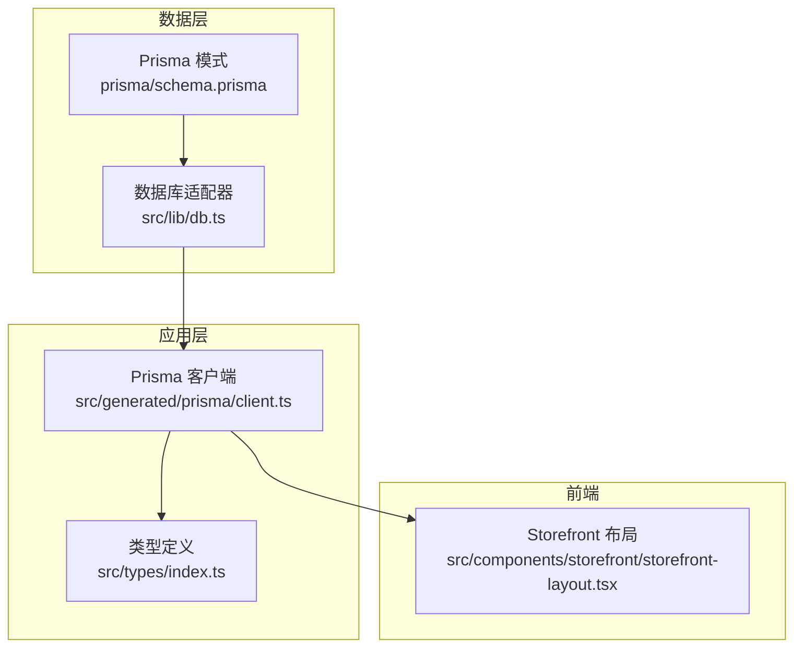
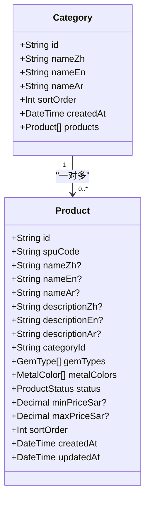
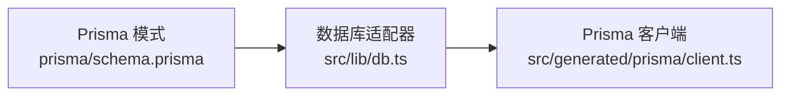

# 品类模型

<cite>
**本文引用的文件**
- [prisma/schema.prisma](file://prisma/schema.prisma)
- [src/lib/db.ts](file://src/lib/db.ts)
- [src/generated/prisma/client.ts](file://src/generated/prisma/client.ts)
- [src/types/index.ts](file://src/types/index.ts)
- [src/components/storefront/storefront-layout.tsx](file://src/components/storefront/storefront-layout.tsx)
</cite>

## 目录
1. [简介](#简介)
2. [项目结构](#项目结构)
3. [核心组件](#核心组件)
4. [架构总览](#架构总览)
5. [详细组件分析](#详细组件分析)
6. [依赖分析](#依赖分析)
7. [性能考虑](#性能考虑)
8. [故障排查指南](#故障排查指南)
9. [结论](#结论)
10. [附录](#附录)

## 简介
本文件系统性地文档化“品类”模型（Category）的设计与实现，重点涵盖：
- 多语言字段设计：nameZh（中文）、nameEn（英文）、nameAr（阿拉伯文）的国际化支持策略与使用场景
- 排序字段：sortOrder 的作用、默认值与排序控制
- 时间戳字段：createdAt 的自动管理机制
- 与商品（Product）的一对多关系映射
- 索引设计：@@index 的创建目的与性能优化
- 字段完整说明、业务应用场景与最佳实践

## 项目结构
与品类模型直接相关的文件主要分布在以下位置：
- 数据库模式定义：prisma/schema.prisma
- 数据访问层：src/lib/db.ts
- 类型安全客户端：src/generated/prisma/client.ts
- 前端导航与页面入口：src/components/storefront/storefront-layout.tsx
- 通用类型定义：src/types/index.ts

图表来源
- [prisma/schema.prisma:108-120](file://prisma/schema.prisma#L108-L120)
- [src/lib/db.ts:1-18](file://src/lib/db.ts#L1-L18)
- [src/generated/prisma/client.ts:1-45](file://src/generated/prisma/client.ts#L1-L45)
- [src/components/storefront/storefront-layout.tsx:13-19](file://src/components/storefront/storefront-layout.tsx#L13-L19)

章节来源
- [prisma/schema.prisma:108-120](file://prisma/schema.prisma#L108-L120)
- [src/lib/db.ts:1-18](file://src/lib/db.ts#L1-L18)
- [src/generated/prisma/client.ts:1-45](file://src/generated/prisma/client.ts#L1-L45)
- [src/components/storefront/storefront-layout.tsx:13-19](file://src/components/storefront/storefront-layout.tsx#L13-L19)

## 核心组件
- 品类模型（Category）
  - 多语言名称字段：nameZh、nameEn、nameAr
  - 排序字段：sortOrder，默认值为 0
  - 时间戳：createdAt，默认当前时间
  - 关系：与 Product 为一对多（一个品类可包含多个商品）
  - 表映射：@@map("categories")

- 商品模型（Product）
  - 外键：categoryId 指向 Category.id
  - 索引：@@index([categoryId]) 用于加速按品类查询
  - 其他字段：状态、价格区间、排序、时间戳等

章节来源
- [prisma/schema.prisma:108-120](file://prisma/schema.prisma#L108-L120)
- [prisma/schema.prisma:122-149](file://prisma/schema.prisma#L122-L149)

## 架构总览
品类模型在系统中的角色与交互如下：
- 数据库层：通过 Prisma 模式定义 Category 与 Product 的结构、关系与索引
- 应用层：通过 Prisma 客户端进行类型安全的数据操作
- 前端：Storefront 布局中提供“分类”入口，引导用户浏览按品类组织的商品

图表来源
- [prisma/schema.prisma:108-120](file://prisma/schema.prisma#L108-L120)
- [prisma/schema.prisma:122-149](file://prisma/schema.prisma#L122-L149)

## 详细组件分析

### 品类模型（Category）字段说明
- id
  - 类型：字符串（主键）
  - 默认值：cuid()
  - 用途：唯一标识每个品类
- nameZh
  - 类型：字符串
  - 映射：数据库列 name_zh
  - 用途：中文名称，面向中文用户展示
- nameEn
  - 类型：字符串
  - 映射：数据库列 name_en
  - 用途：英文名称，面向国际用户展示
- nameAr
  - 类型：字符串
  - 映射：数据库列 name_ar
  - 用途：阿拉伯文名称，面向阿拉伯语市场展示
- sortOrder
  - 类型：整数
  - 默认值：0
  - 用途：控制品类在前台或后台列表中的显示顺序；数值越小优先级越高
- createdAt
  - 类型：日期时间
  - 默认值：now()
  - 用途：记录品类创建时间，便于审计与排序
- relations
  - products：与 Product 的一对多关系，Product.categoryId 指向 Category.id

章节来源
- [prisma/schema.prisma:108-120](file://prisma/schema.prisma#L108-L120)

### 商品模型（Product）与品类的关系映射
- 外键字段：categoryId（指向 Category.id）
- 关系注解：@relation(fields: [categoryId], references: [id])
- 索引：@@index([categoryId])，提升按品类过滤与分组的查询性能
- 一对多：一个 Category 可拥有多个 Product

章节来源
- [prisma/schema.prisma:122-149](file://prisma/schema.prisma#L122-L149)

### 多语言支持机制
- 设计思路
  - 在 Category 与 Product 中分别提供三套语言字段（nameZh/nameEn/nameAr、descriptionZh/descriptionEn/descriptionAr），确保不同语言环境可独立维护标题与描述
  - 该设计适用于多语言站点或国际化前端，前端根据用户语言偏好选择对应字段渲染
- 使用建议
  - 后台管理端需提供三语字段的编辑界面
  - 前端根据用户语言切换显示对应字段
  - 对于未填写的语言字段，可降级到默认语言或隐藏空值

章节来源
- [prisma/schema.prisma:108-120](file://prisma/schema.prisma#L108-L120)
- [prisma/schema.prisma:122-149](file://prisma/schema.prisma#L122-L149)

### 排序字段（sortOrder）的作用与默认值
- 作用
  - 控制品类在列表中的显示顺序
  - 支持手动调整优先级，满足运营需求
- 默认值
  - sortOrder 默认为 0，表示普通排序
- 业务场景
  - 置顶推荐：将目标品类的排序值设为负数或更小正数
  - 渐进式展示：按业务周期逐步开放品类，配合排序值实现阶段性曝光

章节来源
- [prisma/schema.prisma:114](file://prisma/schema.prisma#L114)

### 时间戳字段（createdAt）的自动管理
- 自动插入
  - createdAt 默认使用 now()，首次创建时自动写入当前时间
- 自动更新
  - 商品模型（Product）使用 @updatedAt，但品类模型（Category）未声明 @updatedAt
  - 因此 Category 的 createdAt 不会自动更新；如需记录最后修改时间，可在业务层自行维护或扩展模型

章节来源
- [prisma/schema.prisma:115](file://prisma/schema.prisma#L115)
- [prisma/schema.prisma:139](file://prisma/schema.prisma#L139)

### 索引设计与性能优化（@@index）
- Category 模型
  - 未显式定义索引；若后续存在高频按 createdAt 或其他条件查询，可考虑添加索引
- Product 模型
  - @@index([categoryId])：加速按品类过滤与关联查询
  - @@index([status])：加速按状态过滤（如仅查询上架商品）

章节来源
- [prisma/schema.prisma:146](file://prisma/schema.prisma#L146)

### 业务应用场景
- 前端导航
  - Storefront 布局提供“分类”入口，用户可通过该入口浏览按品类组织的商品
- 商品筛选
  - 类型定义中包含按 categoryId 筛选商品的参数，便于前端实现按品类筛选
- 内容运营
  - 通过 sortOrder 实现品类置顶、阶段性上线等运营策略
- 多语言展示
  - 通过 nameZh/nameEn/nameAr 字段，满足不同语言用户的阅读习惯

章节来源
- [src/components/storefront/storefront-layout.tsx:13-19](file://src/components/storefront/storefront-layout.tsx#L13-L19)
- [src/types/index.ts:24-32](file://src/types/index.ts#L24-L32)

## 依赖分析
- 数据库适配器
  - 通过 src/lib/db.ts 使用 PrismaPg 适配器连接 PostgreSQL
- 类型安全客户端
  - 通过 src/generated/prisma/client.ts 提供类型化的 Prisma 客户端
- 模式定义
  - prisma/schema.prisma 中定义 Category 与 Product 的结构、关系与索引

图表来源
- [prisma/schema.prisma:1-10](file://prisma/schema.prisma#L1-L10)
- [src/lib/db.ts:1-18](file://src/lib/db.ts#L1-L18)
- [src/generated/prisma/client.ts:1-45](file://src/generated/prisma/client.ts#L1-L45)

章节来源
- [prisma/schema.prisma:1-10](file://prisma/schema.prisma#L1-L10)
- [src/lib/db.ts:1-18](file://src/lib/db.ts#L1-L18)
- [src/generated/prisma/client.ts:1-45](file://src/generated/prisma/client.ts#L1-L45)

## 性能考虑
- 索引策略
  - Product 模型已对 categoryId 与 status 建立索引，有利于按品类与状态的高效查询
  - 若 Category 需要频繁按 createdAt 或其他条件查询，建议评估添加相应索引
- 排序与分页
  - sortOrder 字段可用于稳定排序；结合游标分页（cursor）可减少深度分页带来的性能问题
- 多语言字段
  - 三语字段在查询时需注意只选择必要的字段，避免不必要的网络与存储开销

章节来源
- [prisma/schema.prisma:146](file://prisma/schema.prisma#L146)
- [src/types/index.ts:9-22](file://src/types/index.ts#L9-L22)

## 故障排查指南
- 查询性能异常
  - 检查是否对 Product.categoryId 与 Product.status 使用了索引
  - 如需对 Category 做复杂查询，评估是否需要新增索引
- 多语言字段为空
  - 确认后台是否正确填充对应语言字段；前端需处理空值降级逻辑
- 排序不生效
  - 确认 sortOrder 字段是否正确设置；检查是否存在其他排序逻辑覆盖
- 时间戳问题
  - Category 的 createdAt 不会自动更新；如需记录变更时间，需在业务层补充逻辑或扩展模型

章节来源
- [prisma/schema.prisma:146](file://prisma/schema.prisma#L146)
- [prisma/schema.prisma:114-115](file://prisma/schema.prisma#L114-L115)

## 结论
品类模型（Category）通过三语字段、排序字段与时间戳字段，构建了面向多语言、可运营、可扩展的基础能力。结合商品模型（Product）的外键与索引设计，实现了高效的品类-商品关系查询。建议在后续迭代中：
- 评估为 Category 增加索引与 @updatedAt 字段
- 在前端完善多语言字段的降级与展示策略
- 将 sortOrder 与运营策略进一步解耦，提升灵活性

## 附录
- 相关类型定义
  - 商品筛选参数包含 categoryId 字段，便于前端按品类筛选商品
- 前端入口
  - Storefront 布局提供“分类”入口，引导用户进入品类浏览流程

章节来源
- [src/types/index.ts:24-32](file://src/types/index.ts#L24-L32)
- [src/components/storefront/storefront-layout.tsx:13-19](file://src/components/storefront/storefront-layout.tsx#L13-L19)