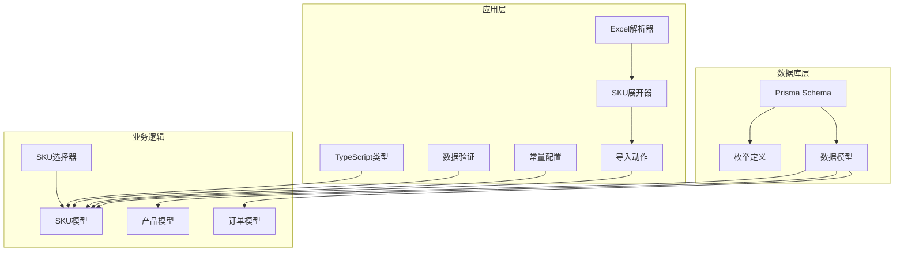
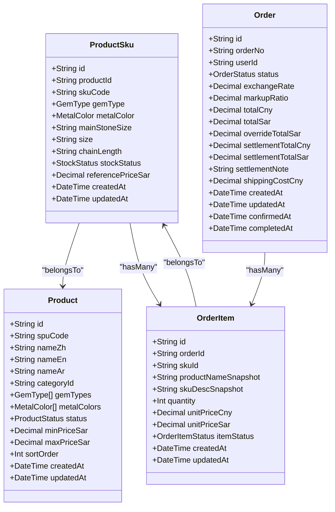
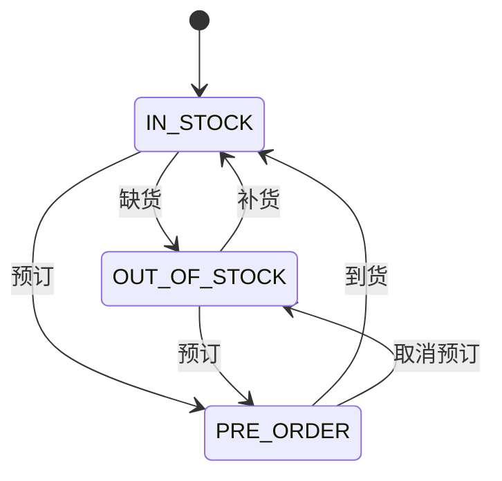
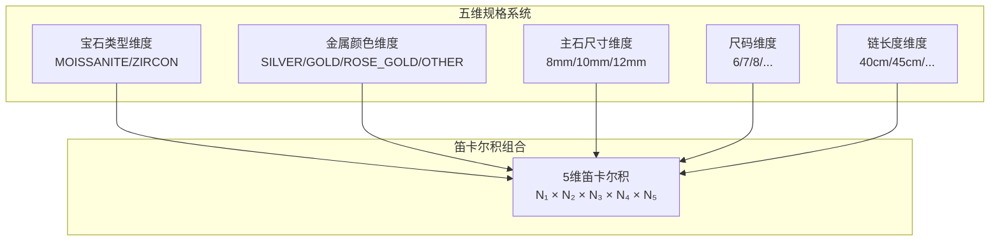
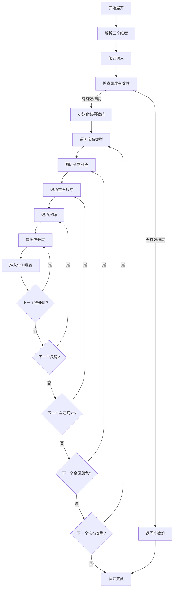
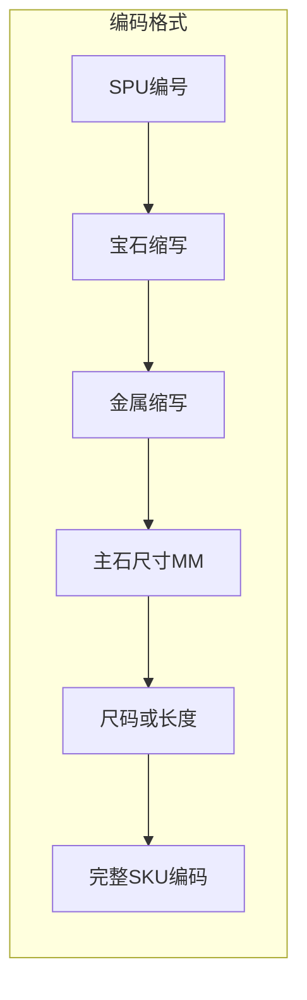
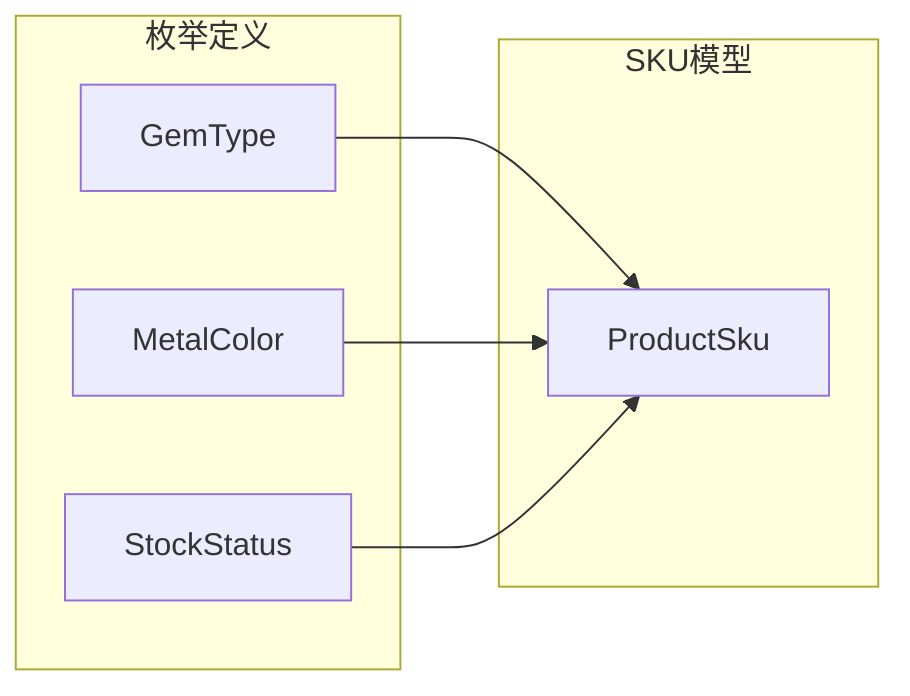
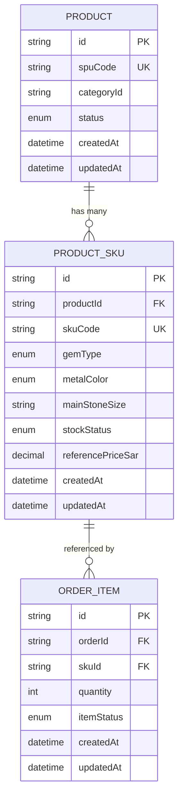

# 商品SKU模型

<cite>
**本文档引用的文件**
- [schema.prisma](file://prisma/schema.prisma)
- [sku-expander.ts](file://src/lib/excel/sku-expander.ts)
- [parser.ts](file://src/lib/excel/parser.ts)
- [import.ts](file://src/lib/actions/import.ts)
- [product.ts](file://src/lib/actions/product.ts)
- [sku-selector.tsx](file://src/components/storefront/sku-selector.tsx)
- [index.ts](file://src/types/index.ts)
- [constants.ts](file://src/lib/constants.ts)
- [product.ts](file://src/lib/validations/product.ts)
</cite>

## 更新摘要
**变更内容**
- SKU模型从四维规格扩展到五维规格，新增主石尺寸维度
- 笛卡尔积展开逻辑从四重循环升级到五重循环
- SKU编码系统支持五维组合，格式为：{SPU编号}-{宝石缩写}-{金属缩写}-{主石尺寸}MM-{尺码或长度}
- Excel导入模板和解析逻辑支持主石尺寸字段
- 前端SKU选择器支持主石尺寸选择功能

## 目录
1. [简介](#简介)
2. [项目结构](#项目结构)
3. [核心组件](#核心组件)
4. [架构概览](#架构概览)
5. [详细组件分析](#详细组件分析)
6. [五维规格系统](#五维规格系统)
7. [笛卡尔积展开逻辑](#笛卡尔积展开逻辑)
8. [SKU编码系统](#sku编码系统)
9. [依赖关系分析](#依赖关系分析)
10. [性能考虑](#性能考虑)
11. [故障排除指南](#故障排除指南)
12. [结论](#结论)

## 简介

本文档详细介绍了Celestia珠宝零售系统中的商品SKU（Stock Keeping Unit）模型。SKU模型是库存管理的核心实体，负责管理具体商品规格、库存状态和相关业务逻辑。该模型基于Prisma ORM构建，采用PostgreSQL数据库存储，并实现了完整的级联删除策略以确保数据一致性。

**最新更新**：SKU模型已从传统的四维规格系统扩展到五维规格系统，新增主石尺寸维度，显著提升了珠宝商品的规格管理能力和精确度。

## 项目结构

项目采用现代化的Next.js架构，SKU模型位于Prisma数据库模式文件中，通过TypeScript类型定义进行类型安全约束。整个系统围绕珠宝零售业务场景设计，特别关注戒指、项链等珠宝商品的规格管理。

**图表来源**
- [schema.prisma:1-317](file://prisma/schema.prisma#L1-L317)
- [sku-expander.ts:1-161](file://src/lib/excel/sku-expander.ts#L1-L161)
- [parser.ts:1-185](file://src/lib/excel/parser.ts#L1-L185)
- [import.ts:320-355](file://src/lib/actions/import.ts#L320-L355)

**章节来源**
- [schema.prisma:1-317](file://prisma/schema.prisma#L1-L317)
- [sku-expander.ts:1-161](file://src/lib/excel/sku-expander.ts#L1-L161)

## 核心组件

### SKU模型概述

SKU（Stock Keeping Unit）模型是商品库存管理的核心实体，代表具体的商品规格变体。每个SKU实例对应一个独特的商品组合，包含所有必要的规格参数和库存信息。

**五维规格系统**：SKU模型现已支持五个维度的规格组合，包括宝石类型、金属颜色、主石尺寸、尺码和链长度。

### 主要字段设计

#### 基础标识字段
- **id**: 主键标识符，使用CUID生成器确保全局唯一性
- **productId**: 外键关联到Product模型，建立SKU与商品SPU的关系
- **skuCode**: SKU唯一编码，@unique约束确保全局唯一性

#### 五维规格参数字段
- **gemType**: 宝石类型枚举，支持MOISSANITE（莫桑石）和ZIRCON（锆石）
- **metalColor**: 金属颜色枚举，支持SILVER（银色）、GOLD（金色）、ROSE_GOLD（玫瑰金）、OTHER（其他）
- **mainStoneSize**: 主石尺寸（毫米），字符串类型，允许为空值，新增字段
- **size**: 戒指尺码，字符串类型，允许为空值
- **chainLength**: 链长度，字符串类型，允许为空值

#### 库存管理字段
- **stockStatus**: 库存状态，默认值为IN_STOCK，支持IN_STOCK、OUT_OF_STOCK、PRE_ORDER三种状态
- **referencePriceSar**: 参考价格（SAR），Decimal类型，精度为10位整数和2位小数

#### 时间戳字段
- **createdAt**: 创建时间，默认当前时间
- **updatedAt**: 更新时间，自动更新

**章节来源**
- [schema.prisma:153-173](file://prisma/schema.prisma#L153-L173)

## 架构概览

SKU模型在整体系统架构中扮演着关键角色，连接产品管理、库存控制和订单处理三个核心模块。五维规格系统的引入使得SKU能够更精确地描述珠宝商品的完整规格。

**图表来源**
- [schema.prisma:153-173](file://prisma/schema.prisma#L153-L173)
- [schema.prisma:121-151](file://prisma/schema.prisma#L121-L151)
- [schema.prisma:226-251](file://prisma/schema.prisma#L226-L251)
- [schema.prisma:191-224](file://prisma/schema.prisma#L191-L224)

## 详细组件分析

### 字段详细说明

#### 外键关联关系
SKU模型通过productId字段与Product模型建立一对多关系：
- **关系类型**: 外键关联
- **级联策略**: onDelete: Cascade
- **关系方向**: Product ← ProductSku

级联删除策略确保当删除产品SPU时，所有相关的SKU规格也会被自动删除，维护数据完整性。

#### 唯一标识符系统
- **skuCode**: 作为SKU的主要识别符，具有@unique约束
- **productId**: 建立SKU与产品SPU的关联关系
- **组合唯一性**: 通过外键约束确保SKU规格的唯一性

#### 规格参数管理

##### 宝石类型（gemType）
支持两种主要宝石类型：
- **MOISSANITE**: 莫桑石，具有钻石般的外观但成本更低
- **ZIRCON**: 锆石，传统宝石选择

##### 金属颜色（metalColor）
支持四种金属颜色选项：
- **SILVER**: 银色，经典白色金属
- **GOLD**: 金色，传统黄色金属
- **ROSE_GOLD**: 玫瑰金，时尚粉色金属
- **OTHER**: 其他颜色，支持定制需求

##### 主石尺寸（mainStoneSize）
**新增字段**：主石尺寸维度，以毫米为单位：
- **数据类型**: 字符串类型，允许为空
- **用途**: 精确描述主石的大小规格
- **示例**: "8mm"、"10mm"、"12mm"
- **灵活性**: 支持不同珠宝类型的主石尺寸需求

##### 尺寸规格
- **ringSize**: 戒指尺码，字符串类型，允许为空
- **chainLength**: 链条长度，字符串类型，允许为空
- **灵活性**: 支持不同珠宝类型的规格需求

#### 库存状态管理

库存状态枚举提供了完整的库存控制机制：

**图表来源**
- [schema.prisma:31-35](file://prisma/schema.prisma#L31-L35)

**库存状态含义**:
- **IN_STOCK**: 有货状态，商品可立即购买
- **OUT_OF_STOCK**: 缺货状态，暂时无法购买
- **PRE_ORDER**: 预订状态，需要等待补货

#### 价格管理体系
- **referencePriceSar**: 参考价格，以沙特里亚尔（SAR）为单位
- **精度设置**: 10位整数，2位小数，满足珠宝定价精度需求
- **货币转换**: 支持汇率转换和成本价计算

### 关系映射分析

#### 产品关系映射
SKU与Product之间的关系通过productId字段实现：
- **关系名称**: product
- **字段映射**: productId → Product.id
- **级联策略**: Cascade（级联删除）

#### 订单项关联
SKU与OrderItem之间存在一对多关系：
- **关系名称**: orderItems
- **反向关系**: OrderItem.sku
- **业务意义**: 一个SKU可以出现在多个订单中

### 数据验证和约束

#### 字段约束
- **@id**: 主键标识
- **@unique**: 唯一性约束（skuCode）
- **@default**: 默认值设置
- **@map**: 数据库列名映射

#### 类型约束
- **String**: 文本类型，支持任意长度
- **Decimal**: 高精度数值类型，支持货币计算
- **DateTime**: 时间戳类型，支持自动时间管理
- **Enum**: 枚举类型，确保数据完整性

**章节来源**
- [schema.prisma:153-173](file://prisma/schema.prisma#L153-L173)

## 五维规格系统

### 规格维度详解

五维规格系统将SKU的规格参数分为五个独立的维度，每个维度都可以独立配置和组合：

**图表来源**
- [sku-expander.ts:101-125](file://src/lib/excel/sku-expander.ts#L101-L125)

### 规格维度特性

#### 宝石类型维度
- **固定必选**: 每个SKU必须指定宝石类型
- **枚举约束**: 仅支持预定义的宝石类型
- **业务重要性**: 影响SKU的价格和外观特征

#### 金属颜色维度
- **固定必选**: 每个SKU必须指定金属颜色
- **枚举约束**: 仅支持预定义的金属颜色
- **视觉影响**: 直接影响商品的外观和价值定位

#### 主石尺寸维度
**新增特性**：主石尺寸作为独立维度参与组合：
- **可选配置**: 支持留空表示不适用
- **数值范围**: 通常为8-20mm的常见尺寸
- **精确描述**: 提供主石大小的精确信息

#### 尺码维度
- **可选配置**: 支持留空表示不适用
- **通用尺码**: 适用于戒指等需要尺码的商品
- **国际化支持**: 支持不同地区的尺码标准

#### 链长度维度
- **可选配置**: 支持留空表示不适用
- **长度标准**: 通常为40-50cm的标准链长
- **定制服务**: 支持不同长度的定制需求

**章节来源**
- [sku-expander.ts:66-125](file://src/lib/excel/sku-expander.ts#L66-L125)

## 笛卡尔积展开逻辑

### 五重循环算法

SKU展开器实现了五重循环的笛卡尔积算法，将五个维度的所有可能组合生成完整的SKU列表：

**图表来源**
- [sku-expander.ts:101-125](file://src/lib/excel/sku-expander.ts#L101-L125)

### 展开算法实现

#### 参数解析阶段
- **维度分割**: 将原始字符串按逗号分隔为数组
- **枚举映射**: 将中文或英文映射为枚举值
- **空值处理**: 支持维度留空的情况

#### 组合生成阶段
- **五重嵌套循环**: 严格按照维度顺序生成组合
- **空值占位**: 留空维度使用undefined占位
- **价格传递**: 参考价格随组合一起传递

#### 统计计算阶段
- **组合数量**: 通过乘法原理计算总组合数
- **预览功能**: 支持不实际展开的组合数量统计

**章节来源**
- [sku-expander.ts:66-161](file://src/lib/excel/sku-expander.ts#L66-L161)

## SKU编码系统

### 五维编码规则

SKU编码系统已更新以支持五维规格组合，编码格式为：`{SPU编号}-{宝石缩写}-{金属缩写}-{主石尺寸}MM-{尺码或长度}`

**图表来源**
- [product.ts:186-211](file://src/lib/actions/product.ts#L186-L211)

### 编码生成逻辑

#### 缩写映射
- **宝石缩写**: MOISSANITE → MO，ZIRCON → ZR
- **金属缩写**: SILVER → SIL，GOLD → GLD，ROSE_GOLD → RSG，OTHER → OTH

#### 维度处理
- **主石尺寸**: 自动添加"MM"后缀并去除单位
- **尺码**: 添加"S"前缀标识戒指尺码
- **链长度**: 添加"L"前缀标识链长度

#### 编码示例
- `JW-001-MO-SIL-8MM-S6-40CM`
- `JW-002-ZR-GLD-10MM-L45`
- `JW-003-MO-RSG-12MM`

### 编码验证和解析

#### 前端显示
SKU选择器组件支持主石尺寸的可视化展示：
- **尺寸按钮**: 显示"Xmm"格式的主石尺寸按钮
- **交互反馈**: 用户选择主石尺寸时的视觉反馈
- **可用性检查**: 基于其他维度选择动态过滤主石尺寸

#### 后端解析
导入系统支持从编码中解析各维度信息：
- **正则表达式**: 使用正则表达式解析编码格式
- **维度提取**: 从编码中提取各个规格维度
- **数据验证**: 验证解析结果的合理性

**章节来源**
- [product.ts:186-211](file://src/lib/actions/product.ts#L186-L211)
- [sku-selector.tsx:337](file://src/components/storefront/sku-selector.tsx#L337)

## 依赖关系分析

### 枚举依赖关系

SKU模型依赖于多个枚举类型来确保数据的一致性和完整性：

**图表来源**
- [schema.prisma:37-47](file://prisma/schema.prisma#L37-L47)
- [schema.prisma:153-173](file://prisma/schema.prisma#L153-L173)

### 外键依赖关系

SKU模型的外键关系确保了数据的引用完整性：

**图表来源**
- [schema.prisma:121-151](file://prisma/schema.prisma#L121-L151)
- [schema.prisma:153-173](file://prisma/schema.prisma#L153-L173)
- [schema.prisma:226-251](file://prisma/schema.prisma#L226-L251)

### 级联删除策略

级联删除策略在多个层面发挥作用：

#### 数据库级级联删除
- **onDelete: Cascade**: 删除Product时自动删除所有关联的ProductSku
- **数据一致性**: 确保不会出现孤立的SKU记录

#### 业务逻辑影响
- **订单完整性**: 删除SKU不会影响已存在的订单项
- **历史记录保留**: 订单项中的SKU信息保持不变，便于审计

**章节来源**
- [schema.prisma:168](file://prisma/schema.prisma#L168)

## 性能考虑

### 索引优化
SKU模型建立了多个索引来优化查询性能：

#### 现有索引
- **@@index([productId])**: 优化SKU查询和关联操作
- **@unique(@map("sku_code"))**: 确保SKU编码唯一性
- **@@index([status])**: 优化库存状态查询

#### 查询优化建议
- **复合索引**: 考虑为常用查询条件建立复合索引
- **分区策略**: 对大量SKU数据可考虑按产品类别分区
- **缓存策略**: SKU元数据可考虑缓存以提高访问速度

### 内存使用优化
- **枚举类型**: 使用枚举减少存储空间和内存占用
- **Decimal精度**: 合理的精度设置平衡精度和性能
- **字符串长度**: 适当限制字符串字段长度避免过度内存消耗

### 五维规格的性能影响

#### 展开算法复杂度
- **时间复杂度**: O(N₁ × N₂ × N₃ × N₄ × N₅)，其中N为各维度的取值数量
- **空间复杂度**: 与时间复杂度相同，需要足够的内存存储所有组合
- **优化策略**: 对于大型商品，考虑分批处理或异步展开

#### 数据库性能
- **索引设计**: 需要为五维规格字段设计合适的索引策略
- **查询优化**: 避免全表扫描，利用索引进行高效查询
- **缓存机制**: 对热门SKU组合实施缓存策略

## 故障排除指南

### 常见问题及解决方案

#### SKU唯一性冲突
**问题**: 插入重复的skuCode
**解决方案**: 
- 检查现有SKU编码
- 实施编码生成规则
- 添加业务逻辑验证

#### 外键约束错误
**问题**: 插入不存在的productId
**解决方案**:
- 验证产品是否存在
- 实施级联检查
- 提供错误反馈

#### 库存状态异常
**问题**: 库存状态不一致
**解决方案**:
- 实施状态转换验证
- 添加状态变更日志
- 实现状态同步机制

#### 五维规格展开问题
**问题**: SKU展开数量异常
**解决方案**:
- 检查各维度的取值数量
- 验证维度配置的合理性
- 实施展开数量上限控制

### 数据迁移注意事项

#### 架构演进
- **字段添加**: 新增mainStoneSize字段时考虑默认值和约束
- **索引优化**: 新增索引时评估性能影响
- **数据迁移**: 大规模数据迁移时制定备份计划

#### 兼容性考虑
- **向后兼容**: 确保新版本不影响旧数据
- **数据验证**: 实施严格的数据验证规则
- **错误处理**: 提供清晰的错误信息和恢复机制

## 结论

商品SKU模型是Celestia珠宝零售系统的核心数据结构，通过精心设计的五维规格体系、严格的约束机制和完善的级联删除策略，实现了高效的库存管理和业务流程支持。

### 设计优势
- **完整性保证**: 通过外键约束和枚举类型确保数据一致性
- **扩展性强**: 支持五维规格组合，满足珠宝行业的精确需求
- **业务适配**: 完整的库存状态管理满足珠宝行业需求
- **性能优化**: 合理的索引设计和数据类型选择
- **用户体验**: 前端SKU选择器提供直观的规格选择体验

### 五维规格系统的价值
- **精确描述**: 主石尺寸维度提供了珠宝规格的精确描述
- **灵活组合**: 五维笛卡尔积支持复杂的规格组合
- **业务支持**: 满足珠宝定制化和个性化需求
- **数据完整性**: 通过枚举和约束确保数据质量

### 未来改进方向
- **智能库存**: 集成实时库存监控和预警机制
- **规格标准化**: 建立更规范的五维规格参数标准
- **性能监控**: 实施更详细的性能指标监控
- **用户体验**: 优化SKU查询和管理界面
- **移动端支持**: 增强移动端SKU选择的交互体验

该SKU模型为整个珠宝零售系统的库存管理奠定了坚实基础，五维规格系统的引入进一步提升了系统的专业性和准确性，通过持续的优化和完善，将更好地支持业务发展和技术演进。