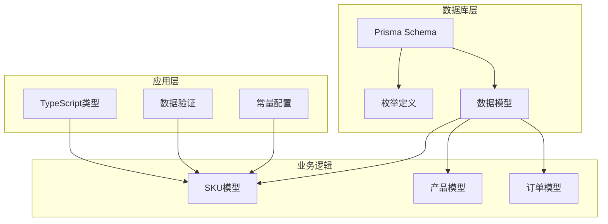
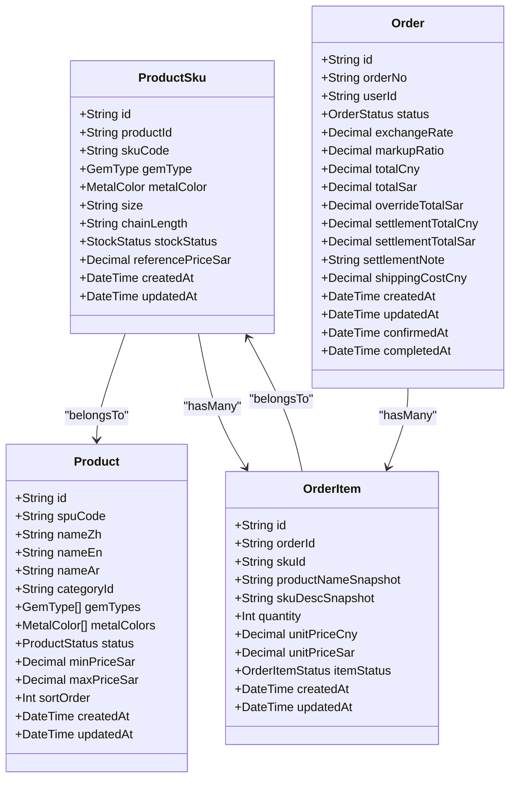
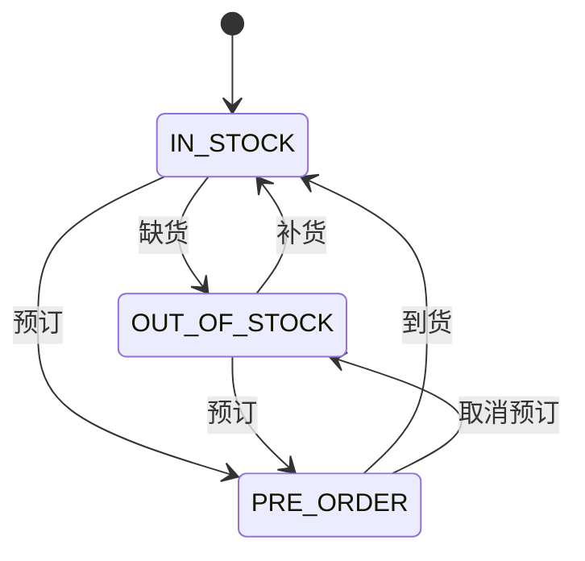
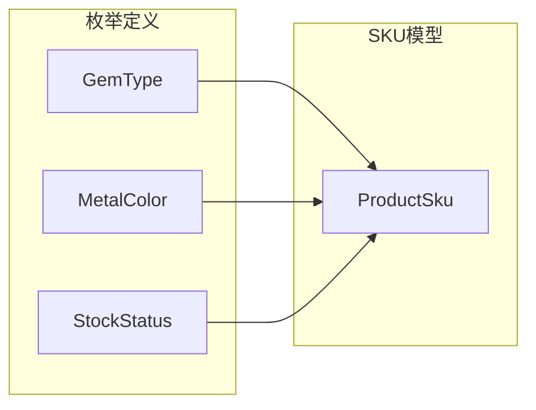
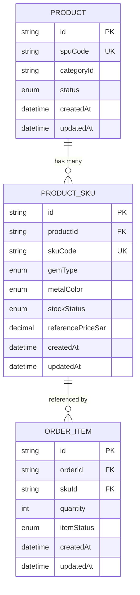

# 商品SKU模型

<cite>
**本文档引用的文件**
- [schema.prisma](file://prisma/schema.prisma)
- [index.ts](file://src/types/index.ts)
- [constants.ts](file://src/lib/constants.ts)
- [product.ts](file://src/lib/validations/product.ts)
</cite>

## 目录
1. [简介](#简介)
2. [项目结构](#项目结构)
3. [核心组件](#核心组件)
4. [架构概览](#架构概览)
5. [详细组件分析](#详细组件分析)
6. [依赖关系分析](#依赖关系分析)
7. [性能考虑](#性能考虑)
8. [故障排除指南](#故障排除指南)
9. [结论](#结论)

## 简介

本文档详细介绍了Celestia珠宝零售系统中的商品SKU（Stock Keeping Unit）模型。SKU模型是库存管理的核心实体，负责管理具体商品规格、库存状态和相关业务逻辑。该模型基于Prisma ORM构建，采用PostgreSQL数据库存储，并实现了完整的级联删除策略以确保数据一致性。

## 项目结构

项目采用现代化的Next.js架构，SKU模型位于Prisma数据库模式文件中，通过TypeScript类型定义进行类型安全约束。整个系统围绕珠宝零售业务场景设计，特别关注戒指、项链等珠宝商品的规格管理。

**图表来源**
- [schema.prisma:1-281](file://prisma/schema.prisma#L1-L281)
- [index.ts:1-60](file://src/types/index.ts#L1-L60)

**章节来源**
- [schema.prisma:1-281](file://prisma/schema.prisma#L1-L281)
- [index.ts:1-60](file://src/types/index.ts#L1-L60)

## 核心组件

### SKU模型概述

SKU（Stock Keeping Unit）模型是商品库存管理的核心实体，代表具体的商品规格变体。每个SKU实例对应一个独特的商品组合，包含所有必要的规格参数和库存信息。

### 主要字段设计

#### 基础标识字段
- **id**: 主键标识符，使用CUID生成器确保全局唯一性
- **productId**: 外键关联到Product模型，建立SKU与商品SPU的关系
- **skuCode**: SKU唯一编码，@unique约束确保全局唯一性

#### 规格参数字段
- **gemType**: 宝石类型枚举，支持MOISSANITE（莫桑石）和ZIRCON（锆石）
- **metalColor**: 金属颜色枚举，支持SILVER（银色）、GOLD（金色）、ROSE_GOLD（玫瑰金）、OTHER（其他）
- **size**: 戒指尺码，字符串类型，允许为空值
- **chainLength**: 链长度，字符串类型，允许为空值

#### 库存管理字段
- **stockStatus**: 库存状态，默认值为IN_STOCK，支持IN_STOCK、OUT_OF_STOCK、PRE_ORDER三种状态
- **referencePriceSar**: 参考价格（SAR），Decimal类型，精度为10位整数和2位小数

#### 时间戳字段
- **createdAt**: 创建时间，默认当前时间
- **updatedAt**: 更新时间，自动更新

**章节来源**
- [schema.prisma:151-170](file://prisma/schema.prisma#L151-L170)

## 架构概览

SKU模型在整体系统架构中扮演着关键角色，连接产品管理、库存控制和订单处理三个核心模块。

**图表来源**
- [schema.prisma:151-170](file://prisma/schema.prisma#L151-L170)
- [schema.prisma:122-149](file://prisma/schema.prisma#L122-L149)
- [schema.prisma:222-247](file://prisma/schema.prisma#L222-L247)
- [schema.prisma:188-220](file://prisma/schema.prisma#L188-L220)

## 详细组件分析

### 字段详细说明

#### 外键关联关系
SKU模型通过productId字段与Product模型建立一对多关系：
- **关系类型**: 外键关联
- **级联策略**: onDelete: Cascade
- **关系方向**: Product ← ProductSku

级联删除策略确保当删除产品SPU时，所有相关的SKU规格也会被自动删除，维护数据完整性。

#### 唯一标识符系统
- **skuCode**: 作为SKU的主要识别符，具有@unique约束
- **productId**: 建立SKU与产品SPU的关联关系
- **组合唯一性**: 通过外键约束确保SKU规格的唯一性

#### 规格参数管理

##### 宝石类型（gemType）
支持两种主要宝石类型：
- **MOISSANITE**: 莫桑石，具有钻石般的外观但成本更低
- **ZIRCON**: 锆石，传统宝石选择

##### 金属颜色（metalColor）
支持四种金属颜色选项：
- **SILVER**: 银色，经典白色金属
- **GOLD**: 金色，传统黄色金属
- **ROSE_GOLD**: 玫瑰金，时尚粉色金属
- **OTHER**: 其他颜色，支持定制需求

##### 尺寸规格
- **ringSize**: 戒指尺码，字符串类型，允许为空
- **chainLength**: 链条长度，字符串类型，允许为空
- **灵活性**: 支持不同珠宝类型的规格需求

#### 库存状态管理

库存状态枚举提供了完整的库存控制机制：

**图表来源**
- [schema.prisma:31-35](file://prisma/schema.prisma#L31-L35)

**库存状态含义**:
- **IN_STOCK**: 有货状态，商品可立即购买
- **OUT_OF_STOCK**: 缺货状态，暂时无法购买
- **PRE_ORDER**: 预订状态，需要等待补货

#### 价格管理体系
- **referencePriceSar**: 参考价格，以沙特里亚尔（SAR）为单位
- **精度设置**: 10位整数，2位小数，满足珠宝定价精度需求
- **货币转换**: 支持汇率转换和成本价计算

### 关系映射分析

#### 产品关系映射
SKU与Product之间的关系通过productId字段实现：
- **关系名称**: product
- **字段映射**: productId → Product.id
- **级联策略**: Cascade（级联删除）

#### 订单项关联
SKU与OrderItem之间存在一对多关系：
- **关系名称**: orderItems
- **反向关系**: OrderItem.sku
- **业务意义**: 一个SKU可以出现在多个订单中

### 数据验证和约束

#### 字段约束
- **@id**: 主键标识
- **@unique**: 唯一性约束（skuCode）
- **@default**: 默认值设置
- **@map**: 数据库列名映射

#### 类型约束
- **String**: 文本类型，支持任意长度
- **Decimal**: 高精度数值类型，支持货币计算
- **DateTime**: 时间戳类型，支持自动时间管理
- **Enum**: 枚举类型，确保数据完整性

**章节来源**
- [schema.prisma:151-170](file://prisma/schema.prisma#L151-L170)

## 依赖关系分析

### 枚举依赖关系

SKU模型依赖于多个枚举类型来确保数据的一致性和完整性：

**图表来源**
- [schema.prisma:37-47](file://prisma/schema.prisma#L37-L47)
- [schema.prisma:151-170](file://prisma/schema.prisma#L151-L170)

### 外键依赖关系

SKU模型的外键关系确保了数据的引用完整性：

**图表来源**
- [schema.prisma:122-149](file://prisma/schema.prisma#L122-L149)
- [schema.prisma:151-170](file://prisma/schema.prisma#L151-L170)
- [schema.prisma:222-247](file://prisma/schema.prisma#L222-L247)

### 级联删除策略

级联删除策略在多个层面发挥作用：

#### 数据库级级联删除
- **onDelete: Cascade**: 删除Product时自动删除所有关联的ProductSku
- **数据一致性**: 确保不会出现孤立的SKU记录

#### 业务逻辑影响
- **订单完整性**: 删除SKU不会影响已存在的订单项
- **历史记录保留**: 订单项中的SKU信息保持不变，便于审计

**章节来源**
- [schema.prisma:165](file://prisma/schema.prisma#L165)

## 性能考虑

### 索引优化
SKU模型建立了多个索引来优化查询性能：

#### 现有索引
- **@@index([productId])**: 优化SKU查询和关联操作
- **@unique(@map("sku_code"))**: 确保SKU编码唯一性
- **@@index([status])**: 优化库存状态查询

#### 查询优化建议
- **复合索引**: 考虑为常用查询条件建立复合索引
- **分区策略**: 对大量SKU数据可考虑按产品类别分区
- **缓存策略**: SKU元数据可考虑缓存以提高访问速度

### 内存使用优化
- **枚举类型**: 使用枚举减少存储空间和内存占用
- **Decimal精度**: 合理的精度设置平衡精度和性能
- **字符串长度**: 适当限制字符串字段长度避免过度内存消耗

## 故障排除指南

### 常见问题及解决方案

#### SKU唯一性冲突
**问题**: 插入重复的skuCode
**解决方案**: 
- 检查现有SKU编码
- 实施编码生成规则
- 添加业务逻辑验证

#### 外键约束错误
**问题**: 插入不存在的productId
**解决方案**:
- 验证产品是否存在
- 实施级联检查
- 提供错误反馈

#### 库存状态异常
**问题**: 库存状态不一致
**解决方案**:
- 实施状态转换验证
- 添加状态变更日志
- 实现状态同步机制

### 数据迁移注意事项

#### 架构演进
- **字段添加**: 新增字段时考虑默认值和约束
- **索引优化**: 新增索引时评估性能影响
- **数据迁移**: 大规模数据迁移时制定备份计划

#### 兼容性考虑
- **向后兼容**: 确保新版本不影响旧数据
- **数据验证**: 实施严格的数据验证规则
- **错误处理**: 提供清晰的错误信息和恢复机制

## 结论

商品SKU模型是Celestia珠宝零售系统的核心数据结构，通过精心设计的字段体系、严格的约束机制和完善的级联删除策略，实现了高效的库存管理和业务流程支持。

### 设计优势
- **完整性保证**: 通过外键约束和枚举类型确保数据一致性
- **扩展性强**: 支持多种宝石类型和金属颜色组合
- **业务适配**: 完整的库存状态管理满足珠宝行业需求
- **性能优化**: 合理的索引设计和数据类型选择

### 未来改进方向
- **智能库存**: 集成实时库存监控和预警机制
- **规格标准化**: 建立更规范的规格参数标准
- **性能监控**: 实施更详细的性能指标监控
- **用户体验**: 优化SKU查询和管理界面

该SKU模型为整个珠宝零售系统的库存管理奠定了坚实基础，通过持续的优化和完善，将更好地支持业务发展和技术演进。