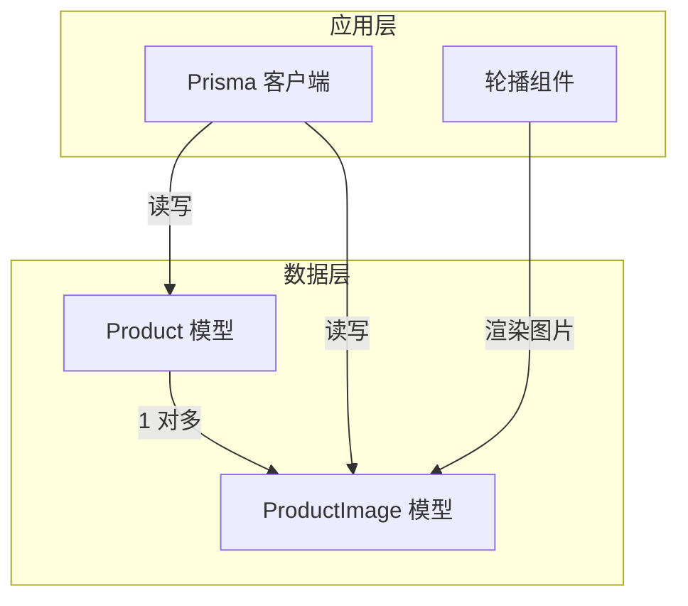
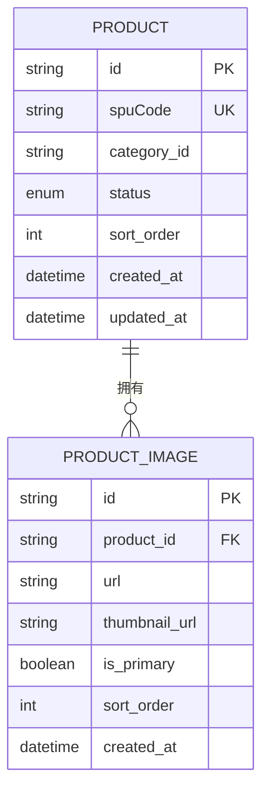
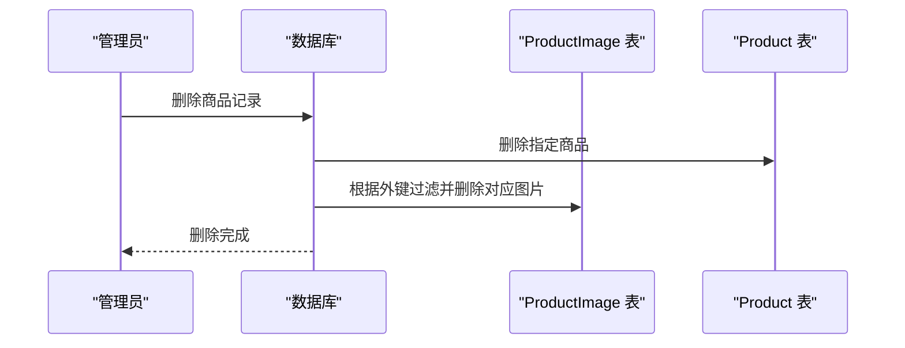
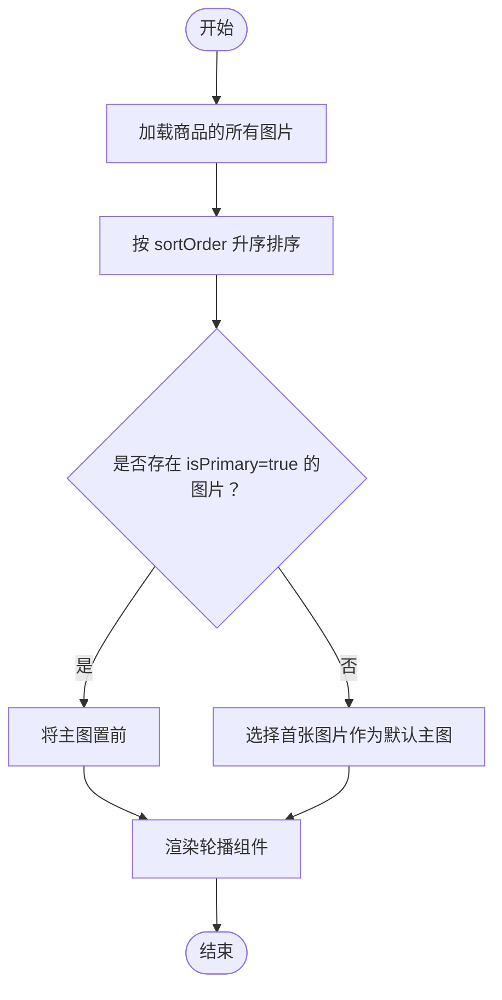
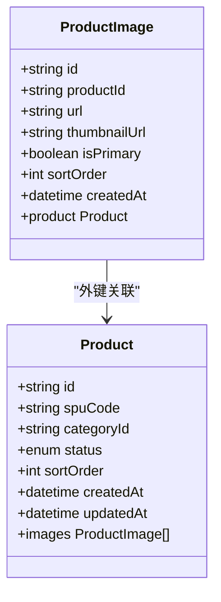
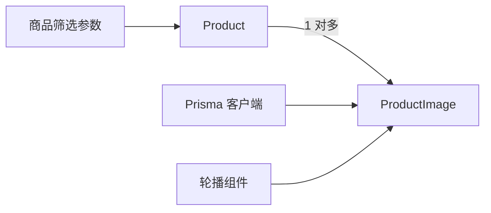

# 商品图片模型

<cite>
**本文引用的文件**
- [prisma/schema.prisma](file://prisma/schema.prisma)
- [src/lib/db.ts](file://src/lib/db.ts)
- [src/components/ui/carousel.tsx](file://src/components/ui/carousel.tsx)
- [src/lib/validations/product.ts](file://src/lib/validations/product.ts)
- [src/types/index.ts](file://src/types/index.ts)
</cite>

## 目录
1. [简介](#简介)
2. [项目结构](#项目结构)
3. [核心组件](#核心组件)
4. [架构概览](#架构概览)
5. [详细组件分析](#详细组件分析)
6. [依赖分析](#依赖分析)
7. [性能考虑](#性能考虑)
8. [故障排除指南](#故障排除指南)
9. [结论](#结论)
10. [附录](#附录)

## 简介
本文件系统性地文档化商品图片模型（ProductImage），深入解释其字段设计与业务语义，包括外键关联、关系映射、主图标识、排序控制以及级联删除策略。同时阐述该模型在商品展示与用户购买决策中的关键作用，并提供完整的字段说明与图片管理最佳实践。

## 项目结构
本项目的数据库模式通过 Prisma 管理，商品图片模型位于数据层，与商品模型存在一对多关系；前端通过轮播组件消费图片数据，后端通过 Prisma 客户端访问数据库。

图表来源
- [prisma/schema.prisma:122-186](file://prisma/schema.prisma#L122-L186)
- [src/lib/db.ts:1-18](file://src/lib/db.ts#L1-L18)
- [src/components/ui/carousel.tsx:1-243](file://src/components/ui/carousel.tsx#L1-L243)

章节来源
- [prisma/schema.prisma:122-186](file://prisma/schema.prisma#L122-L186)
- [src/lib/db.ts:1-18](file://src/lib/db.ts#L1-L18)

## 核心组件
- ProductImage 模型：承载单个商品的图片资源信息，包含主图链接、缩略图链接、主图标识与排序字段。
- Product 模型：包含多个 ProductImage，形成“商品-图片”一对多关系。
- Prisma 客户端：负责数据库访问与关系查询。
- 轮播组件：用于在前端展示商品图片集合，支持左右切换与键盘导航。

章节来源
- [prisma/schema.prisma:122-186](file://prisma/schema.prisma#L122-L186)
- [src/lib/db.ts:1-18](file://src/lib/db.ts#L1-L18)
- [src/components/ui/carousel.tsx:1-243](file://src/components/ui/carousel.tsx#L1-L243)

## 架构概览
下图展示了 ProductImage 与其关联的 Product 的关系，以及 onDelete: Cascade 策略如何影响商品删除时的图片清理。

图表来源
- [prisma/schema.prisma:122-186](file://prisma/schema.prisma#L122-L186)

## 详细组件分析

### ProductImage 字段设计与语义
- id：图片记录唯一标识，自动生成。
- productId：外键，指向 Product.id，建立与商品的一对多关系。
- url：主图链接，必填，指向高质量图片资源。
- thumbnailUrl：缩略图链接，可选，用于列表或缩略预览。
- isPrimary：布尔值，标识该图片是否为主图，默认 false。
- sortOrder：整数，控制同一商品内图片的展示顺序，默认 0。
- createdAt：自动记录创建时间。

字段设计要点
- 外键约束：productId 引用 Product.id，保证数据一致性。
- 主图标识：isPrimary 用于标记主图，便于在详情页优先展示。
- 排序控制：sortOrder 为同商品多图提供稳定的展示顺序。
- 缩略图支持：thumbnailUrl 提升列表页加载性能与体验。
- 级联删除：onDelete: Cascade 确保商品删除时自动清理其所有图片。

章节来源
- [prisma/schema.prisma:172-186](file://prisma/schema.prisma#L172-L186)

### 关系映射与查询
- Product 与 ProductImage 的关系：Product.images 返回该商品的所有图片。
- 查询建议：按 productId 查询，按 sortOrder 升序排列，必要时筛选 isPrimary 作为主图。
- 前端渲染：轮播组件消费图片数组，支持左右切换与键盘导航。

章节来源
- [prisma/schema.prisma:122-186](file://prisma/schema.prisma#L122-L186)
- [src/components/ui/carousel.tsx:1-243](file://src/components/ui/carousel.tsx#L1-L243)

### 级联删除策略（onDelete: Cascade）
当删除一个 Product 时，其关联的所有 ProductImage 将被自动删除，避免悬挂数据与不一致状态。此策略确保：
- 数据完整性：商品与图片始终成对存在。
- 维护成本低：无需手动清理图片记录。
- 业务安全：防止因遗漏删除导致的资源泄露。

图表来源
- [prisma/schema.prisma:172-186](file://prisma/schema.prisma#L172-L186)

### 图片展示顺序控制流程
图片在前端的展示顺序由以下规则决定：
- 同一商品内的图片按 sortOrder 升序排列。
- 若存在 isPrimary 为 true 的图片，通常将其置于首位或作为默认主图。
- 无显式主图时，可选择 sortOrder 最小的图片作为默认主图。

图表来源
- [prisma/schema.prisma:172-186](file://prisma/schema.prisma#L172-L186)
- [src/components/ui/carousel.tsx:1-243](file://src/components/ui/carousel.tsx#L1-L243)

### 类关系图（代码级）

图表来源
- [prisma/schema.prisma:122-186](file://prisma/schema.prisma#L122-L186)

## 依赖分析
- ProductImage 依赖 Product：通过 productId 外键与 Product 建立关系。
- Prisma 客户端：负责 ProductImage 的增删改查与关系查询。
- 前端轮播组件：消费 ProductImage 数据进行渲染与交互。
- 商品筛选与分页：商品层面的筛选参数与分页接口类型定义，间接影响图片在商品列表中的呈现。

图表来源
- [prisma/schema.prisma:122-186](file://prisma/schema.prisma#L122-L186)
- [src/lib/db.ts:1-18](file://src/lib/db.ts#L1-L18)
- [src/components/ui/carousel.tsx:1-243](file://src/components/ui/carousel.tsx#L1-L243)
- [src/lib/validations/product.ts:1-13](file://src/lib/validations/product.ts#L1-L13)
- [src/types/index.ts:24-32](file://src/types/index.ts#L24-L32)

章节来源
- [prisma/schema.prisma:122-186](file://prisma/schema.prisma#L122-L186)
- [src/lib/db.ts:1-18](file://src/lib/db.ts#L1-L18)
- [src/lib/validations/product.ts:1-13](file://src/lib/validations/product.ts#L1-L13)
- [src/types/index.ts:24-32](file://src/types/index.ts#L24-L32)

## 性能考虑
- 索引优化：为 productId 建立索引，加速按商品分组查询与排序。
- 排序字段：利用 sortOrder 进行数据库侧排序，减少前端二次排序开销。
- 缩略图：使用 thumbnailUrl 在列表页降低带宽与提升首屏速度。
- 级联删除：避免冗余数据，减少维护成本与存储占用。
- 分页与筛选：结合商品筛选参数与分页类型，控制返回图片数量与范围。

## 故障排除指南
- 图片未显示：检查 isPrimary 是否正确设置，或确认前端是否优先使用主图。
- 展示顺序异常：核对 sortOrder 是否按预期更新，确认查询是否按升序排列。
- 删除商品后仍有图片残留：确认 onDelete: Cascade 配置是否生效，检查外键约束与迁移执行结果。
- 列表页加载缓慢：优先使用 thumbnailUrl，确保缩略图尺寸合理且缓存有效。

## 结论
ProductImage 模型通过明确的字段设计与级联删除策略，为商品图片管理提供了清晰、可靠的数据基础。配合前端轮播组件与数据库排序机制，能够稳定地支撑商品详情与列表页的图片展示，从而显著提升用户的浏览体验与购买决策效率。

## 附录

### 字段完整说明
- id：图片记录唯一标识（字符串，主键）
- productId：所属商品标识（字符串，外键）
- url：主图链接（字符串，必填）
- thumbnailUrl：缩略图链接（字符串，可选）
- isPrimary：是否为主图（布尔，默认 false）
- sortOrder：排序权重（整数，默认 0）
- createdAt：创建时间（日期时间，默认当前时间）

章节来源
- [prisma/schema.prisma:172-186](file://prisma/schema.prisma#L172-L186)