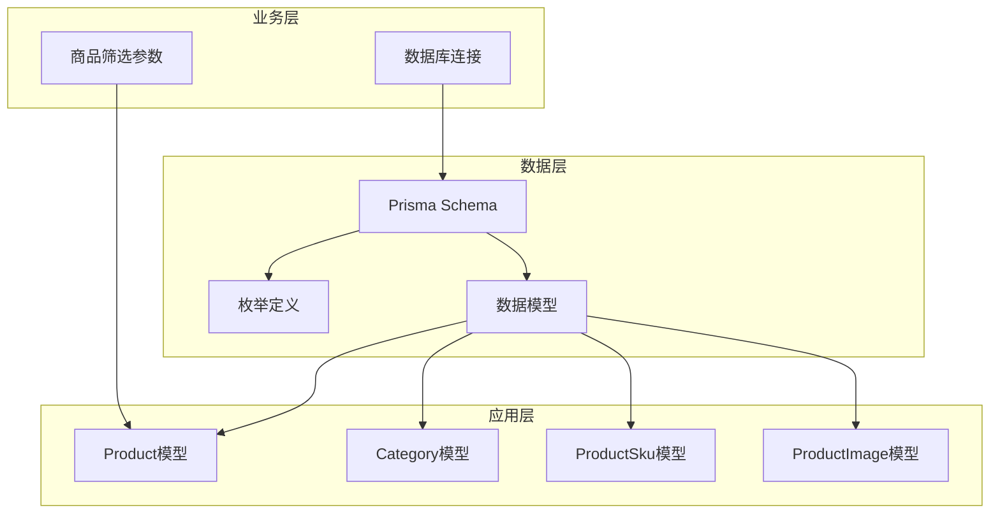
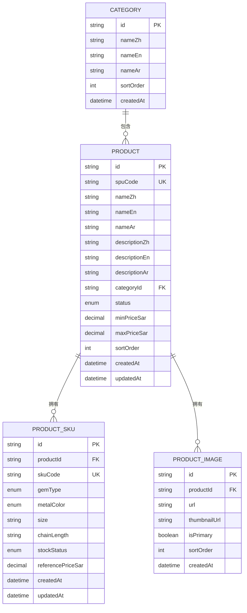
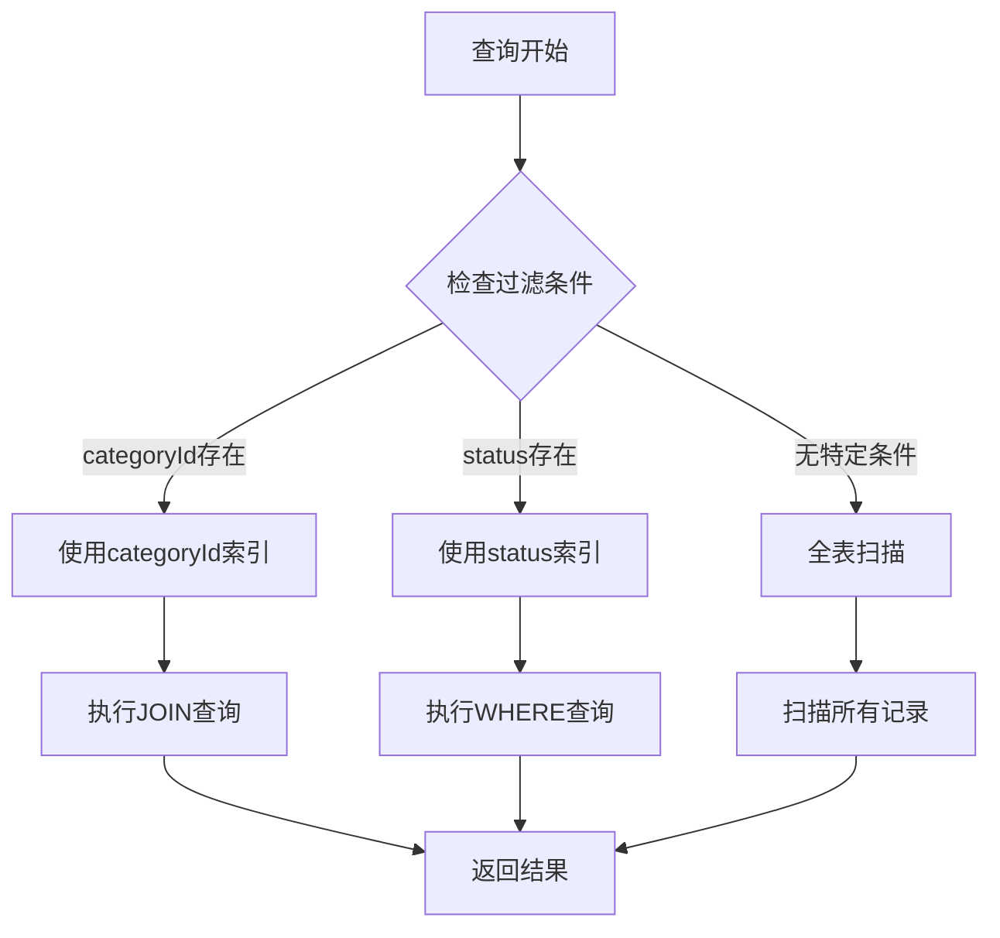
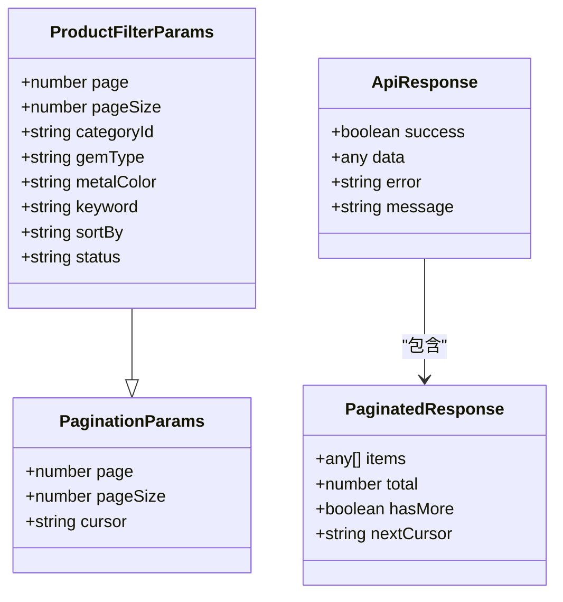
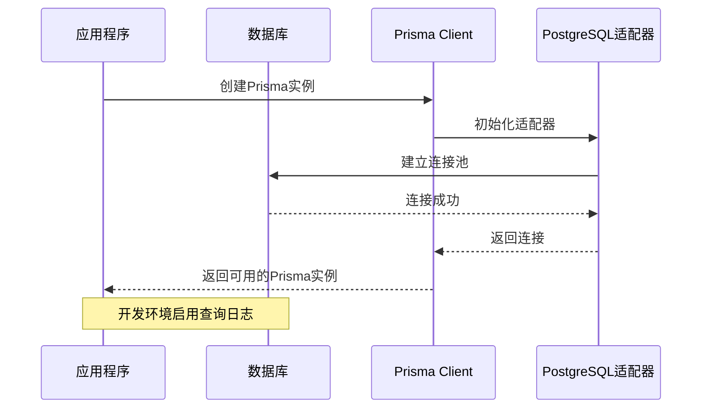
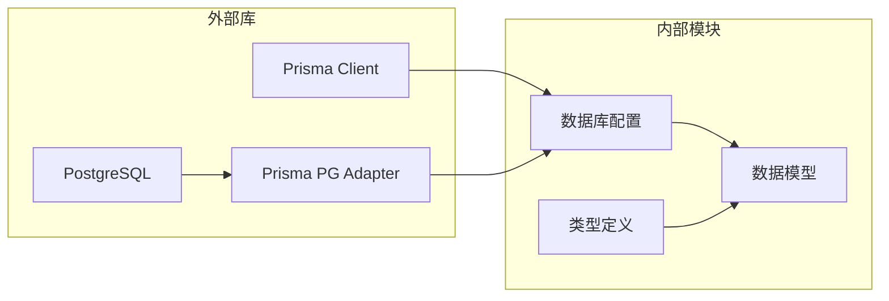

# 商品模型

<cite>
**本文档引用的文件**
- [prisma/schema.prisma](file://prisma/schema.prisma)
- [src/lib/db.ts](file://src/lib/db.ts)
- [src/types/index.ts](file://src/types/index.ts)
</cite>

## 目录
1. [简介](#简介)
2. [项目结构](#项目结构)
3. [核心组件](#核心组件)
4. [架构概览](#架构概览)
5. [详细组件分析](#详细组件分析)
6. [依赖分析](#依赖分析)
7. [性能考虑](#性能考虑)
8. [故障排除指南](#故障排除指南)
9. [结论](#结论)

## 简介

本文档详细说明了商品模型（Product）在Celestia珠宝商城系统中的设计与实现。Product模型作为商品的核心数据实体，采用SPU（Standard Product Unit）概念，通过唯一的spuCode标识不同的商品款式，并支持多语言内容展示。该模型不仅包含基础的商品信息字段，还集成了品类关联、SKU扩展、图片管理等功能模块，形成了完整的商品管理体系。

## 项目结构

基于Prisma Schema的设计，系统采用分层架构模式：

**图表来源**
- [prisma/schema.prisma:122-149](file://prisma/schema.prisma#L122-L149)
- [prisma/schema.prisma:108-120](file://prisma/schema.prisma#L108-L120)
- [prisma/schema.prisma:151-186](file://prisma/schema.prisma#L151-L186)

**章节来源**
- [prisma/schema.prisma:1-281](file://prisma/schema.prisma#L1-L281)

## 核心组件

### Product模型概述

Product模型是整个商品系统的核心实体，采用以下设计原则：

- **唯一标识符**: 使用spuCode作为商品的唯一标识符，确保每个商品款式的全球唯一性
- **多语言支持**: 提供中、英、阿拉伯语三种语言的内容支持
- **枚举类型**: 通过GemType和MetalColor枚举控制宝石类型和金属颜色的选择范围
- **状态管理**: 通过ProductStatus枚举控制商品的上下架状态
- **价格体系**: 支持最小和最大价格范围，便于批量商品的价格管理

### 字段详细说明

#### 基础标识字段
- **id**: 主键，使用cuid()生成全局唯一标识
- **spuCode**: 商品SPU编码，@unique约束确保唯一性
- **createdAt/updatedAt**: 自动时间戳管理

#### 多语言内容字段
- **nameZh/nameEn/nameAr**: 商品名称的多语言版本
- **descriptionZh/descriptionEn/descriptionAr**: 商品描述的多语言版本，使用@db.Text存储长文本

#### 关联字段
- **categoryId**: 外键关联到Category模型，建立商品与品类的多对一关系
- **gemTypes**: 枚举数组字段，支持多种宝石类型的组合
- **metalColors**: 枚举数组字段，支持多种金属颜色的组合

#### 业务状态字段
- **status**: 商品状态，默认ACTIVE（上架）
- **minPriceSar/maxPriceSar**: 价格范围字段，使用Decimal类型精确存储
- **sortOrder**: 排序权重，用于商品展示顺序控制

**章节来源**
- [prisma/schema.prisma:122-149](file://prisma/schema.prisma#L122-L149)

## 架构概览

### 数据模型关系图

**图表来源**
- [prisma/schema.prisma:108-120](file://prisma/schema.prisma#L108-L120)
- [prisma/schema.prisma:122-149](file://prisma/schema.prisma#L122-L149)
- [prisma/schema.prisma:151-186](file://prisma/schema.prisma#L151-L186)

### 关系映射分析

Product模型建立了以下关键关系：

1. **一对一关系**: 通过category属性映射到Category模型
2. **一对多关系**: 通过skus属性映射到ProductSku模型集合
3. **一对多关系**: 通过images属性映射到ProductImage模型集合

这些关系确保了商品信息的完整性，支持从商品到SKU和图片的完整数据链路。

**章节来源**
- [prisma/schema.prisma:142-144](file://prisma/schema.prisma#L142-L144)

## 详细组件分析

### 枚举类型详解

#### GemType枚举
| 枚举值 | 中文含义 | 英文描述 |
|--------|----------|----------|
| MOISSANITE | 莫桑石 | Moissanite gemstone |
| ZIRCON | 锆石 | Zircon gemstone |

#### MetalColor枚举
| 枚举值 | 中文含义 | 英文描述 |
|--------|----------|----------|
| SILVER | 银色 | Silver color |
| GOLD | 金色 | Gold color |
| ROSE_GOLD | 玫瑰金 | Rose gold color |
| OTHER | 其他 | Other colors |

#### ProductStatus枚举
| 枚举值 | 中文含义 | 业务含义 |
|--------|----------|----------|
| ACTIVE | 上架 | 商品可正常销售 |
| INACTIVE | 下架 | 商品暂停销售 |

### 数据库索引策略

Product模型采用了以下索引策略来优化查询性能：

**图表来源**
- [prisma/schema.prisma:146-147](file://prisma/schema.prisma#L146-L147)

**章节来源**
- [prisma/schema.prisma:37-47](file://prisma/schema.prisma#L37-L47)
- [prisma/schema.prisma:26-29](file://prisma/schema.prisma#L26-L29)

### 查询参数接口

系统提供了完善的商品筛选参数接口，支持多维度的商品查询：

**图表来源**
- [src/types/index.ts:24-32](file://src/types/index.ts#L24-L32)
- [src/types/index.ts:9-22](file://src/types/index.ts#L9-L22)

**章节来源**
- [src/types/index.ts:24-32](file://src/types/index.ts#L24-L32)

### 数据库连接配置

系统采用Prisma Client进行数据库操作，配置了PostgreSQL适配器：

**图表来源**
- [src/lib/db.ts:12-15](file://src/lib/db.ts#L12-L15)

**章节来源**
- [src/lib/db.ts:1-18](file://src/lib/db.ts#L1-L18)

## 依赖分析

### 外部依赖关系

**图表来源**
- [src/lib/db.ts:1-18](file://src/lib/db.ts#L1-L18)
- [prisma/schema.prisma:4-10](file://prisma/schema.prisma#L4-L10)

### 内部耦合度分析

Product模型与其他组件的耦合关系：

1. **低耦合设计**: 通过Prisma Schema定义清晰的数据契约
2. **强内聚特性**: 相关的业务字段和关系紧密关联
3. **可扩展性**: 枚举类型和数组字段支持未来功能扩展

**章节来源**
- [prisma/schema.prisma:122-149](file://prisma/schema.prisma#L122-L149)

## 性能考虑

### 查询优化策略

1. **索引优化**: 
   - categoryId索引支持按品类快速检索
   - status索引支持按状态过滤查询

2. **数据类型优化**:
   - Decimal类型精确存储价格数据
   - Text类型支持长文本描述

3. **关系查询优化**:
   - 使用预加载避免N+1查询问题
   - 合理的JOIN策略减少查询复杂度

### 存储优化建议

- 考虑对常用查询字段建立复合索引
- 图片URL建议使用CDN加速
- 大文本内容可考虑压缩存储

## 故障排除指南

### 常见问题及解决方案

1. **商品重复创建**
   - 问题: spuCode重复导致插入失败
   - 解决: 在业务层添加spuCode唯一性验证

2. **多语言内容缺失**
   - 问题: 某些语言版本内容为空
   - 解决: 设置默认语言回退机制

3. **价格计算异常**
   - 问题: Decimal精度问题导致计算误差
   - 解决: 统一使用后端Decimal类型处理

**章节来源**
- [prisma/schema.prisma:125](file://prisma/schema.prisma#L125)
- [prisma/schema.prisma:136-137](file://prisma/schema.prisma#L136-L137)

## 结论

Product模型作为Celestia珠宝商城的核心数据实体，展现了现代电商系统的最佳实践。通过合理的数据设计、完善的多语言支持、灵活的枚举类型管理和高效的索引策略，该模型为商品管理提供了坚实的基础。同时，清晰的业务逻辑和良好的扩展性为未来的功能演进预留了充足的空间。

该模型的成功实施体现了以下关键要素：
- 数据一致性保证
- 性能优化考量  
- 国际化支持能力
- 可维护性设计
- 扩展性预留