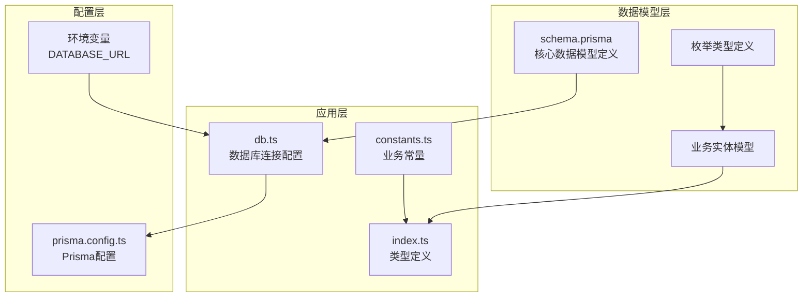
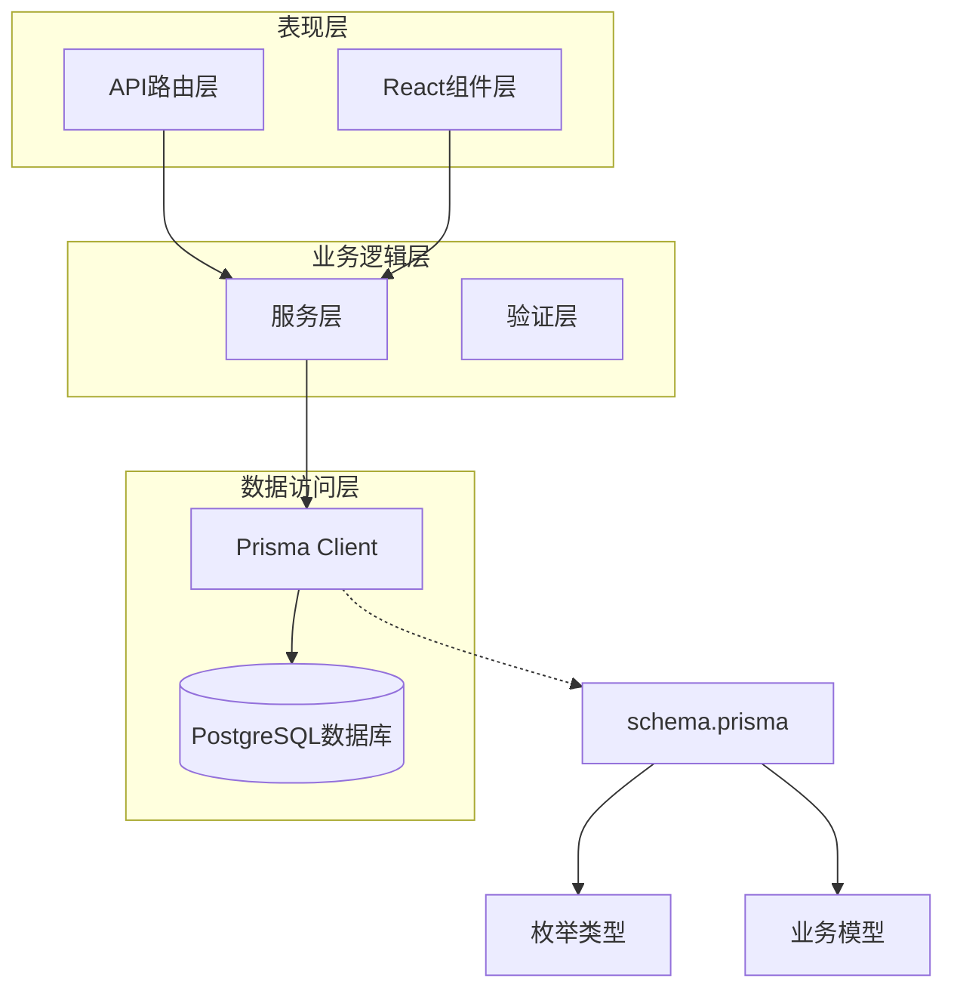
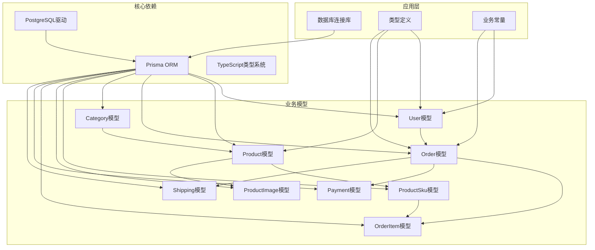
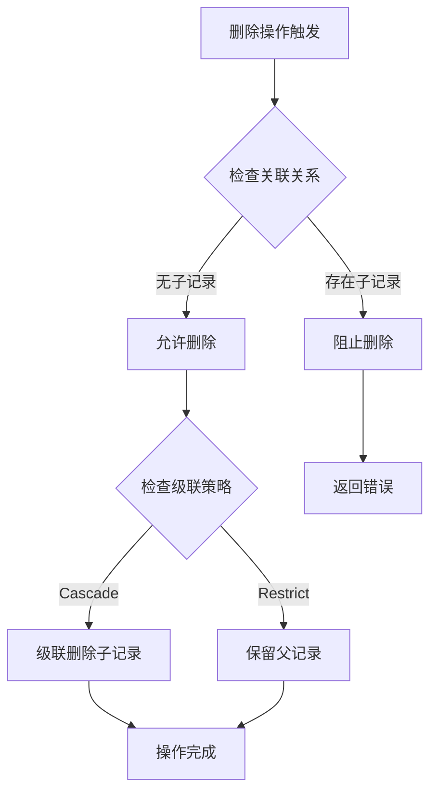

# 数据模型定义

<cite>
**本文档引用的文件**
- [schema.prisma](file://prisma/schema.prisma)
- [db.ts](file://src/lib/db.ts)
- [constants.ts](file://src/lib/constants.ts)
- [index.ts](file://src/types/index.ts)
- [prisma.config.ts](file://prisma.config.ts)
</cite>

## 目录
1. [简介](#简介)
2. [项目结构](#项目结构)
3. [核心组件](#核心组件)
4. [架构概览](#架构概览)
5. [详细组件分析](#详细组件分析)
6. [依赖关系分析](#依赖关系分析)
7. [性能考虑](#性能考虑)
8. [故障排除指南](#故障排除指南)
9. [结论](#结论)

## 简介

Celestia是一个基于Next.js和Prisma的数据模型系统，专注于珠宝零售业务的数字化转型。该系统采用现代化的数据库设计模式，通过Prisma ORM实现强类型的数据访问层，支持多语言国际化、多币种定价和复杂的订单管理流程。

系统的核心数据模型围绕用户、商品、订单三大业务实体构建，采用标准的关系型数据库设计原则，确保数据完整性、一致性和可扩展性。

## 项目结构

项目采用模块化的架构设计，数据模型相关的核心文件分布如下：

**图表来源**
- [schema.prisma:1-281](file://prisma/schema.prisma#L1-L281)
- [db.ts:1-18](file://src/lib/db.ts#L1-L18)
- [prisma.config.ts:1-15](file://prisma.config.ts#L1-L15)

**章节来源**
- [schema.prisma:1-281](file://prisma/schema.prisma#L1-L281)
- [db.ts:1-18](file://src/lib/db.ts#L1-L18)
- [prisma.config.ts:1-15](file://prisma.config.ts#L1-L15)

## 核心组件

### 数据库连接配置

系统使用Prisma Client配合PostgreSQL数据库，通过专用的数据库适配器实现高效的连接管理：

- **数据库提供商**: PostgreSQL
- **连接池**: 使用PrismaPg适配器
- **日志级别**: 开发环境启用查询、错误、警告日志
- **连接字符串**: 从环境变量DATABASE_URL读取

### 类型系统

项目采用强类型设计，所有数据模型都通过Prisma自动生成对应的TypeScript类型定义，确保编译时类型安全。

**章节来源**
- [db.ts:1-18](file://src/lib/db.ts#L1-L18)
- [schema.prisma:1-10](file://prisma/schema.prisma#L1-L10)

## 架构概览

系统采用三层架构设计，清晰分离关注点：

**图表来源**
- [schema.prisma:89-281](file://prisma/schema.prisma#L89-L281)
- [db.ts:12-15](file://src/lib/db.ts#L12-L15)

## 详细组件分析

### 用户模型 (User)

用户模型是整个系统的身份认证和权限管理核心，支持管理员和普通客户两种角色。

#### 字段定义

| 字段名 | 数据类型 | 约束条件 | 默认值 | 映射关系 |
|--------|----------|----------|--------|----------|
| id | String | 主键，cuid() | 自动生成 | users.id |
| phone | String | 唯一索引 | 用户输入 | users.phone |
| passwordHash | String | 必填 | 用户输入 | users.password_hash |
| name | String | 必填 | 用户输入 | users.name |
| company | String | 可选 | null | users.company |
| role | UserRole | 枚举 | CUSTOMER | users.role |
| status | UserStatus | 枚举 | PENDING | users.status |
| markupRatio | Decimal | 4位整数，2位小数 | 1.15 | users.markup_ratio |
| preferredLang | String | 长度限制 | "en" | users.preferred_lang |
| createdAt | DateTime | 自动设置 | now() | users.created_at |
| updatedAt | DateTime | 自动更新 | now() | users.updated_at |

#### 业务含义

- **phone**: 用户唯一标识，用于登录和身份验证
- **role**: 决定用户权限级别，ADMIN拥有完整管理权限
- **status**: 用户账户状态，影响登录权限
- **markupRatio**: 价格加价比例，影响商品定价策略
- **preferredLang**: 用户偏好的界面语言

#### 数据验证规则

- 手机号码必须唯一且符合手机号格式
- 密码必须进行哈希处理存储
- 角色枚举值必须在UserRole范围内
- 语言代码必须在支持的语言列表中

**章节来源**
- [schema.prisma:89-106](file://prisma/schema.prisma#L89-L106)
- [constants.ts:40-46](file://src/lib/constants.ts#L40-L46)

### 商品模型 (Product)

商品模型代表珠宝产品的抽象概念（SPU），包含多语言描述和基础属性信息。

#### 字段定义

| 字段名 | 数据类型 | 约束条件 | 默认值 | 映射关系 |
|--------|----------|----------|--------|----------|
| id | String | 主键，cuid() | 自动生成 | products.id |
| spuCode | String | 唯一索引 | 用户输入 | products.spu_code |
| nameZh | String | 可选 | null | products.name_zh |
| nameEn | String | 可选 | null | products.name_en |
| nameAr | String | 可选 | null | products.name_ar |
| descriptionZh | String | 文本类型 | null | products.description_zh |
| descriptionEn | String | 文本类型 | null | products.description_en |
| descriptionAr | String | 文本类型 | null | products.description_ar |
| categoryId | String | 外键 | 用户输入 | products.category_id |
| gemTypes | GemType[] | 枚举数组 | [] | products.gem_types |
| metalColors | MetalColor[] | 枚举数组 | [] | products.metal_colors |
| status | ProductStatus | 枚举 | ACTIVE | products.status |
| minPriceSar | Decimal | 10位整数，2位小数 | null | products.min_price_sar |
| maxPriceSar | Decimal | 10位整数，2位小数 | null | products.max_price_sar |
| sortOrder | Int | 整数 | 0 | products.sort_order |
| createdAt | DateTime | 自动设置 | now() | products.created_at |
| updatedAt | DateTime | 自动更新 | now() | products.updated_at |

#### 关联关系

- **Category**: 多对一关系，通过categoryId字段关联
- **ProductSku**: 一对多关系，SKU代表具体规格变体
- **ProductImage**: 一对多关系，支持多张产品图片

#### 数据验证规则

- SPU代码必须唯一
- 价格字段必须为有效的货币金额
- 排序字段用于前端展示顺序控制
- 枚举数组支持多选配置

**章节来源**
- [schema.prisma:122-149](file://prisma/schema.prisma#L122-L149)

### 订单模型 (Order)

订单模型管理完整的购买流程，支持复杂的业务状态管理和多币种处理。

#### 字段定义

| 字段组 | 字段名 | 数据类型 | 约束条件 | 默认值 | 映射关系 |
|--------|--------|----------|----------|--------|----------|
| 基础信息 | id | String | 主键，cuid() | 自动生成 | orders.id |
| 基础信息 | orderNo | String | 唯一索引 | 用户输入 | orders.order_no |
| 基础信息 | userId | String | 外键 | 用户输入 | orders.user_id |
| 基础信息 | status | OrderStatus | 枚举 | PENDING_QUOTE | orders.status |
| 定价字段 | exchangeRate | Decimal | 8位整数，4位小数 | null | orders.exchange_rate |
| 定价字段 | markupRatio | Decimal | 4位整数，2位小数 | null | orders.markup_ratio |
| 定价字段 | totalCny | Decimal | 12位整数，2位小数 | null | orders.total_cny |
| 定价字段 | totalSar | Decimal | 12位整数，2位小数 | null | orders.total_sar |
| 定价字段 | overrideTotalSar | Decimal | 12位整数，2位小数 | null | orders.override_total_sar |
| 结算字段 | settlementTotalCny | Decimal | 12位整数，2位小数 | null | orders.settlement_total_cny |
| 结算字段 | settlementTotalSar | Decimal | 12位整数，2位小数 | null | orders.settlement_total_sar |
| 结算字段 | settlementNote | String | 文本类型 | null | orders.settlement_note |
| 物流费用 | shippingCostCny | Decimal | 10位整数，2位小数 | null | orders.shipping_cost_cny |
| 时间戳 | createdAt | DateTime | 自动设置 | now() | orders.created_at |
| 时间戳 | updatedAt | DateTime | 自动更新 | now() | orders.updated_at |
| 时间戳 | confirmedAt | DateTime | 可选 | null | orders.confirmed_at |
| 时间戳 | completedAt | DateTime | 可选 | null | orders.completed_at |

#### 关联关系

- **User**: 多对一关系，记录下单用户
- **OrderItem**: 一对多关系，订单中的具体商品项
- **Payment**: 一对多关系，支付记录集合
- **Shipping**: 一对一关系，物流信息

#### 状态管理

订单状态遵循严格的业务流程，支持从待报价到完成的完整生命周期。

**章节来源**
- [schema.prisma:188-220](file://prisma/schema.prisma#L188-L220)

### 品类模型 (Category)

品类模型提供商品分类管理功能，支持多语言标题和排序控制。

#### 字段定义

| 字段名 | 数据类型 | 约束条件 | 默认值 | 映射关系 |
|--------|----------|----------|--------|----------|
| id | String | 主键，cuid() | 自动生成 | categories.id |
| nameZh | String | 必填 | 用户输入 | categories.name_zh |
| nameEn | String | 必填 | 用户输入 | categories.name_en |
| nameAr | String | 必填 | 用户输入 | categories.name_ar |
| sortOrder | Int | 整数 | 0 | categories.sort_order |
| createdAt | DateTime | 自动设置 | now() | categories.created_at |

#### 关联关系

- **Product**: 一对多关系，支持多个商品属于同一品类

#### 设计原则

- 多语言支持：同时维护中文、英文、阿拉伯语的标题
- 排序控制：通过sortOrder字段控制展示顺序
- 灵活扩展：支持未来新增语言版本

**章节来源**
- [schema.prisma:108-120](file://prisma/schema.prisma#L108-L120)

### 商品SKU模型 (ProductSku)

SKU模型代表商品的具体规格变体，是库存管理和销售的基础单元。

#### 字段定义

| 字段名 | 数据类型 | 约束条件 | 默认值 | 映射关系 |
|--------|----------|----------|--------|----------|
| id | String | 主键，cuid() | 自动生成 | product_skus.id |
| productId | String | 外键 | 用户输入 | product_skus.product_id |
| skuCode | String | 唯一索引 | 用户输入 | product_skus.sku_code |
| gemType | GemType | 枚举 | 用户输入 | product_skus.gem_type |
| metalColor | MetalColor | 枚举 | 用户输入 | product_skus.metal_color |
| size | String | 可选 | null | product_skus.size |
| chainLength | String | 可选 | null | product_skus.chain_length |
| stockStatus | StockStatus | 枚举 | IN_STOCK | product_skus.stock_status |
| referencePriceSar | Decimal | 10位整数，2位小数 | null | product_skus.reference_price_sar |
| createdAt | DateTime | 自动设置 | now() | product_skus.created_at |
| updatedAt | DateTime | 自动更新 | now() | product_skus.updated_at |

#### 关联关系

- **Product**: 多对一关系，属于特定商品
- **OrderItem**: 一对多关系，订单中的具体SKU项

#### 库存管理

- 支持多种库存状态：有货、缺货、预订
- 价格参考：提供建议零售价
- 尺寸规格：支持戒指尺寸和项链长度

**章节来源**
- [schema.prisma:151-170](file://prisma/schema.prisma#L151-L170)

### 订单项模型 (OrderItem)

订单项模型记录订单中的具体商品详情，支持复杂的定价和结算逻辑。

#### 字段定义

| 字段组 | 字段名 | 数据类型 | 约束条件 | 默认值 | 映射关系 |
|--------|--------|----------|----------|--------|----------|
| 基础信息 | id | String | 主键，cuid() | 自动生成 | order_items.id |
| 基础信息 | orderId | String | 外键 | 用户输入 | order_items.order_id |
| 基础信息 | skuId | String | 外键 | 用户输入 | order_items.sku_id |
| 基础信息 | productNameSnapshot | String | 必填 | 快照内容 | order_items.product_name_snapshot |
| 基础信息 | skuDescSnapshot | String | 必填 | 快照内容 | order_items.sku_desc_snapshot |
| 基础信息 | quantity | Int | 整数 | 用户输入 | order_items.quantity |
| 定价信息 | unitPriceCny | Decimal | 10位整数，2位小数 | null | order_items.unit_price_cny |
| 定价信息 | unitPriceSar | Decimal | 10位整数，2位小数 | null | order_items.unit_price_sar |
| 定价信息 | itemStatus | OrderItemStatus | 枚举 | PENDING_QUOTE | order_items.item_status |
| 结算信息 | settlementQty | Int | 可选 | null | order_items.settlement_qty |
| 结算信息 | settlementPriceCny | Decimal | 10位整数，2位小数 | null | order_items.settlement_price_cny |
| 结算信息 | settlementNote | String | 文本类型 | null | order_items.settlement_note |
| 时间戳 | createdAt | DateTime | 自动设置 | now() | order_items.created_at |
| 时间戳 | updatedAt | DateTime | 自动更新 | now() | order_items.updated_at |

#### 关联关系

- **Order**: 多对一关系，属于特定订单
- **ProductSku**: 多对一关系，关联具体SKU

#### 快照机制

- **productNameSnapshot**: 记录下单时的商品名称快照
- **skuDescSnapshot**: 记录下单时的SKU描述快照
- 确保历史数据的不可变性

**章节来源**
- [schema.prisma:222-247](file://prisma/schema.prisma#L222-L247)

### 付款记录模型 (Payment)

付款记录模型管理订单的支付过程，支持多种支付方式和凭证管理。

#### 字段定义

| 字段名 | 数据类型 | 约束条件 | 默认值 | 映射关系 |
|--------|----------|----------|--------|----------|
| id | String | 主键，cuid() | 自动生成 | payments.id |
| orderId | String | 外键 | 用户输入 | payments.order_id |
| amountSar | Decimal | 12位整数，2位小数 | 用户输入 | payments.amount_sar |
| method | PaymentMethod | 枚举 | 用户输入 | payments.method |
| proofUrl | String | 可选 | null | payments.proof_url |
| note | String | 文本类型 | null | payments.note |
| confirmedAt | DateTime | 自动设置 | now() | payments.confirmed_at |
| createdAt | DateTime | 自动设置 | now() | payments.created_at |

#### 关联关系

- **Order**: 多对一关系，关联支付的订单

#### 支付方式

支持多种国际支付方式，满足不同地区客户的需求。

**章节来源**
- [schema.prisma:249-264](file://prisma/schema.prisma#L249-L264)

### 物流信息模型 (Shipping)

物流信息模型管理订单的配送过程，与订单保持一对一关系。

#### 字段定义

| 字段名 | 数据类型 | 约束条件 | 默认值 | 映射关系 |
|--------|----------|----------|--------|----------|
| id | String | 主键，cuid() | 自动生成 | shippings.id |
| orderId | String | 唯一外键 | 用户输入 | shippings.order_id |
| trackingNo | String | 可选 | null | shippings.tracking_no |
| trackingUrl | String | 可选 | null | shippings.tracking_url |
| method | ShippingMethod | 枚举 | null | shippings.method |
| note | String | 文本类型 | null | shippings.note |
| createdAt | DateTime | 自动设置 | now() | shippings.created_at |
| updatedAt | DateTime | 自动更新 | now() | shippings.updated_at |

#### 关联关系

- **Order**: 一对一关系，每个订单对应唯一的物流信息

#### 物流方式

支持海运、空运、快递等多种运输方式。

**章节来源**
- [schema.prisma:266-280](file://prisma/schema.prisma#L266-L280)

## 依赖关系分析

系统采用清晰的依赖层次结构，确保模块间的松耦合和高内聚。

**图表来源**
- [schema.prisma:89-281](file://prisma/schema.prisma#L89-L281)
- [db.ts:1-18](file://src/lib/db.ts#L1-L18)

### 主键设计原则

所有模型均采用以下主键设计原则：
- **统一性**: 所有主键使用String类型，值为cuid()生成的唯一标识符
- **全局唯一**: 通过cuid()确保跨表的全局唯一性
- **无业务含义**: 主键不承载业务信息，便于系统演进

### 外键设计原则

外键关系严格遵循以下设计原则：
- **明确性**: 每个外键字段都有明确的业务含义
- **一致性**: 外键引用的目标字段必须存在且唯一
- **级联策略**: 根据业务需求选择合适的级联操作策略

### 级联操作策略

系统采用智能的级联操作策略：

**图表来源**
- [schema.prisma:165](file://prisma/schema.prisma#L165)
- [schema.prisma:182](file://prisma/schema.prisma#L182)
- [schema.prisma:260](file://prisma/schema.prisma#L260)
- [schema.prisma:277](file://prisma/schema.prisma#L277)

**章节来源**
- [schema.prisma:142-143](file://prisma/schema.prisma#L142-L143)
- [schema.prisma:165](file://prisma/schema.prisma#L165)
- [schema.prisma:182](file://prisma/schema.prisma#L182)
- [schema.prisma:241](file://prisma/schema.prisma#L241)
- [schema.prisma:260](file://prisma/schema.prisma#L260)
- [schema.prisma:277](file://prisma/schema.prisma#L277)

## 性能考虑

### 索引优化

系统为高频查询字段建立了适当的索引：

- **唯一索引**: phone(用户), spuCode(商品), orderNo(订单), skuCode(SKU)
- **普通索引**: categoryId(商品), status(商品和订单), userId(订单)
- **复合索引**: 用于复杂查询的组合字段

### 查询优化策略

- **预加载关联**: 使用Prisma的include功能避免N+1查询问题
- **批量操作**: 支持批量插入、更新和删除操作
- **分页查询**: 实现游标分页和传统分页两种模式

### 缓存策略

- **连接池**: 使用连接池减少数据库连接开销
- **查询缓存**: 对静态数据和频繁查询结果进行缓存
- **内存优化**: 合理使用内存，避免大数据集的重复加载

## 故障排除指南

### 常见问题及解决方案

#### 数据库连接问题
- **症状**: 应用启动时报数据库连接失败
- **原因**: DATABASE_URL环境变量配置错误
- **解决**: 检查环境变量配置，确保连接字符串格式正确

#### 数据验证错误
- **症状**: 插入或更新数据时报字段验证错误
- **原因**: 字段类型不匹配或违反约束条件
- **解决**: 检查数据类型和约束条件，确保符合Prisma定义

#### 关系完整性错误
- **症状**: 删除记录时报外键约束错误
- **原因**: 存在关联的子记录
- **解决**: 先删除子记录，再删除父记录，或检查级联策略

#### 性能问题
- **症状**: 查询响应时间过长
- **原因**: 缺少必要的索引或查询效率低下
- **解决**: 添加适当的索引，优化查询语句

**章节来源**
- [db.ts:9-15](file://src/lib/db.ts#L9-L15)
- [schema.prisma:146-147](file://prisma/schema.prisma#L146-L147)
- [schema.prisma:217-218](file://prisma/schema.prisma#L217-L218)

## 结论

Celestia项目的数据模型设计体现了现代企业级应用的最佳实践：

### 设计优势

1. **强类型系统**: 通过Prisma ORM实现编译时类型安全
2. **国际化支持**: 完整的多语言数据模型设计
3. **业务完整性**: 严格的业务规则和数据约束
4. **可扩展性**: 灵活的模型设计支持业务演进
5. **性能优化**: 合理的索引策略和查询优化

### 技术特色

- **枚举类型**: 统一管理业务状态和配置选项
- **快照机制**: 确保历史数据的不可变性和可追溯性
- **多币种支持**: 完整的定价和结算体系
- **多语言描述**: 支持中、英、阿拉伯语的国际化需求

### 发展建议

1. **监控指标**: 建立数据访问和性能监控体系
2. **备份策略**: 制定完善的数据备份和恢复计划
3. **迁移管理**: 规范数据库迁移流程
4. **测试覆盖**: 增强数据模型的自动化测试

该数据模型为Celestia项目的业务发展奠定了坚实的技术基础，能够有效支撑珠宝零售业务的复杂需求和未来的业务扩展。