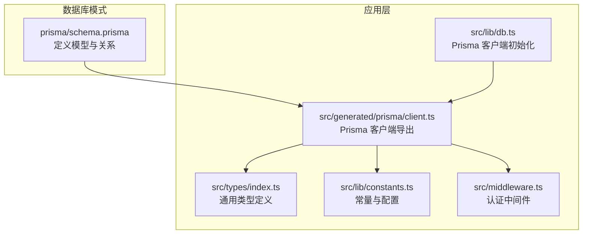
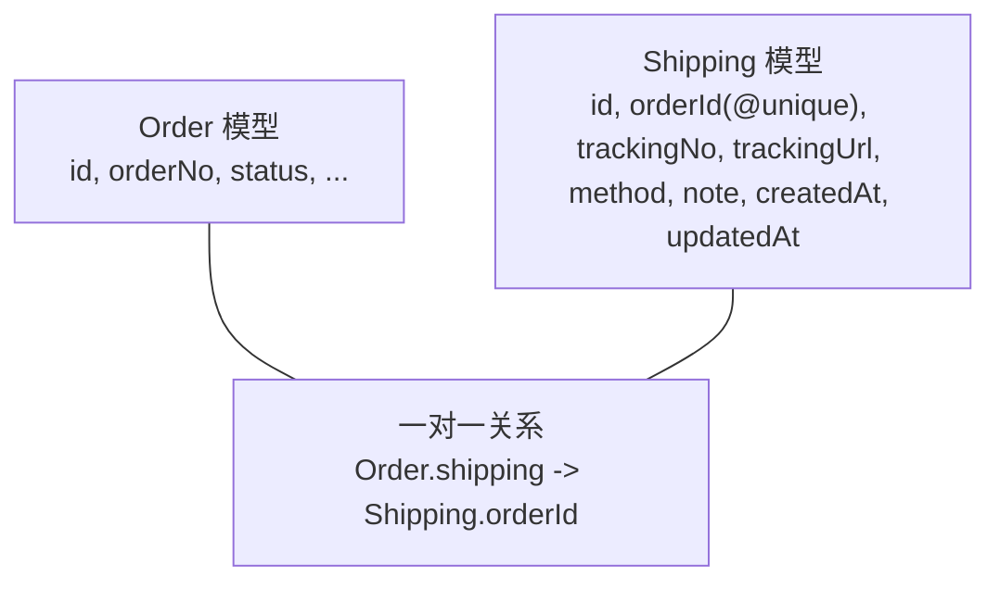
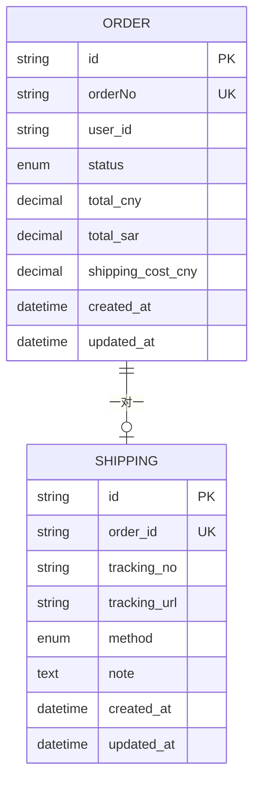
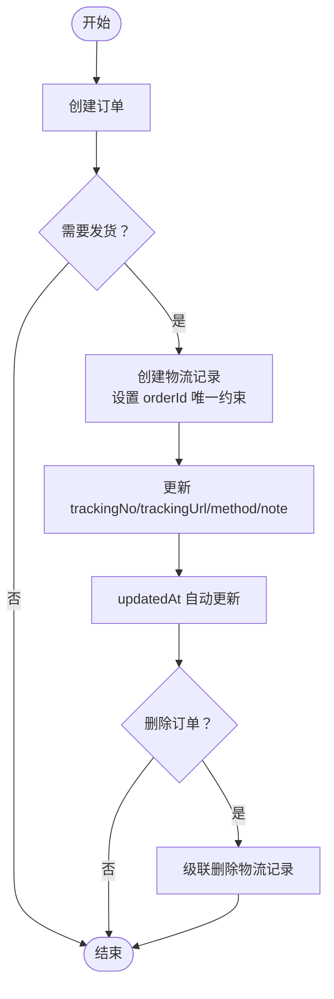
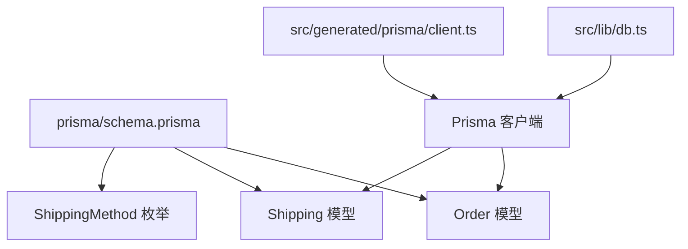

# 物流信息模型

<cite>
**本文档引用的文件**
- [schema.prisma](file://prisma/schema.prisma)
- [db.ts](file://src/lib/db.ts)
- [client.ts](file://src/generated/prisma/client.ts)
- [constants.ts](file://src/lib/constants.ts)
- [middleware.ts](file://src/middleware.ts)
</cite>

## 目录
1. [简介](#简介)
2. [项目结构](#项目结构)
3. [核心组件](#核心组件)
4. [架构总览](#架构总览)
5. [详细组件分析](#详细组件分析)
6. [依赖分析](#依赖分析)
7. [性能考虑](#性能考虑)
8. [故障排除指南](#故障排除指南)
9. [结论](#结论)
10. [附录](#附录)

## 简介
本文件聚焦于物流信息模型（Shipping）的设计与使用，基于仓库中的 Prisma 模式定义进行深入解析。内容涵盖：
- 字段设计与业务含义
- 一对一关联 orderId 与订单（Order）的关系映射
- 物流单号、追踪链接、物流方式枚举等关键字段
- 备注字段与唯一性约束对一对一关系的保障
- 时间戳字段的业务意义
- 级联删除策略对订单删除时物流信息的处理
- 物流模型的完整字段说明与集成最佳实践

## 项目结构
物流模型位于数据库模式文件中，并通过 Prisma 客户端生成的类型与运行时在应用层使用。整体结构如下：

图表来源
- [schema.prisma:266-280](file://prisma/schema.prisma#L266-L280)
- [db.ts:1-18](file://src/lib/db.ts#L1-L18)
- [client.ts:18-45](file://src/generated/prisma/client.ts#L18-L45)

章节来源
- [schema.prisma:1-281](file://prisma/schema.prisma#L1-L281)
- [db.ts:1-18](file://src/lib/db.ts#L1-L18)
- [client.ts:18-45](file://src/generated/prisma/client.ts#L18-L45)

## 核心组件
本节从数据库模式出发，系统梳理物流模型的字段、关系与约束。

- 模型名称：Shipping（物流信息）
- 关系：与订单（Order）建立一对一关系，通过 orderId 字段与订单表的 id 建立外键约束
- 唯一性：orderId 字段带有唯一约束，确保每个订单仅对应一条物流记录
- 级联删除：当订单被删除时，对应的物流记录将被级联删除
- 字段概览：
  - id：主键
  - orderId：一对一关联订单的外键，唯一约束
  - trackingNo：物流单号（可空）
  - trackingUrl：物流追踪链接（可空）
  - method：物流方式枚举（可空），取值来自 ShippingMethod 枚举
  - note：备注（可空）
  - createdAt、updatedAt：时间戳

章节来源
- [schema.prisma:266-280](file://prisma/schema.prisma#L266-L280)

## 架构总览
物流模型在系统中的位置与交互如下：

图表来源
- [schema.prisma:188-220](file://prisma/schema.prisma#L188-L220)
- [schema.prisma:266-280](file://prisma/schema.prisma#L266-L280)

## 详细组件分析

### 字段设计与业务语义
- orderId（一对一关联）
  - 类型：String
  - 约束：@unique
  - 关系：指向 Order.id
  - 作用：建立与订单的一对一绑定，确保每笔订单仅有一条物流记录
  - 级联策略：onDelete: Cascade
- trackingNo（物流单号）
  - 类型：String?
  - 作用：存储第三方物流平台的单号，便于外部查询与核对
- trackingUrl（物流追踪链接）
  - 类型：String?
  - 作用：提供直达第三方物流追踪页面的链接
- method（物流方式枚举）
  - 类型：ShippingMethod?
  - 可选值：SEA_FREIGHT（海运）、AIR_FREIGHT（空运）、EXPRESS（快递）
  - 作用：标识本次发货采用的运输方式
- note（备注）
  - 类型：String?（Text）
  - 作用：记录与物流相关的补充说明，如异常情况、特殊要求等
- createdAt、updatedAt（时间戳）
  - 类型：DateTime
  - 作用：createdAt 记录物流信息创建时间；updatedAt 自动更新最后修改时间

章节来源
- [schema.prisma:79-83](file://prisma/schema.prisma#L79-L83)
- [schema.prisma:266-280](file://prisma/schema.prisma#L266-L280)

### 关系映射与级联删除
- 关系声明：Shipping.order 使用 relation 映射到 Order.id
- 唯一性约束：orderId 字段的 @unique 确保一对一
- 级联删除：onDelete: Cascade 表示当订单被删除时，对应的物流记录也会被自动删除
- 反向关系：Order.shipping（可空）用于从订单侧访问物流信息

图表来源
- [schema.prisma:188-220](file://prisma/schema.prisma#L188-L220)
- [schema.prisma:266-280](file://prisma/schema.prisma#L266-L280)

### 数据流程与业务规则
- 创建流程
  - 订单创建后，若需要发货，再创建对应的物流记录
  - 物流记录必须包含有效的 orderId（且唯一）
- 更新流程
  - 更新 trackingNo、trackingUrl、method、note 等字段
  - updatedAt 将自动更新
- 删除流程
  - 删除订单时，由于 onDelete: Cascade，物流记录会被同步删除
  - 若仅删除物流记录，不影响订单

图表来源
- [schema.prisma:266-280](file://prisma/schema.prisma#L266-L280)

### 与应用层的集成
- Prisma 客户端
  - 通过 src/lib/db.ts 初始化 PrismaClient 并使用 @prisma/adapter-pg 连接 PostgreSQL
  - 生成的 Prisma 客户端在 src/generated/prisma/client.ts 中导出
- 类型安全
  - 在 src/types/index.ts 中定义通用响应与分页类型，便于 API 层统一返回结构
- 认证与权限
  - src/middleware.ts 提供 API 认证中间件，确保物流相关接口的安全访问

章节来源
- [db.ts:1-18](file://src/lib/db.ts#L1-L18)
- [client.ts:18-45](file://src/generated/prisma/client.ts#L18-L45)
- [middleware.ts:31-75](file://src/middleware.ts#L31-L75)

## 依赖分析
物流模型与其他模块的依赖关系如下：

图表来源
- [schema.prisma:79-83](file://prisma/schema.prisma#L79-L83)
- [schema.prisma:188-220](file://prisma/schema.prisma#L188-L220)
- [schema.prisma:266-280](file://prisma/schema.prisma#L266-L280)
- [db.ts:1-18](file://src/lib/db.ts#L1-L18)
- [client.ts:18-45](file://src/generated/prisma/client.ts#L18-L45)

章节来源
- [schema.prisma:1-281](file://prisma/schema.prisma#L1-L281)
- [db.ts:1-18](file://src/lib/db.ts#L1-L18)
- [client.ts:18-45](file://src/generated/prisma/client.ts#L18-L45)

## 性能考虑
- 唯一索引优化
  - orderId 的唯一约束可确保一对一关系的完整性，同时为查询提供高效索引支持
- 级联删除影响
  - onDelete: Cascade 在删除订单时会同步清理物流记录，避免悬挂数据，但需注意批量删除的事务成本
- 查询建议
  - 通常通过订单 ID 查询物流信息，利用唯一索引快速定位
  - 若需批量查询，建议在应用层合并查询并使用事务保证一致性

## 故障排除指南
- 常见问题
  - 重复创建物流记录：由于 orderId 唯一约束，再次插入相同 orderId 会失败
  - 无法删除订单：若存在物流记录，级联删除会一并删除物流记录
- 排查步骤
  - 检查订单是否存在且状态符合发货条件
  - 确认物流记录的 orderId 是否与订单 id 匹配
  - 核对枚举值 method 是否属于 ShippingMethod 范围
- 安全访问
  - 确保 API 路由受 middleware.ts 的认证保护，避免未授权访问

章节来源
- [schema.prisma:266-280](file://prisma/schema.prisma#L266-L280)
- [middleware.ts:31-75](file://src/middleware.ts#L31-L75)

## 结论
物流信息模型通过明确的一对一关系、唯一性约束与级联删除策略，实现了订单与物流数据的强一致绑定。结合 Prisma 的类型安全与 PostgreSQL 的索引能力，能够满足高并发场景下的查询与维护需求。建议在实际集成中遵循本文的最佳实践，确保数据完整性与用户体验。

## 附录

### 字段完整说明表
- id：主键，自动生成
- orderId：一对一关联订单的外键，唯一约束
- trackingNo：物流单号（可空）
- trackingUrl：物流追踪链接（可空）
- method：物流方式枚举（可空），取值：SEA_FREIGHT、AIR_FREIGHT、EXPRESS
- note：备注（可空）
- createdAt：创建时间
- updatedAt：最后更新时间

章节来源
- [schema.prisma:266-280](file://prisma/schema.prisma#L266-L280)

### 物流集成最佳实践
- 数据一致性
  - 在创建物流记录前，确保订单状态已进入可发货阶段
  - 使用事务同时创建订单与物流记录，避免中间状态不一致
- 唯一性保障
  - 通过 orderId 的唯一约束防止重复创建物流记录
- 级联策略
  - 合理使用 onDelete: Cascade，简化订单删除后的清理工作
- 枚举校验
  - method 字段严格限定在 ShippingMethod 枚举范围内，避免无效值
- 时间戳
  - 利用 createdAt/updatedAt 追踪物流信息生命周期，便于审计与排错
- 安全访问
  - 对物流相关 API 接口启用认证中间件，防止未授权访问

章节来源
- [schema.prisma:79-83](file://prisma/schema.prisma#L79-L83)
- [schema.prisma:266-280](file://prisma/schema.prisma#L266-L280)
- [middleware.ts:31-75](file://src/middleware.ts#L31-L75)