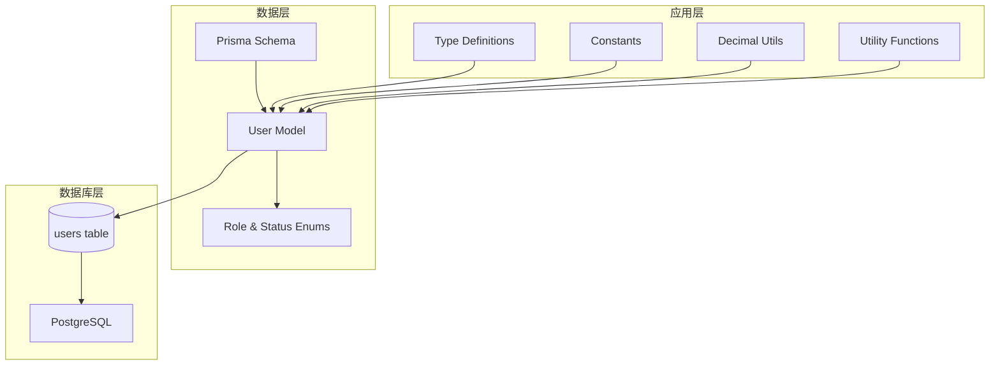
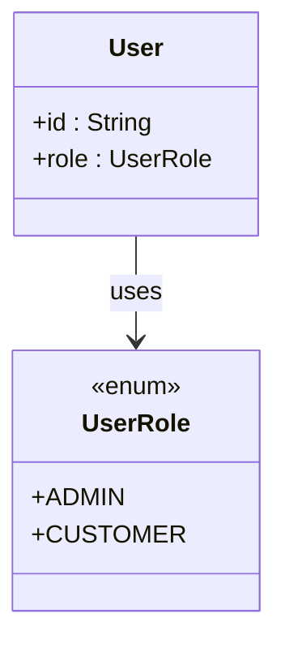
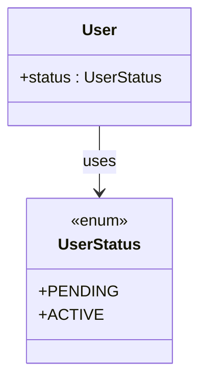
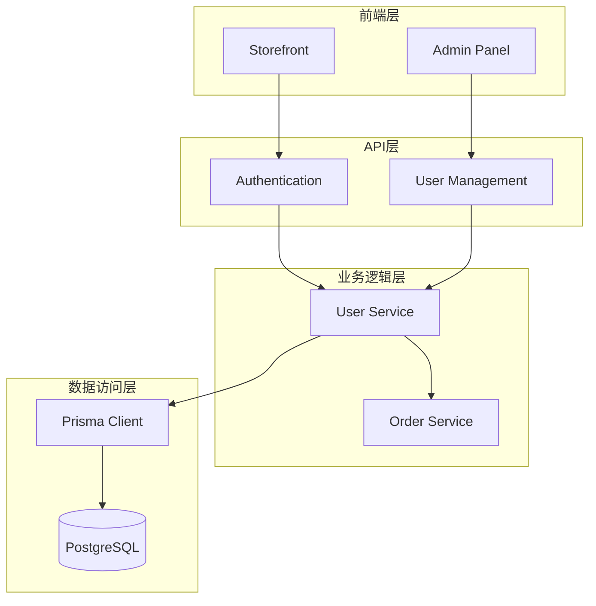
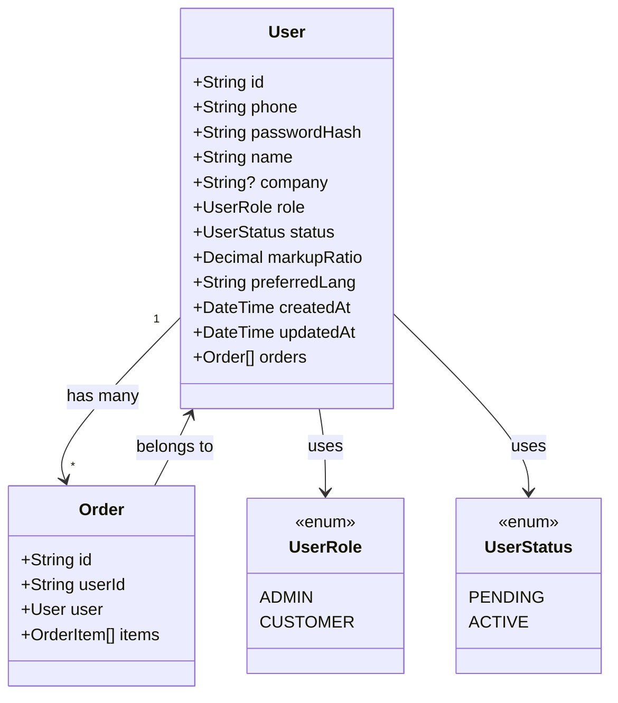
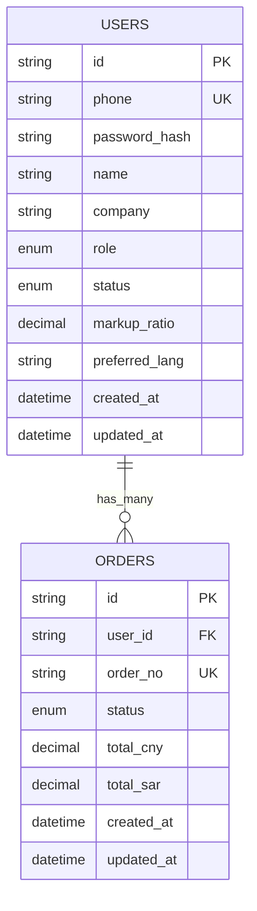
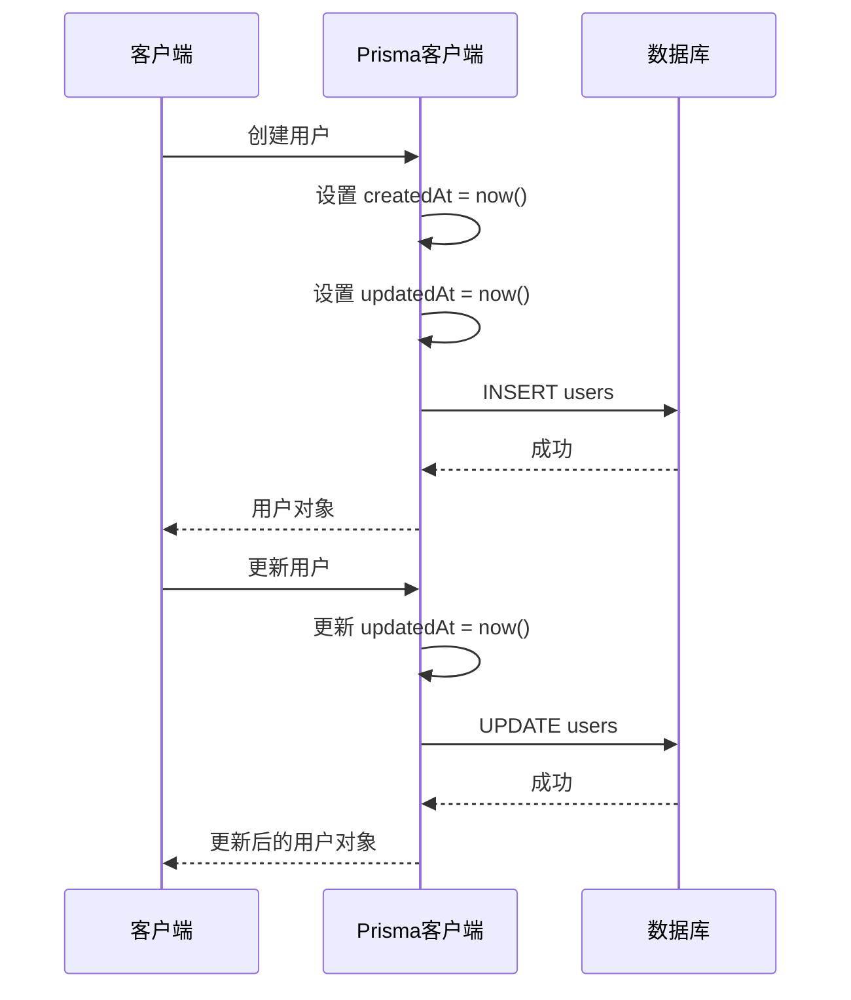
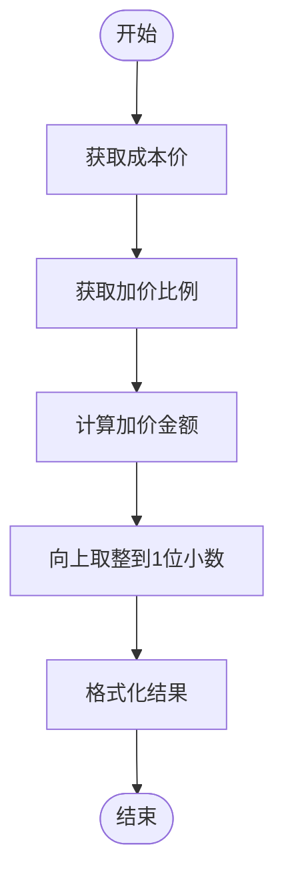

# 用户模型

<cite>
**本文档引用的文件**
- [schema.prisma](file://prisma/schema.prisma)
- [index.ts](file://src/types/index.ts)
- [constants.ts](file://src/lib/constants.ts)
- [decimal.ts](file://src/lib/decimal.ts)
- [utils.ts](file://src/lib/utils.ts)
- [db.ts](file://src/lib/db.ts)
- [package.json](file://package.json)
</cite>

## 目录
1. [简介](#简介)
2. [项目结构](#项目结构)
3. [核心组件](#核心组件)
4. [架构概览](#架构概览)
5. [详细组件分析](#详细组件分析)
6. [依赖分析](#依赖分析)
7. [性能考虑](#性能考虑)
8. [故障排除指南](#故障排除指南)
9. [结论](#结论)

## 简介

用户模型是 Celestia 项目的核心数据模型之一，负责管理系统的用户信息和权限控制。该模型基于 Prisma ORM 设计，支持管理员和客户两种角色，并通过状态字段实现用户生命周期管理。

## 项目结构

用户模型在项目中的组织结构如下：



**图表来源**
- [schema.prisma:89-106](file://prisma/schema.prisma#L89-L106)
- [index.ts:42-60](file://src/types/index.ts#L42-L60)

**章节来源**
- [schema.prisma:1-281](file://prisma/schema.prisma#L1-L281)
- [package.json:11-44](file://package.json#L11-L44)

## 核心组件

### 用户模型字段定义

用户模型包含以下核心字段：

| 字段名 | 类型 | 约束 | 默认值 | 描述 |
|--------|------|------|--------|------|
| id | String | 主键 | cuid() | 用户唯一标识符 |
| phone | String | 唯一索引 | - | 用户手机号码 |
| passwordHash | String | - | - | 密码哈希值 |
| name | String | - | - | 用户姓名 |
| company | String | 可选 | - | 所属公司 |
| role | UserRole | 枚举 | CUSTOMER | 用户角色 |
| status | UserStatus | 枚举 | PENDING | 用户状态 |
| markupRatio | Decimal | 默认值 | 1.15 | 加价比例 |
| preferredLang | String | 默认值 | "en" | 首选语言 |
| createdAt | DateTime | 自动设置 | now() | 创建时间 |
| updatedAt | DateTime | 自动更新 | - | 更新时间 |

### 角色枚举 (UserRole)



**图表来源**
- [schema.prisma:16-19](file://prisma/schema.prisma#L16-L19)
- [schema.prisma:96](file://prisma/schema.prisma#L96)

### 状态枚举 (UserStatus)



**图表来源**
- [schema.prisma:21-24](file://prisma/schema.prisma#L21-L24)
- [schema.prisma:97](file://prisma/schema.prisma#L97)

**章节来源**
- [schema.prisma:89-106](file://prisma/schema.prisma#L89-L106)
- [schema.prisma:16-24](file://prisma/schema.prisma#L16-L24)

## 架构概览

用户模型在整个系统架构中的位置：



**图表来源**
- [db.ts:12-15](file://src/lib/db.ts#L12-L15)
- [schema.prisma:89-106](file://prisma/schema.prisma#L89-L106)

## 详细组件分析

### 用户模型类图



**图表来源**
- [schema.prisma:89-106](file://prisma/schema.prisma#L89-L106)
- [schema.prisma:189-220](file://prisma/schema.prisma#L189-L220)

### 用户与订单关系映射

用户与订单之间存在一对多关系：



**图表来源**
- [schema.prisma:89-106](file://prisma/schema.prisma#L89-L106)
- [schema.prisma:189-220](file://prisma/schema.prisma#L189-L220)

### 时间戳自动管理机制

用户模型的时间戳字段具有自动管理特性：



**图表来源**
- [schema.prisma:100](file://prisma/schema.prisma#L100)
- [schema.prisma:101](file://prisma/schema.prisma#L101)

### 业务相关字段详解

#### markupRatio 加价比例

加价比例用于计算客户最终价格：



**图表来源**
- [schema.prisma:98](file://prisma/schema.prisma#L98)
- [decimal.ts:10-22](file://src/lib/decimal.ts#L10-L22)

#### preferredLang 首选语言

首选语言影响用户界面显示：

| 语言代码 | 语言名称 | 文字方向 |
|----------|----------|----------|
| en | 英语 | LTR |
| ar | 阿拉伯语 | RTL |
| zh | 中文 | LTR |

**图表来源**
- [schema.prisma:99](file://prisma/schema.prisma#L99)
- [constants.ts:40-46](file://src/lib/constants.ts#L40-L46)

**章节来源**
- [schema.prisma:89-106](file://prisma/schema.prisma#L89-L106)
- [decimal.ts:1-96](file://src/lib/decimal.ts#L1-L96)
- [constants.ts:37-46](file://src/lib/constants.ts#L37-L46)

## 依赖分析

用户模型的依赖关系：

```mermaid
graph LR
subgraph "直接依赖"
SCHEMA[schema.prisma]
TYPES[index.ts]
CONST[constants.ts]
DECIMAL[decimal.ts]
end
subgraph "运行时依赖"
PRISMA_CLIENT[@prisma/client]
PG[pg]
DECIMAL_JS[decimal.js]
end
SCHEMA --> TYPES
SCHEMA --> CONST
SCHEMA --> DECIMAL
TYPES --> PRISMA_CLIENT
CONST --> DECIMAL_JS
DECIMAL --> DECIMAL_JS
PRISMA_CLIENT --> PG
```

**图表来源**
- [package.json:15-44](file://package.json#L15-L44)
- [db.ts:1-18](file://src/lib/db.ts#L1-L18)

**章节来源**
- [package.json:11-44](file://package.json#L11-L44)
- [db.ts:1-18](file://src/lib/db.ts#L1-L18)

## 性能考虑

### 查询优化建议

1. **索引策略**
   - phone 字段已建立唯一索引，确保快速查找
   - 建议为 role 和 status 字段添加复合索引以优化查询

2. **分页查询**
   - 使用游标分页避免深度偏移
   - 实现适当的批量加载策略

3. **缓存策略**
   - 对常用用户信息实施缓存
   - 考虑使用 Redis 缓存用户会话数据

### 数据类型优化

- Decimal 类型用于精确的价格计算
- DateTime 类型确保时间戳精度
- String 类型用于可变长度文本存储

## 故障排除指南

### 常见问题及解决方案

#### 用户注册失败
**症状**: 注册时出现唯一约束冲突
**原因**: phone 字段重复
**解决方案**: 验证手机号唯一性后再创建用户

#### 权限验证错误
**症状**: 用户无法登录或访问受限功能
**原因**: 用户状态为 PENDING 或角色不正确
**解决方案**: 检查用户状态是否为 ACTIVE，角色是否为 ADMIN 或 CUSTOMER

#### 价格计算异常
**症状**: 客户价格计算结果不准确
**原因**: Decimal 精度设置或四舍五入规则
**解决方案**: 检查 decimal.js 配置和计算函数

**章节来源**
- [schema.prisma:92](file://prisma/schema.prisma#L92)
- [schema.prisma:96](file://prisma/schema.prisma#L96)
- [schema.prisma:97](file://prisma/schema.prisma#L97)

## 结论

用户模型设计合理，满足了 Celestia 项目的业务需求。通过清晰的角色和状态枚举、完善的时间戳管理、以及与订单模型的关联关系，构建了一个完整的用户管理体系。建议在生产环境中重点关注性能优化和安全验证，确保系统的稳定性和可靠性。