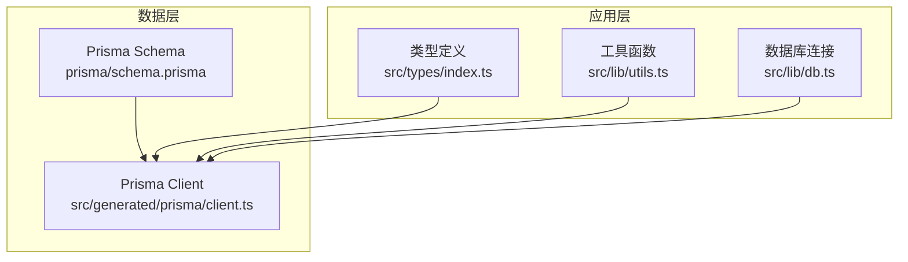
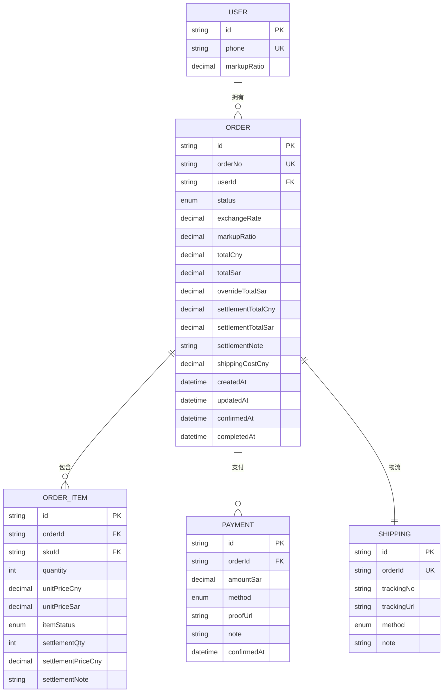
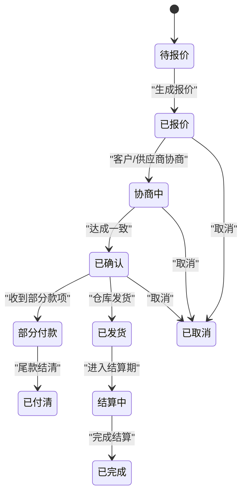
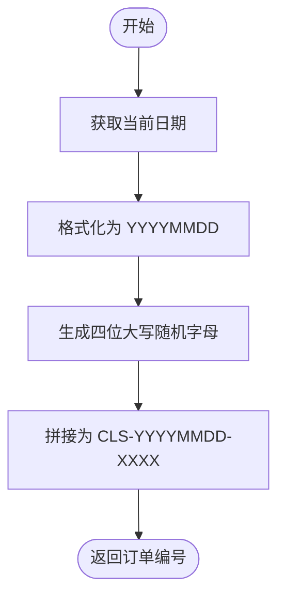
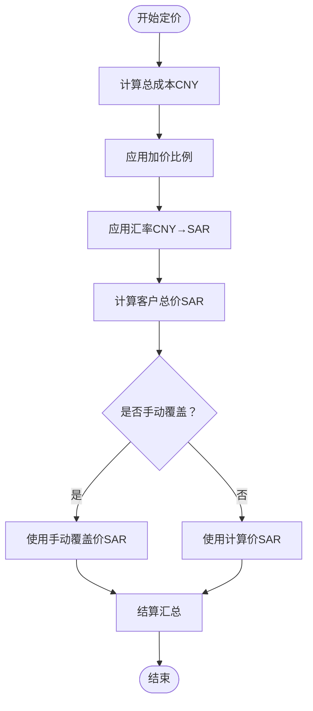
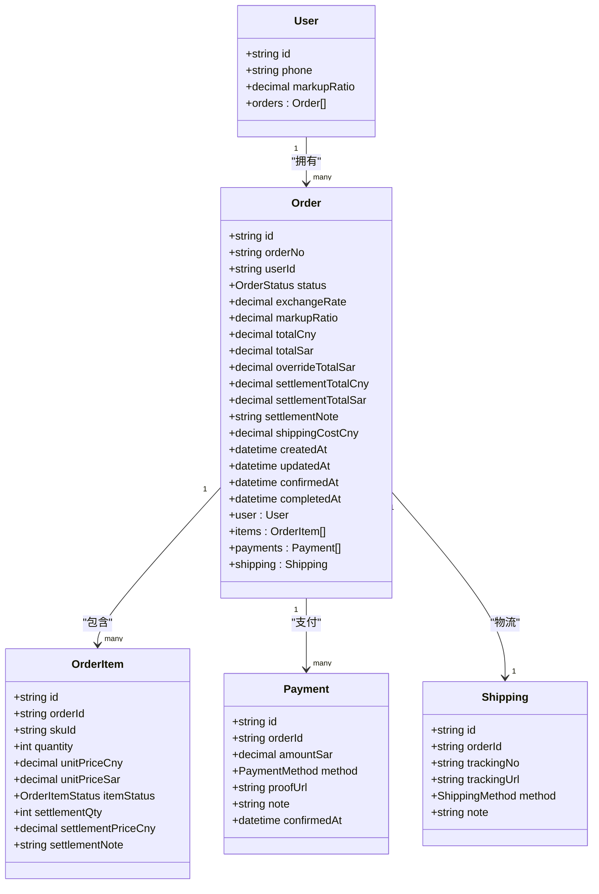
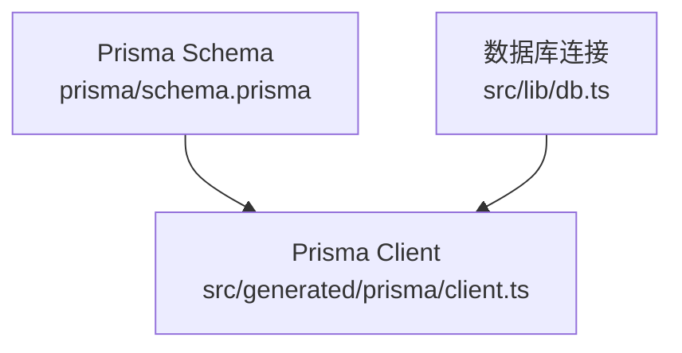

# 订单模型

<cite>
**本文引用的文件**
- [prisma/schema.prisma](file://prisma/schema.prisma)
- [src/lib/utils.ts](file://src/lib/utils.ts)
- [src/types/index.ts](file://src/types/index.ts)
- [src/lib/db.ts](file://src/lib/db.ts)
- [src/generated/prisma/client.ts](file://src/generated/prisma/client.ts)
</cite>

## 目录
1. [简介](#简介)
2. [项目结构](#项目结构)
3. [核心组件](#核心组件)
4. [架构概览](#架构概览)
5. [详细组件分析](#详细组件分析)
6. [依赖分析](#依赖分析)
7. [性能考虑](#性能考虑)
8. [故障排除指南](#故障排除指南)
9. [结论](#结论)
10. [附录](#附录)

## 简介
本文档系统性地阐述订单模型（Order）的设计与实现，涵盖字段语义、状态生命周期、定价与结算机制、物流运费处理、时间戳业务含义，以及关系映射与索引策略。目标是帮助开发者与运营人员准确理解并正确使用订单数据模型。

## 项目结构
订单模型位于 Prisma Schema 中，通过 Prisma Client 在运行时提供类型安全的数据库访问。相关文件组织如下：
- 数据模型定义：prisma/schema.prisma
- 类型与工具：src/types/index.ts、src/lib/utils.ts
- 数据库客户端：src/lib/db.ts、src/generated/prisma/client.ts

**图表来源**
- [prisma/schema.prisma:188-220](file://prisma/schema.prisma#L188-L220)
- [src/generated/prisma/client.ts:18-42](file://src/generated/prisma/client.ts#L18-L42)
- [src/lib/db.ts:1-18](file://src/lib/db.ts#L1-L18)

**章节来源**
- [prisma/schema.prisma:1-281](file://prisma/schema.prisma#L1-L281)
- [src/lib/db.ts:1-18](file://src/lib/db.ts#L1-L18)
- [src/generated/prisma/client.ts:1-45](file://src/generated/prisma/client.ts#L1-L45)

## 核心组件
本节聚焦订单模型的关键字段与业务含义，包括基础字段、状态枚举、定价与结算字段、物流运费字段、时间戳字段，以及关系映射与索引策略。

- 基础字段
  - 订单编号：唯一标识订单的编号，用于外部检索与对账
  - 用户关联：通过用户 ID 关联到用户表，支持按用户维度查询与统计
  - 订单状态：采用完整的状态枚举，覆盖从报价到完成的全生命周期

- 定价相关字段
  - 汇率：CNY → SAR 的汇率，用于成本与售价的汇率换算
  - 加价比例：本次订单使用的加价比例，可能与用户默认加价比例不同
  - 总成本（CNY）：订单内商品的成本总价
  - 客户总价（SAR）：面向客户的最终应付金额
  - 手动覆盖价（SAR）：允许管理员手动覆盖客户总价，便于特殊场景处理

- 结算字段
  - 结算总成本（CNY）：结算周期内的成本汇总
  - 结算总售价（SAR）：结算周期内的售价汇总
  - 结算备注：记录结算过程中的说明信息

- 物流运费字段
  - 运费（CNY）：订单产生的国内物流成本

- 时间戳字段
  - 确认时间：订单被确认的时间点
  - 完成时间：订单流程结束的时间点

- 关系映射
  - 用户：一对多关系，一个用户可拥有多个订单
  - 订单项：一对多关系，订单包含多个订单项
  - 支付记录：一对多关系，订单包含多笔支付
  - 物流信息：一对一关系，订单对应唯一的物流信息

- 索引策略
  - 用户索引：加速按用户维度的查询
  - 状态索引：加速按状态维度的筛选与报表统计

**章节来源**
- [prisma/schema.prisma:188-220](file://prisma/schema.prisma#L188-L220)
- [prisma/schema.prisma:49-60](file://prisma/schema.prisma#L49-L60)
- [prisma/schema.prisma:217-218](file://prisma/schema.prisma#L217-L218)

## 架构概览
下图展示了订单模型与其相关实体之间的关系，以及索引策略如何支撑查询性能。

**图表来源**
- [prisma/schema.prisma:89-106](file://prisma/schema.prisma#L89-L106)
- [prisma/schema.prisma:188-220](file://prisma/schema.prisma#L188-L220)
- [prisma/schema.prisma:222-247](file://prisma/schema.prisma#L222-L247)
- [prisma/schema.prisma:249-264](file://prisma/schema.prisma#L249-L264)
- [prisma/schema.prisma:266-280](file://prisma/schema.prisma#L266-L280)

## 详细组件分析

### 订单状态生命周期
订单状态枚举覆盖从待报价到完成的完整流程，适用于报价、协商、确认、支付、发货、结算与完成等阶段。状态流转通常遵循以下路径：
- 待报价 → 已报价 → 协商中 → 已确认
- 已确认 → 部分付款 → 已付清
- 已付清 → 已发货 → 结算中 → 已完成
- 任意阶段可触发取消（已取消）

**图表来源**
- [prisma/schema.prisma:49-60](file://prisma/schema.prisma#L49-L60)

**章节来源**
- [prisma/schema.prisma:49-60](file://prisma/schema.prisma#L49-L60)

### 订单编号生成
订单编号采用统一格式，便于人工识别与系统检索。生成逻辑包含日期与随机后缀，确保唯一性与可读性。

**图表来源**
- [src/lib/utils.ts:25-31](file://src/lib/utils.ts#L25-L31)

**章节来源**
- [src/lib/utils.ts:25-31](file://src/lib/utils.ts#L25-L31)

### 定价与结算字段
定价与结算字段共同构成订单的财务闭环，支持汇率换算、加价策略与手动覆盖，同时记录结算汇总与备注。

- 汇率（exchangeRate）：CNY → SAR 的汇率，用于成本与售价的汇率换算
- 加价比例（markupRatio）：本次订单使用的加价比例，可能与用户默认加价比例不同
- 总成本（totalCny）：订单内商品的成本总价
- 客户总价（totalSar）：面向客户的最终应付金额
- 手动覆盖价（overrideTotalSar）：允许管理员手动覆盖客户总价，便于特殊场景处理
- 结算总成本（settlementTotalCny）：结算周期内的成本汇总
- 结算总售价（settlementTotalSar）：结算周期内的售价汇总
- 结算备注（settlementNote）：记录结算过程中的说明信息

**图表来源**
- [prisma/schema.prisma:194-199](file://prisma/schema.prisma#L194-L199)
- [prisma/schema.prisma:200-203](file://prisma/schema.prisma#L200-L203)

**章节来源**
- [prisma/schema.prisma:194-199](file://prisma/schema.prisma#L194-L199)
- [prisma/schema.prisma:200-203](file://prisma/schema.prisma#L200-L203)

### 物流运费与时间戳
- 物流运费（shippingCostCny）：订单产生的国内物流成本，便于成本核算与利润计算
- 确认时间（confirmedAt）：订单被确认的时间点，常用于统计确认时效
- 完成时间（completedAt）：订单流程结束的时间点，常用于统计完成时效与SLA评估

**章节来源**
- [prisma/schema.prisma:204-210](file://prisma/schema.prisma#L204-L210)

### 关系映射与索引策略
- 关系映射
  - 用户：一对多关系，一个用户可拥有多个订单
  - 订单项：一对多关系，订单包含多个订单项
  - 支付记录：一对多关系，订单包含多笔支付
  - 物流信息：一对一关系，订单对应唯一的物流信息
- 索引策略
  - 用户索引：加速按用户维度的查询
  - 状态索引：加速按状态维度的筛选与报表统计

**图表来源**
- [prisma/schema.prisma:89-106](file://prisma/schema.prisma#L89-L106)
- [prisma/schema.prisma:188-220](file://prisma/schema.prisma#L188-L220)
- [prisma/schema.prisma:222-247](file://prisma/schema.prisma#L222-L247)
- [prisma/schema.prisma:249-264](file://prisma/schema.prisma#L249-L264)
- [prisma/schema.prisma:266-280](file://prisma/schema.prisma#L266-L280)

**章节来源**
- [prisma/schema.prisma:212-215](file://prisma/schema.prisma#L212-L215)
- [prisma/schema.prisma:217-218](file://prisma/schema.prisma#L217-L218)

## 依赖分析
订单模型的依赖关系主要体现在 Prisma Schema 的定义与 Prisma Client 的类型生成之间，同时应用层通过数据库连接模块与 Prisma Client 交互。

**图表来源**
- [prisma/schema.prisma:1-10](file://prisma/schema.prisma#L1-L10)
- [src/generated/prisma/client.ts:18-42](file://src/generated/prisma/client.ts#L18-L42)
- [src/lib/db.ts:1-18](file://src/lib/db.ts#L1-L18)

**章节来源**
- [prisma/schema.prisma:1-10](file://prisma/schema.prisma#L1-L10)
- [src/lib/db.ts:1-18](file://src/lib/db.ts#L1-L18)
- [src/generated/prisma/client.ts:18-42](file://src/generated/prisma/client.ts#L18-L42)

## 性能考虑
- 索引优化：用户索引与状态索引有助于提升按用户与状态的查询性能，建议在高频筛选场景中充分利用
- 字段精度：定价与结算字段采用高精度 Decimal 类型，避免浮点运算误差；注意在前端展示时进行格式化
- 关系查询：在批量查询订单列表时，合理使用包含关系（如包含订单项、支付记录）以减少 N+1 查询
- 时间戳统计：利用确认时间与完成时间进行时效分析，建议定期归档历史数据以控制表规模

## 故障排除指南
- 订单编号冲突：若出现重复订单编号，需检查生成逻辑与并发场景下的唯一性保障
- 状态异常：若订单状态跳转不符合预期，需核对业务流程与状态机规则
- 定价不一致：若客户总价与计算值不符，需检查汇率、加价比例与手动覆盖价的设置
- 结算遗漏：若结算汇总缺失，需检查结算字段的更新逻辑与结算流程

**章节来源**
- [src/lib/utils.ts:25-31](file://src/lib/utils.ts#L25-L31)
- [prisma/schema.prisma:194-203](file://prisma/schema.prisma#L194-L203)
- [prisma/schema.prisma:200-203](file://prisma/schema.prisma#L200-L203)

## 结论
订单模型通过清晰的状态枚举、完善的定价与结算字段、明确的关系映射与索引策略，构建了从报价到完成的完整业务闭环。结合 Prisma 的类型安全能力与应用层的工具函数，能够有效支撑订单管理的核心业务需求。

## 附录
- 订单筛选参数：支持按状态、用户与关键字（订单号）进行筛选，便于后台管理与报表统计
- 数据库适配：使用 PrismaPg 适配器连接 PostgreSQL，确保生产环境的稳定性与性能

**章节来源**
- [src/types/index.ts:34-39](file://src/types/index.ts#L34-L39)
- [src/lib/db.ts:1-18](file://src/lib/db.ts#L1-L18)