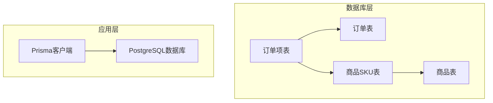
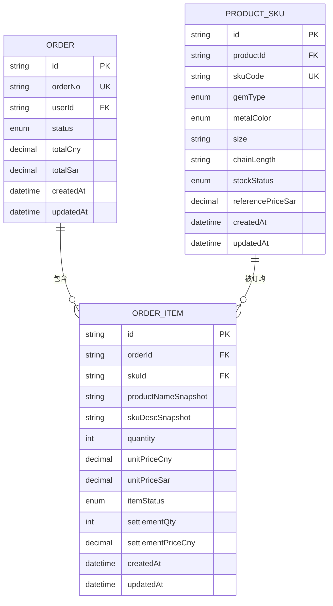
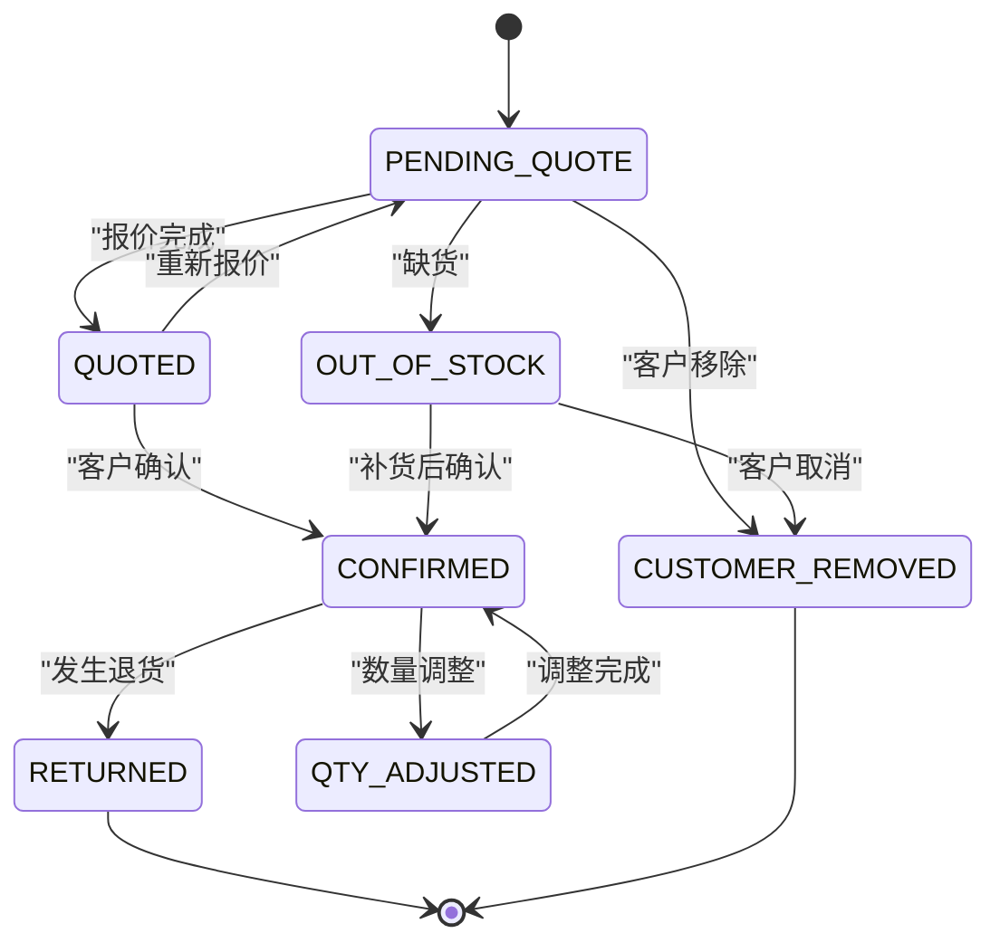
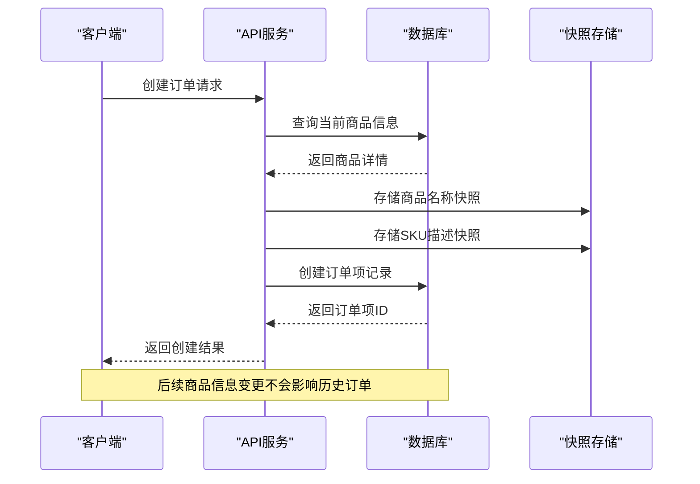
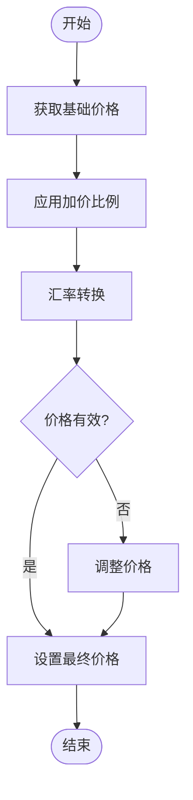
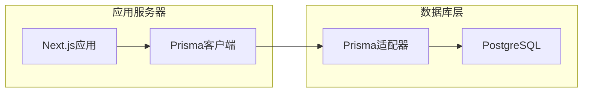

# 订单项模型

<cite>
**本文档引用的文件**
- [prisma/schema.prisma](file://prisma/schema.prisma)
- [src/lib/db.ts](file://src/lib/db.ts)
- [src/lib/validations/order.ts](file://src/lib/validations/order.ts)
- [src/types/index.ts](file://src/types/index.ts)
</cite>

## 目录
1. [简介](#简介)
2. [项目结构](#项目结构)
3. [核心组件](#核心组件)
4. [架构概览](#架构概览)
5. [详细组件分析](#详细组件分析)
6. [依赖分析](#依赖分析)
7. [性能考虑](#性能考虑)
8. [故障排除指南](#故障排除指南)
9. [结论](#结论)

## 简介

订单项模型(OrderItem)是Celestia珠宝销售系统中的核心数据模型之一，用于记录订单中每个具体商品项的详细信息。该模型不仅包含基本的商品数量和价格信息，还包含了完整的快照机制，确保即使商品信息发生变化，历史订单仍能准确反映下单时的状态。

## 项目结构

基于Prisma Schema的数据库模型设计，系统采用分层架构：

**图表来源**
- [prisma/schema.prisma:222-247](file://prisma/schema.prisma#L222-L247)
- [prisma/schema.prisma:188-220](file://prisma/schema.prisma#L188-L220)
- [prisma/schema.prisma:151-170](file://prisma/schema.prisma#L151-L170)

**章节来源**
- [prisma/schema.prisma:1-281](file://prisma/schema.prisma#L1-L281)

## 核心组件

### 订单项模型字段详解

#### 外键关联字段

**orderId (订单关联)**
- 类型：String
- 约束：@map("order_id")
- 关系：与Order模型建立一对多关系
- 删除策略：Cascade（级联删除）

**skuId (SKU关联)**
- 类型：String
- 约束：@map("sku_id")
- 关系：与ProductSku模型建立多对一关系
- 删除策略：默认（根据Prisma配置）

#### 快照字段

**productNameSnapshot (商品名称快照)**
- 类型：String
- 约束：@map("product_name_snapshot")
- 作用：记录下单时的商品名称，确保历史准确性
- 设计原理：防止商品名称变更影响历史订单的可追溯性

**skuDescSnapshot (SKU描述快照)**
- 类型：String
- 约束：@map("sku_desc_snapshot")
- 作用：记录下单时的SKU完整描述
- 包含信息：宝石类型、金属颜色、尺寸、链长等规格信息

#### 价格相关字段

**quantity (购买数量)**
- 类型：Int
- 约束：无特殊约束
- 业务意义：单个订单项的购买数量

**unitPriceCny (成本单价)**
- 类型：Decimal? (10,2)
- 约束：@map("unit_price_cny") @db.Decimal(10, 2)
- 货币：人民币(CNY)
- 用途：内部成本核算和财务统计

**unitPriceSar (客户单价)**
- 类型：Decimal? (10, 2)
- 约束：@map("unit_price_sar") @db.Decimal(10, 2)
- 货币：沙特里亚尔(SAR)
- 用途：客户报价和销售记录

#### 状态管理字段

**itemStatus (订单项状态)**
- 类型：OrderItemStatus (枚举)
- 默认值：PENDING_QUOTE
- 可选状态：
  - PENDING_QUOTE：待报价
  - QUOTED：已报价
  - OUT_OF_STOCK：缺货
  - CUSTOMER_REMOVED：客户移除
  - CONFIRMED：已确认
  - RETURNED：退货
  - QTY_ADJUSTED：数量调整

#### 结算相关字段

**settlementQty (结算数量)**
- 类型：Int?
- 约束：@map("settlement_qty")
- 业务意义：实际结算的数量（可能与购买数量不同）

**settlementPriceCny (结算单价)**
- 类型：Decimal? (10, 2)
- 约束：@map("settlement_price_cny") @db.Decimal(10, 2)
- 货币：人民币(CNY)
- 业务意义：最终结算的成本单价

**settlementNote (结算备注)**
- 类型：String?
- 约束：@map("settlement_note")

#### 时间戳字段

**createdAt (创建时间)**
- 类型：DateTime
- 约束：@default(now()) @map("created_at")
- 业务意义：订单项创建的时间戳

**updatedAt (更新时间)**
- 类型：DateTime
- 约束：@updatedAt @map("updated_at")
- 业务意义：订单项最后修改时间

**章节来源**
- [prisma/schema.prisma:222-247](file://prisma/schema.prisma#L222-L247)

## 架构概览

### 数据模型关系图

**图表来源**
- [prisma/schema.prisma:188-247](file://prisma/schema.prisma#L188-L247)

### 关系映射说明

**order关系映射**
- 关系类型：@relation(fields: [orderId], references: [id], onDelete: Cascade)
- 作用：建立与Order模型的一对多关系
- 删除行为：当订单被删除时，所有相关订单项也会被级联删除

**sku关系映射**
- 关系类型：@relation(fields: [skuId], references: [id])
- 作用：建立与ProductSku模型的多对一关系
- 业务意义：标识具体的商品SKU

### 索引策略

**@@index([orderId])**
- 目的：优化按订单查询订单项的性能
- 使用场景：获取特定订单的所有商品项

**@@index([skuId])**
- 目的：优化按SKU查询订单项的性能
- 使用场景：统计某个SKU的销售情况

**章节来源**
- [prisma/schema.prisma:241-246](file://prisma/schema.prisma#L241-L246)

## 详细组件分析

### 订单项状态流程

**图表来源**
- [prisma/schema.prisma:62-70](file://prisma/schema.prisma#L62-L70)

### 快照机制工作流程

**图表来源**
- [prisma/schema.prisma:227-228](file://prisma/schema.prisma#L227-L228)

### 价格计算流程

**图表来源**
- [prisma/schema.prisma:230-231](file://prisma/schema.prisma#L230-L231)

**章节来源**
- [prisma/schema.prisma:222-247](file://prisma/schema.prisma#L222-L247)

## 依赖分析

### 数据库连接配置

系统使用Prisma作为ORM框架，通过PostgreSQL适配器进行数据库连接：

**图表来源**
- [src/lib/db.ts:1-18](file://src/lib/db.ts#L1-L18)

### 依赖关系矩阵

| 组件 | 直接依赖 | 间接依赖 | 用途 |
|------|----------|----------|------|
| OrderItem | Prisma Client | PostgreSQL | 订单项数据持久化 |
| Order | OrderItem | User | 订单聚合管理 |
| ProductSku | OrderItem | Product | 商品规格管理 |
| Prisma Client | Prisma Adapter | PostgreSQL | 数据库访问层 |

**章节来源**
- [src/lib/db.ts:1-18](file://src/lib/db.ts#L1-L18)
- [prisma/schema.prisma:1-281](file://prisma/schema.prisma#L1-L281)

## 性能考虑

### 索引优化策略

1. **复合索引设计**
   - orderId索引：优化订单查询性能
   - skuId索引：优化SKU统计性能

2. **查询优化建议**
   - 使用关系查询时添加适当的where条件
   - 避免N+1查询问题
   - 合理使用select投影减少数据传输

3. **缓存策略**
   - 对频繁访问的订单项数据实施缓存
   - 利用数据库连接池提高并发性能

### 数据类型选择

- **Decimal(10,2)**：精确的价格存储，避免浮点数精度问题
- **DateTime**：标准时间戳存储，支持时区处理
- **String**：UUID主键，保证全局唯一性

## 故障排除指南

### 常见问题及解决方案

**订单项创建失败**
- 检查orderId和skuId的有效性
- 验证quantity的正整数约束
- 确认相关外键记录存在

**价格计算异常**
- 检查汇率和加价比例的有效性
- 验证Decimal类型的精度限制
- 确认货币转换逻辑正确性

**快照数据不一致**
- 验证快照字段的同步更新
- 检查数据库事务的原子性
- 确认并发场景下的数据一致性

**索引性能问题**
- 分析慢查询日志
- 检查索引使用情况
- 考虑添加合适的复合索引

**章节来源**
- [src/lib/validations/order.ts:1-23](file://src/lib/validations/order.ts#L1-L23)

## 结论

订单项模型(OrderItem)通过精心设计的字段结构和关系映射，为Celestia珠宝销售系统提供了完整的订单管理能力。其核心特点包括：

1. **完整性保障**：通过快照机制确保历史数据的准确性
2. **灵活性**：支持多种状态管理和结算流程
3. **性能优化**：合理的索引设计和数据类型选择
4. **扩展性**：清晰的关系映射便于功能扩展

该模型的设计充分考虑了珠宝行业的特殊需求，包括精确的价格计算、详细的规格描述和完整的业务流程跟踪，为系统的稳定运行奠定了坚实的数据基础。