# 枚举类型与数据类型

<cite>
**本文档引用的文件**
- [schema.prisma](file://prisma/schema.prisma)
- [index.ts](file://src/types/index.ts)
- [constants.ts](file://src/lib/constants.ts)
- [decimal.ts](file://src/lib/decimal.ts)
- [utils.ts](file://src/lib/utils.ts)
- [client.ts](file://src/generated/prisma/client.ts)
- [package.json](file://package.json)
</cite>

## 目录
1. [简介](#简介)
2. [项目结构](#项目结构)
3. [核心组件](#核心组件)
4. [架构概览](#架构概览)
5. [详细组件分析](#详细组件分析)
6. [依赖分析](#依赖分析)
7. [性能考虑](#性能考虑)
8. [故障排除指南](#故障排除指南)
9. [结论](#结论)

## 简介

本文档深入分析了Celestia项目的枚举类型与数据类型设计，涵盖了完整的业务枚举体系、数值精度控制、国际化数据结构以及数据库映射策略。项目采用Prisma ORM进行数据建模，实现了严格的类型安全和业务逻辑约束。

## 项目结构

项目采用模块化的数据类型设计，主要分布在以下位置：

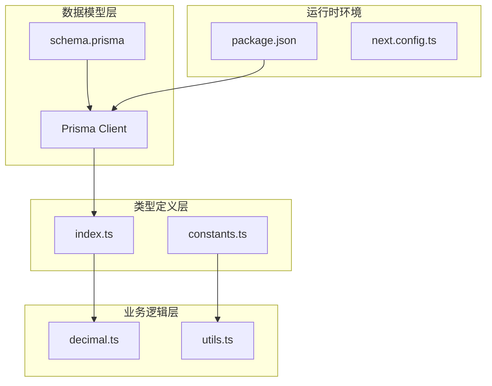

**图表来源**
- [schema.prisma:1-281](file://prisma/schema.prisma#L1-L281)
- [index.ts:1-60](file://src/types/index.ts#L1-L60)
- [decimal.ts:1-96](file://src/lib/decimal.ts#L1-L96)

**章节来源**
- [schema.prisma:1-281](file://prisma/schema.prisma#L1-L281)
- [client.ts:1-45](file://src/generated/prisma/client.ts#L1-L45)

## 核心组件

### 枚举类型体系

项目建立了完整的业务枚举体系，涵盖用户管理、商品管理、订单处理等多个业务领域：

#### 用户相关枚举
- **UserRole**: 用户角色枚举，包含ADMIN（管理员）和CUSTOMER（客户）两种角色
- **UserStatus**: 用户状态枚举，包含PENDING（待审核）和ACTIVE（已激活）两种状态

#### 商品相关枚举
- **ProductStatus**: 商品状态枚举，包含ACTIVE（上架）和INACTIVE（下架）两种状态
- **StockStatus**: 库存状态枚举，包含IN_STOCK（有货）、OUT_OF_STOCK（缺货）和PRE_ORDER（预订）

#### 宝石与金属枚举
- **GemType**: 宝石类型枚举，包含MOISSANITE（莫桑石）和ZIRCON（锆石）
- **MetalColor**: 金属颜色枚举，包含SILVER（银色）、GOLD（金色）、ROSE_GOLD（玫瑰金）和其他颜色

#### 订单相关枚举
- **OrderStatus**: 订单状态枚举，包含10种状态：PENDING_QUOTE（待报价）、QUOTED（已报价）、NEGOTIATING（协商中）、CONFIRMED（已确认）、PARTIALLY_PAID（部分付款）、FULLY_PAID（已付清）、SHIPPED（已发货）、SETTLING（结算中）、COMPLETED（已完成）、CANCELLED（已取消）
- **OrderItemStatus**: 订单项状态枚举，包含7种状态：PENDING_QUOTE（待报价）、QUOTED（已报价）、OUT_OF_STOCK（缺货）、CUSTOMER_REMOVED（客户移除）、CONFIRMED（已确认）、RETURNED（退货）、QTY_ADJUSTED（数量调整）

#### 支付与物流枚举
- **PaymentMethod**: 支付方式枚举，包含BANK_TRANSFER（银行转账）、WESTERN_UNION（Western Union）、CASH（现金）和其他支付方式
- **ShippingMethod**: 物流方式枚举，包含SEA_FREIGHT（海运）、AIR_FREIGHT（空运）和EXPRESS（快递）

**章节来源**
- [schema.prisma:16-83](file://prisma/schema.prisma#L16-L83)
- [constants.ts:1-46](file://src/lib/constants.ts#L1-L46)

### 数据类型设计

#### 数值精度控制

项目采用Decimal类型进行精确的数值计算，通过不同的精度配置满足不同业务场景的需求：

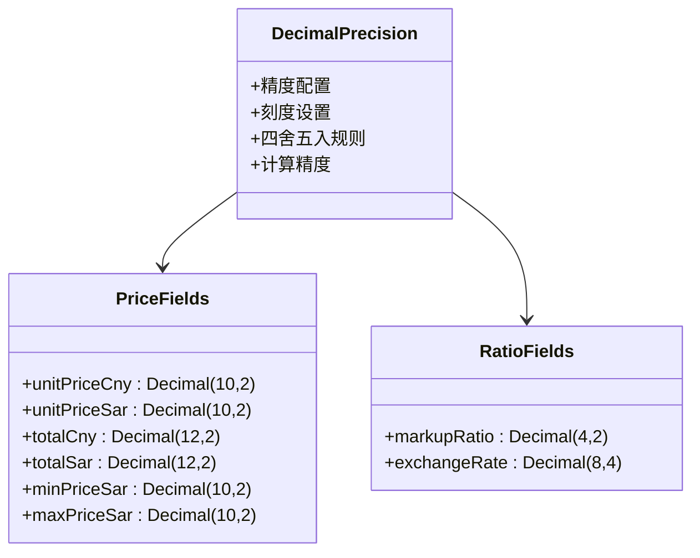

**图表来源**
- [schema.prisma:98](file://prisma/schema.prisma#L98)
- [schema.prisma:136](file://prisma/schema.prisma#L136)
- [schema.prisma:195](file://prisma/schema.prisma#L195)

##### 精度配置详解

| 字段类型 | 精度配置 | 刻度设置 | 用途说明 |
|---------|---------|---------|----------|
| 价格字段 | (10,2) | 2位小数 | 商品单价、成本价等 |
| 总价字段 | (12,2) | 2位小数 | 订单总价、结算总价等 |
| 比例字段 | (4,2) | 2位小数 | 加价比例、折扣率等 |
| 汇率字段 | (8,4) | 4位小数 | 外汇汇率换算 |
| 最小/最大价格 | (10,2) | 2位小数 | SPU价格区间范围 |

**章节来源**
- [schema.prisma:98](file://prisma/schema.prisma#L98)
- [schema.prisma:136](file://prisma/schema.prisma#L136)
- [schema.prisma:195](file://prisma/schema.prisma#L195)

#### 国际化数据类型

项目实现了完整的多语言支持，采用标准的国际化字段设计：

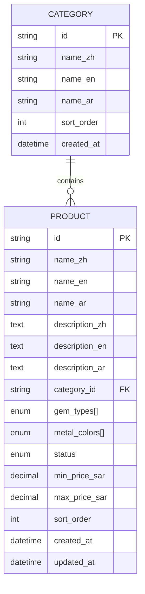

**图表来源**
- [schema.prisma:109](file://prisma/schema.prisma#L109)
- [schema.prisma:122](file://prisma/schema.prisma#L122)

##### 国际化字段设计原则

- **语言代码标准**: 使用ISO 639-1标准语言代码（en、ar、zh）
- **字段命名规范**: 采用`name_{lang}`和`description_{lang}`的统一命名模式
- **可选字段设计**: 所有国际化字段均设置为可选，支持部分语言内容
- **文本类型选择**: 使用`Text`类型存储长文本描述，`String`类型存储短标题

**章节来源**
- [schema.prisma:111](file://prisma/schema.prisma#L111)
- [schema.prisma:127](file://prisma/schema.prisma#L127)

### 类型转换与验证规则

#### 数值转换流程

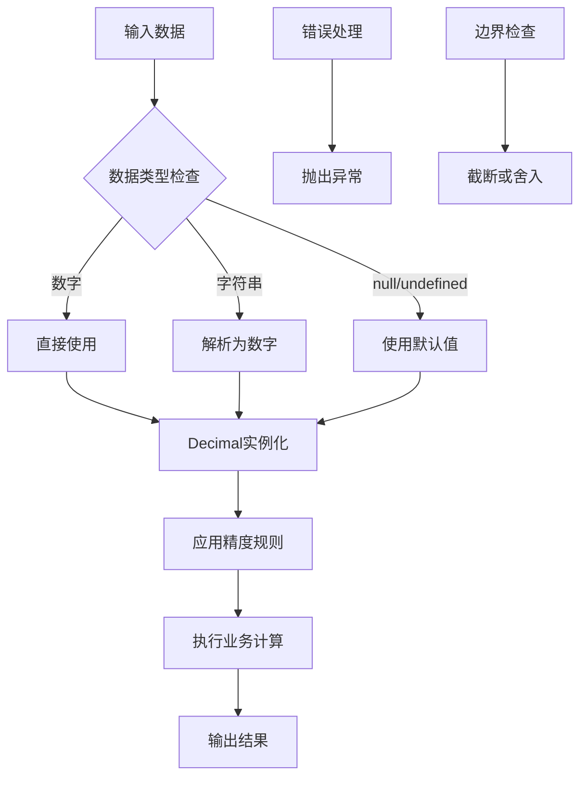

**图表来源**
- [decimal.ts:10](file://src/lib/decimal.ts#L10)
- [decimal.ts:73](file://src/lib/decimal.ts#L73)

#### 验证规则实现

- **Decimal.js配置**: 设置精度为20位，四舍五入模式为ROUND_HALF_UP
- **安全运算**: 所有计算操作都通过Decimal实例进行，避免浮点数精度问题
- **格式化输出**: 统一使用toDecimalPlaces方法确保输出精度一致

**章节来源**
- [decimal.ts:4](file://src/lib/decimal.ts#L4)
- [decimal.ts:10](file://src/lib/decimal.ts#L10)

## 架构概览

### 数据流架构

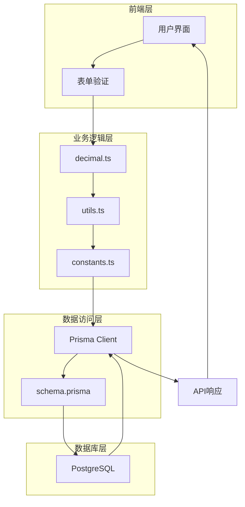

**图表来源**
- [client.ts:18](file://src/generated/prisma/client.ts#L18)
- [schema.prisma:4](file://prisma/schema.prisma#L4)

### 枚举类型映射关系

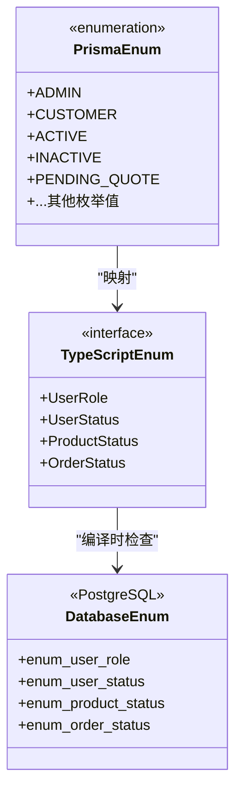

**图表来源**
- [schema.prisma:16](file://prisma/schema.prisma#L16)
- [index.ts:42](file://src/types/index.ts#L42)

## 详细组件分析

### 用户管理系统数据类型

#### 用户角色与状态设计

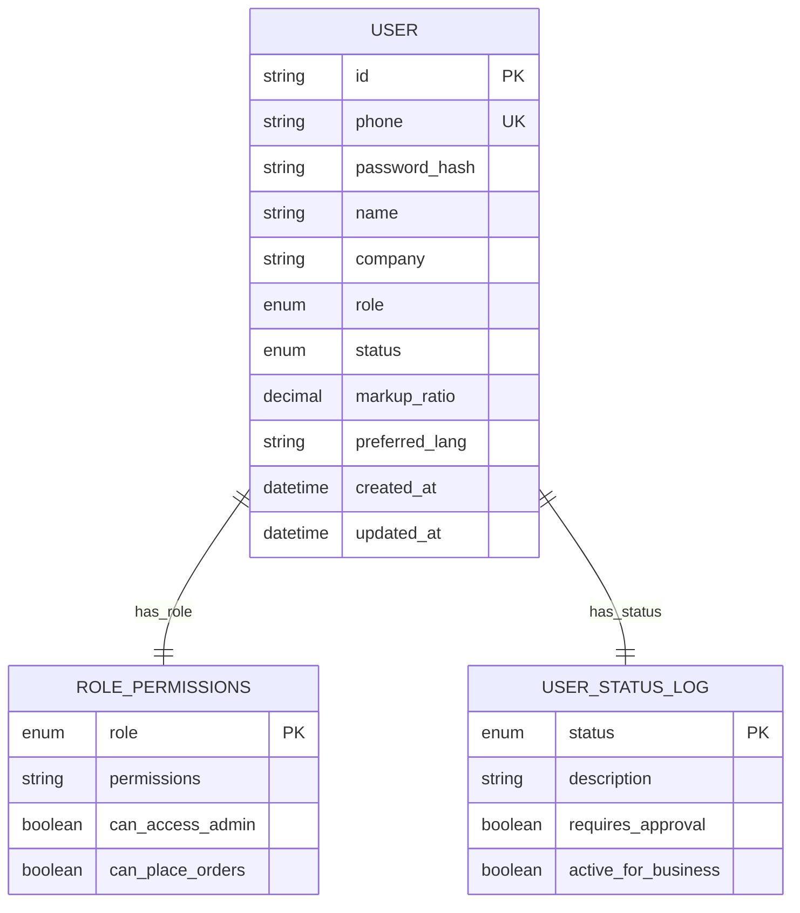

**图表来源**
- [schema.prisma:90](file://prisma/schema.prisma#L90)
- [schema.prisma:16](file://prisma/schema.prisma#L16)

##### 角色权限矩阵

| 用户角色 | 管理员权限 | 客户权限 | 状态要求 |
|---------|-----------|---------|----------|
| ADMIN | ✓ 完全访问 | ✗ 无 | ACTIVE |
| CUSTOMER | ✗ 无 | ✓ 有限访问 | ACTIVE |

**章节来源**
- [schema.prisma:96](file://prisma/schema.prisma#L96)
- [schema.prisma:97](file://prisma/schema.prisma#L97)

### 商品管理系统数据类型

#### 商品状态流转

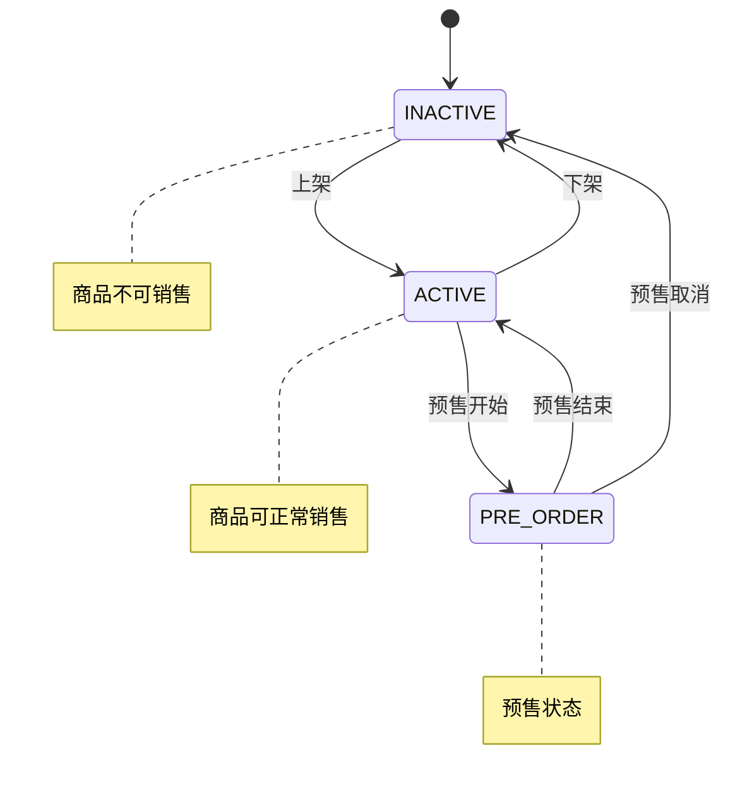

**图表来源**
- [schema.prisma:26](file://prisma/schema.prisma#L26)
- [schema.prisma:31](file://prisma/schema.prisma#L31)

#### 库存管理策略

| 库存状态 | 业务含义 | 系统行为 | 客户可见性 |
|---------|---------|---------|-----------|
| IN_STOCK | 有货 | 正常销售 | 显示库存充足 |
| OUT_OF_STOCK | 缺货 | 禁止购买 | 显示缺货信息 |
| PRE_ORDER | 预订 | 预定功能 | 显示预订选项 |

**章节来源**
- [schema.prisma:135](file://prisma/schema.prisma#L135)
- [schema.prisma:160](file://prisma/schema.prisma#L160)

### 订单管理系统数据类型

#### 订单状态机

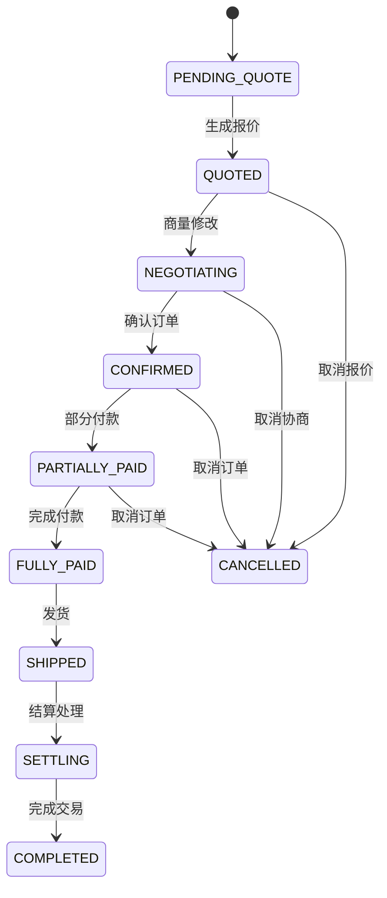

**图表来源**
- [schema.prisma:49](file://prisma/schema.prisma#L49)
- [constants.ts:2](file://src/lib/constants.ts#L2)

#### 订单项状态管理

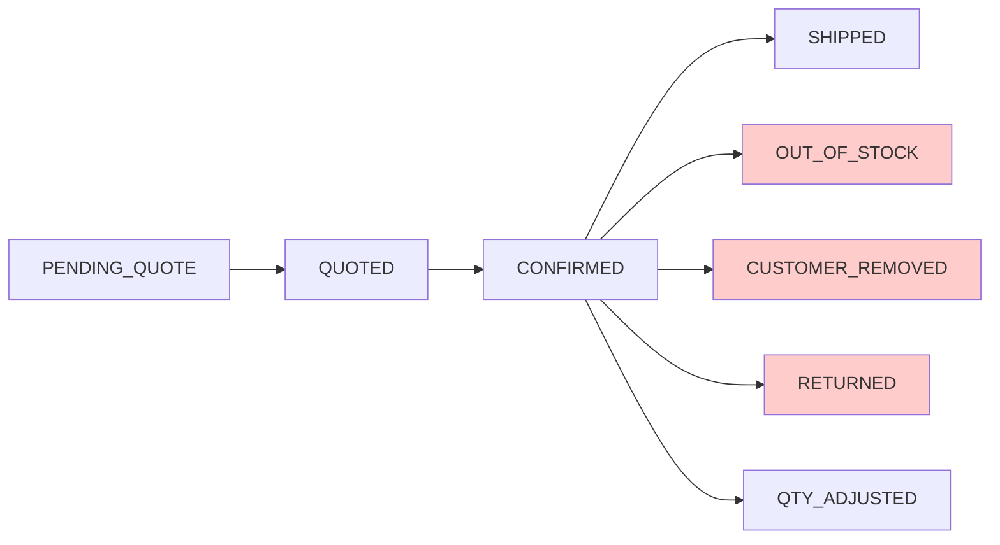

**图表来源**
- [schema.prisma:62](file://prisma/schema.prisma#L62)
- [constants.ts:15](file://src/lib/constants.ts#L15)

**章节来源**
- [schema.prisma:189](file://prisma/schema.prisma#L189)
- [schema.prisma:223](file://prisma/schema.prisma#L223)

## 依赖分析

### 外部依赖关系

```mermaid
graph TB
subgraph "核心依赖"
A[Prisma Client]
B[Decimal.js]
C[next-intl]
end
subgraph "业务依赖"
D[@prisma/adapter-pg]
E[pg]
F[zod]
end
subgraph "工具依赖"
G[react-hook-form]
H[@hookform/resolvers]
I[clsx]
end
A --> D
A --> E
B --> A
C --> A
F --> A
G --> A
H --> G
I --> G
```

**图表来源**
- [package.json:11](file://package.json#L11)
- [client.ts:18](file://src/generated/prisma/client.ts#L18)

### 数据类型依赖链

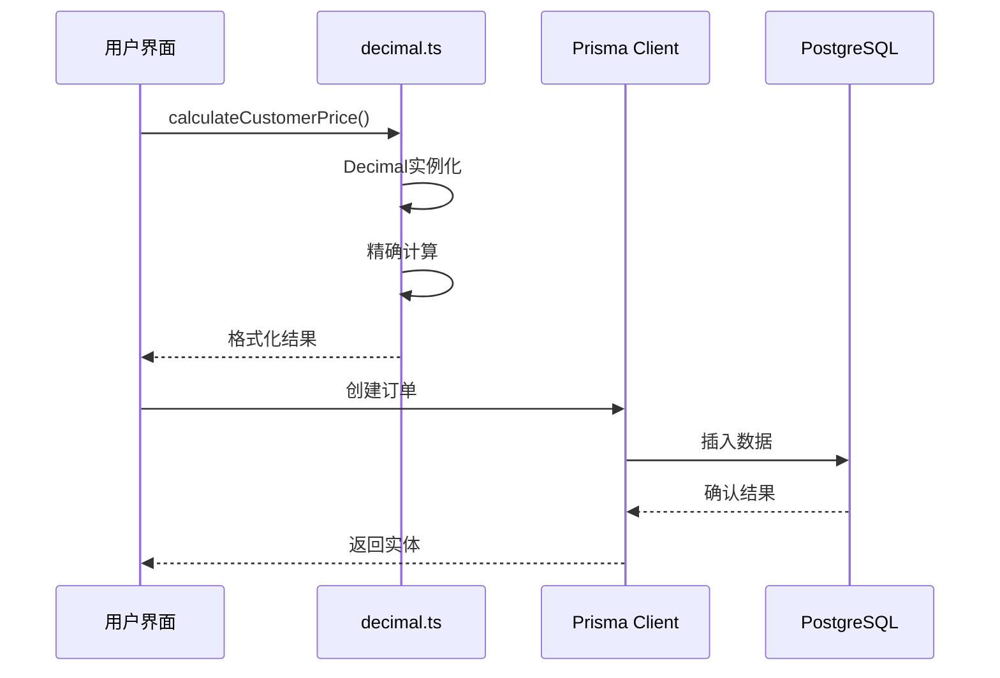

**图表来源**
- [decimal.ts:10](file://src/lib/decimal.ts#L10)
- [client.ts:40](file://src/generated/prisma/client.ts#L40)

**章节来源**
- [package.json:11](file://package.json#L11)
- [client.ts:18](file://src/generated/prisma/client.ts#L18)

## 性能考虑

### 数值计算优化

1. **Decimal.js配置优化**
   - 精度设置为20位，满足金融级计算需求
   - 四舍五入模式统一，确保计算一致性
   - 避免JavaScript浮点数精度问题

2. **数据库索引策略**
   - 在常用查询字段上建立索引
   - 合理使用复合索引提升查询性能
   - 定期分析查询计划优化索引

3. **内存使用优化**
   - Decimal实例复用策略
   - 大数据集分页处理
   - 适当的缓存策略

### 国际化性能优化

- **字段选择优化**: 查询时只选择需要的语言字段
- **缓存策略**: 常用枚举值和配置信息缓存
- **懒加载机制**: 按需加载国际化资源

## 故障排除指南

### 常见问题诊断

#### 数值计算错误

**问题症状**: 计算结果出现精度偏差
**解决方案**: 
1. 检查Decimal.js配置是否正确
2. 确认所有数值都通过decimal.ts中的函数处理
3. 验证数据库精度配置是否匹配

#### 枚举值不匹配

**问题症状**: 运行时出现枚举值错误
**解决方案**:
1. 确认Prisma schema中的枚举定义完整
2. 检查TypeScript类型定义是否同步更新
3. 验证数据库迁移是否成功执行

#### 国际化显示问题

**问题症状**: 多语言内容显示异常
**解决方案**:
1. 检查supportedLocales配置
2. 验证RTL语言支持设置
3. 确认国际化资源文件完整性

**章节来源**
- [decimal.ts:4](file://src/lib/decimal.ts#L4)
- [constants.ts:40](file://src/lib/constants.ts#L40)

## 结论

Celestia项目的枚举类型与数据类型设计体现了高度的专业性和严谨性。通过合理的枚举体系划分、精确的数值精度控制、完善的国际化支持和严格的类型安全保证，为电商系统的稳定运行奠定了坚实基础。

### 设计亮点

1. **完整的业务覆盖**: 从用户管理到订单处理的全流程枚举设计
2. **精确的数值控制**: 通过Decimal.js实现金融级精度计算
3. **灵活的国际化支持**: 标准化的多语言字段设计
4. **强类型安全保障**: Prisma与TypeScript的深度集成

### 最佳实践建议

1. **持续演进**: 随着业务发展定期评估和优化枚举体系
2. **性能监控**: 建立数据类型使用的性能监控机制
3. **文档维护**: 保持数据类型文档与代码同步更新
4. **测试覆盖**: 建立全面的数据类型测试用例