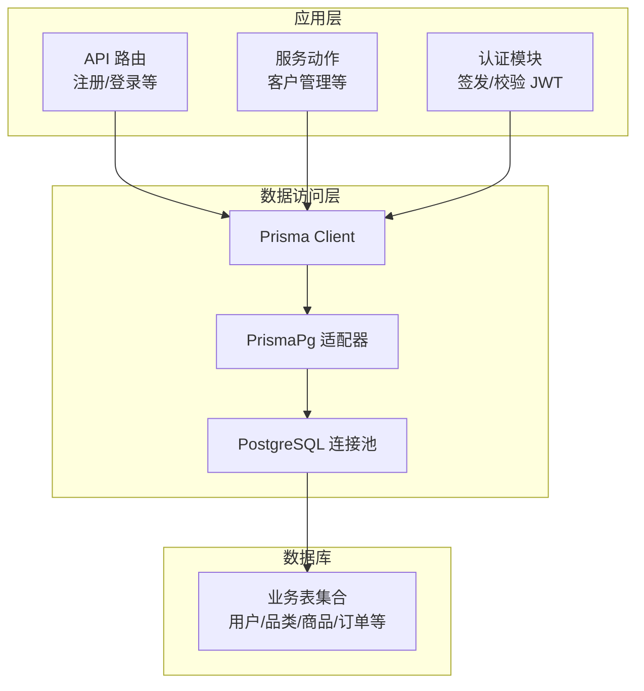
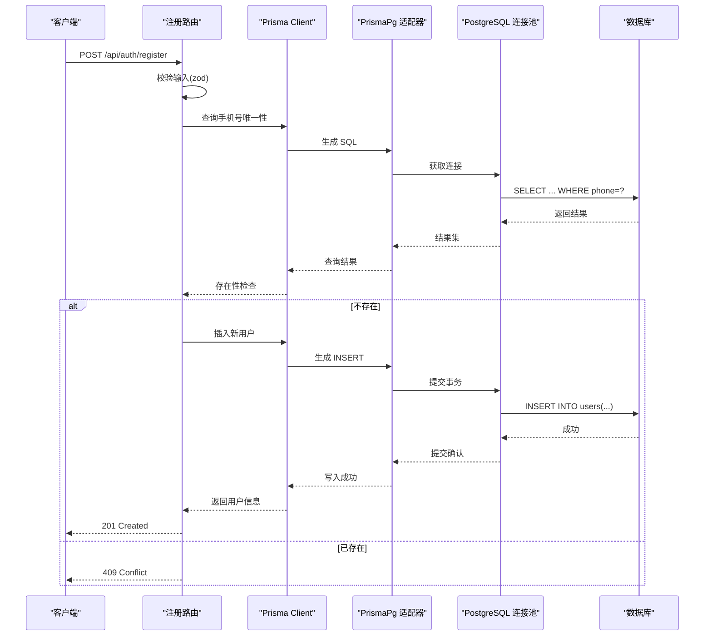
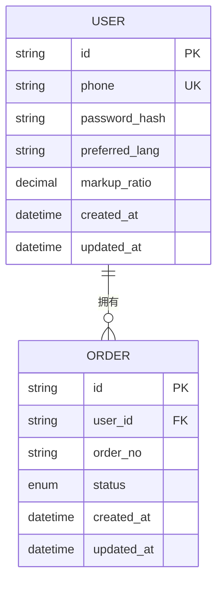
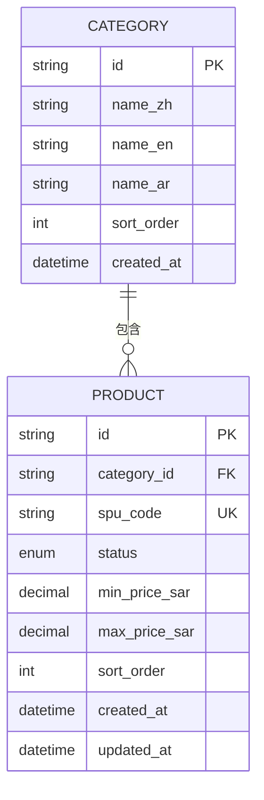
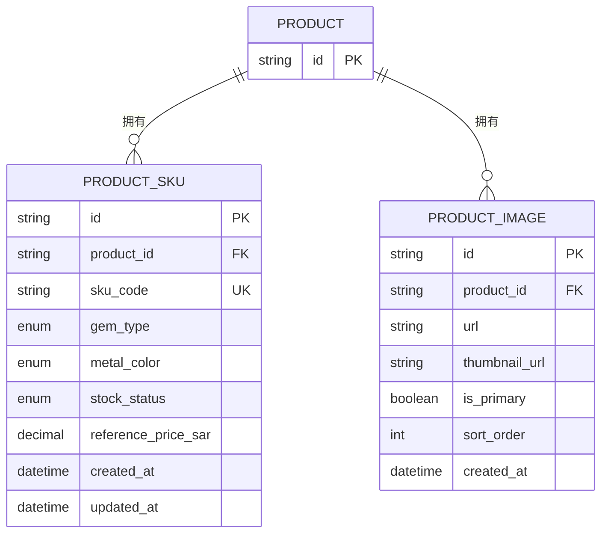
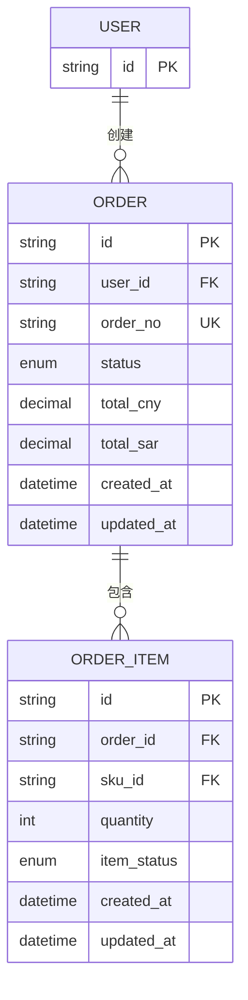
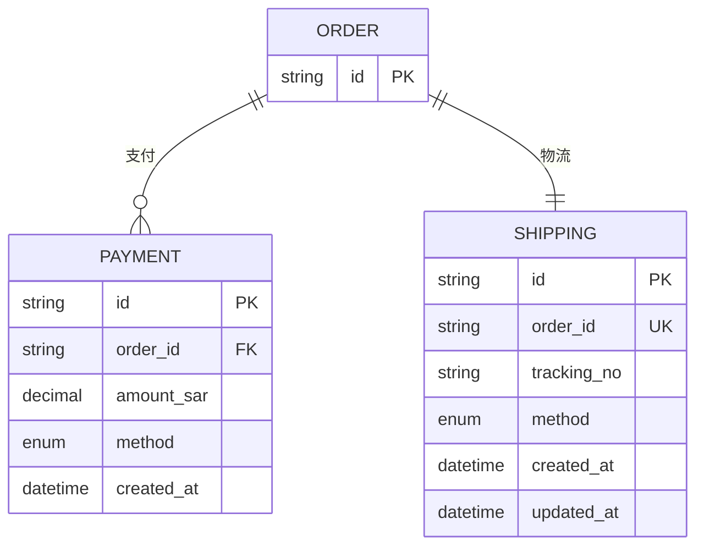
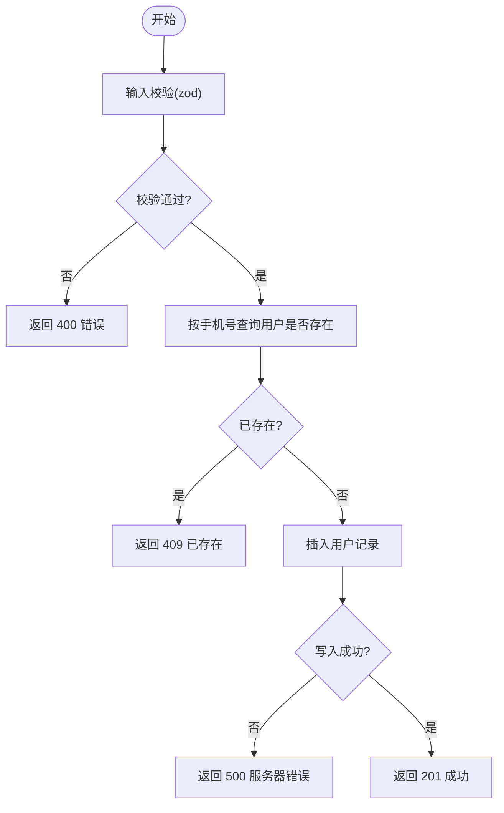
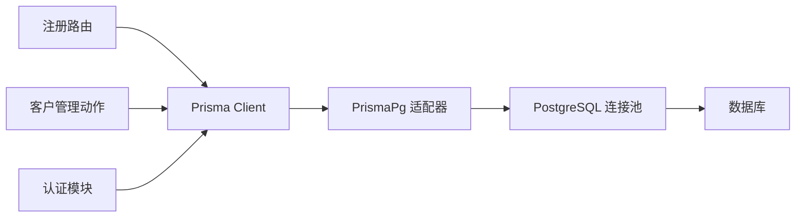

# 约束与索引设计

<cite>
**本文引用的文件**
- [schema.prisma](file://prisma/schema.prisma)
- [db.ts](file://src/lib/db.ts)
- [prisma.config.ts](file://prisma.config.ts)
- [route.ts](file://src/app/api/auth/register/route.ts)
- [customer.ts](file://src/lib/actions/customer.ts)
- [auth.ts](file://src/lib/auth.ts)
- [auth.ts](file://src/lib/validations/auth.ts)
</cite>

## 目录
1. [简介](#简介)
2. [项目结构](#项目结构)
3. [核心组件](#核心组件)
4. [架构总览](#架构总览)
5. [详细组件分析](#详细组件分析)
6. [依赖分析](#依赖分析)
7. [性能考虑](#性能考虑)
8. [故障排除指南](#故障排除指南)
9. [结论](#结论)
10. [附录](#附录)

## 简介
本文件系统化梳理 Celestia 项目的数据库约束与索引设计，重点覆盖以下方面：
- 主键约束：统一采用字符串型 ID 并使用自动生成器，确保全局唯一性与可追踪性
- 唯一性约束：手机号、订单号、SKU 编码等关键业务字段的唯一性保障
- 外键约束：基于关系字段与 onDelete 行为的级联删除策略
- 索引策略：单列索引、复合索引与唯一索引的使用场景与性能考量
- @@index 指令：在 Prisma Schema 中的声明方式与对查询性能的影响
- @@map 指令：表名与字段名映射，提升数据库命名规范与兼容性
- 约束冲突处理与错误处理策略：结合应用层校验与 Prisma 约束冲突的反馈

## 项目结构
本项目采用 Prisma 作为 ORM，数据库连接通过适配器与 PostgreSQL 连接池建立，应用层通过 Prisma Client 发起查询与写入。

图表来源
- [db.ts:12-15](file://src/lib/db.ts#L12-L15)
- [prisma.config.ts:6-14](file://prisma.config.ts#L6-L14)

章节来源
- [db.ts:1-18](file://src/lib/db.ts#L1-L18)
- [prisma.config.ts:1-15](file://prisma.config.ts#L1-L15)

## 核心组件
- 数据模型与约束：在 Prisma Schema 中通过字段修饰符与模型修饰符定义主键、唯一性、枚举与关系
- 索引声明：通过 @@index 在模型级别声明索引，覆盖常用查询路径
- 名称映射：通过 @@map 与 @map 将 Prisma 模型/字段映射到数据库中的实际名称
- 应用层约束与错误处理：在 API 层进行输入校验与重复性检查，并捕获数据库约束冲突

章节来源
- [schema.prisma:89-280](file://prisma/schema.prisma#L89-L280)
- [route.ts:8-85](file://src/app/api/auth/register/route.ts#L8-L85)
- [customer.ts:24-126](file://src/lib/actions/customer.ts#L24-L126)

## 架构总览
下图展示应用层调用 Prisma Client，经由适配器与连接池访问数据库，同时受 Prisma Schema 中的约束与索引规则约束。

图表来源
- [route.ts:8-85](file://src/app/api/auth/register/route.ts#L8-L85)
- [db.ts:12-15](file://src/lib/db.ts#L12-L15)

## 详细组件分析

### 用户(User)模型
- 主键：字符串型 ID，自动生成
- 唯一性：手机号唯一
- 字段映射：密码哈希、偏好语言、时间戳等字段通过 @map 映射到数据库列名
- 关系：一对多关联订单

图表来源
- [schema.prisma:90-106](file://prisma/schema.prisma#L90-L106)
- [schema.prisma:189-220](file://prisma/schema.prisma#L189-L220)

章节来源
- [schema.prisma:90-106](file://prisma/schema.prisma#L90-L106)
- [schema.prisma:189-220](file://prisma/schema.prisma#L189-L220)

### 品类(Category)与商品(Product)模型
- 主键：字符串型 ID
- 字段映射：多语言名称、排序、时间戳等
- 关系：Category 与 Product 一对多；Product 与 ProductSku、ProductImage 一对多
- 索引：对分类 ID 与状态字段建立索引，支持按分类与状态检索

图表来源
- [schema.prisma:109-120](file://prisma/schema.prisma#L109-L120)
- [schema.prisma:122-149](file://prisma/schema.prisma#L122-L149)

章节来源
- [schema.prisma:109-120](file://prisma/schema.prisma#L109-L120)
- [schema.prisma:122-149](file://prisma/schema.prisma#L122-L149)

### 商品 SKU(ProductSku)与图片(ProductImage)模型
- 主键：字符串型 ID
- 唯一性：SKU 编码唯一
- 关系：与 Product 的一对多；与 OrderItem 的一对多
- 索引：对产品 ID 建立索引，加速按产品维度查询

图表来源
- [schema.prisma:151-170](file://prisma/schema.prisma#L151-L170)
- [schema.prisma:172-186](file://prisma/schema.prisma#L172-L186)

章节来源
- [schema.prisma:151-170](file://prisma/schema.prisma#L151-L170)
- [schema.prisma:172-186](file://prisma/schema.prisma#L172-L186)

### 订单(Order)与订单项(OrderItem)模型
- 主键：字符串型 ID
- 唯一性：订单号唯一；物流记录与订单一对一且唯一
- 关系：Order 与 User、OrderItem、Payment、Shipping 的关联
- 索引：对用户 ID 与状态字段建立索引，支持按用户与状态检索

图表来源
- [schema.prisma:189-220](file://prisma/schema.prisma#L189-L220)
- [schema.prisma:222-247](file://prisma/schema.prisma#L222-L247)

章节来源
- [schema.prisma:189-220](file://prisma/schema.prisma#L189-L220)
- [schema.prisma:222-247](file://prisma/schema.prisma#L222-L247)

### 付款(Payment)与物流(Shipping)模型
- 主键：字符串型 ID
- 唯一性：物流记录与订单一对一且唯一
- 关系：与 Order 的一对多/一对一
- 索引：对订单 ID 建立索引，加速按订单维度查询

图表来源
- [schema.prisma:249-264](file://prisma/schema.prisma#L249-L264)
- [schema.prisma:266-280](file://prisma/schema.prisma#L266-L280)

章节来源
- [schema.prisma:249-264](file://prisma/schema.prisma#L249-L264)
- [schema.prisma:266-280](file://prisma/schema.prisma#L266-L280)

### 索引策略与 @@index 指令
- 单列索引
  - 商品：按分类 ID 与状态建立索引，支持按分类与状态快速过滤
  - 订单：按用户 ID 与状态建立索引，支持按用户与状态检索
  - 订单项：按订单 ID 与 SKU ID 建立索引，支持按订单与 SKU 维度查询
  - 付款：按订单 ID 建立索引，支持按订单维度查询
  - 商品 SKU/图片：按产品 ID 建立索引，支持按产品维度查询
- 复合索引：当前 Schema 未显式声明复合索引，但可通过查询模式推断潜在复合索引需求（例如“用户+状态”、“产品+状态”等组合查询）
- 唯一索引：通过 @unique 自动在数据库层面创建唯一约束，如手机号、订单号、SKU 编码、物流订单号等

章节来源
- [schema.prisma:146-147](file://prisma/schema.prisma#L146-L147)
- [schema.prisma:217-218](file://prisma/schema.prisma#L217-L218)
- [schema.prisma:244-245](file://prisma/schema.prisma#L244-L245)
- [schema.prisma:262](file://prisma/schema.prisma#L262)
- [schema.prisma:168](file://prisma/schema.prisma#L168)
- [schema.prisma:184](file://prisma/schema.prisma#L184)

### @@map 指令与名称映射
- 表名映射：通过 @@map 将 Prisma 模型映射到数据库中的实际表名，如 users、categories、products、product_skus、product_images、orders、order_items、payments、shippings
- 字段名映射：通过 @map 将 Prisma 字段映射到数据库中的实际列名，如 password_hash、preferred_lang、spu_code、sku_code、order_no、created_at、updated_at 等
- 作用：统一数据库命名风格，提升跨团队协作与维护性

章节来源
- [schema.prisma:105](file://prisma/schema.prisma#L105)
- [schema.prisma:119](file://prisma/schema.prisma#L119)
- [schema.prisma:148](file://prisma/schema.prisma#L148)
- [schema.prisma:169](file://prisma/schema.prisma#L169)
- [schema.prisma:185](file://prisma/schema.prisma#L185)
- [schema.prisma:219](file://prisma/schema.prisma#L219)
- [schema.prisma:246](file://prisma/schema.prisma#L246)
- [schema.prisma:263](file://prisma/schema.prisma#L263)
- [schema.prisma:279](file://prisma/schema.prisma#L279)

### 约束冲突处理与错误处理策略
- 应用层校验
  - 注册流程中先以手机号查询是否存在，避免重复提交导致的数据库约束冲突
  - 使用 zod 对输入进行严格校验，减少无效请求进入数据库层
- 数据库层约束
  - @unique 与外键关系在数据库层面强制保证数据完整性
  - 级联删除策略通过 onDelete: Cascade 实现，确保子表数据一致性
- 错误处理
  - 注册接口返回 409 表示手机号已存在
  - 其他异常统一返回 500，便于前端统一处理

图表来源
- [route.ts:8-85](file://src/app/api/auth/register/route.ts#L8-L85)
- [auth.ts:57-97](file://src/lib/auth.ts#L57-L97)
- [auth.ts:1-98](file://src/lib/validations/auth.ts#L1-L17)

章节来源
- [route.ts:8-85](file://src/app/api/auth/register/route.ts#L8-L85)
- [auth.ts:57-97](file://src/lib/auth.ts#L57-L97)
- [auth.ts:1-98](file://src/lib/validations/auth.ts#L1-L17)

## 依赖分析
- Prisma Client 通过 PrismaPg 适配器与 PostgreSQL 连接池交互
- 应用层路由与服务动作依赖 Prisma Client 进行数据访问
- 数据库层依赖 Prisma Schema 中的模型定义与索引声明

图表来源
- [db.ts:12-15](file://src/lib/db.ts#L12-L15)
- [route.ts:2-5](file://src/app/api/auth/register/route.ts#L2-L5)
- [customer.ts:3](file://src/lib/actions/customer.ts#L3)

章节来源
- [db.ts:1-18](file://src/lib/db.ts#L1-L18)
- [route.ts:2-5](file://src/app/api/auth/register/route.ts#L2-L5)
- [customer.ts:3](file://src/lib/actions/customer.ts#L3)

## 性能考虑
- 索引命中率
  - 当前对高频查询字段（如用户 ID、状态、产品 ID、订单 ID）建立了单列索引，有助于提升查询性能
- 写入性能
  - 唯一性约束会带来额外的索引写入开销，但能显著降低重复数据风险
- 复合索引建议
  - 若存在“用户+状态”、“产品+状态”等常见组合查询，可在 Prisma Schema 中补充复合索引声明，进一步提升查询效率
- 日志与监控
  - 开发环境开启查询日志，有助于定位慢查询与索引未命中问题

## 故障排除指南
- 常见错误与处理
  - 400 错误：输入校验失败，检查 zod 规则与请求体格式
  - 409 错误：手机号已存在，提示用户更换手机号或引导登录
  - 500 错误：数据库约束冲突或内部异常，检查 Prisma 日志与数据库连接
- 排查步骤
  - 确认 Prisma Schema 中的唯一性与关系定义是否正确
  - 检查应用层是否在写入前进行了存在性检查
  - 查看 Prisma Client 日志，定位具体 SQL 与错误原因

章节来源
- [route.ts:8-85](file://src/app/api/auth/register/route.ts#L8-L85)
- [db.ts:12-15](file://src/lib/db.ts#L12-L15)

## 结论
本项目通过 Prisma Schema 明确定义了主键、唯一性与外键约束，并在关键查询路径上部署了单列索引，配合 @@map 与 @@index 指令实现了良好的数据完整性与查询性能。应用层在写入前进行存在性检查与输入校验，有效降低了约束冲突的概率。建议在未来根据实际查询模式评估复合索引的必要性，并持续关注开发环境的日志输出以优化性能。

## 附录
- 数据库连接配置参考：[prisma.config.ts:6-14](file://prisma.config.ts#L6-L14)
- Prisma Client 初始化与日志配置参考：[db.ts:12-15](file://src/lib/db.ts#L12-L15)
- 模型与索引定义参考：[schema.prisma:89-280](file://prisma/schema.prisma#L89-L280)