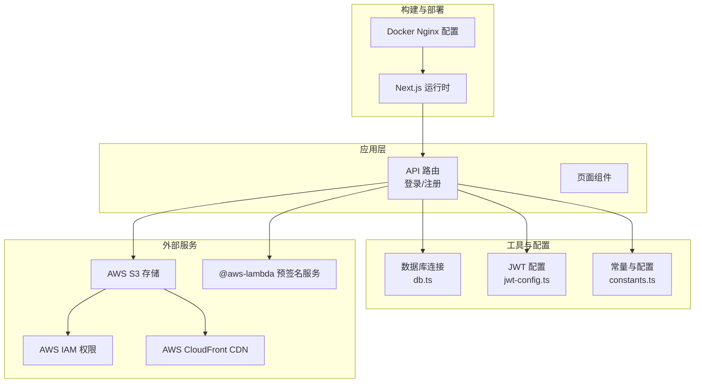
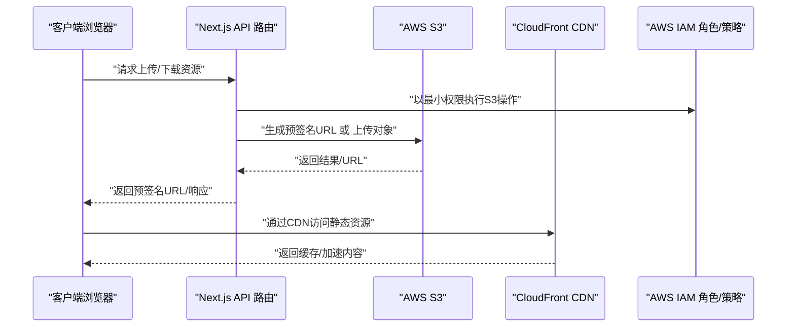
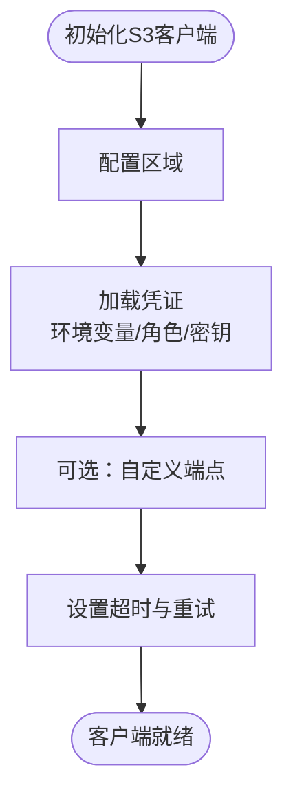
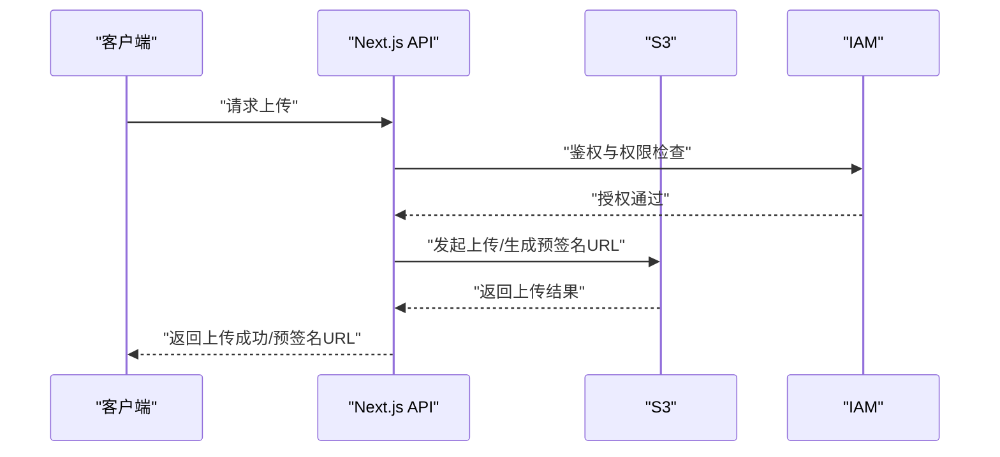
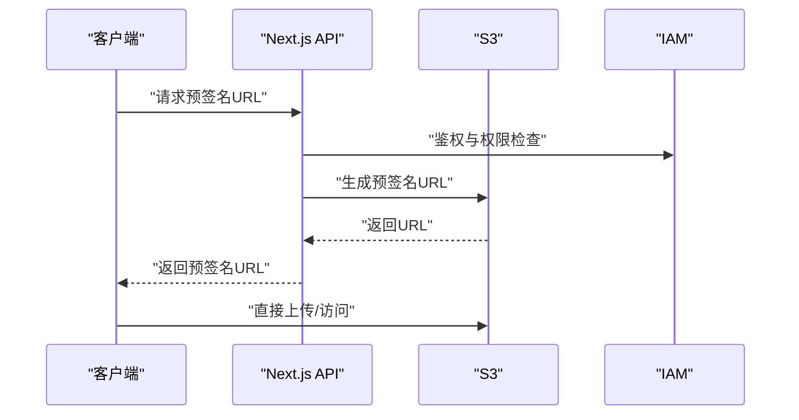
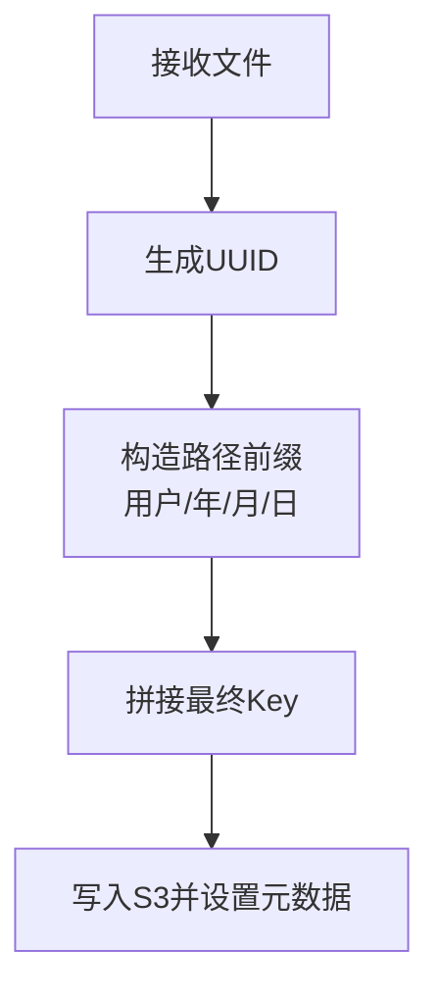
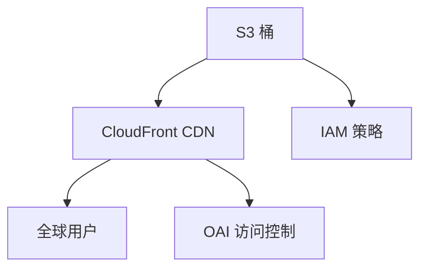
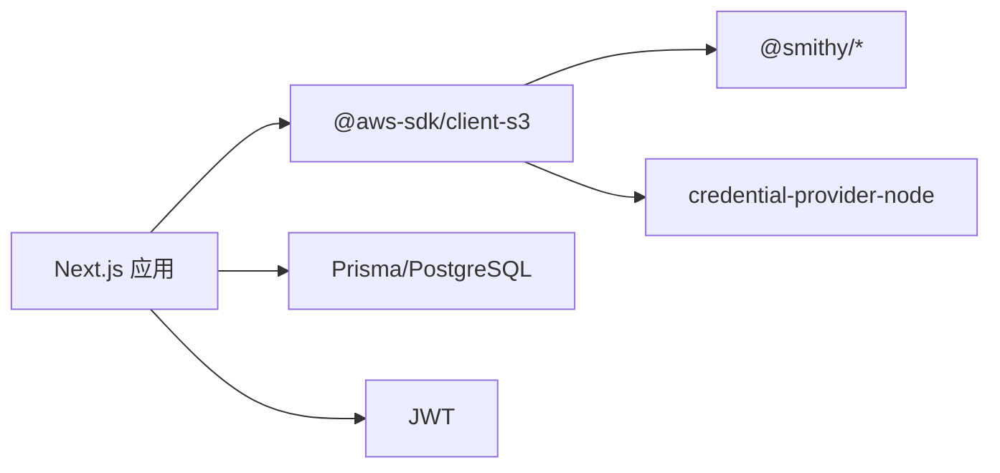

# AWS S3存储集成

<cite>
**本文档引用的文件**
- [package.json](file://package.json)
- [package-lock.json](file://package-lock.json)
- [src/lib/constants.ts](file://src/lib/constants.ts)
- [src/lib/db.ts](file://src/lib/db.ts)
- [src/lib/jwt-config.ts](file://src/lib/jwt-config.ts)
- [src/app/api/auth/login/route.ts](file://src/app/api/auth/login/route.ts)
- [src/app/api/auth/register/route.ts](file://src/app/api/auth/register/route.ts)
- [docker/nginx/nginx.conf](file://docker/nginx/nginx.conf)
- [next.config.ts](file://next.config.ts)
</cite>

## 目录
1. [简介](#简介)
2. [项目结构](#项目结构)
3. [核心组件](#核心组件)
4. [架构总览](#架构总览)
5. [详细组件分析](#详细组件分析)
6. [依赖关系分析](#依赖关系分析)
7. [性能考虑](#性能考虑)
8. [故障排除指南](#故障排除指南)
9. [结论](#结论)
10. [附录](#附录)

## 简介
本文件面向开发者，系统化阐述如何在当前项目中集成AWS S3存储，覆盖以下主题：
- S3桶配置、IAM权限与安全策略
- 文件上传流程、签名URL生成与预签名链接使用
- S3客户端初始化、连接配置与错误重试机制
- 文件命名策略、路径组织与元数据管理
- CDN集成、静态网站托管与全球访问优化
- 成本优化策略、生命周期管理与备份方案
- S3 SDK使用指南与最佳实践

需要特别说明的是：当前仓库中未发现直接的S3上传或签名URL实现代码。本文档基于现有依赖与通用实践进行设计与指导，帮助开发者在不破坏现有架构的前提下，安全、高效地接入S3。

## 项目结构
项目采用Next.js应用结构，核心目录与与S3集成相关的要点如下：
- 应用层：src/app/api 下的路由处理用户认证等业务逻辑
- 工具与配置：src/lib 下的数据库、JWT配置与常量定义
- 依赖声明：package.json 中包含 @aws-sdk/client-s3
- 构建与运行：next.config.ts、docker/nginx/nginx.conf 等

**图表来源**
- [src/app/api/auth/login/route.ts:1-76](file://src/app/api/auth/login/route.ts#L1-L76)
- [src/app/api/auth/register/route.ts:1-86](file://src/app/api/auth/register/route.ts#L1-L86)
- [src/lib/db.ts:1-17](file://src/lib/db.ts#L1-L17)
- [src/lib/jwt-config.ts:1-8](file://src/lib/jwt-config.ts#L1-L8)
- [src/lib/constants.ts:1-46](file://src/lib/constants.ts#L1-L46)
- [package.json:11-39](file://package.json#L11-L39)
- [docker/nginx/nginx.conf](file://docker/nginx/nginx.conf)
- [next.config.ts](file://next.config.ts)

**章节来源**
- [package.json:11-39](file://package.json#L11-L39)
- [src/lib/db.ts:1-17](file://src/lib/db.ts#L1-L17)
- [src/lib/jwt-config.ts:1-8](file://src/lib/jwt-config.ts#L1-L8)
- [src/lib/constants.ts:1-46](file://src/lib/constants.ts#L1-L46)
- [src/app/api/auth/login/route.ts:1-76](file://src/app/api/auth/login/route.ts#L1-L76)
- [src/app/api/auth/register/route.ts:1-86](file://src/app/api/auth/register/route.ts#L1-L86)
- [docker/nginx/nginx.conf](file://docker/nginx/nginx.conf)
- [next.config.ts](file://next.config.ts)

## 核心组件
- S3客户端与SDK依赖
  - 项目已声明 @aws-sdk/client-s3 作为生产依赖，可用于在服务端发起S3操作
  - 同时存在大量 @aws-sdk/* 与 @smithy/* 相关包，表明具备完整的SDK生态支持
- 数据库与认证
  - 使用 Prisma + PostgreSQL 进行用户与会话管理
  - JWT 用于会话令牌签发与校验
- API路由
  - 登录/注册路由负责用户身份验证与令牌下发，可作为触发S3操作的入口

**章节来源**
- [package.json:11-39](file://package.json#L11-L39)
- [package-lock.json:272-298](file://package-lock.json#L272-L298)
- [src/lib/db.ts:1-17](file://src/lib/db.ts#L1-L17)
- [src/lib/jwt-config.ts:1-8](file://src/lib/jwt-config.ts#L1-L8)
- [src/app/api/auth/login/route.ts:1-76](file://src/app/api/auth/login/route.ts#L1-L76)
- [src/app/api/auth/register/route.ts:1-86](file://src/app/api/auth/register/route.ts#L1-L86)

## 架构总览
下图展示从客户端到S3的典型数据流，包括签名URL生成与静态资源访问路径：

**图表来源**
- [package.json:12](file://package.json#L12)
- [src/app/api/auth/login/route.ts:13-76](file://src/app/api/auth/login/route.ts#L13-L76)
- [src/app/api/auth/register/route.ts:8-86](file://src/app/api/auth/register/route.ts#L8-L86)

## 详细组件分析

### S3客户端初始化与连接配置
- 客户端选择
  - 使用 @aws-sdk/client-s3 在服务端发起S3操作
  - 可结合 @aws-sdk/credential-provider-node 自动解析凭证
- 区域与端点
  - 建议显式指定区域，避免默认区域带来的延迟与合规风险
  - 如需自定义端点，可配合中间件或endpointResolver
- 传输与超时
  - 设置合理的超时时间与重试策略，确保在网络抖动场景下的稳定性
  - 对大文件上传启用分片上传与断点续传（建议在后续实现中引入）

[此图为概念性流程，无需图表来源]

**章节来源**
- [package.json:12](file://package.json#L12)
- [package-lock.json:272-298](file://package-lock.json#L272-L298)

### 文件上传到S3的完整流程
- 前置条件
  - 用户通过登录/注册路由完成身份验证，获得会话令牌
  - 服务端根据用户角色与权限决定其可访问的S3桶与前缀
- 流程步骤
  1) 客户端向Next.js API发起上传请求
  2) 服务端校验JWT与权限
  3) 服务端生成预签名URL或直接上传对象
  4) 将结果返回给客户端
- 大文件优化
  - 推荐使用分片上传与并发上传，提升吞吐与可靠性
  - 结合ETag与校验和，确保数据一致性

**图表来源**
- [src/app/api/auth/login/route.ts:13-76](file://src/app/api/auth/login/route.ts#L13-L76)
- [src/app/api/auth/register/route.ts:8-86](file://src/app/api/auth/register/route.ts#L8-L86)

**章节来源**
- [src/app/api/auth/login/route.ts:13-76](file://src/app/api/auth/login/route.ts#L13-L76)
- [src/app/api/auth/register/route.ts:8-86](file://src/app/api/auth/register/route.ts#L8-L86)

### 签名URL生成与预签名链接使用
- 适用场景
  - 大文件直传、临时访问控制、跨域上传
- 实现要点
  - 服务端生成带过期时间的预签名URL
  - 客户端直接向S3上传，降低服务端带宽压力
  - 严格限制HTTP方法、头部与条件
- 安全建议
  - 最小权限原则：仅授予必要操作
  - 短有效期：防止泄露后长期可用
  - 限定来源与IP白名单（如可行）

**图表来源**
- [package.json:12](file://package.json#L12)
- [src/app/api/auth/login/route.ts:13-76](file://src/app/api/auth/login/route.ts#L13-L76)

**章节来源**
- [package.json:12](file://package.json#L12)
- [src/app/api/auth/login/route.ts:13-76](file://src/app/api/auth/login/route.ts#L13-L76)

### 文件命名策略、路径组织与元数据管理
- 命名策略
  - 使用UUID作为唯一标识，避免冲突与暴露信息
  - 组合规则：用户ID/年/月/日/UUID_原始文件名
- 路径组织
  - 按租户/项目/类型划分前缀，便于权限与生命周期管理
- 元数据管理
  - 使用对象标签与自定义元数据字段，记录上传者、业务ID、分类等
  - 避免在Key中携带敏感信息

[此图为概念性流程，无需图表来源]

**章节来源**
- [src/lib/constants.ts:1-46](file://src/lib/constants.ts#L1-L46)

### CDN集成、静态网站托管与全球访问优化
- CloudFront集成
  - 作为S3的边缘缓存与加速层，显著降低延迟
  - 配置原点访问身份(OAI)与S3信任策略，确保只读访问
- 静态网站托管
  - 可将公开资源托管于S3静态网站，通过CloudFront分发
  - 配置自定义域名与HTTPS证书
- 全球访问优化
  - 利用CloudFront全球边缘节点就近分发
  - 合理设置缓存策略与压缩配置

[此图为概念性架构，无需图表来源]

**章节来源**
- [docker/nginx/nginx.conf](file://docker/nginx/nginx.conf)
- [next.config.ts](file://next.config.ts)

### 成本优化策略、生命周期管理与备份方案
- 成本优化
  - 选择合适的存储类别（标准/IA/智能分层）
  - 启用多版本与删除标记，减少误删成本
- 生命周期管理
  - 为不同前缀设置生命周期规则：转低频/归档/删除
- 备份方案
  - 同区域复制或跨区域复制，满足合规与灾备需求
  - 定期校验与快照策略，保障数据可恢复

[本节为通用实践总结，无需章节来源]

## 依赖关系分析
- S3 SDK依赖
  - @aws-sdk/client-s3 提供S3客户端能力
  - @aws-sdk/credential-provider-node 提供凭证解析
  - @smithy/* 提供底层网络与中间件支持
- 应用依赖
  - Next.js 路由与API处理
  - Prisma/PostgreSQL 用于用户与会话管理
  - JWT 用于会话令牌签发与校验

**图表来源**
- [package.json:11-39](file://package.json#L11-L39)
- [package-lock.json:272-298](file://package-lock.json#L272-L298)

**章节来源**
- [package.json:11-39](file://package.json#L11-L39)
- [package-lock.json:272-298](file://package-lock.json#L272-L298)

## 性能考虑
- 上传性能
  - 大文件采用分片上传与并发策略
  - 合理设置超时与重试，避免网络波动影响
- 缓存与分发
  - CloudFront缓存策略与压缩配置
  - 静态资源版本化与长缓存
- 安全与合规
  - 最小权限与短有效期签名
  - 传输加密与访问审计

[本节为通用指导，无需章节来源]

## 故障排除指南
- 常见问题
  - 凭证无效：检查环境变量与IAM角色绑定
  - 跨域失败：核对CORS配置与预检请求
  - 权限不足：确认桶策略与用户策略范围
  - 签名过期：缩短有效期或重新生成
- 日志与监控
  - 开启S3访问日志与CloudTrail事件
  - 在Next.js中统一捕获与记录错误

**章节来源**
- [src/lib/jwt-config.ts:1-8](file://src/lib/jwt-config.ts#L1-L8)
- [src/lib/db.ts:1-17](file://src/lib/db.ts#L1-L17)

## 结论
当前项目已具备接入S3的基础设施与依赖基础。建议在现有API路由基础上，按本文档的安全策略与最佳实践，逐步实现签名URL生成、分片上传与CDN加速，从而构建高性能、低成本、可扩展的云存储方案。

## 附录
- 环境变量建议
  - AWS_REGION、AWS_ACCESS_KEY_ID、AWS_SECRET_ACCESS_KEY
  - S3_BUCKET_NAME、S3_BUCKET_PREFIX
  - JWT_SECRET（已在项目中使用）
- 部署与运维
  - 使用Docker Nginx进行静态资源与反向代理
  - 结合Next.js构建与运行配置

**章节来源**
- [src/lib/jwt-config.ts:1-8](file://src/lib/jwt-config.ts#L1-L8)
- [docker/nginx/nginx.conf](file://docker/nginx/nginx.conf)
- [next.config.ts](file://next.config.ts)