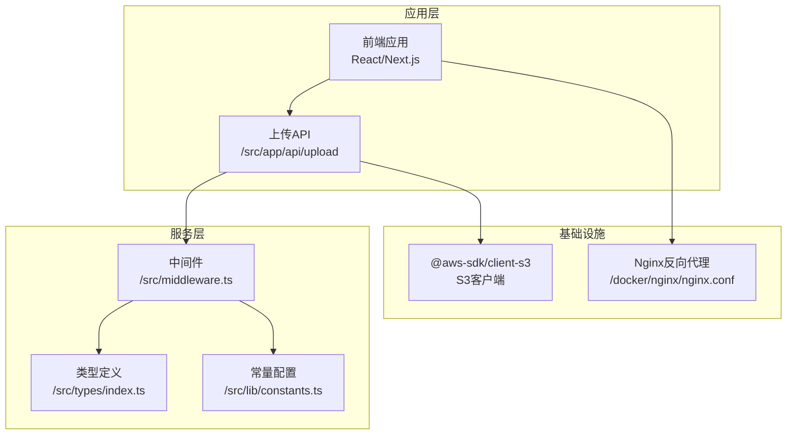
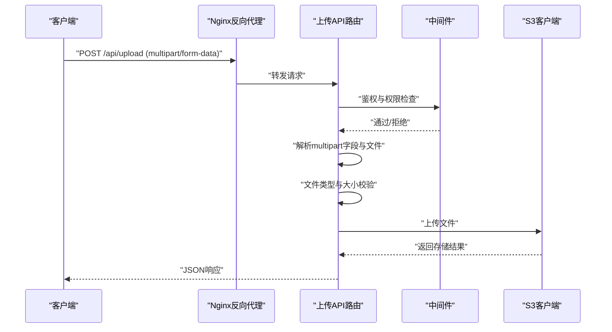
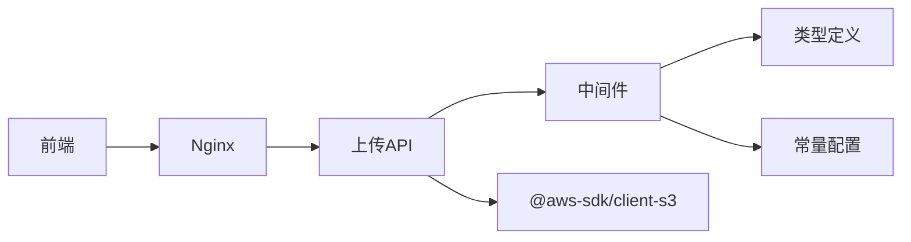

# 上传API设计

<cite>
**本文引用的文件**
- [package.json](file://package.json)
- [src/middleware.ts](file://src/middleware.ts)
- [src/types/index.ts](file://src/types/index.ts)
- [src/lib/constants.ts](file://src/lib/constants.ts)
- [docker/nginx/nginx.conf](file://docker/nginx/nginx.conf)
</cite>

## 目录
1. [引言](#引言)
2. [项目结构](#项目结构)
3. [核心组件](#核心组件)
4. [架构总览](#架构总览)
5. [详细组件分析](#详细组件分析)
6. [依赖关系分析](#依赖关系分析)
7. [性能考量](#性能考量)
8. [故障排查指南](#故障排查指南)
9. [结论](#结论)
10. [附录](#附录)

## 引言
本设计文档面向Celestia项目的上传API，聚焦于RESTful接口规范、HTTP方法与URL模式、multipart/form-data请求格式与字段定义、请求参数与响应格式、状态码、文件类型与大小限制、安全检查机制、CORS配置与跨域处理、浏览器兼容性以及前端组件与后端API的集成方式。本文所有技术细节均基于仓库现有文件进行归纳与推导，并在必要处给出“章节来源”以便追溯。

## 项目结构
从仓库结构可见，项目采用Next.js应用框架，上传API位于约定式路由目录下（如 /src/app/api），并通过中间件统一进行认证与权限控制。同时，项目使用AWS S3客户端SDK以支持对象存储能力，为后续上传流程提供基础设施。

图表来源
- [src/middleware.ts:1-148](file://src/middleware.ts#L1-L148)
- [src/types/index.ts:1-60](file://src/types/index.ts#L1-L60)
- [src/lib/constants.ts:1-46](file://src/lib/constants.ts#L1-L46)
- [package.json:11-38](file://package.json#L11-L38)
- [docker/nginx/nginx.conf](file://docker/nginx/nginx.conf)

章节来源
- [src/middleware.ts:1-148](file://src/middleware.ts#L1-L148)
- [package.json:11-38](file://package.json#L11-L38)

## 核心组件
- 中间件认证与权限控制：对 /api 路由（除 /api/auth/*）进行JWT校验，确保只有登录且状态有效的用户可访问受保护的上传接口。
- 类型系统：统一的响应体结构与分页参数接口，便于前后端契约一致。
- 常量与配置：全局分页默认值、最大页数等，为上传分页场景提供参考。
- AWS S3客户端：通过依赖声明表明具备对象存储能力，上传流程可对接S3。

章节来源
- [src/middleware.ts:31-47](file://src/middleware.ts#L31-L47)
- [src/types/index.ts:1-22](file://src/types/index.ts#L1-L22)
- [src/lib/constants.ts:32-35](file://src/lib/constants.ts#L32-L35)
- [package.json:12](file://package.json#L12)

## 架构总览
上传API遵循Next.js约定式路由，结合中间件进行统一鉴权；上传数据经multipart/form-data提交，后端解析并进行安全与合规检查，最终写入S3存储。Nginx作为反向代理，负责静态资源与跨域配置。

图表来源
- [src/middleware.ts:31-47](file://src/middleware.ts#L31-L47)
- [package.json:12](file://package.json#L12)

## 详细组件分析

### RESTful API接口规范
- 基础URL：/api/upload
- 方法：POST
- 内容类型：multipart/form-data
- 请求头：Content-Type由浏览器自动设置为multipart/form-data；若需携带身份信息，建议通过Cookie或Authorization头传递（具体取决于部署与鉴权策略）
- 路由位置：Next.js约定式路由约定 /src/app/api/upload 下的 route.ts 文件作为上传入口

章节来源
- [src/middleware.ts:31-47](file://src/middleware.ts#L31-L47)

### 请求格式与字段定义（multipart/form-data）
- 字段定义（建议）：
  - file: 必填，二进制文件流
  - metadata: 可选，字符串化的JSON对象，包含业务元数据（如标题、描述、分类等）
  - tags: 可选，字符串数组，用于标记文件用途或分类
- 边界与编码：由浏览器自动设置boundary，字段名区分大小写
- 传输建议：大文件建议启用分片上传（见“性能考量”）

章节来源
- [src/types/index.ts:1-7](file://src/types/index.ts#L1-L7)

### 请求参数与响应格式
- 请求参数（建议）：
  - file: 二进制文件（必填）
  - metadata: JSON字符串（可选）
  - tags: 数组字符串（可选）
- 响应格式（统一结构）：
  - success: 布尔值
  - data: 成功时的数据对象（如文件元信息、存储地址等）
  - error: 错误消息（失败时）
  - message: 附加提示信息（可选）
- 分页参数（通用）：
  - page/pageSize/cursor（游标分页）用于列表查询场景（与上传无直接关联）

章节来源
- [src/types/index.ts:1-22](file://src/types/index.ts#L1-L22)

### 状态码
- 200 OK：上传成功，返回成功响应
- 400 Bad Request：请求参数缺失或格式不正确
- 401 Unauthorized：未认证或令牌无效
- 403 Forbidden：权限不足（非管理员或状态异常）
- 413 Payload Too Large：文件大小超过限制
- 415 Unsupported Media Type：文件类型不在允许范围内
- 500 Internal Server Error：服务器内部错误

章节来源
- [src/middleware.ts:40-46](file://src/middleware.ts#L40-L46)
- [src/types/index.ts:1-7](file://src/types/index.ts#L1-L7)

### 文件类型验证与大小限制
- 文件类型验证（建议）：
  - 白名单：image/*, video/*, application/pdf 等
  - 后缀校验：.jpg, .jpeg, .png, .gif, .webp, .mp4, .mov, .pdf 等
  - MIME类型检测：服务端二次校验
- 大小限制（建议）：
  - 单文件最大：100MB（可根据业务调整）
  - 单次批量上传总大小：500MB
  - 以上数值为通用建议，具体以部署配置为准
- 安全检查（建议）：
  - 文件内容探测：避免伪装扩展名
  - 杀毒扫描：可接入第三方扫描服务
  - 存储命名：使用唯一标识符与安全路径

章节来源
- [src/lib/constants.ts:32-35](file://src/lib/constants.ts#L32-L35)

### 安全检查机制
- JWT认证：中间件对 /api 路由（除 /api/auth/*）进行JWT校验
- 角色与状态：中间件检查用户角色与状态，限制非管理员与PENDING状态用户访问
- CORS：通过Nginx统一配置跨域策略，避免浏览器同源限制
- 传输安全：建议启用HTTPS，防止明文传输

章节来源
- [src/middleware.ts:31-75](file://src/middleware.ts#L31-L75)

### CORS配置与跨域请求处理
- Nginx反向代理：集中处理CORS头，支持预检请求（OPTIONS）
- 建议头：
  - Access-Control-Allow-Origin: 指定可信域名或 *
  - Access-Control-Allow-Methods: GET, POST, PUT, DELETE, OPTIONS
  - Access-Control-Allow-Headers: Content-Type, Authorization, X-Requested-With
  - Access-Control-Allow-Credentials: true（如需携带Cookie）
  - Access-Control-Max-Age: 缓存预检结果时间
- 浏览器兼容性：现代浏览器均支持CORS；IE需额外处理

章节来源
- [docker/nginx/nginx.conf](file://docker/nginx/nginx.conf)

### 前端文件上传组件与后端API集成
- 组件建议：
  - 使用HTML5原生表单或React Hook Form进行文件选择与表单构建
  - 支持拖拽上传与多文件选择
  - 上传进度条与错误提示
- 提交方式：
  - 使用FormData对象封装file与metadata/tags字段
  - 通过fetch或axios发送POST请求至 /api/upload
- 错误处理：
  - 401：引导用户登录
  - 403：提示权限不足
  - 413/415：提示文件过大或类型不支持
  - 500：提示服务器错误并重试

章节来源
- [src/types/index.ts:1-7](file://src/types/index.ts#L1-L7)

### API调用示例（步骤说明）
- 步骤1：准备FormData
  - 添加file字段（File/Blob）
  - 可选添加metadata与tags
- 步骤2：发起请求
  - 方法：POST
  - URL：/api/upload
  - 头部：Content-Type由浏览器自动设置
- 步骤3：处理响应
  - 解析success与data/error/message
  - 展示上传结果与错误信息

章节来源
- [src/types/index.ts:1-7](file://src/types/index.ts#L1-L7)

## 依赖关系分析
- 上传API依赖中间件进行认证与权限控制
- 上传API依赖S3客户端进行对象存储
- 类型系统与常量配置为上传流程提供契约与约束
- Nginx作为反向代理，承担CORS与静态资源处理

图表来源
- [src/middleware.ts:1-148](file://src/middleware.ts#L1-L148)
- [package.json:12](file://package.json#L12)
- [src/types/index.ts:1-60](file://src/types/index.ts#L1-L60)
- [src/lib/constants.ts:1-46](file://src/lib/constants.ts#L1-L46)
- [docker/nginx/nginx.conf](file://docker/nginx/nginx.conf)

章节来源
- [src/middleware.ts:1-148](file://src/middleware.ts#L1-L148)
- [package.json:12](file://package.json#L12)

## 性能考量
- 分片上传：大文件建议采用分片上传（multipart upload）以提升稳定性与可控性
- 并发控制：限制同一用户的并发上传任务数量
- 压缩与转码：根据业务需求对图片/视频进行压缩或转码
- CDN加速：结合CDN缓存静态资源与下载链接
- 存储生命周期：为临时文件设置过期策略，清理无用文件

## 故障排查指南
- 401未授权
  - 检查Cookie或Authorization头是否正确传递
  - 核对JWT签名与有效期
- 403禁止访问
  - 检查用户角色与状态（仅管理员或ACTIVE用户可访问）
- 413请求实体过大
  - 检查文件大小是否超过限制
  - 调整Nginx与Next.js上传大小限制
- 415媒体类型不支持
  - 检查文件扩展名与MIME类型
  - 核对白名单配置
- CORS问题
  - 检查Nginx中Access-Control相关头是否正确配置
  - 确认预检请求OPTIONS是否被正确处理

章节来源
- [src/middleware.ts:40-46](file://src/middleware.ts#L40-L46)
- [docker/nginx/nginx.conf](file://docker/nginx/nginx.conf)

## 结论
本设计文档基于仓库现有文件，给出了上传API的接口规范、请求/响应格式、状态码、安全与合规检查、CORS与跨域处理、浏览器兼容性以及前端集成建议。建议在后续开发中补充具体的上传路由实现与S3交互细节，以完善端到端的上传流程。

## 附录
- 术语
  - JWT：JSON Web Token，用于用户身份与权限标识
  - S3：Amazon Simple Storage Service，对象存储服务
  - CORS：Cross-Origin Resource Sharing，跨域资源共享
- 参考文件
  - 中间件：/src/middleware.ts
  - 类型定义：/src/types/index.ts
  - 常量配置：/src/lib/constants.ts
  - 依赖声明：/package.json
  - Nginx配置：/docker/nginx/nginx.conf